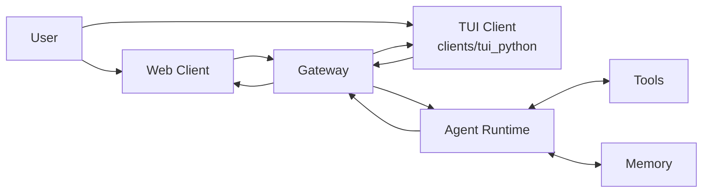
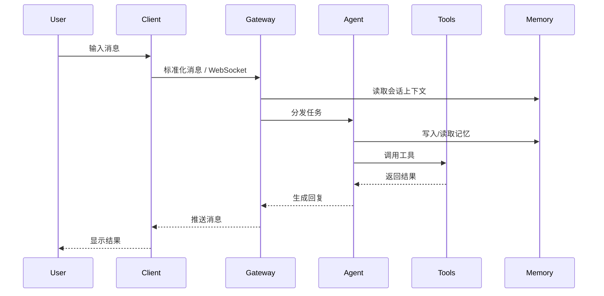
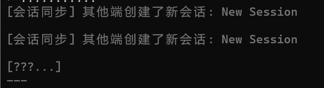
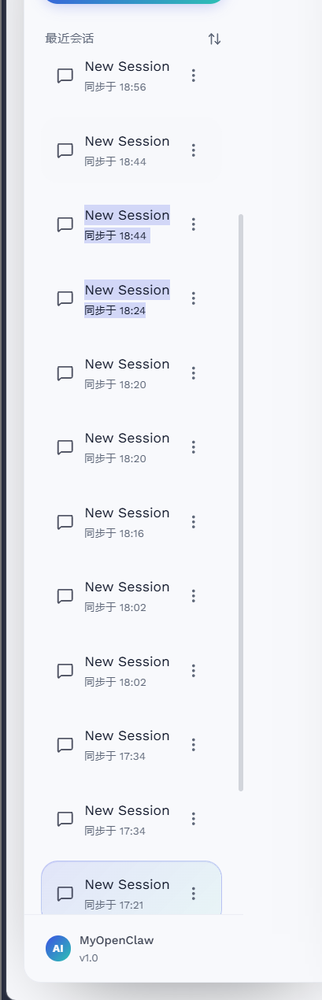
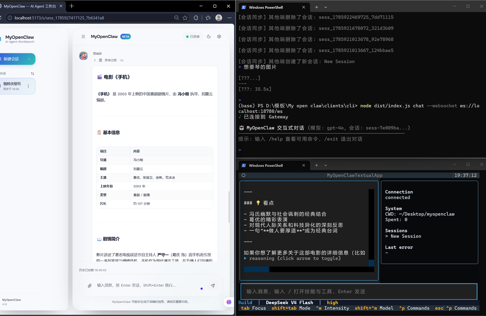
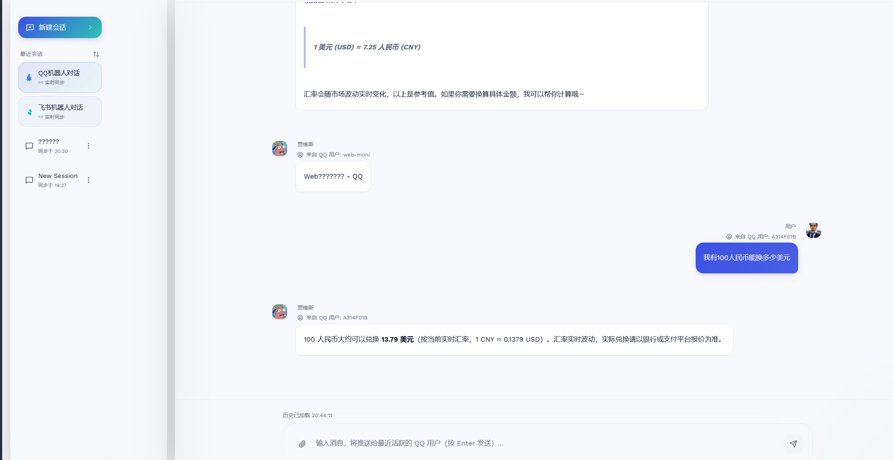

# My Open Claw

My Open Claw 是一个本地优先、双端协同的 AI Agent 项目，当前已形成 Web 端、`clients/tui_python` Python TUI 端、Gateway 网关、Tools 工具层、Memory 记忆层与共享协议的完整工作链路。项目重点围绕会话管理、消息同步、工具调用、思考过程展示、实时查询与可扩展接入展开，适合本地联调、演示和继续扩展。

## 现状概览

- Web 端负责浏览器聊天、会话切换、思考过程展示、命令入口与设置页交互。
- TUI 端位于 `clients/tui_python`，使用 Python + Textual 实现终端聊天界面，原 `clients/tui` 已废弃，不再使用。
- Gateway 负责 WebSocket / HTTP 通信、会话路由、消息转发、同步与工具调用编排。
- Tools 层已接入时间、天气、汇率、节假日、新闻、加密货币等实用能力。
- Memory 层承担会话记忆、历史持久化和后续扩展基础。
- `docs/` 下已有较完整的模块说明、架构说明、API 文档与开发手册。

## 架构图



## 核心数据流



## 已实现功能

### 会话与消息

- 支持新建、切换、加载历史会话。
- 会话标题可自动生成，也支持后续改名。
- 消息按角色区分展示，用户、助手、工具、系统内容有明确边界。
- 支持消息时间戳、错误状态、流式状态与工具调用记录。

### 双端同步

- Web 端与 TUI 端可通过 Gateway 共享会话。
- 支持历史同步与增量消息同步。
- 当前已修正角色混淆问题，避免用户消息与助手回复混为一谈。

### 思考过程展示

- 助手回复支持思考过程展开与隐藏。
- Web 端与 TUI 端均支持点击控制。

### 命令与技能入口

- 输入 `/` 可唤出技能/工具面板。
- `Ctrl + P` 可打开命令列表。
- 面板支持上下选择与进一步执行。

### 实用工具

- `system/time`：当前时间查询。
- `weather/current`、`weather/forecast`、`weather/lookup`：天气查询与城市搜索。
- `utility/exchange_rate`：汇率查询。
- `utility/holidays`：节假日查询。
- `utility/top_news`：热点新闻查询。
- `utility/crypto_price`：加密货币行情查询。

## 目录结构

```text
server/            Gateway、Agent、Tools、Memory、Session、HTTP/WebSocket
clients/web/       React + Vite Web 客户端
clients/tui_python/ Python + Textual TUI 客户端
shared/            共享类型与同步配置
docs/              架构、API、开发、使用、术语、变更文档
config/            环境与渠道配置样例
```

## 关键文件

- `clients/web/src/App.tsx`：Web 路由与页面挂载。
- `clients/web/src/components/chat/MessageBubble.tsx`：消息气泡、头像、昵称、思考过程展示。
- `clients/web/src/hooks/useChat.ts`：聊天状态与消息流处理。
- `clients/tui_python/src/tui_python/app.py`：TUI 主入口。
- `clients/tui_python/src/tui_python/chat_state.py`：TUI 聊天状态管理。
- `server/src/gateway/`：网关与同步核心。
- `server/src/memory/`：会话持久化与记忆处理。
- `server/src/services/`：时间、天气等工具服务。

## 启动方式

### 1. 安装依赖

```powershell
pnpm install
```

### 2. 启动 Gateway

```powershell
cd "D:\模板\My open claw\server"
pnpm dev
```

默认地址：

```text
http://127.0.0.1:18780
ws://127.0.0.1:18780/ws
```

### 3. 启动 Web 端

```powershell
cd "D:\模板\My open claw\clients\web"
pnpm dev
```

默认地址：

```text
http://localhost:5173/
```

### 4. 启动 TUI 端

```powershell
cd "D:\模板\My open claw\clients\tui_python"
python -m pip install -e .
myopenclaw-tui --gateway ws://127.0.0.1:18780/ws
```

## 页面展示

### Web 首页



### Web 对话页



### 思考过程展开



### TUI 界面



## 项目完成度判断

整体来看，项目已经不是简单原型，而是一个具备真实联调能力的双端 AI Agent 工程。

- 核心对话链路已可用。
- 双端同步与会话管理已具备实用价值。
- 工具层已能提供时间、天气、汇率等查询能力。
- 记忆与网关层已为后续功能扩展打好基础。

### 运行状态补充

- Web 端当前已有完整聊天页入口、设置路由、消息气泡与思考过程交互。
- TUI 端当前以 `clients/tui_python` 为主，具备启动页、聊天页、命令面板、slash 面板与状态栏。
- `clients/tui` 已废弃，README 和后续文档都应以 `clients/tui_python` 为准。
- 服务端已具备时间查询接口与其他实用工具接口，适合作为双端共享能力源。

### 已知限制

- 当前 README 仅展示项目主干，未把 `docs/` 内每个模块文档逐一展开。
- TUI 端的界面截图已保留，但若后续界面调整，需要同步更新 `.codex-assets/`。
- Web 与 TUI 的同步机制已打通，但仍建议继续增加端到端回归测试，防止角色混淆重新出现。

## 文档导读

- `docs/00-项目总览.md`：全局概览。
- `docs/01-架构设计文档.md`：系统架构与数据流。
- `docs/02-快速入门指南.md`：本地启动与联调。
- `docs/03-Gateway网关模块.md`：网关职责与协议。
- `docs/06-Tools工具与技能模块.md`：工具与技能能力。
- `docs/07-Memory记忆模块.md`：记忆与持久化。
- `docs/17-Web客户端模块.md`：Web 端实现说明。
- `docs/18-TUI客户端模块.md`：TUI 端实现说明。

## 备注

- 本仓库已将截图放入 `.codex-assets/`，可直接用于 README 展示。
- `clients/tui_python/README.md` 和 `docs/` 中已有更细的模块说明，本文件聚焦项目整体概览。
