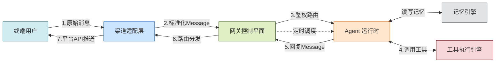

# MyOpenClaw 架构设计文档

> **版本**：v1.0.1  
> **修订日期**：2026-07-23  
> **修订人**：MyOpenClaw Core Team  
> **文档状态**：正式发布（已同步 Fastify 迁移）

---

## 目录

- [1. 架构概览](#1-架构概览)
- [2. Hub-Spoke 六层架构](#2-hub-spoke-六层架构)
- [3. 源码目录结构](#3-源码目录结构)
- [4. 核心设计思想](#4-核心设计思想)
- [5. 模块间依赖关系](#5-模块间依赖关系)
- [6. 全局业务流程](#6-全局业务流程)
- [7. 数据流详解](#7-数据流详解)
- [8. 架构决策记录](#8-架构决策记录)

---

## 1. 架构概览

MyOpenClaw 采用 **Hub-Spoke（中枢-辐射）** 架构模式，以 Gateway 网关为中枢，Channels 渠道、Clients 客户端、Agent Runtime、Tools 工具、Memory 记忆为辐射节点。所有节点之间的通信必须经过网关中转，节点之间不存在直接调用关系。客户端层（Web、TUI、CLI）作为用户直接交互的入口，与 Channels 渠道层并行接入 Gateway，共同构成系统的外部边界。

这种架构选择带来了三个直接收益：

1. **统一管控** — 安全、路由、状态、审计集中在一个节点处理，避免分散管理导致的状态不一致
2. **松耦合** — 各节点独立演进，新增或替换节点不影响其他节点
3. **可观测性** — 全链路流量经过单一中枢，日志和监控天然完整

---

## 2. Hub-Spoke 六层架构

系统自上而下分为六层，每层职责单一、边界清晰：

```
┌──────────────────────────────────────────────────────────────┐
│  第一层：Clients 客户端层（用户交互界面）                      │
│  职责：提供 Web 浏览器界面、终端 TUI 界面、命令行 CLI 工具      │
│  协议：WebSocket / HTTP（直连 Gateway）                       │
│  技术：React/Vue（Web）、Ink（TUI）、Commander（CLI）         │
├──────────────────────────────────────────────────────────────┤
│  第二层：Channels 渠道接入层（IO 外层）                        │
│  职责：封装所有外部消息渠道，屏蔽平台 API 差异                  │
│  输出：标准化 Message 消息结构体                               │
│  接口：ChannelProvider                                        │
├──────────────────────────────────────────────────────────────┤
│  第三层：Gateway 网关层（全局中枢控制平面）                     │
│  职责：鉴权、消息归一、路由分发、会话管理、状态调度、           │
│        安全限流、定时任务、审计日志                             │
│  框架：Fastify + @fastify/websocket（单端口 18780）           │
├──────────────────────────────────────────────────────────────┤
│  第四层：Agent Runtime 智能体运行时（推理大脑）                 │
│  职责：Lobster 自主循环、LLM 调用、任务拆解、工具编排           │
│  核心：Orchestrator + Planner + LLM Adapter                   │
├──────────────────────────────────────────────────────────────┤
│  第五层：Skill/Tools 工具执行层（原子能力）                    │
│  职责：文件操作、Shell 执行、浏览器自动化、网络请求、           │
│        记忆检索等本地原子能力                                   │
│  管理：ToolRegistry 工具注册中心                               │
├──────────────────────────────────────────────────────────────┤
│  第六层：Memory 持久存储层（上下文底座）                       │
│  职责：短期会话记忆、长期向量记忆、配置持久化、                 │
│        Agent 运行状态缓存                                      │
│  存储：本地 JSON / 轻量数据库 / 向量数据库                     │
└──────────────────────────────────────────────────────────────┘
```

### 2.1 Channels 渠道接入层

渠道接入层是系统与外部世界的 IO 边界。它的核心职责是将异构消息平台（Telegram、Discord、飞书、微信、WebUI、CLI 等）的私有消息格式，统一转换为框架内部的标准 `Message` 结构体。

每个渠道实现统一的 `ChannelProvider` 接口，包含启动连接、停止连接、下发消息、监听上行消息四个核心方法。渠道层只与 Gateway 通信，不直接对接 Agent 或工具层。

详细设计参阅 [04-Channels渠道模块](04-Channels渠道模块.md)。

### 2.2 Gateway 网关层

网关层是系统的唯一常驻守护进程和全流量必经节点。它基于 **Fastify** 框架构建，通过 `@fastify/websocket` 插件在同一端口上提供 WebSocket 和 HTTP 双协议服务。它承担六项核心职责：

| 职责 | 说明 |
|------|------|
| 鉴权 | 校验请求来源合法性，Token 认证 |
| 消息归一 | 将渠道层传入的标准化消息进一步补充会话元数据 |
| 路由分发 | 按渠道 ID + 用户 ID 匹配绑定 Agent 实例 |
| 会话管理 | 会话持久绑定，重启不丢失上下文 |
| 全局状态 | 渠道连接状态、Agent 运行状态、任务队列统一托管 |
| 安全限流 | 频率限制、命令沙箱隔离、输入 Schema 校验、危险操作拦截 |

此外，网关还内置 Cron 定时任务调度器和全链路审计日志模块。

详细设计参阅 [03-Gateway网关模块](03-Gateway网关模块.md)。

### 2.3 Agent Runtime 智能体运行时

Agent Runtime 是 AI 决策核心，实现标准的自主 Agent 闭环。它包含三个核心子模块：

- **Lobster Orchestrator（主循环调度器）** — 驱动 `感知 → 思考 → 规划 → 执行 → 观察 → 反思` 六阶段循环，维护 Agent 状态机（空闲 / 思考 / 执行 / 异常）
- **Planner（任务规划引擎）** — 基于 CoT 思维链将自然语言需求拆解为有序子任务，对 LLM 输出动作做安全校验
- **LLM Adapter（多模型适配器）** — 统一封装 OpenAI、Claude、DeepSeek、本地开源模型接口，切换模型无需修改 Agent 核心逻辑

详细设计参阅 [05-Agent运行时模块](05-Agent运行时模块.md)。

### 2.4 Skill/Tools 工具执行层

工具执行层区分两个概念：

- **Tool（底层工具）** — TypeScript 可执行代码，提供文件读写、Shell 执行、浏览器自动化、记忆检索、网络请求等原子能力。由 `ToolRegistry` 注册中心统一管理，供 LLM 直接调用。
- **Skill（业务技能）** — 以 `SKILL.md` Markdown 文件定义的场景化能力描述，无需编写代码。描述业务能力、入参、使用场景，自动注入 LLM 系统提示词，引导 Agent 组合多个 Tool 完成复合业务任务。

详细设计参阅 [06-Tools工具与技能模块](06-Tools工具与技能模块.md)。

### 2.5 Memory 持久存储层

记忆层提供三级存储能力：

| 层级 | 类型 | 生命周期 | 用途 |
|------|------|----------|------|
| 短期 | Session 会话记忆 | 单次会话 | 当前对话上下文、任务中间状态 |
| 长期 | Vector 向量记忆 | 永久 | 历史对话向量化存储，跨会话语义检索 |
| 持久 | Persist 持久化层 | 永久 | 配置、会话、记忆、执行记录的本地存储 |

网关和 Agent 重启时自动从持久化层加载历史数据。向量检索能力封装为内置 Tool，Agent 可主动调取历史信息。

详细设计参阅 [07-Memory记忆模块](07-Memory记忆模块.md)。

---

## 3. 源码目录结构

> 以下目录结构严格对齐 `/Users/crazyhusky/Desktop/slg-2026/myopenclaw` 仓库的真实组织。仓库采用 **server / clients 双包并列** 的多包布局，所有 TypeScript 源码、配置模板、业务技能与构建产物均位于 `server/` 子包中，客户端各端（Web / TUI / CLI）在 `clients/` 下各自独立成包。

```
myopenclaw/                              # 仓库根目录
├── server/                              # 服务端核心包（Gateway / Channels / Agents / Tools / Skills / Memory / Core / Hooks）
│   ├── src/                             # TypeScript 源码（开发态主目录）
│   │   ├── index.ts                     # 服务端统一入口
│   │   ├── core/                        # 公共基础模块（配置、日志、类型、错误、Schema、常量、工具函数、消息定义）
│   │   │   ├── config.ts                # 配置加载
│   │   │   ├── constants.ts             # 全局常量
│   │   │   ├── errors.ts                # 统一错误类型
│   │   │   ├── logger.ts                # 日志器
│   │   │   ├── message.ts               # 统一 Message 消息定义
│   │   │   ├── types.ts                 # 公共类型定义
│   │   │   ├── utils.ts                 # 工具函数
│   │   │   ├── index.ts                 # Core 模块聚合导出
│   │   │   └── schema/                  # TypeBox/Zod 数据校验 Schema
│   │   │       └── index.ts
│   │   ├── gateway/                     # 网关核心模块（基于 Fastify）
│   │   │   ├── server.ts                # Fastify WebSocket/HTTP 服务入口
│   │   │   ├── index.ts                 # Gateway 模块聚合导出
│   │   │   ├── router/                  # 消息路由、会话绑定、权限校验
│   │   │   ├── state/                   # 全局状态管理器
│   │   │   ├── security/                # 鉴权、限流、沙箱安全、输入校验
│   │   │   ├── audit/                   # 操作日志、审计
│   │   │   └── scheduler/               # Cron 定时任务调度
│   │   ├── channels/                    # 全渠道适配器
│   │   │   ├── base.ts                  # ChannelProvider 统一接口定义
│   │   │   ├── index.ts                 # 渠道聚合导出
│   │   │   ├── webchat/                 # WebUI 渠道实现
│   │   │   ├── cli/                     # 终端 CLI 渠道实现
│   │   │   ├── telegram/                # Telegram 渠道实现
│   │   │   ├── discord/                 # Discord 渠道实现
│   │   │   └── feishu/                  # 飞书渠道实现
│   │   ├── agents/                      # Agent 智能体运行时核心
│   │   │   ├── orchestrator.ts          # 主循环调度器 Lobster Loop
│   │   │   ├── planner.ts               # 任务规划引擎 CoT 思维链拆解
│   │   │   ├── index.ts                 # Agent 模块聚合导出
│   │   │   ├── llm/                     # 多模型适配器（OpenAI/Claude/DeepSeek/本地）
│   │   │   └── loop/                    # ReAct 感知-思考-执行闭环
│   │   ├── tools/                       # 底层可执行工具
│   │   │   ├── registry.ts              # 工具注册中心
│   │   │   ├── index.ts                 # Tools 模块聚合导出
│   │   │   ├── browser/                 # 浏览器自动化工具
│   │   │   ├── fs/                      # 文件读写工具
│   │   │   ├── exec/                    # Shell 命令执行工具
│   │   │   ├── http/                    # HTTP 请求工具
│   │   │   └── memory_search/           # 记忆检索工具
│   │   ├── skills/                      # 技能描述框架（加载器、注册表、类型定义）
│   │   │   ├── types.ts                 # 技能类型定义
│   │   │   ├── loader.ts                # SKILL.md 加载器
│   │   │   ├── registry.ts              # 技能注册中心
│   │   │   └── index.ts                 # Skills 模块聚合导出
│   │   ├── memory/                      # 持久记忆存储引擎
│   │   │   ├── session.ts               # 会话短期上下文
│   │   │   ├── vector.ts                # 长期向量记忆
│   │   │   ├── embedding.ts             # Embedding 计算
│   │   │   ├── persist.ts               # 本地文件/数据库持久化
│   │   │   └── index.ts                 # Memory 模块聚合导出
│   │   └── hooks/                       # 生命周期钩子（消息前置/后置拦截）
│   │       ├── types.ts                 # 钩子类型定义
│   │       ├── registry.ts              # 钩子注册中心
│   │       └── index.ts                 # Hooks 模块聚合导出
│   ├── dist/                            # TypeScript 编译产物（与 src/ 同构，含 .js / .d.ts / .map）
│   │   ├── index.js / index.d.ts        # 编译后入口
│   │   ├── core/  channels/  agents/  gateway/  hooks/  memory/  skills/  tools/
│   │   └── （每个目录与 src/ 一一对应，含聚合入口与各子模块产物）
│   ├── config/                          # 配置模板（YAML）
│   │   ├── config.yaml                  # 主配置入口
│   │   ├── agents/                      # Agent 默认配置
│   │   │   └── default.yaml
│   │   └── channels/                    # 各渠道配置
│   │       ├── webchat.yaml
│   │       ├── telegram.yaml
│   │       ├── discord.yaml
│   │       └── feishu.yaml
│   ├── skills/                          # 业务技能库（SKILL.md 描述式技能）
│   │   ├── README.md                    # 技能库说明
│   │   └── examples/                    # 示例技能集合
│   │       ├── web-search/SKILL.md      # 网络搜索技能
│   │       ├── daily-summary/SKILL.md   # 每日总结技能
│   │       └── text-translation/SKILL.md# 文本翻译技能
│   ├── tests/                           # 测试用例（与 src/ 模块划分对应）
│   │   ├── unit/                        # 单元测试
│   │   ├── integration/                 # 集成测试
│   │   └── e2e/                         # 端到端测试
│   ├── scripts/                         # 构建与运维脚本
│   │   ├── bootstrap.sh                 # 初始化引导
│   │   ├── dev.sh                       # 开发环境启动
│   │   └── start.sh                     # 生产环境启动
│   ├── docs/                            # 服务端子文档目录
│   │   └── README.md
│   ├── Dockerfile                       # 服务端容器化构建文件
│   ├── package.json                     # 服务端 npm 包定义（含 build / dev / start / test / lint / gateway 等脚本）
│   ├── tsconfig.json                    # TypeScript 编译配置
│   └── README.md                        # 服务端项目说明（含完整骨架描述）
│
├── clients/                             # 客户端层（用户交互界面，三端独立 npm 包）
│   ├── web/                             # Web 前端客户端（React + Vite）
│   │   ├── src/
│   │   │   ├── api/                     # Gateway API 封装
│   │   │   ├── components/              # UI 组件
│   │   │   ├── pages/                   # 页面路由
│   │   │   ├── stores/                  # 状态管理
│   │   │   ├── App.tsx                  # React 应用根组件
│   │   │   └── main.tsx                 # 应用入口
│   │   ├── index.html                   # Vite 入口 HTML
│   │   ├── package.json
│   │   ├── tsconfig.json
│   │   └── vite.config.ts
│   ├── tui/                             # 终端 UI 客户端（Ink）
│   │   ├── src/
│   │   │   ├── api/                     # Gateway API 封装
│   │   │   ├── components/              # Ink 组件
│   │   │   ├── screens/                 # 界面视图
│   │   │   └── main.ts                  # 入口
│   │   ├── package.json
│   │   └── tsconfig.json
│   └── cli/                             # CLI 命令行客户端（Commander）
│       ├── src/
│       │   ├── api/                     # Gateway API 封装
│       │   ├── commands/                # 子命令实现
│       │   ├── utils/                   # 工具函数
│       │   └── main.ts                  # 入口
│       ├── package.json
│       └── tsconfig.json
│
├── .dockerignore                        # Docker 构建忽略规则
├── .editorconfig                        # 编辑器风格统一配置
├── .env.example                         # 环境变量模板（被 server 与 clients 共同引用）
├── .eslintrc.json                       # ESLint 代码规范配置
├── .gitignore                           # Git 忽略规则
└── .prettierrc.json                     # Prettier 格式化配置
```

---

## 4. 核心设计思想

### 4.1 网关中心化

所有内外流量统一收敛到 Gateway，由网关集中处理安全校验、路由分发、状态管理和日志审计。这一设计避免了多进程分散管理带来的状态不一致问题，也使得全链路可观测性成为可能——任何一次消息流转、工具调用、LLM 请求都会经过网关记录。

### 4.2 接口标准化

渠道、LLM、工具全部采用统一接口标准：

- 渠道层统一实现 `ChannelProvider` 接口
- LLM 层统一实现 `LLMAdapter` 接口
- 工具层统一实现 `Tool` 接口并注册到 `ToolRegistry`

新增渠道、模型或工具时，只需实现对应接口并注册，无需修改核心逻辑。这保证了系统的可扩展性。

### 4.3 Agent 闭环自主

Agent Runtime 内置 ReAct 自主循环模式，实现了从感知到反思的完整闭环。用户发出一条指令后，Agent 可自主完成多步骤任务：读取文件、执行命令、检索记忆、调用 API，根据每一步的执行结果调整后续策略，直到任务完成。全程无需人工分段交互。

### 4.4 本地优先隐私

所有数据默认存储在本地：

- 对话历史 → 本地 Session 存储
- 长期记忆 → 本地向量数据库
- 配置信息 → 本地 JSON 文件
- 执行记录 → 本地审计日志

LLM 调用是唯一的外部数据出口，用户可完全控制哪些数据发送给 LLM，也可选择接入本地开源模型实现全链路数据不出本地。

### 4.5 松耦合插件化

Channels、Skills、Tools 均为独立插件：

- 渠道支持动态加载/卸载，运行时可启用或禁用特定渠道
- Skill 以纯 Markdown 文件定义，放置在 `skills/` 目录即自动加载
- Tool 通过注册中心管理，支持运行时注册新工具

模块之间通过标准化接口通信，不存在硬编码依赖。

---

## 5. 模块间依赖关系

### 5.1 依赖层级

```
Clients（客户端层）        Channels（渠道层）
    ↓ 单向依赖                ↓ 单向依赖
    └──────→ Gateway（网关层） ←──────┘
                ↓ 单向依赖
        Agent Runtime（运行时层）
                ↓ 双向交互        ↓ 双向交互
            Tools（工具层）    Memory（记忆层）
```

### 5.2 交互关系矩阵

| 调用方 \ 被调用方 | Clients | Channels | Gateway | Agent | Tools | Memory |
|-------------------|---------|----------|---------|-------|-------|--------|
| Clients | - | 不直连 | 直连通信 | 不直连 | 不直连 | 不直连 |
| Channels | 不直连 | - | 上行消息推送 | 不直连 | 不直连 | 不直连 |
| Gateway | 消息下行推送 | 下行消息分发 | - | 任务下发 | 不直连 | 不直连 |
| Agent | 不直连 | 不直连 | 结果回传 | - | 工具调用 | 读写记忆 |
| Tools | 不直连 | 不直连 | 不直连 | 结果返回 | - | 记忆检索 |
| Memory | 不直连 | 不直连 | 不直连 | 数据读写 | 不直连 | - |

### 5.3 关键约束

1. **无跨模块直连**：Clients、Channels、Agent、Tools 全部只能和 Gateway 通信，模块之间不直接调用
2. **双向交互核心**：Agent ↔ Memory（读写对话上下文、向量检索）、Agent ↔ Tools（下发调用指令、接收执行结果）
3. **旁路独立流程**：Gateway 内置定时调度器，无需用户消息触发，自动创建 Agent 会话执行后台任务
4. **客户端直连**：Web、TUI、CLI 客户端通过 WebSocket / HTTP 直连 Gateway，不经过 Channels 渠道层，享有独立的认证与会话体系

---

## 6. 全局业务流程

以"用户在 Telegram 发送指令：帮我读取桌面文档并总结内容"为例，完整数据流经历五个阶段：



### 阶段 1：渠道上行采集

Telegram 渠道适配器持续监听用户消息，接收原始平台消息后，将 Telegram 私有格式转换为框架标准 `Message` 对象（统一文本、附件、用户 ID、渠道 ID、会话 ID），通过回调函数推送至 Gateway。

### 阶段 2：网关预处理与路由

网关接收标准化消息后，安全模块执行鉴权、限流、敏感内容过滤。路由模块根据渠道 ID + 用户 ID 匹配绑定专属 Agent 会话，分配唯一 sessionId。网关组装会话元数据（历史会话 ID、渠道信息、用户权限），将完整消息包转发至 Agent Runtime。

### 阶段 3：Agent 自主循环

Agent 执行 Lobster 六阶段循环：

1. **感知** — 加载短期会话上下文 + 长期向量记忆，拼接用户新指令
2. **思考** — 注入全部 Skills、Tools、系统提示词，发起 LLM 推理
3. **规划** — 拆解子任务（读取文件 → 提取文本 → 总结内容），校验安全性
4. **执行** — 调用 `fs/read_file` 工具读取本地文档
5. **观察** — 工具结果回填上下文，再次送入 LLM
6. **反思** — LLM 生成总结，判断任务是否完成

### 阶段 4：工具与记忆联动

文件读取 Tool 在本地磁盘执行读取操作。Memory 模块同步保存用户提问、工具返回内容、AI 总结结果至短期会话记忆。可选地将对话摘要存入长期向量记忆。

### 阶段 5：结果下行返回

Agent 将 AI 总结结果标准化为 `Message` 回复对象回传 Gateway。网关审计模块记录全链路操作日志，路由根据 sessionId 匹配原始 Telegram 渠道适配器，下发回复消息。渠道适配器将标准消息转换为 Telegram 平台 API 格式发送给用户。

---

## 7. 数据流详解

### 7.1 消息归一化数据流

```
Telegram 原始消息
  │
  ▼
{ platform: "telegram",
  raw: { text: "...", from: {...}, chat: {...} } }
  │  ChannelProvider 转换
  ▼
{ id, channelId, userId, sessionId,
  type: "text"|"file"|"image",
  content: "...", attachments: [...],
  timestamp, metadata }
  │  Gateway 补充会话元数据
  ▼
{ ...message, agentId, permissions, historyRef }
  │  Agent 接收
  ▼
Lobster Loop 处理
```

### 7.2 工具调用数据流

```
Agent Planner 输出子任务
  │
  ▼
{ tool: "fs/read_file",
  params: { path: "/Users/xxx/Desktop/doc.md" } }
  │  ToolRegistry 路由
  ▼
Schema 安全校验
  │  通过校验
  ▼
FsTool 执行读取
  │
  ▼
{ success: true,
  data: "文件内容...",
  metadata: { size, encoding } }
  │  返回 Agent
  ▼
Agent 上下文更新
```

### 7.3 记忆读写数据流

```
Agent 感知阶段
  │
  ├──→ Session.read(sessionId) → 获取短期上下文
  ├──→ Vector.search(query, topK) → 检索长期记忆
  │
  ▼  Agent 处理完成
  │
  ├──→ Session.append(sessionId, newMessage) → 更新短期记忆
  └──→ Vector.store(summary, embedding) → 存入长期记忆
       │
       ▼
       PersistLayer.write() → 本地持久化
```

---

## 8. 架构决策记录

### ADR-001：选择 Hub-Spoke 而非事件总线

**决策**：采用以 Gateway 为中枢的 Hub-Spoke 架构，而非分布式事件总线。

**理由**：MyOpenClaw 定位为本地运行的单一实例系统，不需要分布式事件总线带来的水平扩展能力。Hub-Spoke 架构在单实例场景下提供了更简单的调试体验、更完整的可观测性，以及更低的实现复杂度。所有流量经过单一中枢，日志和监控天然完整。

### ADR-002：选择 WebSocket 作为主通信协议

**决策**：Gateway 对外提供 WebSocket（默认端口 18780）作为主通信协议，同时兼容 HTTP。

**理由**：AI Agent 的任务执行通常是长耗时多步骤的，WebSocket 的全双工通信能力支持服务端主动推送任务进度、中间结果和事件通知。同时保留 HTTP 接口兼容 REST 客户端和简单的健康检查。

### ADR-003：Skill 采用 Markdown 描述而非代码实现

**决策**：Skill 业务技能以 `SKILL.md` Markdown 文件定义，而非编写 TypeScript 代码。

**理由**：Skill 的本质是给 LLM 提供行为指引，而非可执行逻辑。Markdown 描述方式降低了扩展门槛——非开发人员也能定义新的业务技能，且无需重新编译发布。实际执行能力由 Tools 层提供，Skill 仅负责描述"何时用、怎么用"。

### ADR-004：记忆层分离短期与长期存储

**决策**：Memory 层分为 Session 短期记忆和 Vector 长期向量记忆，而非统一存储。

**理由**：短期会话上下文需要快速读写、会话隔离，适合使用内存 + 本地文件。长期记忆需要语义检索能力，必须使用向量数据库。两者访问模式和性能要求差异显著，分离存储使各自优化互不干扰。

---

## 下一步阅读

- [03-Gateway网关模块](03-Gateway网关模块.md) — 网关控制平面详细设计
- [05-Agent运行时模块](05-Agent运行时模块.md) — Lobster 循环详细实现
- [09-API接口文档](09-API接口文档.md) — 完整接口规范
