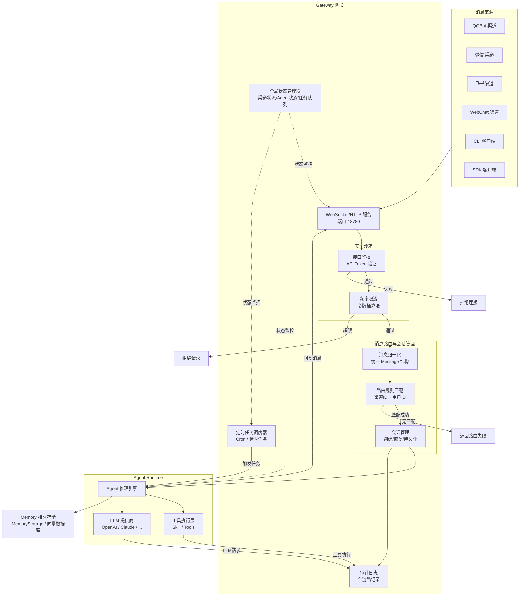
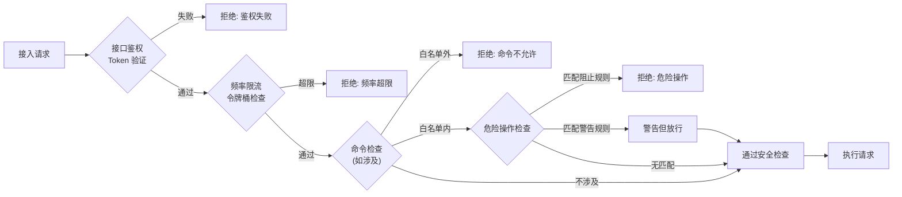
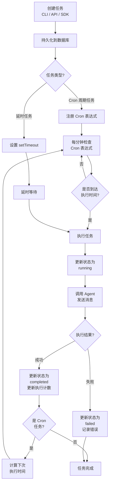

# MyOpenClaw Gateway 网关模块

> **版本**：v1.0.2  
> **修订日期**：2026-07-23  
> **修订人**：MyOpenClaw Core Team  
> **文档状态**：正式发布（已同步 Fastify 迁移）

---

> **实现状态**：Gateway 网关模块已完整实现，包括 Fastify WebSocket/HTTP 服务、消息路由、状态管理、安全沙箱、定时任务调度和审计日志。当前使用 MemoryStorage（内存存储）作为数据存储后端。

---

## 目录

- [1. 模块概述](#1-模块概述)
  - [1.1 网关控制平面的定位](#11-网关控制平面的定位)
  - [1.2 核心职责](#12-核心职责)
  - [1.3 在系统架构中的位置](#13-在系统架构中的位置)
- [2. 核心子模块详解](#2-核心子模块详解)
  - [2.1 WebSocket/HTTP 服务](#21-websockethttp-服务)
  - [2.2 消息路由与会话管理器](#22-消息路由与会话管理器)
  - [2.3 全局状态管理器](#23-全局状态管理器)
  - [2.4 安全沙箱模块](#24-安全沙箱模块)
  - [2.5 定时任务调度器](#25-定时任务调度器)
  - [2.6 审计日志](#26-审计日志)
- [3. 核心能力总结](#3-核心能力总结)
- [4. 接口定义](#4-接口定义)
- [5. 配置说明](#5-配置说明)
- [6. 流程图](#6-流程图)
- [7. 使用示例代码](#7-使用示例代码)
- [8. 故障排查](#8-故障排查)

---

## 1. 模块概述

### 1.1 网关控制平面的定位

Gateway 网关是 MyOpenClaw 系统的中枢控制平面（Control Plane），作为整个 Hub-Spoke 架构的核心枢纽，承担着消息收发、路由分发、状态管理、安全管控等关键职责。它是系统中唯一常驻运行的守护进程（Daemon Process），基于 **Fastify** 框架构建，默认监听 `127.0.0.1:18780` 端口，同时提供 WebSocket 和 HTTP 双协议服务。

Gateway 在系统中的定位可以类比为网络架构中的 API 网关，但职责更为广泛：

- **对外**：作为统一入口，接收来自各渠道（WebChat、QQBot、飞书、微信、CLI 等）和客户端（CLI、SDK、WebUI）的消息请求
- **对内**：协调 Agent Runtime、工具执行层、存储层等内部模块的协作
- **横切关注点**：提供安全鉴权、流量控制、审计日志等系统级横切能力

### 1.2 核心职责

| 职责领域 | 具体说明 |
|----------|----------|
| **协议接入** | 基于 Fastify + @fastify/websocket 提供 WebSocket 和 HTTP 双协议服务，统一管理客户端连接 |
| **消息路由** | 将入站消息路由至正确的 Agent，将 Agent 回复分发至正确的渠道 |
| **会话管理** | 管理用户与 Agent 之间的对话会话，维护上下文状态 |
| **状态管理** | 维护渠道连接状态、Agent 运行状态、任务队列等全局状态 |
| **安全管控** | 接口鉴权、频率限流、命令沙箱、Schema 校验、危险操作拦截 |
| **任务调度** | 管理 Cron 周期任务和延时任务，统一分发至 Agent 执行 |
| **审计日志** | 全链路记录消息流、工具调用、LLM 请求等操作日志 |
| **配置管理** | 加载和缓存系统配置、Agent 配置、渠道配置 |

### 1.3 在系统架构中的位置

```
┌──────────────────────────────────────────────────────────────┐
│                     MyOpenClaw 系统架构                         │
│                                                              │
│  ┌──────────┐  ┌──────────┐  ┌──────────┐  ┌──────────┐    │
│  │  QQBot   │  │  微信    │  │  飞书    │  │ WebChat  │    │
│  │ 渠道     │  │ 渠道     │  │ 渠道     │  │ 渠道     │    │
│  └────┬─────┘  └────┬─────┘  └────┬─────┘  └────┬─────┘    │
│       │              │              │              │          │
│  ═════╪══════════════╪══════════════╪══════════════╪═══      │
│       │              │              │              │          │
│  ┌────▼──────────────▼──────────────▼──────────────▼────┐    │
│  │              Gateway 网关控制平面                     │    │
│  │  ┌──────────────────────────────────────────────┐   │    │
│  │  │ Fastify 服务 (127.0.0.1:18780)                     │   │
  │  │ @fastify/websocket / @fastify/cors / @fastify/compress│   │    │
│  │  │ 安全沙箱模块 | 定时任务调度器 | 审计日志     │   │    │
│  │  └──────────────────────────────────────────────┘   │    │
│  └───┬───────────────────────┬──────────────────────┬──┘    │
│      │                       │                      │         │
│  ┌───▼──────┐         ┌──────▼──────┐        ┌──────▼─────┐  │
│  │  Agent   │         │  Skill/     │        │   Memory   │  │
│  │ Runtime  │         │  Tools      │        │   持久存储  │  │
│  └──────────┘         └─────────────┘        └────────────┘  │
│                                                              │
└──────────────────────────────────────────────────────────────┘
```

---

## 2. 核心子模块详解

### 2.1 Fastify WebSocket/HTTP 服务

Gateway 的网络入口层基于 **Fastify** 框架构建，通过插件化架构同时支持 WebSocket 和 HTTP 协议：

- **@fastify/websocket**：在 Fastify 范围内提供 WebSocket 支持，复用同一端口
- **@fastify/cors**：跨域资源共享，支持多客户端来源
- **@fastify/compress**：响应压缩（gzip/brotli），减少带宽消耗

Gateway 使用单一端口（默认 `18780`，不再区分 wsPort/httpPort），WebSocket 连接通过 `/ws` 路径接入，HTTP API 通过 `/api/*` 路径访问。同端口同时承载 WebSocket 和 HTTP 协议。

#### 消息协议设计

WebSocket 通信采用 JSON 格式的消息协议，定义了三类消息类型：

| 消息类型 | 方向 | 说明 |
|----------|------|------|
| `request` | 客户端 → Gateway | 请求消息，期望得到响应 |
| `response` | Gateway → 客户端 | 对 request 的响应消息 |
| `event` | Gateway → 客户端 | 事件推送消息，单向通知 |

**Request 消息示例**：

```json
{
  "type": "request",
  "id": "req_20260721_001",
  "action": "chat.send",
  "payload": {
    "agentId": "default",
    "channelId": "webchat",
    "userId": "user_001",
    "message": "你好，请介绍一下自己"
  },
  "timestamp": "2026-07-21T10:00:00.000Z"
}
```

**Response 消息示例**：

```json
{
  "type": "response",
  "id": "resp_20260721_001",
  "requestId": "req_20260721_001",
  "status": "success",
  "payload": {
    "messageId": "msg_001",
    "agentId": "default",
    "reply": "你好！我是 MyOpenClaw 助手..."
  },
  "timestamp": "2026-07-21T10:00:02.000Z"
}
```

**Event 消息示例**：

```json
{
  "type": "event",
  "id": "evt_20260721_001",
  "event": "agent.reply",
  "payload": {
    "agentId": "default",
    "channelId": "webchat",
    "userId": "user_001",
    "message": "这是 Agent 的回复内容"
  },
  "timestamp": "2026-07-21T10:00:05.000Z"
}
```

#### TypeScript 接口定义

```typescript
// gateway/protocol.ts
// Gateway WebSocket 消息协议类型定义

/**
 * 消息类型枚举
 * - request: 客户端发起的请求消息
 * - response: Gateway 对请求的响应消息
 * - event: Gateway 主动推送的事件消息
 */
export enum MessageType {
  REQUEST = 'request',
  RESPONSE = 'response',
  EVENT = 'event',
}

/**
 * 基础消息接口
 * 所有消息类型的公共字段
 */
export interface BaseMessage {
  /** 消息类型 */
  type: MessageType;
  /** 消息唯一 ID（UUID v4 格式） */
  id: string;
  /** 消息时间戳（ISO 8601 格式） */
  timestamp: string;
}

/**
 * 请求消息接口
 * 客户端向 Gateway 发送的请求
 */
export interface RequestMessage extends BaseMessage {
  type: MessageType.REQUEST;
  /** 请求动作名称，格式为 "模块.操作"，如 "chat.send" */
  action: string;
  /** 请求负载，根据 action 不同而结构不同 */
  payload: Record<string, unknown>;
}

/**
 * 响应消息接口
 * Gateway 对请求消息的响应
 */
export interface ResponseMessage extends BaseMessage {
  type: MessageType.RESPONSE;
  /** 对应的请求消息 ID */
  requestId: string;
  /** 响应状态：success / error */
  status: 'success' | 'error';
  /** 响应负载（成功时）或错误信息（失败时） */
  payload: Record<string, unknown>;
  /** 错误码（status 为 error 时存在） */
  errorCode?: string;
  /** 错误描述（status 为 error 时存在） */
  errorMessage?: string;
}

/**
 * 事件消息接口
 * Gateway 主动推送的事件通知
 */
export interface EventMessage extends BaseMessage {
  type: MessageType.EVENT;
  /** 事件名称，格式为 "模块.事件"，如 "agent.reply" */
  event: string;
  /** 事件负载 */
  payload: Record<string, unknown>;
}

/** 联合类型：所有可能的消息类型 */
export type GatewayMessage = RequestMessage | ResponseMessage | EventMessage;
```

#### 服务启动核心代码（Fastify 架构）

```typescript
// gateway/server.ts
// Gateway 服务实现 — 基于 Fastify + @fastify/websocket

import { EventEmitter } from 'node:events';
import { randomUUID } from 'node:crypto';
import { WebSocket } from 'ws';
import Fastify, { type FastifyInstance } from 'fastify';
import fastifyWebsocket from '@fastify/websocket';
import fastifyCors from '@fastify/cors';
import fastifyCompress from '@fastify/compress';
import { createLogger } from '../core/utils/logger.js';
import { MessageRouter } from './router/index.js';

/**
 * 网关服务器配置接口
 */
export interface GatewayServerConfig {
  host: string;
  port: number;                    // 统一端口（不再区分 wsPort / httpPort）
  heartbeatInterval: number;
  maxConnections: number;
  requestTimeout: number;
}

/**
 * 网关服务器（Fastify 架构）
 * 继承 EventEmitter，发出以下事件：
 * - started / stopped
 * - connection / disconnection
 * - message / error
 */
export class GatewayServer extends EventEmitter {
  readonly config: GatewayServerConfig;
  private fastify: FastifyInstance | null = null;
  private connections = new Map<string, WebSocket>();
  private heartbeatTimer: ReturnType<typeof setInterval> | null = null;
  readonly router: MessageRouter;
  private connectionMetadata = new Map<string, { channelId: string; userId: string }>();

  constructor(config?: Partial<GatewayServerConfig>) {
    super();
    this.setMaxListeners(100);
    this.config = {
      host: config?.host ?? '127.0.0.1',
      port: config?.port ?? 18780,
      heartbeatInterval: config?.heartbeatInterval ?? 30_000,
      maxConnections: config?.maxConnections ?? 1_000,
      requestTimeout: config?.requestTimeout ?? 30_000,
    };
    this.router = new MessageRouter();
    this.router.initDatabase();
  }

  /** 启动网关服务器 */
  async start(): Promise<void> {
    log.info({ host: this.config.host, port: this.config.port }, 'GatewayServer 正在启动...');

    // ① 创建 Fastify 实例
    this.fastify = Fastify({
      logger: false,
      requestTimeout: this.config.requestTimeout,
      maxParamLength: 200,
    });

    // ② 注册插件（CORS / Compression / WebSocket）
    await this.fastify.register(fastifyCors, { origin: true });
    await this.fastify.register(fastifyCompress, { global: true, threshold: 1024 });
    await this.fastify.register(fastifyWebsocket, {
      options: { maxPayload: 1 * 1024 * 1024 },
    });

    // ③ 注册 HTTP 路由
    this.registerRoutes();

    // ④ 注册 WebSocket 路由
    this.fastify.register(async (scope) => {
      scope.get('/ws', { websocket: true }, (socket) => {
        this.handleConnection(socket);
      });
    });

    // ⑤ 启动监听
    await this.fastify.listen({ host: this.config.host, port: this.config.port });

    // ⑥ 启动心跳
    this.startHeartbeat();

    log.info({ host: this.config.host, port: this.config.port }, 'GatewayServer 启动完成');
    this.emit('started', this.config);
  }

  /** 注册 HTTP REST 路由 */
  private registerRoutes(): void {
    if (!this.fastify) return;

    const okSchema = {
      type: 'object' as const,
      properties: {
        ok: { type: 'boolean' as const },
        data: { type: 'object' as const, additionalProperties: true as const },
      },
    };

    // GET /api/health — 健康检查
    this.fastify.get('/api/health', { schema: { response: { 200: okSchema } } }, async () => {
      return { ok: true, data: { status: 'healthy' as const } };
    });

    // GET /api/status — 网关运行状态
    this.fastify.get('/api/status', { schema: { response: { 200: okSchema } } }, async () => {
      return {
        ok: true,
        data: {
          status: 'running' as const,
          uptime: process.uptime(),
          connectionCount: this.connections.size,
          maxConnections: this.config.maxConnections,
          activeSessions: this.router.activeSessionCount,
          ruleCount: this.router.getRules().length,
        },
      };
    });

    // GET /api/connections — 当前连接列表
    this.fastify.get('/api/connections', async () => {
      const list = Array.from(this.connectionMetadata.entries()).map(([id, meta]) => ({
        connectionId: id, channelId: meta.channelId, userId: meta.userId,
      }));
      return { ok: true, data: { total: list.length, connections: list } };
    });

    // GET /api/sessions — 在线会话列表
    this.fastify.get('/api/sessions', async () => {
      const rules = this.router.getRules();
      return {
        ok: true,
        data: {
          activeSessionCount: this.router.activeSessionCount,
          ruleCount: rules.length,
          rules: rules.map((r) => ({
            id: r.id, priority: r.priority,
            channelId: r.channelId, agentId: r.agentId, enabled: r.enabled,
          })),
        },
      };
    });

    // 404 fallback
    this.fastify.setNotFoundHandler(async (_request, reply) => {
      reply.code(404).send({ ok: false, error: 'Not found' });
    });
  }

  /** 处理 WebSocket 连接 */
  private handleConnection(socket: WebSocket): void {
    if (this.connections.size >= this.config.maxConnections) {
      socket.close(1013, 'Too many connections');
      return;
    }
    const connectionId = randomUUID();
    this.connections.set(connectionId, socket);
    this.connectionMetadata.set(connectionId, { channelId: 'web', userId: 'pending' });

    socket.on('message', (rawData) => {
      const data = typeof rawData === 'string' ? rawData : rawData.toString();
      if (data.length > 500 * 1024) {
        this.send(connectionId, {
          type: 'response', id: randomUUID(), timestamp: new Date().toISOString(),
          requestId: '__oversize', status: 'error', payload: {},
          errorCode: 'MESSAGE_TOO_LARGE', errorMessage: '消息体过大，最大 500KB',
        });
        return;
      }
      this.handleMessage(connectionId, data);
    });

    socket.on('close', (code, reason) => {
      this.connections.delete(connectionId);
      this.connectionMetadata.delete(connectionId);
      this.emit('disconnection', connectionId, code, reason.toString());
    });

    socket.on('error', (err) => {
      this.emit('error', connectionId, err);
    });
  }

  /** 向指定连接发送消息 */
  send(connectionId: string, message: GatewayMessage): void {
    const ws = this.connections.get(connectionId);
    if (!ws || ws.readyState !== WebSocket.OPEN) return;
    if (ws.bufferedAmount > 64 * 1024) return;
    ws.send(JSON.stringify(message));
  }

  /** 广播消息到所有连接 */
  broadcast(message: GatewayMessage): { sent: number; total: number } {
    let sentCount = 0;
    for (const ws of this.connections.values()) {
      if (ws.readyState === WebSocket.OPEN) {
        try { ws.send(JSON.stringify(message)); sentCount++; } catch { /* ignore */ }
      }
    }
    return { sent: sentCount, total: this.connections.size };
  }

  /** 心跳机制：仅发送 WebSocket ping 帧保活 */
  private startHeartbeat(): void {
    this.heartbeatTimer = setInterval(() => {
      for (const [id, ws] of this.connections) {
        if (ws.readyState === WebSocket.OPEN) {
          try { ws.ping(); } catch { ws.terminate(); this.connections.delete(id); }
        } else if (ws.readyState === WebSocket.CLOSED || ws.readyState === WebSocket.CLOSING) {
          this.connections.delete(id);
        }
      }
    }, this.config.heartbeatInterval);
  }

  /** 停止服务：清除心跳 → 关闭所有连接 → 关闭 Fastify */
  async stop(): Promise<void> {
    if (this.heartbeatTimer) { clearInterval(this.heartbeatTimer); this.heartbeatTimer = null; }
    for (const ws of this.connections.values()) ws.close(1001, 'Server shutdown');
    this.connections.clear();
    this.connectionMetadata.clear();
    if (this.fastify) { await this.fastify.close(); this.fastify = null; }
    this.emit('stopped');
  }
}
```

### 2.2 消息路由与会话管理器

消息路由与会话管理器（Message Router & Session Manager）是 Gateway 的核心调度组件，负责将入站消息路由至正确的 Agent，并管理用户与 Agent 之间的对话会话。

#### 核心机制

**消息归一化**：不同渠道的消息格式各异（QQBot 的消息对象、飞书的事件回调、WebChat 的实时消息等），路由器首先将其归一化为统一的 `NormalizedMessage` 结构。

**路由匹配**：通过「渠道 ID + 用户 ID」组合作为路由键，匹配对应的 Agent 配置。支持通配符匹配、正则匹配等多种路由规则。

**会话绑定**：首次消息创建会话，后续消息复用会话上下文，确保对话连续性。

**会话持久化**：所有会话状态通过 MemoryStorage（内存存储兼容层）管理，支持服务重启后会话恢复。

#### 消息归一化结构

```typescript
// gateway/router/types.ts
// 消息路由相关类型定义

/**
 * 归一化消息结构
 * 所有渠道的消息在进入路由器前，都会被转换为此结构
 */
export interface NormalizedMessage {
  /** 消息唯一 ID */
  messageId: string;
  /** 来源渠道 ID（如 webchat / qqbot / feishu / wechat） */
  channelId: string;
  /** 发送用户 ID（渠道内的用户标识） */
  userId: string;
  /** 用户显示名称 */
  userName?: string;
  /** 消息内容（纯文本） */
  content: string;
  /** 消息类型：text / image / file / audio / video */
  messageType: 'text' | 'image' | 'file' | 'audio' | 'video';
  /** 附件列表（图片、文件等） */
  attachments?: MessageAttachment[];
  /** 原始消息对象（保留渠道原始数据，供需要时使用） */
  raw: unknown;
  /** 消息时间戳 */
  timestamp: number;
}

/**
 * 消息附件
 */
export interface MessageAttachment {
  /** 附件类型 */
  type: 'image' | 'file' | 'audio' | 'video';
  /** 附件 URL 或本地路径 */
  url: string;
  /** 文件名 */
  filename?: string;
  /** 文件大小（字节） */
  size?: number;
  /** MIME 类型 */
  mimeType?: string;
}

/**
 * 路由规则定义
 */
export interface RoutingRule {
  /** 规则 ID */
  id: string;
  /** 规则优先级（数字越小优先级越高） */
  priority: number;
  /** 匹配的渠道 ID，"*" 表示匹配所有渠道 */
  channelId: string;
  /** 匹配的用户 ID 列表，"*" 表示匹配所有用户 */
  userIds: string[];
  /** 匹配的消息内容正则表达式（可选） */
  contentPattern?: string;
  /** 路由目标 Agent ID */
  agentId: string;
  /** 规则是否启用 */
  enabled: boolean;
}

/**
 * 会话对象
 * 表示一个用户与 Agent 之间的对话会话
 */
export interface Session {
  /** 会话唯一 ID */
  sessionId: string;
  /** 渠道 ID */
  channelId: string;
  /** 用户 ID */
  userId: string;
  /** 绑定的 Agent ID */
  agentId: string;
  /** 会话创建时间 */
  createdAt: number;
  /** 最后活跃时间 */
  lastActiveAt: number;
  /** 会话状态 */
  status: 'active' | 'idle' | 'closed';
  /** 对话历史消息 ID 列表 */
  messageIds: string[];
  /** 会话元数据 */
  metadata?: Record<string, unknown>;
}
```

#### 路由器核心实现

```typescript
// gateway/router/index.ts
// 消息路由与会话管理器实现

import { EventEmitter } from 'events';
import type { MemoryStorage } from '../storage';
import type { NormalizedMessage, RoutingRule, Session } from './types';

/**
 * 消息路由与会话管理器
 * 负责消息路由匹配、会话创建与管理
 */
export class MessageRouter extends EventEmitter {
  /** 路由规则列表（按优先级排序） */
  private rules: RoutingRule[] = [];
  /** 活跃会话缓存（channelId:userId -> Session） */
  private sessionCache: Map<string, Session> = new Map();

  /**
   * 构造函数
   * @param storage - MemoryStorage 实例，用于会话数据管理
   */
  constructor(private storage: MemoryStorage) {
    super();
    this.initDatabase();
  }

  /**
   * 初始化存储表结构
   */
  private initDatabase(): void {
    // 创建会话表
    this.db.exec(`
      CREATE TABLE IF NOT EXISTS sessions (
        session_id   TEXT PRIMARY KEY,
        channel_id   TEXT NOT NULL,
        user_id      TEXT NOT NULL,
        agent_id     TEXT NOT NULL,
        status       TEXT NOT NULL DEFAULT 'active',
        created_at   INTEGER NOT NULL,
        last_active_at INTEGER NOT NULL,
        metadata     TEXT,
        UNIQUE(channel_id, user_id)
      );
      CREATE INDEX IF NOT EXISTS idx_sessions_channel_user 
        ON sessions(channel_id, user_id);
    `);

    // 创建消息记录表
    this.db.exec(`
      CREATE TABLE IF NOT EXISTS messages (
        message_id   TEXT PRIMARY KEY,
        session_id   TEXT NOT NULL,
        channel_id   TEXT NOT NULL,
        user_id      TEXT NOT NULL,
        agent_id     TEXT NOT NULL,
        role         TEXT NOT NULL,
        content      TEXT NOT NULL,
        created_at   INTEGER NOT NULL,
        FOREIGN KEY (session_id) REFERENCES sessions(session_id)
      );
      CREATE INDEX IF NOT EXISTS idx_messages_session 
        ON messages(session_id, created_at);
    `);
  }

  /**
   * 加载路由规则
   * 从 Agent 配置中提取路由规则并排序
   * @param agentConfigs - Agent 配置列表
   */
  loadRules(agentConfigs: AgentConfig[]): void {
    this.rules = [];

    for (const config of agentConfigs) {
      for (const channelBinding of config.channels || []) {
        const rule: RoutingRule = {
          id: `rule_${config.id}_${channelBinding.channelId}`,
          priority: config.priority || 100,
          channelId: channelBinding.channelId,
          userIds: channelBinding.userIds || ['*'],
          contentPattern: channelBinding.contentPattern,
          agentId: config.id,
          enabled: true,
        };
        this.rules.push(rule);
      }
    }

    // 按优先级排序（数字越小优先级越高）
    this.rules.sort((a, b) => a.priority - b.priority);
    console.log(`[Router] 已加载 ${this.rules.length} 条路由规则`);
  }

  /**
   * 路由消息至对应的 Agent
   * 这是路由器的核心方法，负责将归一化消息路由至正确的 Agent
   * @param message - 归一化后的消息
   * @returns 路由结果（包含 Agent ID 和会话信息）
   */
  async route(message: NormalizedMessage): Promise<RouteResult> {
    // 步骤 1：匹配路由规则
    const matchedRule = this.matchRule(message);
    if (!matchedRule) {
      // 没有匹配到任何路由规则
      return {
        matched: false,
        reason: `没有找到匹配的路由规则: channel=${message.channelId}, user=${message.userId}`,
      };
    }

    // 步骤 2：获取或创建会话
    const session = await this.getOrCreateSession(
      message.channelId,
      message.userId,
      matchedRule.agentId
    );

    // 步骤 3：持久化消息记录
    await this.persistMessage(session, message);

    // 步骤 4：更新会话活跃时间
    await this.updateSessionActivity(session.sessionId);

    // 步骤 5：返回路由结果
    return {
      matched: true,
      agentId: matchedRule.agentId,
      session,
      message,
    };
  }

  /**
   * 匹配路由规则
   * 按优先级顺序遍历规则，返回第一个匹配的规则
   */
  private matchRule(message: NormalizedMessage): RoutingRule | null {
    for (const rule of this.rules) {
      if (!rule.enabled) continue;

      // 匹配渠道 ID
      if (rule.channelId !== '*' && rule.channelId !== message.channelId) {
        continue;
      }

      // 匹配用户 ID
      const userMatched = rule.userIds.includes('*') || rule.userIds.includes(message.userId);
      if (!userMatched) continue;

      // 匹配消息内容正则（如果配置了）
      if (rule.contentPattern) {
        const regex = new RegExp(rule.contentPattern);
        if (!regex.test(message.content)) continue;
      }

      // 所有条件匹配，返回该规则
      return rule;
    }
    return null;
  }

  /**
   * 获取或创建会话
   * 通过 channelId + userId 作为唯一键查找现有会话
   * 如果不存在则创建新会话
   */
  private async getOrCreateSession(
    channelId: string,
    userId: string,
    agentId: string
  ): Promise<Session> {
    const cacheKey = `${channelId}:${userId}`;

    // 先从缓存查找
    const cached = this.sessionCache.get(cacheKey);
    if (cached && cached.status === 'active') {
      return cached;
    }

    // 从数据库查找
    const row = this.db.prepare(
      'SELECT * FROM sessions WHERE channel_id = ? AND user_id = ?'
    ).get(channelId, userId) as SessionRow | undefined;

    if (row && row.status === 'active') {
      // 恢复已有会话
      const session: Session = {
        sessionId: row.session_id,
        channelId: row.channel_id,
        userId: row.user_id,
        agentId: row.agent_id,
        createdAt: row.created_at,
        lastActiveAt: row.last_active_at,
        status: row.status,
        messageIds: [],
        metadata: row.metadata ? JSON.parse(row.metadata) : undefined,
      };
      this.sessionCache.set(cacheKey, session);
      return session;
    }

    // 创建新会话
    const sessionId = `sess_${Date.now()}_${Math.random().toString(36).slice(2, 10)}`;
    const now = Date.now();
    const session: Session = {
      sessionId,
      channelId,
      userId,
      agentId,
      createdAt: now,
      lastActiveAt: now,
      status: 'active',
      messageIds: [],
    };

    // 持久化到数据库
    this.db.prepare(
      `INSERT INTO sessions (session_id, channel_id, user_id, agent_id, status, created_at, last_active_at)
       VALUES (?, ?, ?, ?, ?, ?, ?)`
    ).run(sessionId, channelId, userId, agentId, 'active', now, now);

    this.sessionCache.set(cacheKey, session);
    console.log(`[Router] 新建会话: ${sessionId} (channel=${channelId}, user=${userId}, agent=${agentId})`);

    return session;
  }

  /**
   * 持久化消息记录
   */
  private async persistMessage(session: Session, message: NormalizedMessage): Promise<void> {
    const now = Date.now();
    this.db.prepare(
      `INSERT INTO messages (message_id, session_id, channel_id, user_id, agent_id, role, content, created_at)
       VALUES (?, ?, ?, ?, ?, ?, ?, ?)`
    ).run(
      message.messageId,
      session.sessionId,
      message.channelId,
      message.userId,
      session.agentId,
      'user',  // 入站消息角色为 user
      message.content,
      now
    );

    // 更新会话消息 ID 列表
    session.messageIds.push(message.messageId);
  }

  /**
   * 更新会话活跃时间
   */
  private async updateSessionActivity(sessionId: string): Promise<void> {
    const now = Date.now();
    this.db.prepare(
      'UPDATE sessions SET last_active_at = ? WHERE session_id = ?'
    ).run(now, sessionId);
  }

  /**
   * 关闭会话
   */
  async closeSession(sessionId: string): Promise<void> {
    this.db.prepare(
      'UPDATE sessions SET status = ? WHERE session_id = ?'
    ).run('closed', sessionId);

    // 从缓存中移除
    for (const [key, session] of this.sessionCache) {
      if (session.sessionId === sessionId) {
        this.sessionCache.delete(key);
        break;
      }
    }
  }

  /**
   * 获取会话历史消息
   */
  async getSessionHistory(sessionId: string, limit: number = 20): Promise<unknown[]> {
    const rows = this.db.prepare(
      'SELECT * FROM messages WHERE session_id = ? ORDER BY created_at DESC LIMIT ?'
    ).all(sessionId, limit);
    return rows.reverse();  // 返回时间正序
  }
}

/** 路由结果 */
interface RouteResult {
  matched: boolean;
  agentId?: string;
  session?: Session;
  message?: NormalizedMessage;
  reason?: string;
}

/** Agent 配置（路由相关部分） */
interface AgentConfig {
  id: string;
  priority?: number;
  channels: Array<{
    channelId: string;
    userIds?: string[];
    contentPattern?: string;
  }>;
}

/** 数据库行类型 */
interface SessionRow {
  session_id: string;
  channel_id: string;
  user_id: string;
  agent_id: string;
  status: string;
  created_at: number;
  last_active_at: number;
  metadata: string | null;
}
```

#### 多路由规则说明

路由器支持多种路由规则组合，按优先级从高到低依次匹配：

| 优先级 | 规则类型 | 匹配方式 | 应用场景 |
|--------|----------|----------|----------|
| 1 | 精确匹配 | channelId + userId 完全匹配 | 特定用户绑定特定 Agent |
| 2 | 通配匹配 | channelId 精确 + userId 为 `*` | 渠道内所有用户使用同一 Agent |
| 3 | 全通配 | channelId 为 `*` | 兜底规则，匹配所有未命中的消息 |
| 4 | 内容匹配 | 正则表达式匹配消息内容 | 根据消息内容路由至不同 Agent |

### 2.3 全局状态管理器

全局状态管理器（Global State Manager）维护 Gateway 运行时的所有状态信息，是系统状态一致性的保障组件。

#### 管理的状态分类

| 状态类别 | 说明 | 示例 |
|----------|------|------|
| 渠道连接状态 | 各渠道适配器的连接状态 | `{ channelId: 'webchat', status: 'connected' }` |
| Agent 运行状态 | 各 Agent 的当前运行状态 | `{ agentId: 'default', status: 'idle' }` |
| 任务队列 | 待执行和执行中的任务队列 | `{ taskId: 'task_001', status: 'pending' }` |
| 配置缓存 | 系统配置的内存缓存 | `{ key: 'gateway.port', value: 18780 }` |
| 连接池 | WebSocket 客户端连接信息 | `{ connectionId: 'conn_001', alive: true }` |
| 会话索引 | 活跃会话的快速索引 | `{ sessionId: 'sess_001', agentId: 'default' }` |

#### TypeScript 接口定义

```typescript
// gateway/state/types.ts
// 全局状态管理器类型定义

/**
 * 渠道连接状态
 */
export interface ChannelState {
  /** 渠道 ID */
  channelId: string;
  /** 连接状态：connected / disconnected / connecting / error */
  status: 'connected' | 'disconnected' | 'connecting' | 'error';
  /** 最后连接时间 */
  lastConnectedAt: number;
  /** 最后断开时间 */
  lastDisconnectedAt?: number;
  /** 错误信息（status 为 error 时存在） */
  errorMessage?: string;
  /** 重连次数 */
  reconnectAttempts: number;
  /** 消息收发统计 */
  stats: {
    messagesReceived: number;
    messagesSent: number;
    lastMessageAt?: number;
  };
}

/**
 * Agent 运行状态
 */
export interface AgentState {
  /** Agent ID */
  agentId: string;
  /** 运行状态：idle / busy / error / stopped */
  status: 'idle' | 'busy' | 'error' | 'stopped';
  /** 当前处理的任务 ID（status 为 busy 时存在） */
  currentTaskId?: string;
  /** 当前处理的会话 ID */
  currentSessionId?: string;
  /** 最后活跃时间 */
  lastActiveAt: number;
  /** 错误信息 */
  errorMessage?: string;
  /** 运行统计 */
  stats: {
    totalInvocations: number;
    totalTokensUsed: number;
    averageResponseTime: number;
    lastInvocationAt?: number;
  };
}

/**
 * 任务队列状态
 */
export interface TaskQueueState {
  /** 待执行任务数量 */
  pendingCount: number;
  /** 执行中任务数量 */
  runningCount: number;
  /** 已完成任务数量 */
  completedCount: number;
  /** 失败任务数量 */
  failedCount: number;
  /** 任务详情列表 */
  tasks: TaskState[];
}

/**
 * 单个任务状态
 */
export interface TaskState {
  /** 任务 ID */
  taskId: string;
  /** 任务名称 */
  name: string;
  /** 任务类型：cron / delay */
  type: 'cron' | 'delay';
  /** 执行状态：pending / running / completed / failed */
  status: 'pending' | 'running' | 'completed' | 'failed';
  /** 目标 Agent ID */
  agentId: string;
  /** 下次执行时间 */
  nextRunAt?: number;
  /** 最后执行时间 */
  lastRunAt?: number;
  /** 执行耗时（毫秒） */
  duration?: number;
}

/**
 * 系统全局状态
 * 聚合所有状态分类
 */
export interface SystemState {
  /** Gateway 启动时间 */
  startedAt: number;
  /** Gateway 版本 */
  version: string;
  /** 渠道状态映射 */
  channels: Map<string, ChannelState>;
  /** Agent 状态映射 */
  agents: Map<string, AgentState>;
  /** 任务队列状态 */
  taskQueue: TaskQueueState;
  /** 配置缓存 */
  configCache: Map<string, unknown>;
  /** 系统资源使用情况 */
  resources: {
    memoryUsage: number;    // 内存使用量（MB）
    cpuUsage: number;       // CPU 使用率（%）
    uptime: number;         // 运行时长（秒）
  };
}
```

#### 状态管理器实现

```typescript
// gateway/state/index.ts
// 全局状态管理器实现

import { EventEmitter } from 'events';
import type {
  ChannelState,
  AgentState,
  TaskState,
  SystemState,
} from './types';

/**
 * 全局状态管理器
 * 维护 Gateway 运行时的所有状态信息
 * 提供状态查询、更新和事件通知能力
 */
export class StateManager extends EventEmitter {
  /** 系统全局状态 */
  private state: SystemState;

  constructor(version: string) {
    super();
    this.state = {
      startedAt: Date.now(),
      version,
      channels: new Map(),
      agents: new Map(),
      taskQueue: {
        pendingCount: 0,
        runningCount: 0,
        completedCount: 0,
        failedCount: 0,
        tasks: [],
      },
      configCache: new Map(),
      resources: {
        memoryUsage: 0,
        cpuUsage: 0,
        uptime: 0,
      },
    };
  }

  // ==================== 渠道状态管理 ====================

  /**
   * 更新渠道连接状态
   */
  updateChannelState(channelId: string, update: Partial<ChannelState>): void {
    const existing = this.state.channels.get(channelId);
    const newState: ChannelState = {
      channelId,
      status: 'disconnected',
      lastConnectedAt: 0,
      reconnectAttempts: 0,
      stats: {
        messagesReceived: 0,
        messagesSent: 0,
      },
      ...existing,
      ...update,
    };
    this.state.channels.set(channelId, newState);

    // 发出状态变更事件
    this.emit('channel:stateChanged', { channelId, state: newState });
  }

  /**
   * 获取渠道状态
   */
  getChannelState(channelId: string): ChannelState | undefined {
    return this.state.channels.get(channelId);
  }

  /**
   * 获取所有渠道状态
   */
  getAllChannelStates(): ChannelState[] {
    return Array.from(this.state.channels.values());
  }

  // ==================== Agent 状态管理 ====================

  /**
   * 更新 Agent 运行状态
   */
  updateAgentState(agentId: string, update: Partial<AgentState>): void {
    const existing = this.state.agents.get(agentId);
    const newState: AgentState = {
      agentId,
      status: 'idle',
      lastActiveAt: Date.now(),
      stats: {
        totalInvocations: 0,
        totalTokensUsed: 0,
        averageResponseTime: 0,
      },
      ...existing,
      ...update,
    };
    this.state.agents.set(agentId, newState);

    this.emit('agent:stateChanged', { agentId, state: newState });
  }

  /**
   * 获取 Agent 状态
   */
  getAgentState(agentId: string): AgentState | undefined {
    return this.state.agents.get(agentId);
  }

  /**
   * 获取空闲 Agent 列表
   */
  getIdleAgents(): AgentState[] {
    return Array.from(this.state.agents.values())
      .filter(a => a.status === 'idle');
  }

  // ==================== 任务队列管理 ====================

  /**
   * 添加任务到队列
   */
  addTask(task: TaskState): void {
    this.state.taskQueue.tasks.push(task);
    this.state.taskQueue.pendingCount++;
    this.emit('task:added', task);
  }

  /**
   * 更新任务状态
   */
  updateTaskState(taskId: string, update: Partial<TaskState>): void {
    const task = this.state.taskQueue.tasks.find(t => t.taskId === taskId);
    if (!task) return;

    // 更新计数器
    if (task.status !== update.status) {
      switch (task.status) {
        case 'pending': this.state.taskQueue.pendingCount--; break;
        case 'running': this.state.taskQueue.runningCount--; break;
      }
      switch (update.status) {
        case 'pending': this.state.taskQueue.pendingCount++; break;
        case 'running': this.state.taskQueue.runningCount++; break;
        case 'completed': this.state.taskQueue.completedCount++; break;
        case 'failed': this.state.taskQueue.failedCount++; break;
      }
    }

    Object.assign(task, update);
    this.emit('task:stateChanged', { taskId, state: task });
  }

  // ==================== 配置缓存管理 ====================

  /**
   * 缓存配置项
   */
  setConfig(key: string, value: unknown): void {
    this.state.configCache.set(key, value);
  }

  /**
   * 获取缓存的配置项
   */
  getConfig<T>(key: string): T | undefined {
    return this.state.configCache.get(key) as T | undefined;
  }

  // ==================== 系统资源监控 ====================

  /**
   * 更新系统资源使用情况
   */
  updateResources(): void {
    const memUsage = process.memoryUsage();
    this.state.resources.memoryUsage = Math.round(memUsage.rss / 1024 / 1024);
    this.state.resources.uptime = Math.floor((Date.now() - this.state.startedAt) / 1000);
  }

  /**
   * 获取完整系统状态快照
   */
  getSnapshot(): SystemState {
    this.updateResources();
    return this.state;
  }
}
```

### 2.4 安全沙箱模块

安全沙箱模块（Security Sandbox）是 Gateway 的安全防护核心，提供多层安全管控机制，确保系统在开放接入环境下的安全运行。

#### 安全防护层级

| 防护层级 | 机制 | 说明 |
|----------|------|------|
| **接口鉴权** | API Token 验证 | 所有 API 请求需要携带有效 Token |
| **频率限流** | 令牌桶算法 | 防止单个客户端发送过多请求导致系统过载 |
| **命令沙箱** | 命令白名单 | shell_exec 工具仅允许执行白名单内的命令 |
| **Schema 校验** | JSON Schema | 所有输入参数必须通过 Schema 校验 |
| **危险操作拦截** | 规则引擎 | 拦截 rm -rf、DROP TABLE 等危险操作 |

#### TypeScript 接口定义

```typescript
// gateway/security/types.ts
// 安全沙箱模块类型定义

/**
 * 安全配置
 */
export interface SecurityConfig {
  /** API 访问令牌，空字符串表示不鉴权 */
  apiToken: string;
  /** 请求频率限制（每分钟最大请求数） */
  rateLimit: number;
  /** 命令沙箱是否启用 */
  sandboxEnabled: boolean;
  /** 允许执行的系统命令白名单 */
  allowedCommands: string[];
  /** 危险操作拦截规则 */
  dangerPatterns: DangerPattern[];
}

/**
 * 危险操作匹配规则
 */
export interface DangerPattern {
  /** 规则 ID */
  id: string;
  /** 规则描述 */
  description: string;
  /** 匹配的正则表达式 */
  pattern: string;
  /** 匹配后的处理方式：block（阻止）/ warn（警告但放行） */
  action: 'block' | 'warn';
}

/**
 * 安全检查结果
 */
export interface SecurityCheckResult {
  /** 是否通过安全检查 */
  passed: boolean;
  /** 失败原因（未通过时存在） */
  reason?: string;
  /** 拦截的规则 ID */
  ruleId?: string;
  /** 警告信息 */
  warnings?: string[];
}

/**
 * 限流状态
 */
export interface RateLimitState {
  /** 客户端标识 */
  clientId: string;
  /** 当前令牌数 */
  tokens: number;
  /** 上次令牌补充时间 */
  lastRefillTime: number;
  /** 令牌桶容量 */
  capacity: number;
  /** 令牌补充速率（每秒） */
  refillRate: number;
}
```

#### 安全沙箱实现

```typescript
// gateway/security/index.ts
// 安全沙箱模块实现

import { EventEmitter } from 'events';
import type {
  SecurityConfig,
  SecurityCheckResult,
  RateLimitState,
} from './types';

/**
 * 安全沙箱模块
 * 提供多层安全防护：鉴权、限流、命令隔离、Schema校验、危险操作拦截
 */
export class SecuritySandbox extends EventEmitter {
  /** 限流状态缓存（clientId -> RateLimitState） */
  private rateLimitStates: Map<string, RateLimitState> = new Map();

  /** 默认危险操作匹配规则 */
  private static readonly DEFAULT_DANGER_PATTERNS = [
    {
      id: 'rm_rf',
      description: '阻止递归删除文件系统',
      pattern: /rm\s+(-[a-zA-Z]*f[a-zA-Z]*\s+)?\/(\s|$)|rm\s+-rf\s+\//.source,
      action: 'block' as const,
    },
    {
      id: 'drop_table',
      description: '阻止删除数据库表',
      pattern: /DROP\s+TABLE/i.source,
      action: 'block' as const,
    },
    {
      id: 'drop_database',
      description: '阻止删除数据库',
      pattern: /DROP\s+DATABASE/i.source,
      action: 'block' as const,
    },
    {
      id: 'shutdown',
      description: '阻止系统关机命令',
      pattern: /(shutdown|halt|poweroff|reboot)/i.source,
      action: 'block' as const,
    },
    {
      id: 'chmod_777',
      description: '警告过度宽松的文件权限',
      pattern: /chmod\s+777/i.source,
      action: 'warn' as const,
    },
    {
      id: 'curl_pipe',
      description: '警告 curl 管道执行（可能执行远程脚本）',
      pattern: /curl\s+[^|]+\|\s*(sh|bash|python)/i.source,
      action: 'warn' as const,
    },
  ];

  constructor(private config: SecurityConfig) {
    super();
  }

  /**
   * 接口鉴权检查
   * 验证请求携带的 API Token 是否有效
   * @param token - 请求中携带的 Token
   * @returns 鉴权结果
   */
  authenticate(token: string | undefined): SecurityCheckResult {
    // 如果未配置 Token，则跳过鉴权（仅本地开发使用）
    if (!this.config.apiToken) {
      return { passed: true };
    }

    if (!token) {
      return {
        passed: false,
        reason: '缺少 API Token，请在请求头中携带 Authorization: Bearer <token>',
      };
    }

    // 使用时间安全的字符串比较，防止时序攻击
    if (!this.safeCompare(token, this.config.apiToken)) {
      return {
        passed: false,
        reason: 'API Token 无效',
      };
    }

    return { passed: true };
  }

  /**
   * 频率限流检查
   * 基于令牌桶算法实现
   * @param clientId - 客户端标识（IP 或连接 ID）
   * @returns 限流检查结果
   */
  checkRateLimit(clientId: string): SecurityCheckResult {
    // 获取或创建限流状态
    let state = this.rateLimitStates.get(clientId);
    if (!state) {
      state = {
        clientId,
        tokens: this.config.rateLimit,  // 初始令牌数 = 桶容量
        lastRefillTime: Date.now(),
        capacity: this.config.rateLimit,
        refillRate: this.config.rateLimit / 60,  // 每秒补充速率
      };
      this.rateLimitStates.set(clientId, state);
    }

    // 补充令牌（基于时间差计算应补充的令牌数）
    const now = Date.now();
    const timePassed = (now - state.lastRefillTime) / 1000;  // 秒
    const tokensToAdd = timePassed * state.refillRate;
    state.tokens = Math.min(state.capacity, state.tokens + tokensToAdd);
    state.lastRefillTime = now;

    // 消耗一个令牌
    if (state.tokens < 1) {
      // 令牌不足，拒绝请求
      this.emit('rateLimit:exceeded', { clientId, tokens: state.tokens });
      return {
        passed: false,
        reason: `请求频率超限，当前限制为每分钟 ${this.config.rateLimit} 次请求`,
      };
    }

    state.tokens -= 1;
    return { passed: true };
  }

  /**
   * 命令沙箱检查
   * 验证待执行的系统命令是否在白名单内
   * @param command - 待执行的完整命令
   * @returns 检查结果
   */
  checkCommand(command: string): SecurityCheckResult {
    if (!this.config.sandboxEnabled) {
      return { passed: true };
    }

    // 提取命令的第一个词（即命令名称）
    const cmdName = command.trim().split(/\s+/)[0];

    // 检查是否在白名单中
    if (!this.config.allowedCommands.includes(cmdName)) {
      this.emit('command:blocked', { command, reason: 'not_in_whitelist' });
      return {
        passed: false,
        reason: `命令 "${cmdName}" 不在允许执行的白名单中。允许的命令: ${this.config.allowedCommands.join(', ')}`,
        ruleId: 'command_whitelist',
      };
    }

    // 检查是否包含危险操作
    return this.checkDangerousContent(command);
  }

  /**
   * 危险操作拦截检查
   * 使用正则表达式匹配危险操作模式
   * @param content - 待检查的内容
   * @returns 检查结果
   */
  checkDangerousContent(content: string): SecurityCheckResult {
    const warnings: string[] = [];
    const patterns = this.config.dangerPatterns || SecuritySandbox.DEFAULT_DANGER_PATTERNS;

    for (const pattern of patterns) {
      const regex = new RegExp(pattern.pattern);
      if (regex.test(content)) {
        if (pattern.action === 'block') {
          // 阻止操作
          this.emit('danger:blocked', { content, ruleId: pattern.id });
          return {
            passed: false,
            reason: `检测到危险操作: ${pattern.description}`,
            ruleId: pattern.id,
          };
        } else if (pattern.action === 'warn') {
          // 警告但放行
          warnings.push(`安全警告: ${pattern.description}`);
        }
      }
    }

    return {
      passed: true,
      warnings: warnings.length > 0 ? warnings : undefined,
    };
  }

  /**
   * 输入参数 Schema 校验
   * 验证输入参数是否符合预期的 JSON Schema
   * @param input - 输入参数对象
   * @param schema - JSON Schema 定义
   * @returns 校验结果
   */
  validateSchema(input: unknown, schema: JSONSchema): SecurityCheckResult {
    // 校验类型
    if (schema.type && typeof input !== schema.type) {
      return {
        passed: false,
        reason: `参数类型错误: 期望 ${schema.type}, 实际 ${typeof input}`,
      };
    }

    // 校验必填字段
    if (schema.required && typeof input === 'object' && input !== null) {
      const obj = input as Record<string, unknown>;
      for (const field of schema.required) {
        if (!(field in obj)) {
          return {
            passed: false,
            reason: `缺少必填参数: ${field}`,
          };
        }
      }
    }

    // 校验字段属性
    if (schema.properties && typeof input === 'object' && input !== null) {
      const obj = input as Record<string, unknown>;
      for (const [key, propSchema] of Object.entries(schema.properties)) {
        if (key in obj && propSchema.type) {
          if (typeof obj[key] !== propSchema.type) {
            return {
              passed: false,
              reason: `参数 "${key}" 类型错误: 期望 ${propSchema.type}, 实际 ${typeof obj[key]}`,
            };
          }
        }
      }
    }

    return { passed: true };
  }

  /**
   * 时间安全的字符串比较
   * 防止时序攻击（timing attack）
   */
  private safeCompare(a: string, b: string): boolean {
    if (a.length !== b.length) return false;
    let result = 0;
    for (let i = 0; i < a.length; i++) {
      result |= a.charCodeAt(i) ^ b.charCodeAt(i);
    }
    return result === 0;
  }
}

/** JSON Schema 简化定义 */
interface JSONSchema {
  type?: string;
  required?: string[];
  properties?: Record<string, { type: string }>;
}
```

### 2.5 定时任务调度器

定时任务调度器（Task Scheduler）负责管理 Cron 周期任务和延时任务，在指定时间触发任务并统一分发至 Agent 执行。

#### TypeScript 接口定义

```typescript
// gateway/scheduler/types.ts
// 定时任务调度器类型定义

/**
 * 任务类型
 */
export enum TaskType {
  /** Cron 周期任务，按 Cron 表达式周期性执行 */
  CRON = 'cron',
  /** 延时任务，在指定延迟后执行一次 */
  DELAY = 'delay',
}

/**
 * 任务状态
 */
export enum TaskStatus {
  /** 待执行 */
  PENDING = 'pending',
  /** 执行中 */
  RUNNING = 'running',
  /** 已完成 */
  COMPLETED = 'completed',
  /** 执行失败 */
  FAILED = 'failed',
  /** 已禁用 */
  DISABLED = 'disabled',
}

/**
 * 定时任务定义
 */
export interface ScheduledTask {
  /** 任务 ID */
  id: string;
  /** 任务名称 */
  name: string;
  /** 任务类型 */
  type: TaskType;
  /** Cron 表达式（type 为 cron 时必填） */
  cron?: string;
  /** 延迟时间（毫秒，type 为 delay 时必填） */
  delay?: number;
  /** 目标 Agent ID */
  agentId: string;
  /** 任务触发时发送给 Agent 的消息内容 */
  message: string;
  /** 结果推送的目标渠道 ID */
  channelId?: string;
  /** 结果推送的目标用户 ID */
  userId?: string;
  /** 任务状态 */
  status: TaskStatus;
  /** 是否启用 */
  enabled: boolean;
  /** 创建时间 */
  createdAt: number;
  /** 上次执行时间 */
  lastRunAt?: number;
  /** 下次执行时间 */
  nextRunAt?: number;
  /** 执行次数 */
  runCount: number;
  /** 任务元数据 */
  metadata?: Record<string, unknown>;
}

/**
 * 任务执行结果
 */
export interface TaskExecutionResult {
  /** 任务 ID */
  taskId: string;
  /** 执行状态 */
  status: TaskStatus;
  /** Agent 回复内容 */
  response?: string;
  /** 执行耗时（毫秒） */
  duration: number;
  /** 错误信息（失败时存在） */
  error?: string;
  /** 执行时间戳 */
  executedAt: number;
}
```

#### 调度器核心实现

```typescript
// gateway/scheduler/index.ts
// 定时任务调度器实现

import { EventEmitter } from 'events';
import { cron } from 'cron-parser';
import type { MemoryStorage } from '../storage';
import type { ScheduledTask, TaskExecutionResult } from './types';
import { TaskType, TaskStatus } from './types';

/**
 * 定时任务调度器
 * 管理 Cron 周期任务和延时任务
 * 在任务触发时统一分发至 Agent Runtime 执行
 */
export class TaskScheduler extends EventEmitter {
  /** 定时器映射（taskId -> NodeJS.Timeout） */
  private timers: Map<string, NodeJS.Timeout> = new Map();
  /** Cron 任务映射（taskId -> cron 表达式） */
  private cronExpressions: Map<string, string> = new Map();
  /** Cron 检查间隔（毫秒） */
  private cronCheckInterval: NodeJS.Timeout | null = null;

  constructor(
    private storage: MemoryStorage,
    private agentInvoker: AgentInvoker
  ) {
    super();
    this.initDatabase();
  }

  /**
   * 初始化数据库表
   */
  private initDatabase(): void {
    this.db.exec(`
      CREATE TABLE IF NOT EXISTS scheduled_tasks (
        id          TEXT PRIMARY KEY,
        name        TEXT NOT NULL,
        type        TEXT NOT NULL,
        cron        TEXT,
        delay       INTEGER,
        agent_id    TEXT NOT NULL,
        message     TEXT NOT NULL,
        channel_id  TEXT,
        user_id     TEXT,
        status      TEXT NOT NULL DEFAULT 'pending',
        enabled     INTEGER NOT NULL DEFAULT 1,
        created_at  INTEGER NOT NULL,
        last_run_at INTEGER,
        next_run_at INTEGER,
        run_count   INTEGER NOT NULL DEFAULT 0,
        metadata    TEXT
      );
      CREATE INDEX IF NOT EXISTS idx_tasks_next_run 
        ON scheduled_tasks(next_run_at) WHERE enabled = 1;
    `);
  }

  /**
   * 启动调度器
   * 从数据库加载所有启用的任务并恢复调度
   */
  async start(): Promise<void> {
    // 加载所有启用的 Cron 任务
    const tasks = this.db.prepare(
      'SELECT * FROM scheduled_tasks WHERE enabled = 1 AND type = ?'
    ).all(TaskType.CRON) as ScheduledTaskRow[];

    for (const row of tasks) {
      this.scheduleCronTask(this.rowToTask(row));
    }

    // 启动 Cron 定时检查（每分钟检查一次）
    this.cronCheckInterval = setInterval(() => {
      this.checkCronTasks();
    }, 60000);

    console.log(`[Scheduler] 已启动，加载了 ${tasks.length} 个 Cron 任务`);
  }

  /**
   * 创建定时任务
   */
  async createTask(task: Omit<ScheduledTask, 'id' | 'createdAt' | 'runCount' | 'status'>): Promise<ScheduledTask> {
    const id = `task_${Date.now()}_${Math.random().toString(36).slice(2, 8)}`;
    const now = Date.now();

    // 计算下次执行时间
    let nextRunAt: number | undefined;
    if (task.type === TaskType.CRON && task.cron) {
      const interval = cron.parseExpression(task.cron, { currentDate: new Date(now) });
      nextRunAt = interval.next().getTime();
    } else if (task.type === TaskType.DELAY && task.delay) {
      nextRunAt = now + task.delay;
    }

    const fullTask: ScheduledTask = {
      ...task,
      id,
      status: TaskStatus.PENDING,
      createdAt: now,
      runCount: 0,
      nextRunAt,
    };

    // 持久化到数据库
    this.db.prepare(
      `INSERT INTO scheduled_tasks 
       (id, name, type, cron, delay, agent_id, message, channel_id, user_id, status, enabled, created_at, next_run_at, run_count, metadata)
       VALUES (?, ?, ?, ?, ?, ?, ?, ?, ?, ?, ?, ?, ?, ?, ?)`
    ).run(
      id, task.name, task.type, task.cron || null, task.delay || null,
      task.agentId, task.message, task.channelId || null, task.userId || null,
      TaskStatus.PENDING, task.enabled ? 1 : 0, now, nextRunAt || null, 0,
      task.metadata ? JSON.stringify(task.metadata) : null
    );

    // 根据任务类型调度
    if (task.enabled) {
      if (task.type === TaskType.CRON) {
        this.scheduleCronTask(fullTask);
      } else if (task.type === TaskType.DELAY) {
        this.scheduleDelayTask(fullTask);
      }
    }

    this.emit('task:created', fullTask);
    return fullTask;
  }

  /**
   * 调度 Cron 周期任务
   */
  private scheduleCronTask(task: ScheduledTask): void {
    this.cronExpressions.set(task.id, task.cron!);
    console.log(`[Scheduler] Cron 任务已调度: ${task.id} (${task.cron})`);
  }

  /**
   * 调度延时任务
   */
  private scheduleDelayTask(task: ScheduledTask): void {
    if (!task.delay || !task.nextRunAt) return;

    const delay = task.nextRunAt - Date.now();
    if (delay <= 0) {
      // 已到期，立即执行
      this.executeTask(task.id).catch(err => {
        console.error(`[Scheduler] 任务执行失败: ${task.id}`, err);
      });
      return;
    }

    const timer = setTimeout(() => {
      this.executeTask(task.id).catch(err => {
        console.error(`[Scheduler] 任务执行失败: ${task.id}`, err);
      });
    }, delay);

    this.timers.set(task.id, timer);
    console.log(`[Scheduler] 延时任务已调度: ${task.id} (${delay}ms 后执行)`);
  }

  /**
   * 检查 Cron 任务是否到达执行时间
   */
  private checkCronTasks(): void {
    const now = Date.now();

    for (const [taskId, cronExpr] of this.cronExpressions) {
      try {
        const interval = cron.parseExpression(cronExpr, { currentDate: new Date(now) });
        const nextTime = interval.next().getTime();
        const prevTime = interval.prev().getTime();

        // 如果上次执行时间在当前分钟内，则触发执行
        if (now - prevTime < 60000) {
          this.executeTask(taskId).catch(err => {
            console.error(`[Scheduler] Cron 任务执行失败: ${taskId}`, err);
          });
        }

        // 更新下次执行时间
        this.db.prepare(
          'UPDATE scheduled_tasks SET next_run_at = ? WHERE id = ?'
        ).run(nextTime, taskId);
      } catch (err) {
        console.error(`[Scheduler] Cron 表达式解析失败: ${taskId}`, err);
      }
    }
  }

  /**
   * 执行任务
   * 将任务分发至 Agent Runtime 执行
   */
  async executeTask(taskId: string): Promise<TaskExecutionResult> {
    const startTime = Date.now();

    // 从数据库加载任务
    const row = this.db.prepare(
      'SELECT * FROM scheduled_tasks WHERE id = ?'
    ).get(taskId) as ScheduledTaskRow | undefined;

    if (!row || !row.enabled) {
      return {
        taskId,
        status: TaskStatus.DISABLED,
        duration: 0,
        error: '任务不存在或已禁用',
        executedAt: startTime,
      };
    }

    const task = this.rowToTask(row);

    // 更新任务状态为执行中
    this.updateTaskStatus(taskId, TaskStatus.RUNNING);
    this.emit('task:started', task);

    try {
      // 调用 Agent 执行任务
      const response = await this.agentInvoker.invoke({
        agentId: task.agentId,
        message: task.message,
        channelId: task.channelId,
        userId: task.userId,
        taskId: task.id,
      });

      const duration = Date.now() - startTime;
      const result: TaskExecutionResult = {
        taskId,
        status: TaskStatus.COMPLETED,
        response,
        duration,
        executedAt: startTime,
      };

      // 更新任务状态
      this.db.prepare(
        'UPDATE scheduled_tasks SET status = ?, last_run_at = ?, run_count = run_count + 1 WHERE id = ?'
      ).run(TaskStatus.COMPLETED, startTime, taskId);

      // 如果是 Cron 任务，更新下次执行时间
      if (task.type === TaskType.CRON && task.cron) {
        const interval = cron.parseExpression(task.cron);
        const nextRunAt = interval.next().getTime();
        this.db.prepare(
          'UPDATE scheduled_tasks SET next_run_at = ? WHERE id = ?'
        ).run(nextRunAt, taskId);
      }

      this.emit('task:completed', result);
      return result;
    } catch (error) {
      const duration = Date.now() - startTime;
      const result: TaskExecutionResult = {
        taskId,
        status: TaskStatus.FAILED,
        duration,
        error: error instanceof Error ? error.message : String(error),
        executedAt: startTime,
      };

      this.db.prepare(
        'UPDATE scheduled_tasks SET status = ?, last_run_at = ? WHERE id = ?'
      ).run(TaskStatus.FAILED, startTime, taskId);

      this.emit('task:failed', result);
      return result;
    }
  }

  /**
   * 更新任务状态
   */
  private updateTaskStatus(taskId: string, status: TaskStatus): void {
    this.db.prepare(
      'UPDATE scheduled_tasks SET status = ? WHERE id = ?'
    ).run(status, taskId);
  }

  /**
   * 删除任务
   */
  async deleteTask(taskId: string): Promise<void> {
    // 清除定时器
    const timer = this.timers.get(taskId);
    if (timer) {
      clearTimeout(timer);
      this.timers.delete(taskId);
    }
    this.cronExpressions.delete(taskId);

    // 从数据库删除
    this.db.prepare('DELETE FROM scheduled_tasks WHERE id = ?').run(taskId);
    this.emit('task:deleted', taskId);
  }

  /**
   * 停止调度器
   */
  async stop(): Promise<void> {
    if (this.cronCheckInterval) {
      clearInterval(this.cronCheckInterval);
    }
    // 清除所有定时器
    this.timers.forEach(timer => clearTimeout(timer));
    this.timers.clear();
    this.cronExpressions.clear();
  }

  /**
   * 数据库行转换为任务对象
   */
  private rowToTask(row: ScheduledTaskRow): ScheduledTask {
    return {
      id: row.id,
      name: row.name,
      type: row.type as TaskType,
      cron: row.cron || undefined,
      delay: row.delay || undefined,
      agentId: row.agent_id,
      message: row.message,
      channelId: row.channel_id || undefined,
      userId: row.user_id || undefined,
      status: row.status as TaskStatus,
      enabled: row.enabled === 1,
      createdAt: row.created_at,
      lastRunAt: row.last_run_at || undefined,
      nextRunAt: row.next_run_at || undefined,
      runCount: row.run_count,
      metadata: row.metadata ? JSON.parse(row.metadata) : undefined,
    };
  }
}

/** Agent 调用接口 */
interface AgentInvoker {
  invoke(params: {
    agentId: string;
    message: string;
    channelId?: string;
    userId?: string;
    taskId?: string;
  }): Promise<string>;
}

/** 数据库行类型 */
interface ScheduledTaskRow {
  id: string;
  name: string;
  type: string;
  cron: string | null;
  delay: number | null;
  agent_id: string;
  message: string;
  channel_id: string | null;
  user_id: string | null;
  status: string;
  enabled: number;
  created_at: number;
  last_run_at: number | null;
  next_run_at: number | null;
  run_count: number;
  metadata: string | null;
}
```

### 2.6 审计日志

审计日志模块（Audit Logger）负责全链路记录系统操作日志，包括消息流转、工具调用、LLM 请求等，为安全审计、问题排查和行为分析提供数据支撑。

#### 审计日志类型

| 日志类别 | 记录内容 | 日志事件示例 |
|----------|----------|--------------|
| **消息日志** | 所有入站和出站消息 | `message.receive`, `message.send` |
| **路由日志** | 消息路由决策过程 | `route.match`, `route.miss` |
| **Agent 日志** | Agent 调用和响应 | `agent.invoke`, `agent.response` |
| **工具日志** | 工具调用和结果 | `tool.call`, `tool.result` |
| **LLM 日志** | LLM 请求和响应 | `llm.request`, `llm.response` |
| **安全日志** | 安全检查事件 | `auth.success`, `auth.fail`, `rate_limit.exceed`, `danger.block` |
| **任务日志** | 定时任务执行 | `task.create`, `task.trigger`, `task.complete` |
| **系统日志** | 系统级操作 | `gateway.start`, `gateway.stop`, `channel.connect` |

#### TypeScript 接口定义

```typescript
// gateway/audit/types.ts
// 审计日志类型定义

/**
 * 审计日志条目
 */
export interface AuditLogEntry {
  /** 日志 ID */
  id: string;
  /** 日志类别 */
  category: AuditCategory;
  /** 事件名称 */
  event: string;
  /** 事件时间戳 */
  timestamp: number;
  /** 来源渠道 ID */
  channelId?: string;
  /** 来源用户 ID */
  userId?: string;
  /** 关联 Agent ID */
  agentId?: string;
  /** 关联会话 ID */
  sessionId?: string;
  /** 关联任务 ID */
  taskId?: string;
  /** 事件详情 */
  details: Record<string, unknown>;
  /** 来源 IP 地址 */
  sourceIp?: string;
  /** 执行耗时（毫秒） */
  duration?: number;
  /** 是否成功 */
  success: boolean;
  /** 错误信息（失败时存在） */
  error?: string;
}

/**
 * 审计日志类别
 */
export enum AuditCategory {
  MESSAGE = 'message',     // 消息日志
  ROUTE = 'route',         // 路由日志
  AGENT = 'agent',         // Agent 日志
  TOOL = 'tool',           // 工具日志
  LLM = 'llm',             // LLM 日志
  SECURITY = 'security',   // 安全日志
  TASK = 'task',           // 任务日志
  SYSTEM = 'system',       // 系统日志
}

/**
 * 审计日志查询条件
 */
export interface AuditLogQuery {
  /** 日志类别过滤 */
  category?: AuditCategory;
  /** 事件名称过滤 */
  event?: string;
  /** 开始时间 */
  startTime?: number;
  /** 结束时间 */
  endTime?: number;
  /** 渠道 ID 过滤 */
  channelId?: string;
  /** Agent ID 过滤 */
  agentId?: string;
  /** 是否成功 */
  success?: boolean;
  /** 结果数量限制 */
  limit?: number;
  /** 结果偏移量 */
  offset?: number;
}
```

#### 审计日志实现

```typescript
// gateway/audit/index.ts
// 审计日志模块实现

import { EventEmitter } from 'events';
import { createWriteStream, WriteStream } from 'fs';
import { mkdirSync } from 'fs';
import { dirname } from 'path';
import type { MemoryStorage } from '../storage';
import type { AuditLogEntry, AuditLogQuery } from './types';
import { AuditCategory } from './types';

/**
 * 审计日志模块
 * 全链路记录系统操作日志
 * 同时写入存储层（便于查询）和文件（便于归档）
 */
export class AuditLogger extends EventEmitter {
  /** 文件写入流 */
  private fileStream: WriteStream | null = null;
  /** 批量写入缓冲区 */
  private buffer: AuditLogEntry[] = [];
  /** 批量写入定时器 */
  private flushTimer: NodeJS.Timeout | null = null;

  constructor(
    private storage: MemoryStorage,
    private logFilePath: string
  ) {
    super();
    this.initDatabase();
    this.initFileStream();
  }

  /**
   * 初始化数据库表
   */
  private initDatabase(): void {
    this.db.exec(`
      CREATE TABLE IF NOT EXISTS audit_logs (
        id          TEXT PRIMARY KEY,
        category    TEXT NOT NULL,
        event       TEXT NOT NULL,
        timestamp   INTEGER NOT NULL,
        channel_id  TEXT,
        user_id     TEXT,
        agent_id    TEXT,
        session_id  TEXT,
        task_id     TEXT,
        details     TEXT,
        source_ip   TEXT,
        duration    INTEGER,
        success     INTEGER NOT NULL,
        error       TEXT
      );
      CREATE INDEX IF NOT EXISTS idx_audit_timestamp ON audit_logs(timestamp);
      CREATE INDEX IF NOT EXISTS idx_audit_category ON audit_logs(category, timestamp);
      CREATE INDEX IF NOT EXISTS idx_audit_agent ON audit_logs(agent_id, timestamp);
    `);
  }

  /**
   * 初始化文件写入流
   */
  private initFileStream(): void {
    // 确保日志目录存在
    mkdirSync(dirname(this.logFilePath), { recursive: true });
    // 创建追加写入流
    this.fileStream = createWriteStream(this.logFilePath, { flags: 'a' });

    // 启动定时刷写（每 5 秒批量写入一次数据库）
    this.flushTimer = setInterval(() => {
      this.flush().catch(err => {
        console.error('[Audit] 批量写入失败:', err);
      });
    }, 5000);
  }

  /**
   * 记录审计日志
   * 这是核心方法，所有审计事件都通过此方法记录
   * @param entry - 日志条目（不含 id 和 timestamp，会自动填充）
   */
  log(entry: Omit<AuditLogEntry, 'id' | 'timestamp'>): void {
    const fullEntry: AuditLogEntry = {
      ...entry,
      id: `audit_${Date.now()}_${Math.random().toString(36).slice(2, 10)}`,
      timestamp: Date.now(),
    };

    // 实时写入文件（JSON Lines 格式，每行一条）
    if (this.fileStream) {
      this.fileStream.write(JSON.stringify(fullEntry) + '\n');
    }

    // 添加到缓冲区，等待批量写入数据库
    this.buffer.push(fullEntry);

    // 发出事件，供实时监听使用
    this.emit('log', fullEntry);

    // 如果缓冲区超过 100 条，立即刷写
    if (this.buffer.length >= 100) {
      this.flush().catch(err => {
        console.error('[Audit] 批量写入失败:', err);
      });
    }
  }

  /**
   * 批量写入数据库
   */
  private async flush(): Promise<void> {
    if (this.buffer.length === 0) return;

    const entries = [...this.buffer];
    this.buffer = [];

    // 使用事务批量插入
    const stmt = this.db.prepare(
      `INSERT INTO audit_logs 
       (id, category, event, timestamp, channel_id, user_id, agent_id, session_id, task_id, details, source_ip, duration, success, error)
       VALUES (?, ?, ?, ?, ?, ?, ?, ?, ?, ?, ?, ?, ?, ?)`
    );

    const transaction = this.db.transaction((items: AuditLogEntry[]) => {
      for (const entry of items) {
        stmt.run(
          entry.id, entry.category, entry.event, entry.timestamp,
          entry.channelId || null, entry.userId || null,
          entry.agentId || null, entry.sessionId || null,
          entry.taskId || null,
          JSON.stringify(entry.details),
          entry.sourceIp || null,
          entry.duration || null,
          entry.success ? 1 : 0,
          entry.error || null
        );
      }
    });

    transaction(entries);
  }

  /**
   * 查询审计日志
   */
  query(q: AuditLogQuery): AuditLogEntry[] {
    let sql = 'SELECT * FROM audit_logs WHERE 1=1';
    const params: unknown[] = [];

    if (q.category) {
      sql += ' AND category = ?';
      params.push(q.category);
    }
    if (q.event) {
      sql += ' AND event = ?';
      params.push(q.event);
    }
    if (q.startTime) {
      sql += ' AND timestamp >= ?';
      params.push(q.startTime);
    }
    if (q.endTime) {
      sql += ' AND timestamp <= ?';
      params.push(q.endTime);
    }
    if (q.channelId) {
      sql += ' AND channel_id = ?';
      params.push(q.channelId);
    }
    if (q.agentId) {
      sql += ' AND agent_id = ?';
      params.push(q.agentId);
    }
    if (q.success !== undefined) {
      sql += ' AND success = ?';
      params.push(q.success ? 1 : 0);
    }

    sql += ' ORDER BY timestamp DESC';

    if (q.limit) {
      sql += ' LIMIT ?';
      params.push(q.limit);
    }
    if (q.offset) {
      sql += ' OFFSET ?';
      params.push(q.offset);
    }

    const rows = this.db.prepare(sql).all(...params) as AuditLogRow[];
    return rows.map(this.rowToEntry);
  }

  /**
   * 关闭审计日志模块
   */
  async close(): Promise<void> {
    if (this.flushTimer) {
      clearInterval(this.flushTimer);
    }
    // 刷写剩余缓冲区
    await this.flush();
    // 关闭文件流
    if (this.fileStream) {
      await new Promise<void>(resolve => this.fileStream!.end(() => resolve()));
    }
  }

  /** 数据库行转换为日志条目 */
  private rowToEntry(row: AuditLogRow): AuditLogEntry {
    return {
      id: row.id,
      category: row.category as AuditCategory,
      event: row.event,
      timestamp: row.timestamp,
      channelId: row.channel_id || undefined,
      userId: row.user_id || undefined,
      agentId: row.agent_id || undefined,
      sessionId: row.session_id || undefined,
      taskId: row.task_id || undefined,
      details: JSON.parse(row.details || '{}'),
      sourceIp: row.source_ip || undefined,
      duration: row.duration || undefined,
      success: row.success === 1,
      error: row.error || undefined,
    };
  }
}

/** 数据库行类型 */
interface AuditLogRow {
  id: string;
  category: string;
  event: string;
  timestamp: number;
  channel_id: string | null;
  user_id: string | null;
  agent_id: string | null;
  session_id: string | null;
  task_id: string | null;
  details: string | null;
  source_ip: string | null;
  duration: number | null;
  success: number;
  error: string | null;
}
```

---

## 3. 核心能力总结

Gateway 网关模块作为 MyOpenClaw 系统的中枢控制平面，提供以下核心能力：

| 能力 | 说明 | 对应子模块 |
|------|------|------------|
| **统一协议接入** | 支持 WebSocket 和 HTTP 双协议，统一管理所有客户端连接 | WebSocket/HTTP 服务 |
| **实时双向通信** | 基于 WebSocket 的实时消息推送，支持 request/response/event 三类消息 | WebSocket/HTTP 服务 |
| **智能消息路由** | 基于渠道 ID + 用户 ID 的多规则路由匹配，支持通配符和正则 | 消息路由与会话管理器 |
| **会话上下文管理** | 自动创建、恢复、关闭会话，持久化到数据库，支持服务重启后恢复 | 消息路由与会话管理器 |
| **全局状态监控** | 实时维护渠道连接状态、Agent 运行状态、任务队列状态 | 全局状态管理器 |
| **接口鉴权** | API Token 验证，时间安全比较防止时序攻击 | 安全沙箱模块 |
| **流量控制** | 令牌桶算法限流，防止系统过载 | 安全沙箱模块 |
| **命令沙箱** | 命令白名单机制，隔离危险命令执行 | 安全沙箱模块 |
| **危险操作拦截** | 正则规则引擎，拦截 rm -rf、DROP TABLE 等危险操作 | 安全沙箱模块 |
| **Cron 定时任务** | 支持 Cron 表达式周期任务，自动调度和执行 | 定时任务调度器 |
| **延时任务** | 支持延时执行的一次性任务 | 定时任务调度器 |
| **全链路审计** | 记录消息流转、工具调用、LLM 请求等全链路日志 | 审计日志 |
| **日志查询** | 支持按类别、时间、Agent 等多维度查询审计日志 | 审计日志 |

---

## 4. 接口定义

### 4.1 Gateway 主接口

```typescript
// gateway/index.ts
// Gateway 网关主接口定义

/**
 * Gateway 网关主接口
 * 整合所有子模块，提供统一的网关管理能力
 */
export interface IGateway {
  /** 启动网关 */
  start(): Promise<void>;
  /** 停止网关 */
  stop(): Promise<void>;
  /** 重启网关 */
  restart(): Promise<void>;
  /** 获取网关状态 */
  getStatus(): GatewayStatus;
}

/**
 * Gateway 运行状态
 */
export interface GatewayStatus {
  /** 运行状态 */
  running: boolean;
  /** 启动时间 */
  startedAt: number;
  /** 运行时长（秒） */
  uptime: number;
  /** 版本号 */
  version: string;
  /** 服务监听地址 */
  endpoint: string;
  /** 已注册 Agent 数量 */
  agentCount: number;
  /** 活跃渠道数量 */
  activeChannelCount: number;
  /** 活跃会话数量 */
  activeSessionCount: number;
  /** 内存使用量（MB） */
  memoryUsage: number;
}
```

### 4.2 消息处理接口

```typescript
// gateway/interfaces.ts
// Gateway 对外暴露的核心接口

/**
 * 消息发送接口
 * 供渠道适配器调用，将渠道消息推入 Gateway
 */
export interface IMessageReceiver {
  /**
   * 接收来自渠道的消息
   * @param message - 归一化后的消息
   * @returns 处理结果
   */
  receiveMessage(message: NormalizedMessage): Promise<MessageReceiveResult>;
}

/**
 * 消息接收结果
 */
export interface MessageReceiveResult {
  /** 是否成功接收 */
  success: boolean;
  /** 关联的会话 ID */
  sessionId?: string;
  /** 路由到的 Agent ID */
  agentId?: string;
  /** 错误信息 */
  error?: string;
}

/**
 * Agent 调用接口
 * 供调度器和外部调用方使用
 */
export interface IAgentInvoker {
  /**
   * 调用 Agent 处理消息
   * @param params - 调用参数
   * @returns Agent 回复
   */
  invoke(params: AgentInvokeParams): Promise<AgentInvokeResult>;
}

/**
 * Agent 调用参数
 */
export interface AgentInvokeParams {
  /** Agent ID */
  agentId: string;
  /** 消息内容 */
  message: string;
  /** 来源渠道 ID */
  channelId?: string;
  /** 来源用户 ID */
  userId?: string;
  /** 关联会话 ID */
  sessionId?: string;
  /** 关联任务 ID */
  taskId?: string;
}

/**
 * Agent 调用结果
 */
export interface AgentInvokeResult {
  /** 回复内容 */
  response: string;
  /** 会话 ID */
  sessionId: string;
  /** 使用的 Token 数 */
  tokensUsed: number;
  /** 耗时（毫秒） */
  duration: number;
  /** 调用的工具列表 */
  toolsCalled?: string[];
}
```

### 4.3 HTTP API 端点定义

所有 HTTP API 通过 Gateway 统一端口（默认 `18780`）的 `/api/*` 路径访问。

| 端点 | 方法 | 说明 | 响应 |
|------|------|------|------|
| `/api/health` | GET | 健康检查（无需认证） | `{ ok: true, data: { status: "healthy" } }` |
| `/api/status` | GET | 获取网关运行状态 | 包含 uptime / connectionCount / activeSessions 等 |
| `/api/connections` | GET | 列出当前 WebSocket 连接 | 连接 ID、渠道、用户信息 |
| `/api/sessions` | GET | 列出在线会话和路由规则 | 会话数 / 规则列表 |

WebSocket 消息协议路由通过 `/ws` 路径接入，使用 JSON 格式的 request/response/event 消息。

---

## 5. 配置说明

### 5.1 主配置文件（config/config.yaml）

```yaml
# ── Gateway 网关配置 ──
gateway:
  host: 127.0.0.1            # 监听地址
  port: 18780                # 统一端口（WebSocket + HTTP）
  heartbeatInterval: 30000   # 心跳间隔（毫秒）
  maxConnections: 1000       # 最大 WebSocket 连接数
  requestTimeout: 30000      # HTTP 请求超时（毫秒）

# ── 日志级别 ──
logging:
  level: info                # debug | info | warn | error

# ── 安全配置 ──
security:
  rateLimit:
    max: 100                 # 每分钟最大请求数
    windowMs: 60000          # 限流窗口（毫秒）

# ── 存储路径 ──
storage:
  dataDir: ./data            # 数据存储根目录
```

### 5.2 环境变量覆盖

所有配置项均可通过环境变量覆盖，格式为 `MYOC_` 前缀：

| 环境变量 | 对应配置 | 示例值 |
|----------|----------|--------|
| `MYOC_GATEWAY_HOST` | `gateway.host` | `0.0.0.0` |
| `MYOC_GATEWAY_PORT` | `gateway.port` | `18780` |
| `MYOC_GATEWAY_HEARTBEAT_INTERVAL` | `gateway.heartbeatInterval` | `15000` |
| `MYOC_GATEWAY_MAX_CONNECTIONS` | `gateway.maxConnections` | `500` |
| `MYOC_LOGGING_LEVEL` | `logging.level` | `debug` |
| `MYOC_SECURITY_RATE_LIMIT_MAX` | `security.rateLimit.max` | `200` |

---

## 6. 流程图

### 6.1 消息处理全链路流程



### 6.2 安全沙箱检查流程



### 6.3 定时任务调度流程



---

## 7. 使用示例代码

### 7.1 通过 SDK 连接 Gateway

```typescript
// examples/sdk-usage.ts
// MyOpenClaw SDK 使用示例 - 演示如何通过 SDK 与 Gateway 交互

import { MyOpenClawClient } from '@myopenclaw/sdk';

/**
 * SDK 连接 Gateway 的完整示例
 */
async function main(): Promise<void> {
  // 创建客户端实例
  const client = new MyOpenClawClient({
    gatewayUrl: 'ws://127.0.0.1:18780/ws',
    apiToken: process.env.OPENCLAW_API_TOKEN,  // 如有配置
    // 自动重连配置
    reconnect: true,
    reconnectInterval: 3000,
    maxReconnectAttempts: 10,
  });

  // 监听 Agent 回复事件
  client.on('agent.reply', (event) => {
    console.log(`[Agent ${event.agentId}]: ${event.message}`);
  });

  // 监听错误事件
  client.on('error', (err) => {
    console.error('连接错误:', err);
  });

  try {
    // 连接到 Gateway
    await client.connect();
    console.log('已连接到 Gateway');

    // 获取网关状态
    const status = await client.gateway.getStatus();
    console.log('Gateway 状态:', status);

    // 列出所有 Agent
    const agents = await client.agent.list();
    console.log('已注册 Agent:', agents);

    // 发送消息给 Agent
    const result = await client.chat.send({
      agentId: 'default',
      message: '你好，请介绍一下你自己',
    });
    console.log('Agent 回复:', result.response);

    // 创建定时任务
    const task = await client.task.create({
      name: '每日提醒',
      type: 'cron',
      cron: '0 9 * * *',
      agentId: 'default',
      message: '请生成今日工作摘要',
      channelId: 'webchat',
      userId: 'user_001',
    });
    console.log('任务已创建:', task.id);

    // 查询审计日志
    const logs = await client.audit.query({
      category: 'agent',
      limit: 10,
    });
    console.log(`最近 10 条 Agent 日志:`, logs);
  } catch (error) {
    console.error('操作失败:', error);
  } finally {
    await client.disconnect();
  }
}

main();
```

### 7.2 通过 HTTP API 交互

```typescript
// examples/http-api.ts
// HTTP API 交互示例 - 演示如何通过 REST API 与 Gateway 交互

const BASE_URL = 'http://127.0.0.1:18780/api';
const TOKEN = process.env.OPENCLAW_API_TOKEN || '';

/** 通用请求函数 */
async function apiCall(path: string, options: RequestInit = {}): Promise<unknown> {
  const response = await fetch(`${BASE_URL}${path}`, {
    ...options,
    headers: {
      'Content-Type': 'application/json',
      'Authorization': `Bearer ${TOKEN}`,
      ...options.headers,
    },
  });
  
  if (!response.ok) {
    throw new Error(`API 请求失败: ${response.status} ${response.statusText}`);
  }
  
  return response.json();
}

async function main(): Promise<void> {
  // 获取网关状态
  const status = await apiCall('/status') as GatewayStatus;
  console.log('Gateway 状态:', status);

  // 列出所有 Agent
  const agents = await apiCall('/agents') as AgentInfo[];
  console.log('Agent 列表:', agents);

  // 发送消息给 Agent
  const chatResult = await apiCall('/chat', {
    method: 'POST',
    body: JSON.stringify({
      agentId: 'default',
      message: '今天天气怎么样？',
    }),
  }) as { response: string };
  console.log('Agent 回复:', chatResult.response);

  // 创建定时任务
  const task = await apiCall('/tasks', {
    method: 'POST',
    body: JSON.stringify({
      name: '每小时新闻',
      type: 'cron',
      cron: '0 * * * *',
      agentId: 'default',
      message: '请搜索最新科技新闻并摘要',
    }),
  });
  console.log('任务已创建:', task);

  // 手动触发任务
  const triggerResult = await apiCall(`/tasks/${(task as { id: string }).id}/trigger`, {
    method: 'POST',
  });
  console.log('任务触发结果:', triggerResult);
}

main().catch(console.error);
```

### 7.3 直接使用 WebSocket 通信

```typescript
// examples/websocket-raw.ts
// 原始 WebSocket 通信示例 - 演示 WebSocket 协议的底层使用

import WebSocket from 'ws';

async function main(): Promise<void> {
  // 连接 WebSocket
  const ws = new WebSocket('ws://127.0.0.1:18780/ws');

  ws.on('open', () => {
    console.log('WebSocket 连接已建立');

    // 发送请求消息
    const request = {
      type: 'request',
      id: 'req_001',
      action: 'chat.send',
      payload: {
        agentId: 'default',
        message: '你好！',
      },
      timestamp: new Date().toISOString(),
    };
    ws.send(JSON.stringify(request));
  });

  ws.on('message', (data: Buffer) => {
    const message = JSON.parse(data.toString());

    switch (message.type) {
      case 'response':
        // 处理响应消息
        console.log(`收到响应 [${message.requestId}]:`, message.payload);
        break;
      case 'event':
        // 处理事件消息
        console.log(`收到事件 [${message.event}]:`, message.payload);
        break;
    }
  });

  ws.on('error', (err: Error) => {
    console.error('WebSocket 错误:', err.message);
  });

  ws.on('close', () => {
    console.log('WebSocket 连接已关闭');
  });
}

main();
```

---

## 8. 故障排查

### 8.1 常见问题与解决方案

#### 问题 1：Gateway 启动失败 - 端口被占用

**现象**：
```
[ERROR] EADDRINUSE: address already in use 127.0.0.1:18780
```

**排查步骤**：

```bash
# 步骤 1：查看端口占用
lsof -i :18780
# 输出示例:
# COMMAND   PID   USER  FD  TYPE  DEVICE  SIZE/OFF NODE NAME
# node     12345  user  23u  IPv6  123456   0t0  TCP  localhost:18780 (LISTEN)

# 步骤 2：如果是 MyOpenClaw 进程，先正常停止
pnpm myopenclaw stop

# 步骤 3：如果无法正常停止，强制结束进程
kill -9 12345

# 步骤 4：或修改端口配置
# 编辑 ~/.myopenclaw/config.yaml
# gateway:
#   port: 18790
```

#### 问题 2：WebSocket 连接频繁断开

**现象**：客户端连接后短时间内断开，日志中出现大量 reconnect 记录。

**排查步骤**：

```bash
# 步骤 1：检查心跳配置
# 确保客户端心跳间隔小于服务端 heartbeatInterval
# gateway:
#   heartbeatInterval: 30000  # 30秒

# 步骤 2：检查网络稳定性
ping -c 10 127.0.0.1

# 步骤 3：查看 Gateway 日志中的连接错误
pnpm myopenclaw logs --level debug | grep "connection"

# 步骤 4：检查连接超时配置
# 如果客户端在 connectionTimeout 内无活动，连接会被关闭
# 可适当增大 connectionTimeout 值
```

#### 问题 3：消息路由失败 - 找不到匹配的 Agent

**现象**：
```
[WARN] 路由失败: 没有找到匹配的路由规则: channel=webchat, user=123456
```

**排查步骤**：

```bash
# 步骤 1：检查 Agent 配置中的渠道绑定
pnpm myopenclaw agent info --id default
# 确认 channels 配置中包含对应渠道

# 步骤 2：检查路由规则
# 确保 channelId 和 userIds 配置正确
# userIds: ["*"] 表示匹配所有用户
# userIds: ["123456"] 表示只匹配指定用户

# 步骤 3：查看路由规则加载日志
pnpm myopenclaw logs | grep "Router.*规则"

# 步骤 4：修改 Agent 配置
# 编辑 ~/.myopenclaw/agents/default.yaml
# channels:
#   - channelId: "webchat"
#     userIds: ["*"]
```

#### 问题 4：定时任务未执行

**现象**：已创建的 Cron 任务在预期时间未触发执行。

**排查步骤**：

```bash
# 步骤 1：检查任务状态和下次执行时间
pnpm myopenclaw task list
# 确认任务 enabled 为 true，nextRunAt 时间正确

# 步骤 2：验证 Cron 表达式
# 使用 cron-parser 验证表达式是否正确
node -e "const {cron} = require('cron-parser'); console.log(cron.parseExpression('0 9 * * *').next().toString())"

# 步骤 3：手动触发任务测试
pnpm myopenclaw task trigger --id <task_id>

# 步骤 4：检查 Agent 是否可用
# 如果 Agent 处于 error 或 stopped 状态，任务会执行失败
pnpm myopenclaw agent info --id <agent_id>

# 步骤 5：查看任务执行日志
pnpm myopenclaw logs --type audit --filter "<task_id>"
```

#### 问题 5：安全沙箱拦截正常操作

**现象**：Agent 尝试执行合法操作但被安全沙箱拦截。

**排查步骤**：

```bash
# 步骤 1：查看拦截原因
pnpm myopenclaw logs --type audit --filter "danger:blocked"

# 步骤 2：如果是命令被拦截，检查白名单
# 编辑 ~/.myopenclaw/config.yaml
# security:
#   allowedCommands:
#     - "ls"
#     - "cat"
#     - "node"      # 添加需要的命令
#     - "python3"

# 步骤 3：如果是误报危险操作拦截
# 可以在 dangerPatterns 中调整规则
# 或将 action 从 block 改为 warn

# 步骤 4：临时关闭沙箱进行调试（不推荐生产环境）
# security:
#   sandboxEnabled: false
```

### 8.2 日志级别说明

| 级别 | 说明 | 使用场景 |
|------|------|----------|
| `debug` | 最详细的日志，包含所有调试信息 | 开发调试 |
| `info` | 常规信息日志，记录关键操作 | 日常运行（默认） |
| `warn` | 警告信息，表示潜在问题 | 需要关注但不影响运行 |
| `error` | 错误信息，表示操作失败 | 需要立即处理 |

### 8.3 性能调优建议

| 调优项 | 建议值 | 说明 |
|--------|--------|------|
| `gateway.heartbeatInterval` | 30000 | 心跳间隔，网络不稳定时可减小 |
| `security.rateLimit` | 60-120 | 根据实际负载调整，过高可能被滥用 |
| `logging.level` | info | 生产环境用 info，排查问题时用 debug |
| `logging.maxSize` | 50 | 日志文件大小，过大影响磁盘 |
| `logging.maxFiles` | 7 | 保留天数，根据合规要求调整 |
| MemoryStorage 写入模式 | 启用 | 提升并发读写性能 |
| 审计日志批量写入间隔 | 5000ms | 平衡写入性能和实时性 |
