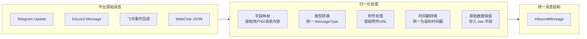
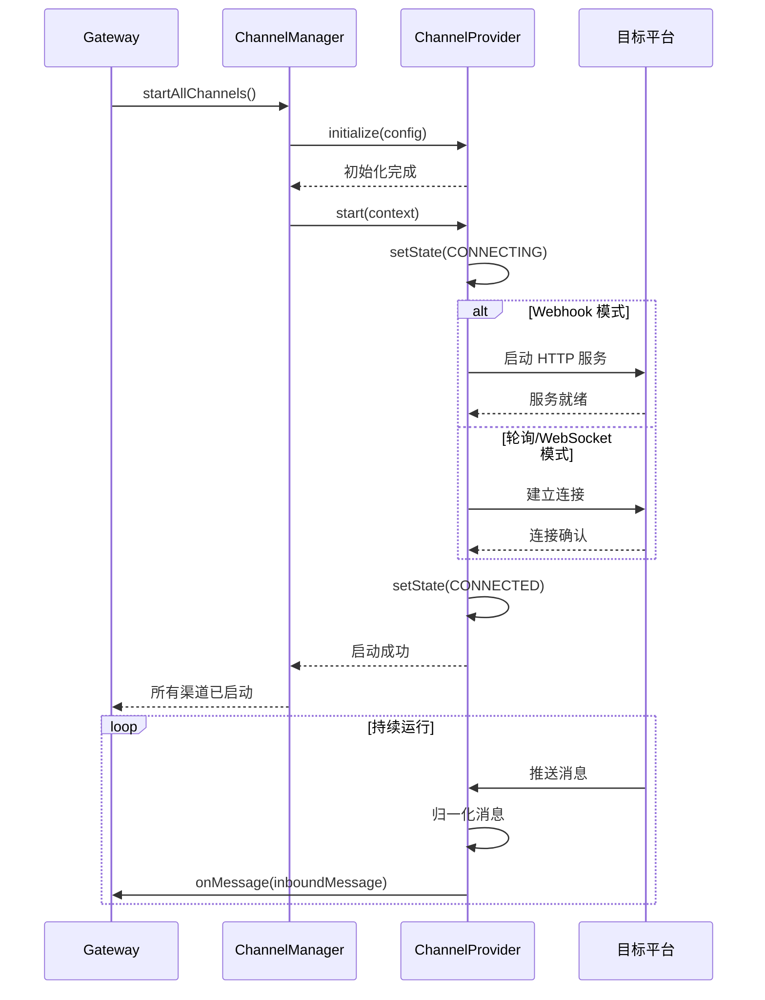
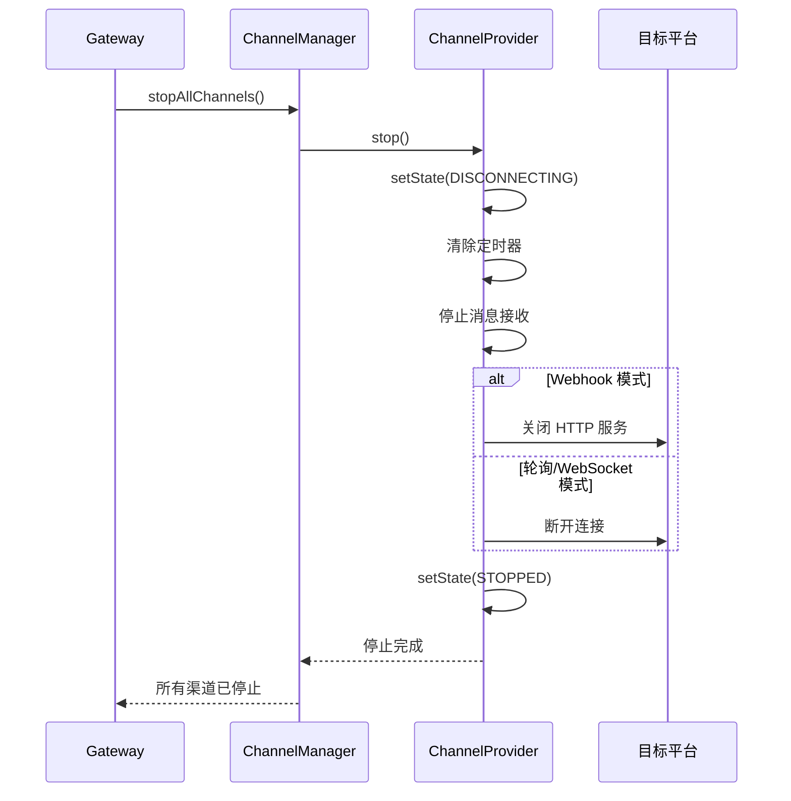
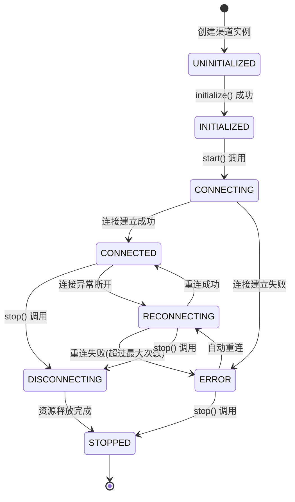
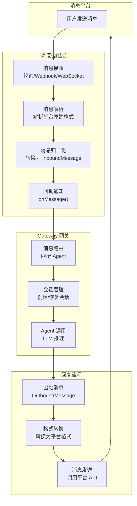
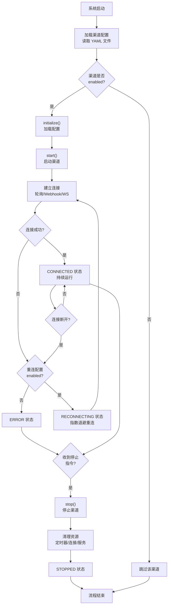
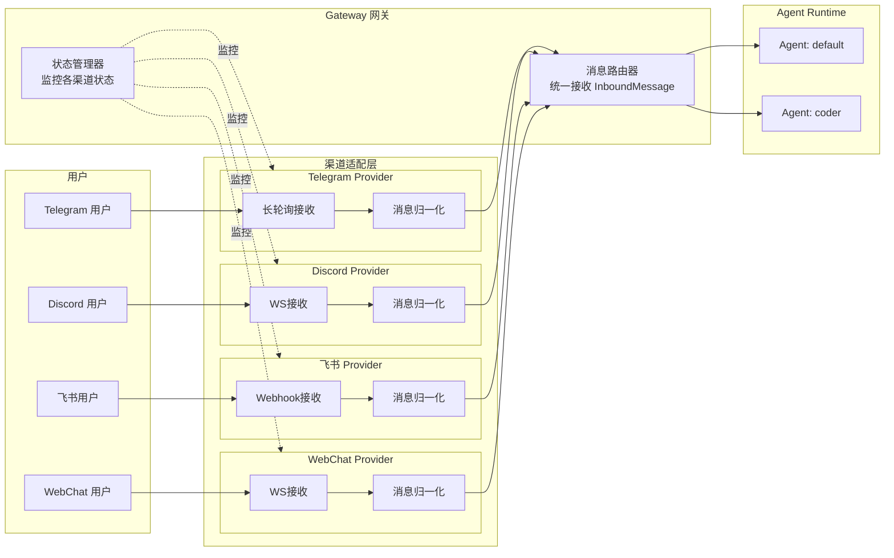

# MyOpenClaw Channels 渠道模块

> **版本**：v1.0.0  
> **修订日期**：2026-07-21  
> **修订人**：MyOpenClaw Core Team  
> **文档状态**：正式发布

---

## 目录

- [1. 模块概述](#1-模块概述)
  - [1.1 渠道适配层的定位](#11-渠道适配层的定位)
  - [1.2 设计目标](#12-设计目标)
  - [1.3 在系统架构中的位置](#13-在系统架构中的位置)
- [2. 统一接口 ChannelProvider 定义](#2-统一接口-channelprovider-定义)
  - [2.1 核心接口定义](#21-核心接口定义)
  - [2.2 消息结构定义](#22-消息结构定义)
  - [2.3 生命周期状态定义](#23-生命周期状态定义)
- [3. 核心能力](#3-核心能力)
  - [3.1 多平台消息上行采集](#31-多平台消息上行采集)
  - [3.2 消息标准化转换](#32-消息标准化转换)
  - [3.3 消息下行分发](#33-消息下行分发)
  - [3.4 渠道生命周期管理](#34-渠道生命周期管理)
- [4. 内置渠道实现说明](#4-内置渠道实现说明)
  - [4.1 Telegram 渠道](#41-telegram-渠道)
  - [4.2 Discord 渠道](#42-discord-渠道)
  - [4.3 飞书渠道](#43-飞书渠道)
  - [4.4 WebChat 渠道](#44-webchat-渠道)
  - [4.5 内置渠道对比](#45-内置渠道对比)
- [5. 自定义渠道开发指南](#5-自定义渠道开发指南)
  - [5.1 开发流程概述](#51-开发流程概述)
  - [5.2 完整实现示例](#52-完整实现示例)
  - [5.3 注册与配置](#53-注册与配置)
- [6. 消息归一化规则详解](#6-消息归一化规则详解)
  - [6.1 归一化流程](#61-归一化流程)
  - [6.2 各平台消息转换规则](#62-各平台消息转换规则)
  - [6.3 附件处理规则](#63-附件处理规则)
- [7. 生命周期管理](#7-生命周期管理)
  - [7.1 启动流程](#71-启动流程)
  - [7.2 重连机制](#72-重连机制)
  - [7.3 停止流程](#73-停止流程)
  - [7.4 状态转换](#74-状态转换)
- [8. 配置文件示例](#8-配置文件示例)
- [9. 流程图](#9-流程图)

---

## 1. 模块概述

### 1.1 渠道适配层的定位

Channels 渠道模块是 MyOpenClaw 系统架构的最上层——渠道接入层（Channels Layer），作为系统与外部消息平台的桥梁，负责对接各类即时通讯平台和聊天界面，实现消息的双向流转。

在 Hub-Spoke 六层架构中，Channels 渠道层位于最顶端，是消息进入系统的第一站：

- **上行方向（Inbound）**：采集来自各平台（Telegram、Discord、飞书、WebChat 等）的用户消息，将其归一化为统一格式后传递给 Gateway 网关
- **下行方向（Outbound）**：接收 Gateway 返回的 Agent 回复，转换为各平台的原始消息格式后发送给用户

### 1.2 设计目标

| 设计目标 | 说明 |
|----------|------|
| **统一抽象** | 通过 `ChannelProvider` 统一接口，屏蔽各平台 API 差异 |
| **可扩展性** | 支持通过插件机制接入新渠道，无需修改核心代码 |
| **消息归一化** | 将各平台异构消息格式统一转换为标准 `Message` 结构 |
| **生命周期管理** | 提供完善的启动、重连、停止机制，确保渠道稳定运行 |
| **配置驱动** | 通过 YAML 配置文件管理各渠道参数，支持热更新 |
| **错误隔离** | 单个渠道故障不影响其他渠道和系统整体运行 |

### 1.3 在系统架构中的位置

```
┌──────────────────────────────────────────────────────────────┐
│                     MyOpenClaw 系统架构                         │
│                                                              │
│  ┌──────────────────────────────────────────────────────┐    │
│  │           Channels 渠道接入层（本模块）              │    │
│  │  ┌──────────┐ ┌──────────┐ ┌──────────┐ ┌────────┐ │    │
│  │  │ Telegram │ │ Discord  │ │  飞书    │ │WebChat │ │    │
│  │  │ Provider │ │ Provider │ │ Provider │ │Provider│ │    │
│  │  └────┬─────┘ └────┬─────┘ └────┬─────┘ └───┬────┘ │    │
│  │       │            │            │            │       │    │
│  │       └────────────┴────────────┴────────────┘       │    │
│  │                    │ 统一 Message                     │    │
│  └────────────────────┼─────────────────────────────────┘    │
│                       │                                      │
│  ═════════════════════╪══════════════════════════════════    │
│                       │                                      │
│  ┌────────────────────▼─────────────────────────────────┐    │
│  │              Gateway 网关控制平面                     │    │
│  │         (WebSocket 18780 / HTTP 18790)               │    │
│  └────────────────────┬─────────────────────────────────┘    │
│                       │                                      │
│  ┌────────────────────▼─────────────────────────────────┐    │
│  │    Agent Runtime → Skill/Tools → Memory              │    │
│  └──────────────────────────────────────────────────────┘    │
│                                                              │
└──────────────────────────────────────────────────────────────┘
```

---

## 2. 统一接口 ChannelProvider 定义

### 2.1 核心接口定义

`ChannelProvider` 是所有渠道适配器必须实现的统一接口。它定义了渠道的生命周期管理、消息收发等核心方法。

```typescript
// channels/types.ts
// 渠道适配器统一接口定义

/**
 * 渠道适配器统一接口
 * 
 * 所有渠道（Telegram、Discord、飞书、WebChat 等）都必须实现此接口。
 * 该接口定义了渠道的生命周期管理方法和消息收发方法，
 * 使得 Gateway 网关可以统一管理所有渠道，无需关心各平台 API 的差异。
 */
export interface ChannelProvider {
  /**
   * 渠道唯一标识符
   * 用于在系统中唯一标识该渠道，如 "telegram"、"discord"、"feishu"、"webchat"
   */
  readonly channelId: string;

  /**
   * 渠道显示名称
   * 用于在 WebUI 和日志中展示，如 "Telegram Bot"、"Discord Bot"
   */
  readonly displayName: string;

  /**
   * 渠道能力描述
   * 声明该渠道支持的功能特性，Gateway 据此进行能力协商
   */
  readonly capabilities: ChannelCapabilities;

  /**
   * 初始化渠道
   * 
   * 在渠道启动前调用，用于加载配置、验证参数、创建内部资源等。
   * 此方法不应建立实际的网络连接，仅做准备工作。
   * 
   * @param config - 渠道配置对象，从 YAML 配置文件加载
   * @throws {ChannelConfigError} 配置无效时抛出
   */
  initialize(config: ChannelConfig): Promise<void>;

  /**
   * 启动渠道
   * 
   * 建立与目标平台的连接，开始监听和接收消息。
   * 启动成功后，渠道应进入 "connected" 状态，并开始通过 onMessage 回调推送消息。
   * 
   * @param context - 渠道运行上下文，包含消息回调等依赖
   * @throws {ChannelStartError} 启动失败时抛出
   */
  start(context: ChannelContext): Promise<void>;

  /**
   * 停止渠道
   * 
   * 断开与目标平台的连接，释放资源。
   * 停止后不再接收新消息，但已接收的消息会处理完毕。
   */
  stop(): Promise<void>;

  /**
   * 重连渠道
   * 
   * 在连接异常断开后尝试重新连接。
   * 实现应包含退避重试逻辑，避免频繁重连导致平台封禁。
   * 
   * @returns 是否重连成功
   */
  reconnect(): Promise<boolean>;

  /**
   * 发送消息
   * 
   * 将 Agent 的回复消息发送到目标平台。
   * 该方法需要将统一的 Message 结构转换为目标平台的 API 格式。
   * 
   * @param target - 目标接收者信息（渠道内用户/群组标识）
   * @param message - 待发送的统一消息对象
   * @returns 发送结果，包含平台返回的消息 ID 等
   * @throws {ChannelSendError} 发送失败时抛出
   */
  sendMessage(target: MessageTarget, message: OutboundMessage): Promise<SendMessageResult>;

  /**
   * 获取渠道当前状态
   * 
   * 返回渠道的运行状态、连接信息、统计数据等。
   * Gateway 定期调用此方法进行状态监控。
   * 
   * @returns 渠道状态对象
   */
  getStatus(): ChannelStatus;

  /**
   * 健康检查
   * 
   * 主动检测渠道与目标平台的连接是否正常。
   * 与 getStatus 不同，此方法会发起实际的网络请求进行探测。
   * 
   * @returns 是否健康
   */
  healthCheck(): Promise<boolean>;

  /**
   * 验证 Webhook 签名（可选）
   * 
   * 对于使用 Webhook 模式接收消息的渠道（如飞书），
   * 需要验证请求签名以确保请求来自可信来源。
   * 
   * @param signature - 请求中的签名
   * @param body - 请求体
   * @param timestamp - 时间戳
   * @returns 签名是否有效
   */
  verifyWebhook?(signature: string, body: string, timestamp: number): boolean;
}

/**
 * 渠道能力描述
 * 声明渠道支持的功能特性
 */
export interface ChannelCapabilities {
  /** 是否支持发送文本消息 */
  textMessage: boolean;
  /** 是否支持发送图片 */
  imageMessage: boolean;
  /** 是否支持发送文件 */
  fileMessage: boolean;
  /** 是否支持发送音频 */
  audioMessage: boolean;
  /** 是否支持发送视频 */
  videoMessage: boolean;
  /** 是否支持 Markdown 格式 */
  markdown: boolean;
  /** 是否支持富文本（HTML 等） */
  richText: boolean;
  /** 是否支持消息按钮（交互式消息） */
  buttons: boolean;
  /** 是否支持群组消息 */
  groupMessage: boolean;
  /** 最大文本消息长度 */
  maxTextLength: number;
  /** 是否支持消息编辑 */
  editMessage: boolean;
  /** 是否支持消息删除 */
  deleteMessage: boolean;
  /** 是否支持 typing 状态指示 */
  typingIndicator: boolean;
}
```

### 2.2 消息结构定义

```typescript
// channels/message.ts
// 渠道消息统一结构定义

/**
 * 入站消息（用户 → Agent）
 * 
 * 从各平台接收到的消息经归一化后的统一结构。
 * 所有渠道适配器都必须将平台原始消息转换为此结构。
 */
export interface InboundMessage {
  /** 消息唯一 ID（由渠道生成或系统生成） */
  messageId: string;
  /** 来源渠道 ID */
  channelId: string;
  /** 发送者用户 ID（渠道内的用户标识） */
  userId: string;
  /** 发送者用户名 */
  username: string;
  /** 发送者显示名称 */
  displayName?: string;
  /** 会话类型：私聊 / 群组 */
  chatType: 'private' | 'group';
  /** 群组 ID（chatType 为 group 时存在） */
  groupId?: string;
  /** 群组名称 */
  groupName?: string;
  /** 消息内容类型 */
  messageType: MessageType;
  /** 文本内容（messageType 为 text 时存在） */
  text?: string;
  /** 附件列表（messageType 非 text 时存在） */
  attachments?: MessageAttachment[];
  /** 回复的消息 ID（如果是回复消息） */
  replyToMessageId?: string;
  /** 原始消息对象（保留平台原始数据） */
  raw: unknown;
  /** 消息时间戳（Unix 毫秒） */
  timestamp: number;
}

/**
 * 出站消息（Agent → 用户）
 * 
 * Agent 生成回复后，转换为统一出站消息结构，
 * 再由渠道适配器转换为目标平台格式发送。
 */
export interface OutboundMessage {
  /** 消息内容类型 */
  messageType: MessageType;
  /** 文本内容 */
  text?: string;
  /** 附件列表 */
  attachments?: MessageAttachment[];
  /** 是否以 Markdown 格式发送 */
  markdown?: boolean;
  /** 交互按钮列表 */
  buttons?: MessageButton[];
  /** 回复的目标消息 ID（如果是回复） */
  replyToMessageId?: string;
  /** 是否禁用链接预览 */
  disableLinkPreview?: boolean;
}

/**
 * 消息类型枚举
 */
export enum MessageType {
  TEXT = 'text',
  IMAGE = 'image',
  FILE = 'file',
  AUDIO = 'audio',
  VIDEO = 'video',
  STICKER = 'sticker',
  LOCATION = 'location',
  CONTACT = 'contact',
}

/**
 * 消息附件
 */
export interface MessageAttachment {
  /** 附件类型 */
  type: 'image' | 'file' | 'audio' | 'video';
  /** 附件 URL（网络地址或本地路径） */
  url: string;
  /** 文件名 */
  filename?: string;
  /** 文件大小（字节） */
  size?: number;
  /** MIME 类型 */
  mimeType?: string;
  /** 图片宽度（图片附件） */
  width?: number;
  /** 图片高度（图片附件） */
  height?: number;
  /** 音频/视频时长（秒） */
  duration?: number;
  /** 缩略图 URL */
  thumbnailUrl?: string;
}

/**
 * 消息按钮（交互式消息）
 */
export interface MessageButton {
  /** 按钮文本 */
  text: string;
  /** 按钮回调数据 */
  callbackData?: string;
  /** 点击后跳转的 URL */
  url?: string;
  /** 按钮样式 */
  style?: 'default' | 'primary' | 'danger';
}

/**
 * 消息发送目标
 */
export interface MessageTarget {
  /** 目标用户 ID（私聊） */
  userId?: string;
  /** 目标群组 ID（群聊） */
  groupId?: string;
  /** 聊天类型 */
  chatType: 'private' | 'group';
}

/**
 * 消息发送结果
 */
export interface SendMessageResult {
  /** 是否发送成功 */
  success: boolean;
  /** 平台返回的消息 ID */
  platformMessageId?: string;
  /** 发送时间戳 */
  timestamp: number;
  /** 错误信息（失败时存在） */
  error?: string;
}
```

### 2.3 生命周期状态定义

```typescript
// channels/lifecycle.ts
// 渠道生命周期状态定义

/**
 * 渠道运行状态
 * 描述渠道在生命周期各阶段的状态
 */
export enum ChannelLifecycleState {
  /** 未初始化：渠道刚创建，尚未加载配置 */
  UNINITIALIZED = 'uninitialized',
  /** 已初始化：配置已加载，资源已准备，但未启动 */
  INITIALIZED = 'initialized',
  /** 连接中：正在建立与目标平台的连接 */
  CONNECTING = 'connecting',
  /** 已连接：连接已建立，正在接收消息 */
  CONNECTED = 'connected',
  /** 断开中：正在断开连接 */
  DISCONNECTING = 'disconnecting',
  /** 已断开：连接已断开 */
  DISCONNECTED = 'disconnected',
  /** 重连中：连接异常断开后正在尝试重连 */
  RECONNECTING = 'reconnecting',
  /** 错误：渠道发生错误，无法正常运行 */
  ERROR = 'error',
  /** 已停止：渠道已停止，不再运行 */
  STOPPED = 'stopped',
}

/**
 * 渠道状态信息
 */
export interface ChannelStatus {
  /** 当前生命周期状态 */
  state: ChannelLifecycleState;
  /** 渠道 ID */
  channelId: string;
  /** 渠道显示名称 */
  displayName: string;
  /** 是否正在运行（CONNECTED 状态） */
  isRunning: boolean;
  /** 启动时间戳 */
  startedAt?: number;
  /** 最后连接时间 */
  lastConnectedAt?: number;
  /** 最后断开时间 */
  lastDisconnectedAt?: number;
  /** 重连次数 */
  reconnectAttempts: number;
  /** 错误信息 */
  errorMessage?: string;
  /** 消息统计 */
  stats: ChannelStats;
}

/**
 * 渠道消息统计
 */
export interface ChannelStats {
  /** 接收消息总数 */
  messagesReceived: number;
  /** 发送消息总数 */
  messagesSent: number;
  /** 接收消息失败次数 */
  receiveErrors: number;
  /** 发送消息失败次数 */
  sendErrors: number;
  /** 最后接收消息时间 */
  lastMessageReceivedAt?: number;
  /** 最后发送消息时间 */
  lastMessageSentAt?: number;
}

/**
 * 渠道运行上下文
 * 在 start() 方法中传入，提供渠道运行所需的依赖
 */
export interface ChannelContext {
  /**
   * 消息接收回调
   * 当渠道收到新消息时，调用此回调将消息推送给 Gateway
   * @param message - 归一化后的入站消息
   */
  onMessage: (message: InboundMessage) => void;

  /**
   * 错误回调
   * 当渠道发生错误时，调用此回调通知 Gateway
   * @param error - 错误对象
   * @param channelId - 发生错误的渠道 ID
   */
  onError: (error: Error, channelId: string) => void;

  /**
   * 状态变更回调
   * 当渠道状态发生变化时，调用此回调通知 Gateway
   * @param channelId - 渠道 ID
   * @param newState - 新状态
   * @param oldState - 旧状态
   */
  onStateChange: (channelId: string, newState: ChannelLifecycleState, oldState: ChannelLifecycleState) => void;

  /** Gateway 提供的日志接口 */
  logger: ChannelLogger;
}

/**
 * 渠道日志接口
 */
export interface ChannelLogger {
  debug(message: string, ...args: unknown[]): void;
  info(message: string, ...args: unknown[]): void;
  warn(message: string, ...args: unknown[]): void;
  error(message: string, ...args: unknown[]): void;
}

/**
 * 渠道配置基类
 * 各渠道的配置继承此基类
 */
export interface ChannelConfig {
  /** 渠道 ID */
  channelId: string;
  /** 是否启用 */
  enabled: boolean;
  /** 重连配置 */
  reconnect?: ReconnectConfig;
}

/**
 * 重连配置
 */
export interface ReconnectConfig {
  /** 是否启用自动重连 */
  enabled: boolean;
  /** 最大重连次数（0 表示无限重连） */
  maxAttempts: number;
  /** 初始重连间隔（毫秒） */
  initialInterval: number;
  /** 最大重连间隔（毫秒） */
  maxInterval: number;
  /** 退避因子（每次重连间隔乘以此因子） */
  backoffFactor: number;
}
```

---

## 3. 核心能力

### 3.1 多平台消息上行采集

消息上行采集是指从各平台接收用户消息并传递给 Gateway 的过程。不同平台的消息接收机制各不相同：

| 接收模式 | 说明 | 适用渠道 |
|----------|------|----------|
| **长轮询（Long Polling）** | 客户端定期向平台 API 发起请求获取新消息 | Telegram (getUpdates) |
| **WebSocket** | 建立持久连接，平台主动推送消息 | Discord (Gateway) |
| **Webhook 回调** | 平台在收到消息后向配置的 URL 发起 HTTP 请求 | 飞书、Telegram (可选) |
| **内嵌服务** | 渠道本身就是系统内的一部分，直接接收消息 | WebChat |

渠道适配器封装了这些差异，对 Gateway 透明。无论底层使用哪种接收模式，Gateway 都通过 `onMessage` 回调统一接收归一化后的消息。

### 3.2 消息标准化转换

消息标准化转换（消息归一化）是渠道模块的核心能力之一。各平台的消息格式差异巨大：

| 平台 | 消息结构 | 用户标识 | 消息内容 |
|------|----------|----------|----------|
| Telegram | `Update` 对象 | 数字 ID（如 `123456789`） | `message.text`、`message.photo`、`message.document` |
| Discord | `Message` 对象 | 雪花 ID（如 `987654321098765432`） | `message.content`、`message.attachments`、`message.embeds` |
| 飞书 | 事件回调 JSON | Open ID（如 `ou_xxxxxxx`） | `event.message.content`（JSON 字符串） |
| WebChat | 自定义 JSON | 自定义用户 ID | `message.text`、`message.attachments` |

渠道适配器在接收消息后，调用归一化方法将其转换为统一的 `InboundMessage` 结构，再通过 `onMessage` 回调传递给 Gateway。

### 3.3 消息下行分发

消息下行分发是指将 Agent 的回复消息发送给用户的过程。Gateway 调用渠道适配器的 `sendMessage` 方法，传入统一的 `OutboundMessage` 结构，适配器将其转换为目标平台的 API 格式后发送。

下行分发需要处理以下情况：

- **格式转换**：将统一 `OutboundMessage` 转换为平台 API 格式
- **长度限制**：各平台对消息长度有不同限制，超长消息需要分片发送
- **Markdown 适配**：各平台的 Markdown 语法支持程度不同，需要适配转换
- **附件上传**：图片、文件等附件需要先上传到平台再发送
- **按钮渲染**：交互按钮需要转换为平台特定的按钮格式
- **发送失败重试**：网络波动导致发送失败时进行重试

### 3.4 渠道生命周期管理

渠道模块提供完整的生命周期管理能力，确保渠道在各阶段都能正确运行：

| 生命周期阶段 | 说明 | 关键操作 |
|--------------|------|----------|
| **初始化** | 加载配置、验证参数 | `initialize()` |
| **启动** | 建立连接、开始接收消息 | `start()` |
| **运行** | 持续接收和发送消息 | `onMessage` 回调、`sendMessage()` |
| **重连** | 异常断开后自动恢复 | `reconnect()` |
| **停止** | 断开连接、释放资源 | `stop()` |

---

## 4. 内置渠道实现说明

### 4.1 Telegram 渠道

#### 特点

- **接收模式**：支持长轮询（`getUpdates`）和 Webhook 两种模式
- **消息能力**：支持文本、图片、文件、音频、视频、贴纸、位置
- **Markdown 支持**：支持 Telegram Markdown V2 和 HTML 格式
- **交互能力**：支持 Inline Keyboard 按钮
- **群组支持**：支持群组和超级群组消息
- **Bot API**：基于 Telegram Bot API

#### 配置示例

```yaml
# ~/.myopenclaw/channels/telegram.yaml
# Telegram 渠道配置

channelId: "telegram"
enabled: true

# Telegram Bot Token
# 通过 @BotFather 创建 Bot 获取
botToken: "123456789:ABCdefGHIjklMNOpqrsTUVwxyz"

# 消息接收模式：polling（长轮询）或 webhook
mode: "polling"

# 长轮询配置（mode 为 polling 时生效）
polling:
  # 轮询间隔（毫秒）
  interval: 1000
  # 长轮询超时（秒）
  timeout: 30
  # 允许更新的类型
  allowedUpdates:
    - "message"
    - "edited_message"
    - "callback_query"

# Webhook 配置（mode 为 webhook 时生效）
webhook:
  # Webhook URL（需要 HTTPS）
  url: "https://your-domain.com/webhook/telegram"
  # 监听端口
  port: 8443
  # 自签证书路径（可选）
  certificatePath: ""

# 重连配置
reconnect:
  enabled: true
  maxAttempts: 0       # 0 表示无限重连
  initialInterval: 1000
  maxInterval: 30000
  backoffFactor: 2

# 消息处理配置
message:
  # 是否允许处理群组消息
  allowGroupMessage: true
  # 群组中是否需要 @Bot 才响应
  requireMentionInGroup: true
  # 允许的用户 ID 列表（空表示允许所有用户）
  allowedUserIds: []
```

#### 归一化示例

Telegram 的 `Update` 对象归一化为 `InboundMessage` 的映射关系：

| Telegram 字段 | InboundMessage 字段 | 说明 |
|---------------|---------------------|------|
| `update_id` | `messageId` | 消息 ID |
| `message.from.id` | `userId` | 用户 ID |
| `message.from.username` | `username` | 用户名 |
| `message.from.first_name` | `displayName` | 显示名称 |
| `message.chat.type` | `chatType` | 聊天类型（private/group） |
| `message.chat.id` | `groupId` | 群组 ID（群聊时） |
| `message.chat.title` | `groupName` | 群组名称 |
| `message.text` | `text` | 文本内容 |
| `message.photo[-1]` | `attachments[0]` | 图片附件（取最大尺寸） |
| `message.document` | `attachments[0]` | 文件附件 |
| `message.date` | `timestamp` | 时间戳 |
| 原始 `Update` 对象 | `raw` | 保留原始数据 |

### 4.2 Discord 渠道

#### 特点

- **接收模式**：WebSocket Gateway 连接（实时推送）
- **消息能力**：支持文本、图片、文件、音频、视频、Embed 富文本
- **Markdown 支持**：支持 Discord Markdown 语法
- **交互能力**：支持按钮组件和选择菜单
- **群组支持**：支持服务器频道和私信
- **Gateway API**：基于 Discord Gateway API

#### 配置示例

```yaml
# ~/.myopenclaw/channels/discord.yaml
# Discord 渠道配置

channelId: "discord"
enabled: true

# Discord Bot Token
# 通过 Discord Developer Portal 创建 Bot 获取
botToken: "MTIzNDU2Nzg5MDEyMzQ1Njc4OQ.XxXxXx.XxXxXxXxXxXxXxXxXxXxXxXxXxXx"

# Gateway 配置
gateway:
  # Gateway Intents（需要申请的意图权限）
  intents:
    - "GUILDS"              # 服务器相关事件
    - "GUILD_MESSAGES"      # 服务器消息
    - "DIRECT_MESSAGES"     # 私信
    - "MESSAGE_CONTENT"     # 消息内容（需要申请）
  # Gateway 版本
  version: 10

# 消息处理配置
message:
  # 允许的服务器 ID 列表（空表示允许所有服务器）
  allowedGuildIds: []
  # 允许的频道 ID 列表（空表示允许所有频道）
  allowedChannelIds: []
  # 是否需要 @Bot 才响应（服务器消息）
  requireMention: true
  # 允许的用户 ID 列表（空表示允许所有用户）
  allowedUserIds: []

# 重连配置
reconnect:
  enabled: true
  maxAttempts: 0
  initialInterval: 1000
  maxInterval: 30000
  backoffFactor: 2
```

#### 归一化示例

| Discord 字段 | InboundMessage 字段 | 说明 |
|--------------|---------------------|------|
| `message.id` | `messageId` | 消息 ID（雪花 ID） |
| `message.author.id` | `userId` | 用户 ID |
| `message.author.username` | `username` | 用户名 |
| `message.author.global_name` | `displayName` | 全局显示名称 |
| `message.guild_id` 是否存在 | `chatType` | 有 guild_id 为 group，否则为 private |
| `message.guild_id` | `groupId` | 服务器 ID |
| `message.channel.name` | `groupName` | 频道名称 |
| `message.content` | `text` | 文本内容 |
| `message.attachments` | `attachments` | 附件列表 |
| `message.timestamp` | `timestamp` | 时间戳 |
| 原始 `Message` 对象 | `raw` | 保留原始数据 |

### 4.3 飞书渠道

#### 特点

- **接收模式**：Webhook 事件回调
- **消息能力**：支持文本、富文本（Post）、图片、文件、卡片消息
- **Markdown 支持**：支持飞书富文本格式（不支持原生 Markdown）
- **交互能力**：支持卡片消息中的交互组件
- **群组支持**：支持群聊和单聊
- **开放平台 API**：基于飞书开放平台 API

#### 配置示例

```yaml
# ~/.myopenclaw/channels/feishu.yaml
# 飞书渠道配置

channelId: "feishu"
enabled: true

# 飞书应用凭证
# 通过飞书开放平台创建应用获取
appId: "cli_xxxxxxxxxxxxxxxx"
appSecret: "xxxxxxxxxxxxxxxxxxxxxxxxxxxxxxxx"

# 事件订阅配置（Webhook 模式）
eventSubscription:
  # 加密策略
  encryptKey: "xxxxxxxxxxxxxxxxxxxxxxxxxxxxxxxx"
  # 签名验证密钥
  verificationToken: "xxxxxxxxxxxxxxxxxxxxxxxxxxxxxxxx"
  # Webhook 监听端口
  port: 9876
  # Webhook 路径
  path: "/webhook/feishu"

# 消息处理配置
message:
  # 允许的群组 ID 列表（空表示允许所有群组）
  allowedChatIds: []
  # 是否需要 @Bot 才响应（群聊消息）
  requireMentionInGroup: true
  # 允许的用户 ID 列表（空表示允许所有用户）
  allowedUserIds: []

# 重连配置
reconnect:
  enabled: true
  maxAttempts: 0
  initialInterval: 1000
  maxInterval: 30000
  backoffFactor: 2

# 令牌刷新配置
token:
  # 令牌自动刷新间隔（毫秒），飞书令牌有效期 2 小时
  refreshInterval: 7200000
```

#### 归一化示例

飞书的消息内容以 JSON 字符串形式存储在 `event.message.content` 中，需要解析后提取：

| 飞书字段 | InboundMessage 字段 | 说明 |
|----------|---------------------|------|
| `event.message.message_id` | `messageId` | 消息 ID |
| `event.sender.sender_id.open_id` | `userId` | 用户 Open ID |
| `event.sender.sender_id.name` | `username` | 用户名 |
| `event.message.chat_type` | `chatType` | 聊天类型（p2p/group） |
| `event.message.chat_id` | `groupId` | 群组 ID（群聊时） |
| `event.message.message_type` | `messageType` | 消息类型 |
| `JSON.parse(content).text` | `text` | 文本内容（文本消息） |
| `event.message.create_time` | `timestamp` | 创建时间 |
| 原始事件对象 | `raw` | 保留原始数据 |

### 4.4 WebChat 渠道

#### 特点

- **接收模式**：内嵌 WebSocket 服务，直接接收前端消息
- **消息能力**：支持文本、图片、文件，支持 Markdown 渲染
- **Markdown 支持**：完整支持 Markdown 语法，前端渲染
- **交互能力**：支持自定义按钮和快捷回复
- **会话管理**：基于浏览器会话，支持多用户并发
- **无需第三方**：完全本地实现，无需注册第三方平台

#### 配置示例

```yaml
# ~/.myopenclaw/channels/webchat.yaml
# WebChat 渠道配置

channelId: "webchat"
enabled: true

# WebSocket 服务配置
server:
  # 监听地址
  host: "127.0.0.1"
  # WebSocket 端口（通常与 Gateway 共用 18780）
  port: 18780
  # WebSocket 路径
  path: "/ws/webchat"

# 会话配置
session:
  # 会话超时时间（毫秒），超时后自动关闭
  timeout: 3600000
  # 最大并发会话数
  maxConcurrent: 100
  # 是否允许匿名访问
  allowAnonymous: true
  # 匿名用户前缀
  anonymousPrefix: "guest_"

# 消息处理配置
message:
  # 最大消息长度
  maxLength: 4096
  # 允许的文件类型
  allowedFileTypes:
    - "image/png"
    - "image/jpeg"
    - "image/gif"
    - "image/webp"
    - "application/pdf"
    - "text/plain"
  # 最大文件大小（字节）
  maxFileSize: 10485760

# CORS 配置
cors:
  # 允许的来源
  origins:
    - "http://127.0.0.1:18791"
    - "http://localhost:18791"
  # 允许的请求方法
  methods:
    - "GET"
    - "POST"
  # 允许的请求头
  headers:
    - "Content-Type"
    - "Authorization"
```

#### 归一化示例

WebChat 的消息已经是接近统一的格式，归一化较为简单：

| WebChat 字段 | InboundMessage 字段 | 说明 |
|--------------|---------------------|------|
| `message.id` | `messageId` | 消息 ID |
| `session.userId` | `userId` | 用户 ID |
| `session.username` | `username` | 用户名 |
| `session.displayName` | `displayName` | 显示名称 |
| 固定值 `private` | `chatType` | WebChat 始终为私聊 |
| `message.type` | `messageType` | 消息类型 |
| `message.text` | `text` | 文本内容 |
| `message.attachments` | `attachments` | 附件列表 |
| `message.timestamp` | `timestamp` | 时间戳 |
| 原始消息对象 | `raw` | 保留原始数据 |

### 4.5 内置渠道对比

| 特性 | Telegram | Discord | 飞书 | WebChat |
|------|----------|---------|------|---------|
| 接收模式 | 轮询/Webhook | WebSocket | Webhook | 内嵌服务 |
| 文本消息 | 支持 | 支持 | 支持 | 支持 |
| 图片消息 | 支持 | 支持 | 支持 | 支持 |
| 文件消息 | 支持 | 支持 | 支持 | 支持 |
| 音频消息 | 支持 | 支持 | 支持 | 不支持 |
| 视频消息 | 支持 | 支持 | 支持 | 不支持 |
| Markdown | V2/HTML | Discord MD | 富文本 | 完整 MD |
| 交互按钮 | Inline KB | 按钮 | 卡片组件 | 自定义 |
| 群组消息 | 支持 | 支持 | 支持 | 不支持 |
| @提及触发 | 支持 | 支持 | 支持 | 不需要 |
| 第三方依赖 | BotFather | Dev Portal | 开放平台 | 无 |
| 最大文本长度 | 4096 | 2000 | 30000 | 4096 |
| 消息编辑 | 支持 | 支持 | 支持 | 支持 |
| Typing 指示 | 支持 | 支持 | 支持 | 支持 |

---

## 5. 自定义渠道开发指南

### 5.1 开发流程概述

开发自定义渠道适配器的流程如下：

1. **分析目标平台 API**：了解平台的消息接收和发送机制
2. **实现 `ChannelProvider` 接口**：创建适配器类，实现所有必需方法
3. **实现消息归一化**：编写平台原始消息到 `InboundMessage` 的转换逻辑
4. **实现消息发送**：编写 `OutboundMessage` 到平台 API 的转换和发送逻辑
5. **实现生命周期管理**：实现启动、重连、停止逻辑
6. **注册渠道**：将适配器注册到渠道管理器
7. **编写配置文件**：创建 YAML 配置文件

### 5.2 完整实现示例

以下是一个自定义渠道（以企业微信为例）的完整实现示例：

```typescript
// channels/custom/wecom-provider.ts
// 企业微信渠道适配器实现示例
// 演示如何从头开发一个自定义渠道

import type {
  ChannelProvider,
  ChannelCapabilities,
  ChannelConfig,
  ChannelContext,
  ChannelStatus,
  ChannelLifecycleState,
  InboundMessage,
  OutboundMessage,
  MessageTarget,
  SendMessageResult,
} from '../types';
import { MessageType, ChannelLifecycleState as State } from '../types';

/**
 * 企业微信渠道配置
 * 继承基础渠道配置，添加企业微信特有配置项
 */
interface WeComConfig extends ChannelConfig {
  /** 企业 ID */
  corpId: string;
  /** 应用 AgentId */
  agentId: number;
  /** 应用 Secret */
  secret: string;
  /** 回调 URL Token */
  callbackToken: string;
  /** 回调加密 EncodingAESKey */
  encodingAESKey: string;
  /** 回调监听端口 */
  callbackPort: number;
}

/**
 * 企业微信渠道适配器
 * 
 * 实现了 ChannelProvider 接口，对接企业微信消息 API。
 * 使用 Webhook 回调模式接收消息，通过企业微信 API 发送消息。
 */
export class WeComProvider implements ChannelProvider {
  /** 渠道 ID */
  readonly channelId = 'wecom';
  /** 渠道显示名称 */
  readonly displayName = '企业微信';
  
  /** 渠道能力声明 */
  readonly capabilities: ChannelCapabilities = {
    textMessage: true,
    imageMessage: true,
    fileMessage: true,
    audioMessage: false,
    videoMessage: false,
    markdown: true,
    richText: false,
    buttons: false,
    groupMessage: true,
    maxTextLength: 2048,
    editMessage: false,
    deleteMessage: false,
    typingIndicator: false,
  };

  /** 渠道配置 */
  private config!: WeComConfig;
  /** 渠道运行上下文 */
  private context!: ChannelContext;
  /** 当前生命周期状态 */
  private currentState: ChannelLifecycleState = State.UNINITIALIZED;
  /** 访问令牌 */
  private accessToken: string | null = null;
  /** 令牌过期时间 */
  private tokenExpiresAt: number = 0;
  /** 令牌刷新定时器 */
  private tokenRefreshTimer: NodeJS.Timeout | null = null;
  /** HTTP 服务实例 */
  private httpServer: ReturnType<typeof import('http').createServer> | null = null;
  /** 消息统计 */
  private stats = {
    messagesReceived: 0,
    messagesSent: 0,
    receiveErrors: 0,
    sendErrors: 0,
  };
  /** 启动时间 */
  private startedAt: number | null = null;
  /** 重连次数 */
  private reconnectAttempts = 0;

  /**
   * 初始化渠道
   * 加载并验证配置
   */
  async initialize(config: ChannelConfig): Promise<void> {
    this.config = config as WeComConfig;

    // 验证必需配置项
    if (!this.config.corpId) {
      throw new Error('企业微信渠道配置缺少 corpId');
    }
    if (!this.config.secret) {
      throw new Error('企业微信渠道配置缺少 secret');
    }
    if (!this.config.agentId) {
      throw new Error('企业微信渠道配置缺少 agentId');
    }

    this.setState(State.INITIALIZED);
    console.log(`[${this.channelId}] 渠道初始化完成`);
  }

  /**
   * 启动渠道
   * 获取访问令牌，启动 Webhook 服务
   */
  async start(context: ChannelContext): Promise<void> {
    this.context = context;
    this.setState(State.CONNECTING);

    try {
      // 步骤 1：获取访问令牌
      await this.refreshAccessToken();
      
      // 步骤 2：启动令牌自动刷新（每 2 小时刷新一次）
      this.tokenRefreshTimer = setInterval(() => {
        this.refreshAccessToken().catch(err => {
          this.context.logger.error('令牌刷新失败:', err);
        });
      }, 7200000); // 2 小时

      // 步骤 3：启动 Webhook HTTP 服务
      await this.startWebhookServer();

      this.startedAt = Date.now();
      this.setState(State.CONNECTED);
      this.context.logger.info(`[${this.channelId}] 渠道启动成功`);
    } catch (error) {
      this.setState(State.ERROR);
      throw error;
    }
  }

  /**
   * 停止渠道
   * 清理定时器和 HTTP 服务
   */
  async stop(): Promise<void> {
    this.setState(State.DISCONNECTING);

    // 清除令牌刷新定时器
    if (this.tokenRefreshTimer) {
      clearInterval(this.tokenRefreshTimer);
      this.tokenRefreshTimer = null;
    }

    // 关闭 HTTP 服务
    if (this.httpServer) {
      await new Promise<void>(resolve => {
        this.httpServer!.close(() => resolve());
      });
      this.httpServer = null;
    }

    this.setState(State.STOPPED);
    this.context?.logger.info(`[${this.channelId}] 渠道已停止`);
  }

  /**
   * 重连
   * 重新获取令牌并重启 Webhook 服务
   */
  async reconnect(): Promise<boolean> {
    this.setState(State.RECONNECTING);
    this.reconnectAttempts++;
    this.context?.logger.info(`[${this.channelId}] 正在重连 (第 ${this.reconnectAttempts} 次)`);

    try {
      // 先停止现有服务
      if (this.httpServer) {
        await new Promise<void>(resolve => this.httpServer!.close(() => resolve()));
        this.httpServer = null;
      }

      // 重新获取令牌
      await this.refreshAccessToken();

      // 重启 Webhook 服务
      await this.startWebhookServer();

      this.setState(State.CONNECTED);
      this.reconnectAttempts = 0;
      this.context?.logger.info(`[${this.channelId}] 重连成功`);
      return true;
    } catch (error) {
      this.context?.logger.error(`[${this.channelId}] 重连失败:`, error);
      this.setState(State.ERROR);
      return false;
    }
  }

  /**
   * 发送消息
   * 将统一 OutboundMessage 转换为企业微信 API 格式并发送
   */
  async sendMessage(target: MessageTarget, message: OutboundMessage): Promise<SendMessageResult> {
    try {
      // 确保令牌有效
      if (!this.accessToken || Date.now() >= this.tokenExpiresAt) {
        await this.refreshAccessToken();
      }

      // 根据消息类型构造 API 请求体
      let apiPath: string;
      let apiBody: Record<string, unknown>;

      if (message.messageType === MessageType.TEXT) {
        // 文本消息
        apiPath = '/cgi-bin/message/send';
        apiBody = {
          touser: target.userId,
          msgtype: 'text',
          agentid: this.config.agentId,
          text: {
            content: message.text || '',
          },
        };
      } else if (message.messageType === MessageType.IMAGE && message.attachments?.[0]) {
        // 图片消息：先上传图片获取 media_id，再发送
        const mediaId = await this.uploadMedia(
          message.attachments[0].url,
          'image'
        );
        apiPath = '/cgi-bin/message/send';
        apiBody = {
          touser: target.userId,
          msgtype: 'image',
          agentid: this.config.agentId,
          image: {
            media_id: mediaId,
          },
        };
      } else {
        // 默认作为文本消息发送
        apiPath = '/cgi-bin/message/send';
        apiBody = {
          touser: target.userId,
          msgtype: 'text',
          agentid: this.config.agentId,
          text: {
            content: message.text || '[不支持的消息类型]',
          },
        };
      }

      // 发送 HTTP 请求
      const response = await fetch(
        `https://qyapi.weixin.qq.com${apiPath}?access_token=${this.accessToken}`,
        {
          method: 'POST',
          headers: { 'Content-Type': 'application/json' },
          body: JSON.stringify(apiBody),
        }
      );

      const result = await response.json() as { errcode: number; errmsg: string; msgid?: string };

      if (result.errcode !== 0) {
        throw new Error(`企业微信 API 错误: ${result.errcode} ${result.errmsg}`);
      }

      this.stats.messagesSent++;
      this.stats.lastMessageSentAt = Date.now();

      return {
        success: true,
        platformMessageId: result.msgid,
        timestamp: Date.now(),
      };
    } catch (error) {
      this.stats.sendErrors++;
      this.context?.logger.error(`[${this.channelId}] 消息发送失败:`, error);
      return {
        success: false,
        timestamp: Date.now(),
        error: error instanceof Error ? error.message : String(error),
      };
    }
  }

  /**
   * 获取渠道状态
   */
  getStatus(): ChannelStatus {
    return {
      state: this.currentState,
      channelId: this.channelId,
      displayName: this.displayName,
      isRunning: this.currentState === State.CONNECTED,
      startedAt: this.startedAt || undefined,
      reconnectAttempts: this.reconnectAttempts,
      stats: {
        messagesReceived: this.stats.messagesReceived,
        messagesSent: this.stats.messagesSent,
        receiveErrors: this.stats.receiveErrors,
        sendErrors: this.stats.sendErrors,
        lastMessageReceivedAt: undefined,
        lastMessageSentAt: this.stats.lastMessageSentAt,
      },
    };
  }

  /**
   * 健康检查
   * 通过调用企业微信 API 验证连接是否正常
   */
  async healthCheck(): Promise<boolean> {
    try {
      if (!this.accessToken) return false;
      // 调用一个简单的 API 验证令牌是否有效
      const response = await fetch(
        `https://qyapi.weixin.qq.com/cgi-bin/get_api_domain_ip?access_token=${this.accessToken}`
      );
      const result = await response.json() as { errcode: number };
      return result.errcode === 0;
    } catch {
      return false;
    }
  }

  // ==================== 私有方法 ====================

  /**
   * 刷新访问令牌
   * 企业微信令牌有效期 2 小时，需要定期刷新
   */
  private async refreshAccessToken(): Promise<void> {
    const url = `https://qyapi.weixin.qq.com/cgi-bin/gettoken?corpid=${this.config.corpId}&corpsecret=${this.config.secret}`;
    const response = await fetch(url);
    const result = await response.json() as {
      errcode: number;
      errmsg: string;
      access_token: string;
      expires_in: number;
    };

    if (result.errcode !== 0) {
      throw new Error(`获取访问令牌失败: ${result.errcode} ${result.errmsg}`);
    }

    this.accessToken = result.access_token;
    // 提前 5 分钟过期，避免边界问题
    this.tokenExpiresAt = Date.now() + (result.expires_in - 300) * 1000;
  }

  /**
   * 启动 Webhook HTTP 服务
   * 接收企业微信的消息回调
   */
  private async startWebhookServer(): Promise<void> {
    const http = await import('http');
    
    this.httpServer = http.createServer((req, res) => {
      this.handleWebhookRequest(req, res).catch(err => {
        this.context.logger.error('Webhook 处理错误:', err);
        res.statusCode = 500;
        res.end('Internal Server Error');
      });
    });

    await new Promise<void>((resolve, reject) => {
      this.httpServer!.listen(this.config.callbackPort, () => {
        resolve();
      });
      this.httpServer!.on('error', reject);
    });

    this.context.logger.info(`[${this.channelId}] Webhook 服务监听端口: ${this.config.callbackPort}`);
  }

  /**
   * 处理 Webhook 请求
   * 企业微信的回调包括 URL 验证和消息推送两种
   */
  private async handleWebhookRequest(
    req: import('http').IncomingMessage,
    res: import('http').ServerResponse
  ): Promise<void> {
    // 收集请求体
    const chunks: Buffer[] = [];
    for await (const chunk of req) {
      chunks.push(chunk as Buffer);
    }
    const body = Buffer.concat(chunks).toString();

    // 解析 URL 参数
    const url = new URL(req.url || '', `http://localhost`);
    const msgSignature = url.searchParams.get('msg_signature') || '';
    const timestamp = parseInt(url.searchParams.get('timestamp') || '0', 10);
    const nonce = url.searchParams.get('nonce') || '';

    // 验证签名（简化示例，实际需要实现完整的加解密逻辑）
    // TODO: 实现企业微信消息加解密

    // 解析消息
    const parsed = JSON.parse(body) as {
      ToUserName: string;
      FromUserName: string;
      MsgType: string;
      Content?: string;
      MsgId?: string;
      CreateTime: number;
    };

    // 归一化为 InboundMessage
    const inboundMessage: InboundMessage = {
      messageId: parsed.MsgId || `msg_${Date.now()}`,
      channelId: this.channelId,
      userId: parsed.FromUserName,
      username: parsed.FromUserName,
      chatType: 'private',
      messageType: parsed.MsgType === 'text' ? MessageType.TEXT : MessageType.TEXT,
      text: parsed.Content,
      raw: parsed,
      timestamp: parsed.CreateTime * 1000,
    };

    // 通过回调推送消息
    this.context.onMessage(inboundMessage);
    this.stats.messagesReceived++;

    // 返回响应
    res.statusCode = 200;
    res.setHeader('Content-Type', 'application/json');
    res.end(JSON.stringify({ errcode: 0, errmsg: 'ok' }));
  }

  /**
   * 上传临时素材
   * 企业微信发送图片/文件需要先上传获取 media_id
   */
  private async uploadMedia(fileUrl: string, type: string): Promise<string> {
    // 下载文件
    const fileResponse = await fetch(fileUrl);
    const fileBuffer = await fileResponse.arrayBuffer();

    // 上传到企业微信
    const formData = new FormData();
    formData.append('media', new Blob([fileBuffer]), 'upload');

    const response = await fetch(
      `https://qyapi.weixin.qq.com/cgi-bin/media/upload?access_token=${this.accessToken}&type=${type}`,
      {
        method: 'POST',
        body: formData,
      }
    );

    const result = await response.json() as {
      errcode: number;
      errmsg: string;
      media_id: string;
    };

    if (result.errcode !== 0) {
      throw new Error(`上传素材失败: ${result.errcode} ${result.errmsg}`);
    }

    return result.media_id;
  }

  /**
   * 设置状态并通知 Gateway
   */
  private setState(newState: ChannelLifecycleState): void {
    const oldState = this.currentState;
    if (oldState === newState) return;
    this.currentState = newState;
    this.context?.onStateChange(this.channelId, newState, oldState);
  }
}
```

### 5.3 注册与配置

完成适配器开发后，需要将其注册到渠道管理器：

```typescript
// channels/registry.ts
// 渠道注册示例

import { ChannelManager } from '@myopenclaw/channels';
import { WeComProvider } from './custom/wecom-provider';

/**
 * 注册自定义渠道
 */
async function registerCustomChannel(): Promise<void> {
  const manager = ChannelManager.getInstance();

  // 注册企业微信渠道
  manager.register('wecom', () => new WeComProvider());

  console.log('自定义渠道 "wecom" 已注册');
}

// 在应用启动时调用
registerCustomChannel();
```

配置文件示例：

```yaml
# ~/.myopenclaw/channels/wecom.yaml
# 企业微信渠道配置

channelId: "wecom"
enabled: true

corpId: "wxXXXXXXXXXXXXXXXX"
agentId: 1000002
secret: "XXXXXXXXXXXXXXXXXXXXXXXXXXXXXXXXXXXXXXXX"
callbackToken: "XXXXXXXXXXXXXXXXXXXXXXXXXXXXXXXX"
encodingAESKey: "XXXXXXXXXXXXXXXXXXXXXXXXXXXXXXXXXXXXXXXXXXXXXXXXXXXXXXXXXXXXXXXX"
callbackPort: 9877

reconnect:
  enabled: true
  maxAttempts: 0
  initialInterval: 1000
  maxInterval: 30000
  backoffFactor: 2
```

---

## 6. 消息归一化规则详解

### 6.1 归一化流程

消息归一化是将各平台异构消息转换为统一 `InboundMessage` 结构的过程。归一化流程分为以下步骤：



### 6.2 各平台消息转换规则

#### Telegram 消息转换

```typescript
// channels/telegram/normalizer.ts
// Telegram 消息归一化器

import type { InboundMessage, MessageAttachment } from '../types';
import { MessageType } from '../types';

/**
 * Telegram Update 对象类型（简化定义）
 */
interface TelegramUpdate {
  update_id: number;
  message?: TelegramMessage;
  edited_message?: TelegramMessage;
  callback_query?: TelegramCallbackQuery;
}

interface TelegramMessage {
  message_id: number;
  from?: { id: number; username?: string; first_name?: string; last_name?: string };
  chat: { id: number; type: string; title?: string };
  date: number;
  text?: string;
  photo?: TelegramPhotoSize[];
  document?: { file_id: string; file_name?: string; file_size?: number; mime_type?: string };
  audio?: { file_id: string; duration?: number; file_size?: number };
  video?: { file_id: string; duration?: number; width?: number; height?: number; file_size?: number };
  caption?: string;
  reply_to_message?: TelegramMessage;
}

interface TelegramPhotoSize {
  file_id: string;
  width: number;
  height: number;
  file_size?: number;
}

interface TelegramCallbackQuery {
  id: string;
  from: { id: number; username?: string };
  data: string;
  message?: TelegramMessage;
}

/**
 * 将 Telegram Update 归一化为 InboundMessage
 * @param update - Telegram Bot API 返回的 Update 对象
 * @returns 归一化后的消息
 */
export function normalizeTelegramMessage(update: TelegramUpdate): InboundMessage | null {
  // 优先处理普通消息
  const tgMessage = update.message || update.edited_message;
  
  if (tgMessage) {
    return normalizeTelegramTextOrMedia(tgMessage);
  }
  
  // 处理回调查询（按钮点击）
  if (update.callback_query) {
    const cq = update.callback_query;
    if (cq.message) {
      const msg = normalizeTelegramTextOrMedia(cq.message);
      if (msg) {
        // 回调查询将 data 作为消息内容
        msg.text = cq.data;
        msg.messageType = MessageType.TEXT;
        return msg;
      }
    }
  }
  
  return null;
}

/**
 * 归一化 Telegram 文本或媒体消息
 */
function normalizeTelegramTextOrMedia(msg: TelegramMessage): InboundMessage | null {
  if (!msg.from) return null;
  
  // 确定消息类型和附件
  let messageType: MessageType = MessageType.TEXT;
  let text: string | undefined = msg.text;
  let attachments: MessageAttachment[] | undefined;
  
  if (msg.photo && msg.photo.length > 0) {
    // 图片消息：取最大尺寸的图片
    messageType = MessageType.IMAGE;
    const largestPhoto = msg.photo[msg.photo.length - 1];
    attachments = [{
      type: 'image',
      url: largestPhoto.file_id,  // Telegram 使用 file_id，需要后续通过 getFile API 获取 URL
      width: largestPhoto.width,
      height: largestPhoto.height,
      size: largestPhoto.file_size,
    }];
    text = msg.caption;  // 图片消息的文本在 caption 字段
  } else if (msg.document) {
    // 文件消息
    messageType = MessageType.FILE;
    attachments = [{
      type: 'file',
      url: msg.document.file_id,
      filename: msg.document.file_name,
      size: msg.document.file_size,
      mimeType: msg.document.mime_type,
    }];
    text = msg.caption;
  } else if (msg.audio) {
    // 音频消息
    messageType = MessageType.AUDIO;
    attachments = [{
      type: 'audio',
      url: msg.audio.file_id,
      duration: msg.audio.duration,
      size: msg.audio.file_size,
    }];
    text = msg.caption;
  } else if (msg.video) {
    // 视频消息
    messageType = MessageType.VIDEO;
    attachments = [{
      type: 'video',
      url: msg.video.file_id,
      duration: msg.video.duration,
      width: msg.video.width,
      height: msg.video.height,
      size: msg.video.file_size,
    }];
    text = msg.caption;
  }
  
  // 构造归一化消息
  return {
    messageId: `tg_${msg.message_id}`,
    channelId: 'telegram',
    userId: String(msg.from.id),
    username: msg.from.username || String(msg.from.id),
    displayName: [msg.from.first_name, msg.from.last_name].filter(Boolean).join(' '),
    chatType: msg.chat.type === 'private' ? 'private' : 'group',
    groupId: msg.chat.type !== 'private' ? String(msg.chat.id) : undefined,
    groupName: msg.chat.title,
    messageType,
    text,
    attachments,
    replyToMessageId: msg.reply_to_message ? `tg_${msg.reply_to_message.message_id}` : undefined,
    raw: msg,
    timestamp: msg.date * 1000,  // Telegram 时间戳为秒，转换为毫秒
  };
}
```

#### Discord 消息转换

```typescript
// channels/discord/normalizer.ts
// Discord 消息归一化器

import type { InboundMessage, MessageAttachment } from '../types';
import { MessageType } from '../types';

/**
 * Discord Message 对象类型（简化定义）
 */
interface DiscordMessage {
  id: string;            // 雪花 ID
  channel_id: string;
  guild_id?: string;     // 存在表示服务器消息，不存在表示私信
  author: {
    id: string;
    username: string;
    global_name?: string;
    bot?: boolean;
  };
  content: string;
  attachments: Array<{
    id: string;
    url: string;
    filename: string;
    size: number;
    content_type?: string;
    width?: number;
    height?: number;
  }>;
  timestamp: string;     // ISO 8601 格式
  referenced_message?: DiscordMessage;  // 回复的消息
}

/**
 * 将 Discord Message 归一化为 InboundMessage
 * @param msg - Discord Gateway 推送的 Message 对象
 * @returns 归一化后的消息
 */
export function normalizeDiscordMessage(msg: DiscordMessage): InboundMessage | null {
  // 忽略 Bot 自己发送的消息，避免循环
  if (msg.author.bot) return null;

  // 确定消息类型和附件
  let messageType: MessageType = MessageType.TEXT;
  let attachments: MessageAttachment[] | undefined;

  if (msg.attachments && msg.attachments.length > 0) {
    const att = msg.attachments[0];
    // 根据 content_type 判断附件类型
    if (att.content_type?.startsWith('image/')) {
      messageType = MessageType.IMAGE;
      attachments = [{
        type: 'image',
        url: att.url,
        filename: att.filename,
        size: att.size,
        mimeType: att.content_type,
        width: att.width,
        height: att.height,
      }];
    } else if (att.content_type?.startsWith('audio/')) {
      messageType = MessageType.AUDIO;
      attachments = [{
        type: 'audio',
        url: att.url,
        filename: att.filename,
        size: att.size,
        mimeType: att.content_type,
      }];
    } else if (att.content_type?.startsWith('video/')) {
      messageType = MessageType.VIDEO;
      attachments = [{
        type: 'video',
        url: att.url,
        filename: att.filename,
        size: att.size,
        mimeType: att.content_type,
      }];
    } else {
      messageType = MessageType.FILE;
      attachments = [{
        type: 'file',
        url: att.url,
        filename: att.filename,
        size: att.size,
        mimeType: att.content_type,
      }];
    }
  }

  // 构造归一化消息
  return {
    messageId: `dc_${msg.id}`,
    channelId: 'discord',
    userId: msg.author.id,
    username: msg.author.username,
    displayName: msg.author.global_name,
    // 有 guild_id 为服务器消息（group），否则为私信（private）
    chatType: msg.guild_id ? 'group' : 'private',
    groupId: msg.guild_id,
    groupName: undefined,  // Discord 消息中不包含频道名称，需要额外查询
    messageType,
    text: msg.content || undefined,
    attachments,
    replyToMessageId: msg.referenced_message ? `dc_${msg.referenced_message.id}` : undefined,
    raw: msg,
    // Discord 时间戳为 ISO 8601 字符串，转换为毫秒
    timestamp: new Date(msg.timestamp).getTime(),
  };
}
```

#### 飞书消息转换

```typescript
// channels/feishu/normalizer.ts
// 飞书消息归一化器

import type { InboundMessage, MessageAttachment } from '../types';
import { MessageType } from '../types';

/**
 * 飞书事件回调对象类型（简化定义）
 */
interface FeishuEvent {
  schema: string;
  header: {
    event_id: string;
    event_type: string;
    create_time: string;
  };
  event: {
    sender: {
      sender_id: {
        open_id: string;
        union_id?: string;
      };
      sender_type?: string;
    };
    message: {
      message_id: string;
      chat_id: string;
      chat_type: 'p2p' | 'group';
      message_type: string;
      content: string;      // JSON 字符串
      create_time: string;
    };
  };
}

/**
 * 将飞书事件回调归一化为 InboundMessage
 * @param event - 飞书开放平台推送的事件对象
 * @returns 归一化后的消息
 */
export function normalizeFeishuMessage(event: FeishuEvent): InboundMessage | null {
  const msg = event.event.message;
  const sender = event.event.sender;

  // 飞书的消息内容是 JSON 字符串，需要解析
  let contentObj: Record<string, unknown>;
  try {
    contentObj = JSON.parse(msg.content);
  } catch {
    return null;
  }

  // 根据消息类型提取内容
  let messageType: MessageType = MessageType.TEXT;
  let text: string | undefined;
  let attachments: MessageAttachment[] | undefined;

  switch (msg.message_type) {
    case 'text':
      // 文本消息：content 格式为 {"text": "消息内容"}
      messageType = MessageType.TEXT;
      text = (contentObj.text as string) || '';
      break;

    case 'image':
      // 图片消息：content 格式为 {"image_key": "img_xxx"}
      messageType = MessageType.IMAGE;
      attachments = [{
        type: 'image',
        // 飞书图片需要通过 image_key 下载，这里保存 key
        url: contentObj.image_key as string,
      }];
      break;

    case 'file':
      // 文件消息：content 格式为 {"file_key": "file_xxx", "file_name": "xxx.pdf"}
      messageType = MessageType.FILE;
      attachments = [{
        type: 'file',
        url: contentObj.file_key as string,
        filename: contentObj.file_name as string,
      }];
      break;

    case 'post':
      // 富文本消息：content 为嵌套结构，需要提取文本
      messageType = MessageType.TEXT;
      text = extractFeishuPostText(contentObj);
      break;

    case 'audio':
      // 语音消息
      messageType = MessageType.AUDIO;
      attachments = [{
        type: 'audio',
        url: contentObj.file_key as string,
      }];
      break;

    default:
      // 不支持的消息类型，转为文本提示
      messageType = MessageType.TEXT;
      text = `[不支持的消息类型: ${msg.message_type}]`;
      break;
  }

  // 构造归一化消息
  return {
    messageId: `fs_${msg.message_id}`,
    channelId: 'feishu',
    userId: sender.sender_id.open_id,
    username: sender.sender_id.open_id,
    // 飞书 chat_type: p2p 为私聊, group 为群聊
    chatType: msg.chat_type === 'p2p' ? 'private' : 'group',
    groupId: msg.chat_type === 'group' ? msg.chat_id : undefined,
    messageType,
    text,
    attachments,
    raw: event,
    // 飞书时间戳为字符串（毫秒）
    timestamp: parseInt(msg.create_time, 10),
  };
}

/**
 * 从飞书富文本（Post）消息中提取纯文本
 * 飞书 Post 格式为嵌套的富文本结构
 */
function extractFeishuPostText(content: Record<string, unknown>): string {
  const texts: string[] = [];
  const locale = content.zh_cn || content.en_us || content.ja_jp;
  if (locale && typeof locale === 'object' && 'title' in locale) {
    const postContent = locale as { title: string; content: Array<Array<{ tag: string; text?: string }>> };
    if (postContent.title) {
      texts.push(postContent.title);
    }
    if (postContent.content) {
      for (const paragraph of postContent.content) {
        for (const node of paragraph) {
          if (node.tag === 'text' && node.text) {
            texts.push(node.text);
          }
        }
      }
    }
  }
  return texts.join('\n');
}
```

### 6.3 附件处理规则

各平台附件 URL 的处理方式不同，需要特殊处理：

| 平台 | 附件标识 | URL 获取方式 | 处理说明 |
|------|----------|--------------|----------|
| Telegram | `file_id` | 调用 `getFile` API 获取文件路径 | 需要额外 API 调用获取下载 URL |
| Discord | `attachment.url` | 直接可用 | Discord 附件 URL 可直接访问 |
| 飞书 | `image_key` / `file_key` | 调用下载 API 获取 | 需要通过飞书 API 下载 |
| WebChat | `url` | 直接可用 | WebChat 附件 URL 可直接访问 |

---

## 7. 生命周期管理

### 7.1 启动流程

渠道启动流程遵循以下步骤：



### 7.2 重连机制

当渠道连接异常断开时，自动重连机制会按照指数退避策略进行重试：

```typescript
// channels/reconnect.ts
// 自动重连管理器

import type { ChannelProvider, ReconnectConfig } from './types';

/**
 * 自动重连管理器
 * 使用指数退避算法控制重连频率
 */
export class ReconnectManager {
  /** 当前重连次数 */
  private attempts = 0;
  /** 重连定时器 */
  private timer: NodeJS.Timeout | null = null;
  /** 是否正在重连 */
  private isReconnecting = false;

  constructor(
    private provider: ChannelProvider,
    private config: ReconnectConfig
  ) {}

  /**
   * 触发重连
   * 按照指数退避算法计算等待时间后执行重连
   */
  async start(): Promise<void> {
    if (this.isReconnecting) return;
    if (!this.config.enabled) return;
    
    // 检查是否超过最大重连次数
    if (this.config.maxAttempts > 0 && this.attempts >= this.config.maxAttempts) {
      console.error(`[${this.provider.channelId}] 已达到最大重连次数 ${this.config.maxAttempts}，停止重连`);
      return;
    }

    this.isReconnecting = true;
    this.attempts++;

    // 计算退避间隔（指数退避）
    const interval = Math.min(
      this.config.initialInterval * Math.pow(this.config.backoffFactor, this.attempts - 1),
      this.config.maxInterval
    );

    console.log(`[${this.provider.channelId}] 第 ${this.attempts} 次重连，${Math.round(interval)}ms 后执行`);

    this.timer = setTimeout(async () => {
      try {
        const success = await this.provider.reconnect();
        if (success) {
          // 重连成功，重置计数器
          this.attempts = 0;
          this.isReconnecting = false;
          console.log(`[${this.provider.channelId}] 重连成功`);
        } else {
          // 重连失败，继续重试
          this.isReconnecting = false;
          this.start();
        }
      } catch (err) {
        console.error(`[${this.provider.channelId}] 重连异常:`, err);
        this.isReconnecting = false;
        this.start();
      }
    }, interval);
  }

  /**
   * 停止重连
   */
  stop(): void {
    if (this.timer) {
      clearTimeout(this.timer);
      this.timer = null;
    }
    this.isReconnecting = false;
    this.attempts = 0;
  }
}
```

重连退避时间计算示例：

| 重连次数 | 初始间隔 | 退避因子 | 计算间隔 | 实际间隔（上限 30s） |
|----------|----------|----------|----------|----------------------|
| 1 | 1000ms | 2 | 1000ms | 1000ms |
| 2 | 1000ms | 2 | 2000ms | 2000ms |
| 3 | 1000ms | 2 | 4000ms | 4000ms |
| 4 | 1000ms | 2 | 8000ms | 8000ms |
| 5 | 1000ms | 2 | 16000ms | 16000ms |
| 6 | 1000ms | 2 | 32000ms | 30000ms（封顶） |
| 7+ | 1000ms | 2 | 64000ms+ | 30000ms（封顶） |

### 7.3 停止流程

渠道停止时需要确保：

1. 不再接收新消息
2. 正在处理的消息处理完毕
3. 释放所有资源（连接、定时器、文件句柄等）
4. 通知 Gateway 状态变更



### 7.4 状态转换

渠道生命周期状态转换关系：



---

## 8. 配置文件示例

以下是完整的渠道配置文件示例，包含所有内置渠道：

```yaml
# ~/.myopenclaw/channels/index.yaml
# 渠道总配置文件
# 也可以在各渠道独立的配置文件中分别配置

# 全局渠道配置
global:
  # 渠道启动顺序（数字越小越先启动）
  startupOrder:
    - webchat      # 1. 先启动 WebChat（内嵌服务）
    - telegram     # 2. 启动 Telegram
    - discord      # 3. 启动 Discord
    - feishu       # 4. 启动飞书
  
  # 全局重连配置（各渠道可覆盖）
  defaultReconnect:
    enabled: true
    maxAttempts: 0
    initialInterval: 1000
    maxInterval: 30000
    backoffFactor: 2
  
  # 全局健康检查配置
  healthCheck:
    enabled: true
    interval: 60000      # 每 60 秒检查一次
    timeout: 5000        # 检查超时 5 秒

# ===== Telegram 渠道 =====
telegram:
  channelId: "telegram"
  enabled: true
  botToken: "${TELEGRAM_BOT_TOKEN}"   # 支持环境变量引用
  mode: "polling"
  polling:
    interval: 1000
    timeout: 30
    allowedUpdates: ["message", "callback_query"]
  message:
    allowGroupMessage: true
    requireMentionInGroup: true

# ===== Discord 渠道 =====
discord:
  channelId: "discord"
  enabled: true
  botToken: "${DISCORD_BOT_TOKEN}"
  gateway:
    intents: ["GUILDS", "GUILD_MESSAGES", "DIRECT_MESSAGES", "MESSAGE_CONTENT"]
    version: 10
  message:
    requireMention: true

# ===== 飞书渠道 =====
feishu:
  channelId: "feishu"
  enabled: false
  appId: "${FEISHU_APP_ID}"
  appSecret: "${FEISHU_APP_SECRET}"
  eventSubscription:
    encryptKey: "${FEISHU_ENCRYPT_KEY}"
    verificationToken: "${FEISHU_VERIFY_TOKEN}"
    port: 9876
    path: "/webhook/feishu"
  message:
    requireMentionInGroup: true

# ===== WebChat 渠道 =====
webchat:
  channelId: "webchat"
  enabled: true
  server:
    host: "127.0.0.1"
    port: 18780
    path: "/ws/webchat"
  session:
    timeout: 3600000
    maxConcurrent: 100
    allowAnonymous: true
  message:
    maxLength: 4096
    maxFileSize: 10485760
  cors:
    origins: ["http://127.0.0.1:18791"]
```

配置项支持环境变量引用，格式为 `${ENV_VAR_NAME}`。在加载配置时，系统会自动替换为对应的环境变量值。如果环境变量不存在，则保留原值。这种方式可以有效保护敏感信息（如 Bot Token），避免直接写入配置文件。

---

## 9. 流程图

### 9.1 消息上行全流程



### 9.2 渠道生命周期管理流程



### 9.3 多渠道消息处理架构


