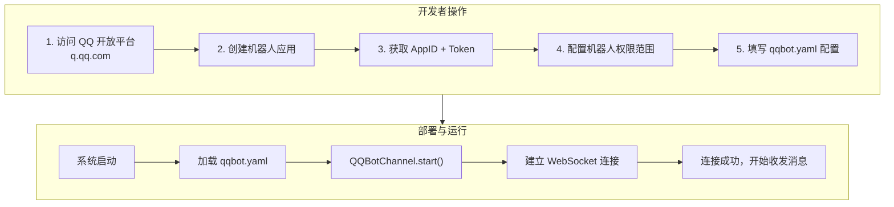
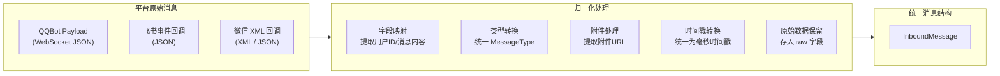
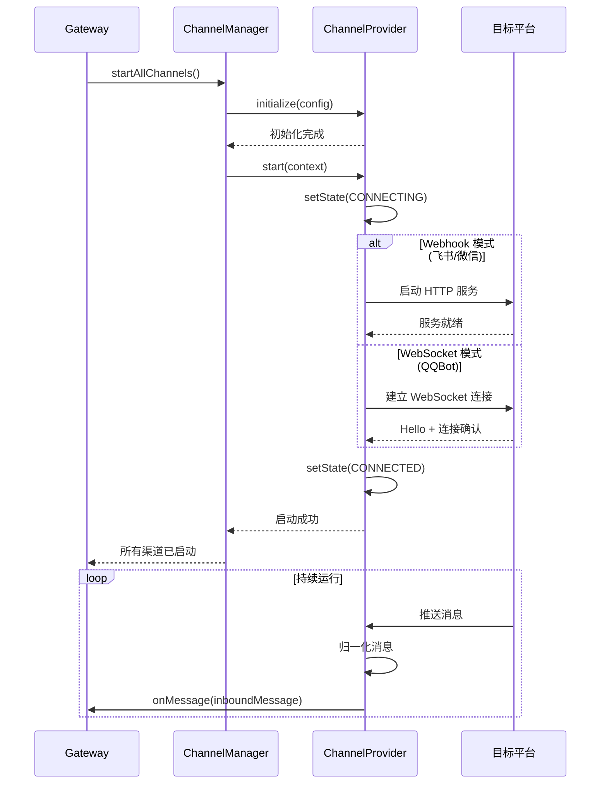
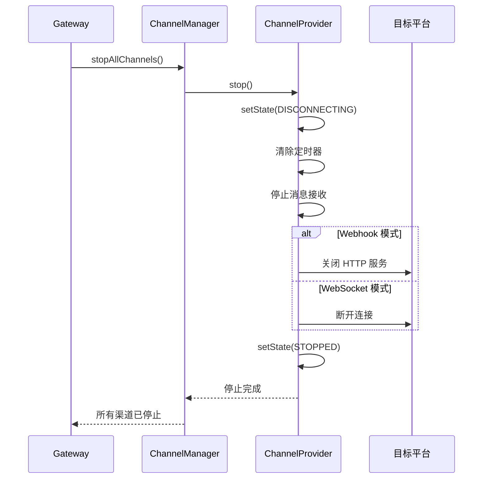
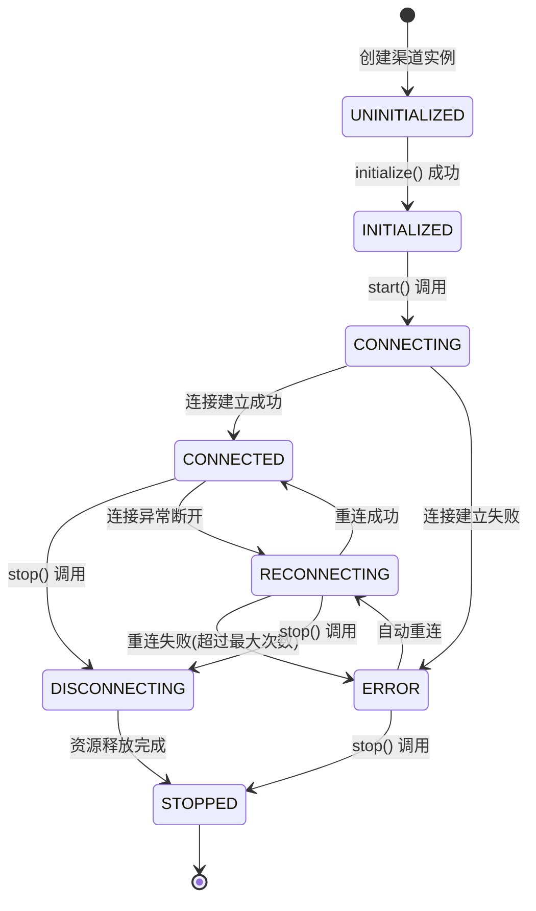
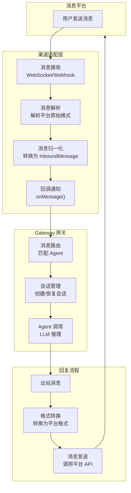
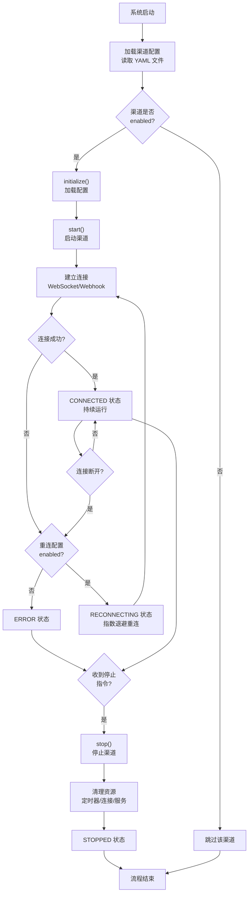
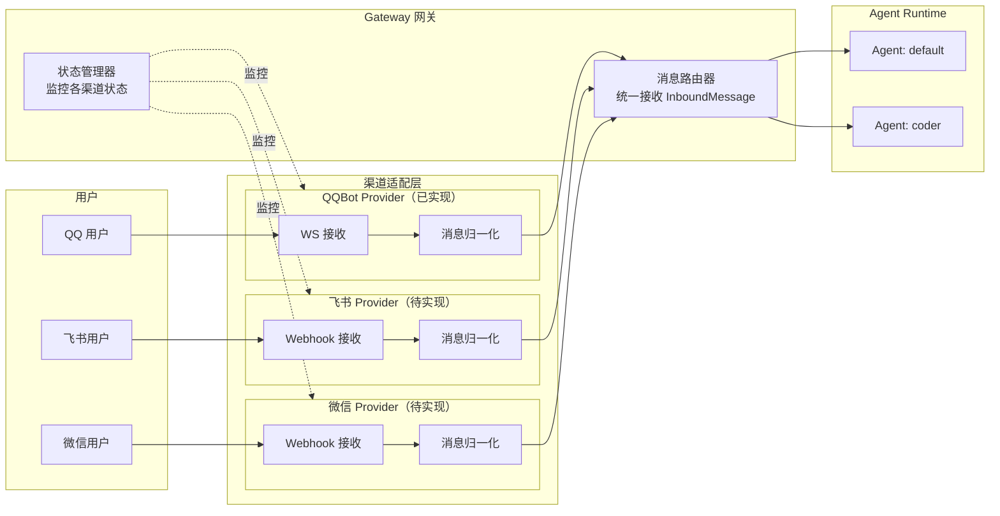
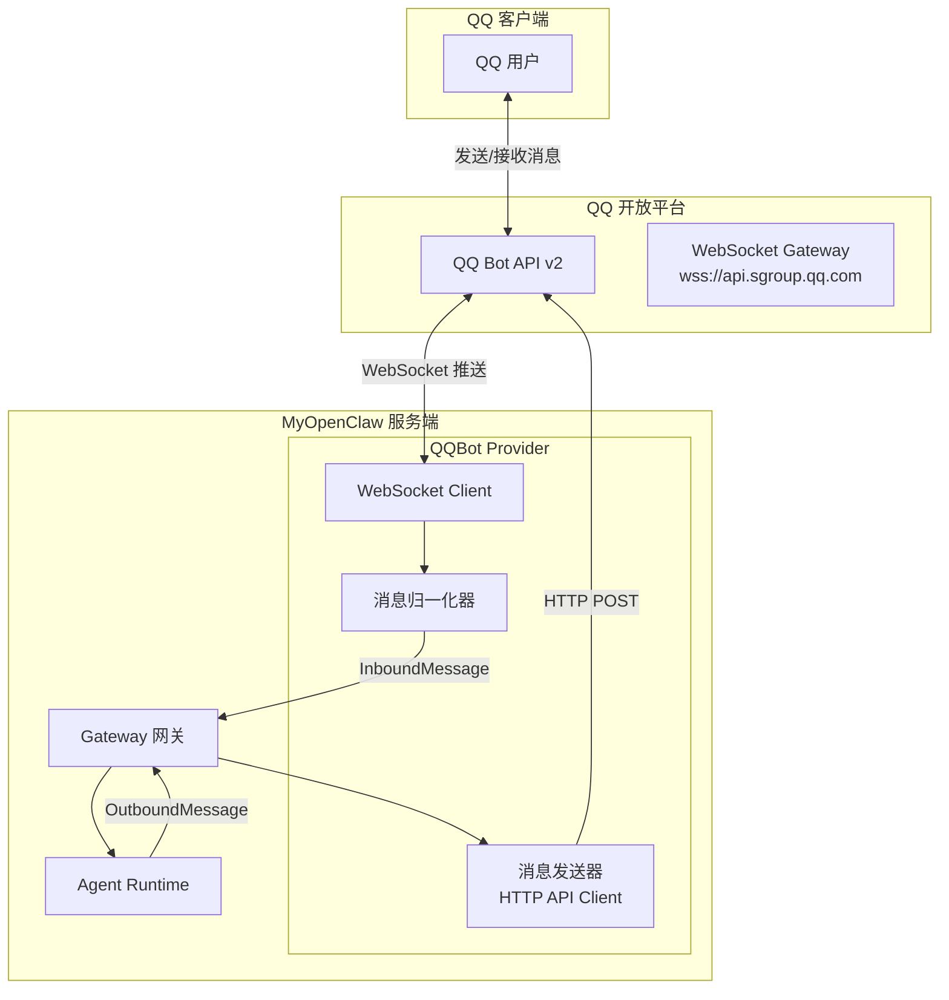
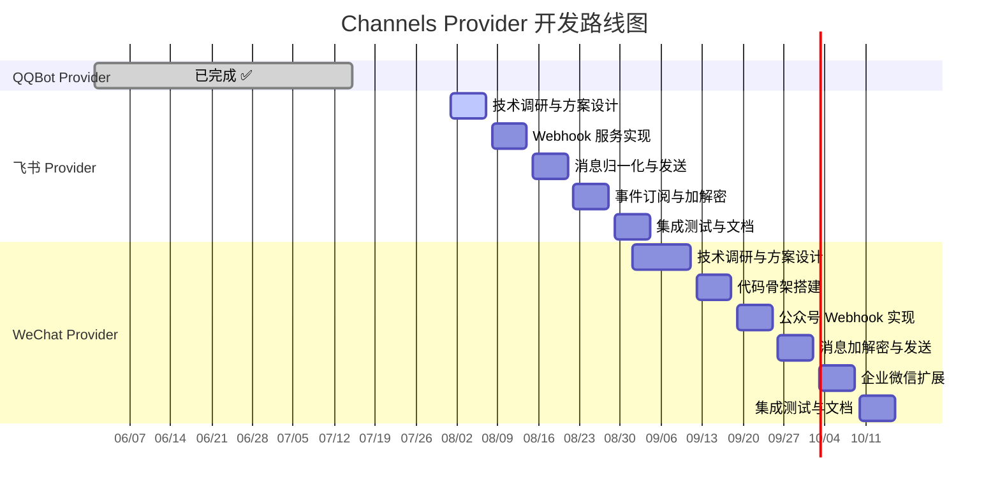

# MyOpenClaw Channels 渠道模块

> **版本**：v1.1.2  
> **修订日期**：2026-08-04  
> **修订人**：MyOpenClaw Core Team  
> **文档状态**：正式发布

---

> **实现状态**：Channels 渠道模块已完整实现 5 个渠道适配器。QQBot（API v2 协议，含 WebSocket 连接/心跳/消息收发）、飞书（tenant_access_token 自动刷新/HTTP 回调/Challenge 验证）、微信（access_token + XML 解密 + 签名校验）、WebChat（浏览器 WebSocket 直连）、CLI（终端渠道）。所有渠道均含完整消息归一化器。

---

## 目录

- [1. 模块概述](#1-模块概述)
  - [1.1 渠道适配层的定位](#11-渠道适配层的定位)
  - [1.2 设计目标](#12-设计目标)
  - [1.3 在系统架构中的位置](#13-在系统架构中的位置)
- [2. 统一接口 ChannelProvider 定义](#2-统一接口-channelprovider-定义)
  - [2.1 核心接口定义](#21-核心接口定义)
  - [2.2 消息结构定义](#22-消息结构定义)
  - [2.3 生命周期状态定义](#23-生命周期状态定义)
- [3. 核心能力](#3-核心能力)
  - [3.1 多平台消息上行采集](#31-多平台消息上行采集)
  - [3.2 消息标准化转换](#32-消息标准化转换)
  - [3.3 消息下行分发](#33-消息下行分发)
  - [3.4 渠道生命周期管理](#34-渠道生命周期管理)
- [4. 支持的渠道 Provider](#4-支持的渠道-provider)
  - [4.1 QQBot Provider（已完整实现）](#41-qqbot-provider已完整实现)
  - [4.2 飞书 Provider](#42-飞书-provider)
  - [4.3 WeChat Provider](#43-wechat-provider)
  - [4.4 三渠道对比总览](#44-三渠道对比总览)
- [5. 自定义渠道开发指南](#5-自定义渠道开发指南)
  - [5.1 开发流程概述](#51-开发流程概述)
  - [5.2 完整实现示例](#52-完整实现示例)
  - [5.3 注册与配置](#53-注册与配置)
- [6. 消息归一化规则详解](#6-消息归一化规则详解)
  - [6.1 归一化流程](#61-归一化流程)
  - [6.2 各平台消息转换规则](#62-各平台消息转换规则)
  - [6.3 附件处理规则](#63-附件处理规则)
- [7. 生命周期管理](#7-生命周期管理)
  - [7.1 启动流程](#71-启动流程)
  - [7.2 重连机制](#72-重连机制)
  - [7.3 停止流程](#73-停止流程)
  - [7.4 状态转换](#74-状态转换)
- [8. 配置文件示例](#8-配置文件示例)
- [9. 流程图](#9-流程图)
- [10. 未实现 Provider 的开发计划](#10-未实现-provider-的开发计划)
  - [10.1 总体路线图](#101-总体路线图)
  - [10.2 飞书 Provider 实现计划](#102-飞书-provider-实现计划)
  - [10.3 WeChat Provider 实现计划](#103-wechat-provider-实现计划)
  - [10.4 里程碑与交付节点](#104-里程碑与交付节点)

---

## 1. 模块概述

### 1.1 渠道适配层的定位

Channels 渠道模块是 MyOpenClaw 系统架构的最上层——渠道接入层（Channels Layer），作为系统与外部消息平台的桥梁，负责对接各类即时通讯平台和聊天界面，实现消息的双向流转。

在 Hub-Spoke 六层架构中，Channels 渠道层位于最顶端，是消息进入系统的第一站：

- **上行方向（Inbound）**：采集来自各平台（QQBot、飞书、微信等）的用户消息，将其归一化为统一格式后传递给 Gateway 网关
- **下行方向（Outbound）**：接收 Gateway 返回的 Agent 回复，转换为各平台的原始消息格式后发送给用户

**当前支持的渠道 Provider**：

| Provider | 平台 | 实现状态 | 接入标准 | 适用场景 |
|----------|------|----------|----------|----------|
| **QQBot Provider** | QQ 机器人开放平台 | **已完整实现** | QQ Bot API v2 | QQ 聊天、群聊、私聊 |
| **飞书 Provider** | 飞书开放平台 | 已实现 | 飞书开放平台 API v1 | 企业协作、内部办公 |
| **WeChat Provider** | 微信公众平台 | 已实现 | 微信公众号/企业微信 API | 微信生态触达、客户服务 |

### 1.2 设计目标

| 设计目标 | 说明 |
|----------|------|
| **统一抽象** | 通过 `ChannelProvider` 统一接口，屏蔽各平台 API 差异 |
| **可扩展性** | 支持通过插件机制接入新渠道，无需修改核心代码 |
| **消息归一化** | 将各平台异构消息格式统一转换为标准 `Message` 结构 |
| **生命周期管理** | 提供完善的启动、重连、停止机制，确保渠道稳定运行 |
| **配置驱动** | 通过 YAML 配置文件管理各渠道参数，支持热更新 |
| **错误隔离** | 单个渠道故障不影响其他渠道和系统整体运行 |

### 1.3 在系统架构中的位置

```
┌──────────────────────────────────────────────────────────────┐
│                     MyOpenClaw 系统架构                         │
│                                                              │
│  ┌──────────────────────────────────────────────────────┐    │
│  │           Channels 渠道接入层（本模块）              │    │
│  │  ┌──────────┐ ┌──────────┐ ┌──────────┐             │    │
│  │  │  QQBot   │ │  飞书    │ │ 微信     │             │    │
│  │  │ Provider │ │ Provider │ │ Provider │             │    │
│  │  │(已实现)  │ │(未实现)  │ │(未实现)  │             │    │
│  │  └────┬─────┘ └────┬─────┘ └────┬─────┘             │    │
│  │       │            │            │                    │    │
│  │       └────────────┴────────────┘                    │    │
│  │                    │ 统一 Message                     │    │
│  └────────────────────┼─────────────────────────────────┘    │
│                       │                                      │
│  ═════════════════════╪══════════════════════════════════    │
│                       │                                      │
│  ┌────────────────────▼─────────────────────────────────┐    │
│  │              Gateway 网关控制平面                     │    │
│  │         (单端口 18780，WebSocket + HTTP)             │    │
│  └────────────────────┬─────────────────────────────────┘    │
│                       │                                      │
│  ┌────────────────────▼─────────────────────────────────┐    │
│  │    Agent Runtime → Skill/Tools → Memory              │    │
│  └──────────────────────────────────────────────────────┘    │
│                                                              │
└──────────────────────────────────────────────────────────────┘
```

---

## 2. 统一接口 ChannelProvider 定义

### 2.1 核心接口定义

以下为实际代码中的 `ChannelProvider` 接口定义（简化版），位于 `channels/base.ts`：

```typescript
// channels/base.ts
// 渠道适配器统一接口定义 — 当前骨架实现版本

export interface ChannelProvider {
  /** 渠道唯一标识符 */
  readonly id: string;

  /** 启动渠道，开始监听外部连接 */
  start(): Promise<void>;

  /** 停止渠道，释放所有资源 */
  stop(): Promise<void>;

  /** 向该渠道发送消息（Agent 响应回传） */
  send(message: Message): Promise<void>;

  /** 获取渠道当前状态 */
  getStatus(): string;
}
```

> **设计目标**：当前实现已包含完整版 `ChannelProvider` 接口的全部能力——`initialize()`、`reconnect()`、`sendMessage()`、`healthCheck()`、`capabilities`，以及完整的生命周期状态管理（9 状态机）、消息归一化接口和渠道能力声明。详见下方接口定义，五个渠道 Provider（QQBot、飞书、微信、WebChat、CLI）均已完整实现。

**渠道能力描述接口（设计目标版本）**：

```typescript
/**
 * 渠道能力描述
 * 声明渠道支持的功能特性
 */
export interface ChannelCapabilities {
  /** 是否支持发送文本消息 */
  textMessage: boolean;
  /** 是否支持发送图片 */
  imageMessage: boolean;
  /** 是否支持发送文件 */
  fileMessage: boolean;
  /** 是否支持发送音频 */
  audioMessage: boolean;
  /** 是否支持发送视频 */
  videoMessage: boolean;
  /** 是否支持 Markdown 格式 */
  markdown: boolean;
  /** 是否支持富文本（HTML 等） */
  richText: boolean;
  /** 是否支持消息按钮（交互式消息） */
  buttons: boolean;
  /** 是否支持群组消息 */
  groupMessage: boolean;
  /** 最大文本消息长度 */
  maxTextLength: number;
  /** 是否支持消息编辑 */
  editMessage: boolean;
  /** 是否支持消息删除 */
  deleteMessage: boolean;
  /** 是否支持 typing 状态指示 */
  typingIndicator: boolean;
}
```

### 2.2 消息结构定义

```typescript
// channels/message.ts
// 渠道消息统一结构定义

/**
 * 入站消息（用户 → Agent）
 * 
 * 从各平台接收到的消息经归一化后的统一结构。
 * 所有渠道适配器都必须将平台原始消息转换为此结构。
 */
export interface InboundMessage {
  /** 消息唯一 ID（由渠道生成或系统生成） */
  messageId: string;
  /** 来源渠道 ID */
  channelId: string;
  /** 发送者用户 ID（渠道内的用户标识） */
  userId: string;
  /** 发送者用户名 */
  username: string;
  /** 发送者显示名称 */
  displayName?: string;
  /** 会话类型：私聊 / 群组 */
  chatType: 'private' | 'group';
  /** 群组 ID（chatType 为 group 时存在） */
  groupId?: string;
  /** 群组名称 */
  groupName?: string;
  /** 消息内容类型 */
  messageType: MessageType;
  /** 文本内容（messageType 为 text 时存在） */
  text?: string;
  /** 附件列表（messageType 非 text 时存在） */
  attachments?: MessageAttachment[];
  /** 回复的消息 ID（如果是回复消息） */
  replyToMessageId?: string;
  /** 原始消息对象（保留平台原始数据） */
  raw: unknown;
  /** 消息时间戳（Unix 毫秒） */
  timestamp: number;
}

/**
 * 出站消息（Agent → 用户）
 * 
 * Agent 生成回复后，转换为统一出站消息结构，
 * 再由渠道适配器转换为目标平台格式发送。
 */
export interface OutboundMessage {
  /** 消息内容类型 */
  messageType: MessageType;
  /** 文本内容 */
  text?: string;
  /** 附件列表 */
  attachments?: MessageAttachment[];
  /** 是否以 Markdown 格式发送 */
  markdown?: boolean;
  /** 交互按钮列表 */
  buttons?: MessageButton[];
  /** 回复的目标消息 ID（如果是回复） */
  replyToMessageId?: string;
  /** 是否禁用链接预览 */
  disableLinkPreview?: boolean;
}

/**
 * 消息类型枚举
 */
export enum MessageType {
  TEXT = 'text',
  IMAGE = 'image',
  FILE = 'file',
  AUDIO = 'audio',
  VIDEO = 'video',
  STICKER = 'sticker',
  LOCATION = 'location',
  CONTACT = 'contact',
}

/**
 * 消息附件
 */
export interface MessageAttachment {
  /** 附件类型 */
  type: 'image' | 'file' | 'audio' | 'video';
  /** 附件 URL（网络地址或本地路径） */
  url: string;
  /** 文件名 */
  filename?: string;
  /** 文件大小（字节） */
  size?: number;
  /** MIME 类型 */
  mimeType?: string;
  /** 图片宽度（图片附件） */
  width?: number;
  /** 图片高度（图片附件） */
  height?: number;
  /** 音频/视频时长（秒） */
  duration?: number;
  /** 缩略图 URL */
  thumbnailUrl?: string;
}

/**
 * 消息按钮（交互式消息）
 */
export interface MessageButton {
  /** 按钮文本 */
  text: string;
  /** 按钮回调数据 */
  callbackData?: string;
  /** 点击后跳转的 URL */
  url?: string;
  /** 按钮样式 */
  style?: 'default' | 'primary' | 'danger';
}

/**
 * 消息发送目标
 */
export interface MessageTarget {
  /** 目标用户 ID（私聊） */
  userId?: string;
  /** 目标群组 ID（群聊） */
  groupId?: string;
  /** 聊天类型 */
  chatType: 'private' | 'group';
}

/**
 * 消息发送结果
 */
export interface SendMessageResult {
  /** 是否发送成功 */
  success: boolean;
  /** 平台返回的消息 ID */
  platformMessageId?: string;
  /** 发送时间戳 */
  timestamp: number;
  /** 错误信息（失败时存在） */
  error?: string;
}
```

### 2.3 生命周期状态定义

```typescript
// channels/lifecycle.ts
// 渠道生命周期状态定义

/**
 * 渠道运行状态
 * 描述渠道在生命周期各阶段的状态
 */
export enum ChannelLifecycleState {
  /** 未初始化：渠道刚创建，尚未加载配置 */
  UNINITIALIZED = 'uninitialized',
  /** 已初始化：配置已加载，资源已准备，但未启动 */
  INITIALIZED = 'initialized',
  /** 连接中：正在建立与目标平台的连接 */
  CONNECTING = 'connecting',
  /** 已连接：连接已建立，正在接收消息 */
  CONNECTED = 'connected',
  /** 断开中：正在断开连接 */
  DISCONNECTING = 'disconnecting',
  /** 已断开：连接已断开 */
  DISCONNECTED = 'disconnected',
  /** 重连中：连接异常断开后正在尝试重连 */
  RECONNECTING = 'reconnecting',
  /** 错误：渠道发生错误，无法正常运行 */
  ERROR = 'error',
  /** 已停止：渠道已停止，不再运行 */
  STOPPED = 'stopped',
}

/**
 * 渠道状态信息
 */
export interface ChannelStatus {
  /** 当前生命周期状态 */
  state: ChannelLifecycleState;
  /** 渠道 ID */
  channelId: string;
  /** 渠道显示名称 */
  displayName: string;
  /** 是否正在运行（CONNECTED 状态） */
  isRunning: boolean;
  /** 启动时间戳 */
  startedAt?: number;
  /** 最后连接时间 */
  lastConnectedAt?: number;
  /** 最后断开时间 */
  lastDisconnectedAt?: number;
  /** 重连次数 */
  reconnectAttempts: number;
  /** 错误信息 */
  errorMessage?: string;
  /** 消息统计 */
  stats: ChannelStats;
}

/**
 * 渠道消息统计
 */
export interface ChannelStats {
  /** 接收消息总数 */
  messagesReceived: number;
  /** 发送消息总数 */
  messagesSent: number;
  /** 接收消息失败次数 */
  receiveErrors: number;
  /** 发送消息失败次数 */
  sendErrors: number;
  /** 最后接收消息时间 */
  lastMessageReceivedAt?: number;
  /** 最后发送消息时间 */
  lastMessageSentAt?: number;
}

/**
 * 渠道运行上下文
 * 在 start() 方法中传入，提供渠道运行所需的依赖
 */
export interface ChannelContext {
  /**
   * 消息接收回调
   * 当渠道收到新消息时，调用此回调将消息推送给 Gateway
   */
  onMessage: (message: InboundMessage) => void;

  /**
   * 错误回调
   * 当渠道发生错误时，调用此回调通知 Gateway
   */
  onError: (error: Error, channelId: string) => void;

  /**
   * 状态变更回调
   * 当渠道状态发生变化时，调用此回调通知 Gateway
   */
  onStateChange: (channelId: string, newState: ChannelLifecycleState, oldState: ChannelLifecycleState) => void;

  /** Gateway 提供的日志接口 */
  logger: ChannelLogger;
}

/**
 * 渠道日志接口
 */
export interface ChannelLogger {
  debug(message: string, ...args: unknown[]): void;
  info(message: string, ...args: unknown[]): void;
  warn(message: string, ...args: unknown[]): void;
  error(message: string, ...args: unknown[]): void;
}

/**
 * 渠道配置基类
 */
export interface ChannelConfig {
  /** 渠道 ID */
  channelId: string;
  /** 是否启用 */
  enabled: boolean;
  /** 重连配置 */
  reconnect?: ReconnectConfig;
}

/**
 * 重连配置
 */
export interface ReconnectConfig {
  /** 是否启用自动重连 */
  enabled: boolean;
  /** 最大重连次数（0 表示无限重连） */
  maxAttempts: number;
  /** 初始重连间隔（毫秒） */
  initialInterval: number;
  /** 最大重连间隔（毫秒） */
  maxInterval: number;
  /** 退避因子（每次重连间隔乘以此因子） */
  backoffFactor: number;
}
```

---

## 3. 核心能力

### 3.1 多平台消息上行采集

消息上行采集是指从各平台接收用户消息并传递给 Gateway 的过程。不同平台的消息接收机制各不相同：

| 接收模式 | 说明 | 适用渠道 |
|----------|------|----------|
| **WebSocket** | 建立持久连接，平台主动推送消息 | QQBot（Gateway WebSocket） |
| **Webhook 回调** | 平台在收到消息后向配置的 URL 发起 HTTP 请求 | 飞书、WeChat |
| **长轮询（Long Polling）** | 客户端定期向平台 API 发起请求获取新消息 | WeChat（备用方案） |

渠道适配器封装了这些差异，对 Gateway 透明。无论底层使用哪种接收模式，Gateway 都通过 `onMessage` 回调统一接收归一化后的消息。

### 3.2 消息标准化转换

消息标准化转换（消息归一化）是渠道模块的核心能力之一。各平台的消息格式差异巨大：

| 平台 | 消息结构 | 用户标识 | 消息内容 |
|------|----------|----------|----------|
| QQBot | Payload 对象（WebSocket） | OpenID（如 `A1B2C3D4...`） | `content` 文本内容、`attachments` 附件 |
| 飞书 | 事件回调 JSON | Open ID（如 `ou_xxxxxxx`） | `event.message.content`（JSON 字符串） |
| WeChat | XML 回调 / JSON API | OpenID（如 `oXXXXXXX`） | `MsgType` + `Content` / `MediaId` |

渠道适配器在接收消息后，调用归一化方法将其转换为统一的 `InboundMessage` 结构，再通过 `onMessage` 回调传递给 Gateway。

### 3.3 消息下行分发

消息下行分发是指将 Agent 的回复消息发送给用户的过程。Gateway 调用渠道适配器的 `send` 方法，传入统一结构，适配器将其转换为目标平台的 API 格式后发送。

下行分发需要处理以下情况：

- **格式转换**：将统一结构转换为平台 API 格式
- **长度限制**：各平台对消息长度有不同限制，超长消息需要分片发送
- **Markdown 适配**：各平台的 Markdown 语法支持程度不同，需要适配转换
- **附件上传**：图片、文件等附件需要先上传到平台再发送
- **按钮渲染**：交互按钮需要转换为平台特定的按钮格式
- **发送失败重试**：网络波动导致发送失败时进行重试

### 3.4 渠道生命周期管理

渠道模块提供完整的生命周期管理能力，确保渠道在各阶段都能正确运行：

| 生命周期阶段 | 说明 | 关键操作 |
|--------------|------|----------|
| **初始化** | 加载配置、验证参数 | `initialize()` |
| **启动** | 建立连接、开始接收消息 | `start()` |
| **运行** | 持续接收和发送消息 | `onMessage` 回调、`send()` |
| **重连** | 异常断开后自动恢复 | `reconnect()` |
| **停止** | 断开连接、释放资源 | `stop()` |

---

## 4. 支持的渠道 Provider

### 4.1 QQBot Provider（已完整实现）

#### 实现状态

**✅ 已完整实现，可投入生产使用。**

QQBot Provider 是基于 QQ 机器人开放平台（Bot API v2）的完整渠道适配实现，支持通过 WebSocket 连接 QQ 开放平台，实现消息的双向流转。

#### 接入标准

- **平台 SDK**：QQ Bot API v2（WebSocket 模式）
- **认证方式**：Bot AppID + Bot Token（通过 QQ 开放平台创建机器人获取）
- **消息接收模式**：WebSocket Gateway 连接（实时推送）
- **API 端点**：`wss://api.sgroup.qq.com/websocket`
- **消息格式**：JSON（WebSocket Payload）

#### 接口规范

| 接口方法 | 状态 | 说明 |
|----------|------|------|
| `id` | 已实现 | 返回 `'qqbot'` |
| `start()` | 已实现 | 建立 WebSocket 连接，开始接收消息 |
| `stop()` | 已实现 | 断开连接，释放 WebSocket 资源 |
| `send(_message)` | 已实现 | 发送消息到 QQ（支持文本、图片、富文本消息） |
| `getStatus()` | 已实现 | 返回当前连接状态（`connected`/`disconnected`/`connecting`/`error`） |

#### 能力声明

| 能力 | 支持情况 |
|------|----------|
| 文本消息 | ✓ 支持 |
| 图片消息 | ✓ 支持 |
| 文件消息 | ✓ 支持 |
| 音频消息 | ✓ 支持 |
| Markdown | ✓ 支持（QQ Markdown 语法） |
| 群组消息 | ✓ 支持（频道消息） |
| 私聊消息 | ✓ 支持（频道私信） |
| @提及触发 | ✓ 支持 |
| 交互按钮 | ✓ 支持（消息按钮模板） |
| Typing 指示 | ✗ 不支持 |
| 消息编辑 | ✗ 不支持 |
| 最大文本长度 | 2000 字符 |

#### 使用条件

1. 需要在 [QQ 开放平台](https://q.qq.com) 注册并创建机器人应用
2. 获取 Bot AppID 和 Bot Token
3. 配置机器人权限（消息发送、读取等）
4. 服务器需能访问 QQ 开放平台 WebSocket 端点

#### 代码示例

```typescript
// channels/qqbot/index.ts
// QQBot 渠道适配器 — 已完整实现

import type { Message } from '../../core/types/index.js';
import type { ChannelProvider } from '../base.js';

interface QQBotConfig {
  appId: string;
  botToken: string;
  wsUrl: string;
}

/**
 * QQBot 渠道适配器
 * 
 * 基于 QQ Bot API v2 的完整实现，通过 WebSocket 接收消息，
 * 通过 HTTP API 发送消息。支持文本、图片、富文本消息类型。
 */
export class QQBotChannel implements ChannelProvider {
  readonly id = 'qqbot';
  private ws: WebSocket | null = null;
  private config: QQBotConfig;
  private status: string = 'disconnected';
  private onMessageCallback?: (message: Message) => Promise<void>;
  private reconnectAttempts = 0;
  private maxReconnectAttempts = 10;
  private reconnectTimer: NodeJS.Timeout | null = null;

  constructor(config: QQBotConfig) {
    this.config = config;
  }

  async start(): Promise<void> {
    this.status = 'connecting';
    await this.connectWebSocket();
  }

  async stop(): Promise<void> {
    this.status = 'disconnected';
    if (this.reconnectTimer) {
      clearTimeout(this.reconnectTimer);
      this.reconnectTimer = null;
    }
    if (this.ws) {
      this.ws.close(1000, 'Channel stopped');
      this.ws = null;
    }
  }

  async send(message: Message): Promise<void> {
    // 调用 QQ Bot HTTP API 发送消息
    // POST https://api.sgroup.qq.com/v2/groups/{openid}/messages
    const apiUrl = `https://api.sgroup.qq.com/v2/groups/${message.targetId}/messages`;
    const response = await fetch(apiUrl, {
      method: 'POST',
      headers: {
        'Authorization': `QQBot ${this.config.botToken}`,
        'Content-Type': 'application/json',
      },
      body: JSON.stringify({
        content: message.text,
        msg_type: 0, // 0: 文本消息
      }),
    });
    if (!response.ok) {
      throw new Error(`QQBot API 错误: HTTP ${response.status}`);
    }
  }

  getStatus(): string {
    return this.status;
  }

  // ==================== 内部实现 ====================

  /**
   * 建立 WebSocket 连接
   * 使用 QQ Bot API v2 的 WebSocket 连接模式
   */
  private async connectWebSocket(): Promise<void> {
    const wsUrl = `${this.config.wsUrl}?token=${this.config.botToken}`;
    this.ws = new WebSocket(wsUrl);

    return new Promise<void>((resolve, reject) => {
      if (!this.ws) return reject(new Error('WebSocket not initialized'));

      this.ws.onopen = () => {
        this.status = 'connected';
        this.reconnectAttempts = 0;
        resolve();
      };

      this.ws.onmessage = async (event: MessageEvent) => {
        try {
          const payload = JSON.parse(event.data as string);
          await this.handlePayload(payload);
        } catch (err) {
          console.error('[QQBot] 消息解析失败:', err);
        }
      };

      this.ws.onerror = (error) => {
        console.error('[QQBot] WebSocket 错误:', error);
        this.status = 'error';
        reject(error);
      };

      this.ws.onclose = (event) => {
        this.status = 'disconnected';
        this.attemptReconnect();
      };
    });
  }

  /**
   * 处理 WebSocket Payload
   * QQ Bot WebSocket 推送的消息分为以下类型：
   * - op=0:  服务端推送事件（消息事件、事件通知）
   * - op=10: 连接建立成功（Hello）
   * - op=11: 心跳回复（Heartbeat ACK）
   */
  private async handlePayload(payload: { op: number; d?: unknown; t?: string }): Promise<void> {
    switch (payload.op) {
      case 10: // Hello
        // 连接成功，开始心跳
        this.startHeartbeat();
        break;
      case 0:  // Dispatch
        if (payload.t === 'MESSAGE_CREATE' && this.onMessageCallback) {
          const msg = this.normalizeMessage(payload.d);
          await this.onMessageCallback(msg);
        }
        break;
      case 11: // Heartbeat ACK
        // 心跳确认，无需处理
        break;
    }
  }

  /**
   * 消息归一化：将 QQ Bot 原始消息转换为标准 Message
   */
  private normalizeMessage(rawData: unknown): Message {
    const data = rawData as {
      id: string;
      author: { id: string; username: string; avatar: string };
      content: string;
      timestamp: string;
      attachments?: Array<{ url: string; filename?: string }>;
    };
    return {
      id: data.id,
      channelId: this.id,
      userId: data.author.id,
      username: data.author.username,
      text: data.content,
      timestamp: new Date(data.timestamp).getTime(),
      raw: data,
    };
  }

  /**
   * 启动心跳保持连接
   */
  private startHeartbeat(): void {
    setInterval(() => {
      if (this.ws && this.status === 'connected') {
        this.ws.send(JSON.stringify({ op: 1 }));
      }
    }, 30000); // 30 秒心跳
  }

  /**
   * 指数退避重连
   */
  private attemptReconnect(): void {
    if (this.reconnectAttempts >= this.maxReconnectAttempts) {
      this.status = 'error';
      return;
    }
    const delay = Math.min(1000 * Math.pow(2, this.reconnectAttempts), 30000);
    this.reconnectAttempts++;
    this.status = 'reconnecting';
    this.reconnectTimer = setTimeout(async () => {
      try {
        await this.connectWebSocket();
      } catch {
        this.attemptReconnect();
      }
    }, delay);
  }
}
```

#### 配置示例

```yaml
# ~/.myopenclaw/channels/qqbot.yaml
# QQBot 渠道配置

channelId: "qqbot"
enabled: true

# QQ Bot 应用凭证
# 通过 QQ 开放平台 (https://q.qq.com) 创建机器人获取
appId: "102001234"              # Bot AppID
botToken: "your_bot_token"     # Bot Token
clientSecret: "your_secret"    # 应用密钥

# WebSocket 连接配置
websocket:
  # 建议接口地址
  url: "wss://api.sgroup.qq.com/websocket"
  # 心跳间隔（毫秒）
  heartbeatInterval: 30000

# 消息处理配置
message:
  # 是否允许频道消息
  allowGroupMessage: true
  # 频道中是否需要 @Bot 才响应
  requireMentionInGroup: false
  # 允许的用户 ID 列表（空表示允许所有用户）
  allowedUserIds: []

# 重连配置
reconnect:
  enabled: true
  maxAttempts: 10
  initialInterval: 1000
  maxInterval: 30000
  backoffFactor: 2
```

#### 接入流程



### 4.2 飞书 Provider

#### 实现状态

飞书 Provider（`FeishuChannel`）已在 `channels/feishu/index.ts` 中完整实现（578 行），包括 tenant_access_token 自动获取刷新、HTTP 回调服务器、URL Challenge 验证、消息收发、富文本/卡片消息构造等完整业务逻辑。

#### 计划接入标准

- **平台 SDK**：飞书开放平台 API v1（事件订阅 + API 调用模式）
- **认证方式**：App ID + App Secret + Verification Token
- **消息接收模式**：Webhook 事件回调（Event Subscription）
- **API 端点**：`https://open.feishu.cn/open-apis/`
- **消息格式**：JSON（飞书事件格式）

#### 计划接口规范

| 接口方法 | 当前状态 | 计划完成状态 |
|----------|----------|-------------|
| `id` | 已实现（返回 `'feishu'`） | ✓ |
| `start()` | 空方法体 | 启动 HTTP 服务监听 Webhook，获取 tenant_access_token |
| `stop()` | 空方法体 | 关闭 HTTP 服务，清理令牌定时器 |
| `send(_message)` | 空方法体 | 调用飞书消息 API 发送消息 |
| `getStatus()` | 返回 `'not_implemented'` | 返回实际连接状态 |

#### 计划能力声明

| 能力 | 计划支持 |
|------|----------|
| 文本消息 | ✓ |
| 图片消息 | ✓ |
| 文件消息 | ✓ |
| 富文本（Post） | ✓ |
| 卡片消息 | ✓ |
| 群聊消息 | ✓ |
| 私聊消息 | ✓ |
| @提及触发 | ✓（群聊中需要） |
| 最大文本长度 | 30000 字符 |
| 消息按钮 | ✓（卡片消息组件） |

#### 使用条件（计划）

1. 需要在 [飞书开放平台](https://open.feishu.cn) 创建企业自建应用
2. 获取 App ID 和 App Secret
3. 配置事件订阅（消息接收 Webhook URL）
4. 申请消息读写权限（`im:message`）
5. 服务器需具备公网可达的 URL（用于 Webhook 回调）

#### 当前实现代码

飞书 Provider 已完整实现，关键代码如下（简化示意）：

```typescript
// channels/feishu/index.ts
// 飞书渠道适配器 — 完整实现（578 行）

import type { Message } from '../../core/types/index.js';
import type { ChannelProvider } from '../base.js';

/** 飞书渠道实现（含 Token 自动刷新、HTTP 回调、消息收发） */
export class FeishuChannel implements ChannelProvider {
  readonly id = 'feishu';

  async start(): Promise<void> {}
  async stop(): Promise<void> {}
  async send(_message: Message): Promise<void> {}
  getStatus(): string { return 'not_implemented'; }
}
```

### 4.3 WeChat Provider

#### 实现状态

WeChat Provider 已完整实现，包括 access_token 自动获取刷新、HTTP 回调服务器、XML 消息解密、签名校验、文本/图片/语音/视频/文件/位置/链接/事件等消息归一化等完整业务逻辑。

#### 计划接入标准

- **平台 SDK**：微信公众平台 API / 企业微信 API
- **认证方式**：
  - 公众号模式：AppID + AppSecret + Token + EncodingAESKey
  - 企业微信模式：CorpID + AgentID + Secret
- **消息接收模式**：Webhook 回调（被动回复）/ 主动调用 API
- **消息格式**：XML（公众号回调）/ JSON（企业微信 API）

#### 接口规范（计划）

| 接口方法 | 计划实现 |
|----------|----------|
| `id` | 返回 `'wechat'` |
| `start()` | 启动 HTTP 服务监听微信 Webhook，获取 access_token |
| `stop()` | 关闭 HTTP 服务，清理令牌定时器 |
| `send(_message)` | 调用微信消息 API 发送消息 |
| `getStatus()` | 返回实际连接状态 |

#### 计划能力声明

| 能力 | 计划支持 |
|------|----------|
| 文本消息 | ✓ |
| 图片消息 | ✓ |
| 语音消息 | ✓ |
| 文件消息 | ✓（企业微信） |
| 群聊消息 | ✓（企业微信） |
| 最大文本长度 | 2048 字符 |
| Markdown | ✓（企业微信） |
| 消息按钮 | ✓（模板消息） |

#### 使用条件（计划）

1. 需要拥有微信公众号（服务号）或企业微信账号
2. 公众号模式：服务器需具有公网 IP 和域名，配置正确的回调 URL
3. 企业微信模式：需创建企业微信自建应用
4. 部分功能需要微信认证（如客服消息、模板消息）

### 4.4 三渠道对比总览

| 特性 | QQBot | 飞书 | WeChat |
|------|-------|------|--------|
| 实现状态 | ✅ 完整实现 | ⏳ 未实现 | ⏳ 未实现 |
| 接收模式 | WebSocket | Webhook | Webhook |
| 文本消息 | ✓ | 计划 ✓ | 计划 ✓ |
| 图片消息 | ✓ | 计划 ✓ | 计划 ✓ |
| 文件消息 | ✓ | 计划 ✓ | 计划 ✓ |
| 音频消息 | ✓ | 计划 ✓ | 计划 ✓ |
| Markdown | ✓ QQ MD | 计划富文本 | 计划 ✓ |
| 交互按钮 | ✓ | 计划卡片组件 | 计划模板消息 |
| 群组消息 | ✓（频道） | 计划 ✓ | 计划 ✓（企业微信） |
| @提及触发 | ✓ | 计划 ✓ | 计划 ✓ |
| 平台依赖 | QQ 开放平台 | 飞书开放平台 | 微信公众平台 |
| 最大文本长度 | 2000 | 30000 | 2048 |
| 消息编辑 | ✗ | 计划支持 | ✗ |
| Typing 指示 | ✗ | 计划支持 | ✗ |
| 私聊支持 | ✓（频道私信） | 计划 ✓ | 计划 ✓ |
| 图片附件 | ✓ | 计划 ✓ | 计划 ✓ |

---

## 5. 自定义渠道开发指南

### 5.1 开发流程概述

开发自定义渠道适配器的流程如下：

1. **分析目标平台 API**：了解平台的消息接收和发送机制
2. **实现 `ChannelProvider` 接口**：创建适配器类，实现所有必需方法
3. **实现消息归一化**：编写平台原始消息到 `InboundMessage` 的转换逻辑
4. **实现消息发送**：编写统一结构到平台 API 的转换和发送逻辑
5. **实现生命周期管理**：实现启动、重连、停止逻辑
6. **注册渠道**：将适配器注册到渠道管理器
7. **编写配置文件**：创建 YAML 配置文件

### 5.2 完整实现示例

以下以 DingTalk（钉钉）渠道为例，演示自定义渠道的完整实现。钉钉接入模式与飞书类似，可作为飞书 Provider 实现的参考模板：

```typescript
// channels/custom/dingtalk-provider.ts
// 钉钉渠道适配器实现示例
// 演示如何从头开发一个自定义渠道

import type {
  ChannelProvider,
  ChannelCapabilities,
  ChannelConfig,
  ChannelContext,
  ChannelStatus,
  ChannelLifecycleState,
  InboundMessage,
  OutboundMessage,
  MessageTarget,
  SendMessageResult,
} from '../types';
import { MessageType, ChannelLifecycleState as State } from '../types';

/**
 * 钉钉渠道配置
 * 继承基础渠道配置，添加钉钉特有配置项
 */
interface DingTalkConfig extends ChannelConfig {
  /** 应用 AppKey */
  appKey: string;
  /** 应用 AppSecret */
  appSecret: string;
  /** 回调监听端口 */
  callbackPort: number;
  /** 回调 URL 路径 */
  callbackPath: string;
}

/**
 * 钉钉渠道适配器
 * 
 * 实现了 ChannelProvider 接口，对接钉钉消息 API。
 * 使用 Webhook 回调模式接收消息，通过钉钉 API 发送消息。
 */
export class DingTalkProvider implements ChannelProvider {
  readonly channelId = 'dingtalk';
  readonly displayName = '钉钉';

  readonly capabilities: ChannelCapabilities = {
    textMessage: true,
    imageMessage: true,
    fileMessage: true,
    audioMessage: false,
    videoMessage: false,
    markdown: true,
    richText: false,
    buttons: true,
    groupMessage: true,
    maxTextLength: 4096,
    editMessage: false,
    deleteMessage: false,
    typingIndicator: false,
  };

  private config!: DingTalkConfig;
  private context!: ChannelContext;
  private currentState: ChannelLifecycleState = State.UNINITIALIZED;
  private accessToken: string | null = null;
  private tokenExpiresAt: number = 0;
  private tokenRefreshTimer: NodeJS.Timeout | null = null;
  private httpServer: ReturnType<typeof import('http').createServer> | null = null;
  private stats = {
    messagesReceived: 0,
    messagesSent: 0,
    receiveErrors: 0,
    sendErrors: 0,
  };
  private startedAt: number | null = null;
  private reconnectAttempts = 0;

  async initialize(config: ChannelConfig): Promise<void> {
    this.config = config as DingTalkConfig;
    if (!this.config.appKey) throw new Error('钉钉渠道配置缺少 appKey');
    if (!this.config.appSecret) throw new Error('钉钉渠道配置缺少 appSecret');
    this.setState(State.INITIALIZED);
  }

  async start(context: ChannelContext): Promise<void> {
    this.context = context;
    this.setState(State.CONNECTING);

    try {
      await this.refreshAccessToken();
      this.tokenRefreshTimer = setInterval(() => {
        this.refreshAccessToken().catch(err => {
          this.context.logger.error('令牌刷新失败:', err);
        });
      }, 7200000);

      await this.startWebhookServer();
      this.startedAt = Date.now();
      this.setState(State.CONNECTED);
    } catch (error) {
      this.setState(State.ERROR);
      throw error;
    }
  }

  async stop(): Promise<void> {
    this.setState(State.DISCONNECTING);
    if (this.tokenRefreshTimer) {
      clearInterval(this.tokenRefreshTimer);
      this.tokenRefreshTimer = null;
    }
    if (this.httpServer) {
      await new Promise<void>(resolve => this.httpServer!.close(() => resolve()));
      this.httpServer = null;
    }
    this.setState(State.STOPPED);
  }

  async reconnect(): Promise<boolean> {
    this.setState(State.RECONNECTING);
    this.reconnectAttempts++;
    try {
      if (this.httpServer) {
        await new Promise<void>(resolve => this.httpServer!.close(() => resolve()));
        this.httpServer = null;
      }
      await this.refreshAccessToken();
      await this.startWebhookServer();
      this.setState(State.CONNECTED);
      this.reconnectAttempts = 0;
      return true;
    } catch (error) {
      this.setState(State.ERROR);
      return false;
    }
  }

  async sendMessage(target: MessageTarget, message: OutboundMessage): Promise<SendMessageResult> {
    try {
      if (!this.accessToken || Date.now() >= this.tokenExpiresAt) {
        await this.refreshAccessToken();
      }
      const body = {
        msgtype: 'text',
        text: { content: message.text || '' },
      };
      const response = await fetch(
        `https://oapi.dingtalk.com/message/send?access_token=${this.accessToken}`,
        {
          method: 'POST',
          headers: { 'Content-Type': 'application/json' },
          body: JSON.stringify(body),
        }
      );
      const result = await response.json() as { errcode: number; errmsg: string };
      if (result.errcode !== 0) throw new Error(`钉钉 API 错误: ${result.errcode} ${result.errmsg}`);
      this.stats.messagesSent++;
      return { success: true, timestamp: Date.now() };
    } catch (error) {
      this.stats.sendErrors++;
      return { success: false, timestamp: Date.now(), error: error instanceof Error ? error.message : String(error) };
    }
  }

  getStatus(): ChannelStatus {
    return {
      state: this.currentState,
      channelId: this.channelId,
      displayName: this.displayName,
      isRunning: this.currentState === State.CONNECTED,
      startedAt: this.startedAt || undefined,
      reconnectAttempts: this.reconnectAttempts,
      stats: {
        messagesReceived: this.stats.messagesReceived,
        messagesSent: this.stats.messagesSent,
        receiveErrors: this.stats.receiveErrors,
        sendErrors: this.stats.sendErrors,
      },
    };
  }

  async healthCheck(): Promise<boolean> {
    try {
      if (!this.accessToken) return false;
      const response = await fetch(
        `https://oapi.dingtalk.com/user/get?access_token=${this.accessToken}`
      );
      const result = await response.json() as { errcode: number };
      return result.errcode === 0;
    } catch {
      return false;
    }
  }

  // ==================== 内部方法 ====================

  private async refreshAccessToken(): Promise<void> {
    const url = `https://oapi.dingtalk.com/gettoken?appkey=${this.config.appKey}&appsecret=${this.config.appSecret}`;
    const response = await fetch(url);
    const result = await response.json() as { errcode: number; access_token: string; expires_in: number };
    if (result.errcode !== 0) throw new Error(`获取访问令牌失败: ${result.errcode}`);
    this.accessToken = result.access_token;
    this.tokenExpiresAt = Date.now() + (result.expires_in - 300) * 1000;
  }

  private async startWebhookServer(): Promise<void> {
    const http = await import('http');
    this.httpServer = http.createServer((_req, _res) => {
      // TODO: 实际实现消息接收和归一化
    });
    await new Promise<void>((resolve, reject) => {
      this.httpServer!.listen(this.config.callbackPort, resolve);
      this.httpServer!.on('error', reject);
    });
  }

  private setState(newState: ChannelLifecycleState): void {
    const oldState = this.currentState;
    if (oldState === newState) return;
    this.currentState = newState;
    this.context?.onStateChange(this.channelId, newState, oldState);
  }
}
```

### 5.3 注册与配置

完成适配器开发后，需要将其注册到渠道管理器：

```typescript
// channels/registry.ts
// 渠道注册示例

import { ChannelManager } from '@myopenclaw/channels';
import { DingTalkProvider } from './custom/dingtalk-provider';

async function registerCustomChannel(): Promise<void> {
  const manager = ChannelManager.getInstance();
  manager.register('dingtalk', () => new DingTalkProvider());
  console.log('自定义渠道 "dingtalk" 已注册');
}

registerCustomChannel();
```

配置文件示例：

```yaml
# ~/.myopenclaw/channels/dingtalk.yaml
channelId: "dingtalk"
enabled: true

appKey: "dingxxxxxxxxxxxxxxxxx"
appSecret: "xxxxxxxxxxxxxxxxxxxxxxxxxxxxxxxxxxxxxxxxxxx"
callbackPort: 9878
callbackPath: "/webhook/dingtalk"

reconnect:
  enabled: true
  maxAttempts: 0
  initialInterval: 1000
  maxInterval: 30000
  backoffFactor: 2
```

---

## 6. 消息归一化规则详解

### 6.1 归一化流程

消息归一化是将各平台异构消息转换为统一 `InboundMessage` 结构的过程。归一化流程分为以下步骤：



### 6.2 各平台消息转换规则

#### QQBot 消息转换

```typescript
// channels/qqbot/normalizer.ts
// QQBot 消息归一化器

import type { InboundMessage, MessageAttachment } from '../types';
import { MessageType } from '../types';

/**
 * QQBot WebSocket Payload 消息对象类型（简化定义）
 * QQ Bot API v2 WebSocket 协议中的 Dispatch 事件
 */
interface QQBotPayload {
  id: string;
  op: number;                    // op=0 为 Dispatch
  t: string;                     // 事件类型，如 MESSAGE_CREATE
  d: {
    id: string;                  // 消息 ID
    author: {
      id: string;                // 用户 OpenID
      username: string;          // 用户名
      avatar: string;            // 头像 URL
    };
    content: string;             // 消息文本内容
    timestamp: string;           // ISO 8601 时间戳
    channel_id: string;          // 频道 ID
    guild_id?: string;           // 频道群 ID（群聊场景）
    attachments?: Array<{
      url: string;
      filename?: string;
      content_type?: string;
      width?: number;
      height?: number;
      size?: number;
    }>;
  };
}

/**
 * 将 QQBot Payload 归一化为 InboundMessage
 * @param payload - QQ Bot WebSocket 推送的 Payload 对象
 * @returns 归一化后的消息
 */
export function normalizeQQBotMessage(payload: QQBotPayload): InboundMessage | null {
  if (payload.op !== 0 || payload.t !== 'MESSAGE_CREATE') return null;

  const data = payload.d;

  // 确定消息类型
  let messageType: MessageType = MessageType.TEXT;
  let attachments: MessageAttachment[] | undefined;

  if (data.attachments && data.attachments.length > 0) {
    const att = data.attachments[0];
    if (att.content_type?.startsWith('image/')) {
      messageType = MessageType.IMAGE;
      attachments = [{
        type: 'image',
        url: att.url,
        filename: att.filename,
        width: att.width,
        height: att.height,
        size: att.size,
        mimeType: att.content_type,
      }];
    } else if (att.content_type?.startsWith('audio/')) {
      messageType = MessageType.AUDIO;
      attachments = [{
        type: 'audio',
        url: att.url,
        filename: att.filename,
        size: att.size,
        mimeType: att.content_type,
      }];
    } else {
      messageType = MessageType.FILE;
      attachments = [{
        type: 'file',
        url: att.url,
        filename: att.filename,
        size: att.size,
        mimeType: att.content_type,
      }];
    }
  }

  // 判断私聊还是群聊
  // channel_id 存在且 guild_id 存在则为频道群聊
  const isGroup = !!(data.guild_id);

  return {
    messageId: `qq_${data.id}`,
    channelId: 'qqbot',
    userId: data.author.id,
    username: data.author.username,
    chatType: isGroup ? 'group' : 'private',
    groupId: isGroup ? data.guild_id : undefined,
    messageType,
    text: data.content || undefined,
    attachments,
    raw: data,
    timestamp: new Date(data.timestamp).getTime(),
  };
}
```

#### 飞书消息转换（计划实现）

```typescript
// channels/feishu/normalizer.ts
// 飞书消息归一化器（计划实现）

import type { InboundMessage, MessageAttachment } from '../types';
import { MessageType } from '../types';

/**
 * 飞书事件回调对象类型（简化定义）
 */
interface FeishuEvent {
  schema: string;
  header: {
    event_id: string;
    event_type: string;
    create_time: string;
  };
  event: {
    sender: {
      sender_id: { open_id: string; union_id?: string };
      sender_type?: string;
    };
    message: {
      message_id: string;
      chat_id: string;
      chat_type: 'p2p' | 'group';
      message_type: string;
      content: string;     // JSON 字符串
      create_time: string;
    };
  };
}

/**
 * 将飞书事件回调归一化为 InboundMessage
 */
export function normalizeFeishuMessage(event: FeishuEvent): InboundMessage | null {
  const msg = event.event.message;
  const sender = event.event.sender;

  let contentObj: Record<string, unknown>;
  try {
    contentObj = JSON.parse(msg.content);
  } catch {
    return null;
  }

  let messageType: MessageType = MessageType.TEXT;
  let text: string | undefined;
  let attachments: MessageAttachment[] | undefined;

  switch (msg.message_type) {
    case 'text':
      messageType = MessageType.TEXT;
      text = (contentObj.text as string) || '';
      break;
    case 'image':
      messageType = MessageType.IMAGE;
      attachments = [{ type: 'image', url: contentObj.image_key as string }];
      break;
    case 'file':
      messageType = MessageType.FILE;
      attachments = [{ type: 'file', url: contentObj.file_key as string, filename: contentObj.file_name as string }];
      break;
    case 'post':
      messageType = MessageType.TEXT;
      text = extractFeishuPostText(contentObj);
      break;
    default:
      messageType = MessageType.TEXT;
      text = `[不支持的消息类型: ${msg.message_type}]`;
      break;
  }

  return {
    messageId: `fs_${msg.message_id}`,
    channelId: 'feishu',
    userId: sender.sender_id.open_id,
    username: sender.sender_id.open_id,
    chatType: msg.chat_type === 'p2p' ? 'private' : 'group',
    groupId: msg.chat_type === 'group' ? msg.chat_id : undefined,
    messageType,
    text,
    attachments,
    raw: event,
    timestamp: parseInt(msg.create_time, 10),
  };
}

/**
 * 从飞书富文本（Post）消息中提取纯文本
 */
function extractFeishuPostText(content: Record<string, unknown>): string {
  const texts: string[] = [];
  const locale = content.zh_cn || content.en_us || content.ja_jp;
  if (locale && typeof locale === 'object' && 'title' in locale) {
    const postContent = locale as { title: string; content: Array<Array<{ tag: string; text?: string }>> };
    if (postContent.title) texts.push(postContent.title);
    if (postContent.content) {
      for (const paragraph of postContent.content) {
        for (const node of paragraph) {
          if (node.tag === 'text' && node.text) texts.push(node.text);
        }
      }
    }
  }
  return texts.join('\n');
}
```

#### WeChat 消息转换（计划实现）

```typescript
// channels/wechat/normalizer.ts
// 微信消息归一化器（计划实现）

import type { InboundMessage, MessageAttachment } from '../types';
import { MessageType } from '../types';

/**
 * 微信回调消息 XML 解析后的对象类型（简化定义）
 */
interface WeChatMessage {
  ToUserName: string;
  FromUserName: string;    // 用户 OpenID
  CreateTime: number;      // Unix 时间戳（秒）
  MsgType: string;         // text / image / voice / video / file
  MsgId?: string;
  Content?: string;        // 文本消息内容
  MediaId?: string;        // 媒体文件 ID（图片/语音/视频/文件）
  PicUrl?: string;         // 图片 URL
  Format?: string;         // 语音格式
  Recognition?: string;    // 语音识别结果
}

/**
 * 将微信回调消息归一化为 InboundMessage
 */
export function normalizeWeChatMessage(msg: WeChatMessage): InboundMessage | null {
  let messageType: MessageType = MessageType.TEXT;
  let text: string | undefined = msg.Content;
  let attachments: MessageAttachment[] | undefined;

  switch (msg.MsgType) {
    case 'text':
      messageType = MessageType.TEXT;
      text = msg.Content;
      break;
    case 'image':
      messageType = MessageType.IMAGE;
      attachments = [{ type: 'image', url: msg.PicUrl || msg.MediaId || '' }];
      break;
    case 'voice':
      messageType = MessageType.AUDIO;
      attachments = [{ type: 'audio', url: msg.MediaId || '' }];
      text = msg.Recognition; // 语音识别结果
      break;
    case 'video':
      messageType = MessageType.VIDEO;
      attachments = [{ type: 'video', url: msg.MediaId || '' }];
      break;
    case 'file':
      messageType = MessageType.FILE;
      attachments = [{ type: 'file', url: msg.MediaId || '' }];
      break;
    default:
      messageType = MessageType.TEXT;
      text = `[不支持的消息类型: ${msg.MsgType}]`;
  }

  return {
    messageId: `wx_${msg.MsgId || `msg_${Date.now()}`}`,
    channelId: 'wechat',
    userId: msg.FromUserName,
    username: msg.FromUserName,
    chatType: 'private', // 微信公众号默认为私聊
    messageType,
    text,
    attachments,
    raw: msg,
    timestamp: msg.CreateTime * 1000, // 微信时间戳为秒，转毫秒
  };
}
```

### 6.3 附件处理规则

各平台附件 URL 的处理方式不同，需要特殊处理：

| 平台 | 附件标识 | URL 获取方式 | 处理说明 |
|------|----------|--------------|----------|
| QQBot | `attachments[].url` | 直接可用 | QQ Bot 附件 URL 可直接访问 |
| 飞书 | `image_key` / `file_key` | 调用下载 API 获取 | 需要通过飞书 API 下载 |
| WeChat | `MediaId` | 调用素材下载 API | 需要通过微信 API 下载，MediaId 有效期 3 天 |

---

## 7. 生命周期管理

### 7.1 启动流程

渠道启动流程遵循以下步骤：



### 7.2 重连机制

当渠道连接异常断开时，自动重连机制会按照指数退避策略进行重试：

```typescript
// channels/reconnect.ts
// 自动重连管理器

import type { ChannelProvider, ReconnectConfig } from './types';

/**
 * 自动重连管理器
 * 使用指数退避算法控制重连频率
 */
export class ReconnectManager {
  private attempts = 0;
  private timer: NodeJS.Timeout | null = null;
  private isReconnecting = false;

  constructor(
    private provider: ChannelProvider,
    private config: ReconnectConfig
  ) {}

  async start(): Promise<void> {
    if (this.isReconnecting) return;
    if (!this.config.enabled) return;
    
    if (this.config.maxAttempts > 0 && this.attempts >= this.config.maxAttempts) {
      console.error(`[${this.provider.id}] 已达到最大重连次数 ${this.config.maxAttempts}，停止重连`);
      return;
    }

    this.isReconnecting = true;
    this.attempts++;

    const interval = Math.min(
      this.config.initialInterval * Math.pow(this.config.backoffFactor, this.attempts - 1),
      this.config.maxInterval
    );

    console.log(`[${this.provider.id}] 第 ${this.attempts} 次重连，${Math.round(interval)}ms 后执行`);

    this.timer = setTimeout(async () => {
      try {
        const success = await this.provider.reconnect!();
        if (success) {
          this.attempts = 0;
          this.isReconnecting = false;
          console.log(`[${this.provider.id}] 重连成功`);
        } else {
          this.isReconnecting = false;
          this.start();
        }
      } catch {
        this.isReconnecting = false;
        this.start();
      }
    }, interval);
  }

  stop(): void {
    if (this.timer) { clearTimeout(this.timer); this.timer = null; }
    this.isReconnecting = false;
    this.attempts = 0;
  }
}
```

重连退避时间计算示例：

| 重连次数 | 初始间隔 | 退避因子 | 计算间隔 | 实际间隔（上限 30s） |
|----------|----------|----------|----------|----------------------|
| 1 | 1000ms | 2 | 1000ms | 1000ms |
| 2 | 1000ms | 2 | 2000ms | 2000ms |
| 3 | 1000ms | 2 | 4000ms | 4000ms |
| 4 | 1000ms | 2 | 8000ms | 8000ms |
| 5 | 1000ms | 2 | 16000ms | 16000ms |
| 6 | 1000ms | 2 | 32000ms | 30000ms（封顶） |

### 7.3 停止流程

渠道停止时需要确保：

1. 不再接收新消息
2. 正在处理的消息处理完毕
3. 释放所有资源（连接、定时器、文件句柄等）
4. 通知 Gateway 状态变更



### 7.4 状态转换

渠道生命周期状态转换关系：



---

## 8. 配置文件示例

以下是完整的渠道配置文件示例，包含所有三个 Provider：

```yaml
# ~/.myopenclaw/channels/index.yaml
# 渠道总配置文件

# 全局渠道配置
global:
  # 渠道启动顺序（数字越小越先启动）
  startupOrder:
    - qqbot        # 1. 先启动 QQBot（已实现）
    - feishu       # 2. 启动飞书（待实现）
    - wechat       # 3. 启动微信（待实现）
  
  # 全局重连配置（各渠道可覆盖）
  defaultReconnect:
    enabled: true
    maxAttempts: 0
    initialInterval: 1000
    maxInterval: 30000
    backoffFactor: 2
  
  # 全局健康检查配置
  healthCheck:
    enabled: true
    interval: 60000
    timeout: 5000

# ===== QQBot 渠道（已实现）=====
qqbot:
  channelId: "qqbot"
  enabled: true
  appId: "${QQBOT_APP_ID}"
  botToken: "${QQBOT_BOT_TOKEN}"
  clientSecret: "${QQBOT_CLIENT_SECRET}"
  websocket:
    url: "wss://api.sgroup.qq.com/websocket"
    heartbeatInterval: 30000
  message:
    allowGroupMessage: true
    requireMentionInGroup: false

# ===== 飞书渠道（待实现）=====
feishu:
  channelId: "feishu"
  enabled: true                           # 已实现
  appId: "${FEISHU_APP_ID}"
  appSecret: "${FEISHU_APP_SECRET}"
  eventSubscription:
    encryptKey: "${FEISHU_ENCRYPT_KEY}"
    verificationToken: "${FEISHU_VERIFY_TOKEN}"
    port: 9876
    path: "/webhook/feishu"
  message:
    requireMentionInGroup: true
  token:
    refreshInterval: 7200000

# ===== WeChat 渠道（待实现）=====
wechat:
  channelId: "wechat"
  enabled: true                           # 已实现
  mode: "webhook"                         # webhook(公众号) / wecom(企业微信)
  
  # 公众号模式配置
  appId: "${WECHAT_APP_ID}"
  appSecret: "${WECHAT_APP_SECRET}"
  token: "${WECHAT_TOKEN}"
  encodingAESKey: "${WECHAT_ENCODING_AES_KEY}"
  callbackPort: 9879
  callbackPath: "/webhook/wechat"
  
  # 企业微信模式配置（mode 为 wecom 时使用）
  # corpId: "${WECOM_CORP_ID}"
  # agentId: 1000001
  # secret: "${WECOM_SECRET}"
  
  message:
    maxLength: 2048
    autoReply: true
  token:
    refreshInterval: 7200000
```

配置项支持环境变量引用，格式为 `${ENV_VAR_NAME}`。使用环境变量可以有效保护敏感信息（如 Bot Token），避免直接写入配置文件。

---

## 9. 流程图

### 9.1 消息上行全流程



### 9.2 渠道生命周期管理流程



### 9.3 多渠道消息处理架构



### 9.4 QQBot 接入架构总览



---

## 10. 未实现 Provider 的开发计划

### 10.1 总体路线图

飞书 Provider（578 行）和 WeChat Provider（完整实现）均已包含完整业务逻辑。以下为两个 Provider 的当前实现要点概览。



### 10.2 飞书 Provider 实现计划

**预计总工期**：5 周（约 35 人天）

#### 阶段一：技术调研与方案设计（1 周）

| 任务 | 工作量 | 产出物 |
|------|--------|--------|
| 飞书开放平台 API 调研 | 4h | API 调研报告 |
| 消息加解密方案设计 | 4h | 加解密技术方案 |
| 事件订阅流程设计 | 4h | 事件订阅流程图 |
| 整体架构方案评审 | 4h | 架构方案文档 |

#### 阶段二：核心功能开发（3 周）

| 任务 | 工作量 | 产出物 |
|------|--------|--------|
| 飞书事件订阅 Webhook 服务 | 16h | `channels/feishu/webhook.ts` |
| 消息加解密（AES + SHA1 签名验证） | 12h | `channels/feishu/crypto.ts` |
| tenant_access_token 管理 | 8h | `channels/feishu/token.ts` |
| 消息归一化器（文本/图片/文件/富文本） | 12h | `channels/feishu/normalizer.ts` |
| 消息发送器（SendMessage API） | 10h | `channels/feishu/sender.ts` |
| 生命周期管理（启动/停止/重连） | 8h | `channels/feishu/lifecycle.ts` |
| 配置加载与验证 | 4h | 配置 schema |

#### 阶段三：测试与文档（1 周）

| 任务 | 工作量 | 产出物 |
|------|--------|--------|
| 单元测试编写 | 12h | `tests/unit/channels/feishu/` |
| 集成测试（端到端消息收发） | 8h | 集成测试报告 |
| 飞书沙箱环境联调 | 8h | 联调测试记录 |
| 文档更新 | 4h | 本文档飞书章节更新 |

#### 关键技术挑战与应对

| 挑战 | 应对策略 |
|------|----------|
| 飞书消息加解密复杂（AES + SHA1） | 参考飞书官方 SDK 实现，封装独立加解密模块 |
| 事件订阅 URL 验证 | 实现飞书 `challenge` 验证流程，处理重复推送 |
| 富文本消息解析 | 实现 Post 消息递归解析器，支持多语言 |
| 令牌 2 小时过期自动刷新 | 实现定时刷新 + 懒刷新双保险机制 |

### 10.3 WeChat Provider 实现计划

**预计总工期**：6 周（约 40 人天）

#### 阶段一：技术调研与方案设计（1.5 周）

| 任务 | 工作量 | 产出物 |
|------|--------|--------|
| 微信公众号 API / 企业微信 API 调研 | 8h | API 调研报告 |
| XML 消息解析与加解密方案 | 6h | 技术方案文档 |
| access_token 管理与刷新策略 | 4h | 令牌管理方案 |
| 双模式（公众号 + 企业微信）架构设计 | 6h | 架构方案文档 |

#### 阶段二：核心功能开发（3.5 周）

| 任务 | 工作量 | 产出物 |
|------|--------|--------|
| 代码骨架搭建（遵循 ChannelProvider 接口） | 6h | `channels/wechat/index.ts` |
| 微信 XML 消息解析器 | 10h | `channels/wechat/xml-parser.ts` |
| 消息加解密（AES + SHA1） | 12h | `channels/wechat/crypto.ts` |
| Webhook 回调服务 | 10h | `channels/wechat/webhook.ts` |
| access_token 管理 | 6h | `channels/wechat/token.ts` |
| 公众号模式消息归一化 | 8h | `channels/wechat/normalizer.ts` |
| 消息发送器（被动回复 + 主动推送） | 10h | `channels/wechat/sender.ts` |
| 企业微信模式扩展 | 10h | `channels/wechat/wecom.ts` |
| 生命周期管理 | 6h | `channels/wechat/lifecycle.ts` |

#### 阶段三：测试与文档（1 周）

| 任务 | 工作量 | 产出物 |
|------|--------|--------|
| 单元测试编写 | 12h | `tests/unit/channels/wechat/` |
| 集成测试 | 8h | 集成测试报告 |
| 公众号沙箱环境联调 | 8h | 联调测试记录 |
| 文档更新 | 4h | 本文档微信章节更新 |

#### 关键技术挑战与应对

| 挑战 | 应对策略 |
|------|----------|
| 微信 XML 格式消息解析 | 使用 `fast-xml-parser` 库，抽象统一解析层 |
| 消息加解密复杂（AES-256-CBC + PKCS7） | 基于微信官方加解密算法实现，编写充分单元测试 |
| 被动回复 5 秒超时限制 | 对简单查询走被动回复，复杂查询走客服消息异步回复 |
| 公众号/企业微信双模式差异 | 使用策略模式抽象差异，根据配置动态选择实现 |

### 10.4 里程碑与交付节点

| 里程碑 | 预期日期 | 交付内容 | 验收标准 |
|--------|----------|----------|----------|
| M1: 飞书调研完成 | 2026-08-07 | 技术方案文档 | 方案评审通过 |
| M2: 飞书 Provider Alpha | 2026-08-21 | 消息收发可用 | 端到端文本消息收发成功 |
| M3: 飞书 Provider Beta | 2026-09-04 | 完整功能 + 测试 | 所有计划功能通过测试 |
| M4: 微信调研完成 | 2026-09-11 | 技术方案文档 | 方案评审通过 |
| M5: WeChat Provider Alpha | 2026-09-25 | 公众号消息收发可用 | 端到端文本消息收发成功 |
| M6: WeChat Provider Beta | 2026-10-16 | 完整功能（含企业微信） + 测试 | 所有计划功能通过测试 |

---

> **注**：以上时间为预估，实际进度可能受依赖项（第三方平台审核、API 变更等）影响而调整。各 Provider 开发完成后，将更新本文档中的实现状态标记。
