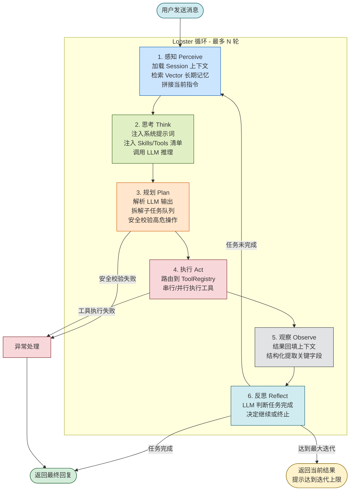
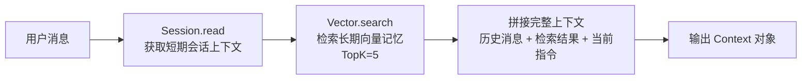
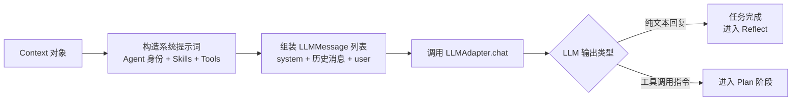
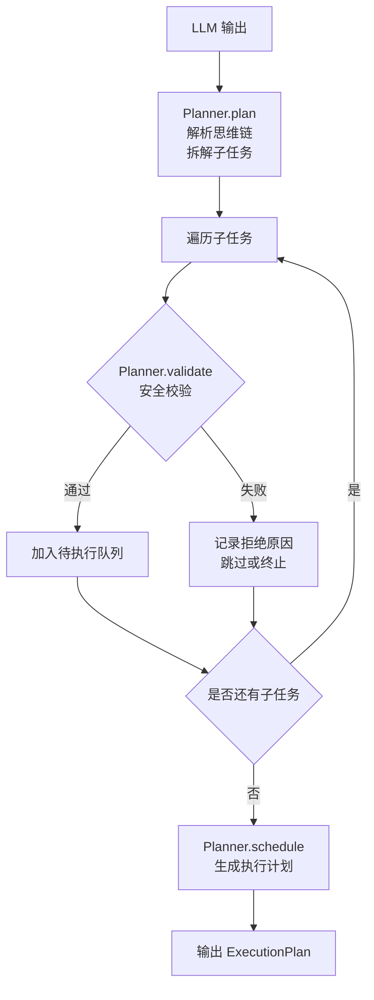
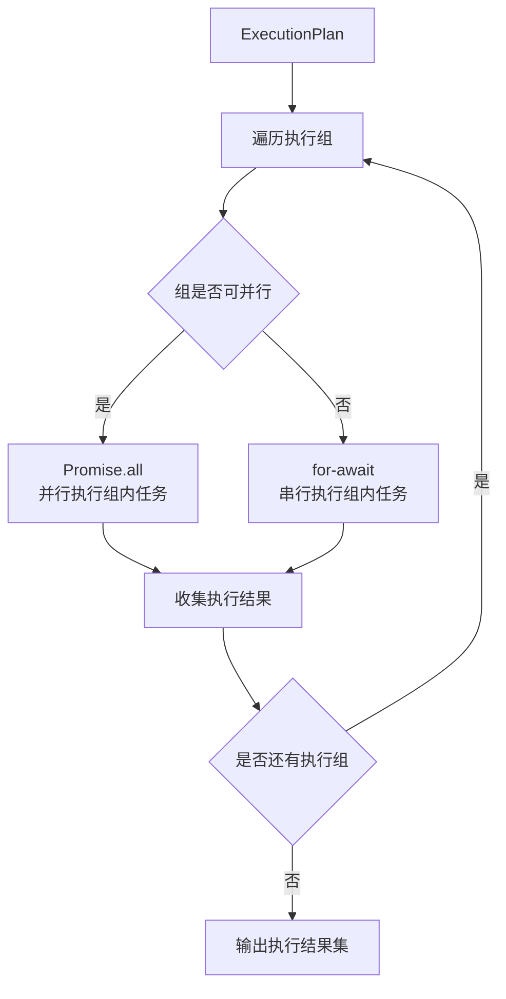
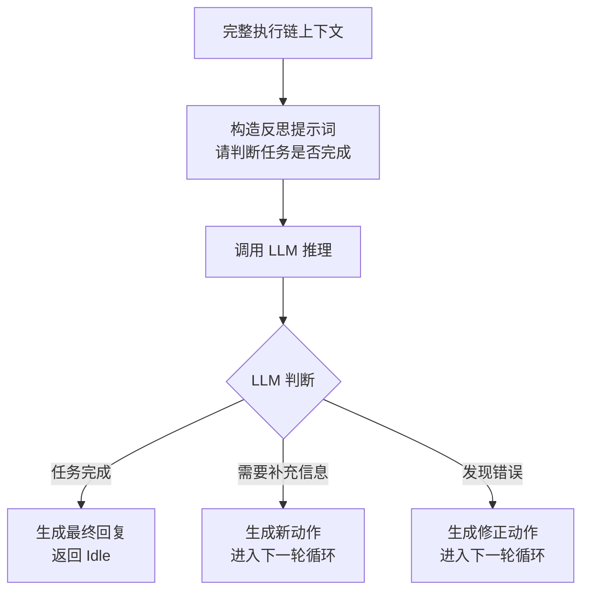
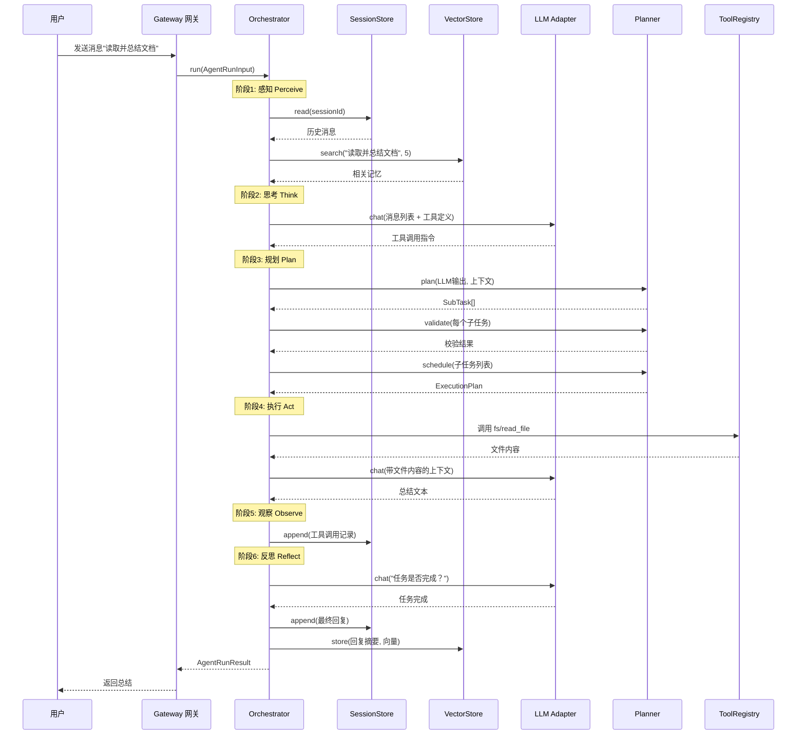

# MyOpenClaw Agent 运行时模块

> **版本**：v1.0.0  
> **修订日期**：2026-07-21  
> **修订人**：MyOpenClaw Core Team  
> **文档状态**：正式发布

---

## 目录

- [1. 模块概述](#1-模块概述)
- [2. 核心子模块详解](#2-核心子模块详解)
  - [2.1 Lobster Orchestrator 主循环调度器](#21-lobster-orchestrator-主循环调度器)
  - [2.2 Planner 任务规划引擎](#22-planner-任务规划引擎)
  - [2.3 LLM 多模型适配器](#23-llm-多模型适配器)
- [3. 核心能力](#3-核心能力)
- [4. TypeScript 接口定义与类型说明](#4-typescript-接口定义与类型说明)
- [5. Lobster 循环详细流程](#5-lobster-循环详细流程)
- [6. LLM 适配器使用示例](#6-llm-适配器使用示例)
- [7. Agent 配置说明](#7-agent-配置说明)
- [8. 自定义 Agent 开发指南](#8-自定义-agent-开发指南)
- [9. 性能优化与调优建议](#9-性能优化与调优建议)
- [10. 故障排查](#10-故障排查)

---

## 1. 模块概述

Agent Runtime（智能体运行时）是 MyOpenClaw 六层架构中的第四层，也是整个系统的"推理大脑"。它处于 Gateway 网关层之下、Tools/Skills 工具层之上，负责接收来自网关的标准化用户指令，驱动 LLM 完成推理、规划与工具调用，最终产出可向用户回传的结果。

Agent Runtime 的核心设计目标是构建一个**闭环自主的智能体**：用户只需发送一条自然语言指令，Agent 即可自主完成"理解意图 → 拆解任务 → 调用工具 → 观察结果 → 反思修正"的多步骤执行流程，全程无需人工分段干预。

### 1.1 模块定位

```
┌──────────────────────────────────────────────────┐
│  Channels 渠道层        外部消息归一化             │
├──────────────────────────────────────────────────┤
│  Gateway 网关层         鉴权、路由、状态调度        │
├──────────────────────────────────────────────────┤
│  Agent Runtime 运行时   <<< 本文档所述模块 >>>     │
│  ┌────────────────────────────────────────────┐  │
│  │ Orchestrator  调度六阶段 Lobster 循环       │  │
│  │ Planner       基于思维链拆解子任务           │  │
│  │ LLM Adapter   统一封装多模型调用            │  │
│  └────────────────────────────────────────────┘  │
├──────────────────────────────────────────────────┤
│  Tools/Skills 工具层    原子能力与业务技能          │
├──────────────────────────────────────────────────┤
│  Memory 记忆层          会话上下文与向量记忆        │
└──────────────────────────────────────────────────┘
```

### 1.2 三大子模块

| 子模块 | 源码位置 | 核心职责 |
|--------|----------|----------|
| Lobster Orchestrator | `src/agents/orchestrator.ts` | 驱动 `感知 → 思考 → 规划 → 执行 → 观察 → 反思` 六阶段循环，维护 Agent 状态机 |
| Planner | `src/agents/planner.ts` | 基于 CoT 思维链拆解子任务，安全校验高危操作，编排多工具串行/并行调用 |
| LLM Adapter | `src/agents/llm/` | 统一封装 OpenAI/Claude/DeepSeek/本地模型，提供统一的入参出参契约 |

### 1.3 设计原则

1. **闭环自主**：单次用户输入触发完整的感知-执行-反思循环，无需人工分段
2. **模型无关**：LLM 调用通过统一适配器接口隔离，切换模型不改业务逻辑
3. **安全可控**：所有工具调用须经 Planner 安全校验，高危操作可被拦截
4. **状态可观测**：Agent 状态机显式建模，每一阶段都可观测、可中断、可恢复
5. **上下文驱动**：每一轮推理都建立在历史观察之上，避免幻觉与重复劳动

---

## 2. 核心子模块详解

### 2.1 Lobster Orchestrator 主循环调度器

**源码位置**：`src/agents/orchestrator.ts`

Lobster Orchestrator（直译"龙虾调度器"）是 Agent Runtime 的核心驱动器。它以状态机的方式管理 Agent 的整个生命周期，循环执行六个阶段直至任务完成或达到最大迭代次数。

#### 六阶段循环定义

| 阶段 | 中文名 | 输入 | 输出 | 核心动作 |
|------|--------|------|------|----------|
| Perceive | 感知 | 用户消息、历史上下文 | 完整上下文对象 | 加载 Session 短期记忆、Vector 长期记忆，拼接当前指令 |
| Think | 思考 | 完整上下文、可用 Skills/Tools | LLM 推理输出 | 注入系统提示词、技能描述、工具清单，调用 LLM 推理 |
| Plan | 规划 | LLM 输出动作 | 子任务队列 | 拆解 CoT 步骤，安全校验高危操作，编排调用顺序 |
| Act | 执行 | 子任务队列 | 工具执行结果 | 调用 ToolRegistry 路由到具体工具，串行/并行执行 |
| Observe | 观察 | 工具执行结果 | 更新后的上下文 | 结果回填上下文，结构化提取关键字段 |
| Reflect | 反思 | 完整执行链 | 完成标志/后续动作 | LLM 判断任务是否完成，决定继续循环或终止 |

#### Agent 状态机

Orchestrator 维护一个显式的有限状态机，状态枚举定义如下：

```
                ┌──────────┐
                │  Idle    │  空闲：等待用户输入
                │  空闲    │
                └────┬─────┘
                     │ 收到用户消息
                     ▼
                ┌──────────┐
                │ Thinking │  思考：LLM 推理与任务规划
                │  思考    │◄────────────┐
                └────┬─────┘             │
                     │ 规划完成            │ 反思后任务未完成
                     ▼                   │
                ┌──────────┐             │
                │ Acting   │  执行：工具调用
                │  执行    │─────────────┘
                └────┬─────┘
                     │ 执行完成
                     ▼
                ┌──────────┐
                │ Reflect  │  反思：判断是否完成
                └────┬─────┘
                     │
            ┌────────┴────────┐
            ▼                 ▼
        回到 Thinking      返回 Idle（任务完成）
            │
            ▼
        ┌──────────┐
        │ Error    │  异常：错误恢复
        │  异常    │
        └──────────┘
```

状态流转规则：
- `Idle → Thinking`：网关下发用户消息触发
- `Thinking → Acting`：Planner 输出至少一个可执行子任务
- `Acting → Thinking`：观察阶段完成后，Reflect 判断任务未完成，进入下一轮循环
- `Thinking → Idle`：LLM 判断任务完成，无需执行工具
- `任意状态 → Error`：执行过程抛出异常或违反安全约束
- `Error → Idle`：错误恢复后回到空闲态，等待新指令

#### 最大迭代保护

为防止 Agent 陷入无限循环，Orchestrator 内置最大迭代次数限制（默认 10 次，可通过配置调整）。当达到上限时强制终止当前循环并返回"达到最大迭代次数"的提示。

### 2.2 Planner 任务规划引擎

**源码位置**：`src/agents/planner.ts`

Planner 是 Think 和 Plan 阶段的核心引擎。它接收 LLM 的推理输出（通常包含思维过程和动作指令），将其转化为结构化的子任务列表，并对每个子任务做安全校验和调用编排。

#### 核心职责

1. **思维链解析**：解析 LLM 输出中的 `<thought>` / `<action>` / `<final_answer>` 等结构化标签，提取可执行的动作指令
2. **子任务拆解**：将复杂任务分解为有序的子任务列表，每个子任务包含工具名、参数、依赖关系
3. **安全校验**：对高危操作（如删除文件、执行危险 Shell 命令）执行参数 Schema 校验和白名单检查
4. **调用编排**：根据子任务间的依赖关系，自动决定串行执行或并行执行

#### CoT 思维链示例

假设用户指令："读取桌面上的 report.md 并总结要点，然后把总结保存为 summary.md"

Planner 解析 LLM 输出后生成的子任务队列：

```json
[
  {
    "id": "step-1",
    "tool": "fs/read_file",
    "params": { "path": "/Users/user/Desktop/report.md" },
    "dependsOn": [],
    "description": "读取 report.md 文件内容"
  },
  {
    "id": "step-2",
    "tool": "llm/summarize",
    "params": { "text": "${step-1.output}" },
    "dependsOn": ["step-1"],
    "description": "总结文件要点"
  },
  {
    "id": "step-3",
    "tool": "fs/write_file",
    "params": { 
      "path": "/Users/user/Desktop/summary.md",
      "content": "${step-2.output}" 
    },
    "dependsOn": ["step-2"],
    "description": "写入总结到 summary.md",
    "risk": "high",
    "requiresConfirmation": false
  }
]
```

#### 安全校验机制

Planner 对每个子任务执行三层安全校验：

| 校验层 | 校验内容 | 失败处理 |
|--------|----------|----------|
| Schema 校验 | 参数类型、必填项、取值范围是否符合 Tool 定义 | 拒绝执行，返回校验错误 |
| 危险操作拦截 | 命中黑名单的命令（如 `rm -rf /`、`DROP TABLE`） | 拒绝执行，记录审计日志 |
| 路径白名单 | 文件操作路径是否在允许的工作目录范围内 | 拒绝执行，返回越权提示 |

### 2.3 LLM 多模型适配器

**源码位置**：`src/agents/llm/`

LLM Adapter 子模块将不同厂商的 LLM 接口（OpenAI、Claude、DeepSeek、本地开源模型）统一封装为一套标准接口。Agent 核心逻辑只依赖 `LLMAdapter` 接口，不感知底层模型差异。

#### 适配器目录结构

```
src/agents/llm/
├── adapter.ts          # LLMAdapter 统一接口定义
├── openai.ts           # OpenAI GPT 适配器
├── claude.ts           # Anthropic Claude 适配器
├── deepseek.ts         # DeepSeek 适配器
├── local.ts            # 本地开源模型适配器（Ollama / llama.cpp）
├── factory.ts          # 适配器工厂，按配置创建实例
├── prompt.ts           # 系统提示词构造器
└── types.ts            # LLM 相关类型定义
```

#### 统一入参出参契约

所有适配器实现统一的方法签名 `chat(input: LLMChatInput): Promise<LLMChatOutput>`，屏蔽不同模型的 API 差异：

| 维度 | 统一契约说明 |
|------|--------------|
| 入参消息 | 统一为 `LLMMessage[]` 数组，包含 role（system/user/assistant/tool）和 content |
| 出参格式 | 统一为 `LLMChatOutput`，包含 content（文本）、tool_calls（工具调用）、usage（token 统计） |
| 工具调用 | 统一为 `LLMToolCall` 结构，包含 name、arguments（JSON） |
| 流式支持 | 通过 `streamChat()` 方法返回 AsyncIterable，按 chunk 流式产出 |
| 错误处理 | 统一抛出 `LLMError`，包含 code、message、retryable 标志 |

#### 自动系统提示词构造

适配器内部通过 `prompt.ts` 自动构造系统提示词，包含以下组成部分：

1. **Agent 身份描述**：Agent 名称、角色定位、行为边界
2. **可用 Skills 清单**：从 `skills/` 目录加载的所有 SKILL.md 描述
3. **可用 Tools 清单**：从 ToolRegistry 获取所有已注册工具的名称和参数 Schema
4. **输出格式约束**：要求 LLM 按指定结构输出（思维过程 + 动作指令）
5. **安全约束**：禁止生成危险操作指令的提示

---

## 3. 核心能力

Agent Runtime 对外提供以下六项核心能力：

### 3.1 意图理解

Agent 接收自然语言指令后，结合历史会话上下文和长期向量记忆，准确理解用户真实意图。包括指代消解（"它"、"那个文件"指代什么）、省略补全、多轮对话中的上下文延续。

### 3.2 复杂任务拆解

对于包含多个步骤的复合任务（如"读取文件 → 提取关键信息 → 调用 API → 写回结果"），Planner 基于 CoT 思维链将其拆解为有序子任务列表，每个子任务对应一次工具调用，并自动推断子任务间的依赖关系。

### 3.3 大模型调用

通过 LLM Adapter 统一接口，Agent 可调用 OpenAI GPT-4、Claude 3.5、DeepSeek、本地 Llama 等模型。模型切换只需修改配置，无需改动 Agent 核心逻辑。支持流式输出、函数调用、Token 用量统计。

### 3.4 自主循环执行

Lobster Orchestrator 驱动完整的六阶段循环，Agent 在单次用户输入后可自主执行多轮"思考-执行-观察"循环，直到 LLM 判断任务完成或达到最大迭代次数。每一轮循环都建立在前一轮的观察结果之上。

### 3.5 多步骤连续操作

支持串行和并行两种执行模式。无依赖的子任务可并行执行以降低延迟；有依赖的子任务按拓扑序串行执行。例如"同时抓取三个网页内容"可并行，"读取文件后基于内容生成摘要"必须串行。

### 3.6 结果反思修正

Reflect 阶段由 LLM 对整个执行链做反思：检查工具返回是否符合预期、是否需要补充信息、是否需要重新规划。如果发现错误或遗漏，Agent 会自主调整策略重新执行，而非简单返回错误。

---

## 4. TypeScript 接口定义与类型说明

本节给出 Agent Runtime 的完整 TypeScript 类型定义，所有类型均带详细中文注释。

### 4.1 Agent 状态机枚举

```typescript
/**
 * Agent 运行时状态枚举
 * 
 * Agent 在整个生命周期中处于以下四种状态之一。
 * 状态流转由 Orchestrator 严格控制，外部不可直接修改。
 */
export enum AgentState {
  /** 空闲：等待用户输入，未在执行任何任务 */
  Idle = 'idle',
  
  /** 思考：正在调用 LLM 进行推理和任务规划 */
  Thinking = 'thinking',
  
  /** 执行：正在调用工具执行子任务 */
  Acting = 'acting',
  
  /** 异常：执行过程中发生错误，等待恢复或人工介入 */
  Error = 'error'
}
```

### 4.2 Orchestrator 接口

```typescript
/**
 * Lobster Orchestrator 主循环调度器接口
 * 
 * 负责驱动 感知→思考→规划→执行→观察→反思 六阶段循环，
 * 维护 Agent 状态机，协调 Planner、LLM Adapter、ToolRegistry、Memory 协同工作。
 */
export interface Orchestrator {
  /**
   * 获取当前 Agent 状态
   * @returns 当前状态机状态
   */
  getState(): AgentState;

  /**
   * 处理用户消息，启动一轮 Lobster 循环
   * 
   * 该方法是 Agent 对外的核心入口。接收标准化消息后，
   * 内部驱动完整的六阶段循环，直到任务完成或达到最大迭代次数。
   * 
   * @param input 用户输入消息及会话上下文
   * @returns Agent 处理结果，包含回复内容、执行链路、状态信息
   */
  run(input: AgentRunInput): Promise<AgentRunResult>;

  /**
   * 中断当前正在执行的循环
   * 
   * 用于用户主动取消任务或超时场景。
   * 中断后 Agent 状态回到 Idle，已执行的部分结果会保留在 Memory 中。
   */
  abort(): Promise<void>;

  /**
   * 重置 Agent 状态，清空当前会话上下文
   * 
   * 注意：此操作仅清空短期会话记忆，长期向量记忆不受影响。
   */
  reset(): Promise<void>;

  /**
   * 注册状态变更监听器
   * 
   * @param listener 状态变更回调函数，参数为新的状态
   * @returns 取消监听的函数
   */
  onStateChange(listener: (state: AgentState) => void): () => void;

  /**
   * 注册步骤执行监听器
   * 
   * 用于实时推送 Agent 执行进度到渠道层（如 WebUI 显示执行步骤）。
   * 
   * @param listener 步骤变更回调函数，参数为当前执行的阶段和详情
   */
  onStep(listener: (step: LoopStepEvent) => void): () => void;
}

/**
 * Agent 运行输入
 */
export interface AgentRunInput {
  /** 用户消息内容 */
  message: string;
  /** 会话 ID，用于隔离不同会话的上下文 */
  sessionId: string;
  /** 渠道 ID（telegram/discord/webchat 等） */
  channelId: string;
  /** 用户 ID */
  userId: string;
  /** 附件列表（图片、文件等） */
  attachments?: Attachment[];
  /** 用户权限信息，用于安全校验 */
  permissions?: UserPermissions;
}

/**
 * Agent 运行结果
 */
export interface AgentRunResult {
  /** 最终回复给用户的文本内容 */
  reply: string;
  /** 执行过程中经历的步骤列表，用于审计和展示 */
  executionTrace: ExecutionStep[];
  /** 本次循环消耗的 LLM Token 统计 */
  tokenUsage: TokenUsage;
  /** 循环是否正常完成（true）或被中断（false） */
  completed: boolean;
  /** 终止原因：completed / aborted / max_iterations / error */
  terminationReason: 'completed' | 'aborted' | 'max_iterations' | 'error';
  /** 执行耗时（毫秒） */
  durationMs: number;
}

/**
 * 单个执行步骤记录
 */
export interface ExecutionStep {
  /** 步骤序号 */
  index: number;
  /** 所属循环阶段 */
  phase: LoopPhase;
  /** 调用的工具名（若为工具调用步骤） */
  tool?: string;
  /** 工具入参（若为工具调用步骤） */
  params?: Record<string, unknown>;
  /** 工具出参或 LLM 输出（若为工具调用步骤） */
  output?: unknown;
  /** 本步骤耗时（毫秒） */
  durationMs: number;
  /** 本步骤状态：success / failed / skipped */
  status: 'success' | 'failed' | 'skipped';
}

/**
 * 循环阶段枚举
 */
export type LoopPhase = 'perceive' | 'think' | 'plan' | 'act' | 'observe' | 'reflect';

/**
 * 循环步骤事件
 */
export interface LoopStepEvent {
  /** 当前循环轮次（从 1 开始） */
  iteration: number;
  /** 当前阶段 */
  phase: LoopPhase;
  /** 阶段详情（如工具名、LLM 输出摘要） */
  detail: string;
  /** 时间戳 */
  timestamp: number;
}
```

### 4.3 Planner 接口

```typescript
/**
 * Planner 任务规划引擎接口
 * 
 * 负责 Think 和 Plan 阶段的任务拆解、安全校验、调用编排。
 */
export interface Planner {
  /**
   * 规划子任务列表
   * 
   * 接收 LLM 推理输出（包含思维过程和动作指令），
   * 解析并转化为结构化的子任务队列。
   * 
   * @param llmOutput LLM 输出的原始内容
   * @param context 当前会话上下文
   * @returns 有序的子任务列表
   */
  plan(llmOutput: string, context: PlannerContext): Promise<SubTask[]>;

  /**
   * 安全校验单个子任务
   * 
   * 执行 Schema 校验、危险操作拦截、路径白名单检查。
   * 
   * @param task 待校验的子任务
   * @returns 校验结果，包含是否通过和失败原因
   */
  validate(task: SubTask): SecurityCheckResult;

  /**
   * 编排子任务的执行顺序
   * 
   * 根据子任务间的依赖关系，生成执行计划。
   * 无依赖的任务可并行，有依赖的任务按拓扑序串行。
   * 
   * @param tasks 子任务列表
   * @returns 分组的执行计划，每组内可并行执行
   */
  schedule(tasks: SubTask[]): ExecutionPlan;
}

/**
 * 子任务定义
 */
export interface SubTask {
  /** 子任务唯一 ID */
  id: string;
  /** 调用的工具名（如 fs/read_file） */
  tool: string;
  /** 工具参数 */
  params: Record<string, unknown>;
  /** 依赖的前置子任务 ID 列表 */
  dependsOn: string[];
  /** 子任务描述（供审计展示） */
  description: string;
  /** 风险等级：low / medium / high */
  risk: 'low' | 'medium' | 'high';
  /** 是否需要用户确认（高危操作默认为 true） */
  requiresConfirmation?: boolean;
}

/**
 * 执行计划
 * 
 * 由若干执行组构成，组内可并行，组间串行。
 */
export interface ExecutionPlan {
  /** 执行组列表，按执行顺序排列 */
  groups: ExecutionGroup[];
}

/**
 * 执行组
 */
export interface ExecutionGroup {
  /** 组内可并行执行的子任务 */
  tasks: SubTask[];
  /** 是否可并行（true 表示组内任务无依赖关系） */
  parallel: boolean;
}

/**
 * 安全校验结果
 */
export interface SecurityCheckResult {
  /** 是否通过校验 */
  passed: boolean;
  /** 失败原因（通过时为空） */
  reason?: string;
  /** 校验失败的字段（若为 Schema 校验失败） */
  failedField?: string;
  /** 命中的安全规则编号 */
  ruleId?: string;
}

/**
 * 规划上下文
 */
export interface PlannerContext {
  /** 会话 ID */
  sessionId: string;
  /** 当前可用工具清单 */
  availableTools: ToolDescriptor[];
  /** 用户权限信息 */
  permissions: UserPermissions;
  /** 允许的工作目录列表（文件操作白名单） */
  allowedPaths: string[];
}
```

### 4.4 LLM Adapter 接口

```typescript
/**
 * LLM 多模型适配器统一接口
 * 
 * 所有厂商的 LLM 适配器（OpenAI/Claude/DeepSeek/本地模型）
 * 都必须实现此接口。Agent 核心逻辑只依赖此接口，不感知底层模型差异。
 */
export interface LLMAdapter {
  /** 适配器唯一标识（如 openai-gpt-4、claude-3-5-sonnet） */
  readonly id: string;

  /** 适配器展示名称 */
  readonly displayName: string;

  /** 当前模型是否支持工具调用（function calling） */
  readonly supportsToolCalls: boolean;

  /** 当前模型是否支持流式输出 */
  readonly supportsStreaming: boolean;

  /** 模型上下文窗口大小（token 数） */
  readonly contextWindow: number;

  /**
   * 发起一次 LLM 对话
   * 
   * @param input 对话输入，包含消息列表、工具定义、生成参数
   * @returns 对话输出，包含文本内容、工具调用、Token 统计
   */
  chat(input: LLMChatInput): Promise<LLMChatOutput>;

  /**
   * 发起流式 LLM 对话
   * 
   * @param input 对话输入
   * @returns 异步可迭代对象，逐 chunk 产出内容
   */
  streamChat(input: LLMChatInput): AsyncIterable<LLMStreamChunk>;

  /**
   * 生成文本向量（embedding）
   * 
   * 用于长期记忆向量化。部分模型不支持此方法，需抛出 NotSupportedError。
   * 
   * @param text 待向量化的文本
   * @returns 向量数组
   */
  embed(text: string): Promise<number[]>;

  /**
   * 统计 Token 数量
   * 
   * 用于预估 Token 消耗，避免超出上下文窗口。
   * 
   * @param text 待统计的文本
   * @returns Token 数量
   */
  countTokens(text: string): Promise<number>;
}

/**
 * LLM 对话输入
 */
export interface LLMChatInput {
  /** 消息列表，按时间顺序排列 */
  messages: LLMMessage[];
  /** 可用工具定义（用于 function calling） */
  tools?: ToolDefinition[];
  /** 生成参数 */
  options?: LLMGenerateOptions;
}

/**
 * LLM 消息
 */
export interface LLMMessage {
  /** 角色：system / user / assistant / tool */
  role: 'system' | 'user' | 'assistant' | 'tool';
  /** 消息内容（文本或多模态内容） */
  content: string | LLMContentPart[];
  /** 工具调用（仅 assistant 角色产生） */
  toolCalls?: LLMToolCall[];
  /** 工具调用 ID（仅 tool 角色消息，用于关联工具调用） */
  toolCallId?: string;
  /** 消息名称 */
  name?: string;
}

/**
 * 多模态内容片段
 */
export interface LLMContentPart {
  /** 内容类型：text / image_url */
  type: 'text' | 'image_url';
  /** 文本内容（type 为 text 时） */
  text?: string;
  /** 图片 URL（type 为 image_url 时） */
  imageUrl?: { url: string };
}

/**
 * LLM 工具调用
 */
export interface LLMToolCall {
  /** 调用 ID（用于关联工具返回结果） */
  id: string;
  /** 工具调用类型（当前固定为 function） */
  type: 'function';
  /** 函数调用详情 */
  function: {
    /** 函数名 */
    name: string;
    /** 函数参数（JSON 字符串） */
    arguments: string;
  };
}

/**
 * 工具定义（提供给 LLM 的工具描述）
 */
export interface ToolDefinition {
  /** 工具名 */
  name: string;
  /** 工具描述 */
  description: string;
  /** 参数 Schema（JSON Schema 格式） */
  parameters: object;
}

/**
 * 生成参数
 */
export interface LLMGenerateOptions {
  /** 温度参数，控制随机性（0-2，值越大越发散） */
  temperature?: number;
  /** Top-P 采样参数 */
  topP?: number;
  /** 最大生成 Token 数 */
  maxTokens?: number;
  /** 停止序列 */
  stop?: string[];
  /** 强制工具调用模式：auto / none / 指定工具名 */
  toolChoice?: 'auto' | 'none' | string;
}

/**
 * LLM 对话输出
 */
export interface LLMChatOutput {
  /** 生成的文本内容 */
  content: string;
  /** 工具调用列表（若 LLM 决定调用工具） */
  toolCalls?: LLMToolCall[];
  /** 结束原因：stop / tool_calls / length / content_filter */
  finishReason: 'stop' | 'tool_calls' | 'length' | 'content_filter';
  /** Token 使用统计 */
  usage: TokenUsage;
  /** 模型实际使用的名称（可能与配置不同，如自动路由） */
  model: string;
}

/**
 * 流式输出 chunk
 */
export interface LLMStreamChunk {
  /** 本次 chunk 的文本增量 */
  delta: string;
  /** 工具调用增量（流式工具调用时逐步填充） */
  toolCallDelta?: Partial<LLMToolCall>;
  /** 是否为最后一个 chunk */
  done: boolean;
  /** Token 使用统计（仅最后一个 chunk 包含） */
  usage?: TokenUsage;
}

/**
 * Token 使用统计
 */
export interface TokenUsage {
  /** 输入 Token 数 */
  promptTokens: number;
  /** 输出 Token 数 */
  completionTokens: number;
  /** 总 Token 数 */
  totalTokens: number;
}

/**
 * LLM 错误
 */
export class LLMError extends Error {
  /** 错误码 */
  code: string;
  /** 是否可重试 */
  retryable: boolean;
  /** 原始错误 */
  cause?: unknown;

  constructor(code: string, message: string, retryable = false, cause?: unknown) {
    super(message);
    this.name = 'LLMError';
    this.code = code;
    this.retryable = retryable;
    this.cause = cause;
  }
}
```

### 4.5 工具描述符类型

```typescript
/**
 * 工具描述符
 * 
 * 描述一个已注册工具的元信息，供 Planner 和 LLM 使用。
 */
export interface ToolDescriptor {
  /** 工具名（唯一标识，如 fs/read_file） */
  name: string;
  /** 工具描述 */
  description: string;
  /** 参数 Schema（JSON Schema 格式） */
  parameters: object;
  /** 风险等级 */
  risk: 'low' | 'medium' | 'high';
  /** 是否为内置工具 */
  builtin: boolean;
}
```

---

## 5. Lobster 循环详细流程

### 5.1 流程总览



### 5.2 各阶段详细说明

#### 阶段 1：感知（Perceive）

感知阶段负责构建 LLM 推理所需的完整上下文。



**关键动作**：
- 调用 `SessionStore.read(sessionId)` 获取当前会话的历史消息
- 调用 `VectorStore.search(userMessage, 5)` 检索语义相关的长期记忆
- 将历史消息、检索结果、当前用户指令拼接为完整的 `Context` 对象

**状态变更**：`Idle → Thinking`

#### 阶段 2：思考（Think）

思考阶段调用 LLM 进行推理。



**关键动作**：
- 通过 `prompt.ts` 构造系统提示词，包含 Agent 身份、可用 Skills、可用 Tools、输出格式约束
- 组装 `LLMMessage[]` 消息列表（system 消息 + 历史对话 + 当前 user 消息）
- 调用 `LLMAdapter.chat()` 发起推理请求
- 解析 LLM 输出：若为纯文本则任务完成，若包含工具调用则进入 Plan 阶段

#### 阶段 3：规划（Plan）

规划阶段将 LLM 输出转化为结构化子任务并做安全校验。



**关键动作**：
- 调用 `Planner.plan()` 将 LLM 输出解析为 `SubTask[]`
- 对每个子任务调用 `Planner.validate()` 做安全校验
- 校验失败的子任务被跳过或终止整个循环（取决于风险等级）
- 调用 `Planner.schedule()` 生成 `ExecutionPlan`，决定串行/并行执行顺序

**状态变更**：`Thinking → Acting`

#### 阶段 4：执行（Act）

执行阶段按执行计划调用工具。



**关键动作**：
- 遍历 `ExecutionPlan.groups`，每组依次执行
- 组内并行任务通过 `Promise.all()` 并发执行
- 组内串行任务通过 `for await` 顺序执行
- 每个工具调用经 `ToolRegistry` 路由到具体实现
- 收集所有工具的执行结果

#### 阶段 5：观察（Observe）

观察阶段将工具执行结果回填到上下文。

**关键动作**：
- 将每个工具调用的入参和返回值转为 `tool` 角色的 `LLMMessage`
- 结构化提取关键字段（如文件大小、命令退出码、HTTP 状态码）
- 更新会话上下文，准备进入下一轮 LLM 推理

**状态变更**：`Acting → Thinking`（若需继续循环）

#### 阶段 6：反思（Reflect）

反思阶段由 LLM 判断任务是否完成。



**关键动作**：
- 构造反思提示词，要求 LLM 判断当前任务是否完成
- 若完成：生成最终回复文本，将回复写入 Session 短期记忆和 Vector 长期记忆
- 若未完成：LLM 生成新的动作指令，进入下一轮循环（回到 Think 阶段）
- 若达到最大迭代次数：强制终止，返回当前最佳结果

**状态变更**：`Thinking → Idle`（任务完成）或 `Thinking → Thinking`（继续循环）

### 5.3 完整循环时序图



---

## 6. LLM 适配器使用示例

### 6.1 适配器工厂创建

```typescript
/**
 * LLM 适配器使用示例
 * 
 * 演示如何通过工厂创建不同厂商的适配器实例。
 */
import { LLMAdapterFactory } from '@/agents/llm/factory';
import type { LLMAdapter } from '@/agents/llm/adapter';

// 1. 创建 OpenAI GPT-4 适配器
const openaiAdapter: LLMAdapter = LLMAdapterFactory.create({
  provider: 'openai',
  model: 'gpt-4-turbo',
  apiKey: process.env.OPENAI_API_KEY!,
  baseUrl: 'https://api.openai.com/v1', // 可选，默认官方地址
});

// 2. 创建 Claude 3.5 Sonnet 适配器
const claudeAdapter: LLMAdapter = LLMAdapterFactory.create({
  provider: 'claude',
  model: 'claude-3-5-sonnet-20241022',
  apiKey: process.env.ANTHROPIC_API_KEY!,
});

// 3. 创建 DeepSeek 适配器
const deepseekAdapter: LLMAdapter = LLMAdapterFactory.create({
  provider: 'deepseek',
  model: 'deepseek-chat',
  apiKey: process.env.DEEPSEEK_API_KEY!,
});

// 4. 创建本地 Ollama 模型适配器（数据完全不出本地）
const localAdapter: LLMAdapter = LLMAdapterFactory.create({
  provider: 'local',
  model: 'llama3.1:8b',
  baseUrl: 'http://localhost:11434', // Ollama 默认地址
});
```

### 6.2 基本对话调用

```typescript
/**
 * LLM 基本对话调用示例
 */
import type { LLMChatInput, LLMChatOutput } from '@/agents/llm/adapter';

// 构造对话输入
const input: LLMChatInput = {
  messages: [
    {
      role: 'system',
      content: '你是一个 MyOpenClaw 智能助手，帮助用户完成文件操作和任务管理。',
    },
    {
      role: 'user',
      content: '请帮我读取 /tmp/config.json 文件的内容',
    },
  ],
  options: {
    temperature: 0.7,    // 温度参数，控制输出随机性
    maxTokens: 2000,     // 最大生成 Token 数
  },
};

// 调用 OpenAI 适配器
const output: LLMChatOutput = await openaiAdapter.chat(input);

console.log('回复内容:', output.content);
console.log('结束原因:', output.finishReason);
console.log('Token 用量:', output.usage);
```

### 6.3 工具调用示例

```typescript
/**
 * LLM 工具调用（function calling）示例
 */
import type { ToolDefinition } from '@/agents/llm/adapter';

// 定义可用工具
const tools: ToolDefinition[] = [
  {
    name: 'fs_read_file',
    description: '读取本地文件内容',
    parameters: {
      type: 'object',
      properties: {
        path: {
          type: 'string',
          description: '文件绝对路径',
        },
        encoding: {
          type: 'string',
          description: '文件编码，默认 utf-8',
        },
      },
      required: ['path'],
    },
  },
  {
    name: 'fs_write_file',
    description: '写入内容到本地文件',
    parameters: {
      type: 'object',
      properties: {
        path: { type: 'string', description: '文件绝对路径' },
        content: { type: 'string', description: '文件内容' },
      },
      required: ['path', 'content'],
    },
  },
];

// 构造带工具定义的对话输入
const toolInput: LLMChatInput = {
  messages: [
    {
      role: 'system',
      content: '你可以调用工具来完成文件操作任务。',
    },
    {
      role: 'user',
      content: '请读取 /tmp/config.json 文件',
    },
  ],
  tools,
  options: {
    toolChoice: 'auto', // 让 LLM 自主决定是否调用工具
  },
};

// 调用 LLM，LLM 可能返回工具调用而非纯文本
const toolOutput = await openaiAdapter.chat(toolInput);

if (toolOutput.finishReason === 'tool_calls' && toolOutput.toolCalls) {
  // LLM 决定调用工具
  for (const call of toolOutput.toolCalls) {
    console.log(`调用工具: ${call.function.name}`);
    console.log(`参数: ${call.function.arguments}`);
    // 实际执行工具的逻辑由 ToolRegistry 处理
  }
} else {
  // LLM 直接返回文本
  console.log('回复:', toolOutput.content);
}
```

### 6.4 流式输出示例

```typescript
/**
 * LLM 流式输出示例
 * 
 * 适用于 WebUI 等需要实时展示生成内容的场景。
 */
async function streamDemo() {
  const input: LLMChatInput = {
    messages: [
      { role: 'user', content: '请写一首关于秋天的诗' },
    ],
    options: { temperature: 0.9 },
  };

  // 使用 streamChat 获取异步可迭代对象
  const stream = claudeAdapter.streamChat(input);

  let fullText = '';
  for await (const chunk of stream) {
    // 每个 chunk 包含增量文本
    process.stdout.write(chunk.delta);
    fullText += chunk.delta;

    // 最后一个 chunk 包含 Token 统计
    if (chunk.done && chunk.usage) {
      console.log('\n--- Token 统计 ---');
      console.log(`输入: ${chunk.usage.promptTokens}`);
      console.log(`输出: ${chunk.usage.completionTokens}`);
    }
  }
}

streamDemo();
```

### 6.5 本地模型配置示例

```typescript
/**
 * 本地开源模型配置示例
 * 
 * 通过 Ollama 运行本地模型，所有数据不出本地。
 */
import { LLMAdapterFactory } from '@/agents/llm/factory';

// 配置本地 Ollama 模型
const localLLM = LLMAdapterFactory.create({
  provider: 'local',
  model: 'qwen2.5:7b', // 通义千问本地模型
  baseUrl: 'http://localhost:11434',
  options: {
    temperature: 0.6,
    topP: 0.9,
    numCtx: 8192, // 上下文窗口
  },
});

// 调用本地模型进行对话
const localOutput = await localLLM.chat({
  messages: [
    { role: 'user', content: '请帮我读取本地文件' }
  ],
  options: { temperature: 0.6 }
});

console.log(localOutput.content);
```

> **说明**：本地开源模型通常不支持原生的函数调用能力。
> 对于这类模型，MyOpenClaw 通过在系统提示词中描述工具调用的输出格式约定，
> 由 Planner 解析 LLM 输出文本中的结构化指令来模拟工具调用。
> 这使得即使是本地小模型也能驱动 Lobster 循环执行工具。

### 6.6 模型切换与回退

```typescript
/**
 * 模型切换与回退示例
 * 
 * 演示如何在运行时切换 LLM 模型，以及配置主备模型回退策略。
 */
import { LLMAdapterFactory } from '@/agents/llm/factory';
import type { LLMAdapter } from '@/agents/llm/adapter';

// 主模型：Claude（高质量推理）
const primaryAdapter: LLMAdapter = LLMAdapterFactory.create({
  provider: 'claude',
  model: 'claude-3-5-sonnet-20241022',
  apiKey: process.env.ANTHROPIC_API_KEY!,
});

// 备用模型：DeepSeek（成本更低，主模型失败时回退）
const fallbackAdapter: LLMAdapter = LLMAdapterFactory.create({
  provider: 'deepseek',
  model: 'deepseek-chat',
  apiKey: process.env.DEEPSEEK_API_KEY!,
});

/**
 * 带回退策略的 LLM 调用
 */
async function chatWithFallback(input: LLMChatInput): Promise<LLMChatOutput> {
  try {
    // 优先使用主模型
    return await primaryAdapter.chat(input);
  } catch (error) {
    console.warn('主模型调用失败，回退到备用模型:', error);
    // 主模型失败时回退到备用模型
    return await fallbackAdapter.chat(input);
  }
}
```

---

## 7. Agent 配置说明

### 7.1 配置文件结构

Agent 配置位于 `config/agents/default.json`，支持多 Agent 实例配置：

```jsonc
{
  "agents": [
    {
      "id": "default",
      "name": "MyOpenClaw 默认助手",
      "description": "通用任务处理 Agent",
      "llm": {
        "provider": "openai",
        "model": "gpt-4-turbo",
        "apiKey": "${OPENAI_API_KEY}",
        "options": {
          "temperature": 0.7,
          "maxTokens": 4096
        }
      },
      "loop": {
        "maxIterations": 10,
        "timeoutMs": 120000
      },
      "tools": {
        "enabled": ["fs/*", "exec/*", "browser/*", "memory_search/*"],
        "disabled": []
      },
      "skills": {
        "directory": "./skills"
      },
      "memory": {
        "sessionTTL": 3600,
        "vectorTopK": 5
      },
      "security": {
        "allowedPaths": ["~/Documents", "~/Desktop"],
        "blockedCommands": ["rm -rf /", "sudo"],
        "requireConfirmation": ["fs/delete", "exec/shell"]
      }
    }
  ]
}
```

### 7.2 配置项说明

| 配置项 | 类型 | 默认值 | 说明 |
|--------|------|--------|------|
| `id` | string | 必填 | Agent 唯一标识 |
| `name` | string | 必填 | Agent 展示名称 |
| `description` | string | - | Agent 描述 |
| `llm.provider` | string | 必填 | LLM 厂商：openai/claude/deepseek/local |
| `llm.model` | string | 必填 | 模型名称 |
| `llm.apiKey` | string | - | API 密钥（支持环境变量引用） |
| `llm.baseUrl` | string | - | 自定义 API 地址 |
| `llm.options.temperature` | number | 0.7 | 温度参数 |
| `llm.options.maxTokens` | number | 4096 | 最大生成 Token |
| `llm.options.topP` | number | 1.0 | Top-P 采样 |
| `loop.maxIterations` | number | 10 | Lobster 循环最大迭代次数 |
| `loop.timeoutMs` | number | 120000 | 单轮循环超时（毫秒） |
| `tools.enabled` | string[] | `["*"]` | 启用的工具列表（支持通配符） |
| `tools.disabled` | string[] | `[]` | 禁用的工具列表 |
| `skills.directory` | string | `./skills` | Skills 目录路径 |
| `memory.sessionTTL` | number | 3600 | 短期会话记忆过期时间（秒） |
| `memory.vectorTopK` | number | 5 | 向量检索返回结果数 |
| `security.allowedPaths` | string[] | `[]` | 文件操作允许的目录 |
| `security.blockedCommands` | string[] | `[]` | 拦截的危险命令 |
| `security.requireConfirmation` | string[] | `[]` | 需要用户确认的工具 |

### 7.3 环境变量支持

配置文件中的 `${VAR_NAME}` 语法会自动从环境变量读取，避免敏感信息硬编码：

```bash
# .env 文件示例
OPENAI_API_KEY=sk-xxxxxxxxxxxx
ANTHROPIC_API_KEY=sk-ant-xxxxxxxxxxxx
DEEPSEEK_API_KEY=sk-xxxxxxxxxxxx
OLLAMA_BASE_URL=http://localhost:11434
```

### 7.4 多 Agent 配置

MyOpenClaw 支持在同一实例中配置多个 Agent，不同渠道可绑定不同 Agent：

```jsonc
{
  "agents": [
    {
      "id": "default",
      "name": "通用助手",
      "llm": { "provider": "openai", "model": "gpt-4-turbo" }
    },
    {
      "id": "code-reviewer",
      "name": "代码审查专家",
      "llm": { "provider": "claude", "model": "claude-3-5-sonnet-20241022" },
      "tools": { "enabled": ["fs/read_file", "exec/shell"] }
    },
    {
      "id": "local-assistant",
      "name": "本地隐私助手",
      "llm": { "provider": "local", "model": "qwen2.5:7b" }
    }
  ]
}
```

---

## 8. 自定义 Agent 开发指南

### 8.1 最小可用的自定义 Agent

以下示例展示如何创建一个自定义 Agent，覆盖默认的 Lobster 循环行为：

```typescript
/**
 * 自定义 Agent 开发示例
 * 
 * 演示如何继承默认 Orchestrator 并自定义行为。
 */
import { BaseOrchestrator } from '@/agents/orchestrator';
import type { AgentRunInput, AgentRunResult } from '@/agents/orchestrator';

class CodeReviewAgent extends BaseOrchestrator {
  /**
   * 重写 run 方法，在标准循环前后添加自定义逻辑
   */
  async run(input: AgentRunInput): Promise<AgentRunResult> {
    // 前置处理：记录代码审查专属上下文
    this.logger.info('代码审查 Agent 启动', { 
      sessionId: input.sessionId 
    });

    // 注入代码审查专属系统提示词
    const customSystemPrompt = [
      '你是 MyOpenClaw 代码审查 Agent。你的职责：',
      '1. 审查代码质量、安全性、可维护性',
      '2. 检测潜在的 bug 和性能问题',
      '3. 给出具体的改进建议',
      '',
      '审查输出格式：',
      '- 严重程度：critical/warning/info',
      '- 问题描述',
      '- 建议修改',
      '- 修改后的代码片段',
    ].join('\n');

    // 调用父类标准循环
    const result = await super.run({
      ...input,
      message: `${customSystemPrompt}\n\n用户请求：${input.message}`,
    });

    // 后置处理：对审查结果做格式化
    if (result.completed) {
      result.reply = this.formatReviewReport(result.reply);
    }

    return result;
  }

  /**
   * 格式化审查报告
   */
  private formatReviewReport(raw: string): string {
    return `## 代码审查报告\n\n${raw}\n\n---\n由 CodeReviewAgent 生成`;
  }
}
```

### 8.2 自定义 Planner 安全规则

```typescript
/**
 * 自定义 Planner 安全规则示例
 * 
 * 演示如何扩展默认的安全校验逻辑。
 */
import { BasePlanner } from '@/agents/planner';
import type { SubTask, SecurityCheckResult } from '@/agents/planner';

class StrictSecurityPlanner extends BasePlanner {
  /**
   * 重写安全校验方法，添加自定义规则
   */
  validate(task: SubTask): SecurityCheckResult {
    // 先调用父类的基础校验（Schema、黑名单、路径白名单）
    const baseResult = super.validate(task);
    if (!baseResult.passed) {
      return baseResult;
    }

    // 自定义规则 1：禁止在非工作时间内执行高危操作
    if (task.risk === 'high') {
      const hour = new Date().getHours();
      if (hour < 9 || hour > 18) {
        return {
          passed: false,
          reason: '非工作时间（9:00-18:00）禁止执行高危操作',
          ruleId: 'CUSTOM-001',
        };
      }
    }

    // 自定义规则 2：数据库写操作需要二次确认
    if (task.tool.startsWith('db/') && task.params.method === 'write') {
      return {
        passed: true,
        reason: '数据库写操作需要用户确认',
        ruleId: 'CUSTOM-002',
      };
    }

    return { passed: true };
  }
}
```

### 8.3 自定义 LLM 适配器

```typescript
/**
 * 自定义 LLM 适配器示例
 * 
 * 演示如何接入一个新的 LLM 厂商。
 */
import type {
  LLMAdapter,
  LLMChatInput,
  LLMChatOutput,
  LLMStreamChunk,
} from '@/agents/llm/adapter';
import { LLMError } from '@/agents/llm/adapter';

class CustomLLMAdapter implements LLMAdapter {
  readonly id = 'custom-provider';
  readonly displayName = '自定义模型';
  readonly supportsToolCalls = true;
  readonly supportsStreaming = true;
  readonly contextWindow = 32768;

  constructor(
    private readonly apiKey: string,
    private readonly baseUrl: string,
  ) {}

  async chat(input: LLMChatInput): Promise<LLMChatOutput> {
    try {
      // 将统一格式转换为目标厂商格式
      const payload = this.transformInput(input);
      
      // 发起 HTTP 请求
      const response = await fetch(`${this.baseUrl}/v1/chat`, {
        method: 'POST',
        headers: {
          'Content-Type': 'application/json',
          Authorization: `Bearer ${this.apiKey}`,
        },
        body: JSON.stringify(payload),
      });

      if (!response.ok) {
        throw new LLMError(
          'API_ERROR',
          `LLM 请求失败: ${response.status} ${response.statusText}`,
          response.status >= 500, // 5xx 错误可重试
        );
      }

      const data = await response.json();
      
      // 将目标厂商格式转换回统一格式
      return this.transformOutput(data);
    } catch (error) {
      if (error instanceof LLMError) throw error;
      throw new LLMError('UNKNOWN', '未知错误', false, error);
    }
  }

  async *streamChat(input: LLMChatInput): AsyncIterable<LLMStreamChunk> {
    // 流式实现：通过 SSE 或 WebSocket 接收增量数据
    const payload = this.transformInput(input);
    const response = await fetch(`${this.baseUrl}/v1/chat/stream`, {
      method: 'POST',
      headers: { 'Content-Type': 'application/json' },
      body: JSON.stringify(payload),
    });

    const reader = response.body!.getReader();
    const decoder = new TextDecoder();
    let buffer = '';

    while (true) {
      const { done, value } = await reader.read();
      if (done) break;

      buffer += decoder.decode(value, { stream: true });
      const lines = buffer.split('\n');
      buffer = lines.pop() || '';

      for (const line of lines) {
        if (!line.startsWith('data: ')) continue;
        const chunk = this.parseStreamChunk(line.slice(6));
        yield chunk;
      }
    }
  }

  async embed(text: string): Promise<number[]> {
    // 向量化实现
    throw new LLMError('NOT_SUPPORTED', '当前模型不支持向量化');
  }

  async countTokens(text: string): Promise<number> {
    // 简单估算：约 4 字符 = 1 token
    return Math.ceil(text.length / 4);
  }

  private transformInput(input: LLMChatInput): unknown {
    // 将统一的 LLMChatInput 转换为目标厂商格式
    return input;
  }

  private transformOutput(data: unknown): LLMChatOutput {
    // 将目标厂商返回格式转换为统一的 LLMChatOutput
    return data as LLMChatOutput;
  }

  private parseStreamChunk(raw: string): LLMStreamChunk {
    // 解析流式 chunk
    return { delta: raw, done: false };
  }
}
```

### 8.4 注册自定义组件

```typescript
/**
 * 自定义组件注册示例
 */
import { AgentRuntime } from '@/agents/runtime';
import { CodeReviewAgent } from './agents/code-review-agent';
import { StrictSecurityPlanner } from './agents/strict-planner';
import { CustomLLMAdapter } from './agents/custom-llm';

// 创建 Agent Runtime 实例
const runtime = new AgentRuntime();

// 注册自定义 LLM 适配器
runtime.registerLLMAdapter('custom', () => new CustomLLMAdapter(
  process.env.CUSTOM_LLM_KEY!,
  process.env.CUSTOM_LLM_URL!,
));

// 注册自定义 Planner
runtime.registerPlanner('strict', () => new StrictSecurityPlanner());

// 注册自定义 Agent
runtime.registerAgent('code-review', () => new CodeReviewAgent({
  llm: 'custom',
  planner: 'strict',
}));

// 启动 Runtime
await runtime.start();
```

---

## 9. 性能优化与调优建议

### 9.1 LLM 调用优化

| 优化项 | 建议 | 预期收益 |
|--------|------|----------|
| 模型选择 | 简单任务用 GPT-3.5/DeepSeek，复杂任务用 GPT-4/Claude | 降低成本 50%+ |
| 上下文裁剪 | 超过窗口限制时自动摘要历史消息 | 避免截断导致信息丢失 |
| 流式输出 | WebUI 场景启用 `streamChat` | 首字延迟降低 80% |
| 缓存复用 | 相同 prompt 缓存 LLM 响应 | 重复查询零延迟 |
| 批处理 | 多个独立 LLM 请求合并批处理 | 提升吞吐量 |

### 9.2 循环优化

```typescript
/**
 * 循环优化配置示例
 */
const optimizedConfig = {
  loop: {
    maxIterations: 8,        // 限制最大迭代，避免无效循环
    timeoutMs: 60000,        // 单轮超时 60 秒
    earlyStop: true,         // 启用提前终止（LLM 输出明确完成信号时）
    parallelTools: true,     // 启用工具并行执行
  },
  memory: {
    vectorTopK: 3,           // 减少 TopK 降低检索耗时
    sessionCompression: true, // 启用会话历史压缩
  },
};
```

### 9.3 并行执行优化

Planner 的 `schedule()` 方法会自动识别无依赖的子任务并并行执行。开发者可通过以下方式提升并行度：

1. **减少人为依赖**：让 LLM 明确标注子任务依赖关系，避免不必要的串行
2. **合并独立任务**：将多个独立的文件读取合并为一个批量读取工具调用
3. **使用 Promise.all**：自定义 Agent 中对独立操作使用 `Promise.all` 并发

### 9.4 Token 用量优化

```typescript
/**
 * Token 用量监控与优化示例
 */
import type { TokenUsage } from '@/agents/llm/adapter';

// 监控每轮循环的 Token 消耗
orchestrator.onStep((event) => {
  if (event.phase === 'think') {
    // 记录 Think 阶段的 Token 消耗
    metrics.record('llm_tokens', event.tokenUsage);
  }
});

// 当 Token 接近上下文窗口时自动触发历史摘要
function checkContextWindow(usage: TokenUsage, window: number) {
  const threshold = window * 0.8; // 80% 阈值
  if (usage.totalTokens > threshold) {
    // 触发会话历史压缩
    sessionStore.compress(sessionId);
  }
}
```

### 9.5 性能调优建议汇总

| 场景 | 调优建议 |
|------|----------|
| 响应延迟高 | 启用流式输出，减少 maxTokens，选择响应更快的模型 |
| Token 成本高 | 简单任务用小模型，启用缓存，裁剪上下文 |
| 循环不收敛 | 降低 maxIterations，调整 temperature 到 0.3 以下 |
| 工具执行慢 | 识别并行机会，合并独立调用，启用超时保护 |
| 记忆检索慢 | 减少 vectorTopK，建立合适的向量索引，定期清理过期记忆 |

---

## 10. 故障排查

### 10.1 常见问题与解决方案

| 问题 | 可能原因 | 解决方案 |
|------|----------|----------|
| Agent 无响应 | LLM API 超时或密钥错误 | 检查 `llm.apiKey` 和网络连通性，查看 `LLMError` 日志 |
| 循环不终止 | LLM 始终判断任务未完成 | 降低 `loop.maxIterations`，检查 Reflect 提示词 |
| 工具调用失败 | 参数 Schema 不匹配 | 查看 Planner 的校验日志，修正工具参数定义 |
| 安全校验拦截 | 操作命中黑名单或路径越界 | 检查 `security.allowedPaths` 和 `blockedCommands` 配置 |
| Token 超限 | 上下文过长超出窗口 | 启用会话压缩，减少 `memory.vectorTopK` |
| 本地模型无工具调用 | 模型不支持 function calling | 改用提示词引导格式，或切换支持工具调用的模型 |
| 反复执行相同动作 | LLM 陷入重复循环 | 检查 Observe 阶段是否正确回填上下文，增加去重逻辑 |

### 10.2 调试模式

启用调试模式可输出详细的循环日志：

```typescript
/**
 * 调试模式配置示例
 */
const debugConfig = {
  debug: true,
  logLevel: 'debug',
  traceExecution: true,   // 记录每一步执行详情
  dumpContext: true,      // 导出每轮循环的完整上下文
  logLLMRequests: true,   // 记录 LLM 请求和响应原文
};

// 启用后，日志将包含：
// [DEBUG] [Orchestrator] 阶段 Think 开始，轮次 1
// [DEBUG] [LLM] 请求消息数: 5, 工具数: 3
// [DEBUG] [LLM] 响应: 工具调用 fs/read_file
// [DEBUG] [Planner] 拆解子任务 1 个, 校验通过
// [DEBUG] [ToolRegistry] 调用 fs/read_file, 耗时 12ms
// [DEBUG] [Orchestrator] 阶段 Reflect, 任务未完成, 进入下一轮
```

### 10.3 日志分析

Orchestrator 的执行轨迹（`executionTrace`）是排查问题的核心数据源：

```typescript
/**
 * 执行轨迹分析示例
 */
function analyzeTrace(result: AgentRunResult) {
  console.log(`循环轮次: ${result.executionTrace.length}`);
  console.log(`终止原因: ${result.terminationReason}`);
  console.log(`总耗时: ${result.durationMs}ms`);
  console.log(`Token 用量: ${result.tokenUsage.totalTokens}`);

  // 找出失败的步骤
  const failedSteps = result.executionTrace.filter(s => s.status === 'failed');
  if (failedSteps.length > 0) {
    console.log('失败步骤:');
    failedSteps.forEach(s => {
      console.log(`  步骤 ${s.index} [${s.phase}] ${s.tool}: ${s.output}`);
    });
  }

  // 分析耗时分布
  const phaseTimes = result.executionTrace.reduce((acc, s) => {
    acc[s.phase] = (acc[s.phase] || 0) + s.durationMs;
    return acc;
  }, {} as Record<string, number>);
  
  console.log('各阶段耗时:', phaseTimes);
}
```

### 10.4 常见错误码

| 错误码 | 含义 | 处理建议 |
|--------|------|----------|
| `LLM_API_KEY_INVALID` | API 密钥无效 | 检查环境变量和配置 |
| `LLM_RATE_LIMIT` | 触发速率限制 | 等待重试，调整请求频率 |
| `LLM_TIMEOUT` | LLM 请求超时 | 增加 timeout，检查网络 |
| `LLM_CONTEXT_OVERFLOW` | 上下文超限 | 启用会话压缩，裁剪历史 |
| `TOOL_NOT_FOUND` | 工具未注册 | 检查工具名拼写和注册状态 |
| `TOOL_VALIDATION_FAILED` | 参数校验失败 | 检查工具参数 Schema 定义 |
| `SECURITY_BLOCKED` | 安全拦截 | 检查白名单和黑名单配置 |
| `MAX_ITERATIONS` | 达到最大迭代 | 调整 maxIterations 或优化提示词 |

---

## 下一步阅读

- [06-Tools工具与技能模块](06-Tools工具与技能模块.md) — 工具执行层与 Skill 业务技能详解
- [07-Memory记忆模块](07-Memory记忆模块.md) — 三级存储架构与向量检索机制
- [03-Gateway网关模块](03-Gateway网关模块.md) — 网关控制平面与 Agent 调度
