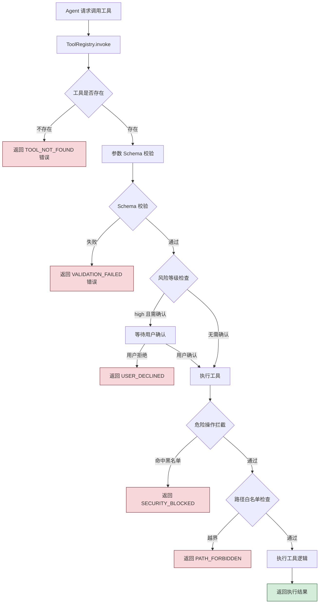
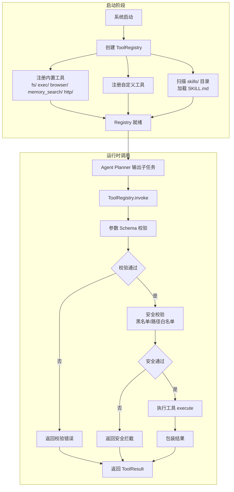
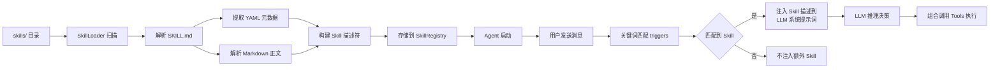
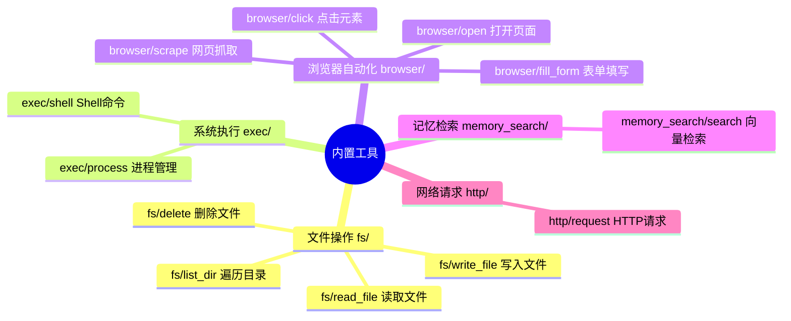

# MyOpenClaw Tools 工具与技能模块

> **版本**：v1.0.2  
> **修订日期**：2026-07-23  
> **修订人**：MyOpenClaw Core Team  
> **文档状态**：正式发布

---

> **实现状态（v1.0.3 更新）**：
> - ToolRegistry 完整实现（注册/查询/校验/调度/安全/超时全在）
> - **13 个内置工具全部为真实 delegate 实现**（fs/read_file 等 4 个、exec/shell+process、browser/open+click+fill_form+scrape、memory_search/search、http/request），文档之前描述的"5 个 stub"已过时
> - 工厂函数 `createToolRegistry()` 一次性装载 13 个工具（见 `server/src/tools/index.ts`）
> - SkillLoader 完整实现（YAML frontmatter 逐行解析 + Markdown body 提取）
> - SkillRegistry 完整实现（触发词匹配 + 优先级加权 + 自动注入 LLM 提示词）
>
> **重要使用提示**：
> - 早期版本的 `Orchestrator` 默认走 `MockToolRegistry` / `MockSkillRegistry`（位于 `server/src/agents/mock.ts`），导致真实 13 个工具完全没被使用
> - **生产环境必须使用 `await AgentRuntimeAdapter.create(opts)`**，它会异步装载真实 `ToolRegistry` + `SkillRegistry`
> - `mock.ts` 已标记 `@deprecated`，仅保留给单元测试和历史兼容回退

### 1.3 模块依赖图（生产 vs Mock）

```
生产环境（推荐）:
  AgentBridge.bind(AgentRuntimeAdapter.create())
        │
        ▼
  AgentRuntimeAdapter ──┬─► LLMAdapter (DeepSeek / OpenAI / ...)
                        ├─► ToolRegistry ← createToolRegistry() 装载 13 个真实工具
                        └─► SkillRegistry ← loadFromDirectory('skills/') 扫描 SKILL.md
                              │
                              ▼
                        AgentOrchestrator.run()
                              │
                              ├─► Planner (XML action tag 解析 — ADR 0001)
                              ├─► ToolRegistry.invoke() ──► SecurityManager (统一黑名单)
                              ├─► Memory (Session + Vector)
                              └─► HookPipeline

测试 / 单测 / 兜底:
  new AgentRuntimeAdapter()  (不传 orchestrator,走 Orchestrator 内部默认)
        │
        ▼
  AgentOrchestrator 默认注入 MockToolRegistry + MockSkillRegistry + MockMemory
                              │
                              ▼
                        Orchestrator.run() ──► MockToolRegistry.execute() 直接执行 Mock 行为
```

**关键不变量**：
- Planner.validate() 与 ToolRegistry.invoke() 复用同一份 `DEFAULT_BLOCKED_TOOLS` + `DEFAULT_DANGEROUS_PATTERNS`（从 `server/src/tools/security/index.ts` 单源导入）
- Orchestrator 自身 **不 import** 任何 Mock 类（仅 `mock.ts` 自身），靠 `OrchestratorOptions` 注入
- `createToolRegistry()` 在 `server/src/tools/index.ts`，是工厂的唯一入口

---

## 目录

- [1. 模块概述](#1-模块概述)
- [2. Tools 与 Skills 的区分](#2-tools-与-skills-的区分)
- [3. 工具注册中心 Registry](#3-工具注册中心-registry)
- [4. 内置工具详解](#4-内置工具详解)
  - [4.1 文件操作工具（fs/）](#41-文件操作工具fs)
  - [4.2 系统执行工具（exec/）](#42-系统执行工具exec)
  - [4.3 浏览器自动化工具（browser/）](#43-浏览器自动化工具browser)
  - [4.4 记忆检索工具（memory_search/）](#44-记忆检索工具memory_search)
  - [4.5 网络请求工具（http/）](#45-网络请求工具http)
- [5. Skills 业务技能](#5-skills-业务技能)
- [6. 自定义 Tool 开发指南](#6-自定义-tool-开发指南)
- [7. 自定义 Skill 编写指南](#7-自定义-skill-编写指南)
- [8. 安全校验机制](#8-安全校验机制)
- [9. 工具调用流程图](#9-工具调用流程图)

---

## 1. 模块概述

Tools/Skills 工具执行层是 MyOpenClaw 六层架构中的第五层，位于 Agent Runtime 之下、Memory 记忆层之上。它是 Agent 与外部世界交互的"手"——Agent 的所有实际操作（读写文件、执行命令、打开网页、检索记忆、调用 API）都通过这一层落地执行。

工具执行层区分两个核心概念：

- **Tool（底层工具）**：TypeScript 可执行代码，提供文件读写、Shell 执行、浏览器自动化、记忆检索、网络请求等原子能力。由 `ToolRegistry` 注册中心统一管理，供 LLM 直接调用。
- **Skill（业务技能）**：以 `SKILL.md` Markdown 文件定义的场景化能力描述，无需编写代码。描述业务能力、入参、使用场景，自动注入 LLM 系统提示词，引导 Agent 组合多个 Tool 完成复合业务任务。

### 1.1 模块定位

```
┌──────────────────────────────────────────────────┐
│  Agent Runtime 运行时   推理与任务规划             │
├──────────────────────────────────────────────────┤
│  Tools/Skills 工具层   <<< 本文档所述模块 >>>      │
│  ┌────────────────────────────────────────────┐  │
│  │ ToolRegistry   工具注册中心（统一管理入口）   │  │
│  │ ├─ fs/         文件操作工具                  │  │
│  │ ├─ exec/       系统执行工具                  │  │
│  │ ├─ browser/    浏览器自动化工具              │  │
│  │ ├─ memory_search/  记忆检索工具             │  │
│  │ ├─ http/        网络请求工具                  │  │
│  │ └─ custom/     用户自定义工具                │  │
│  │ SkillLoader   技能加载器（SKILL.md 解析）     │  │
│  └────────────────────────────────────────────┘  │
├──────────────────────────────────────────────────┤
│  Memory 记忆层          会话上下文与向量记忆        │
└──────────────────────────────────────────────────┘
```

### 1.2 设计原则

1. **原子化**：每个 Tool 只做一件事，复杂业务由 Skill 组合多个 Tool 完成
2. **统一管理**：所有 Tool 通过 ToolRegistry 注册，LLM 只通过注册中心调用
3. **安全可控**：工具调用须经参数 Schema 校验和危险操作拦截
4. **声明式扩展**：Skill 以 Markdown 描述，无需编写代码即可扩展 Agent 业务能力
5. **热插拔**：Tool 和 Skill 均支持运行时动态注册和卸载

---

## 2. Tools 与 Skills 的区分

Tools 和 Skills 是两个不同层次的概念，理解它们的区别对于正确使用和扩展 MyOpenClaw 至关重要。

### 2.1 概念对比

| 维度 | Tool（底层工具） | Skill（业务技能） |
|------|-----------------|-------------------|
| 本质 | TypeScript 可执行代码 | Markdown 描述文件 |
| 粒度 | 原子操作（单一动作） | 场景化能力（多步骤组合） |
| 实现方式 | 编写 TS 类，实现 Tool 接口 | 编写 SKILL.md 文件 |
| 执行方式 | 直接执行代码 | 引导 LLM 组合调用多个 Tool |
| 加载方式 | 通过 ToolRegistry 注册 | 放置在 skills/ 目录自动加载 |
| 示例 | `fs/read_file` 读取文件 | "代码审查"技能：读取文件+分析+输出报告 |
| 扩展门槛 | 需要 TypeScript 开发能力 | 仅需编写 Markdown 文档 |

### 2.2 协作关系

Skill 不直接执行任何操作，它只是给 LLM 提供"何时用、怎么用"的指引。实际执行能力由 Tools 层提供。

```
用户指令："帮我审查 code/review.ts 的代码质量"
          │
          ▼
    Agent 加载 Skills
          │
          │  匹配到"代码审查"Skill
          │  Skill 描述：先读取文件，再分析，最后输出报告
          ▼
    Agent 调用 Tools
          │
          ├─→ fs/read_file  读取 review.ts
          ├─→ llm/analyze    分析代码质量
          └─→ fs/write_file  写入审查报告
```

### 2.3 何时用 Tool，何时用 Skill

| 场景 | 选择 | 原因 |
|------|------|------|
| 新增一个原子操作（如数据库查询） | Tool | 需要可执行代码 |
| 新增一个业务流程（如"周报生成"） | Skill | 只需描述流程，组合已有 Tool |
| 修改 Agent 在特定场景的行为 | Skill | 无需改动代码 |
| 接入新的外部系统 API | Tool | 需要编写 API 调用代码 |
| 定义输出格式规范 | Skill | 通过 Markdown 描述即可 |

---

## 3. 工具注册中心 Registry

**源码位置**：`src/tools/registry.ts`

ToolRegistry 是工具执行层的统一管理入口。所有 Tool（内置和自定义）都必须注册到 Registry 后才能被 Agent 调用。Registry 负责工具的注册、注销、查询、路由和生命周期管理。

### 3.1 Registry 接口定义

```typescript
/**
 * 工具注册中心接口
 * 
 * 统一管理所有工具的注册、注销、查询和调用。
 * Agent 和 LLM 只能通过 Registry 调用工具，不能直接访问工具实例。
 */
export interface ToolRegistry {
  /**
   * 注册一个工具
   * 
   * 将工具实例注册到注册中心，注册后即可被 Agent 调用。
   * 如果同名工具已存在，默认抛出错误（可通过 options.force 覆盖）。
   * 
   * @param tool 工具实例
   * @param options 注册选项
   * @returns 注册成功返回 true
   */
  register(tool: Tool, options?: RegisterOptions): Promise<boolean>;

  /**
   * 注销一个工具
   * 
   * 从注册中心移除指定工具。注销后该工具不再可用。
   * 
   * @param name 工具名（如 fs/read_file）
   * @returns 注销成功返回 true，工具不存在返回 false
   */
  unregister(name: string): Promise<boolean>;

  /**
   * 查询工具是否存在
   * 
   * @param name 工具名
   * @returns 存在返回 true
   */
  has(name: string): boolean;

  /**
   * 获取工具实例
   * 
   * @param name 工具名
   * @returns 工具实例，不存在返回 undefined
   */
  get(name: string): Tool | undefined;

  /**
   * 获取工具描述符
   * 
   * 返回工具的元信息（名称、描述、参数 Schema），用于注入 LLM。
   * 
   * @param name 工具名
   * @returns 工具描述符
   */
  getDescriptor(name: string): ToolDescriptor | undefined;

  /**
   * 列出所有已注册工具
   * 
   * @param filter 可选的过滤条件（按命名空间、风险等级等）
   * @returns 工具描述符列表
   */
  list(filter?: ToolFilter): ToolDescriptor[];

  /**
   * 调用工具
   * 
   * 这是 Agent 调用工具的唯一入口。
   * 内部会执行参数校验、安全检查、调用执行、结果包装的完整流程。
   * 
   * @param name 工具名
   * @param params 调用参数
   * @param context 调用上下文（会话 ID、用户权限等）
   * @returns 工具执行结果
   */
  invoke(
    name: string,
    params: Record<string, unknown>,
    context: InvokeContext,
  ): Promise<ToolResult>;

  /**
   * 批量调用工具（并行）
   * 
   * 同时调用多个无依赖的工具，提升执行效率。
   * 
   * @param calls 工具调用列表
   * @param context 调用上下文
   * @returns 每个工具的执行结果（按调用顺序排列）
   */
  invokeBatch(
    calls: ToolCall[],
    context: InvokeContext,
  ): Promise<ToolResult[]>;

  /**
   * 注册状态变更监听器
   * 
   * @param listener 监听器函数
   * @returns 取消监听的函数
   */
  onChange(listener: (event: RegistryChangeEvent) => void): () => void;
}

/**
 * 注册选项
 */
export interface RegisterOptions {
  /** 是否覆盖同名工具（默认 false） */
  force?: boolean;
  /** 是否为内置工具（内置工具不可注销） */
  builtin?: boolean;
}

/**
 * 工具过滤条件
 */
export interface ToolFilter {
  /** 按命名空间过滤（如 fs、exec、browser） */
  namespace?: string;
  /** 按风险等级过滤 */
  risk?: 'low' | 'medium' | 'high';
  /** 是否只返回内置工具 */
  builtinOnly?: boolean;
}

/**
 * 注册中心变更事件
 */
export interface RegistryChangeEvent {
  /** 事件类型：注册 / 注销 */
  type: 'register' | 'unregister';
  /** 受影响的工具名 */
  toolName: string;
  /** 时间戳 */
  timestamp: number;
}

/**
 * 工具调用上下文
 */
export interface InvokeContext {
  /** 会话 ID */
  sessionId: string;
  /** 用户 ID */
  userId: string;
  /** 用户权限信息 */
  permissions: UserPermissions;
  /** 允许的工作目录列表（文件操作白名单） */
  allowedPaths: string[];
  /** 调用超时时间（毫秒） */
  timeoutMs?: number;
}

/**
 * 单次工具调用
 */
export interface ToolCall {
  /** 工具名 */
  name: string;
  /** 调用参数 */
  params: Record<string, unknown>;
}
```

### 3.2 Tool 接口定义

每个工具必须实现统一的 `Tool` 接口：

```typescript
/**
 * 工具统一接口
 * 
 * 所有工具（内置和自定义）都必须实现此接口。
 */
export interface Tool {
  /** 工具唯一名称（命名空间/动作，如 fs/read_file） */
  readonly name: string;

  /** 工具描述（供 LLM 理解工具用途） */
  readonly description: string;

  /** 参数 Schema（JSON Schema 格式，供校验和注入 LLM） */
  readonly parameters: JSONSchema;

  /** 风险等级：low（只读）/ medium（可逆写）/ high（不可逆写） */
  readonly risk: 'low' | 'medium' | 'high';

  /** 是否为内置工具 */
  readonly builtin: boolean;

  /**
   * 执行工具
   * 
   * @param params 经过校验的参数
   * @param context 调用上下文
   * @returns 执行结果
   */
  execute(
    params: Record<string, unknown>,
    context: InvokeContext,
  ): Promise<ToolResult>;
}

/**
 * 工具执行结果
 */
export interface ToolResult {
  /** 执行是否成功 */
  success: boolean;
  /** 输出数据（成功时） */
  data?: unknown;
  /** 错误信息（失败时） */
  error?: string;
  /** 错误码（失败时） */
  errorCode?: string;
  /** 执行元信息 */
  metadata?: {
    /** 执行耗时（毫秒） */
    durationMs: number;
    /** 产生副作用标记（如是否修改了文件系统） */
    sideEffects?: string[];
    /** 资源使用信息 */
    resources?: Record<string, unknown>;
  };
}

/**
 * JSON Schema 类型（简化定义）
 */
export type JSONSchema = {
  type: 'object';
  properties: Record<string, {
    type: string;
    description?: string;
    enum?: unknown[];
    default?: unknown;
    items?: JSONSchema;
    properties?: Record<string, unknown>;
    required?: string[];
  }>;
  required?: string[];
  additionalProperties?: boolean;
};
```

### 3.3 注册与查询示例

```typescript
/**
 * ToolRegistry 使用示例
 */
import { ToolRegistry } from '@/tools/registry';

// 创建注册中心实例
const registry = new ToolRegistry();

// 注册内置工具（系统启动时自动执行）
await registry.register(fsReadFileTool, { builtin: true });
await registry.register(fsWriteFileTool, { builtin: true });
await registry.register(execShellTool, { builtin: true });

// 查询工具是否存在
if (registry.has('fs/read_file')) {
  console.log('文件读取工具已注册');
}

// 获取工具描述符（用于注入 LLM）
const descriptor = registry.getDescriptor('fs/read_file');
console.log('工具描述:', descriptor?.description);
console.log('参数 Schema:', descriptor?.parameters);

// 列出所有文件操作工具
const fsTools = registry.list({ namespace: 'fs' });
console.log(`文件操作工具共 ${fsTools.length} 个`);

// 调用工具
const result = await registry.invoke(
  'fs/read_file',
  { path: '/tmp/config.json', encoding: 'utf-8' },
  {
    sessionId: 'session-001',
    userId: 'user-001',
    permissions: { admin: false },
    allowedPaths: ['/tmp', '~/Documents'],
  },
);

if (result.success) {
  console.log('文件内容:', result.data);
} else {
  console.error('读取失败:', result.error);
}

// 批量并行调用
const batchResults = await registry.invokeBatch([
  { name: 'fs/read_file', params: { path: '/tmp/a.txt' } },
  { name: 'fs/read_file', params: { path: '/tmp/b.txt' } },
  { name: 'fs/read_file', params: { path: '/tmp/c.txt' } },
], context);

// 注销自定义工具
await registry.unregister('custom/my_tool');
```

---

## 4. 内置工具详解

MyOpenClaw 内置五类工具，覆盖文件操作、系统执行、浏览器自动化、记忆检索和网络请求五大领域。所有内置工具注册时标记为 `builtin: true`，不可被注销。

### 4.1 文件操作工具（fs/）

文件操作工具提供本地文件系统的读写、创建、删除、遍历能力。所有文件操作受路径白名单约束。

#### 4.1.1 fs/read_file 读取文件

```typescript
/**
 * 文件读取工具
 * 
 * 读取本地文件内容，支持指定编码。
 */
export const fsReadFileTool: Tool = {
  name: 'fs/read_file',
  description: '读取本地文件内容。支持文本和二进制文件，可指定编码格式。',
  risk: 'low',  // 只读操作，风险低
  builtin: true,
  parameters: {
    type: 'object',
    properties: {
      path: {
        type: 'string',
        description: '文件绝对路径',
      },
      encoding: {
        type: 'string',
        description: '文件编码，默认 utf-8。二进制文件使用 base64',
        enum: ['utf-8', 'base64', 'hex', 'ascii'],
        default: 'utf-8',
      },
      maxSize: {
        type: 'number',
        description: '最大读取字节数，默认 10MB。超过则截断',
        default: 10485760,
      },
    },
    required: ['path'],
  },

  async execute(params, context) {
    const { path, encoding = 'utf-8', maxSize = 10485760 } = params;
    // 执行文件读取（实际实现包含路径白名单校验）
    const content = await readFile(path, { encoding, maxSize });
    return {
      success: true,
      data: content,
      metadata: {
        durationMs: 12,
        sideEffects: [],
        resources: { size: Buffer.byteLength(content) },
      },
    };
  },
};
```

**调用示例**：

```typescript
// 读取文本文件
const result = await registry.invoke('fs/read_file', {
  path: '/home/user/Documents/report.md',
  encoding: 'utf-8',
}, context);

// 读取二进制文件（如图片）
const imageResult = await registry.invoke('fs/read_file', {
  path: '/home/user/Pictures/photo.jpg',
  encoding: 'base64',
}, context);
```

#### 4.1.2 fs/write_file 写入文件

```typescript
/**
 * 文件写入工具
 * 
 * 将内容写入本地文件，支持新建和覆盖。
 */
export const fsWriteFileTool: Tool = {
  name: 'fs/write_file',
  description: '将内容写入本地文件。文件不存在时自动创建，存在时默认覆盖。',
  risk: 'medium',  // 可逆写操作（可通过备份恢复）
  builtin: true,
  parameters: {
    type: 'object',
    properties: {
      path: {
        type: 'string',
        description: '文件绝对路径',
      },
      content: {
        type: 'string',
        description: '文件内容',
      },
      encoding: {
        type: 'string',
        description: '内容编码，默认 utf-8',
        default: 'utf-8',
      },
      append: {
        type: 'boolean',
        description: '是否追加模式（false 为覆盖，true 为追加）',
        default: false,
      },
      createDirs: {
        type: 'boolean',
        description: '是否自动创建不存在的父目录',
        default: true,
      },
    },
    required: ['path', 'content'],
  },

  async execute(params, context) {
    // 实际实现包含路径白名单校验和写入操作
    return { success: true, data: { path: params.path, bytesWritten: 0 } };
  },
};
```

#### 4.1.3 fs/delete 删除文件

```typescript
/**
 * 文件删除工具
 * 
 * 删除文件或目录。删除目录时递归删除其下所有内容。
 */
export const fsDeleteTool: Tool = {
  name: 'fs/delete',
  description: '删除文件或目录。删除目录时递归删除其下所有内容。此操作不可逆。',
  risk: 'high',  // 不可逆操作，风险高
  builtin: true,
  parameters: {
    type: 'object',
    properties: {
      path: {
        type: 'string',
        description: '要删除的文件或目录绝对路径',
      },
      recursive: {
        type: 'boolean',
        description: '是否递归删除目录（删除目录时必须为 true）',
        default: false,
      },
      moveToTrash: {
        type: 'boolean',
        description: '是否移动到回收站而非直接删除（推荐 true）',
        default: true,
      },
    },
    required: ['path'],
  },

  async execute(params, context) {
    // 实际实现包含路径白名单校验和删除操作
    return { success: true, data: { deleted: params.path } };
  },
};
```

#### 4.1.4 fs/list_dir 遍历目录

```typescript
/**
 * 目录遍历工具
 * 
 * 列出指定目录下的文件和子目录。
 */
export const fsListDirTool: Tool = {
  name: 'fs/list_dir',
  description: '列出指定目录下的文件和子目录，支持递归遍历和模式过滤。',
  risk: 'low',
  builtin: true,
  parameters: {
    type: 'object',
    properties: {
      path: {
        type: 'string',
        description: '目录绝对路径',
      },
      recursive: {
        type: 'boolean',
        description: '是否递归遍历子目录',
        default: false,
      },
      pattern: {
        type: 'string',
        description: '文件名过滤模式（glob 语法，如 *.md）',
      },
      includeHidden: {
        type: 'boolean',
        description: '是否包含隐藏文件（以 . 开头的文件）',
        default: false,
      },
    },
    required: ['path'],
  },

  async execute(params, context) {
    // 实际实现包含目录遍历逻辑
    const entries = [
      { name: 'report.md', type: 'file', size: 1024 },
      { name: 'images', type: 'directory', size: 0 },
    ];
    return { success: true, data: entries };
  },
};
```

**目录遍历调用示例**：

```typescript
// 递归列出所有 Markdown 文件
const result = await registry.invoke('fs/list_dir', {
  path: '/home/user/Documents',
  recursive: true,
  pattern: '*.md',
}, context);

// 结果示例
// {
//   success: true,
//   data: [
//     { name: 'report.md', type: 'file', size: 1024, path: '/home/user/Documents/report.md' },
//     { name: 'notes.md', type: 'file', size: 512, path: '/home/user/Documents/notes.md' }
//   ]
// }
```

### 4.2 系统执行工具（exec/）

系统执行工具提供 Shell 命令执行和进程管理能力。

#### 4.2.1 exec/shell Shell 命令执行

```typescript
/**
 * Shell 命令执行工具
 * 
 * 在系统 Shell 中执行命令，支持超时控制和环境变量。
 */
export const execShellTool: Tool = {
  name: 'exec/shell',
  description: '在系统 Shell 中执行命令。支持超时控制、环境变量设置、工作目录指定。',
  risk: 'high',  // 命令执行风险高，受黑名单限制
  builtin: true,
  parameters: {
    type: 'object',
    properties: {
      command: {
        type: 'string',
        description: '要执行的 Shell 命令',
      },
      cwd: {
        type: 'string',
        description: '工作目录（默认用户主目录）',
      },
      timeout: {
        type: 'number',
        description: '超时时间（毫秒），默认 30000',
        default: 30000,
      },
      env: {
        type: 'object',
        description: '环境变量键值对',
        additionalProperties: { type: 'string' },
      },
      shell: {
        type: 'string',
        description: '使用的 Shell（默认 /bin/bash）',
        default: '/bin/bash',
      },
    },
    required: ['command'],
  },

  async execute(params, context) {
    const { command, cwd, timeout = 30000, env, shell = '/bin/bash' } = params;
    
    // 安全校验：检查命令是否在黑名单中
    const blockedPatterns = ['rm -rf /', 'sudo', 'chmod 777', 'dd if='];
    for (const pattern of blockedPatterns) {
      if (command.includes(pattern)) {
        return {
          success: false,
          error: `命令被安全策略拦截：包含禁止的模式 "${pattern}"`,
          errorCode: 'SECURITY_BLOCKED',
        };
      }
    }

    // 执行命令
    const result = await execCommand(command, { cwd, timeout, env, shell });
    
    return {
      success: result.exitCode === 0,
      data: {
        stdout: result.stdout,
        stderr: result.stderr,
        exitCode: result.exitCode,
      },
      error: result.exitCode !== 0 ? `命令执行失败，退出码 ${result.exitCode}` : undefined,
      metadata: {
        durationMs: result.durationMs,
        sideEffects: ['process_execution'],
      },
    };
  },
};
```

**Shell 执行调用示例**：

```typescript
// 执行 Git 命令查看状态
const result = await registry.invoke('exec/shell', {
  command: 'git status --short',
  cwd: '/home/user/project',
  timeout: 10000,
}, context);

// 执行 Python 脚本
const scriptResult = await registry.invoke('exec/shell', {
  command: 'python3 script.py --input data.csv',
  cwd: '/home/user/project',
  env: { PYTHONPATH: '/home/user/project/lib' },
  timeout: 60000,
}, context);
```

#### 4.2.2 exec/process 进程管理

```typescript
/**
 * 进程管理工具
 * 
 * 列出、查询和终止系统进程。
 */
export const execProcessTool: Tool = {
  name: 'exec/process',
  description: '管理系统进程：列出运行中进程、查询进程详情、终止指定进程。',
  risk: 'medium',
  builtin: true,
  parameters: {
    type: 'object',
    properties: {
      action: {
        type: 'string',
        description: '操作类型',
        enum: ['list', 'info', 'kill'],
      },
      pid: {
        type: 'number',
        description: '进程 ID（action 为 info 或 kill 时必填）',
      },
      signal: {
        type: 'string',
        description: '发送的信号（action 为 kill 时使用，默认 SIGTERM）',
        default: 'SIGTERM',
      },
      filter: {
        type: 'string',
        description: '进程名过滤（action 为 list 时使用）',
      },
    },
    required: ['action'],
  },

  async execute(params, context) {
    const { action, pid, signal, filter } = params;
    
    switch (action) {
      case 'list':
        // 列出进程
        return { success: true, data: await listProcesses(filter) };
      case 'info':
        // 查询进程详情
        return { success: true, data: await getProcessInfo(pid) };
      case 'kill':
        // 终止进程
        await killProcess(pid, signal);
        return { success: true, data: { killed: pid } };
    }
  },
};
```

### 4.3 浏览器自动化工具（browser/）

浏览器自动化工具基于 Playwright/Puppeteer 实现，提供网页打开、点击、表单填写、内容抓取等能力。

#### 4.3.1 browser/open 打开页面

```typescript
/**
 * 浏览器页面打开工具
 * 
 * 在无头浏览器中打开指定 URL，返回页面快照。
 */
export const browserOpenTool: Tool = {
  name: 'browser/open',
  description: '在无头浏览器中打开指定 URL，返回页面标题、URL 和文本内容快照。',
  risk: 'low',
  builtin: true,
  parameters: {
    type: 'object',
    properties: {
      url: {
        type: 'string',
        description: '要打开的页面 URL',
      },
      waitUntil: {
        type: 'string',
        description: '等待条件',
        enum: ['load', 'domcontentloaded', 'networkidle'],
        default: 'load',
      },
      timeout: {
        type: 'number',
        description: '页面加载超时（毫秒），默认 30000',
        default: 30000,
      },
      viewport: {
        type: 'object',
        description: '视口大小',
        properties: {
          width: { type: 'number', default: 1280 },
          height: { type: 'number', default: 720 },
        },
      },
    },
    required: ['url'],
  },

  async execute(params, context) {
    const { url, waitUntil = 'load', timeout = 30000, viewport } = params;
    
    // 启动浏览器并打开页面
    const page = await browser.newPage({ viewport });
    await page.goto(url, { waitUntil, timeout });
    
    // 提取页面信息
    const title = await page.title();
    const finalUrl = page.url();
    const textContent = await page.innerText('body');
    
    return {
      success: true,
      data: {
        title,
        url: finalUrl,
        textContent: textContent.substring(0, 50000),  // 限制长度
      },
      metadata: {
        durationMs: 0,
        resources: { viewport },
      },
    };
  },
};
```

#### 4.3.2 browser/click 点击元素

```typescript
/**
 * 浏览器元素点击工具
 */
export const browserClickTool: Tool = {
  name: 'browser/click',
  description: '在当前浏览器页面中点击指定元素。支持 CSS 选择器和 XPath 定位。',
  risk: 'low',
  builtin: true,
  parameters: {
    type: 'object',
    properties: {
      selector: {
        type: 'string',
        description: '元素选择器（CSS 或 XPath）',
      },
      selectorType: {
        type: 'string',
        description: '选择器类型',
        enum: ['css', 'xpath'],
        default: 'css',
      },
      waitTimeout: {
        type: 'number',
        description: '等待元素出现的超时（毫秒）',
        default: 5000,
      },
      button: {
        type: 'string',
        description: '点击的鼠标按钮',
        enum: ['left', 'right', 'middle'],
        default: 'left',
      },
    },
    required: ['selector'],
  },

  async execute(params, context) {
    // 实现点击逻辑
    return { success: true, data: { clicked: params.selector } };
  },
};
```

#### 4.3.3 browser/fill_form 表单填写

```typescript
/**
 * 浏览器表单填写工具
 */
export const browserFillFormTool: Tool = {
  name: 'browser/fill_form',
  description: '在当前页面的表单中填写数据。支持批量填充多个字段。',
  risk: 'medium',
  builtin: true,
  parameters: {
    type: 'object',
    properties: {
      fields: {
        type: 'array',
        description: '要填写的表单字段列表',
        items: {
          type: 'object',
          properties: {
            selector: { type: 'string', description: '字段选择器' },
            value: { type: 'string', description: '填写的值' },
            type: {
              type: 'string',
              description: '输入类型',
              enum: ['text', 'select', 'checkbox', 'radio', 'file'],
              default: 'text',
            },
          },
          required: ['selector', 'value'],
        },
      },
      submitSelector: {
        type: 'string',
        description: '提交按钮的选择器（不填则不自动提交）',
      },
    },
    required: ['fields'],
  },

  async execute(params, context) {
    const { fields, submitSelector } = params;
    
    // 逐个填写表单字段
    for (const field of fields) {
      await page.fill(field.selector, field.value);
    }
    
    // 如果指定了提交按钮，自动点击提交
    if (submitSelector) {
      await page.click(submitSelector);
      await page.waitForLoadState('networkidle');
    }
    
    return {
      success: true,
      data: { filledFields: fields.length, submitted: !!submitSelector },
    };
  },
};
```

#### 4.3.4 browser/scrape 网页抓取

```typescript
/**
 * 网页内容抓取工具
 * 
 * 从当前页面提取结构化内容，支持 CSS 选择器提取和全文提取。
 */
export const browserScrapeTool: Tool = {
  name: 'browser/scrape',
  description: '从网页中提取内容。支持按 CSS 选择器提取特定元素，或提取全文内容。',
  risk: 'low',
  builtin: true,
  parameters: {
    type: 'object',
    properties: {
      url: {
        type: 'string',
        description: '要抓取的 URL（若已在 browser/open 中打开则可省略）',
      },
      selectors: {
        type: 'array',
        description: '要提取的元素选择器列表（不填则提取全文）',
        items: {
          type: 'object',
          properties: {
            name: { type: 'string', description: '字段名' },
            selector: { type: 'string', description: 'CSS 选择器' },
            attribute: {
              type: 'string',
              description: '要提取的属性（不填则提取文本内容）',
            },
          },
          required: ['name', 'selector'],
        },
      },
      format: {
        type: 'string',
        description: '输出格式',
        enum: ['text', 'html', 'markdown'],
        default: 'text',
      },
      maxItems: {
        type: 'number',
        description: '最大提取条目数（针对列表类选择器）',
        default: 100,
      },
    },
  },

  async execute(params, context) {
    const { url, selectors, format = 'text', maxItems = 100 } = params;
    
    // 如果指定了 URL，先打开页面
    if (url) {
      await page.goto(url, { waitUntil: 'load' });
    }
    
    // 按选择器提取内容
    if (selectors && selectors.length > 0) {
      const results = {};
      for (const sel of selectors) {
        const elements = await page.$$(sel.selector);
        const values = [];
        for (let i = 0; i < Math.min(elements.length, maxItems); i++) {
          if (sel.attribute) {
            values.push(await elements[i].getAttribute(sel.attribute));
          } else {
            values.push(await elements[i].innerText());
          }
        }
        results[sel.name] = values;
      }
      return { success: true, data: results };
    }
    
    // 提取全文
    const content = await page.innerText('body');
    return { success: true, data: { content } };
  },
};
```

### 4.4 记忆检索工具（memory_search/）

记忆检索工具封装 Memory 层的向量检索能力，作为内置 Tool 提供给 Agent 调用。

```typescript
/**
 * 记忆检索工具
 * 
 * 从长期向量记忆中检索与查询语义相关的历史记忆。
 */
export const memorySearchTool: Tool = {
  name: 'memory_search/search',
  description: '从长期向量记忆中检索与查询语句语义相关的历史对话和记忆。用于回忆之前的对话内容或历史任务。',
  risk: 'low',
  builtin: true,
  parameters: {
    type: 'object',
    properties: {
      query: {
        type: 'string',
        description: '检索查询语句（自然语言）',
      },
      topK: {
        type: 'number',
        description: '返回最相关的 K 条记忆，默认 5',
        default: 5,
      },
      sessionId: {
        type: 'string',
        description: '限定在指定会话范围内检索（不填则全局检索）',
      },
      threshold: {
        type: 'number',
        description: '相似度阈值（0-1），低于此值的记忆不返回',
        default: 0.5,
      },
      timeRange: {
        type: 'object',
        description: '时间范围过滤',
        properties: {
          start: { type: 'string', description: '起始时间（ISO 8601）' },
          end: { type: 'string', description: '结束时间（ISO 8601）' },
        },
      },
    },
    required: ['query'],
  },

  async execute(params, context) {
    const { query, topK = 5, sessionId, threshold = 0.5, timeRange } = params;
    
    // 调用 Memory 层的向量检索
    const memories = await vectorStore.search({
      query,
      topK,
      sessionId,
      threshold,
      timeRange,
    });
    
    return {
      success: true,
      data: memories.map(m => ({
        id: m.id,
        content: m.content,
        score: m.score,
        timestamp: m.timestamp,
        sessionId: m.sessionId,
      })),
      metadata: {
        durationMs: 0,
        resources: { count: memories.length },
      },
    };
  },
};
```

**记忆检索调用示例**：

```typescript
// 检索与"数据库配置"相关的历史记忆
const result = await registry.invoke('memory_search/search', {
  query: '数据库连接配置',
  topK: 5,
  threshold: 0.6,
}, context);

// 结果示例
// {
//   success: true,
//   data: [
//     {
//       id: "mem-001",
//       content: "用户之前配置了 PostgreSQL 数据库，连接地址是 localhost:5432",
//       score: 0.89,
//       timestamp: "2026-07-20T10:30:00Z",
//       sessionId: "session-001"
//     }
//   ]
// }
```

### 4.5 网络请求工具（http/）

网络请求工具提供 HTTP API 调用能力，支持 GET、POST、PUT、DELETE 等方法。

```typescript
/**
 * HTTP 请求工具
 * 
 * 发起 HTTP/HTTPS 请求，支持所有 HTTP 方法和自定义头。
 */
export const httpRequestTool: Tool = {
  name: 'http/request',
  description: '发起 HTTP 请求。支持 GET/POST/PUT/DELETE/PATCH 方法，可设置请求头、请求体、超时。',
  risk: 'medium',
  builtin: true,
  parameters: {
    type: 'object',
    properties: {
      url: {
        type: 'string',
        description: '请求 URL',
      },
      method: {
        type: 'string',
        description: 'HTTP 方法',
        enum: ['GET', 'POST', 'PUT', 'DELETE', 'PATCH', 'HEAD'],
        default: 'GET',
      },
      headers: {
        type: 'object',
        description: '请求头键值对',
        additionalProperties: { type: 'string' },
      },
      body: {
        type: 'string',
        description: '请求体内容（JSON 字符串或纯文本）',
      },
      contentType: {
        type: 'string',
        description: '内容类型',
        enum: ['application/json', 'application/x-www-form-urlencoded', 'text/plain', 'multipart/form-data'],
        default: 'application/json',
      },
      timeout: {
        type: 'number',
        description: '请求超时（毫秒），默认 30000',
        default: 30000,
      },
      followRedirects: {
        type: 'boolean',
        description: '是否跟随重定向',
        default: true,
      },
      maxRedirects: {
        type: 'number',
        description: '最大重定向次数',
        default: 5,
      },
    },
    required: ['url'],
  },

  async execute(params, context) {
    const {
      url,
      method = 'GET',
      headers = {},
      body,
      contentType = 'application/json',
      timeout = 30000,
      followRedirects = true,
      maxRedirects = 5,
    } = params;
    
    // 安全校验：检查 URL 是否在允许列表中
    // （实际实现中可配置 URL 白名单）
    
    // 发起 HTTP 请求
    const response = await fetch(url, {
      method,
      headers: { 'Content-Type': contentType, ...headers },
      body: method !== 'GET' && method !== 'HEAD' ? body : undefined,
      redirect: followRedirects ? 'follow' : 'manual',
      signal: AbortSignal.timeout(timeout),
    });
    
    const responseText = await response.text();
    
    return {
      success: response.ok,
      data: {
        status: response.status,
        statusText: response.statusText,
        headers: Object.fromEntries(response.headers.entries()),
        body: responseText,
      },
      error: !response.ok ? `HTTP ${response.status}: ${response.statusText}` : undefined,
      metadata: {
        durationMs: 0,
        resources: { responseSize: responseText.length },
      },
    };
  },
};
```

**HTTP 请求调用示例**：

```typescript
// GET 请求
const getResult = await registry.invoke('http/request', {
  url: 'https://api.example.com/users',
  method: 'GET',
  headers: { 'Authorization': 'Bearer token-xxx' },
}, context);

// POST 请求（提交 JSON）
const postResult = await registry.invoke('http/request', {
  url: 'https://api.example.com/users',
  method: 'POST',
  body: JSON.stringify({ name: '张三', email: 'zhangsan@example.com' }),
  contentType: 'application/json',
  headers: { 'Authorization': 'Bearer token-xxx' },
}, context);
```

---

## 5. Skills 业务技能

Skills 是 MyOpenClaw 独创的声明式能力扩展机制。通过编写 Markdown 描述文件（SKILL.md），无需编写任何代码即可扩展 Agent 的业务能力。

实际代码中的类型定义（`skills/types.ts`）：

```typescript
/** 技能元数据 */
export interface SkillMeta {
  readonly name: string;
  readonly description: string;
  readonly version: string;
  readonly requires: string[];
}

/** 技能实例 */
export interface Skill {
  readonly meta: SkillMeta;
  readonly content: string;
  readonly filePath: string;
}
```

SkillLoader（`skills/loader.ts`）负责从文件系统加载 SKILL.md 文件，SkillRegistry（`skills/registry.ts`）管理已注册技能。当前已实现基础文件读取和注册管理功能。

### 5.1 SKILL.md 格式定义

每个 Skill 对应一个 `SKILL.md` 文件，放置在 `skills/` 目录下。文件结构如下：

```markdown
---
# YAML Front Matter（元数据）
name: code-review                    # 技能名称（唯一标识）
description: 代码审查技能              # 技能简述
version: 1.0.0                       # 技能版本
author: MyOpenClaw Team                # 作者
triggers:                            # 触发条件（关键词匹配）
  - 代码审查
  - code review
  - 审查代码
tools:                               # 此技能需要用到的工具
  - fs/read_file
  - fs/list_dir
  - exec/shell
priority: normal                     # 优先级：low/normal/high
---

# 代码审查技能

## 技能描述
当用户请求审查代码时，使用此技能。技能会读取指定文件或目录的代码，
分析代码质量、安全性和可维护性，最后输出结构化的审查报告。

## 使用场景
- 用户要求审查某个文件的代码
- 用户要求审查某个目录下的所有代码
- 用户要求检查代码的安全漏洞

## 执行步骤
1. 使用 fs/list_dir 列出要审查的文件（如果是目录）
2. 使用 fs/read_file 逐个读取代码文件
3. 分析每个文件的代码质量
4. 汇总发现的问题，按严重程度分类
5. 输出审查报告

## 输出格式
审查报告应包含以下部分：
- 总体评价
- 严重问题（critical）
- 警告（warning）
- 建议（info）
- 改进后的代码片段

## 注意事项
- 不要修改原始代码文件
- 审查范围限于用户指定的文件
- 对每个问题给出具体的文件名和行号
```

### 5.2 自动注入 LLM 提示词机制

Skill 文件在 Agent 启动时自动加载，其内容会被注入到 LLM 的系统提示词中。注入流程如下：

```
1. 启动时扫描 skills/ 目录
   │
   ▼
2. 解析每个 SKILL.md 文件
   │  ├─ 解析 YAML Front Matter（元数据）
   │  └─ 解析 Markdown 正文（描述和步骤）
   ▼
3. 按触发条件匹配，筛选相关 Skill
   │  （根据用户指令中的关键词匹配 triggers）
   ▼
4. 将匹配的 Skill 描述注入系统提示词
   │  格式："可用技能：\n- 代码审查：当用户请求审查代码时..."
   ▼
5. LLM 根据注入的技能描述决定如何组合工具
```

**注入后的系统提示词示例**：

```
你是 MyOpenClaw 智能助手。以下是你可以使用的技能：

## 可用技能

### 代码审查（code-review）
描述：当用户请求审查代码时，使用此技能...
执行步骤：
1. 使用 fs/list_dir 列出要审查的文件
2. 使用 fs/read_file 逐个读取代码文件
3. 分析每个文件的代码质量
4. 汇总发现的问题
5. 输出审查报告

### 周报生成（weekly-report）
描述：每周五自动生成本周工作总结...
执行步骤：
1. 使用 memory_search/search 检索本周对话
2. 使用 fs/read_file 读取本周修改的文件
3. 汇总工作内容
4. 使用 fs/write_file 写入周报文件

## 可用工具
- fs/read_file: 读取本地文件内容
- fs/write_file: 写入本地文件
- fs/list_dir: 列出目录内容
- exec/shell: 执行 Shell 命令
- memory_search/search: 检索历史记忆
- http/request: 发起 HTTP 请求
```

### 5.3 示例 Skill 文件

以下是几个常用的 Skill 文件示例。

#### 5.3.1 周报生成技能

```markdown
---
name: weekly-report
description: 每周工作总结自动生成
version: 1.0.0
author: MyOpenClaw Team
triggers:
  - 周报
  - 工作总结
  - weekly report
tools:
  - memory_search/search
  - fs/read_file
  - fs/write_file
  - fs/list_dir
priority: normal
---

# 周报生成技能

## 技能描述
根据本周的对话记录和文件操作历史，自动生成结构化的周报。

## 执行步骤
1. 使用 memory_search/search 检索本周的所有对话记忆
   - query: "本周工作"
   - timeRange: { start: 本周一, end: 今天 }
   - topK: 20
2. 使用 fs/list_dir 列出本周修改过的文件
3. 将检索到的记忆和文件列表汇总
4. 按以下结构组织周报内容：
   - 本周完成任务
   - 进行中的工作
   - 遇到的问题
   - 下周计划
5. 使用 fs/write_file 将周报保存到 ~/Documents/weekly-report-{日期}.md

## 输出格式
Markdown 格式周报，包含日期范围、任务列表、问题总结。
```

#### 5.3.2 数据库查询技能

```markdown
---
name: db-query
description: 自然语言数据库查询
version: 1.0.0
author: MyOpenClaw Team
triggers:
  - 查询数据库
  - 数据库
  - SQL
  - database query
tools:
  - exec/shell
  - http/request
priority: high
---

# 数据库查询技能

## 技能描述
将用户的自然语言查询需求转换为 SQL 语句并执行，返回查询结果。

## 安全约束
- 只允许 SELECT 查询，禁止 INSERT/UPDATE/DELETE/DROP
- 查询结果最多返回 1000 条记录
- 敏感字段（密码、密钥）自动脱敏

## 执行步骤
1. 理解用户的查询意图
2. 根据数据库 Schema 生成 SQL 语句
3. 使用 exec/shell 执行 SQL 查询
   - 命令格式：psql -c "SELECT ..."
4. 格式化查询结果
5. 返回结果给用户

## 注意事项
- 生成的 SQL 必须经过安全校验
- 查询超时设置为 30 秒
- 大结果集自动分页
```

### 5.4 Skill 目录结构

```
skills/
├── code-review/
│   └── SKILL.md              # 代码审查技能
├── weekly-report/
│   └── SKILL.md              # 周报生成技能
├── db-query/
│   └── SKILL.md              # 数据库查询技能
├── file-organizer/
│   └── SKILL.md              # 文件整理技能
├── web-research/
│   └── SKILL.md              # 网页调研技能
└── email-draft/
    └── SKILL.md              # 邮件起草技能
```

每个 Skill 独立一个目录，目录名即技能名。Agent 启动时自动扫描 `skills/` 目录下的所有 `SKILL.md` 文件并加载。

---

## 6. 自定义 Tool 开发指南

### 6.1 完整的自定义 Tool 实现示例

以下示例展示如何开发一个完整的自定义工具——数据库查询工具：

```typescript
/**
 * 自定义 Tool 完整实现示例：数据库查询工具
 * 
 * 演示如何从零开始开发一个 Tool，包括：
 * - 实现 Tool 接口
 * - 定义参数 Schema
 * - 实现执行逻辑
 * - 注册到 ToolRegistry
 */

import type { Tool, ToolResult, InvokeContext, JSONSchema } from '@/tools/registry';

/**
 * 数据库查询工具
 * 
 * 连接 PostgreSQL 数据库，执行 SQL 查询并返回结果。
 */
export class DatabaseQueryTool implements Tool {
  // 工具唯一名称（命名空间/动作格式）
  readonly name = 'db/query';

  // 工具描述（供 LLM 理解工具用途，需清晰准确）
  readonly description = '执行 SQL 查询并返回结果。仅支持 SELECT 查询，自动限制返回行数。';

  // 风险等级：low（只读）/ medium（可逆写）/ high（不可逆写）
  readonly risk = 'low' as const;

  // 是否为内置工具（自定义工具设为 false）
  readonly builtin = false;

  // 参数 Schema（JSON Schema 格式，供校验和注入 LLM）
  readonly parameters: JSONSchema = {
    type: 'object',
    properties: {
      sql: {
        type: 'string',
        description: 'SQL 查询语句（仅支持 SELECT）',
      },
      database: {
        type: 'string',
        description: '数据库名称（不填使用默认数据库）',
      },
      limit: {
        type: 'number',
        description: '返回最大行数，默认 100',
        default: 100,
      },
      format: {
        type: 'string',
        description: '结果格式',
        enum: ['json', 'table', 'csv'],
        default: 'json',
      },
    },
    required: ['sql'],
  };

  // 数据库连接池（在构造函数中初始化）
  private pool: DatabasePool;

  /**
   * 构造函数
   * 
   * @param config 数据库连接配置
   */
  constructor(config: DatabaseConfig) {
    this.pool = createPool(config);
  }

  /**
   * 执行工具
   * 
   * @param params 经过校验的参数
   * @param context 调用上下文
   * @returns 查询结果
   */
  async execute(
    params: Record<string, unknown>,
    context: InvokeContext,
  ): Promise<ToolResult> {
    const startTime = Date.now();
    const { sql, database, limit = 100, format = 'json' } = params as QueryParams;

    try {
      // 安全校验：只允许 SELECT 查询
      if (!this.isSelectQuery(sql)) {
        return {
          success: false,
          error: '仅支持 SELECT 查询，禁止执行写入或修改操作',
          errorCode: 'SECURITY_BLOCKED',
        };
      }

      // 安全校验：检查是否包含危险关键词
      const dangerousKeywords = ['DROP', 'TRUNCATE', 'DELETE', 'UPDATE', 'INSERT', 'ALTER'];
      const upperSql = sql.toUpperCase();
      for (const keyword of dangerousKeywords) {
        if (upperSql.includes(keyword)) {
          return {
            success: false,
            error: `SQL 包含禁止的关键词：${keyword}`,
            errorCode: 'SECURITY_BLOCKED',
          };
        }
      }

      // 添加 LIMIT 子句（如果用户未指定）
      const finalSql = upperSql.includes('LIMIT') 
        ? sql 
        : `${sql} LIMIT ${limit}`;

      // 执行查询
      const client = await this.pool.connect();
      try {
        const result = await client.query(finalSql);
        
        // 格式化结果
        const formatted = this.formatResult(result.rows, format);

        return {
          success: true,
          data: {
            rows: formatted,
            rowCount: result.rowCount,
            columns: result.fields.map(f => f.name),
          },
          metadata: {
            durationMs: Date.now() - startTime,
            resources: { rowCount: result.rowCount },
          },
        };
      } finally {
        client.release();
      }
    } catch (error) {
      return {
        success: false,
        error: `数据库查询失败：${error instanceof Error ? error.message : String(error)}`,
        errorCode: 'DB_QUERY_ERROR',
        metadata: {
          durationMs: Date.now() - startTime,
        },
      };
    }
  }

  /**
   * 检查是否为 SELECT 查询
   */
  private isSelectQuery(sql: string): boolean {
    const trimmed = sql.trim().toUpperCase();
    return trimmed.startsWith('SELECT') || trimmed.startsWith('WITH');
  }

  /**
   * 格式化查询结果
   */
  private formatResult(rows: unknown[], format: string): unknown {
    switch (format) {
      case 'json':
        return rows;
      case 'csv':
        return this.toCSV(rows);
      case 'table':
        return this.toTable(rows);
      default:
        return rows;
    }
  }

  private toCSV(rows: unknown[]): string {
    // CSV 格式转换实现
    return '';
  }

  private toTable(rows: unknown[]): string {
    // 表格格式转换实现
    return '';
  }
}

/**
 * 数据库配置接口
 */
interface DatabaseConfig {
  host: string;
  port: number;
  database: string;
  user: string;
  password: string;
  maxConnections?: number;
}

/**
 * 查询参数
 */
interface QueryParams {
  sql: string;
  database?: string;
  limit?: number;
  format?: 'json' | 'table' | 'csv';
}
```

### 6.2 注册自定义 Tool

```typescript
/**
 * 自定义 Tool 注册示例
 */
import { ToolRegistry } from '@/tools/registry';
import { DatabaseQueryTool } from './tools/db-query';

// 创建注册中心
const registry = new ToolRegistry();

// 创建数据库查询工具实例
const dbTool = new DatabaseQueryTool({
  host: 'localhost',
  port: 5432,
  database: 'myopenclaw',
  user: process.env.DB_USER!,
  password: process.env.DB_PASSWORD!,
  maxConnections: 10,
});

// 注册到注册中心
await registry.register(dbTool, { force: false });

// 验证注册成功
if (registry.has('db/query')) {
  console.log('数据库查询工具注册成功');
}

// 现在 Agent 可以通过 db/query 调用此工具
const result = await registry.invoke('db/query', {
  sql: 'SELECT id, name, email FROM users WHERE active = true',
  limit: 50,
  format: 'json',
}, context);
```

### 6.3 Tool 开发最佳实践

| 实践项 | 建议 | 原因 |
|--------|------|------|
| 命名规范 | 使用 `命名空间/动作` 格式（如 `db/query`） | 避免命名冲突，便于分类管理 |
| 参数描述 | 每个 parameter 都写清晰的 description | LLM 依赖描述理解参数用途 |
| 风险标记 | 准确标记 risk 等级 | 安全校验依据此决定是否拦截 |
| 错误处理 | 捕获所有异常，返回结构化错误 | 避免 Agent 循环因未处理异常中断 |
| 超时控制 | execute 内部实现超时机制 | 避免长时间阻塞 Agent 循环 |
| 资源释放 | 使用 try-finally 确保资源释放 | 避免连接泄漏 |
| 幂等性 | 尽量使工具幂等（重复调用结果一致） | 支持自动重试机制 |

---

## 7. 自定义 Skill 编写指南

### 7.1 SKILL.md 模板

以下是 SKILL.md 文件的标准模板：

```markdown
---
# === 元数据 ===
name: skill-name                    # 技能名称（英文小写+连字符，唯一）
description: 技能简述               # 一句话描述技能用途
version: 1.0.0                      # 技能版本
author: 作者名                      # 作者
triggers:                           # 触发关键词列表
  - 关键词1
  - 关键词2
tools:                              # 依赖的工具列表
  - tool1
  - tool2
priority: normal                    # 优先级：low/normal/high
---

# 技能标题

## 技能描述
详细描述此技能的用途和适用场景。

## 使用场景
- 场景1：当用户...
- 场景2：当用户...

## 执行步骤
1. 第一步：使用 tool1 做什么
2. 第二步：使用 tool2 做什么
3. 第三步：处理结果
4. 第四步：输出最终结果

## 输出格式
描述技能产出的格式和结构。

## 注意事项
- 约束1
- 约束2
- 安全限制
```

### 7.2 完整的 Skill 示例：文件整理

```markdown
---
name: file-organizer
description: 自动整理指定目录下的文件，按类型分类归档
version: 1.0.0
author: MyOpenClaw Team
triggers:
  - 整理文件
  - 文件归档
  - organize files
  - 文件分类
tools:
  - fs/list_dir
  - fs/read_file
  - fs/write_file
  - exec/shell
priority: normal
---

# 文件整理技能

## 技能描述
扫描指定目录下的所有文件，根据文件类型（扩展名）自动分类移动到对应的子目录中。
支持自定义分类规则，默认按文档、图片、视频、音频、代码、压缩包分类。

## 使用场景
- 用户说"帮我整理下载文件夹"
- 用户说"把桌面的文件按类型分类"
- 用户说"归档项目目录的文件"

## 执行步骤
1. 使用 fs/list_dir 列出指定目录下的所有文件（recursive: true）
2. 按文件扩展名分类：
   - 文档：.md .txt .doc .docx .pdf .ppt .pptx
   - 图片：.jpg .png .gif .webp .svg
   - 视频：.mp4 .avi .mov .mkv
   - 音频：.mp3 .wav .flac .aac
   - 代码：.ts .js .py .java .go .rs
   - 压缩包：.zip .tar .gz .rar
   - 其他：未匹配的文件
3. 为每个类别创建子目录（使用 exec/shell mkdir）
4. 使用 exec/shell mv 命令移动文件到对应目录
5. 输出整理报告：每个类别移动了多少文件

## 输出格式
整理报告包含：
- 整理的目录路径
- 分类统计（每类文件数量）
- 移动失败的文件列表（如有）

## 注意事项
- 移动前先检查目标目录是否已存在同名文件
- 遇到同名文件时追加数字后缀，不覆盖
- 隐藏文件（以 . 开头）默认不整理
- 不整理目录本身，只整理文件
```

### 7.3 Skill 编写最佳实践

| 实践项 | 建议 | 原因 |
|--------|------|------|
| 触发词 | 列出中英文关键词 | 提高匹配命中率 |
| 步骤描述 | 写清每一步用什么工具做什么 | LLM 依赖此描述组合工具调用 |
| 约束说明 | 明确安全限制和行为边界 | 避免 LLM 执行危险操作 |
| 输出格式 | 描述期望的输出结构 | 保证结果一致性 |
| 工具列表 | 只列出实际需要的工具 | 减少不必要的工具暴露 |
| 场景描述 | 写清何时触发此技能 | 帮助 LLM 判断是否使用 |

---

## 8. 安全校验机制

工具执行层内置多层安全校验机制，确保工具调用不会对系统造成损害。

### 8.1 校验流程



### 8.2 参数 Schema 校验

每次工具调用前，Registry 会对参数执行 JSON Schema 校验：

```typescript
/**
 * 参数校验示例
 */
import Ajv from 'ajv';

const ajv = new Ajv();

// 校验流程
function validateParams(tool: Tool, params: Record<string, unknown>): ValidationResult {
  // 编译工具的参数 Schema
  const validate = ajv.compile(tool.parameters);
  
  // 执行校验
  const valid = validate(params);
  
  if (!valid) {
    return {
      valid: false,
      errors: validate.errors?.map(e => ({
        field: e.instancePath,
        message: e.message,
        value: e.data,
      })),
    };
  }
  
  return { valid: true };
}

interface ValidationResult {
  valid: boolean;
  errors?: Array<{ field: string; message: string; value: unknown }>;
}
```

### 8.3 危险操作拦截

系统维护一个危险操作黑名单，命中黑名单的命令会被拦截：

```typescript
/**
 * 危险操作拦截规则
 */
const DANGEROUS_PATTERNS: DangerousPattern[] = [
  // 文件系统危险操作
  {
    pattern: /rm\s+-rf\s+\//,
    category: 'filesystem',
    description: '递归删除根目录',
    action: 'block',
  },
  {
    pattern: /rm\s+-rf\s+~/,
    category: 'filesystem',
    description: '递归删除用户主目录',
    action: 'block',
  },
  // 系统权限操作
  {
    pattern: /sudo\s+/,
    category: 'privilege',
    description: '提权操作',
    action: 'confirm',
  },
  {
    pattern: /chmod\s+777/,
    category: 'permission',
    description: '设置全权限',
    action: 'confirm',
  },
  // 数据库危险操作
  {
    pattern: /DROP\s+TABLE/i,
    category: 'database',
    description: '删除数据表',
    action: 'block',
  },
  {
    pattern: /TRUNCATE\s+TABLE/i,
    category: 'database',
    description: '清空数据表',
    action: 'block',
  },
  // 网络危险操作
  {
    pattern: /curl\s+.*\|\s*sh/,
    category: 'network',
    description: '下载并执行远程脚本',
    action: 'block',
  },
];

interface DangerousPattern {
  pattern: RegExp;
  category: string;
  description: string;
  action: 'block' | 'confirm';  // block=直接拦截, confirm=需用户确认
}
```

### 8.4 路径白名单检查

文件操作工具的所有路径参数必须通过白名单检查：

```typescript
/**
 * 路径白名单校验
 * 
 * 确保文件操作只在允许的目录范围内执行。
 */
function validatePath(
  filePath: string,
  allowedPaths: string[],
): PathCheckResult {
  // 解析为绝对路径
  const absolutePath = path.resolve(filePath);
  
  // 检查是否在允许的目录范围内
  for (const allowed of allowedPaths) {
    const allowedAbsolute = path.resolve(allowed);
    if (absolutePath.startsWith(allowedAbsolute)) {
      return { allowed: true };
    }
  }
  
  return {
    allowed: false,
    reason: `路径 ${absolutePath} 不在允许的目录范围内`,
    allowedPaths,
  };
}

interface PathCheckResult {
  allowed: boolean;
  reason?: string;
  allowedPaths?: string[];
}
```

### 8.5 安全配置

安全规则通过配置文件管理：

```jsonc
{
  "security": {
    "allowedPaths": [
      "~/Documents",
      "~/Desktop",
      "/tmp/myopenclaw"
    ],
    "blockedCommands": [
      "rm -rf /",
      "sudo",
      "chmod 777",
      "dd if=",
      "curl.*|.*sh"
    ],
    "requireConfirmation": [
      "fs/delete",
      "exec/shell",
      "db/query"
    ],
    "maxExecutionTime": 60000,
    "maxFileOperationSize": 10485760
  }
}
```

| 配置项 | 说明 |
|--------|------|
| `allowedPaths` | 文件操作允许的目录列表 |
| `blockedCommands` | Shell 命令黑名单（支持正则） |
| `requireConfirmation` | 需要用户确认的工具列表 |
| `maxExecutionTime` | 单次工具执行最大时间（毫秒） |
| `maxFileOperationSize` | 文件操作最大大小（字节） |

---

## 9. 工具调用流程图

### 9.1 工具注册与调用总览



### 9.2 Skill 加载与注入流程



### 9.3 内置工具分类



---

## 下一步阅读

- [05-Agent运行时模块](05-Agent运行时模块.md) — Agent 如何调用工具和执行 Lobster 循环
- [07-Memory记忆模块](07-Memory记忆模块.md) — 记忆检索工具背后的存储引擎
- [08-自定义开发指南](08-自定义开发指南.md) — 完整的扩展开发指南
