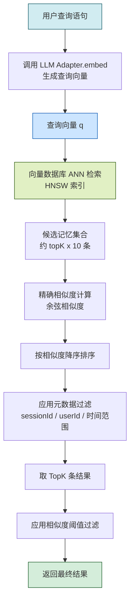
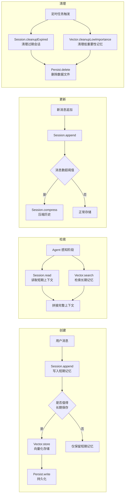
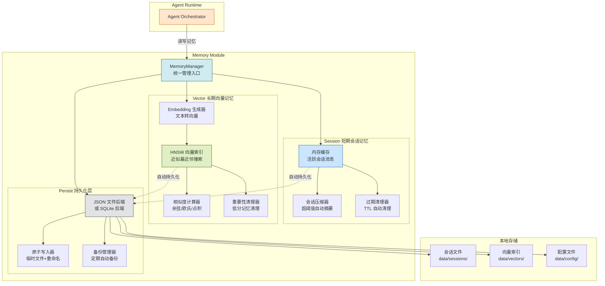
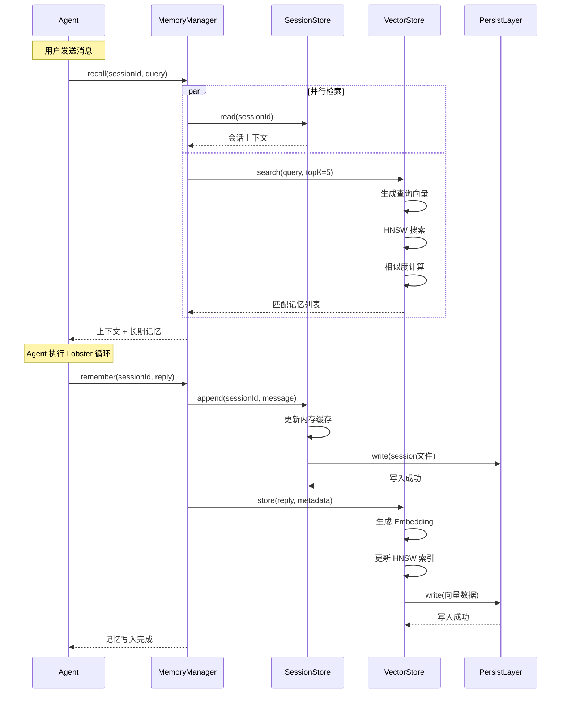
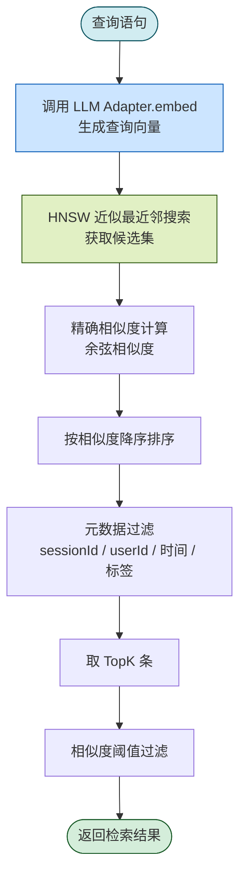
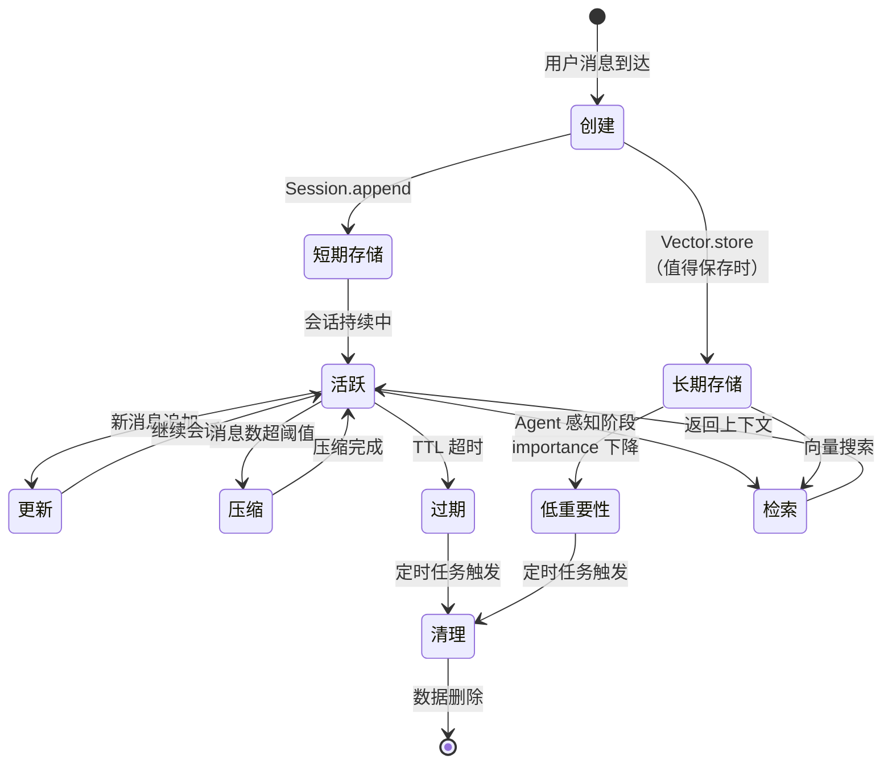

# MyOpenClaw Memory 记忆模块

> **版本**：v1.1.2  
> **修订日期**：2026-08-04  
> **修订人**：MyOpenClaw Core Team  
> **文档状态**：正式发布

---

> **实现状态**：记忆模块已完整实现。MemoryManager 提供统一门面管理三层架构：SessionMemory（消息追加/压缩/过期清理）、VectorMemory（余弦相似度/欧氏距离/点积三种检索方式）、EmbeddingService（OpenAI 兼容 API + 中英文关键词回退）、PersistLayer（原子写入 + 备份恢复）。

---

## 目录

- [1. 模块概述](#1-模块概述)
- [2. 三级存储架构](#2-三级存储架构)
  - [2.1 短期会话记忆 Session](#21-短期会话记忆-session)
  - [2.2 长期向量记忆 Vector](#22-长期向量记忆-vector)
  - [2.3 持久化层 Persist](#23-持久化层-persist)
- [3. TypeScript 接口定义](#3-typescript-接口定义)
- [4. 向量检索机制详解](#4-向量检索机制详解)
- [5. 记忆生命周期管理](#5-记忆生命周期管理)
- [6. 配置说明](#6-配置说明)
- [7. 使用示例代码](#7-使用示例代码)
- [8. 记忆检索工具说明](#8-记忆检索工具说明)
- [9. Mermaid 流程图](#9-mermaid-流程图)
- [10. 性能优化建议](#10-性能优化建议)

---

## 1. 模块概述

Memory 记忆模块是 MyOpenClaw 六层架构中的第六层（最底层），也是整个系统的"上下文底座"。它为 Agent Runtime 提供记忆存储和检索能力，使 Agent 能够"记住"历史对话、跨会话复用知识、在任务执行过程中保存中间状态。

没有记忆模块，Agent 每次对话都从零开始，无法理解用户的上下文延续需求（如"它"、"上次提到的文件"），也无法从历史经验中学习。记忆模块让 Agent 从"无状态的问答机器人"进化为"有记忆的智能助手"。

### 1.1 模块定位

```
┌──────────────────────────────────────────────────┐
│  Agent Runtime 运行时   推理与任务规划             │
│         │ 读取上下文        │ 写入新记忆            │
│         ▼                   ▼                     │
├──────────────────────────────────────────────────┤
│  Memory 记忆层          <<< 本文档所述模块 >>>      │
│  ┌────────────────────────────────────────────┐  │
│  │ Session    短期会话记忆（内存 + 文件）        │  │
│  │ Vector     长期向量记忆（向量数据库）        │  │
│  │ Persist    持久化层（本地 JSON / 数据库）     │  │
│  └────────────────────────────────────────────┘  │
│         │ 读写                │ 自动加载           │
│         ▼                     ▼                   │
├──────────────────────────────────────────────────┤
│  本地文件系统 / 轻量数据库                        │
└──────────────────────────────────────────────────┘
```

### 1.2 核心职责

| 职责 | 说明 |
|------|------|
| 短期上下文管理 | 维护单轮会话的消息历史和任务中间状态 |
| 长期语义记忆 | 将历史对话向量化存储，支持跨会话语义检索 |
| 持久化存储 | 将所有记忆数据保存到本地，重启后自动加载 |
| 会话隔离 | 不同会话的短期记忆相互隔离，互不干扰 |
| 记忆生命周期 | 管理记忆的创建、更新、过期清理 |

### 1.3 设计原则

1. **本地优先**：所有记忆数据默认存储在本地，不向第三方服务上传
2. **分层存储**：短期记忆追求速度（内存优先），长期记忆追求语义检索能力（向量数据库）
3. **会话隔离**：短期记忆按 sessionId 隔离，长期记忆全局共享
4. **自动持久化**：记忆变更自动写入持久化层，重启后自动恢复
5. **可选向量化**：向量记忆是可选的，不配置 LLM Embedding 模型时自动降级为关键词检索

---

## 2. 三级存储架构

Memory 模块采用三级存储架构，每一级针对不同的访问模式和性能要求优化：

```
┌─────────────────────────────────────────────────────────────┐
│                    Memory 记忆模块                           │
├─────────────────────────────────────────────────────────────┤
│  第一级：Session 短期会话记忆                                 │
│  ┌─────────────────────────────────────────────────────────┐ │
│  │ 类型：内存缓存 + 本地文件                                │ │
│  │ 生命周期：单次会话（可配置 TTL 过期）                      │ │
│  │ 访问模式：按 sessionId 顺序读写                          │ │
│  │ 用途：当前对话上下文、任务中间状态                        │ │
│  │ 性能：内存读取 < 1ms                                     │ │
│  └─────────────────────────────────────────────────────────┘ │
├─────────────────────────────────────────────────────────────┤
│  第二级：Vector 长期向量记忆                                 │
│  ┌─────────────────────────────────────────────────────────┐ │
│  │ 类型：向量数据库（本地）                                  │ │
│  │ 生命周期：永久（除非手动删除或过期清理）                   │ │
│  │ 访问模式：语义相似度检索                                  │ │
│  │ 用途：历史对话向量化存储，跨会话语义复用                  │ │
│  │ 性能：向量检索 10-50ms（取决于向量数量）                  │ │
│  └─────────────────────────────────────────────────────────┘ │
├─────────────────────────────────────────────────────────────┤
│  第三级：Persist 持久化层                                    │
│  ┌─────────────────────────────────────────────────────────┐ │
│  │ 类型：本地 JSON 文件 / 轻量数据库（SQLite）              │ │
│  │ 生命周期：永久                                            │ │
│  │ 访问模式：键值读写                                        │ │
│  │ 用途：配置、会话记录、向量索引的底层持久化                │ │
│  │ 性能：文件写入 1-10ms                                     │ │
│  └─────────────────────────────────────────────────────────┘ │
└─────────────────────────────────────────────────────────────┘
```

### 2.1 短期会话记忆 Session

**源码位置**：`src/memory/session.ts`

Session 短期会话记忆负责维护单个会话的上下文。它存储当前对话的消息历史、任务执行中间状态、会话元数据。

#### 2.1.1 核心特性

| 特性 | 说明 |
|------|------|
| 会话隔离 | 每个 sessionId 拥有独立的上下文空间，互不干扰 |
| 内存缓存 | 活跃会话的消息缓存在内存中，读取延迟 < 1ms |
| 自动持久化 | 每次消息追加后自动写入本地文件，防止数据丢失 |
| TTL 过期 | 可配置会话过期时间，超时后自动清理 |
| 上下文压缩 | 当消息数超过阈值时自动摘要压缩历史消息 |
| 附件管理 | 支持存储图片、文件等附件的引用信息 |

#### 2.1.2 数据结构

```typescript
/**
 * 会话数据结构
 */
interface SessionData {
  /** 会话唯一 ID */
  sessionId: string;
  /** 用户 ID */
  userId: string;
  /** 渠道 ID（webchat/qqbot/feishu/wechat/cli 等） */
  channelId: string;
  /** 绑定的 Agent ID */
  agentId: string;
  /** 消息历史列表（按时间顺序） */
  messages: SessionMessage[];
  /** 任务中间状态（Agent 执行过程中的临时数据） */
  taskState?: Record<string, unknown>;
  /** 会话元数据 */
  metadata: {
    /** 创建时间 */
    createdAt: number;
    /** 最后活跃时间 */
    lastActiveAt: number;
    /** 消息总数 */
    messageCount: number;
    /** Token 使用统计 */
    tokenUsage: TokenUsage;
  };
}

/**
 * 会话消息
 */
interface SessionMessage {
  /** 消息 ID */
  id: string;
  /** 消息角色：user / assistant / tool */
  role: 'user' | 'assistant' | 'tool';
  /** 消息内容 */
  content: string;
  /** 时间戳 */
  timestamp: number;
  /** 附件列表 */
  attachments?: Attachment[];
  /** 工具调用信息（role 为 tool 时） */
  toolCall?: {
    /** 工具名 */
    name: string;
    /** 调用参数 */
    params: Record<string, unknown>;
    /** 调用 ID */
    callId: string;
  };
  /** 是否已压缩（被摘要替代） */
  compressed?: boolean;
}
```

#### 2.1.3 上下文压缩机制

当会话消息数超过阈值（默认 50 条）时，Session 会自动触发上下文压缩：

```
压缩前（60 条消息）：
[消息1] [消息2] ... [消息50] [消息51] [消息52] ... [消息60]
                                              ▲
                                        压缩阈值

压缩后（12 条消息）：
[摘要1: 消息1-10] [摘要2: 消息11-20] ... [摘要5: 消息41-50] [消息51] [消息52] ... [消息60]
```

压缩过程：
1. 取最早的一批消息（如前 50 条）
2. 每 10 条消息合并为一个摘要
3. 用摘要替代原始消息，减少上下文长度
4. 标记被压缩的消息，原始数据保留在持久化层

### 2.2 长期向量记忆 Vector

**源码位置**：`src/memory/vector.ts`

Vector 长期向量记忆负责将历史对话内容向量化存储，支持跨会话的语义检索。它使 Agent 能够"回忆"之前与用户的所有对话，即使这些对话发生在不同的会话中。

#### 2.2.1 核心特性

| 特性 | 说明 |
|------|------|
| 语义检索 | 基于向量相似度检索，而非关键词匹配 |
| 跨会话复用 | 全局共享，不受 sessionId 隔离限制 |
| 自动向量化 | 存入记忆时自动调用 Embedding 模型生成向量 |
| 多种相似度算法 | 支持余弦相似度、欧氏距离、点积 |
| 元数据过滤 | 支持按时间、会话 ID、用户 ID 过滤检索结果 |
| 本地存储 | 向量数据存储在本地向量数据库，数据不出本地 |

#### 2.2.2 向量存储结构

```typescript
/**
 * 向量记忆条目
 */
interface VectorMemory {
  /** 记忆唯一 ID */
  id: string;
  /** 原始文本内容 */
  content: string;
  /** 向量（Embedding） */
  embedding: number[];
  /** 向量维度 */
  dimension: number;
  /** 元数据 */
  metadata: {
    /** 来源会话 ID */
    sessionId: string;
    /** 用户 ID */
    userId: string;
    /** 创建时间 */
    createdAt: number;
    /** 记忆类型：对话/任务/知识 */
    type: 'conversation' | 'task' | 'knowledge';
    /** 关键词标签 */
    tags?: string[];
    /** 重要性分数（0-1） */
    importance?: number;
  };
  /** 相似度分数（检索时填充） */
  score?: number;
}
```

#### 2.2.3 向量索引

Vector 模块使用本地向量数据库（如 HNSW 索引）存储向量数据。索引支持高效的近似最近邻搜索（ANN），在海量向量中快速找到最相似的 TopK 条结果。

```
向量存储结构：
┌─────────────────────────────────────────────┐
│  HNSW 索引（分层可导航小世界图）              │
│  ┌───────┐ ┌───────┐ ┌───────┐ ┌───────┐    │
│  │ 向量1 │ │ 向量2 │ │ 向量3 │ │  ...  │    │
│  │ dim=  │ │ dim=  │ │ dim=  │ │       │    │
│  │ 1536  │ │ 1536  │ │ 1536  │ │       │    │
│  └───┬───┘ └───┬───┘ └───┬───┘ └───┬───┘    │
│      │         │         │         │         │
│      └─────────┴─────────┴─────────┘         │
│              图结构连接                       │
├─────────────────────────────────────────────┤
│  元数据索引                                   │
│  sessionId → [memoryId1, memoryId2, ...]     │
│  userId → [memoryId1, memoryId3, ...]        │
│  timestamp → B+ 树索引                        │
└─────────────────────────────────────────────┘
```

### 2.3 持久化层 Persist

**源码位置**：`src/memory/persist.ts`

Persist 持久化层是所有记忆数据的底层存储。Session 和 Vector 的数据最终都通过 Persist 层写入本地文件系统或轻量数据库。

#### 2.3.1 核心特性

| 特性 | 说明 |
|------|------|
| 多后端支持 | 支持 JSON 文件和 SQLite 两种存储后端 |
| 自动加载 | 网关/Agent 重启时自动从持久化层加载历史数据 |
| 原子写入 | 使用临时文件 + 重命名机制确保写入原子性 |
| 数据加密 | 可选的 AES 加密保护敏感数据 |
| 备份机制 | 支持自动定期备份 |
| 紧凑存储 | JSON 数据自动压缩，减少磁盘占用 |

#### 2.3.2 存储后端对比

| 维度 | JSON 文件后端 | SQLite 后端 |
|------|--------------|-------------|
| 依赖 | 无（Node.js 内置 fs 模块） | 需要安装 better-sqlite3 |
| 适用场景 | 小规模数据（< 10000 条记忆） | 大规模数据（> 10000 条记忆） |
| 写入性能 | 1-10ms | 0.1-1ms |
| 查询能力 | 全量加载后过滤 | 支持 SQL 查询 |
| 并发安全 | 单进程安全 | 多进程安全 |
| 文件格式 | .json 文本文件 | .db 二进制文件 |
| 可读性 | 人类可读 | 需要工具查看 |

#### 2.3.3 文件结构

```
data/                          # 数据根目录
├── sessions/                  # 会话数据
│   ├── session-001.json       # 单个会话的完整数据
│   ├── session-002.json
│   └── index.json             # 会话索引（sessionId → 文件映射）
├── vectors/                   # 向量数据
│   ├── index.hnsw             # HNSW 向量索引文件
│   ├── vectors.bin            # 向量二进制数据
│   └── metadata.db            # 向量元数据（SQLite）
├── config/                    # 配置数据
│   ├── agents.json            # Agent 配置
│   └── tools.json             # 工具配置
└── audit/                     # 审计日志
    └── 2026-07-21.log         # 按日期分文件
```

---

## 3. TypeScript 接口定义

本节给出 Memory 模块的完整 TypeScript 类型定义，所有类型均带详细中文注释。

### 3.1 SessionStore 接口

```typescript
/**
 * 短期会话记忆存储接口
 * 
 * 管理单轮会话的上下文消息、任务中间状态和会话元数据。
 * 所有操作按 sessionId 隔离，不同会话互不干扰。
 */
export interface SessionStore {
  /**
   * 创建新会话
   * 
   * @param sessionId 会话 ID（由网关分配）
   * @param config 会话配置（用户 ID、渠道 ID、Agent ID）
   * @returns 创建的会话数据
   */
  create(sessionId: string, config: SessionConfig): Promise<SessionData>;

  /**
   * 读取会话数据
   * 
   * @param sessionId 会话 ID
   * @returns 会话数据，不存在返回 null
   */
  read(sessionId: string): Promise<SessionData | null>;

  /**
   * 追加消息到会话
   * 
   * 将新消息追加到会话历史末尾，并更新会话元数据。
   * 如果消息数超过压缩阈值，自动触发上下文压缩。
   * 
   * @param sessionId 会话 ID
   * @param message 待追加的消息
   * @returns 更新后的消息总数
   */
  append(sessionId: string, message: SessionMessage): Promise<number>;

  /**
   * 更新任务中间状态
   * 
   * Agent 在执行过程中可以保存中间状态，便于中断恢复。
   * 
   * @param sessionId 会话 ID
   * @param state 任务状态数据
   */
  updateTaskState(
    sessionId: string,
    state: Record<string, unknown>,
  ): Promise<void>;

  /**
   * 读取任务中间状态
   * 
   * @param sessionId 会话 ID
   * @returns 任务状态数据
   */
  getTaskState(sessionId: string): Promise<Record<string, unknown> | null>;

  /**
   * 压缩会话历史
   * 
   * 将较早的消息合并为摘要，减少上下文长度。
   * 
   * @param sessionId 会话 ID
   * @param options 压缩选项
   * @returns 压缩前后的消息数
   */
  compress(
    sessionId: string,
    options?: CompressOptions,
  ): Promise<{ before: number; after: number }>;

  /**
   * 删除会话
   * 
   * 清除会话的所有数据（消息历史、任务状态、元数据）。
   * 注意：此操作不可逆，长期向量记忆不受影响。
   * 
   * @param sessionId 会话 ID
   */
  delete(sessionId: string): Promise<void>;

  /**
   * 清理过期会话
   * 
   * 根据 TTL 配置清理超时未活跃的会话。
   * 通常由定时任务定期调用。
   * 
   * @returns 清理的会话数量
   */
  cleanupExpired(): Promise<number>;

  /**
   * 获取会话列表
   * 
   * @param filter 过滤条件（按用户 ID、渠道 ID 等）
   * @returns 会话摘要列表
   */
  list(filter?: SessionFilter): Promise<SessionSummary[]>;
}

/**
 * 会话配置
 */
export interface SessionConfig {
  /** 用户 ID */
  userId: string;
  /** 渠道 ID */
  channelId: string;
  /** 绑定的 Agent ID */
  agentId: string;
  /** 会话 TTL（秒），超时后可被清理 */
  ttl?: number;
}

/**
 * 会话摘要
 */
export interface SessionSummary {
  /** 会话 ID */
  sessionId: string;
  /** 用户 ID */
  userId: string;
  /** 渠道 ID */
  channelId: string;
  /** 消息总数 */
  messageCount: number;
  /** 创建时间 */
  createdAt: number;
  /** 最后活跃时间 */
  lastActiveAt: number;
}

/**
 * 会话过滤条件
 */
export interface SessionFilter {
  /** 按用户 ID 过滤 */
  userId?: string;
  /** 按渠道 ID 过滤 */
  channelId?: string;
  /** 按活跃时间过滤（仅返回此时间之后活跃的会话） */
  activeAfter?: number;
}

/**
 * 压缩选项
 */
export interface CompressOptions {
  /** 保留最近 N 条消息不压缩 */
  keepRecent?: number;
  /** 每批合并的消息数 */
  batchSize?: number;
  /** 自定义摘要生成函数 */
  summarize?: (messages: SessionMessage[]) => Promise<string>;
}
```

### 3.2 VectorStore 接口

```typescript
/**
 * 长期向量记忆存储接口
 * 
 * 将文本内容向量化存储，支持基于语义相似度的检索。
 * 用于跨会话的历史记忆复用。
 */
export interface VectorStore {
  /**
   * 存储记忆
   * 
   * 将文本内容向量化后存入向量数据库。
   * 自动调用 Embedding 模型生成向量。
   * 
   * @param input 存储输入
   * @returns 记忆 ID
   */
  store(input: VectorStoreInput): Promise<string>;

  /**
   * 批量存储记忆
   * 
   * @param inputs 存储输入列表
   * @returns 记忆 ID 列表
   */
  storeBatch(inputs: VectorStoreInput[]): Promise<string[]>;

  /**
   * 语义检索
   * 
   * 将查询语句向量化后，在向量数据库中检索最相似的 TopK 条记忆。
   * 
   * @param query 检索查询（自然语言）
   * @param options 检索选项
   * @returns 匹配的记忆列表（按相似度降序）
   */
  search(query: string, options?: VectorSearchOptions): Promise<VectorMemory[]>;

  /**
   * 按 ID 获取记忆
   * 
   * @param id 记忆 ID
   * @returns 记忆数据，不存在返回 null
   */
  get(id: string): Promise<VectorMemory | null>;

  /**
   * 更新记忆
   * 
   * 更新记忆内容和元数据，自动重新生成向量。
   * 
   * @param id 记忆 ID
   * @param update 更新内容
   */
  update(id: string, update: VectorUpdateInput): Promise<void>;

  /**
   * 删除记忆
   * 
   * @param id 记忆 ID
   * @returns 删除成功返回 true
   */
  delete(id: string): Promise<boolean>;

  /**
   * 批量删除记忆
   * 
   * @param filter 删除过滤条件
   * @returns 删除的记忆数量
   */
  deleteByFilter(filter: VectorDeleteFilter): Promise<number>;

  /**
   * 获取记忆总数
   * 
   * @param filter 过滤条件
   * @returns 记忆数量
   */
  count(filter?: VectorCountFilter): Promise<number>;

  /**
   * 清理低重要性记忆
   * 
   * 删除重要性分数低于阈值的记忆，释放存储空间。
   * 
   * @param threshold 重要性阈值（0-1）
   * @param maxAge 最大存活时间（毫秒）
   * @returns 清理的记忆数量
   */
  cleanupLowImportance(threshold: number, maxAge?: number): Promise<number>;
}

/**
 * 向量存储输入
 */
export interface VectorStoreInput {
  /** 文本内容 */
  content: string;
  /** 元数据 */
  metadata: VectorMetadata;
  /** 预计算的向量（不填则自动生成） */
  embedding?: number[];
}

/**
 * 向量元数据
 */
export interface VectorMetadata {
  /** 来源会话 ID */
  sessionId: string;
  /** 用户 ID */
  userId: string;
  /** 记忆类型 */
  type: 'conversation' | 'task' | 'knowledge';
  /** 关键词标签 */
  tags?: string[];
  /** 重要性分数（0-1，默认 0.5） */
  importance?: number;
  /** 自定义元数据 */
  custom?: Record<string, unknown>;
}

/**
 * 向量检索选项
 */
export interface VectorSearchOptions {
  /** 返回最相关的 K 条记忆 */
  topK?: number;
  /** 相似度阈值（0-1），低于此值不返回 */
  threshold?: number;
  /** 限定会话范围（不填则全局检索） */
  sessionId?: string;
  /** 限定用户范围 */
  userId?: string;
  /** 限定记忆类型 */
  type?: 'conversation' | 'task' | 'knowledge';
  /** 时间范围过滤 */
  timeRange?: {
    start?: number;
    end?: number;
  };
  /** 标签过滤 */
  tags?: string[];
  /** 相似度算法 */
  similarity?: 'cosine' | 'euclidean' | 'dotProduct';
}

/**
 * 向量更新输入
 */
export interface VectorUpdateInput {
  /** 新的文本内容（更新后自动重新向量化） */
  content?: string;
  /** 更新的元数据 */
  metadata?: Partial<VectorMetadata>;
}

/**
 * 向量删除过滤条件
 */
export interface VectorDeleteFilter {
  /** 按会话 ID 删除 */
  sessionId?: string;
  /** 按用户 ID 删除 */
  userId?: string;
  /** 按时间范围删除 */
  timeRange?: {
    start?: number;
    end?: number;
  };
  /** 按类型删除 */
  type?: 'conversation' | 'task' | 'knowledge';
}

/**
 * 向量计数过滤条件
 */
export interface VectorCountFilter {
  sessionId?: string;
  userId?: string;
  type?: 'conversation' | 'task' | 'knowledge';
}
```

### 3.3 PersistLayer 接口

```typescript
/**
 * 持久化层接口
 * 
 * 所有记忆数据的底层存储抽象。
 * 支持 JSON 文件和 SQLite 两种后端。
 */
export interface PersistLayer {
  /**
   * 初始化持久化层
   * 
   * 创建数据目录、索引文件、数据库连接。
   */
  initialize(): Promise<void>;

  /**
   * 读取键值
   * 
   * @param key 存储键
   * @returns 存储值，不存在返回 null
   */
  read<T>(key: string): Promise<T | null>;

  /**
   * 写入键值
   * 
   * @param key 存储键
   * @param value 存储值
   * @param options 写入选项
   */
  write<T>(key: string, value: T, options?: WriteOptions): Promise<void>;

  /**
   * 批量写入
   * 
   * @param entries 键值对列表
   */
  writeBatch<T>(entries: Array<{ key: string; value: T }>): Promise<void>;

  /**
   * 删除键值
   * 
   * @param key 存储键
   * @returns 删除成功返回 true
   */
  delete(key: string): Promise<boolean>;

  /**
   * 按前缀列出键
   * 
   * @param prefix 键前缀
   * @returns 匹配的键列表
   */
  listKeys(prefix?: string): Promise<string[]>;

  /**
   * 按前缀批量读取
   * 
   * @param prefix 键前缀
   * @returns 键值对列表
   */
  readByPrefix<T>(prefix: string): Promise<Array<{ key: string; value: T }>>;

  /**
   * 检查键是否存在
   * 
   * @param key 存储键
   * @returns 存在返回 true
   */
  exists(key: string): Promise<boolean>;

  /**
   * 创建备份
   * 
   * @param backupPath 备份文件路径
   */
  backup(backupPath: string): Promise<void>;

  /**
   * 从备份恢复
   * 
   * @param backupPath 备份文件路径
   */
  restore(backupPath: string): Promise<void>;

  /**
   * 关闭持久化层
   * 
   * 刷新缓冲区、关闭文件句柄和数据库连接。
   */
  close(): Promise<void>;
}

/**
 * 写入选项
 */
export interface WriteOptions {
  /** 是否同步写入（等待落盘完成） */
  sync?: boolean;
  /** TTL 过期时间（毫秒） */
  ttl?: number;
  /** 是否压缩存储 */
  compress?: boolean;
}
```

### 3.4 MemoryManager 门面接口

```typescript
/**
 * Memory 模块统一管理接口
 * 
 * 作为 Session、Vector、Persist 三层的门面，
 * 提供 Agent 直接使用的简化 API。
 */
export interface MemoryManager {
  /** 短期会话记忆 */
  readonly session: SessionStore;
  /** 长期向量记忆 */
  readonly vector: VectorStore;
  /** 持久化层 */
  readonly persist: PersistLayer;

  /**
   * 初始化 Memory 模块
   * 
   * 加载持久化数据到内存，建立向量索引。
   */
  initialize(): Promise<void>;

  /**
   * 记忆写入快捷方法
   * 
   * 同时写入短期会话记忆和长期向量记忆。
   * 
   * @param sessionId 会话 ID
   * @param message 消息内容
   * @param options 写入选项
   */
  remember(
    sessionId: string,
    message: SessionMessage,
    options?: RememberOptions,
  ): Promise<void>;

  /**
   * 记忆检索快捷方法
   * 
   * 同时检索短期会话上下文和长期向量记忆。
   * 
   * @param sessionId 会话 ID
   * @param query 检索查询
   * @returns 会话上下文 + 向量记忆
   */
  recall(
    sessionId: string,
    query: string,
  ): Promise<{ session: SessionData | null; vectors: VectorMemory[] }>;

  /**
   * 关闭 Memory 模块
   * 
   * 刷新所有缓冲区，关闭连接。
   */
  shutdown(): Promise<void>;
}

/**
 * 记忆写入选项
 */
export interface RememberOptions {
  /** 是否同时存入长期向量记忆（默认 true） */
  storeVector?: boolean;
  /** 记忆类型 */
  type?: 'conversation' | 'task' | 'knowledge';
  /** 重要性分数 */
  importance?: number;
  /** 关键词标签 */
  tags?: string[];
}
```

---

## 4. 向量检索机制详解

向量检索是长期记忆的核心能力。本节详细说明从文本到向量的转换、相似度计算和 TopK 检索的完整流程。

### 4.1 Embedding 生成

Embedding（嵌入）是将文本转换为固定维度向量的过程。MyOpenClaw 通过 LLM Adapter 的 `embed()` 方法生成向量。

```typescript
/**
 * Embedding 生成流程
 */

// 1. 输入文本
const text = '用户询问了如何配置 PostgreSQL 数据库连接';

// 2. 调用 LLM Adapter 生成向量
const embedding: number[] = await llmAdapter.embed(text);

// 3. 向量结构示例（以 1536 维为例）
// embedding = [0.0234, -0.0567, 0.0891, ..., 0.0123]
// 长度: 1536
// 每个分量: -1.0 到 1.0 之间的浮点数

// 4. 存入向量数据库
await vectorStore.store({
  content: text,
  embedding,
  metadata: {
    sessionId: 'session-001',
    userId: 'user-001',
    type: 'conversation',
    importance: 0.7,
  },
});
```

**支持的 Embedding 模型**：

| 模型 | 维度 | 说明 |
|------|------|------|
| text-embedding-3-small | 1536 | OpenAI 小型模型，性价比高 |
| text-embedding-3-large | 3072 | OpenAI 大型模型，精度更高 |
| text-embedding-ada-002 | 1536 | OpenAI 旧版模型 |
| bge-large-zh | 1024 | 本地中文模型，数据不出本地 |
| nomic-embed-text | 768 | 本地轻量模型，适合资源受限场景 |

### 4.2 相似度计算

MyOpenClaw 支持三种相似度计算算法，默认使用余弦相似度。

#### 4.2.1 余弦相似度（默认）

余弦相似度衡量两个向量方向的相似程度，不关心向量长度。

```typescript
/**
 * 余弦相似度计算
 * 
 * 公式：cos(A, B) = (A · B) / (|A| × |B|)
 * 
 * 取值范围：[-1, 1]
 * - 1 表示方向完全相同（最相似）
 * - 0 表示正交（不相关）
 * - -1 表示方向完全相反
 * 
 * @param vecA 向量 A
 * @param vecB 向量 B
 * @returns 相似度分数
 */
function cosineSimilarity(vecA: number[], vecB: number[]): number {
  let dotProduct = 0;    // 点积
  let normA = 0;         // 向量 A 的模
  let normB = 0;         // 向量 B 的模

  for (let i = 0; i < vecA.length; i++) {
    dotProduct += vecA[i] * vecB[i];
    normA += vecA[i] * vecA[i];
    normB += vecB[i] * vecB[i];
  }

  normA = Math.sqrt(normA);
  normB = Math.sqrt(normB);

  if (normA === 0 || normB === 0) {
    return 0;  // 零向量返回 0 相似度
  }

  return dotProduct / (normA * normB);
}
```

#### 4.2.2 欧氏距离

欧氏距离衡量两个向量在空间中的直线距离。距离越小表示越相似。

```typescript
/**
 * 欧氏距离计算
 * 
 * 公式：d(A, B) = sqrt(Σ(Ai - Bi)²)
 * 
 * 取值范围：[0, +∞)
 * - 0 表示两个向量完全相同
 * - 值越大表示差异越大
 * 
 * 注意：返回的是距离的倒数（1 / (1 + distance)），
 * 转换为相似度分数，使值域为 [0, 1]。
 */
function euclideanDistance(vecA: number[], vecB: number[]): number {
  let sum = 0;
  for (let i = 0; i < vecA.length; i++) {
    const diff = vecA[i] - vecB[i];
    sum += diff * diff;
  }
  const distance = Math.sqrt(sum);
  // 转换为相似度：距离 0 → 相似度 1
  return 1 / (1 + distance);
}
```

#### 4.2.3 点积

点积直接计算两个向量的内积，不归一化。

```typescript
/**
 * 点积相似度计算
 * 
 * 公式：s(A, B) = Σ(Ai × Bi)
 * 
 * 取值范围：(-∞, +∞)
 * - 值越大表示越相似
 * - 适用于已归一化的向量
 */
function dotProduct(vecA: number[], vecB: number[]): number {
  let sum = 0;
  for (let i = 0; i < vecA.length; i++) {
    sum += vecA[i] * vecB[i];
  }
  return sum;
}
```

### 4.3 TopK 检索流程



**TopK 检索详细步骤**：

1. **查询向量化**：将用户的查询语句通过 `embed()` 转换为向量
2. **ANN 近似搜索**：在 HNSW 索引中执行近似最近邻搜索，获取候选集（约为 TopK 的 10 倍）
3. **精确计算**：对候选集逐一计算精确的余弦相似度
4. **排序**：按相似度分数降序排序
5. **元数据过滤**：根据 sessionId、userId、时间范围等条件过滤
6. **截取 TopK**：取前 K 条结果
7. **阈值过滤**：过滤掉相似度低于阈值的结果

```typescript
/**
 * TopK 检索完整实现示例
 */
async function topKSearch(
  vectorStore: VectorStore,
  llmAdapter: LLMAdapter,
  query: string,
  options: VectorSearchOptions,
): Promise<VectorMemory[]> {
  const {
    topK = 5,
    threshold = 0.5,
    sessionId,
    userId,
    type,
    timeRange,
    tags,
    similarity = 'cosine',
  } = options;

  // 步骤 1：生成查询向量
  const queryEmbedding = await llmAdapter.embed(query);

  // 步骤 2-6：向量数据库内部执行 ANN 搜索 + 精确计算 + 过滤 + TopK
  const results = await vectorStore.search(query, {
    topK,
    threshold,
    sessionId,
    userId,
    type,
    timeRange,
    tags,
    similarity,
  });

  // 步骤 7：返回结果（已按相似度降序排列）
  return results;
}
```

### 4.4 检索结果示例

```typescript
// 检索与"数据库配置"相关的历史记忆
const results = await vectorStore.search('数据库配置', {
  topK: 3,
  threshold: 0.6,
});

// 结果示例（按相似度降序）
// [
//   {
//     id: "mem-001",
//     content: "用户之前配置了 PostgreSQL 数据库，连接地址是 localhost:5432",
//     embedding: [0.023, -0.057, ...],  // 1536 维
//     score: 0.89,  // 相似度分数
//     metadata: {
//       sessionId: "session-001",
//       userId: "user-001",
//       createdAt: 1784500000000,
//       type: "conversation",
//       importance: 0.8,
//       tags: ["数据库", "PostgreSQL", "配置"]
//     }
//   },
//   {
//     id: "mem-015",
//     content: "讨论了 MySQL 和 PostgreSQL 的性能对比",
//     score: 0.76,
//     metadata: { ... }
//   },
//   {
//     id: "mem-032",
//     content: "用户提到数据库需要定期备份",
//     score: 0.68,
//     metadata: { ... }
//   }
// ]
```

---

## 5. 记忆生命周期管理

### 5.1 生命周期总览



### 5.2 创建

记忆创建发生在 Agent 处理用户消息的过程中：

```typescript
/**
 * 记忆创建流程
 */
async function createMemory(
  memoryManager: MemoryManager,
  sessionId: string,
  userMessage: string,
): Promise<void> {
  // 1. 写入短期会话记忆
  await memoryManager.session.append(sessionId, {
    id: generateId(),
    role: 'user',
    content: userMessage,
    timestamp: Date.now(),
  });

  // 2. 判断是否值得长期保存
  const shouldStoreLongTerm = await shouldStoreAsVector(userMessage);
  
  if (shouldStoreLongTerm) {
    // 3. 写入长期向量记忆
    await memoryManager.vector.store({
      content: userMessage,
      metadata: {
        sessionId,
        userId: 'user-001',
        type: 'conversation',
        importance: 0.7,
        tags: extractKeywords(userMessage),
      },
    });
  }
}

/**
 * 判断是否值得作为长期记忆存储
 * 
 * 过滤掉无意义或重复的消息。
 */
async function shouldStoreAsVector(message: string): Promise<boolean> {
  // 过滤过短的消息
  if (message.length < 10) return false;
  // 过滤纯问候语
  const greetings = ['你好', '在吗', '谢谢', '好的'];
  if (greetings.some(g => message.includes(g))) return false;
  return true;
}
```

### 5.3 更新

记忆更新包括消息追加和上下文压缩：

```typescript
/**
 * 记忆更新流程
 */
async function updateMemory(
  sessionStore: SessionStore,
  sessionId: string,
  newMessage: SessionMessage,
): Promise<void> {
  // 追加新消息
  const messageCount = await sessionStore.append(sessionId, newMessage);

  // 检查是否需要压缩
  if (messageCount > 50) {
    // 压缩较早的消息（保留最近 20 条不压缩）
    await sessionStore.compress(sessionId, {
      keepRecent: 20,
      batchSize: 10,
    });
  }
}
```

### 5.4 检索

记忆检索在 Agent 的感知阶段执行：

```typescript
/**
 * 记忆检索流程
 */
async function retrieveMemory(
  memoryManager: MemoryManager,
  sessionId: string,
  userQuery: string,
): Promise<AgentContext> {
  // 并行检索短期和长期记忆
  const [sessionData, vectorMemories] = await Promise.all([
    // 读取短期会话上下文
    memoryManager.session.read(sessionId),
    // 检索长期向量记忆
    memoryManager.vector.search(userQuery, {
      topK: 5,
      threshold: 0.6,
      userId: 'user-001',
    }),
  ]);

  // 拼接完整上下文
  return {
    session: sessionData,
    longTermMemories: vectorMemories,
    currentQuery: userQuery,
  };
}
```

### 5.5 过期清理

过期清理由定时任务自动执行：

```typescript
/**
 * 过期清理流程
 * 
 * 通常由 Gateway 的 Cron 调度器每天执行一次。
 */
async function cleanupExpiredMemories(
  sessionStore: SessionStore,
  vectorStore: VectorStore,
): Promise<{ sessions: number; vectors: number }> {
  // 1. 清理过期的短期会话
  const sessionCount = await sessionStore.cleanupExpired();

  // 2. 清理低重要性的长期记忆
  //    重要性 < 0.3 且存活超过 30 天的记忆
  const vectorCount = await vectorStore.cleanupLowImportance(0.3, 30 * 24 * 3600 * 1000);

  return { sessions: sessionCount, vectors: vectorCount };
}

// 定时任务配置（每天凌晨 3 点执行）
// cron: "0 3 * * *"
```

---

## 6. 配置说明

### 6.1 配置文件位置

Memory 模块配置集成在 Gateway 主配置文件中，位于 `server/config/config.yaml`：

```yaml
# ── Gateway 网关配置 ──
gateway:
  host: 127.0.0.1
  port: 18780
  heartbeatInterval: 30000
  maxConnections: 1000
  requestTimeout: 30000

# ── 日志 ──
logging:
  level: info

# ── 安全 ──
security:
  rateLimit:
    max: 100
    windowMs: 60000

# ── 存储路径 ──
storage:
  dataDir: ./data              # 数据存储根目录，记忆数据存放在 ./data/memory/ 下
```

### 6.2 记忆模块设计配置（设计目标）

完整版 Memory 配置将位于 `config/memory.json`，当前为设计目标：

```jsonc
{
  "session": {
    "backend": "json",
    "dataDir": "./data/sessions",
    "ttl": 3600,
    "maxMessages": 50,
    "compressThreshold": 40,
    "compressBatchSize": 10,
    "keepRecent": 20
  },
  "vector": {
    "backend": "hnsw",
    "dataDir": "./data/vectors",
    "dimension": 1536,
    "maxConnections": 16,
    "efConstruction": 200,
    "efSearch": 50,
    "defaultTopK": 5,
    "defaultThreshold": 0.5,
    "similarity": "cosine",
    "cleanupThreshold": 0.3,
    "cleanupMaxAge": 2592000000
  },
  "persist": {
    "backend": "json",
    "dataDir": "./data",
    "sync": false,
    "compress": true,
    "backupDir": "./data/backups",
    "backupInterval": 86400000,
    "maxBackups": 7
  },
  "embedding": {
    "provider": "openai",
    "model": "text-embedding-3-small",
    "dimension": 1536,
    "batchSize": 100,
    "cacheSize": 1000
  }
}
```

### 6.2 配置项说明

#### Session 配置

| 配置项 | 类型 | 默认值 | 说明 |
|--------|------|--------|------|
| `session.backend` | string | `json` | 存储后端：json / sqlite |
| `session.dataDir` | string | `./data/sessions` | 数据目录 |
| `session.ttl` | number | 3600 | 会话过期时间（秒） |
| `session.maxMessages` | number | 50 | 单会话最大消息数 |
| `session.compressThreshold` | number | 40 | 触发压缩的消息数阈值 |
| `session.compressBatchSize` | number | 10 | 每批合并的消息数 |
| `session.keepRecent` | number | 20 | 压缩时保留的最近消息数 |

#### Vector 配置

| 配置项 | 类型 | 默认值 | 说明 |
|--------|------|--------|------|
| `vector.backend` | string | `hnsw` | 向量索引后端 |
| `vector.dataDir` | string | `./data/vectors` | 向量数据目录 |
| `vector.dimension` | number | 1536 | 向量维度 |
| `vector.maxConnections` | number | 16 | HNSW 最大连接数 |
| `vector.efConstruction` | number | 200 | HNSW 构建参数 |
| `vector.efSearch` | number | 50 | HNSW 搜索参数 |
| `vector.defaultTopK` | number | 5 | 默认返回结果数 |
| `vector.defaultThreshold` | number | 0.5 | 默认相似度阈值 |
| `vector.similarity` | string | `cosine` | 相似度算法 |
| `vector.cleanupThreshold` | number | 0.3 | 清理重要性阈值 |
| `vector.cleanupMaxAge` | number | 2592000000 | 清理最大存活时间（毫秒） |

#### Persist 配置

| 配置项 | 类型 | 默认值 | 说明 |
|--------|------|--------|------|
| `persist.backend` | string | `json` | 持久化后端：json / sqlite |
| `persist.dataDir` | string | `./data` | 数据根目录 |
| `persist.sync` | boolean | false | 是否同步写入 |
| `persist.compress` | boolean | true | 是否压缩存储 |
| `persist.backupDir` | string | `./data/backups` | 备份目录 |
| `persist.backupInterval` | number | 86400000 | 备份间隔（毫秒） |
| `persist.maxBackups` | number | 7 | 最大备份数 |

#### Embedding 配置

| 配置项 | 类型 | 默认值 | 说明 |
|--------|------|--------|------|
| `embedding.provider` | string | `openai` | Embedding 模型提供商 |
| `embedding.model` | string | `text-embedding-3-small` | 模型名称 |
| `embedding.dimension` | number | 1536 | 向量维度 |
| `embedding.batchSize` | number | 100 | 批量向量化大小 |
| `embedding.cacheSize` | number | 1000 | 向量缓存大小 |

---

## 7. 使用示例代码

### 7.1 基本使用

```typescript
/**
 * Memory 模块基本使用示例
 */
import { MemoryManager } from '@/memory/manager';

// 创建 Memory 管理器
const memory = new MemoryManager({
  session: { backend: 'json', dataDir: './data/sessions' },
  vector: { backend: 'hnsw', dataDir: './data/vectors', dimension: 1536 },
  persist: { backend: 'json', dataDir: './data' },
});

// 初始化
await memory.initialize();

// 创建会话
await memory.session.create('session-001', {
  userId: 'user-001',
  channelId: 'webchat',
  agentId: 'default',
});

// 写入短期记忆
await memory.session.append('session-001', {
  id: 'msg-001',
  role: 'user',
  content: '请帮我配置 PostgreSQL 数据库连接',
  timestamp: Date.now(),
});

// 写入长期向量记忆
await memory.vector.store({
  content: '用户请求配置 PostgreSQL 数据库连接，地址 localhost:5432',
  metadata: {
    sessionId: 'session-001',
    userId: 'user-001',
    type: 'conversation',
    importance: 0.8,
    tags: ['数据库', 'PostgreSQL', '配置'],
  },
});

// 读取短期会话上下文
const sessionData = await memory.session.read('session-001');
console.log('会话消息数:', sessionData?.metadata.messageCount);

// 检索长期记忆
const memories = await memory.vector.search('数据库配置', {
  topK: 5,
  threshold: 0.6,
});
console.log(`检索到 ${memories.length} 条相关记忆`);
```

### 7.2 使用 MemoryManager 快捷方法

```typescript
/**
 * MemoryManager 快捷方法使用示例
 */

// remember(): 同时写入短期和长期记忆
await memory.remember('session-001', {
  id: 'msg-002',
  role: 'assistant',
  content: '已为您配置好 PostgreSQL 连接，连接字符串为 postgresql://localhost:5432/mydb',
  timestamp: Date.now(),
}, {
  storeVector: true,          // 存入长期向量记忆
  type: 'conversation',       // 记忆类型
  importance: 0.9,            // 高重要性
  tags: ['PostgreSQL', '配置完成'],
});

// recall(): 同时检索短期和长期记忆
const context = await memory.recall('session-001', '数据库怎么配置的');

console.log('短期上下文消息数:', context.session?.metadata.messageCount);
console.log('长期记忆匹配数:', context.vectors.length);

// 输出匹配的长期记忆
context.vectors.forEach((mem, i) => {
  console.log(`[${i + 1}] 相似度: ${mem.score?.toFixed(2)}`);
  console.log(`    内容: ${mem.content}`);
});
```

### 7.3 会话管理示例

```typescript
/**
 * 会话管理完整示例
 */

// 列出所有活跃会话
const sessions = await memory.session.list({
  userId: 'user-001',
  activeAfter: Date.now() - 24 * 3600 * 1000,  // 最近 24 小时活跃
});
console.log(`最近活跃会话: ${sessions.length} 个`);

// 更新任务中间状态
await memory.session.updateTaskState('session-001', {
  currentStep: 3,
  totalSteps: 5,
  intermediateResult: '文件读取完成',
});

// 读取任务中间状态（用于中断恢复）
const taskState = await memory.session.getTaskState('session-001');
console.log('任务进度:', `${taskState?.currentStep}/${taskState?.totalSteps}`);

// 手动压缩会话历史
const compressResult = await memory.session.compress('session-001', {
  keepRecent: 10,
  batchSize: 5,
});
console.log(`压缩: ${compressResult.before} → ${compressResult.after} 条消息`);

// 删除会话
await memory.session.delete('session-001');
```

### 7.4 向量记忆管理示例

```typescript
/**
 * 向量记忆管理完整示例
 */

// 批量存储记忆
const ids = await memory.vector.storeBatch([
  {
    content: '用户的项目使用 TypeScript 开发',
    metadata: { sessionId: 's1', userId: 'u1', type: 'knowledge', importance: 0.7 },
  },
  {
    content: '用户偏好使用 PostgreSQL 数据库',
    metadata: { sessionId: 's1', userId: 'u1', type: 'knowledge', importance: 0.8 },
  },
  {
    content: '用户的代码仓库在 /home/user/project',
    metadata: { sessionId: 's1', userId: 'u1', type: 'knowledge', importance: 0.6 },
  },
]);
console.log(`存储了 ${ids.length} 条记忆`);

// 按类型检索
const conversations = await memory.vector.search('项目', {
  type: 'knowledge',
  topK: 10,
});

// 按时间范围检索
const recentMemories = await memory.vector.search('数据库', {
  timeRange: {
    start: Date.now() - 7 * 24 * 3600 * 1000,  // 最近 7 天
  },
});

// 更新记忆
await memory.vector.update(ids[0], {
  content: '用户的项目使用 TypeScript + React 开发',
  metadata: { importance: 0.9 },
});

// 按条件删除
const deleted = await memory.vector.deleteByFilter({
  sessionId: 'session-old',
});
console.log(`删除了 ${deleted} 条旧会话记忆`);

// 获取记忆总数
const total = await memory.vector.count({ userId: 'user-001' });
console.log(`用户共有 ${total} 条长期记忆`);
```

### 7.5 持久化层使用示例

```typescript
/**
 * PersistLayer 直接使用示例
 */
import { PersistLayer } from '@/memory/persist';

const persist = new JsonPersistLayer({ dataDir: './data' });
await persist.initialize();

// 写入数据
await persist.write('config/agent-settings', {
  model: 'gpt-4-turbo',
  temperature: 0.7,
  maxIterations: 10,
});

// 读取数据
const settings = await persist.read('config/agent-settings');
console.log('Agent 配置:', settings);

// 按前缀批量读取
const allConfigs = await persist.readByPrefix('config/');
console.log(`共 ${allConfigs.length} 个配置项`);

// 创建备份
await persist.backup('./data/backups/backup-2026-07-21');

// 从备份恢复
await persist.restore('./data/backups/backup-2026-07-21');
```

---

## 8. 记忆检索工具说明

Memory 模块的向量检索能力被封装为内置 Tool，供 Agent 在 Lobster 循环中直接调用。

### 8.1 工具定义

```typescript
/**
 * 记忆检索工具（内置 Tool）
 * 
 * 封装 VectorStore.search 能力，作为 Tool 注册到 ToolRegistry。
 * Agent 在感知阶段可主动调用此工具检索历史记忆。
 */
export const memorySearchTool: Tool = {
  name: 'memory_search/search',
  description: '从长期向量记忆中检索与查询语句语义相关的历史对话和记忆。用于回忆之前的对话内容、历史任务或用户偏好。',
  risk: 'low',
  builtin: true,
  parameters: {
    type: 'object',
    properties: {
      query: {
        type: 'string',
        description: '检索查询语句（自然语言描述要查找的内容）',
      },
      topK: {
        type: 'number',
        description: '返回最相关的 K 条记忆，默认 5',
        default: 5,
      },
      threshold: {
        type: 'number',
        description: '相似度阈值（0-1），低于此值的记忆不返回',
        default: 0.5,
      },
      type: {
        type: 'string',
        description: '限定记忆类型',
        enum: ['conversation', 'task', 'knowledge'],
      },
      timeRange: {
        type: 'object',
        description: '时间范围过滤',
        properties: {
          start: { type: 'string', description: '起始时间（ISO 8601）' },
          end: { type: 'string', description: '结束时间（ISO 8601）' },
        },
      },
    },
    required: ['query'],
  },

  async execute(params, context) {
    const { query, topK = 5, threshold = 0.5, type, timeRange } = params;
    
    // 调用 VectorStore 检索
    const memories = await vectorStore.search(query, {
      topK,
      threshold,
      userId: context.userId,
      type,
      timeRange: timeRange ? {
        start: timeRange.start ? new Date(timeRange.start).getTime() : undefined,
        end: timeRange.end ? new Date(timeRange.end).getTime() : undefined,
      } : undefined,
    });
    
    return {
      success: true,
      data: memories.map(m => ({
        content: m.content,
        score: m.score,
        timestamp: m.metadata.createdAt,
        type: m.metadata.type,
        tags: m.metadata.tags,
      })),
      metadata: {
        durationMs: 0,
        resources: { count: memories.length },
      },
    };
  },
};
```

### 8.2 自动检索 vs 主动检索

MyOpenClaw 支持两种记忆检索模式：

| 模式 | 触发方式 | 说明 |
|------|----------|------|
| 自动检索 | Agent 感知阶段自动执行 | 每次用户消息后，自动检索 TopK=5 的长期记忆注入上下文 |
| 主动检索 | Agent 调用 memory_search 工具 | Agent 在执行过程中根据需要主动检索更多记忆 |

```typescript
/**
 * 自动检索与主动检索的配合
 */

// 自动检索（感知阶段执行）
const autoMemories = await memory.vector.search(userMessage, {
  topK: 5,
  threshold: 0.6,
  userId: context.userId,
});

// 主动检索（Agent 在执行过程中调用工具）
// 当自动检索的结果不够时，Agent 可调用 memory_search/search 工具
// 例如：Agent 发现用户提到了"上次的配置"，但自动检索未找到
// Agent 会主动调用 memory_search/search 进行更精确的检索
```

---

## 9. Mermaid 流程图

### 9.1 三级存储架构图



### 9.2 记忆读写流程



### 9.3 向量检索流程



### 9.4 记忆生命周期



---

## 10. 性能优化建议

### 10.1 Session 性能优化

| 优化项 | 建议 | 预期收益 |
|--------|------|----------|
| 内存缓存 | 活跃会话缓存在内存，避免频繁文件读取 | 读取延迟 < 1ms |
| 批量写入 | 多条消息累积后批量写入文件 | 减少 IO 次数 80% |
| 异步持久化 | 消息先写入内存，异步落盘 | 写入延迟 < 1ms |
| 上下文压缩 | 超阈值自动摘要，减少上下文长度 | 降低 LLM Token 消耗 60% |
| 会话淘汰 | LRU 策略淘汰非活跃会话 | 控制内存占用 |

### 10.2 Vector 性能优化

| 优化项 | 建议 | 预期收益 |
|--------|------|----------|
| HNSW 参数调优 | efSearch 根据数据量动态调整 | 检索延迟降低 30% |
| 向量缓存 | 高频查询的向量结果缓存 | 重复查询零延迟 |
| 批量向量化 | 多条文本批量 Embedding | 减少 API 调用 70% |
| 维度选择 | 根据精度需求选择 768/1536/3072 维 | 平衡精度与性能 |
| 定期清理 | 清理低重要性记忆 | 减少索引大小，提升检索速度 |
| 分片索引 | 大规模数据按用户分片 | 单用户检索 < 10ms |

### 10.3 Persist 性能优化

| 优化项 | 建议 | 预期收益 |
|--------|------|----------|
| SQLite 后端 | 数据量大时切换到 SQLite | 写入性能提升 10x |
| WAL 模式 | SQLite 启用 WAL 模式 | 并发读写不阻塞 |
| 写入合并 | 短时间多次写入合并为一次 | 减少 IO 次数 |
| 压缩存储 | 启用 JSON 压缩 | 磁盘占用减少 60% |
| 延迟同步 | 非关键数据延迟同步落盘 | 写入延迟 < 1ms |

### 10.4 Embedding 优化

```typescript
/**
 * Embedding 性能优化示例
 */

// 1. 批量向量化（减少 API 调用）
const texts = ['文本1', '文本2', '文本3', '文本4', '文本5'];
const embeddings = await llmAdapter.embedBatch(texts);  // 一次 API 调用

// 2. 向量缓存（避免重复计算）
const vectorCache = new Map<string, number[]>();

async function getEmbedding(text: string): Promise<number[]> {
  // 检查缓存
  const cacheKey = hash(text);
  if (vectorCache.has(cacheKey)) {
    return vectorCache.get(cacheKey)!;
  }
  // 计算并缓存
  const embedding = await llmAdapter.embed(text);
  vectorCache.set(cacheKey, embedding);
  return embedding;
}

// 3. 选择合适的维度（平衡精度与性能）
// 768 维：速度快，精度略低，适合实时检索
// 1536 维：平衡选择，推荐默认使用
// 3072 维：高精度，适合关键记忆存储
```

### 10.5 整体性能调优建议

| 场景 | 调优建议 |
|------|----------|
| 会话消息多 | 启用自动压缩，降低 maxMessages 阈值 |
| 记忆检索慢 | 减少 defaultTopK，调大 efSearch，定期清理 |
| 磁盘空间不足 | 启用压缩存储，降低 cleanupMaxAge |
| 启动加载慢 | 使用 SQLite 后端，启用增量加载 |
| 内存占用高 | 降低 Session 内存缓存大小，启用 LRU 淘汰 |
| Embedding 成本高 | 使用本地模型，启用向量缓存，批量向量化 |
| 并发写入冲突 | 切换到 SQLite WAL 模式，启用写入队列 |

---

## 下一步阅读

- [05-Agent运行时模块](05-Agent运行时模块.md) — Agent 如何读写记忆、驱动 Lobster 循环
- [06-Tools工具与技能模块](06-Tools工具与技能模块.md) — 记忆检索工具的完整定义
- [03-Gateway网关模块](03-Gateway网关模块.md) — 网关重启时的记忆自动加载机制
