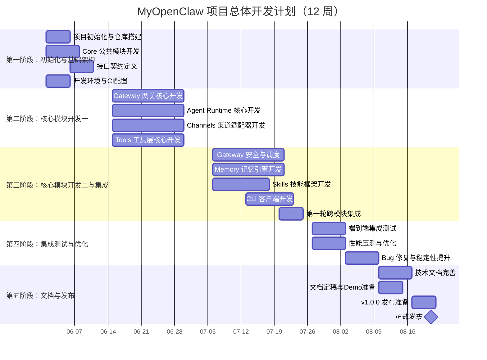
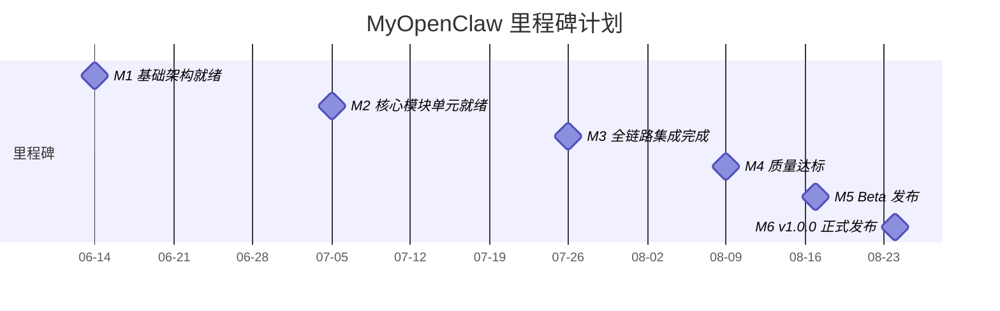
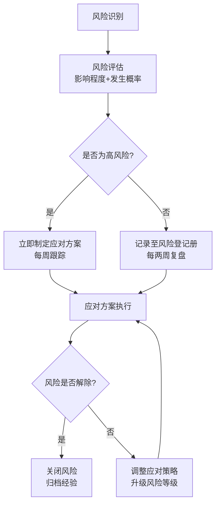
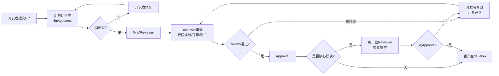
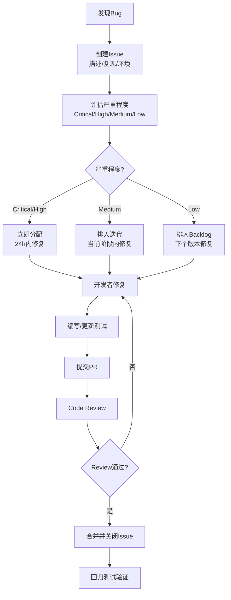

# MyOpenClaw 项目开发计划

> **版本**：v1.1.2  
> **修订日期**：2026-08-04  
> **修订人**：MyOpenClaw Core Team  
> **文档状态**：正式发布（已同步代码全部完整实现状态）

---

## 目录

- [1. 项目概述与目标](#1-项目概述与目标)
  - [1.1 项目背景](#11-项目背景)
  - [1.2 项目范围](#12-项目范围)
  - [1.3 核心交付物](#13-核心交付物)
  - [1.4 成功标准](#14-成功标准)
- [2. 团队组成与角色定义](#2-团队组成与角色定义)
  - [2.1 团队概览](#21-团队概览)
  - [2.2 开发者A：Gateway 网关层 + Core 公共模块负责人](#22-开发者agateway-网关层--core-公共模块负责人)
  - [2.3 开发者B：Agent Runtime 运行时层 + Memory 记忆层负责人](#23-开发者bagent-runtime-运行时层--memory-记忆层负责人)
  - [2.4 开发者C：Channels 渠道层 + Tools/Skills 工具层负责人](#24-开发者cchannels-渠道层--toolsskills-工具层负责人)
- [3. 项目总体时间规划](#3-项目总体时间规划)
  - [3.1 总体时间规划说明](#31-总体时间规划说明)
  - [3.2 总体甘特图](#32-总体甘特图)
  - [3.3 阶段概览](#33-阶段概览)
- [4. 各阶段详细任务分解](#4-各阶段详细任务分解)
  - [4.1 第一阶段：项目初始化与基础架构搭建（第1-2周）](#41-第一阶段项目初始化与基础架构搭建第1-2周)
  - [4.2 第二阶段：核心模块开发第一阶段（第3-5周）](#42-第二阶段核心模块开发第一阶段第3-5周)
  - [4.3 第三阶段：核心模块开发第二阶段与集成（第6-8周）](#43-第三阶段核心模块开发第二阶段与集成第6-8周)
  - [4.4 第四阶段：集成测试与优化（第9-10周）](#44-第四阶段集成测试与优化第9-10周)
  - [4.5 第五阶段：文档完善与发布准备（第11-12周）](#45-第五阶段文档完善与发布准备第11-12周)
- [5. 里程碑计划](#5-里程碑计划)
- [6. 风险管理](#6-风险管理)
- [7. 沟通与协作机制](#7-沟通与协作机制)
- [8. 质量管理](#8-质量管理)

---

> **当前进度（2026-08-04）**：
> - **全部 9 大核心模块已完整实现**：Gateway 网关层、Core 公共模块、Agents 智能体运行时、Tools 工具执行层、Channels 渠道适配层、Memory 持久记忆引擎、Skills 业务技能层、Hooks 生命周期钩子、Services 服务层
> - **三个客户端全部可用**：Web 客户端（React 18）、TUI 客户端（Ink 4.x + Textual Python）、CLI 客户端（Commander 12.x 含 8 个子命令）
> - **LLM 适配器**：DeepSeek / OpenAI / Claude / Local 四套适配器全部完整实现
> - **渠道适配器**：QQBot、飞书、微信、WebChat、CLI 五个渠道全部完整实现
> - **内置工具**：21 个（文件、Shell、浏览器、HTTP、天气、汇率、加密等）
> - **测试资产**：Server 端 1056 个测试用例，单元测试 + 集成测试覆盖核心模块
> - **全链路消息流已打通**：Channels/Clients → Gateway → Agent Runtime → Tools/Memory 全流程可运行

---

## 1. 项目概述与目标

### 1.1 项目背景

MyOpenClaw 是一个本地优先（Local-First）、自托管的开源 AI Agent 框架，采用 TypeScript + Node.js 开发，基于 MIT 协议开源。项目旨在为开发者和企业提供一套完整、可扩展、可私有化部署的智能体运行时平台，使 AI Agent 能够以可控、可观测、可定制的方式接入各类业务渠道，并通过工具与技能完成复杂任务。

MyOpenClaw 采用 **Hub-Spoke 六层架构**，自上而下分别为：

1. **Channels 渠道接入层**：统一适配 QQBot、飞书、微信、WebChat 等多渠道消息协议。
2. **Gateway 网关控制平面**：提供 WebSocket/HTTP 服务，承担消息路由、状态管理、安全沙箱、定时调度、审计日志等控制面职责。
3. **Agent Runtime 智能体运行时**：基于 Lobster Orchestrator 编排多智能体协作，包含 Planner 规划器、LLM 多模型适配器、执行循环。
4. **Skill/Tools 工具执行层**：Skills 为基于 SKILL.md 的描述式业务技能，Tools 为底层可执行工具（文件、Shell、浏览器、记忆检索、网络请求）。
5. **Memory 持久存储层**：提供 Session 短期记忆、Vector 向量记忆、Persist 持久化能力。
6. **Clients 客户端层**：为用户提供直接交互界面的入口，包含 Web 客户端（React 18 + Vite）、TUI 客户端（Ink 4.x + Textual Python）、CLI 客户端（Commander 12.x）三种形态，通过 WebSocket / HTTP 直连 Gateway。

### 1.2 项目范围

本项目范围涵盖 MyOpenClaw 框架的核心运行时实现、全渠道接入适配、工具与技能体系、持久记忆引擎、命令行客户端，以及配套的技术文档体系。具体范围如下：

**包含范围**：

- Gateway 网关控制平面完整实现（路由、状态、安全、审计、调度）
- Channels 全渠道适配器（QQBot、飞书、微信、WebChat）
- Agent Runtime 智能体运行时（Orchestrator、Planner、LLM 适配器、执行循环）
- Tools 工具执行层（注册中心、文件、Shell、浏览器、记忆检索、网络请求）
- Skills 业务技能层（SKILL.md 描述式技能框架）
- Memory 持久记忆引擎（Session、Vector、Persist）
- Core 公共模块（Message 结构体、类型定义、Schema 校验、错误码）
- Hooks 生命周期钩子机制
- CLI 命令行交互客户端
- 完整技术文档体系（19 份文档）

**不包含范围**：

- 云托管 SaaS 服务的运营与运维
- 移动端原生 App 开发
- 第三方 LLM 模型训练与微调
- 企业级 SSO 单点登录集成（预留接口，不在首期实现）

### 1.3 核心交付物

| 交付物类别 | 交付物名称 | 交付说明 |
| --- | --- | --- |
| 源代码 | MyOpenClaw 核心框架源码 | 9 大模块完整实现，TypeScript 编写，MIT 协议 |
| 可执行产物 | npm 发布包 | 可通过 `npm install -g myopenclaw` 全局安装 |
| 发布资产 | npm 发布包与本地构建产物 | 支持一键本地安装 |
| 配置示例 | 渠道接入配置示例 | QQBot/飞书/微信/WebChat 接入配置模板 |
| 技术文档 | 19 份技术文档 | 架构、开发、客户端、用户使用全套文档 |
| 测试资产 | 单元测试与集成测试套件 | 覆盖率不低于 80% |
| 演示项目 | 示例 Skill 与 Demo 场景 | 至少 3 个可运行的业务技能示例 |

### 1.4 成功标准

项目成功的判定标准如下：

1. **功能完整性**：所有 P0 优先级功能点 100% 交付，P1 优先级功能点交付率不低于 90%，P2 优先级功能点交付率不低于 70%。
2. **架构合理性**：Hub-Spoke 六层架构清晰解耦，模块间通过明确定义的接口通信，单一模块可独立替换。
3. **代码质量**：单元测试覆盖率不低于 80%，集成测试覆盖率不低于 60%，静态检查零 Error、零高严重度 Warning。
4. **性能指标**：单实例 Gateway 支持 1000 并发会话，消息端到端延迟 P95 不超过 2 秒，冷启动时间不超过 5 秒。
5. **可安装性**：提供 npm 发布包与本地构建产物，本地安装启动可在 15 分钟内完成。
6. **文档完整性**：19 份技术文档全部完成，文档与代码一致性校验通过。
7. **社区就绪**：README、CONTRIBUTING、LICENSE、CHANGELOG 完备，具备开源发布条件。

---

## 2. 团队组成与角色定义

### 2.1 团队概览

MyOpenClaw 项目由 3 人核心开发团队组成，采用模块化分工模式，每位开发者负责一个或多个架构层的完整实现。团队遵循"高内聚、低耦合"的分工原则，确保每位开发者在自己的领域内拥有完整的决策权，同时通过明确定义的接口与其他开发者协作。

| 角色 | 负责架构层 | 核心模块 | 工作占比 |
| --- | --- | --- | --- |
| 开发者A | Gateway 网关控制平面 + Core 公共模块 | gateway、core | 约 35% |
| 开发者B | Agent Runtime 运行时层 + Memory 记忆层 | agents、memory | 约 35% |
| 开发者C | Channels 渠道层 + Tools/Skills 工具层 | channels、tools、skills、hooks、cli | 约 30% |

> 说明：工作占比反映各角色的工作量预估，实际执行中可根据进度动态调整。三位开发者共同承担文档编写、代码 Review、测试编写等横向工作。

### 2.2 开发者A：Gateway 网关层 + Core 公共模块负责人

**角色定位**：开发者A 是 MyOpenClaw 的"控制平面架构师"，负责 Gateway 网关的完整实现以及作为全项目基础的 Core 公共模块。Gateway 是整个系统的入口与调度中枢，Core 是所有模块共享的类型与工具基础，因此该角色对系统的整体稳定性和规范性具有决定性影响。

**主要职责**：

1. 设计并实现 Gateway 网关服务，包括 WebSocket/HTTP 服务端、消息路由、会话状态管理、安全沙箱、定时调度器、审计日志系统。
2. 设计并实现 Core 公共模块，包括 Message 消息结构体、全局类型定义、JSON Schema 校验工具、统一错误码体系。
3. 定义 Gateway 与上下游模块（Channels、Agent Runtime）的接口规范，维护接口契约文档。
4. 负责网关层的性能优化与压力测试，确保满足并发与延迟指标。
5. 参与跨模块集成方案评审，确保 Core 类型被各模块正确使用。
6. 编写所负责模块的技术文档、单元测试与集成测试。

**技能要求**：

- 精通 TypeScript 与 Node.js，熟悉 Node.js 事件循环与流处理机制
- 熟悉 WebSocket、HTTP/2 协议，具备高并发服务端开发经验
- 熟悉 JSON Schema、Zod 等数据校验方案
- 熟悉 Node.js 安全沙箱机制（vm2、isolated-vm 等）
- 熟悉定时任务调度（cron 表达式、分布式锁）
- 具备 RESTful API 与 WebSocket 接口设计能力
- 熟悉 Jest/Vitest 测试框架

**负责模块列表**：

| 模块 | 子模块/文件 | 说明 |
| --- | --- | --- |
| gateway | server.ts | WebSocket/HTTP 服务入口 |
| gateway | router/ | 消息路由与分发 |
| gateway | state/ | 会话状态管理 |
| gateway | security/ | 安全沙箱与权限控制 |
| gateway | audit/ | 审计日志 |
| gateway | scheduler/ | 定时调度器 |
| core | message.ts | Message 结构体定义 |
| core | schema/ | JSON Schema 校验工具 |
| core | types/ | 全局类型定义 |
| core | errors.ts | 统一错误码 |

### 2.3 开发者B：Agent Runtime 运行时层 + Memory 记忆层负责人

**角色定位**：开发者B 是 MyOpenClaw 的"智能体内核架构师"，负责 Agent Runtime 智能体运行时和 Memory 持久记忆引擎的完整实现。Agent Runtime 是整个系统的大脑，负责智能体的编排、规划、推理与执行循环；Memory 是智能体的长期记忆基础，决定了智能体的上下文连续性与知识沉淀能力。该角色对系统的智能表现与数据可靠性具有决定性影响。

**主要职责**：

1. 设计并实现 Agent Runtime 智能体运行时，包括 Lobster Orchestrator 编排器、Planner 规划器、LLM 多模型适配器、执行循环（Loop）。
2. 设计并实现 Memory 持久记忆引擎，包括 Session 短期记忆、Vector 向量记忆、Persist 持久化层。
3. 定义 Agent Runtime 与 Tools、Memory、Gateway 的接口规范。
4. 负责 LLM 多模型适配（OpenAI、Anthropic、本地模型等），实现统一的模型调用抽象层。
5. 负责记忆引擎的存储后端适配（SQLite、PostgreSQL、向量数据库等）。
6. 负责智能体执行循环的稳定性与容错处理，确保工具调用失败时的优雅降级。
7. 编写所负责模块的技术文档、单元测试与集成测试。

**技能要求**：

- 精通 TypeScript 与 Node.js，熟悉异步编程与并发控制
- 熟悉 LLM 应用开发，了解 OpenAI、Anthropic 等 API 及其流式响应处理
- 熟悉 Agent 编排模式（ReAct、Plan-and-Execute、Multi-Agent）
- 熟悉向量数据库（Chroma、Qdrant、pgvector 等）与 Embedding 模型
- 熟悉 SQLite、PostgreSQL 等 SQL 数据库及 ORM（Drizzle/Prisma）
- 熟悉提示词工程与上下文管理
- 具备分布式状态管理与持久化设计能力

**负责模块列表**：

| 模块 | 子模块/文件 | 说明 |
| --- | --- | --- |
| agents | orchestrator.ts | Lobster 多智能体编排器 |
| agents | planner.ts | 任务规划器 |
| agents | llm/ | LLM 多模型适配器 |
| agents | loop/ | 执行循环（ReAct 等） |
| memory | session.ts | Session 短期记忆 |
| memory | vector.ts | Vector 向量记忆 |
| memory | persist.ts | Persist 持久化层 |

### 2.4 开发者C：Channels 渠道层 + Tools/Skills 工具层负责人

**角色定位**：开发者C 是 MyOpenClaw 的"生态边界架构师"，负责 Channels 全渠道适配层、Tools 工具执行层、Skills 业务技能层，以及 Hooks 钩子机制和 CLI 命令行客户端。该角色负责 MyOpenClaw 与外部世界的所有交互边界——上游对接用户所在的各种即时通讯渠道，下游对接智能体可调用的各类工具与技能。该角色对系统的生态扩展性与用户体验具有决定性影响。

**主要职责**：

1. 设计并实现 Channels 渠道适配层，包括 ChannelProvider 基类接口以及 QQBot、飞书、微信、WebChat 适配器。
2. 设计并实现 Tools 工具执行层，包括 ToolRegistry 工具注册中心、文件工具、Shell 执行工具、浏览器自动化工具、记忆检索工具、网络请求工具。
3. 设计并实现 Skills 业务技能层，基于 SKILL.md 描述式技能框架，支持技能的声明式定义与动态加载。
4. 设计并实现 Hooks 生命周期钩子机制，支持在关键节点注入自定义逻辑。
5. 设计并实现 CLI 命令行交互客户端，支持本地调试、会话管理、技能管理。
6. 定义 Channels 与 Gateway、Agent Runtime 与 Tools 的接口规范。
7. 编写所负责模块的技术文档、单元测试与集成测试，提供示例 Skill 与 Demo 场景。

**技能要求**：

- 精通 TypeScript 与 Node.js，熟悉适配器模式与插件化架构
- 熟悉 QQ Bot API、飞书开放平台 SDK、微信公众平台 API
- 熟悉浏览器自动化（Playwright/Puppeteer）
- 熟悉 Node.js 子进程管理与 Shell 执行安全控制
- 熟悉 CLI 框架（Commander/Yargs/Inquirer）
- 熟悉文件系统操作与流处理
- 具备插件化、可扩展架构设计能力

**负责模块列表**：

| 模块 | 子模块/文件 | 说明 |
| --- | --- | --- |
| channels | base.ts | ChannelProvider 基类 |
| channels | qqbot/ | QQBot 适配器 |
| channels | wechat/ | WeChat 适配器 |
| channels | feishu/ | 飞书适配器 |
| channels | webchat/ | WebChat 适配器 |
| tools | registry.ts | ToolRegistry 工具注册中心 |
| tools | browser/ | 浏览器自动化工具 |
| tools | fs/ | 文件系统工具 |
| tools | exec/ | Shell 执行工具 |
| tools | memory_search/ | 记忆检索工具 |
| tools | http/ | 网络请求工具 |
| skills | SKILL.md 框架 | 描述式技能框架 |
| hooks | lifecycle 钩子 | 生命周期钩子 |
| cli | 命令行客户端 | CLI 交互客户端 |

---

## 3. 项目总体时间规划

### 3.1 总体时间规划说明

MyOpenClaw 项目总工期为 **12 周**（约 3 个月），自 2026 年 6 月 1 日启动，至 2026 年 8 月 24 日完成 v1.0.0 正式发布。项目划分为 5 个阶段，每个阶段有明确的目标、交付物与验收标准。阶段之间存在前后依赖关系，但部分任务可在阶段内并行推进，以充分利用 3 人团队的并行开发能力。

项目时间规划遵循以下原则：

1. **基础先行**：Core 公共模块与接口契约在第一阶段优先完成，为后续模块开发奠定基础。
2. **并行推进**：三位开发者在各自负责的模块上并行开发，通过接口契约解耦。
3. **增量集成**：每个阶段结束时进行一次集成，及早发现问题。
4. **缓冲预留**：第四阶段预留专门的测试与优化时间，第五阶段预留文档与发布缓冲。
5. **里程碑驱动**：每个阶段设置明确里程碑，作为进度检查点。

### 3.2 总体甘特图

### 3.3 阶段概览

| 阶段 | 阶段名称 | 时间区间 | 持续 | 核心目标 |
| --- | --- | --- | --- | --- |
| 一 | 项目初始化与基础架构搭建 | 第1-2周（06-01 ~ 06-14） | 2 周 | 完成项目骨架、Core 模块、接口契约 |
| 二 | 核心模块开发（第一阶段） | 第3-5周（06-15 ~ 07-05） | 3 周 | 完成 Gateway、Agent Runtime、Channels、Tools 核心功能 |
| 三 | 核心模块开发（第二阶段）与集成 | 第6-8周（07-06 ~ 07-26） | 3 周 | 完成 Memory、Skills、CLI，进行首轮集成 |
| 四 | 集成测试与优化 | 第9-10周（07-27 ~ 08-09） | 2 周 | 端到端测试、性能优化、Bug 修复 |
| 五 | 文档完善与发布准备 | 第11-12周（08-10 ~ 08-24） | 2 周 | 文档定稿、v1.0.0 发布 |

---

## 4. 各阶段详细任务分解

### 4.1 第一阶段：项目初始化与基础架构搭建（第1-2周）

**阶段目标**：完成项目工程化基础设施搭建，交付 Core 公共模块与全部跨模块接口契约，为后续并行开发奠定基础。

**阶段时间**：2026-06-01 ~ 2026-06-14

#### 任务列表

| 任务编号 | 任务名称 | 负责人 | 预计工时 | 交付物 | 依赖关系 |
| --- | --- | --- | --- | --- | --- |
| P1-T01 | 项目仓库初始化与 Monorepo 结构搭建 | A | 8h | Git 仓库、pnpm workspace 配置、目录结构 | 无 |
| P1-T02 | TypeScript 编译配置与 ESLint/Prettier 规则 | A | 6h | tsconfig.json、.eslintrc、.prettierrc | P1-T01 |
| P1-T03 | CI/CD 流水线配置（GitHub Actions） | A | 8h | .github/workflows、自动化构建检查 | P1-T01 |
| P1-T04 | Core Message 结构体定义 | A | 12h | core/message.ts、类型定义 | P1-T01 |
| P1-T05 | Core Schema 校验工具与错误码体系 | A | 10h | core/schema/、core/errors.ts | P1-T04 |
| P1-T06 | 跨模块接口契约文档编写 | A、B、C | 16h | 接口契约文档（5 份接口定义） | P1-T04 |
| P1-T07 | Agent Runtime 架构设计与技术选型 | B | 12h | 架构设计文档、技术选型说明 | P1-T01 |
| P1-T08 | Memory 存储后端技术选型与原型验证 | B | 10h | 技术选型报告、存储原型 | P1-T01 |
| P1-T09 | LLM 多模型适配层接口设计 | B | 8h | LLM 适配层接口定义 | P1-T04 |
| P1-T10 | Channels 适配器基类设计 | C | 10h | channels/base.ts、适配器规范 | P1-T04 |
| P1-T11 | Tools 工具注册中心接口设计 | C | 8h | tools/registry.ts 接口定义 | P1-T04 |
| P1-T12 | 开发环境统一与文档模板 | C | 6h | 开发环境说明、文档模板 | P1-T01 |

#### 阶段里程碑

**里程碑 M1：基础架构就绪**（2026-06-14）

- Core 公共模块完成，Message 结构体与 Schema 校验可用
- 全部跨模块接口契约文档评审通过
- CI/CD 流水线就绪，代码提交自动触发构建检查
- Monorepo 结构搭建完成，三位开发者可并行开发

#### 阶段验收标准

1. `pnpm install` 与 `pnpm build` 在干净环境执行成功
2. Core 模块单元测试覆盖率不低于 80%
3. 接口契约文档经三位开发者评审签字确认
4. CI/CD 流水线对 PR 自动执行 lint、type-check、unit-test

---

### 4.2 第二阶段：核心模块开发第一阶段（第3-5周）

**阶段目标**：完成 Gateway、Agent Runtime、Channels、Tools 四大模块的核心功能开发，各模块可独立运行并通过单元测试。

**阶段时间**：2026-06-15 ~ 2026-07-05

#### 任务列表

| 任务编号 | 任务名称 | 负责人 | 预计工时 | 交付物 | 依赖关系 |
| --- | --- | --- | --- | --- | --- |
| P2-T01 | Gateway WebSocket/HTTP 服务端实现 | A | 16h | gateway/server.ts | P1-T04 |
| P2-T02 | Gateway 消息路由与分发机制 | A | 14h | gateway/router/ | P2-T01 |
| P2-T03 | Gateway 会话状态管理 | A | 12h | gateway/state/ | P2-T01 |
| P2-T04 | Gateway 审计日志系统 | A | 10h | gateway/audit/ | P2-T01 |
| P2-T05 | Lobster Orchestrator 编排器实现 | B | 20h | agents/orchestrator.ts | P1-T07 |
| P2-T06 | Planner 任务规划器实现 | B | 16h | agents/planner.ts | P2-T05 |
| P2-T07 | LLM OpenAI 适配器实现 | B | 12h | agents/llm/openai.ts | P1-T09 |
| P2-T08 | LLM Anthropic 适配器实现 | B | 10h | agents/llm/anthropic.ts | P1-T09 |
| P2-T09 | Agent 执行循环（ReAct）实现 | B | 14h | agents/loop/ | P2-T05 |
| P2-T10 | ChannelProvider 基类完整实现 | C | 10h | channels/base.ts | P1-T10 |
| P2-T11 | QQBot 渠道适配器实现 | C | 14h | channels/qqbot/ | P2-T10 |
| P2-T12 | WeChat 渠道适配器实现 | C | 12h | channels/wechat/ | P2-T10 |
| P2-T13 | ToolRegistry 工具注册中心实现 | C | 10h | tools/registry.ts | P1-T11 |
| P2-T14 | 文件系统工具实现 | C | 10h | tools/fs/ | P2-T13 |
| P2-T15 | Shell 执行工具实现 | C | 12h | tools/exec/ | P2-T13 |
| P2-T16 | 网络请求工具实现 | C | 8h | tools/http/ | P2-T13 |
| P2-T17 | 各模块单元测试编写 | A、B、C | 24h | 测试套件 | P2-T01 ~ P2-T16 |

#### 阶段里程碑

**里程碑 M2：核心模块单元就绪**（2026-07-05）

- Gateway 可独立启动并处理 WebSocket 连接
- Agent Runtime 可独立运行 ReAct 循环并调用 LLM
- Channels 的 QQBot、WeChat 适配器可收发消息
- Tools 的文件、Shell、网络工具可独立调用
- 各模块单元测试覆盖率不低于 75%

#### 阶段验收标准

1. Gateway 可启动并接受 WebSocket 连接，返回心跳响应
2. Agent Runtime 可使用 OpenAI/Anthropic 完成一次完整 ReAct 循环
3. QQBot/WeChat 适配器可接收用户消息并回显
4. 文件、Shell、网络工具可通过 ToolRegistry 注册并被调用
5. 各模块单元测试全部通过，覆盖率达标

---

### 4.3 第三阶段：核心模块开发第二阶段与集成（第6-8周）

**阶段目标**：完成 Memory、Skills、CLI、Hooks 模块开发，完成 Gateway 安全沙箱与调度器，进行首轮跨模块集成，打通 Channels → Gateway → Agent Runtime → Tools/Memory 全链路。

**阶段时间**：2026-07-06 ~ 2026-07-26

#### 任务列表

| 任务编号 | 任务名称 | 负责人 | 预计工时 | 交付物 | 依赖关系 |
| --- | --- | --- | --- | --- | --- |
| P3-T01 | Gateway 安全沙箱实现 | A | 16h | gateway/security/ | P2-T01 |
| P3-T02 | Gateway 定时调度器实现 | A | 12h | gateway/scheduler/ | P2-T01 |
| P3-T03 | Gateway 与 Channels 下行消息接口 | A | 10h | 下行接口实现 | P2-T02 |
| P3-T04 | Gateway 与 Agent Runtime 任务下发接口 | A | 10h | 任务下发实现 | P2-T02 |
| P3-T05 | Memory Session 短期记忆实现 | B | 14h | memory/session.ts | P1-T08 |
| P3-T06 | Memory Vector 向量记忆实现 | B | 16h | memory/vector.ts | P1-T08 |
| P3-T07 | Memory Persist 持久化层实现 | B | 12h | memory/persist.ts | P1-T08 |
| P3-T08 | Agent Runtime 与 Memory 集成 | B | 10h | 集成代码 | P3-T05、P2-T09 |
| P3-T09 | 飞书渠道适配器实现 | C | 14h | channels/feishu/ | P2-T10 |
| P3-T10 | WebChat 渠道适配器实现 | C | 12h | channels/webchat/ | P2-T10 |
| P3-T11 | 浏览器自动化工具实现 | C | 16h | tools/browser/ | P2-T13 |
| P3-T12 | 记忆检索工具实现 | C | 10h | tools/memory_search/ | P3-T06 |
| P3-T13 | Skills SKILL.md 描述式技能框架 | C | 16h | skills/ 框架 | P2-T13 |
| P3-T14 | Hooks 生命周期钩子机制 | C | 10h | hooks/ | P2-T01 |
| P3-T15 | CLI 命令行客户端实现 | C | 14h | cli/ | P2-T01 |
| P3-T16 | 首轮跨模块集成（全链路打通） | A、B、C | 20h | 集成版本 | P3-T01 ~ P3-T14 |
| P3-T17 | 集成测试用例编写 | A、B、C | 16h | 集成测试套件 | P3-T16 |

#### 阶段里程碑

**里程碑 M3：全链路集成完成**（2026-07-26）

- Channels → Gateway → Agent Runtime → Tools/Memory 全链路打通
- 用户可通过 QQBot/微信/飞书/WebChat 与智能体对话
- 智能体可调用工具完成任务并读写记忆
- CLI 客户端可连接本地 Gateway 进行调试
- 首轮集成测试通过，系统具备端到端可用性

#### 阶段验收标准

1. 从 QQBot 发送消息，经 Gateway 路由到 Agent Runtime，智能体回复并经 Gateway 下行回到 QQBot
2. 智能体可在 ReAct 循环中调用文件、Shell、浏览器、网络工具
3. Session 记忆可在多轮对话中保持上下文，Vector 记忆可检索历史相似记忆
4. CLI 可启动本地 Gateway 并与智能体交互
5. Skills 框架可加载 SKILL.md 描述的技能并被智能体调用
6. 集成测试覆盖核心业务场景，通过率不低于 90%

---

### 4.4 第四阶段：集成测试与优化（第9-10周）

**阶段目标**：进行全面端到端集成测试、性能压测与优化，修复发现的 Bug，提升系统稳定性与性能指标，达到发布质量标准。

**阶段时间**：2026-07-27 ~ 2026-08-09

#### 任务列表

| 任务编号 | 任务名称 | 负责人 | 预计工时 | 交付物 | 依赖关系 |
| --- | --- | --- | --- | --- | --- |
| P4-T01 | 端到端场景测试用例设计与执行 | A、B、C | 24h | E2E 测试报告 | P3-T17 |
| P4-T02 | 多渠道并发场景测试 | A | 12h | 并发测试报告 | P4-T01 |
| P4-T03 | Gateway 性能压测 | A | 14h | 压测报告、优化记录 | P4-T02 |
| P4-T04 | Gateway 性能优化（连接池、缓存等） | A | 12h | 优化后代码 | P4-T03 |
| P4-T05 | Agent Runtime 稳定性测试（长会话、异常恢复） | B | 14h | 稳定性测试报告 | P4-T01 |
| P4-T06 | Memory 性能优化与索引调优 | B | 12h | 优化后代码 | P4-T05 |
| P4-T07 | LLM 调用健壮性优化（重试、超时、降级） | B | 10h | 优化后代码 | P4-T05 |
| P4-T08 | Channels 异常场景测试（断线重连、消息丢失） | C | 12h | 异常测试报告 | P4-T01 |
| P4-T09 | Tools 安全性测试（沙箱逃逸、注入防护） | C | 14h | 安全测试报告 | P4-T01 |
| P4-T10 | Bug 修复与回归测试 | A、B、C | 30h | 修复记录、回归报告 | P4-T01 ~ P4-T09 |
| P4-T11 | 测试覆盖率提升至目标值 | A、B、C | 16h | 覆盖率报告 | P4-T10 |

#### 阶段里程碑

**里程碑 M4：质量达标**（2026-08-09）

- 全部 P0、P1 功能点测试通过
- 单元测试覆盖率不低于 80%，集成测试覆盖率不低于 60%
- 性能指标达标（1000 并发、P95 延迟 < 2s、冷启动 < 5s）
- 无严重（Critical）与高（High）级别未修复 Bug
- 安全测试无高危漏洞

#### 阶段验收标准

1. 端到端测试覆盖全部核心业务场景，通过率 100%
2. 性能压测报告显示满足成功标准中的性能指标
3. 安全测试无高危漏洞，沙箱逃逸测试通过
4. Bug 追踪系统中无 Critical/High 级别未关闭项
5. 代码静态检查零 Error、零高严重度 Warning

---

### 4.5 第五阶段：文档完善与发布准备（第11-12周）

**阶段目标**：完成全部技术文档定稿，准备发布资产，完成 v1.0.0 正式发布。

**阶段时间**：2026-08-10 ~ 2026-08-24

#### 任务列表

| 任务编号 | 任务名称 | 负责人 | 预计工时 | 交付物 | 依赖关系 |
| --- | --- | --- | --- | --- | --- |
| P5-T01 | 技术文档体系完善与评审 | A、B、C | 24h | 19 份技术文档定稿 | P4-T11 |
| P5-T02 | README 与 CONTRIBUTING 编写 | A | 8h | README.md、CONTRIBUTING.md | P5-T01 |
| P5-T06 | 示例 Skills 与 Demo 场景开发 | B、C | 20h | 3 个示例技能、Demo | P4-T11 |
| P5-T07 | CLI 使用文档与示例 | C | 8h | CLI 文档、示例脚本 | P5-T01 |
| P5-T08 | npm 发布包构建与验证 | A | 8h | npm 包、发布验证 | P5-T01 |
| P5-T09 | 发布前全量回归测试 | A、B、C | 12h | 回归测试报告 | P5-T01 ~ P5-T08 |
| P5-T10 | LICENSE、CHANGELOG 与开源治理 | A | 6h | LICENSE、CHANGELOG.md | P5-T01 |
| P5-T11 | v1.0.0 正式发布 | A、B、C | 8h | GitHub Release、npm 发布 | P5-T09、P5-T10 |

#### 阶段里程碑

本阶段包含两个里程碑：

**里程碑 M5：Beta 发布**（2026-08-17）

- Beta 版 npm 包发布
- 技术文档初稿完成
- 示例技能可演示
- Beta 版可本地运行，面向早期用户收集反馈

**里程碑 M6：v1.0.0 正式发布**（2026-08-24）

- 19 份技术文档全部定稿并发布
- npm 包发布成功
- 本地安装启动在全新环境验证通过（15 分钟内完成）
- 3 个示例技能可运行
- GitHub Release v1.0.0 发布，开源治理文件完备

#### 阶段验收标准

1. 19 份技术文档全部完成，经评审无重大问题
2. 全新环境使用源码构建启动成功，15 分钟内完成
3. npm 包可通过 `npm install -g myopenclaw` 安装并运行
4. 3 个示例技能可运行
5. 发布前回归测试 100% 通过
6. GitHub Release v1.0.0 发布成功，包含完整 Release Notes

---

## 5. 里程碑计划

项目设置 6 个关键里程碑，作为进度检查与阶段验收的节点。每个里程碑有明确的达成日期、交付物清单与验收标准。

### 里程碑详情

| 里程碑 | 名称 | 达成日期 | 交付物清单 | 验收标准 |
| --- | --- | --- | --- | --- |
| M1 | 基础架构就绪 | 2026-06-14 | Core 模块、接口契约文档、CI/CD 流水线、Monorepo 结构 | Core 单测覆盖率≥80%；接口契约经三人评审；CI 自动化运行 |
| M2 | 核心模块单元就绪 | 2026-07-05 | Gateway、Agent Runtime、Channels（QQBot/微信）、Tools（fs/exec/http） | 各模块独立运行通过；单测覆盖率≥75%；核心功能可用 |
| M3 | 全链路集成完成 | 2026-07-26 | Memory、Skills、CLI、Hooks、全链路集成版本 | 全链路消息打通；智能体可调用工具与记忆；集成测试通过率≥90% |
| M4 | 质量达标 | 2026-08-09 | E2E 测试报告、压测报告、安全测试报告、优化后代码 | 单测≥80%、集成≥60%；性能达标；无 Critical/High Bug；安全无高危 |
| M5 | Beta 发布 | 2026-08-17 | Beta 版 npm 包、用户文档、示例技能 | Beta 版可本地运行；示例技能可演示；文档初稿完成 |
| M6 | v1.0.0 正式发布 | 2026-08-24 | v1.0.0 npm 包、19 份文档、开源治理文件 | 全新环境 15 分钟启动成功；回归测试 100% 通过；GitHub Release 发布 |

---

## 6. 风险管理

项目风险管理贯穿全生命周期。团队在每周周会上复盘风险登记册，更新风险状态，并根据风险变化调整应对策略。以下为识别的 10 项关键风险。

### 6.1 风险登记册

| 风险编号 | 风险描述 | 影响程度 | 发生概率 | 应对策略 | 负责人 |
| --- | --- | --- | --- | --- | --- |
| R01 | LLM API 速率限制与不稳定导致智能体响应延迟或失败 | 高 | 中 | 实现多模型切换与降级策略；增加请求重试与指数退避；预留本地模型适配作为兜底 | B |
| R02 | 跨模块接口契约在开发过程中频繁变更，导致集成返工 | 高 | 中 | 第一阶段冻结接口契约；接口变更须经三人评审并同步更新文档；建立接口兼容性检查 | A |
| R03 | QQBot/飞书/微信平台 API 变更或审核政策调整 | 中 | 中 | 适配器与平台 SDK 解耦；关注平台开发者公告；预留适配层抽象便于快速适配 | C |
| R04 | 向量记忆检索性能不达标，影响智能体响应延迟 | 高 | 中 | 早期进行存储后端原型验证；选择高性能向量库；建立索引调优与缓存机制 | B |
| R05 | 安全沙箱存在逃逸风险，Shell/浏览器工具执行恶意代码 | 高 | 低 | 采用 isolated-vm 等强隔离方案；工具执行白名单机制；定期进行安全渗透测试 | A、C |
| R06 | 3 人团队人力不足，关键路径任务延期导致整体进度滞后 | 高 | 中 | 关键路径任务设置缓冲；非核心功能降级至 P2；必要时调整范围与里程碑 | A、B、C |
| R07 | 智能体执行循环在长会话中出现状态丢失或死循环 | 中 | 中 | 执行循环设置最大迭代次数与超时；状态检查点持久化；异常恢复机制 | B |
| R08 | 文档与代码不一致，导致使用者无法正确部署或开发 | 中 | 中 | 文档与代码同仓库管理；CI 检查文档示例代码可运行；发布前文档评审 | A、B、C |
| R09 | npm 包依赖存在安全漏洞或版本冲突 | 中 | 中 | 定期执行 `pnpm audit`；锁定依赖版本；建立依赖升级流程与回归测试 | A |
| R10 | 性能压测发现 Gateway 无法支撑 1000 并发会话目标 | 高 | 低 | 提前在 M2 后进行初步压测；采用连接池与异步处理；必要时引入集群方案 | A |

> 影响程度与发生概率分为高、中、低三档。高影响风险须在每周周会重点跟踪，中影响风险每两周复盘一次。

### 6.2 风险应对流程

### 6.3 风险监控机制

1. **每周周会风险复盘**：每周五周会前，各负责人更新自己负责风险的状态。
2. **里程碑风险评审**：每个里程碑达成时，对全部风险进行一次完整评审。
3. **风险升级机制**：当中等风险实际发生或影响扩大时，立即升级为高风险并启动应急响应。
4. **风险预警指标**：设置关键指标（如 LLM 调用失败率、接口变更次数、压测数据）作为风险预警信号。

---

## 7. 沟通与协作机制

### 7.1 会议机制

| 会议类型 | 频率 | 时间 | 参与人 | 时长 | 目的与议程 |
| --- | --- | --- | --- | --- | --- |
| 每日站会 | 每工作日 | 09:30-09:45 | A、B、C | 15 分钟 | 昨日完成、今日计划、阻塞问题 |
| 每周周会 | 每周五 | 16:00-17:30 | A、B、C | 90 分钟 | 周进度回顾、风险复盘、下周计划 |
| 阶段评审会 | 每阶段结束 | 约定时间 | A、B、C | 120 分钟 | 阶段交付物验收、里程碑评审 |
| 接口评审会 | 按需 | 约定时间 | 相关人 | 60 分钟 | 接口契约变更评审 |
| 技术专题会 | 按需 | 约定时间 | 相关人 | 60-90 分钟 | 关键技术决策讨论 |

#### 每日站会议程

每日站会遵循以下结构，控制在 15 分钟内：

1. **昨日完成**（每人 2 分钟）：昨天完成了哪些任务，交付了什么。
2. **今日计划**（每人 2 分钟）：今天计划完成哪些任务。
3. **阻塞问题**（每人 1 分钟）：是否有阻塞问题需要协助。
4. **问题跟进**（剩余时间）：记录阻塞问题，会后由相关人跟进。

> 站会不讨论具体技术细节，复杂问题会后单独组织讨论。

#### 每周周会议程

每周周会遵循以下议程：

1. **进度回顾**（30 分钟）：对照周计划检查完成情况，更新甘特图。
2. **风险复盘**（20 分钟）：更新风险登记册，评估风险变化。
3. **下周计划**（20 分钟）：明确下周各人任务与交付物。
4. **跨模块协调**（15 分钟）：接口变更、依赖问题协调。
5. **其他事项**（5 分钟）：AOB。

### 7.2 代码 Review 流程

代码 Review 是保障代码质量的关键环节，所有代码必须经 Review 后方可合并。

#### Review 规则

| 规则项 | 说明 |
| --- | --- |
| Reviewer 指定 | PR 创建者根据模块归属指定至少一位 Reviewer；核心模块（core、gateway、agents）须指定两位 |
| Review 时效 | Reviewer 须在 1 个工作日内响应 PR |
| Approval 数量 | 非核心模块至少 1 个 Approval；核心模块至少 2 个 Approval |
| 合并方式 | 采用 Squash and Merge，保持提交历史整洁 |
| 冲突处理 | PR 创建者负责解决冲突，解决后须重新请求 Review |

### 7.3 文档协作方式

1. **文档仓库**：全部技术文档与代码同仓库管理，位于 `docs/` 目录。
2. **文档版本**：每份文档头部包含版本号、修订日期、修订人、文档状态。
3. **文档评审**：文档变更通过 PR 流程，须经至少一位非作者评审。
4. **文档工具**：使用 Markdown 编写，Mermaid 绘制图表，VS Code + Markdown Preview Enhanced 编辑。
5. **文档同步**：代码变更涉及接口或行为变化时，须同步更新对应文档，PR 中包含文档变更。
6. **文档索引**：维护 `docs/README.md` 作为文档索引，列出全部文档及其状态。

### 7.4 即时沟通

- **日常沟通**：使用即时通讯工具（如飞书/Slack）进行日常沟通，重要决策须在文档或 Issue 中记录。
- **Issue 跟踪**：所有任务、Bug、需求通过 GitHub Issue 跟踪，每个 Issue 明确负责人与里程碑。
- **技术讨论**：复杂技术讨论在 Issue 或 Discussion 中进行，结论沉淀到文档。

---

## 8. 质量管理

### 8.1 代码质量标准

| 质量维度 | 标准 | 工具 |
| --- | --- | --- |
| 代码规范 | 遵循 ESLint + Prettier 规则，零 Error | ESLint、Prettier |
| 类型安全 | 严格 TypeScript 模式，零 `any`，零类型错误 | tsc --strict |
| 命名规范 | 变量/函数 camelCase，类/接口 PascalCase，常量 UPPER_SNAKE_CASE | ESLint 规则 |
| 注释规范 | 公共 API 必须 JSDoc 注释，复杂逻辑须有解释性注释 | ESLint 规则、人工 Review |
| 函数规模 | 单函数不超过 80 行，圈复杂度不超过 15 | ESLint 规则 |
| 依赖管理 | 锁定依赖版本，新增依赖须经评审 | pnpm-lock.yaml |
| 安全性 | 无已知高危漏洞，敏感信息不入库 | pnpm audit、secret 扫描 |

### 8.2 代码 Review 清单

Reviewer 在审查代码时，须对照以下清单逐项检查：

**功能正确性**：

- [ ] 代码实现了 PR 描述的功能
- [ ] 边界条件与异常场景已处理
- [ ] 不存在明显的逻辑错误

**代码可读性**：

- [ ] 命名清晰准确，无歧义
- [ ] 函数与模块职责单一
- [ ] 复杂逻辑有注释说明
- [ ] 公共 API 有 JSDoc 注释

**测试完备性**：

- [ ] 新增功能有对应单元测试
- [ ] 测试覆盖正常、异常、边界场景
- [ ] 测试命名清晰，断言明确

**安全性**：

- [ ] 无硬编码密钥或敏感信息
- [ ] 用户输入经过校验与转义
- [ ] 工具执行有权限与沙箱控制

**性能**：

- [ ] 无明显的性能问题（如 N+1 查询、不必要的同步操作）
- [ ] 大数据量场景考虑了流式处理

**接口一致性**：

- [ ] 接口变更已同步更新接口契约文档
- [ ] 类型定义与接口契约一致

### 8.3 测试覆盖率要求

| 测试类型 | 覆盖率要求 | 覆盖范围 |
| --- | --- | --- |
| 单元测试 | 不低于 80% | 全部模块的函数与分支 |
| 集成测试 | 不低于 60% | 跨模块接口与核心业务流程 |
| 端到端测试 | 核心场景 100% | 用户视角的完整业务场景 |

测试覆盖率由 CI 自动统计，PR 不得降低整体覆盖率。各模块覆盖率门槛：

| 模块 | 单元测试覆盖率门槛 |
| --- | --- |
| core | 90% |
| gateway | 80% |
| agents | 80% |
| memory | 85% |
| channels | 75% |
| tools | 80% |
| skills | 75% |
| hooks | 80% |
| cli | 70% |

### 8.4 Bug 修复流程

#### Bug 严重程度定义

| 严重程度 | 定义 | 响应时效 | 示例 |
| --- | --- | --- | --- |
| Critical | 系统崩溃、数据丢失、安全漏洞 | 立即响应，24h 内修复 | Gateway 崩溃、沙箱逃逸 |
| High | 核心功能不可用、性能严重下降 | 24h 内响应，48h 内修复 | 智能体无法响应、消息丢失 |
| Medium | 非核心功能异常、体验问题 | 当前阶段内修复 | 某渠道消息格式错误 |
| Low | 轻微问题、优化建议 | 下个版本修复 | 文档错别字、日志格式 |

### 8.5 持续集成质量门禁

CI 流水线设置以下质量门禁，任一门禁未通过则 PR 不可合并：

| 门禁项 | 工具 | 通过标准 |
| --- | --- | --- |
| 代码规范检查 | ESLint | 零 Error、零高严重度 Warning |
| 代码格式检查 | Prettier | 全部文件格式一致 |
| 类型检查 | tsc --noEmit | 零类型错误 |
| 单元测试 | Vitest | 全部通过，覆盖率不降 |
| 集成测试 | Vitest | 全部通过 |
| 安全审计 | pnpm audit | 无高危漏洞 |
| 构建检查 | pnpm build | 构建成功 |

---

> 本文档随项目进展持续更新，任何变更须经团队评审并记录修订历史。如对计划内容有疑问或建议，请通过 GitHub Issue 反馈。
