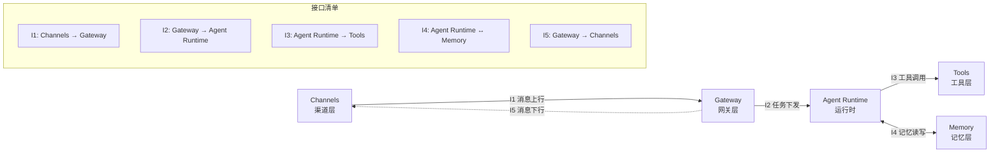
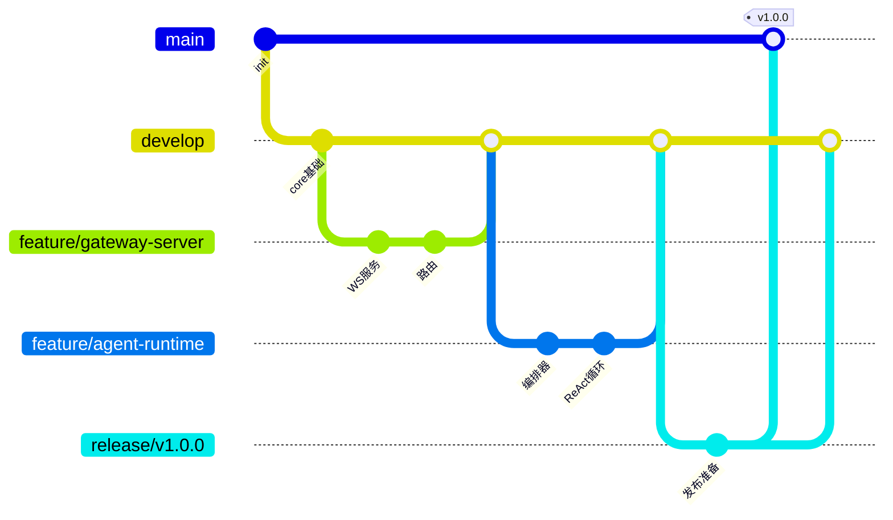
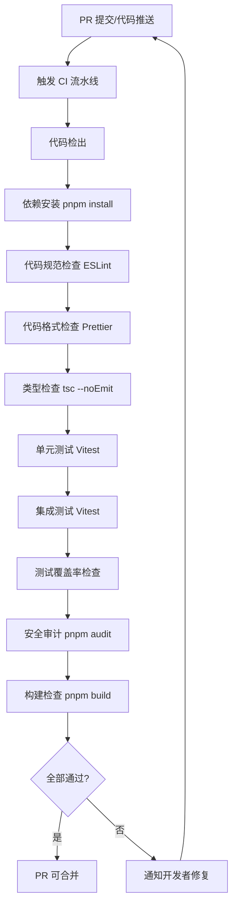
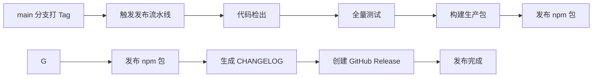
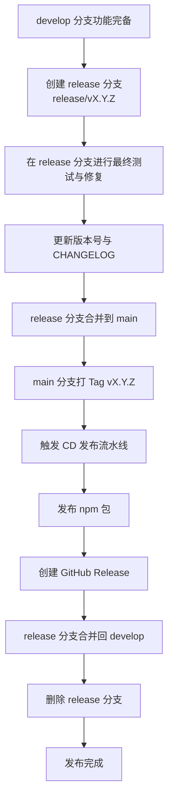
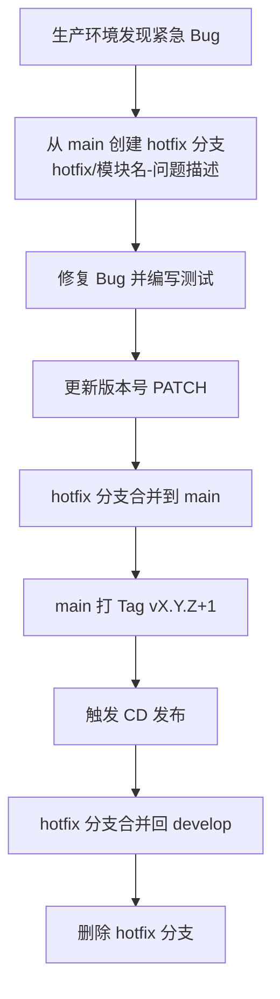
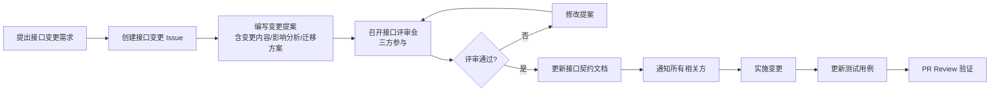

# MyOpenClaw 功能划分与责任分配

> **版本**：v1.0.0  
> **修订日期**：2026-07-21  
> **修订人**：MyOpenClaw Core Team  
> **文档状态**：正式发布

---

## 目录

- [1. 文档概述](#1-文档概述)
  - [1.1 文档目的](#11-文档目的)
  - [1.2 适用范围](#12-适用范围)
  - [1.3 术语定义](#13-术语定义)
- [2. 功能模块总体划分](#2-功能模块总体划分)
  - [2.1 模块层次结构](#21-模块层次结构)
  - [2.2 模块职责概览](#22-模块职责概览)
- [3. 各功能模块详细划分](#3-各功能模块详细划分)
  - [3.1 Gateway 网关控制平面](#31-gateway-网关控制平面)
  - [3.2 Channels 渠道接入层](#32-channels-渠道接入层)
  - [3.3 Agents 智能体运行时](#33-agents-智能体运行时)
  - [3.4 Tools 工具执行层](#34-tools-工具执行层)
  - [3.5 Skills 业务技能层](#35-skills-业务技能层)
  - [3.6 Memory 持久记忆引擎](#36-memory-持久记忆引擎)
  - [3.7 Core 公共模块](#37-core-公共模块)
  - [3.8 Hooks 生命周期钩子](#38-hooks-生命周期钩子)
  - [3.9 CLI 命令行客户端](#39-cli-命令行客户端)
- [4. 模块间接口定义与交互规范](#4-模块间接口定义与交互规范)
  - [4.1 接口总览](#41-接口总览)
  - [4.2 Channels → Gateway 接口（消息上行）](#42-channels--gateway-接口消息上行)
  - [4.3 Gateway → Agent Runtime 接口（任务下发）](#43-gateway--agent-runtime-接口任务下发)
  - [4.4 Agent Runtime → Tools 接口（工具调用）](#44-agent-runtime--tools-接口工具调用)
  - [4.5 Agent Runtime ↔ Memory 接口（记忆读写）](#45-agent-runtime--memory-接口记忆读写)
  - [4.6 Gateway → Channels 接口（消息下行）](#46-gateway--channels-接口消息下行)
- [5. 责任分配矩阵（RACI 矩阵）](#5-责任分配矩阵raci-矩阵)
- [6. 代码提交与集成流程](#6-代码提交与集成流程)
  - [6.1 Git 分支管理策略](#61-git-分支管理策略)
  - [6.2 分支命名规范](#62-分支命名规范)
  - [6.3 Commit Message 规范](#63-commit-message-规范)
  - [6.4 代码 Review 流程](#64-代码-review-流程)
  - [6.5 集成与构建流程](#65-集成与构建流程)
  - [6.6 版本发布流程](#66-版本发布流程)
- [7. 协作约定](#7-协作约定)

---

## 1. 文档概述

### 1.1 文档目的

本文档是 MyOpenClaw 项目的功能划分与责任分配权威文档，旨在为 3 人开发团队提供清晰、可执行的功能模块拆分、责任归属、接口契约与协作规范。通过本文档，团队成员能够：

1. 明确每个功能点的编号、负责人、优先级与验收标准，避免职责模糊与重复劳动。
2. 理解模块间的接口契约与交互规范，确保并行开发时的接口一致性。
3. 遵循统一的代码提交、Review、集成与发布流程，保障协作顺畅。
4. 通过 RACI 矩阵明确每个模块的执行者、负责人、咨询者与知会者。

本文档与《14-项目开发计划.md》配套使用，开发计划提供时间与里程碑，本文档提供功能与责任维度。

### 1.2 适用范围

本文档适用于 MyOpenClaw v1.0.0 版本的开发周期，涵盖 gateway、channels、agents、tools、skills、memory、core、hooks、cli 共 9 大模块的功能划分与责任分配。后续版本的变更通过《16-变更记录.md》追踪。

### 1.3 术语定义

| 术语 | 定义 |
| --- | --- |
| 功能点 | 最小可独立交付的功能单元，有唯一编号、负责人与验收标准 |
| P0 | 最高优先级，阻塞核心流程，必须在对应阶段完成 |
| P1 | 高优先级，核心功能但非阻塞，应尽量在对应阶段完成 |
| P2 | 中优先级，增强性功能，可在后续版本完成 |
| RACI | Responsible（执行者）、Accountable（负责人）、Consulted（咨询者）、Informed（知会者） |
| 上行消息 | 从渠道（Channels）流向网关（Gateway）的用户消息 |
| 下行消息 | 从网关（Gateway）流向渠道（Channels）的智能体回复 |

---

## 2. 功能模块总体划分

### 2.1 模块层次结构

MyOpenClaw 采用 Hub-Spoke 六层架构，模块层次结构如下：

```mermaid
graph TD
    subgraph 用户层
        U1[Telegram 用户]
        U2[Discord 用户]
        U3[飞书用户]
        U4[WebChat 用户]
        U5[CLI 用户]
    end

    subgraph 第一层：Channels 渠道接入层
        CH[Channels<br/>渠道适配器]
        CH1[Telegram 适配器]
        CH2[Discord 适配器]
        CH3[飞书适配器]
        CH4[WebChat 适配器]
        CH --- CH1
        CH --- CH2
        CH --- CH3
        CH --- CH4
    end

    subgraph 第二层：Gateway 网关控制平面
        GW[Gateway 网关]
        GW1[WebSocket/HTTP 服务]
        GW2[消息路由]
        GW3[状态管理]
        GW4[安全沙箱]
        GW5[定时调度]
        GW6[审计日志]
        GW --- GW1
        GW --- GW2
        GW --- GW3
        GW --- GW4
        GW --- GW5
        GW --- GW6
    end

    subgraph 第三层：Agent Runtime 智能体运行时
        AG[Agent Runtime]
        AG1[Orchestrator 编排器]
        AG2[Planner 规划器]
        AG3[LLM 适配器]
        AG4[执行循环]
        AG --- AG1
        AG --- AG2
        AG --- AG3
        AG --- AG4
    end

    subgraph 第四层：Skill/Tools 工具执行层
        SK[Skills 技能层]
        TL[Tools 工具层]
        TL1[文件工具]
        TL2[Shell 工具]
        TL3[浏览器工具]
        TL4[记忆检索工具]
        TL5[网络请求工具]
        TL --- TL1
        TL --- TL2
        TL --- TL3
        TL --- TL4
        TL --- TL5
    end

    subgraph 第六层：Memory 持久存储层
        MEM[Memory 记忆引擎]
        MEM1[Session 短期记忆]
        MEM2[Vector 向量记忆]
        MEM3[Persist 持久化]
        MEM --- MEM1
        MEM --- MEM2
        MEM --- MEM3
    end

    subgraph 公共层
        CORE[Core 公共模块]
        HOOKS[Hooks 钩子]
        CLI[CLI 客户端]
    end

    U1 --> CH
    U2 --> CH
    U3 --> CH
    U4 --> CH
    U5 --> CLI

    CH <-->|上行/下行消息| GW
    GW <-->|任务下发/结果回调| AG
    AG -->|工具调用| TL
    AG -->|技能加载| SK
    AG <-->|记忆读写| MEM
    SK -->|底层工具| TL

    CORE -.-> GW
    CORE -.-> CH
    CORE -.-> AG
    CORE -.-> TL
    CORE -.-> MEM
    HOOKS -.-> GW
    HOOKS -.-> AG
    CLI --> GW
```

### 2.2 模块职责概览

| 模块 | 层级 | 负责人 | 核心职责 | 功能点数量 |
| --- | --- | --- | --- | --- |
| gateway | 第二层 | A | 网关服务、消息路由、状态管理、安全沙箱、调度、审计 | 18 |
| channels | 第一层 | C | 全渠道消息接入与协议适配 | 14 |
| agents | 第三层 | B | 智能体编排、规划、推理、执行循环 | 16 |
| tools | 第四层 | C | 底层可执行工具注册与调用 | 14 |
| skills | 第四层 | C | 描述式业务技能框架 | 8 |
| memory | 第六层 | B | 短期/向量/持久化记忆 | 12 |
| core | 公共层 | A | 消息结构、类型、Schema、错误码 | 10 |
| hooks | 公共层 | C | 生命周期钩子机制 | 6 |
| cli | 公共层 | C | 命令行交互客户端 | 8 |

---

## 3. 各功能模块详细划分

本节对 9 大模块进行子模块级别的功能点拆分。每个功能点包含编号、名称、描述、负责人、优先级、预计工时、依赖关系与验收标准。

### 3.1 Gateway 网关控制平面

Gateway 是 MyOpenClaw 的控制平面，负责接收渠道消息、路由到智能体、管理会话状态、保障安全、调度定时任务、记录审计日志。功能点编号前缀为 **GW**。

| 功能点编号 | 功能点名称 | 功能描述 | 负责人 | 优先级 | 预计工时 | 依赖关系 | 验收标准 |
| --- | --- | --- | --- | --- | --- | --- | --- |
| GW-001 | WebSocket 服务端 | 实现 WebSocket 服务端，支持连接建立、心跳保活、消息收发 | A | P0 | 8h | CORE-001 | 连接建立成功；心跳间隔可配；断线自动检测 |
| GW-002 | HTTP 服务端 | 实现 HTTP RESTful 服务端，提供管理 API 与 Webhook 接收 | A | P0 | 6h | CORE-001 | REST API 可访问；Webhook 可接收并响应 |
| GW-003 | 消息路由分发 | 根据消息类型、渠道、会话 ID 路由消息到目标智能体 | A | P0 | 10h | GW-001 | 消息正确路由到目标 Agent；路由规则可配 |
| GW-004 | 会话状态管理 | 管理会话生命周期，包括创建、活跃、超时、销毁 | A | P0 | 10h | GW-001 | 会话状态正确流转；超时自动回收；状态可查询 |
| GW-005 | 安全沙箱 | 对工具执行提供隔离环境，限制资源访问与权限 | A | P0 | 12h | GW-001 | 沙箱内代码无法访问宿主文件系统；CPU/内存可限制 |
| GW-006 | 权限控制 | 基于角色的权限控制，限制渠道与用户可访问的智能体 | A | P1 | 8h | GW-004 | RBAC 权限校验生效；越权访问被拒绝 |
| GW-007 | 定时调度器 | 支持 cron 表达式定时任务，触发智能体或工具执行 | A | P1 | 10h | GW-001 | Cron 任务按时触发；任务可启停；执行记录可查 |
| GW-008 | 审计日志 | 记录全部关键操作日志，支持查询与导出 | A | P0 | 8h | GW-001 | 关键操作有日志；日志可按时间/类型查询；可导出 |
| GW-009 | 请求限流 | 对渠道消息进行速率限制，防止洪水攻击 | A | P1 | 6h | GW-003 | 限流规则可配；超限请求被拒绝并返回提示 |
| GW-010 | 消息队列缓冲 | 高负载时消息入队缓冲，保证消息不丢失 | A | P1 | 8h | GW-003 | 队列消息有序处理；宕机后消息可恢复 |
| GW-011 | 配置热加载 | 支持运行时配置热加载，无需重启服务 | A | P2 | 6h | GW-001 | 配置变更后自动生效；变更过程无中断 |
| GW-012 | 健康检查接口 | 提供 `/health` 与 `/ready` 探针接口 | A | P1 | 4h | GW-002 | 健康检查接口返回正确状态；K8s 可用作探针 |
| GW-013 | 优雅关闭 | 收到终止信号时等待现有请求完成再关闭 | A | P1 | 4h | GW-001 | 关闭前处理完在途请求；连接正常断开 |
| GW-014 | 指标采集 | 采集 QPS、延迟、连接数等运行指标 | A | P2 | 6h | GW-001 | 指标可通过 `/metrics` 端点获取；Prometheus 格式 |
| GW-015 | 下行消息推送 | 将智能体回复推送到目标渠道 | A | P0 | 8h | GW-003 | 消息正确推送到目标渠道；推送失败可重试 |
| GW-016 | 任务下发 Agent | 将用户消息封装为任务下发给 Agent Runtime | A | P0 | 8h | GW-003 | 任务正确下发；任务结果正确回调 |
| GW-017 | 多智能体路由 | 根据消息内容或规则路由到不同智能体 | A | P1 | 8h | GW-003 | 多 Agent 路由规则生效；路由可动态配置 |
| GW-018 | Webhook 签名验证 | 验证渠道 Webhook 请求签名，防止伪造 | A | P0 | 4h | GW-002 | 签名验证生效；无效签名请求被拒绝 |

### 3.2 Channels 渠道接入层

Channels 负责适配各类即时通讯渠道，将不同协议的消息统一为 MyOpenClaw 内部消息格式。功能点编号前缀为 **CH**。

| 功能点编号 | 功能点名称 | 功能描述 | 负责人 | 优先级 | 预计工时 | 依赖关系 | 验收标准 |
| --- | --- | --- | --- | --- | --- | --- | --- |
| CH-001 | ChannelProvider 基类 | 定义渠道适配器统一接口，包括启动、收消息、发消息、停止 | C | P0 | 8h | CORE-001 | 基类接口完整；适配器可基于基类实现 |
| CH-002 | 消息格式标准化 | 将各渠道原始消息转换为统一的 Message 结构 | C | P0 | 6h | CH-001、CORE-001 | 各渠道消息可转换为统一格式；字段无丢失 |
| CH-003 | Telegram 适配器 | 对接 Telegram Bot API，支持文本、图片、命令消息 | C | P0 | 12h | CH-001 | 可收发消息；支持命令；长轮询/Webhook 模式可切 |
| CH-004 | Discord 适配器 | 对接 Discord Gateway，支持文本、嵌入、斜杠命令 | C | P0 | 10h | CH-001 | 可收发消息；支持斜杠命令；支持频道/D M |
| CH-005 | 飞书适配器 | 对接飞书开放平台，支持文本、富文本、卡片消息 | C | P1 | 12h | CH-001 | 可收发消息；支持事件订阅；支持卡片交互 |
| CH-006 | WebChat 适配器 | 提供 Web 聊天界面与 WebSocket 接入 | C | P1 | 10h | CH-001 | Web 界面可聊天；支持多会话；支持文件上传 |
| CH-007 | 消息上行推送 | 将渠道消息推送至 Gateway | C | P0 | 6h | CH-002 | 消息正确推送至 Gateway；推送失败可重试 |
| CH-008 | 消息下行接收 | 接收 Gateway 下发的回复消息并发送到渠道 | C | P0 | 6h | CH-001 | 下行消息正确发送到渠道；发送失败有反馈 |
| CH-009 | 断线重连 | 渠道连接断开时自动重连 | C | P1 | 6h | CH-001 | 断线后自动重连；重连指数退避；重连成功恢复 |
| CH-010 | 消息去重 | 对渠道重复消息进行去重处理 | C | P1 | 4h | CH-002 | 重复消息被识别并丢弃；不误杀正常消息 |
| CH-011 | 富媒体消息支持 | 支持图片、文件、语音等富媒体消息收发 | C | P1 | 8h | CH-002 | 富媒体消息可正确收发；格式转换正确 |
| CH-012 | 渠道配置管理 | 各渠道的 Token、密钥等配置管理 | C | P0 | 4h | CH-001 | 配置可文件/环境变量加载；敏感信息加密存储 |
| CH-013 | 渠道状态监控 | 监控各渠道连接状态与消息吞吐 | C | P2 | 4h | CH-001 | 状态可查询；异常状态告警 |
| CH-014 | 多渠道并发 | 支持同时接入多个渠道实例 | C | P1 | 4h | CH-001 | 多渠道同时运行无冲突；资源隔离 |

### 3.3 Agents 智能体运行时

Agents 是 MyOpenClaw 的智能核心，负责智能体的编排、任务规划、LLM 调用与执行循环。功能点编号前缀为 **AG**。

| 功能点编号 | 功能点名称 | 功能描述 | 负责人 | 优先级 | 预计工时 | 依赖关系 | 验收标准 |
| --- | --- | --- | --- | --- | --- | --- | --- |
| AG-001 | Lobster Orchestrator 编排器 | 实现多智能体编排，管理智能体实例与协作 | B | P0 | 16h | CORE-001 | 可创建/销毁 Agent；多 Agent 可协作；状态可查询 |
| AG-002 | Planner 任务规划器 | 将用户请求分解为可执行的任务步骤 | B | P0 | 12h | AG-001 | 复杂请求可分解为步骤；步骤可依赖排序 |
| AG-003 | LLM 适配层抽象 | 定义统一的 LLM 调用接口，屏蔽不同模型差异 | B | P0 | 8h | CORE-001 | 接口统一；可切换底层模型；支持流式响应 |
| AG-004 | OpenAI 适配器 | 对接 OpenAI GPT 系列模型 API | B | P0 | 10h | AG-003 | 可调用 GPT-4/3.5；支持流式；支持函数调用 |
| AG-005 | Anthropic 适配器 | 对接 Anthropic Claude 系列模型 API | B | P1 | 8h | AG-003 | 可调用 Claude；支持流式；支持工具调用 |
| AG-006 | 本地模型适配器 | 对接 Ollama 等本地模型服务 | B | P2 | 8h | AG-003 | 可调用本地模型；支持常见开源模型 |
| AG-007 | ReAct 执行循环 | 实现 ReAct（推理-行动-观察）执行循环 | B | P0 | 12h | AG-001、AG-003 | 循环正确执行；可调用工具；可终止 |
| AG-008 | Plan-and-Execute 循环 | 实现先规划后执行的循环模式 | B | P1 | 10h | AG-002、AG-007 | 规划后逐步执行；执行失败可重新规划 |
| AG-009 | 工具调用执行 | 在循环中调用 Tools 完成任务步骤 | B | P0 | 8h | AG-007、TL-001 | 可调用注册的工具；结果正确返回 |
| AG-010 | 记忆上下文管理 | 管理对话上下文，集成 Session 与 Vector 记忆 | B | P0 | 10h | MEM-001、MEM-004 | 上下文正确拼接；记忆可检索注入 |
| AG-011 | 提示词模板管理 | 管理系统提示词、工具描述等模板 | B | P1 | 6h | AG-003 | 模板可配置；变量可替换；支持多语言 |
| AG-012 | 执行超时控制 | 对 LLM 调用与工具执行设置超时 | B | P1 | 4h | AG-007 | 超时后优雅中断；可配置超时时长 |
| AG-013 | 错误重试与降级 | LLM 调用失败时重试或切换模型降级 | B | P1 | 6h | AG-003 | 失败自动重试；可降级到备用模型 |
| AG-014 | 执行日志与追踪 | 记录智能体执行步骤、LLM 调用、工具调用 | B | P1 | 6h | AG-007 | 执行过程可追踪；日志可查询；支持调试 |
| AG-015 | 智能体配置管理 | 智能体的模型、工具、提示词等配置管理 | B | P1 | 6h | AG-001 | 配置可文件加载；可动态修改 |
| AG-016 | 多智能体协作 | 支持多个智能体分工协作完成任务 | B | P2 | 10h | AG-001 | 多 Agent 可分工；结果可汇总 |

### 3.4 Tools 工具执行层

Tools 提供智能体可调用的底层可执行工具。功能点编号前缀为 **TL**。

| 功能点编号 | 功能点名称 | 功能描述 | 负责人 | 优先级 | 预计工时 | 依赖关系 | 验收标准 |
| --- | --- | --- | --- | --- | --- | --- | --- |
| TL-001 | ToolRegistry 注册中心 | 工具注册、发现、调用的统一管理中心 | C | P0 | 10h | CORE-001 | 工具可注册；可按名查找；可列出全部工具 |
| TL-002 | 工具接口定义 | 定义工具统一接口，包括名称、描述、参数、执行 | C | P0 | 4h | TL-001 | 接口完整；参数有 Schema 校验 |
| TL-003 | 文件读取工具 | 读取指定路径文件内容 | C | P0 | 6h | TL-001 | 可读取文本文件；大文件支持流式；路径受限 |
| TL-004 | 文件写入工具 | 写入内容到指定路径文件 | C | P0 | 6h | TL-001 | 可写入文件；支持追加模式；路径受限 |
| TL-005 | 文件搜索工具 | 按模式搜索文件或文件内容 | C | P1 | 6h | TL-001 | 支持 glob 模式；支持内容搜索；结果可分页 |
| TL-006 | Shell 执行工具 | 在沙箱中执行 Shell 命令 | C | P0 | 10h | TL-001、GW-005 | 命令可执行；输出可捕获；有超时与权限控制 |
| TL-007 | 浏览器导航工具 | Playwright 浏览器页面导航 | C | P1 | 8h | TL-001 | 可打开 URL；可等待加载；可截图 |
| TL-008 | 浏览器交互工具 | 浏览器页面元素点击、输入、提取 | C | P1 | 8h | TL-007 | 可点击元素；可输入文本；可提取内容 |
| TL-009 | 记忆检索工具 | 检索 Vector 记忆中的相似内容 | C | P0 | 8h | MEM-004 | 可按语义检索；返回相似度排序；可限制数量 |
| TL-010 | 记忆写入工具 | 将内容写入 Vector 记忆 | C | P1 | 4h | MEM-004 | 可写入记忆；可设置元数据 |
| TL-011 | HTTP 请求工具 | 发送 HTTP/HTTPS 请求 | C | P0 | 6h | TL-001 | 支持 GET/POST 等；支持自定义头；有超时 |
| TL-012 | 工具执行沙箱 | 工具执行的安全隔离环境 | C | P0 | 8h | GW-005 | 执行隔离；资源限制；权限白名单 |
| TL-013 | 工具执行日志 | 记录工具调用的输入、输出、耗时 | C | P1 | 4h | TL-001 | 调用有日志；可查询；含耗时 |
| TL-014 | 工具结果格式化 | 将工具执行结果格式化为智能体可理解的形式 | C | P1 | 4h | TL-001 | 结果格式统一；大结果可截断 |

### 3.5 Skills 业务技能层

Skills 基于 SKILL.md 描述式技能框架，支持声明式定义与动态加载。功能点编号前缀为 **SK**。

| 功能点编号 | 功能点名称 | 功能描述 | 负责人 | 优先级 | 预计工时 | 依赖关系 | 验收标准 |
| --- | --- | --- | --- | --- | --- | --- | --- |
| SK-001 | SKILL.md 规范定义 | 定义技能描述文件的标准格式与字段 | C | P0 | 6h | CORE-001 | 规范完整；字段有 Schema 校验 |
| SK-002 | 技能加载器 | 从目录加载 SKILL.md 文件并解析为技能对象 | C | P0 | 8h | SK-001 | 可加载多个技能；解析正确；加载失败有提示 |
| SK-003 | 技能注册中心 | 管理已加载技能的注册、发现、查询 | C | P0 | 6h | SK-002 | 技能可注册；可按名查找；可列出全部 |
| SK-004 | 技能匹配与推荐 | 根据用户请求匹配最适合的技能 | C | P1 | 8h | SK-003 | 可按语义匹配；返回候选技能；可配置阈值 |
| SK-005 | 技能执行调度 | 调度技能执行，管理技能与工具的绑定 | C | P0 | 8h | SK-003、TL-001 | 技能可执行；可调用绑定工具；结果可返回 |
| SK-006 | 技能上下文注入 | 将技能描述与上下文注入到智能体提示词 | C | P1 | 6h | SK-005、AG-011 | 上下文正确注入；提示词格式正确 |
| SK-007 | 示例技能开发 | 开发 3 个示例技能（如搜索、总结、翻译） | C | P1 | 12h | SK-005 | 3 个示例可运行；功能正确 |
| SK-008 | 技能热加载 | 运行时动态加载新技能，无需重启 | C | P2 | 6h | SK-002 | 新技能可热加载；加载过程无中断 |

### 3.6 Memory 持久记忆引擎

Memory 提供智能体的持久记忆能力，包括短期会话记忆、向量语义记忆与持久化存储。功能点编号前缀为 **MEM**。

| 功能点编号 | 功能点名称 | 功能描述 | 负责人 | 优先级 | 预计工时 | 依赖关系 | 验收标准 |
| --- | --- | --- | --- | --- | --- | --- | --- |
| MEM-001 | Session 短期记忆 | 管理单次会话的上下文消息历史 | B | P0 | 10h | CORE-001 | 消息可存取；支持多轮；可设最大长度 |
| MEM-002 | Session 过期管理 | 会话结束后或超时后清理短期记忆 | B | P1 | 4h | MEM-001 | 超时自动清理；可配置保留时长 |
| MEM-003 | Vector 向量记忆 | 将内容向量化存储，支持语义检索 | B | P0 | 12h | MEM-005 | 可存储向量；可语义检索；返回相似度 |
| MEM-004 | Vector 检索接口 | 提供向量记忆的检索 API | B | P0 | 6h | MEM-003 | 可按查询检索；返回 Top-K；可过滤 |
| MEM-005 | Embedding 适配层 | 对接 Embedding 模型，文本转向量 | B | P0 | 6h | CORE-001 | 可调用 Embedding API；支持多模型 |
| MEM-006 | Persist 持久化层 | 将记忆持久化到磁盘/数据库 | B | P0 | 10h | MEM-001 | 数据可持久化；重启后可恢复 |
| MEM-007 | SQLite 存储后端 | 基于 SQLite 的存储后端实现 | B | P0 | 8h | MEM-006 | 数据正确存取；支持并发读 |
| MEM-008 | PostgreSQL 存储后端 | 基于 PostgreSQL 的存储后端实现 | B | P2 | 8h | MEM-006 | 数据正确存取；支持连接池 |
| MEM-009 | 向量数据库后端 | 对接 Qdrant/Chroma 等向量数据库 | B | P1 | 8h | MEM-003 | 向量正确存储检索；性能达标 |
| MEM-010 | 记忆压缩与摘要 | 对长会话历史进行压缩与摘要 | B | P2 | 8h | MEM-001 | 长历史可压缩；摘要保留关键信息 |
| MEM-011 | 记忆元数据管理 | 为记忆附加元数据（时间、来源、标签） | B | P1 | 6h | MEM-003 | 元数据可附加；可按元数据过滤 |
| MEM-012 | 记忆备份与恢复 | 支持记忆数据的导出与导入 | B | P2 | 6h | MEM-006 | 可导出为文件；可从文件恢复 |

### 3.7 Core 公共模块

Core 是全项目共享的基础模块，提供消息结构、类型定义、Schema 校验与错误码。功能点编号前缀为 **CORE**。

| 功能点编号 | 功能点名称 | 功能描述 | 负责人 | 优先级 | 预计工时 | 依赖关系 | 验收标准 |
| --- | --- | --- | --- | --- | --- | --- | --- |
| CORE-001 | Message 结构体 | 定义统一的消息结构，含角色、内容、元数据 | A | P0 | 8h | 无 | 结构完整；支持多模态；TypeScript 类型完备 |
| CORE-002 | 全局类型定义 | 定义全项目共享的 TypeScript 类型 | A | P0 | 6h | 无 | 类型完备；无 `any`；可被各模块复用 |
| CORE-003 | JSON Schema 校验 | 提供基于 JSON Schema 的数据校验工具 | A | P0 | 8h | CORE-002 | 可校验数据；错误信息清晰；性能良好 |
| CORE-004 | 错误码体系 | 定义统一的错误码与错误类 | A | P0 | 6h | CORE-002 | 错误码覆盖全场景；错误类可携带上下文 |
| CORE-005 | 工具函数库 | 提供通用的工具函数（如 ID 生成、时间处理） | A | P1 | 6h | CORE-002 | 函数可用；有单元测试；文档完整 |
| CORE-006 | 日志工具 | 提供统一的日志接口与级别控制 | A | P0 | 6h | CORE-002 | 多级别日志；可配置输出；结构化日志 |
| CORE-007 | 配置加载器 | 提供统一的配置加载与合并工具 | A | P1 | 6h | CORE-003 | 可加载多源配置；优先级合并正确 |
| CORE-008 | 事件总线 | 提供模块间的事件发布订阅机制 | A | P1 | 8h | CORE-002 | 可发布订阅；支持多订阅者；无内存泄漏 |
| CORE-009 | 常量定义 | 定义全项目共享的常量 | A | P2 | 2h | 无 | 常量完备；命名规范 |
| CORE-010 | 类型导出索引 | 统一导出全部公共类型，便于引用 | A | P1 | 4h | CORE-002 | 导出完整；引用路径统一 |

### 3.8 Hooks 生命周期钩子

Hooks 提供生命周期钩子机制，允许在关键节点注入自定义逻辑。功能点编号前缀为 **HK**。

| 功能点编号 | 功能点名称 | 功能描述 | 负责人 | 优先级 | 预计工时 | 依赖关系 | 验收标准 |
| --- | --- | --- | --- | --- | --- | --- | --- |
| HK-001 | 钩子注册机制 | 提供钩子注册、注销的统一接口 | C | P0 | 6h | CORE-008 | 可注册钩子；可注销；支持优先级 |
| HK-002 | 消息接收前钩子 | 消息接收前触发，可预处理或拦截 | C | P1 | 4h | HK-001、GW-003 | 钩子可拦截消息；可修改消息内容 |
| HK-003 | 智能体执行前钩子 | 智能体执行前触发，可注入上下文 | C | P1 | 4h | HK-001、AG-007 | 钩子可注入上下文；可阻止执行 |
| HK-004 | 工具调用前后钩子 | 工具调用前后触发，可审计或拦截 | C | P1 | 4h | HK-001、TL-001 | 前钩子可拦截；后钩子可修改结果 |
| HK-005 | 消息发送后钩子 | 消息发送后触发，可记录或转发 | C | P2 | 4h | HK-001、GW-015 | 钩子在发送后触发；可获取发送结果 |
| HK-006 | 钩子错误处理 | 钩子执行错误的隔离与处理 | C | P1 | 4h | HK-001 | 钩子错误不影响主流程；错误可记录 |

### 3.9 CLI 命令行客户端

CLI 提供命令行交互客户端，支持本地调试、会话管理与技能管理。功能点编号前缀为 **CLI**。

| 功能点编号 | 功能点名称 | 功能描述 | 负责人 | 优先级 | 预计工时 | 依赖关系 | 验收标准 |
| --- | --- | --- | --- | --- | --- | --- | --- |
| CLI-001 | 命令框架搭建 | 基于 Commander 搭建 CLI 命令框架 | C | P0 | 4h | CORE-002 | 命令可注册；帮助信息正确 |
| CLI-002 | 交互式聊天 | 提供交互式 REPL 聊天界面 | C | P0 | 8h | CLI-001、GW-001 | 可与智能体对话；支持多行输入；支持历史 |
| CLI-003 | 会话管理命令 | 管理会话的创建、列表、恢复、删除 | C | P1 | 6h | CLI-001、MEM-001 | 会话可管理；命令正确执行 |
| CLI-004 | 技能管理命令 | 管理技能的列表、加载、卸载 | C | P1 | 6h | CLI-001、SK-003 | 技能可管理；命令正确执行 |
| CLI-005 | 配置管理命令 | 查看/修改配置的命令 | C | P1 | 4h | CLI-001、CORE-007 | 配置可查看修改；修改后生效 |
| CLI-006 | 启动 Gateway 命令 | 通过 CLI 启动本地 Gateway 服务 | C | P0 | 4h | CLI-001、GW-001 | 可启动 Gateway；参数可配；日志可输出 |
| CLI-007 | 工具列表命令 | 列出已注册的工具与描述 | C | P2 | 2h | CLI-001、TL-001 | 工具可列出；描述正确 |
| CLI-008 | 调试与日志命令 | 调试模式开关与日志级别控制 | C | P2 | 4h | CLI-001、CORE-006 | 调试可开关；日志级别可调 |

---

## 4. 模块间接口定义与交互规范

本节定义 MyOpenClaw 各模块之间的接口契约。所有接口基于 Core 模块定义的 Message 结构体与类型，采用 JSON 作为数据交换格式。接口契约一经定义，变更须经三位开发者评审并通过接口评审会确认。

### 4.1 接口总览



| 接口编号 | 接口名称 | 调用方向 | 通信方式 | 负责人 |
| --- | --- | --- | --- | --- |
| I1 | 消息上行接口 | Channels → Gateway | HTTP POST / WebSocket | C → A |
| I2 | 任务下发接口 | Gateway → Agent Runtime | 函数调用 / 事件 | A → B |
| I3 | 工具调用接口 | Agent Runtime → Tools | 函数调用 | B → C |
| I4 | 记忆读写接口 | Agent Runtime ↔ Memory | 函数调用 | B ↔ B |
| I5 | 消息下行接口 | Gateway → Channels | HTTP POST / WebSocket | A → C |

### 4.2 Channels → Gateway 接口（消息上行）

**接口名称**：消息上行接口（InboundMessage）

**调用方向**：Channels → Gateway

**通信方式**：HTTP POST（Webhook 模式）或 WebSocket（长连接模式）

**接口说明**：渠道适配器接收到用户消息后，将标准化后的 Message 通过本接口推送至 Gateway。Gateway 接收后进行路由分发。

**请求参数**：

```typescript
/**
 * 消息上行请求体
 * Channels 向 Gateway 推送用户消息时使用
 */
interface InboundMessageRequest {
  /** 消息唯一 ID，由渠道生成，用于去重 */
  messageId: string;
  /** 会话 ID，同一会话内保持一致 */
  sessionId: string;
  /** 渠道标识，如 "telegram"、"discord"、"feishu"、"webchat" */
  channel: string;
  /** 渠道内的原始会话 ID（如 Telegram chatId） */
  channelSessionId: string;
  /** 发送者信息 */
  sender: {
    /** 用户 ID */
    userId: string;
    /** 用户显示名 */
    username?: string;
    /** 用户在渠道内的原始 ID */
    channelUserId: string;
  };
  /** 消息内容，遵循 Core Message 结构 */
  message: Message;
  /** 消息时间戳（ISO 8601） */
  timestamp: string;
  /** 渠道附加元数据 */
  metadata?: Record<string, unknown>;
}
```

**请求示例**：

```json
{
  "messageId": "msg-001-abc",
  "sessionId": "sess-2026-0001",
  "channel": "telegram",
  "channelSessionId": "123456789",
  "sender": {
    "userId": "user-001",
    "username": "alice",
    "channelUserId": "987654321"
  },
  "message": {
    "role": "user",
    "content": [
      {
        "type": "text",
        "text": "帮我总结一下今天的新闻"
      }
    ]
  },
  "timestamp": "2026-07-21T10:30:00.000Z",
  "metadata": {
    "language": "zh-CN"
  }
}
```

**响应格式**：

```typescript
/**
 * 消息上行响应体
 * Gateway 接收消息后返回的确认
 */
interface InboundMessageResponse {
  /** 是否接收成功 */
  accepted: boolean;
  /** Gateway 分配的任务 ID，用于后续追踪 */
  taskId: string;
  /** 响应时间戳 */
  timestamp: string;
  /** 错误信息（失败时） */
  error?: {
    code: string;
    message: string;
  };
}
```

**响应示例**：

```json
{
  "accepted": true,
  "taskId": "task-2026-0001",
  "timestamp": "2026-07-21T10:30:00.050Z"
}
```

**错误处理**：

| HTTP 状态码 | 错误码 | 说明 | 处理建议 |
| --- | --- | --- | --- |
| 200 | - | 接收成功 | - |
| 400 | INVALID_MESSAGE | 消息格式不合法 | 检查消息结构是否符合 Schema |
| 401 | UNAUTHORIZED | 签名验证失败 | 检查 Webhook 签名配置 |
| 409 | DUPLICATE_MESSAGE | 重复消息 | 渠道侧忽略，无需重试 |
| 429 | RATE_LIMITED | 触发限流 | 退避后重试 |
| 500 | INTERNAL_ERROR | 服务内部错误 | 重试，超过阈值告警 |

### 4.3 Gateway → Agent Runtime 接口（任务下发）

**接口名称**：任务下发接口（DispatchTask）

**调用方向**：Gateway → Agent Runtime

**通信方式**：进程内函数调用（同进程）或事件总线（解耦模式）

**接口说明**：Gateway 将用户消息封装为任务，下发给 Agent Runtime 执行。Agent Runtime 执行完成后通过回调返回结果。

**请求参数**：

```typescript
/**
 * 任务下发请求
 * Gateway 向 Agent Runtime 下发智能体执行任务
 */
interface DispatchTaskRequest {
  /** 任务 ID，由 Gateway 生成 */
  taskId: string;
  /** 会话 ID */
  sessionId: string;
  /** 目标智能体 ID（可为空，由路由决定） */
  agentId?: string;
  /** 用户消息（Core Message 结构） */
  message: Message;
  /** 会话上下文（可选，Gateway 可注入已有上下文） */
  context?: {
    /** 渠道标识 */
    channel: string;
    /** 发送者信息 */
    sender: UserInfo;
    /** 会话历史摘要 */
    historySummary?: string;
  };
  /** 任务选项 */
  options?: {
    /** 是否流式返回 */
    stream?: boolean;
    /** 最大执行时长（毫秒） */
    timeout?: number;
    /** 允许调用的工具列表 */
    allowedTools?: string[];
    /** 允许加载的技能列表 */
    allowedSkills?: string[];
  };
}
```

**请求示例**：

```json
{
  "taskId": "task-2026-0001",
  "sessionId": "sess-2026-0001",
  "agentId": "agent-default",
  "message": {
    "role": "user",
    "content": [
      { "type": "text", "text": "帮我总结一下今天的新闻" }
    ]
  },
  "context": {
    "channel": "telegram",
    "sender": { "userId": "user-001", "username": "alice" }
  },
  "options": {
    "stream": true,
    "timeout": 30000,
    "allowedTools": ["http_request", "memory_search"]
  }
}
```

**响应格式（回调）**：

```typescript
/**
 * 任务执行结果回调
 * Agent Runtime 执行完成后通过回调通知 Gateway
 */
interface TaskResultCallback {
  /** 任务 ID */
  taskId: string;
  /** 会话 ID */
  sessionId: string;
  /** 执行状态 */
  status: 'success' | 'failed' | 'timeout';
  /** 智能体回复消息（Core Message 结构） */
  response?: Message;
  /** 执行步骤追踪（调试用） */
  trace?: {
    /** 执行步骤列表 */
    steps: Array<{
      /** 步骤类型：思考/工具调用/观察 */
      type: 'thought' | 'action' | 'observation';
      /** 步骤内容 */
      content: string;
      /** 耗时（毫秒） */
      duration: number;
    }>;
    /** 总耗时（毫秒） */
    totalDuration: number;
    /** LLM 调用次数 */
    llmCalls: number;
    /** 工具调用次数 */
    toolCalls: number;
  };
  /** 错误信息（失败时） */
  error?: {
    code: string;
    message: string;
    /** 是否可重试 */
    retryable: boolean;
  };
}
```

**流式响应（SSE/WebSocket）**：

当 `options.stream` 为 `true` 时，Agent Runtime 通过流式方式逐步返回内容：

```typescript
/**
 * 流式响应事件
 */
interface StreamEvent {
  /** 事件类型 */
  type: 'token' | 'tool_call' | 'tool_result' | 'done' | 'error';
  /** 任务 ID */
  taskId: string;
  /** 事件数据 */
  data: string | ToolCallInfo | ToolResultInfo | ErrorInfo;
  /** 时间戳 */
  timestamp: string;
}
```

**错误处理**：

| 错误码 | 说明 | 处理建议 |
| --- | --- | --- |
| AGENT_NOT_FOUND | 指定的智能体不存在 | 检查 agentId 配置 |
| LLM_TIMEOUT | LLM 调用超时 | 增大超时或降级模型 |
| LLM_RATE_LIMIT | LLM 速率限制 | 退避重试或切换模型 |
| TOOL_EXECUTION_FAILED | 工具执行失败 | 检查工具配置与权限 |
| MAX_ITERATIONS | 执行循环超过最大迭代 | 调整最大迭代次数 |
| INTERNAL_ERROR | 运行时内部错误 | 记录日志并重试 |

### 4.4 Agent Runtime → Tools 接口（工具调用）

**接口名称**：工具调用接口（InvokeTool）

**调用方向**：Agent Runtime → Tools

**通信方式**：进程内函数调用（通过 ToolRegistry）

**接口说明**：Agent Runtime 在执行循环中调用已注册的工具完成任务步骤。所有工具通过 ToolRegistry 统一管理，调用接口一致。

**工具接口定义**：

```typescript
/**
 * 工具定义
 * 每个工具须实现此接口
 */
interface ToolDefinition {
  /** 工具唯一名称 */
  name: string;
  /** 工具描述（供 LLM 理解工具用途） */
  description: string;
  /** 工具参数 Schema（JSON Schema 格式） */
  parameters: JSONSchema;
  /** 是否需要确认（高风险工具） */
  requireConfirmation?: boolean;
  /** 工具执行函数 */
  execute: (params: Record<string, unknown>, context: ToolContext) => Promise<ToolResult>;
}

/**
 * 工具调用上下文
 */
interface ToolContext {
  /** 任务 ID */
  taskId: string;
  /** 会话 ID */
  sessionId: string;
  /** 调用超时（毫秒） */
  timeout: number;
  /** 权限令牌 */
  permissions: string[];
  /** 沙箱配置 */
  sandbox?: {
    /** 工作目录 */
    workDir?: string;
    /** 允许访问的路径 */
    allowedPaths?: string[];
    /** 最大内存（MB） */
    maxMemory?: number;
  };
}

/**
 * 工具执行结果
 */
interface ToolResult {
  /** 是否成功 */
  success: boolean;
  /** 结果内容（文本，供 LLM 理解） */
  output: string;
  /** 结构化数据（可选） */
  data?: unknown;
  /** 错误信息（失败时） */
  error?: {
    code: string;
    message: string;
  };
  /** 执行耗时（毫秒） */
  duration: number;
}
```

**调用示例**：

```typescript
// Agent Runtime 调用工具示例
const result = await toolRegistry.invoke('http_request', {
  url: 'https://news.example.com/today',
  method: 'GET',
  headers: { 'Accept': 'application/json' },
  timeout: 10000
}, {
  taskId: 'task-2026-0001',
  sessionId: 'sess-2026-0001',
  timeout: 10000,
  permissions: ['network']
});
```

**工具调用请求示例（JSON）**：

```json
{
  "tool": "http_request",
  "parameters": {
    "url": "https://news.example.com/today",
    "method": "GET",
    "headers": { "Accept": "application/json" },
    "timeout": 10000
  },
  "context": {
    "taskId": "task-2026-0001",
    "sessionId": "sess-2026-0001",
    "timeout": 10000,
    "permissions": ["network"]
  }
}
```

**工具执行结果示例**：

```json
{
  "success": true,
  "output": "HTTP 200 OK\nContent-Type: application/json\n\n{\"articles\":[...]}",
  "data": {
    "status": 200,
    "body": { "articles": ["..."] }
  },
  "duration": 350
}
```

**错误处理**：

| 错误码 | 说明 | 处理建议 |
| --- | --- | --- |
| TOOL_NOT_FOUND | 工具未注册 | 检查工具名拼写或注册状态 |
| INVALID_PARAMS | 参数校验失败 | 检查参数是否符合 Schema |
| PERMISSION_DENIED | 权限不足 | 检查权限配置 |
| SANDBOX_VIOLATION | 沙箱违规 | 检查路径/资源限制 |
| EXECUTION_TIMEOUT | 执行超时 | 增大超时或优化工具 |
| TOOL_ERROR | 工具内部错误 | 记录日志，LLM 可尝试替代方案 |

### 4.5 Agent Runtime ↔ Memory 接口（记忆读写）

**接口名称**：记忆读写接口（MemoryAccess）

**调用方向**：Agent Runtime ↔ Memory（双向）

**通信方式**：进程内函数调用

**接口说明**：Agent Runtime 通过本接口读写短期会话记忆与向量语义记忆。短期记忆用于保持当前会话上下文，向量记忆用于检索历史相似记忆。

**记忆接口定义**：

```typescript
/**
 * 记忆访问接口
 * Agent Runtime 通过此接口读写记忆
 */
interface MemoryAccess {
  // ===== Session 短期记忆 =====

  /** 获取会话历史消息 */
  getSessionHistory(sessionId: string, options?: {
    /** 最大消息数 */
    limit?: number;
    /** 起始偏移 */
    offset?: number;
  }): Promise<Message[]>;

  /** 追加会话消息 */
  appendSessionMessage(sessionId: string, message: Message): Promise<void>;

  /** 清空会话历史 */
  clearSession(sessionId: string): Promise<void>;

  /** 获取会话摘要 */
  getSessionSummary(sessionId: string): Promise<string | null>;

  // ===== Vector 向量记忆 =====

  /** 存储记忆到向量库 */
  storeMemory(params: {
    /** 记忆内容文本 */
    content: string;
    /** 元数据 */
    metadata?: {
      /** 来源会话 */
      sessionId?: string;
      /** 记忆类型 */
      type?: string;
      /** 标签 */
      tags?: string[];
      /** 时间戳 */
      timestamp?: string;
    };
  }): Promise<{ memoryId: string }>;

  /** 语义检索记忆 */
  searchMemory(params: {
    /** 查询文本 */
    query: string;
    /** 返回数量 */
    topK?: number;
    /** 最小相似度阈值 */
    threshold?: number;
    /** 元数据过滤 */
    filter?: Record<string, unknown>;
  }): Promise<Array<{
    /** 记忆 ID */
    memoryId: string;
    /** 记忆内容 */
    content: string;
    /** 相似度分数（0-1） */
    score: number;
    /** 元数据 */
    metadata: Record<string, unknown>;
  }>>;

  /** 删除指定记忆 */
  deleteMemory(memoryId: string): Promise<void>;
}
```

**写入记忆示例**：

```json
{
  "operation": "storeMemory",
  "params": {
    "content": "用户 Alice 偏好用中文交流，喜欢简洁的技术总结。",
    "metadata": {
      "sessionId": "sess-2026-0001",
      "type": "user_preference",
      "tags": ["preference", "language"],
      "timestamp": "2026-07-21T10:30:00.000Z"
    }
  }
}
```

**写入响应示例**：

```json
{
  "memoryId": "mem-2026-0001",
  "stored": true
}
```

**检索记忆示例**：

```json
{
  "operation": "searchMemory",
  "params": {
    "query": "用户的语言偏好是什么？",
    "topK": 5,
    "threshold": 0.7,
    "filter": { "type": "user_preference" }
  }
}
```

**检索响应示例**：

```json
{
  "results": [
    {
      "memoryId": "mem-2026-0001",
      "content": "用户 Alice 偏好用中文交流，喜欢简洁的技术总结。",
      "score": 0.92,
      "metadata": {
        "sessionId": "sess-2026-0001",
        "type": "user_preference",
        "timestamp": "2026-07-21T10:30:00.000Z"
      }
    }
  ]
}
```

**错误处理**：

| 错误码 | 说明 | 处理建议 |
| --- | --- | --- |
| SESSION_NOT_FOUND | 会话不存在 | 创建新会话 |
| VECTOR_DB_ERROR | 向量数据库错误 | 检查数据库连接 |
| EMBEDDING_FAILED | Embedding 生成失败 | 检查 Embedding 模型配置 |
| STORAGE_FULL | 存储空间不足 | 清理旧记忆或扩容 |
| QUERY_TIMEOUT | 检索超时 | 增大超时或减少 topK |

### 4.6 Gateway → Channels 接口（消息下行）

**接口名称**：消息下行接口（OutboundMessage）

**调用方向**：Gateway → Channels

**通信方式**：HTTP POST（Webhook 模式）或 WebSocket（长连接模式）

**接口说明**：Gateway 将智能体的回复消息通过本接口下发给目标渠道，由渠道适配器发送给用户。

**请求参数**：

```typescript
/**
 * 消息下行请求体
 * Gateway 向 Channels 下发智能体回复
 */
interface OutboundMessageRequest {
  /** 任务 ID（与上行消息对应） */
  taskId: string;
  /** 会话 ID */
  sessionId: string;
  /** 目标渠道 */
  channel: string;
  /** 渠道内的会话 ID */
  channelSessionId: string;
  /** 回复消息（Core Message 结构） */
  message: Message;
  /** 是否流式（分片发送） */
  streaming?: boolean;
  /** 流式分片序号（从 0 开始） */
  chunkIndex?: number;
  /** 是否最后一片 */
  isFinal?: boolean;
  /** 时间戳 */
  timestamp: string;
}
```

**请求示例（完整消息）**：

```json
{
  "taskId": "task-2026-0001",
  "sessionId": "sess-2026-0001",
  "channel": "telegram",
  "channelSessionId": "123456789",
  "message": {
    "role": "assistant",
    "content": [
      {
        "type": "text",
        "text": "今天的新闻摘要如下：\n1. ...\n2. ..."
      }
    ]
  },
  "streaming": false,
  "timestamp": "2026-07-21T10:30:05.000Z"
}
```

**请求示例（流式分片）**：

```json
{
  "taskId": "task-2026-0001",
  "sessionId": "sess-2026-0001",
  "channel": "telegram",
  "channelSessionId": "123456789",
  "message": {
    "role": "assistant",
    "content": [
      { "type": "text", "text": "今天的新闻摘要如下：\n1. ..." }
    ]
  },
  "streaming": true,
  "chunkIndex": 0,
  "isFinal": false,
  "timestamp": "2026-07-21T10:30:03.000Z"
}
```

**响应格式**：

```typescript
/**
 * 消息下行响应体
 */
interface OutboundMessageResponse {
  /** 是否发送成功 */
  delivered: boolean;
  /** 渠道返回的消息 ID */
  channelMessageId?: string;
  /** 时间戳 */
  timestamp: string;
  /** 错误信息（失败时） */
  error?: {
    code: string;
    message: string;
    /** 是否可重试 */
    retryable: boolean;
  };
}
```

**错误处理**：

| 错误码 | 说明 | 处理建议 |
| --- | --- | --- |
| CHANNEL_OFFLINE | 渠道离线 | 等待重连后重试 |
| SEND_FAILED | 发送失败 | 检查渠道 API 与 Token |
| RATE_LIMITED | 渠道限流 | 退避后重试 |
| MESSAGE_TOO_LONG | 消息超长 | 分片发送 |
| INVALID_FORMAT | 消息格式不支持 | 检查消息类型与渠道支持 |

---

## 5. 责任分配矩阵（RACI 矩阵）

RACI 矩阵明确每个功能模块的责任归属。RACI 含义如下：

- **R（Responsible，执行者）**：实际执行工作的人，负责完成具体任务。
- **A（Accountable，负责人）**：对工作结果负最终责任的人，每个任务有且仅有一个 A。
- **C（Consulted，咨询者）**：在执行前需要咨询意见的人，提供专业建议。
- **I（Informed，知会者）**：需要被告知工作进展或结果的人。

### 5.1 模块级 RACI 矩阵

| 功能模块 | 开发者A | 开发者B | 开发者C |
| --- | --- | --- | --- |
| Gateway 网关控制平面 | **A/R** | C | I |
| Channels 渠道接入层 | C | I | **A/R** |
| Agents 智能体运行时 | C | **A/R** | I |
| Tools 工具执行层 | C | I | **A/R** |
| Skills 业务技能层 | I | C | **A/R** |
| Memory 持久记忆引擎 | I | **A/R** | C |
| Core 公共模块 | **A/R** | C | C |
| Hooks 生命周期钩子 | C | C | **A/R** |
| CLI 命令行客户端 | I | I | **A/R** |

### 5.2 关键活动 RACI 矩阵

| 关键活动 | 开发者A | 开发者B | 开发者C |
| --- | --- | --- | --- |
| 接口契约定义与变更 | **A/R** | C | C |
| 架构决策评审 | **A** | **R** | C |
| 代码 Review（core 模块） | **A/R** | R | R |
| 代码 Review（gateway 模块） | **A/R** | R | I |
| 代码 Review（agents 模块） | R | **A/R** | I |
| 代码 Review（memory 模块） | I | **A/R** | C |
| 代码 Review（channels 模块） | I | I | **A/R** |
| 代码 Review（tools 模块） | C | I | **A/R** |
| CI/CD 流水线维护 | **A/R** | C | C |
| 发布版本管理 | **A/R** | R | R |
| 安全审计 | **A/R** | C | R |
| 性能压测 | **A/R** | R | R |
| 技术文档评审 | R | R | R |
| 风险管理 | **A** | R | R |

> 说明：**A/R** 表示该角色同时担任负责人与执行者。架构决策评审中，A 为整体架构负责人（开发者A），R 为各模块架构提案提出者。

### 5.3 RACI 使用规则

1. **每个任务有且仅有一个 A**：避免责任分散，确保有人对结果负责。
2. **R 可以有多个**：复杂任务可多人协作执行，但须明确分工。
3. **C 须在执行前被咨询**：被标记为 C 的人须在任务开始前提供意见。
4. **I 须在任务完成后被告知**：被标记为 I 的人须及时获知结果。
5. **角色可动态调整**：随项目进展，RACI 角色可经评审后调整，并更新本矩阵。

---

## 6. 代码提交与集成流程

### 6.1 Git 分支管理策略

MyOpenClaw 采用基于 Git Flow 的分支管理策略，适配 3 人小团队的协作需求。



| 分支类型 | 分支名 | 用途 | 生命周期 | 保护规则 |
| --- | --- | --- | --- | --- |
| 主分支 | `main` | 生产环境代码，每次合并打 Tag | 永久 | 禁止直推，须 PR + 2 Approval |
| 开发分支 | `develop` | 集成分支，日常开发合并目标 | 永久 | 禁止直推，须 PR + 1 Approval |
| 功能分支 | `feature/*` | 开发新功能 | 合并后删除 | 无 |
| 发布分支 | `release/*` | 发布准备与修复 | 合并后删除 | 禁止直推 |
| 热修复分支 | `hotfix/*` | 生产环境紧急修复 | 合并后删除 | 须 PR + 2 Approval |

### 6.2 分支命名规范

分支命名遵循 `类型/模块名-功能描述` 或 `类型/模块名-问题描述` 格式，全部使用小写英文与连字符。

| 分支类型 | 命名格式 | 示例 |
| --- | --- | --- |
| 功能分支 | `feature/模块名-功能描述` | `feature/gateway-websocket-server` |
| 功能分支 | `feature/模块名-功能描述` | `feature/agents-react-loop` |
| Bug 修复 | `bugfix/模块名-问题描述` | `bugfix/channels-reconnect-fail` |
| 热修复 | `hotfix/模块名-问题描述` | `hotfix/gateway-memory-leak` |
| 发布分支 | `release/版本号` | `release/v1.0.0` |

命名规则：

1. 全部小写英文，单词间用连字符 `-` 分隔。
2. 模块名使用架构层简称：`gateway`、`channels`、`agents`、`tools`、`skills`、`memory`、`core`、`hooks`、`cli`。
3. 功能描述/问题描述简洁明确，不超过 5 个单词。
4. 禁止使用中文、空格、下划线。

### 6.3 Commit Message 规范

MyOpenClaw 采用 [Conventional Commits](https://www.conventionalcommits.org/) 规范，确保提交历史可读且可自动生成 CHANGELOG。

**格式**：

```
<type>(<scope>): <description>

[optional body]

[optional footer(s)]
```

**type 类型**：

| type | 说明 | 示例 |
| --- | --- | --- |
| `feat` | 新功能 | `feat(gateway): 实现 WebSocket 服务端` |
| `fix` | Bug 修复 | `fix(channels): 修复 Telegram 重连失败问题` |
| `docs` | 文档变更 | `docs(api): 更新消息上行接口文档` |
| `style` | 代码格式（不影响功能） | `style(core): 统一缩进为 2 空格` |
| `refactor` | 重构（不影响功能） | `refactor(agents): 重构 ReAct 循环逻辑` |
| `perf` | 性能优化 | `perf(memory): 优化向量检索索引` |
| `test` | 测试相关 | `test(tools): 增加文件工具单元测试` |
| `chore` | 构建/工具变更 | `chore(ci): 配置 GitHub Actions 流水线` |
| `build` | 构建系统变更 | `build: 升级 TypeScript 至 5.4` |
| `ci` | CI 配置变更 | `ci: 添加覆盖率检查步骤` |
| `revert` | 回滚提交 | `revert: 回滚 feat(gateway) 提交` |

**scope 范围**：使用模块名作为 scope，如 `gateway`、`channels`、`agents`、`tools`、`skills`、`memory`、`core`、`hooks`、`cli`、`api`、`ci`、`docs`。

**规范示例**：

```
feat(gateway): 实现 WebSocket 服务端与心跳机制

- 新增 WebSocket 服务端，支持连接建立与消息收发
- 实现心跳保活机制，可配置心跳间隔
- 支持连接异常断开检测与回调

Closes #12
```

**注意事项**：

1. `description` 使用中文，简洁明了，不超过 50 字。
2. `body` 可选，说明动机与实现要点，每行不超过 72 字。
3. `footer` 用于关联 Issue（`Closes #12`）或标记破坏性变更（`BREAKING CHANGE:`）。
4. 一个提交只做一件事，避免混合多个无关变更。

### 6.4 代码 Review 流程

#### 6.4.1 PR 提交规范

开发者在功能分支完成开发后，向 `develop` 分支提交 Pull Request。PR 须包含以下信息：

| PR 要素 | 要求 |
| --- | --- |
| PR 标题 | 遵循 Conventional Commits 格式，如 `feat(gateway): 实现 WebSocket 服务端` |
| PR 描述 | 说明变更内容、动机、测试方式、关联 Issue |
| 变更范围 | 一个 PR 只包含一个功能点或一类修复，避免大范围变更 |
| 测试 | 新增/修改代码须有对应测试，测试须通过 |
| 文档 | 涉及接口或行为变更须同步更新文档 |

#### 6.4.2 PR 模板

```markdown
## 变更说明

<!-- 简要描述本次变更的内容与目的 -->

## 变更类型

- [ ] 新功能（feat）
- [ ] Bug 修复（fix）
- [ ] 重构（refactor）
- [ ] 性能优化（perf）
- [ ] 文档（docs）
- [ ] 测试（test）
- [ ] 构建/CI（chore/build/ci）

## 关联 Issue

<!-- 如 Closes #12 -->

## 测试方式

<!-- 描述如何测试本次变更 -->

## 检查清单

- [ ] 代码通过 ESLint 检查
- [ ] 代码通过类型检查
- [ ] 新增/修改代码有对应测试
- [ ] 测试全部通过
- [ ] 测试覆盖率未下降
- [ ] 涉及接口变更已更新文档
- [ ] Commit Message 符合规范
```

#### 6.4.3 Review 标准与 Approval 规则

| 规则项 | 说明 |
| --- | --- |
| CI 门禁 | PR 须通过全部 CI 检查（lint、type-check、unit-test、integration-test、build） |
| Reviewer 指定 | PR 创建者根据模块归属指定 Reviewer |
| 核心模块 | `core`、`gateway`、`agents` 模块须至少 2 个 Approval |
| 非核心模块 | 其他模块须至少 1 个 Approval |
| Review 时效 | Reviewer 须在 1 个工作日内响应 |
| 自审 | PR 创建者不可自行 Approval 自己的 PR |
| 冲突解决 | PR 创建者负责解决冲突，解决后重新请求 Review |
| 大 PR | 超过 500 行变更的 PR 须拆分为多个小 PR |

#### 6.4.4 合并策略

| 合并方式 | 适用场景 | 说明 |
| --- | --- | --- |
| Squash and Merge | 功能分支 → develop | 将多个提交压缩为一个，保持历史整洁 |
| Merge Commit | release/hotfix → main | 保留合并记录，便于追踪发布节点 |
| Rebase and Merge | 一般不使用 | - |

### 6.5 集成与构建流程

#### 6.5.1 CI/CD 流水线

MyOpenClaw 使用 GitHub Actions 实现 CI/CD 流水线。流水线在 PR 提交与分支推送时自动触发。



#### 6.5.2 CI 检查项

| 检查项 | 工具 | 触发条件 | 通过标准 |
| --- | --- | --- | --- |
| 代码规范 | ESLint | 每次 PR/推送 | 零 Error、零高严重度 Warning |
| 代码格式 | Prettier --check | 每次 PR/推送 | 全部文件格式一致 |
| 类型检查 | tsc --noEmit | 每次 PR/推送 | 零类型错误 |
| 单元测试 | Vitest | 每次 PR/推送 | 全部通过，覆盖率不低于门槛 |
| 集成测试 | Vitest | 每次 PR/推送 | 全部通过 |
| 覆盖率检查 | c8/vitest coverage | 每次 PR/推送 | 覆盖率不低于模块门槛且不降 |
| 安全审计 | pnpm audit | 每次 PR/推送 | 无高危漏洞 |
| 构建 | pnpm build | 每次 PR/推送 | 构建成功 |

#### 6.5.3 CD 发布流水线

当 `main` 分支打 Tag（如 `v1.0.0`）时，触发发布流水线：



### 6.6 版本发布流程

MyOpenClaw 遵循 [语义化版本](https://semver.org/lang/zh-CN/)（SemVer）规范，版本号格式为 `MAJOR.MINOR.PATCH`。

#### 6.6.1 版本类型

| 版本类型 | 触发条件 | 示例 |
| --- | --- | --- |
| MAJOR（主版本） | 不兼容的 API 修改 | v1.0.0 → v2.0.0 |
| MINOR（次版本） | 向下兼容的功能新增 | v1.0.0 → v1.1.0 |
| PATCH（修订版本） | 向下兼容的 Bug 修复 | v1.0.0 → v1.0.1 |

#### 6.6.2 发布流程



#### 6.6.3 热修复流程



---

## 7. 协作约定

### 7.1 文档维护责任

| 文档类别 | 维护负责人 | 更新频率 | 评审要求 |
| --- | --- | --- | --- |
| 架构设计文档 | A | 架构变更时 | 三人评审 |
| 接口契约文档 | A（接口归属方） | 接口变更时 | 相关人评审 |
| 模块开发文档 | 模块负责人 | 代码变更时 | 至少一人评审 |
| 用户使用文档 | C | 发布前 | 三人评审 |
| 变更记录 | A | 每次发布 | 三人评审 |

文档维护原则：

1. **代码与文档同步**：代码变更涉及接口或行为变化时，PR 须包含文档变更。
2. **文档即代码**：文档与代码同仓库管理，通过 PR 流程变更。
3. **文档版本化**：每份文档头部包含版本号与修订日期，变更时更新。
4. **文档索引维护**：`docs/README.md` 作为文档索引，新增/废弃文档时同步更新。

### 7.2 接口变更通知机制

接口契约是模块间协作的基础，变更须严格遵循以下流程：



接口变更通知规则：

1. **变更前通知**：接口变更须在实施前通过接口评审会通知所有相关方。
2. **变更记录**：接口变更须在接口契约文档中记录变更历史（版本、日期、变更内容、影响）。
3. **兼容性标记**：破坏性变更须标记 `BREAKING CHANGE`，并提供迁移指南。
4. **过渡期**：破坏性变更须提供至少一个版本的过渡期，旧接口标记为 `@deprecated`。

### 7.3 冲突解决流程

当团队成员在技术决策、接口设计、代码实现等方面出现分歧时，遵循以下冲突解决流程：

| 冲突级别 | 解决方式 | 升级路径 |
| --- | --- | --- |
| 技术细节分歧 | 当事人协商，15 分钟内达成共识 | 升级至技术专题会 |
| 方案设计分歧 | 技术专题会讨论，1 小时内达成共识 | 升级至架构决策评审 |
| 架构决策分歧 | 架构决策评审会，三方讨论达成共识 | 由模块负责人最终决策 |
| 职责边界分歧 | 周会讨论，参照 RACI 矩阵 | 由对应模块 Accountable 决策 |

冲突解决原则：

1. **数据驱动**：决策基于数据与事实，而非个人偏好。
2. **尊重专业**：在模块负责人专业领域内，尊重其决策权。
3. **及时升级**：15 分钟内无法达成共识的分歧，及时升级至更高层级讨论。
4. **记录结论**：冲突解决结论须记录在 Issue 或文档中，避免重复讨论。
5. **向前看**：一旦决策作出，全员执行，不在执行中反复质疑。

### 7.4 日常协作约定

1. **及时响应**：即时通讯消息在 2 小时内响应，PR Review 在 1 个工作日内响应。
2. **信息透明**：工作进展、阻塞问题及时在站会或 Issue 中同步，不囤积信息。
3. **主动协助**：发现他人遇到困难时主动提供帮助，不局限于自己的模块。
4. **知识共享**：学习到的新技术、新工具及时在团队内分享。
5. **代码归属**：代码合并后归团队所有，任何人可修改任何代码，但须遵循 Review 流程。
6. **问题不隔夜**：发现的 Bug 当天记录为 Issue，不遗留到第二天才提出。

---

> 本文档随项目进展持续更新，功能点状态与责任分配的变更须经团队评审并记录修订历史。如对文档内容有疑问或建议，请通过 GitHub Issue 反馈。
