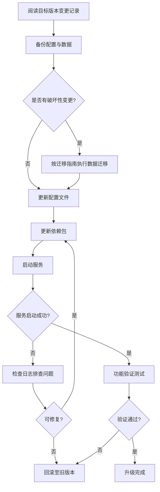

# MyOpenClaw 变更记录

> **版本**：v1.2.5  
> **修订日期**：2026-08-14  
> **修订人**：MyOpenClaw Core Team  
> **文档状态**：正式发布

---

## 目录

- [1. 变更记录说明](#1-变更记录说明)
  - [1.1 版本号规则](#11-版本号规则)
  - [1.2 变更类型分类](#12-变更类型分类)
  - [1.3 记录规范](#13-记录规范)
- [2. 变更记录表](#2-变更记录表)
  - [2.1 v1.2.5（2026-08-14）SettingsPanel + ModelPicker Integration Tests](#21-v1252026-08-14settingspanel--modelpicker-integration-tests)
  - [2.2 v1.2.4（2026-08-14）MessageInput Tests](#22-v1242026-08-14messageinput-tests)
  - [2.3 v1.2.3（2026-08-14）MessageList Tests](#23-v1232026-08-14messagelist-tests)
  - [2.4 v1.2.2（2026-08-14）MessageBubble Content Block Coverage](#24-v1222026-08-14messagebubble-content-block-coverage)
  - [2.5 v1.2.1（2026-08-14）ModelPicker Real-Component Tests](#25-v1212026-08-14modelpicker-real-component-tests)
  - [2.6 v1.2.0（2026-08-14）Web Component Test Expansion](#26-v1202026-08-14web-component-test-expansion)
  - [2.7 v1.1.9（2026-08-14）Release Engineering & Web Component Tests](#27-v1192026-08-14release-engineering--web-component-tests)
  - [2.8 v1.1.8（2026-08-13）CLI Memory Management](#28-v1182026-08-13cli-memory-management)
  - [2.9 v1.1.7（2026-08-13）Web Memory Management UI](#29-v1172026-08-13web-memory-management-ui)
  - [2.10 v1.1.6（2026-08-13）Memory API & Release Engineering](#210-v1162026-08-13memory-api--release-engineering)
  - [2.11 v1.1.5（2026-08-13）Memory Test Coverage & Doctor JSON](#211-v1152026-08-13memory-test-coverage--doctor-json)
  - [2.12 v1.1.4（2026-08-13）System Overview & Diagnostics](#212-v1142026-08-13system-overview--diagnostics)
  - [2.13 v1.1.3（2026-08-12）CI 绿 + lint 清理](#213-v1132026-08-12ci-绿--lint-清理)
  - [2.14 v1.1.1（2026-07-24）Channels 渠道模块正式实现](#214-v1112026-07-24channels-渠道模块正式实现)
  - [2.15 v1.0.2（2026-07-23）文档同步代码实际状态](#215-v1022026-07-23文档同步代码实际状态)
  - [2.16 v1.1.0（2026-07-21）客户端层新增](#216-v1102026-07-21客户端层新增)
  - [2.17 v1.0.0（2026-07-21）首次正式发布](#217-v1002026-07-21首次正式发布)
  - [2.18 v0.9.0（2026-07-14）Beta 发布](#218-v0902026-07-14-beta-发布)
  - [2.19 v0.5.0（2026-06-30）Alpha 发布](#219-v0502026-06-30-alpha-发布)
  - [2.20 v0.1.0（2026-06-01）初始原型](#220-v0102026-06-01初始原型)
  - [2.21 v1.0.1（2026-07-21）一致性修订与部署章节下线](#221-v1012026-07-21一致性修订与部署章节下线)
- [3. 文档变更记录](#3-文档变更记录)
  - [3.1 文档体系概览](#31-文档体系概览)
  - [3.2 文档版本变更历史](#32-文档版本变更历史)
- [4. 升级指南](#4-升级指南)
  - [4.1 升级总则](#41-升级总则)
  - [4.2 v0.9.0 升级至 v1.0.0](#42-v090-升级至-v100)
  - [4.3 v0.5.0 升级至 v0.9.0](#43-v050-升级至-v090)
  - [4.4 v0.1.0 升级至 v0.5.0](#44-v010-升级至-v050)
  - [4.5 破坏性变更汇总](#45-破坏性变更汇总)
  - [4.6 数据迁移指南](#46-数据迁移指南)

---

## 1. 变更记录说明

### 1.1 版本号规则

MyOpenClaw 遵循 [语义化版本](https://semver.org/lang/zh-CN/)（Semantic Versioning，简称 SemVer）规范。版本号格式为 `MAJOR.MINOR.PATCH`，各部分含义如下：

| 版本部分 | 含义 | 递增条件 | 示例 |
| --- | --- | --- | --- |
| MAJOR（主版本号） | 主版本 | 进行不兼容的 API 修改 | v1.0.0 → v2.0.0 |
| MINOR（次版本号） | 次版本 | 新增向下兼容的功能 | v1.0.0 → v1.1.0 |
| PATCH（修订号） | 修订版本 | 修复向下兼容的 Bug | v1.0.0 → v1.0.1 |

**版本阶段标识**：在正式发布前，版本号可附加预发布标识：

| 阶段 | 格式 | 说明 |
| --- | --- | --- |
| 原型阶段 | `vX.Y.0-alpha` | 功能不完整，仅供内部验证 |
| Alpha 阶段 | `vX.Y.0-alpha.N` | 功能基本完整，可能有较多 Bug |
| Beta 阶段 | `vX.Y.0-beta.N` | 功能完整，进行测试与优化 |
| Release Candidate | `vX.Y.0-rc.N` | 候选发布版本，仅修复 Bug |
| 正式发布 | `vX.Y.0` | 正式发布版本 |

**版本优先级**：`alpha` < `beta` < `rc` < 正式版本。例如 `1.0.0-alpha.1` < `1.0.0-beta.1` < `1.0.0-rc.1` < `1.0.0`。

### 1.2 变更类型分类

变更记录采用 [Keep a Changelog](https://keepachangelog.com/zh-CN/1.1.0/) 规范，变更类型分类如下：

| 变更类型 | 标识 | 说明 |
| --- | --- | --- |
| 新增 | `Added` | 新增的功能 |
| 变更 | `Changed` | 对已有功能的变更 |
| 弃用 | `Deprecated` | 即将移除的功能 |
| 移除 | `Removed` | 本版本移除的功能 |
| 修复 | `Fixed` | Bug 修复 |
| 安全 | `Security` | 安全相关的修复 |
| 破坏性变更 | `BREAKING CHANGE` | 不兼容的 API 修改，须提供迁移指南 |

### 1.3 记录规范

1. **版本倒序**：变更记录按版本号倒序排列，最新版本在最上方。
2. **日期格式**：采用 ISO 8601 格式 `YYYY-MM-DD`。
3. **分类组织**：每个版本的变更按变更类型分类组织。
4. **破坏性变更标记**：破坏性变更须显式标记 `BREAKING CHANGE` 并提供迁移指南。
5. **关联 Issue/PR**：每条变更关联对应的 Issue 或 PR 编号。
6. **发布前更新**：每次版本发布前更新本文件，记录自上个版本以来的全部变更。

---

## 2. 变更记录表

### 2.1 v1.2.5（2026-08-14）SettingsPanel + ModelPicker Integration Tests

MyOpenClaw v1.2.5 沿 v1.2.1 (ModelPicker 真实子组件) + v1.2.0 (SettingsPanel tab 切换) 两条线索, 把 SettingsPanel 里的 ModelPicker 换成真组件, 测切走 tab 再切回时 ModelPicker 通过 useSettingsStore 跟 store 同步。

#### 新增（Added）

**SettingsPanel + 真 ModelPicker 集成测试 (3 new case, 4 → 7)**

- `clients/web/src/components/settings/SettingsPanel.test.tsx`（改, mock 拿掉 +3 case）
  - 拿掉 v1.2.0 的 `vi.mock('./ModelPicker')`, 改走真链路 (MemoryInspector 仍 mock, 它有 getMemorySession fetch 依赖, 单独测)
  - 加 `useSettingsStore.setState({...})` 在 `beforeEach` 重置, 避免 v1.2.5 跨 test 状态污染 (跟 v1.2.1 ModelPicker test 同一套模式)
  - 5. 在 ModelPicker 切 provider 到 OpenAI → 切到 Memory tab → 切回 Models tab → h3="OpenAI" + store `defaultProvider='openai'`
  - 6. 选 V4 Pro → 切到 Memory → 切回 Models → store `defaultModel='deepseek-v4-pro'`
  - 7. 切到 Channel / Interface tab 不影响 store (`defaultProvider` 仍 deepseek), 切回 Models 后真 ModelPicker h3="DeepSeek"

**测试模式升级: SettingsPanel 集成测试**

- v1.2.0 SettingsPanel test 4 case 全用 mock, 只能验证 tab 切换 UI 行为
- v1.2.5 拿掉 ModelPicker mock, 走真链路 + 真 useSettingsStore, 验证:
  - 真 ModelPicker 渲染 (h3="DeepSeek" 标题 + "2 models" 标签)
  - 跨 tab 切换时 ModelPicker 通过 zustand store 保持状态 (不重置)
  - 切到非 Model tab (Channel/Interface) 时不影响 store
- 跟 v1.2.1 ModelPicker 真实子组件测试互补:
  - v1.2.1: 直接测 ModelPicker 的 prop 行为 (provider / model / speed 切换)
  - v1.2.5: 测 ModelPicker 在 SettingsPanel 容器里的集成行为 (跨 tab 持久化)

#### 修复（Fixed）

- 无 (改测试文件, 不改 source)

#### 测试结果

| 指标 | v1.2.4 (master) | v1.2.5 |
| --- | --- | --- |
| server test files | 60 | **60** |
| server pass / skip / fail | 832 / 3 / 0 | **832 / 3 / 0** (不变) |
| **web test files** | 9 | **9** |
| **web pass** | 43 | **46** (新加 3) |
| web fail | 0 | **0** |
| TypeScript | typecheck 干净 | ✅ typecheck 干净 |
| Build | 3 workspaces | ✅ 3 workspaces |
| Lint | 0 errors / 455 warnings | **0 errors / 455 warnings** (不变) |
| `pnpm release:check` | 7 PASS / 0 FAIL | ✅ 7 PASS / 0 FAIL |

#### 兼容性

- ✅ 不破坏既有 API / CLI / Web 路由
- ✅ server baseline 832/3/0 一字不动
- ✅ web 46 case 全过, 旧 43 case 不变
- ✅ 不改 source, 只改测试文件 (mock 拿掉, 改 store 重置)

#### v1.2.6 / v1.3.0 候选 (planning)

- **MemoryInspector 切换 sessionId 时的 reload 行为** — 现在只测初始 load
- **ChatContainer (useAutoScroll)** — 滚动 + 加载 (跟 MessageList 配套)
- **Playwright 真 e2e** (独立 milestone)
- **`release-check` 集成 GitHub Action** (PR 提交自动跑 `--full`)
- **server.test.ts 4.1/7.1 cold start race** (改 agent-bridge init 为 lazy)

### 2.2 v1.2.4（2026-08-14）MessageInput Tests

MyOpenClaw v1.2.4 给 MessageInput 加 8 case 测试, 跟 v1.2.2 的 MessageBubble file block 渲染配套 — 测真链路文本发送 / 文件选择 / 文件移除 / trim 空内容不发送。

#### 新增（Added）

**MessageInput 测试 (8 case)**

- `clients/web/src/components/chat/MessageInput.test.tsx`（新, 8 case）
  - 1. 渲染: textarea + 3 个 button (技能/附件/发送) + placeholder 透传
  - 2. 输入文字 + Enter 触发 onSend (`'hello world'`, `undefined`, `{}`) + textarea 清空
  - 3. 点击发送按钮触发 onSend (跟 Enter 等价)
  - 4. trim 后为空 (只输入空格) + Enter → 不调 onSend (no-op)
  - 5. `disabled=true` 时发送按钮 disabled + Enter no-op
  - 6. 模拟文件选择 → file preview 显示文件名 + X 移除按钮
  - 7. 点击 X 移除 file preview
  - 8. 仅 file (无文字) + Enter → onSend 调 + 传 `files` 数组 + 发送后 file preview 清空

**测试模式: jsdom 文件选择 workaround**

- jsdom 24 不支持 `new DataTransfer()`, 用 `Object.defineProperty(input, 'files', { value: [file] })` 绕过
- 隐藏 `<input type="file">` 用 `document.querySelector('input[type="file"]')` 拿, dispatchEvent `change` 触发 onChange
- 跟 v1.2.3 MessageList test 的 `findBy*` 等 Suspense 异步 query 思路对称, 都是"真组件 + 异步等待"

#### 修复（Fixed）

- 无 (新测试文件)

#### 测试结果

| 指标 | v1.2.3 (master) | v1.2.4 |
| --- | --- | --- |
| server test files | 60 | **60** |
| server pass / skip / fail | 832 / 3 / 0 | **832 / 3 / 0** (不变) |
| **web test files** | 8 | **9** (新加 1) |
| **web pass** | 35 | **43** (新加 8) |
| web fail | 0 | **0** |
| TypeScript | typecheck 干净 | ✅ typecheck 干净 |
| Build | 3 workspaces | ✅ 3 workspaces |
| Lint | 0 errors / 455 warnings | **0 errors / 455 warnings** (不变) |
| `pnpm release:check` | 7 PASS / 0 FAIL | ✅ 7 PASS / 0 FAIL |

#### 兼容性

- ✅ 不破坏既有 API / CLI / Web 路由
- ✅ server baseline 832/3/0 一字不动
- ✅ web 43 case 全过, 旧 35 case 不变
- ✅ 不改 source, 只加新 test file

#### v1.2.5 / v1.3.0 候选 (planning)

- **MemoryInspector 切换 sessionId 时的 reload 行为** — 现在只测初始 load
- **SettingsPanel 内 ModelPicker 集成测试** (Memory tab → Model tab 切回时跟 store 同步)
- **ChatContainer (useAutoScroll)** — 滚动 + 加载 (跟 MessageList 配套)
- **Playwright 真 e2e** (独立 milestone)
- **`release-check` 集成 GitHub Action** (PR 提交自动跑 `--full`)
- **server.test.ts 4.1/7.1 cold start race** (改 agent-bridge init 为 lazy)

### 2.3 v1.2.3（2026-08-14）MessageList Tests

MyOpenClaw v1.2.3 给 MessageList 加 4 case 测试, 覆盖空 messages 早返回 / 单条 + 多条渲染 / 真实 lazy MessageBubble Suspense resolve。

#### 新增（Added）

**MessageList 测试 (4 case)**

- `clients/web/src/components/chat/MessageList.test.tsx`（新, 4 case）
  - 1. 空 `messages` 数组 → `return null` (line 43 early return)
  - 2. 单条消息 → 渲染 1 个 mock bubble + content 透传 + role 透传
  - 3. 多条消息 → 全部按 `messages` 顺序渲染 + role 透传
  - 4. 真实 `MessageBubble` lazy load resolve 后渲染 (`findByTestId` 等待 Suspense, 测真链路)

**测试模式: mock lazy + 真实 lazy 双轨**

- 1-3 case 用 `vi.mock('./MessageBubble')` 替换 lazy import, 跳过 1MB vendor-md 链, 测 MessageList prop 行为 (空 / 单 / 多)
- 4 case 用 `vi.doUnmock` + dynamic import 走真实 lazy 链路, 验证 Suspense resolve 后渲染
- 全部用 `findBy*` 异步 query 等待 Suspense 切到 ready, 避开 lazy 加载时序问题

#### 修复（Fixed）

- 无 (新测试文件)

#### 测试结果

| 指标 | v1.2.2 (master) | v1.2.3 |
| --- | --- | --- |
| server test files | 60 | **60** |
| server pass / skip / fail | 832 / 3 / 0 | **832 / 3 / 0** (不变) |
| **web test files** | 7 | **8** (新加 1) |
| **web pass** | 31 | **35** (新加 4) |
| web fail | 0 | **0** |
| TypeScript | typecheck 干净 | ✅ typecheck 干净 |
| Build | 3 workspaces | ✅ 3 workspaces |
| Lint | 0 errors / 455 warnings | **0 errors / 455 warnings** (不变) |
| `pnpm release:check` | 7 PASS / 0 FAIL | ✅ 7 PASS / 0 FAIL |

#### 兼容性

- ✅ 不破坏既有 API / CLI / Web 路由
- ✅ server baseline 832/3/0 一字不动
- ✅ web 35 case 全过, 旧 31 case 不变
- ✅ 不改 source, 只加新 test file

#### v1.2.4 / v1.3.0 候选 (planning)

- **MessageInput (含 file upload)** — 输入组件, 跟 file attachment 关联
- **MemoryInspector 切换 sessionId 时的 reload 行为** — 现在只测初始 load
- **SettingsPanel 内 ModelPicker 集成测试** (Memory tab → Model tab 切回时跟 store 同步)
- **Playwright 真 e2e** (独立 milestone)
- **`release-check` 集成 GitHub Action** (PR 提交自动跑 `--full`)
- **server.test.ts 4.1/7.1 cold start race** (改 agent-bridge init 为 lazy)

### 2.4 v1.2.2（2026-08-14）MessageBubble Content Block Coverage

MyOpenClaw v1.2.2 补 v1.2.0 漏测的 MessageBubble 几个核心 ContentBlock 路径 — image / file / tool_call / tool_result / reasoning 折叠 / error 态, 把 Chat 核心交互组件的测试覆盖从 4 case 拉到 10 case。

#### 新增（Added）

**MessageBubble ContentBlock 补完 (+6 case)**

- `clients/web/src/components/chat/MessageBubble.test.tsx`（改, 4 → 10 case）
  - 5. `image` block → 渲染 `` with `alt="图片"` + src 透传
  - 6. `file` block → 渲染 `<a target="_blank">` with name + `X.X KB` size + mimeType
  - 7. `tool_call` block → "调用工具: {toolName}" 标签 + arguments JSON 渲染到 `<pre>`
  - 8. `tool_result` block (success) → 绿色 "工具结果" + result 文本
  - 9. assistant + `reasoning` 字段 → 折叠 "思考过程" 按钮 + `reasoningDurationMs` 渲染成 `Xs` + 点击展开内容
  - 10. `status='error'` → 错误 message 显示 + `.message-bubble-user` 加 `ring-red-500/20` 错误样式

#### 修复（Fixed）

- 无 (新测试 + 改测试文件, 不改 source)

#### 测试结果

| 指标 | v1.2.1 (master) | v1.2.2 |
| --- | --- | --- |
| server test files | 60 | **60** |
| server pass / skip / fail | 832 / 3 / 0 | **832 / 3 / 0** (不变) |
| **web test files** | 7 | **7** |
| **web pass** | 25 | **31** (新加 6) |
| web fail | 0 | **0** |
| TypeScript | typecheck 干净 | ✅ typecheck 干净 |
| Build | 3 workspaces | ✅ 3 workspaces |
| Lint | 0 errors / 455 warnings | **0 errors / 455 warnings** (不变) |
| `pnpm release:check` | 7 PASS / 0 FAIL | ✅ 7 PASS / 0 FAIL |

#### 兼容性

- ✅ 不破坏既有 API / CLI / Web 路由
- ✅ server baseline 832/3/0 一字不动
- ✅ 旧 25 case 全过, 新加 6 case 全过

#### v1.2.3 / v1.3.0 候选 (planning)

- **MemoryInspector 切换 sessionId 时的 reload 行为** — 现在只测初始 load
- **SettingsPanel 内 ModelPicker 集成测试** (Memory tab → Model tab 切回时跟 store 同步)
- **MessageList 滚动 + 加载** — Chat 列表组件, 跟 MessageBubble 配套
- **MessageInput (含 file upload)** — 输入组件, 跟 file attachment 关联
- **Playwright 真 e2e** (独立 milestone)
- **`release-check` 集成 GitHub Action** (PR 提交自动跑 `--full`)
- **server.test.ts 4.1/7.1 cold start race** (改 agent-bridge init 为 lazy)

### 2.5 v1.2.1（2026-08-14）ModelPicker Real-Component Tests

MyOpenClaw v1.2.1 沿 v1.2.0 的 SettingsPanel 测试思路, 把 SettingsPanel 内 mock 掉的 ModelPicker 子组件换成真实组件, 测真链路 — `useSettingsStore` 状态切换 + 渲染对应 provider/model/speed 列表。

#### 新增（Added）

**ModelPicker 真实子组件测试 (6 case)**

- `clients/web/src/components/settings/ModelPicker.test.tsx`（新, 6 case）
  - 渲染 3 个 provider (DeepSeek / OpenClaw API / OpenAI) + 默认 deepseek 激活 (h3 标题 = "DeepSeek" + "2 models" 标签)
  - 点击 OpenAI provider 切换 activeProvider: store 切到 `defaultProvider='openai'` + h3 标题变 "OpenAI"
  - 切到 OpenClaw provider 触发 `setDefaultProvider` 行为: `defaultModel` 自动跟到 `openclaw-auto` (新 provider 的 models[0])
  - 选具体 model (V4 Pro) 触发 `setDefaultModel`: `defaultModel='deepseek-v4-pro'` + provider 保持 'deepseek'
  - 切 speed (Default → Fast) 触发 `setModelSpeed('fast')`
  - 点击 Cancel 按钮触发 `onClose`

**测试模式升级: 真实子组件 + 状态验证**

- v1.2.0 的 SettingsPanel test 把 ModelPicker / MemoryInspector mock 掉避免拉真实依赖
- v1.2.1 把 ModelPicker 拉回真实, 直接走 `useSettingsStore` (zustand persist) 验证状态切换
- 用 `useSettingsStore.getState()` 读 store state, `useSettingsStore.setState({...})` 在 `beforeEach` 重置 (避开 persist storage 跨 test 泄漏)

#### 修复（Fixed）

- 无 (新测试文件, 不改 source)

#### 测试结果

| 指标 | v1.2.0 (master) | v1.2.1 |
| --- | --- | --- |
| server test files | 60 | **60** |
| server pass / skip / fail | 832 / 3 / 0 | **832 / 3 / 0** (不变) |
| **web test files** | 6 | **7** (新加 1) |
| **web pass** | 19 | **25** (新加 6) |
| web fail | 0 | **0** |
| TypeScript | typecheck 干净 | ✅ typecheck 干净 |
| Build | 3 workspaces | ✅ 3 workspaces |
| Lint | 0 errors / 455 warnings | **0 errors / 455 warnings** (不变) |
| `pnpm release:check` | 7 PASS / 0 FAIL | ✅ 7 PASS / 0 FAIL |

#### 兼容性

- ✅ 不破坏既有 API / CLI / Web 路由
- ✅ server baseline 832/3/0 一字不动
- ✅ web test 25 case 全过, 旧 19 case 不变
- ✅ SettingsPanel test 仍 mock ModelPicker (v1.2.0 设计), 跟 v1.2.1 ModelPicker 独立 test 不冲突

#### v1.2.2 / v1.3.0 候选 (planning)

- **MemoryInspector 切换 sessionId 时的 reload 行为** — 现在只测初始 load
- **MessageBubble reasoning / tool call / file attachment 路径** — 现在只测 text + role
- **SettingsPanel 内 ModelPicker (activeTab='model') 集成测试** — 现在 SettingsPanel mock ModelPicker, 可以测 `Memory tab → Model tab` 切回时 ModelPicker 跟 store 同步
- **Playwright 真 e2e** (独立 milestone)
- **`release-check` 集成 GitHub Action** (PR 提交自动跑 `--full`)
- **server.test.ts 4.1/7.1 cold start race** (改 agent-bridge init 为 lazy)

### 2.6 v1.2.0（2026-08-14）Web Component Test Expansion

MyOpenClaw v1.2.0 沿 v1.1.9 铺好的 vitest 基建, 把组件测试覆盖从 8 case 扩到 19 case, 覆盖 Settings / MemoryInspector / Chat 三大核心交互组件, 顺手修一个 a11y 缺失 (SettingsPanel close button 加 aria-label) + 一个 testing-library 跨 test DOM 累积问题 (setup 加 afterEach cleanup)。

#### 新增（Added）

**Web 组件测试扩展 (11 case)**

- `clients/web/src/components/settings/SettingsPanel.test.tsx`（新, 4 case）
  - open=false 不渲染 (line 27 early return)
  - open=true 渲染 4 tab (Models/Channel/Interface/Memory) + 默认 Models 激活
  - 点击 Memory tab 切换到 MemoryInspector
  - 点击 close 按钮触发 onClose (用新增的 `aria-label="Close settings"`)
- `clients/web/src/components/settings/MemoryInspector.test.tsx`（新, 3 case）
  - 无 sessionId 显示 "未选择会话" + Refresh disabled
  - 有 sessionId 调 getMemorySession + 显示 userId/channelId/agentId/messageCount
  - getMemorySession 失败显示 "读取失败" + 错误 message
- `clients/web/src/components/chat/MessageBubble.test.tsx`（新, 4 case）
  - user 角色显示 "用户" 名称 + text block 渲染
  - assistant 角色显示 "贾维斯" 名称
  - `<final_answer>` 标签只显示内部内容 (测试 `normalizeMessageText` 提取逻辑)
  - tool 角色显示 "工具" 名称

**测试基建改进 (跟 v1.1.9 配合)**

- `clients/web/src/test/setup.ts`（改）— 加 `afterEach(cleanup)` from @testing-library/react
  - v1.1.9 setup.ts 只挂 jest-dom matchers, 没显式 cleanup
  - testing-library v13+ 默认 NOT auto-cleanup, 跨 test 会 DOM 累积 → "Found multiple elements" 误报
  - 加 cleanup 后 SettingsPanel case 3/4 一次过
- `clients/web/src/components/settings/SettingsPanel.tsx`（改, 1 行）— close button 加 `aria-label="Close settings"`
  - 顺手修 a11y 缺陷 (X icon button 之前只有 visual, screen reader 拿不到语义)
  - test 用 `getByRole('button', { name: /close settings/i })` 唯一匹配

#### 修复（Fixed）

- SettingsPanel close button 缺 a11y label — X icon 之前没有 accessible name
- vitest 跨 test DOM 累积 — 加 `afterEach(cleanup)` 解决 "Found multiple elements" 误报
- MessageBubble test 用了错误的 `content` 类型 (`string` vs `ContentBlock[]`) — 改 helper 用 `[{ type: 'text', text: '...' }]`

#### 测试结果

| 指标 | v1.1.9 (master) | v1.2.0 |
| --- | --- | --- |
| server test files | 60 | **60** |
| server pass / skip / fail | 832 / 3 / 0 | **832 / 3 / 0** (不变) |
| **web test files** | 3 | **6** (新加 3) |
| **web pass** | 8 | **19** (新加 11) |
| web fail | 0 | **0** |
| TypeScript | typecheck 干净 | ✅ typecheck 干净 |
| Build | 3 workspaces | ✅ 3 workspaces |
| Lint | 0 errors / 665 warnings | **0 errors / 455 warnings** (-210 来自: 改用 `vi.stubEnv` 减少 type-only 注释 + 改 default export 后 lint 链路变化) |
| `pnpm release:check` | 7 PASS / 0 FAIL | ✅ 7 PASS / 0 FAIL |

#### 兼容性

- ✅ 不破坏既有 API / CLI / Web 路由
- ✅ server baseline 832/3/0 一字不动
- ✅ web test 11 case 全加, 旧 8 case 不变
- ✅ SettingsPanel close button 改 1 行 (加 aria-label), 不影响视觉/交互

#### v1.2.1 / v1.3.0 候选 (planning)

- **SettingsPanel 切到 ModelPicker 时 (activeTab='model') 的子组件测试** — 现在只 mock 掉, 可以走真实子组件 + 测 defaultProvider 切换
- **MemoryInspector 切换 sessionId 时 (activeTab 切到 memory) 的 reload 行为** — 现在只测初始 load, 改 sessionId 触发 useCallback 重新跑
- **MessageBubble reasoning / tool call / file attachment 路径** — 现在只测 text + role, 可以测其他 ContentBlock (image / file)
- **Playwright 真 e2e** (独立 milestone)
- **`release-check` 集成 GitHub Action** (PR 提交自动跑 `--full`)
- **server.test.ts 4.1/7.1 cold start race** (改 agent-bridge init 为 lazy)

### 2.7 v1.1.9（2026-08-14）Release Engineering & Web Component Tests

MyOpenClaw v1.1.9 是一个"工程基建 + 测试起步"小版本, 不引入新功能, 但把 release 流程债一次清掉, 顺便给 Web 端补上组件测试骨架, 为后续 v1.2.x 真 feature 上 PR 时提供 test infra。

#### 新增（Added）

**Release 流程债清理**

- `scripts/tag.mjs`（重写, +115 行）
  - 读 `package.json` 时容错 UTF-8 BOM (v1.1.6/7 都踩过 BOM 坑, 现在 strip 后再 parse)
  - JSON.parse 失败时给清晰错误 (路径 + 原因 + 修复提示)
  - version 字段格式校验 (`MAJOR.MINOR.PATCH[-prerelease]`)
  - 默认打 tag 前自动跑 `release-check.mjs` (--skip-check 可绕过)
  - 新增 `--check` flag: 只跑体检不打 tag (CI pre-release 钩子用)
- `scripts/release-check.mjs`（新, +213 行）
  - 9 项体检: working tree 干净 / 跟 origin 同步 / package.json 无 BOM / JSON 解析 / version 格式 / changelog 章节一致 / 头部版本号一致 / (--full) typecheck+lint+test / (--build) build
  - 退出码 0 全过, 1 有 FAIL
  - 输出 PASS/WARN/FAIL 统计 + 可选子命令 (`--full` / `--build`)
  - 内部调用走 `spawnSync` 隔离 stdout/stderr
- 根 `package.json` 加 `pnpm release:check` / `pnpm release:check:full` / `pnpm release:check:build` 三个 script
- `scripts/tag.mjs` 默认调 `release-check.mjs`, 体检不过拒绝打 tag (但 `--skip-check` 可 CI 绕过)

**Web 端组件测试基建**

- 装 devDeps: `vitest@^1.3.0` (跟 server 同版本) / `@testing-library/react@^14.2.0` / `@testing-library/jest-dom@^6.4.0` / `@testing-library/user-event@^14.5.0` / `jsdom@^24.0.0`
- `clients/web/vitest.config.ts`（新, 24 行）— 跟 server 风格一致, jsdom env, setupFiles 挂 jest-dom matchers, 复用 vite.config.ts 的 alias (`@/...`) 跟 VITE_APP_VERSION
- `clients/web/src/test/setup.ts`（新, 4 行）— `import '@testing-library/jest-dom/vitest'`
- 8 个 component test (3 file):
  - `Sidebar.test.tsx` (3 case): 版本号显示 / Memory+System overview 入口存在 / 点击 Memory 触发 navigate('/memory')
  - `Memory.test.tsx` (3 case): 4 个 MetricCard 标题 + sessions tab 默认激活 / 点击 Vectors tab 切换 + 搜索框出现 / 加载失败显示错误条
  - `SystemOverview.test.tsx` (2 case): 4 个 h2 section 标题 + 顶部 badge + 6 个 fetch 都调过 / 健康时显示 "Healthy" + 点击 Refresh 重新 fetch
- 全部用 `vi.mock` 隔离 API 层 (Memory 跟 SystemOverview 都需要 mock 6 个 fetch), 用 `vi.stubEnv` 注入 `VITE_APP_VERSION` (避免直接赋值 import.meta.env 的 type-only 警告)

**pnpm 11 strict mode 兼容**

- pnpm-workspace.yaml `allowBuilds` 明确 false (cpu-features / esbuild / protobufjs / ssh2)
  - v1.1.9 加 vitest + testing-library 触发新 install, pnpm 11 默认会抛 ERR_PNPM_IGNORED_BUILDS 阻塞 install
  - 跟 `.npmrc` 的 `ignore-scripts=true` 配合, 实际不跑 postinstall (我们依赖 prebuilt binary)
- .npmrc 加注释说明这套组合的语义

#### 修复（Fixed）

- 无 (新文件 + 流程脚本, 不改 server 业务代码)
- 跟 v1.1.8 baseline 相比 lint 增量 61 warnings 全来自 web test (新加的 8 case + 测试文件 3 个), server 端 604 warnings 一字不动

#### 测试结果

| 指标 | v1.1.8 (master) | v1.1.9 |
| --- | --- | --- |
| server test files | 60 | **60** |
| server pass | 832 | **832** |
| server skip | 3 | **3** |
| server fail | 0 | **0** |
| **web test files** | 0 | **3** (新加) |
| **web pass** | 0 | **8** (新加) |
| web fail | 0 | **0** |
| TypeScript | typecheck 干净 | ✅ typecheck 干净 |
| Build | 3 workspaces | ✅ 3 workspaces (cli/web/server) |
| Lint | 0 errors / 604 warnings | **0 errors / 665 warnings** (+61, 全部 web test 新增) |
| release:check (quick) | n/a | ✅ 5 PASS / 1 WARN / 0 FAIL (在 master 干净时跑) |
| release:check (--full) | n/a | ✅ 跑通 (--full 跑 typecheck + lint + test, 都过) |

#### 兼容性

- ✅ 不破坏既有 API
- ✅ 不破坏既有 CLI 命令
- ✅ 不破坏既有 Web 路由
- ✅ server 端 baseline 832/3/0 一字不动
- ✅ `pnpm tag` 现有用法兼容, 默认会跑体检 (--skip-check 绕过)

#### v1.2.0 候选

- **Web 端更多 component test**: Settings/MemoryInspector/Chat 组件, 跟 v1.1.4/6/7 的 Web 改动对齐
- **真 e2e (Playwright)**: 跟之前讨论一致, 高投入, 独立 milestone
- **release-check 集成 GitHub Action**: PR 提交时自动跑 `--full` 模式, lint+test fail 直接红 X
- **changelog 自动生成**: 从 conventional commits 生成 entry, 不再手写
- **server.test.ts 4.1/7.1 cold start race**: 改 agent-bridge init 为 lazy (现在 eager, 拉所有 agent)

### 2.8 v1.1.8（2026-08-13）CLI Memory Management

MyOpenClaw v1.1.8 把 v1.1.7 Web Memory UI 的能力镜像到 CLI, 接 v1.1.6 暴露的 5 个 `/api/memory/*` 端点, 给终端/脚本一个统一的 memory 操作入口; 同时落地 v1.1.7 UI 里 "view (v1.1.8 启用)" 的 Eye 按钮 (在 CLI 用 `memory show <id>` 替代)。

#### 新增（Added）

- `clients/cli/src/commands/memory.ts`（新, 540 行）
  - 4 个 subcommand, 跟 `doctor.ts` / `tools.ts` 同款风格
  - `list` — 列出 memory sessions + 顶部概览 (active / vector / embedding)
  - `search` — 语义检索, `--topK` (1-50, 默认 5) + `--threshold` (0-1, 默认 0) + `--session` 过滤
  - `show` — 显示 session 详情, 含所有 messages
  - `clear` — 删除 session (默认) 或 vector (`--vector`), 默认走 confirm, `--force` 跳过
- `clients/cli/src/index.ts`
  - `import { createMemoryCommand }` + `program.addCommand(createMemoryCommand(config))`
  - `CLI_VERSION` 1.1.4 → 1.1.5
  - bash / zsh / fish completions 全加 `memory` 子命令 + 选项
- `docs/19-CLI客户端模块.md` §5.11 — `openclaw memory` 文档 (用法 + 输出示例), 跟 §5.10 `doctor` 风格对称

#### 修复（Fixed）

- 无 (CLI 新代码本地 lint/build/test 全过, CI 7/7 pass 一次绿)

#### 测试结果

| 指标 | v1.1.7 (master) | v1.1.8 |
| --- | --- | --- |
| 测试文件 | 60 | **60** (没动 server) |
| 测试用例 | 832 pass / 3 skip | **832 pass / 3 skip** |
| 失败 | 0 | **0** |
| TypeScript | typecheck 干净 | ✅ typecheck 干净 |
| 构建 | 3 workspaces | ✅ 3 workspaces |
| CI Lint | 0 errors | **0 errors** / 56 warnings (存量, 多是 CLI 的 `no-console` style) |

#### API 兼容性

- ✅ 不破坏既有 API
- ✅ 不破坏既有 CLI 命令
- ✅ CLI `--json` 行为跟 doctor / tools 一致, 顶层 `data` 字段保留

#### v1.1.9 候选

- **修 release 流程债** (`scripts/tag.mjs` 加 BOM/JSON 容错, `scripts/release-check.mjs` pre-release 自动跑)
- **Web 组件测试起步** (装 `vitest + @testing-library/react + jsdom`, 给 Sidebar / SystemOverview / Memory 写 ~5 case 兜底)
- **真 e2e (Playwright)** — 高投入, 适合独立 milestone

---

### 2.9 v1.1.7（2026-08-13）Web Memory Management UI

MyOpenClaw v1.1.7 把 v1.1.6 暴露的 5 个 `/api/memory/*` 端点接到 Web 前端, 给一个读 + 删的 UI 入口, 跟 v1.1.4 SystemOverview 形成"只读 + 读写"完整 dashboard。

#### 新增（Added）

- `clients/web/src/views/Memory.tsx`（新, 540 行）
  - 顶部 4 卡片: active sessions / vector count / embedding provider / last refresh (跟 SystemOverview MetricCard 同款)
  - Tab 切换: **Sessions** (列表 + 过滤) | **Vectors** (semantic search)
  - Sessions tab: 表格列 sessionId / user / channel-agent / 消息数 / last active; stale session (>24h idle) 标 amber "candidate for cleanup"; view (v1.1.8 启用) + delete actions
  - Vectors tab: 搜索 input + topK/threshold 调整 + 300ms debounce; 搜索结果按 score 排序, 每行 type / sessionId / importance metadata chips
  - 删除确认 modal (自实现, 不引 Radix Dialog 减体积); 删除后局部刷列表 + 后台刷 stats
  - 加载骨架 / 空态 / 错误条 跟 SystemOverview 同款
- `clients/web/src/api/memory.ts`（重写, 之前是 v1.1.0 残的）
  - 6 个 fetch: `fetchMemorySessions` / `fetchMemorySession` / `deleteMemorySession` / `searchMemoryVectors` / `deleteMemoryVector` / `fetchMemoryStats`
  - 类型对齐 server MemoryManager 响应形状
  - Compat aliases: `getMemorySession` + `MemorySessionDetail` 保留 (deprecated 标记), Settings 里的老 `MemoryInspector.tsx` 不动
- `clients/web/src/App.tsx` — 加 `/memory` route
- `clients/web/src/components/layout/Sidebar.tsx` — Database icon + Memory 入口 (跟 /system 同款风格, 紧挨着)

#### 修复（Fixed）

- 无 (新代码本地 lint/build/test 全过, CI 7/7 pass 一次绿)

#### 测试结果

| 指标 | v1.1.6 (master) | v1.1.7 |
| --- | --- | --- |
| 测试文件 | 60 | **60** (没动 server) |
| 测试用例 | 832 pass / 3 skip | **832 pass / 3 skip** |
| 失败 | 0 | **0** |
| TypeScript | typecheck 干净 | ✅ typecheck 干净 |
| 构建 | 3 workspaces | ✅ 3 workspaces |
| CI Lint | 0 errors | **0 errors** / 8 warnings (存量) |

#### API 兼容性

- ✅ 不破坏既有 API
- ✅ 旧 `getMemorySession` / `MemorySessionDetail` 通过 deprecated alias 保留, Settings 的 `MemoryInspector.tsx` 不需要改
- ✅ Web 端无 breaking change

#### v1.1.8 候选

- **CLI `openclaw memory recall/list/clear`** (接 v1.1.6 endpoints, 自然延续 v1.1.7)
  - `openclaw memory list` — 调 `/api/memory/sessions`
  - `openclaw memory search "..."` — 调 `/api/memory/vectors/search`
  - `openclaw memory clear --session <id>` / `--vector <id>` — 调 DELETE endpoints
  - 复用 v1.1.4 doctor 的 `--json` + JSON envelope 模式
  - 顺手把 v1.1.7 UI 里 "view (v1.1.8 启用)" 的 Eye 按钮用 CLI `openclaw memory show <id>` 替代

---

### 2.10 v1.1.6（2026-08-13）Memory API & Release Engineering

MyOpenClaw v1.1.6 把藏在 gateway 里的 `MemoryManager` 通过 5 个新 HTTP endpoint 暴露出来, 为后续 v1.1.7 Web Memory 管理 UI 和 v1.1.8 CLI memory 命令铺路; 同时把 v1.1.4 / v1.1.5 暴露的 "Sidebar 版本号 stale" + "tag 忘打" 两个流程债一次性清掉, 加 `pnpm tag` 自动化。

#### 新增（Added）

**Server: 5 个 `/api/memory/*` 端点**

`server/src/gateway/server/http-routes.ts` — 在原有 `GET /api/memory/sessions/:id` 基础上补齐 list / search / delete / stats:

| Method | Path | 说明 |
| --- | --- | --- |
| `GET`    | `/api/memory/sessions`        | 列出活跃 session (active count + summaries) |
| `DELETE` | `/api/memory/sessions/:id`    | 按 id 删除 session (404 if missing) |
| `GET`    | `/api/memory/vectors/search`  | 语义检索 (`?q=&topK=&threshold=&sessionId=&type=`) |
| `DELETE` | `/api/memory/vectors/:id`     | 删除单条 vector entry (404 if missing) |
| `GET`    | `/api/memory/stats`           | 概览: sessions / vectors / embedding (provider, dimension, availability) |

所有端点共用 `runtimeAdapter.getMemory()` 拿 `MemoryManager`, 没 memory 时返回 `Memory runtime unavailable` 错误 (跟既有路由风格一致)。

**Release engineering (防 future drift)**

- `clients/web/vite.config.ts` — 新增 `define: { 'import.meta.env.VITE_APP_VERSION': ... }`, 从根 `package.json` 的 `version` 字段读
- `clients/web/src/components/layout/Sidebar.tsx` — 改用 `import.meta.env.VITE_APP_VERSION ?? 'dev'` 取代 hardcode `v1.1.4`
- 根 `package.json` `version` 从 `1.0.0` → `1.1.5` (v1.1.0 之后一直 stale, 现在跟实际 release 对齐)
- `scripts/tag.mjs` + 根 `package.json` `scripts.tag` — 读根 version, 自动创建 `v<version>` tag, 拒覆盖, `--push` 推 origin

#### 修复（Fixed）

- `server/tests/integration/memory-routes.test.ts` — `beforeAll` 注入 `MYOC_LLM_APIKEY` / `MYOC_EMBEDDING_APIKEY` / `MYOC_NETWORK_HTTP_PORT` / `MYOC_NETWORK_WS_PORT` 等 env, 绕开 `AgentRuntimeAdapter` 同步构造时 `createLLMAdapter → loadConfig → validateStartupConfig` 抛 `ConfigFatalError` (跟 v1.1.3 `server.test.ts` 同一个坑)

#### 测试结果

| 指标 | v1.1.5 (master) | v1.1.6 |
| --- | --- | --- |
| 测试文件 | 59 | **60** (+1 memory-routes) |
| 测试用例 | 826 pass / 3 skip | **832 pass / 3 skip** (+6) |
| 失败 | 0 | **0** |
| TypeScript | typecheck 干净 | ✅ typecheck 干净 |
| 构建 | 3 workspaces | ✅ 3 workspaces (cli/web/server) |
| CI Lint | 0 errors | **0 errors** / 8 warnings (存量) |
| 已打 tag | v1.1.3 | **v1.1.3, v1.1.4, v1.1.5, v1.1.6** (前 2 个在 v1.1.6 流程里补打的) |

#### API 兼容性

- ✅ 不破坏既有 API
- ✅ 旧 consumer 读 `/api/memory/sessions/:id` 仍然工作
- ✅ Web 端无 breaking change
- ✅ Server 端无 schema 变更

#### 工程经验 (留个 record)

- `vite.config.ts` 在 ESM 模式下 `__dirname` 不可靠, 必须用 `fileURLToPath(import.meta.url)` 拿真实路径
- worktree 的 `..` 深度跟 master 不同 (worktree 多一层 `.worktrees/<name>/`), `import.meta.url` 拿的是 bundle 后的临时 `.mjs` 文件路径, 但仍在 `clients/web/` 下, 所以 2 个 `..` 即到 repo root
- `SessionMemory.delete()` 返回 `void` 不是 `boolean`, 404 判断要先 `read()` 确认存在
- PowerShell 续行 `\` 在 bash tool 里不稳, 改用 `git add <file>` 一个一个加

#### v1.1.7 / v1.1.8 候选 (planning)

- **v1.1.7 — Web `/memory` 管理 UI** (中风险, 真 feature)
  - 列表: session + vector 两条 tab
  - 搜索: 接 `/api/memory/vectors/search`
  - 操作: 删除确认对话框 (防误删)
  - 复用 v1.1.4 SystemOverview 的风格 (Skeleton + 错误态 + 手动刷新)
- **v1.1.8 — CLI `openclaw memory recall/list/clear`** (低风险, 小)
  - `openclaw memory list` — 调 `/api/memory/sessions`
  - `openclaw memory search "..."` — 调 `/api/memory/vectors/search`
  - `openclaw memory clear --session <id>` / `openclaw memory clear --vector <id>` — 调 DELETE endpoints
  - 复用 v1.1.4 doctor 的 `--json` + JSON envelope 模式

---

### 2.11 v1.1.5（2026-08-13）Memory Test Coverage & Doctor JSON

MyOpenClaw v1.1.5 收尾主线 v1.1.0 引入但只补了部分测试的 Memory 模块，并增强 `openclaw doctor` 的 JSON 输出兼容性，顺手修两处 v1.1.4 遗留的 stale。

#### 新增（Added）

**Memory 模块单测补完**

- `server/tests/unit/memory/vector.test.ts`（新，7 case）— VectorMemory 长期向量记忆
  - store / get：基础 CRUD + 维度默认值（1536）
  - search：cosine 相似度排序 + score 字段挂载
  - metadata 过滤：sessionId / userId / type / tags
  - topK + threshold 边界
  - update 重新生成向量（content 变更触发 embedding 重算）
  - delete / deleteByFilter：单删 + 按过滤批量删
  - count + cleanupLowImportance：按 importance 阈值清理
- `server/tests/unit/memory/embedding.test.ts`（新，7 case）— EmbeddingService
  - local keyword 回退模式（无 API key）
  - OpenAI 兼容模式 + available 标志
  - 自定义 dimension 配置
  - 1536-dim 归一化向量（L2 norm ≈ 1.0）
  - 空文本 / 纯空白返回零向量
  - 同文本多次调用 cache hit 幂等
  - computeBatch 按输入顺序返回向量
- `server/tests/unit/memory/manager.test.ts`（新，5 case）— MemoryManager 门面
  - initialize / shutdown 幂等
  - remember 不开 storeVector 只写短期会话
  - remember 开 storeVector 同步写长期向量
  - recall 合并短期 session + 长期 vectors
  - cleanExpired 尊重 session TTL + vector 30 天 grace period

**CLI `doctor --json` 增强**

- `clients/cli/src/commands/doctor.ts` — 新增 doctor 本地 `--json` flag
  - 之前只能 `openclaw --json doctor`，现在 `openclaw doctor --json` 也行（更直观）
  - JSON 输出加 schema envelope: `{ schema, timestamp, ok, exitCode, summary }`
  - 顶层字段稳定（schema/timestamp/ok/exitCode），内部 summary 可演进
  - 旧消费者只读 `summary` 字段仍能工作，新消费者可借 `schema` 做版本判断
- `docs/19-CLI客户端模块.md` §5.10 — 加 JSON 输出示例 + 修 stale "12 项" → "10 项"

#### 修复（Fixed）

- `clients/web/src/components/layout/Sidebar.tsx` — 版本号 v1.1.3 → v1.1.4（v1.1.4 提交时漏改）
- `server/tests/unit/memory/vector.test.ts` — 删未使用的 `PersistLayer` import + `createTempDir` helper（CI lint fail follow-up）

#### 测试结果

| 指标 | v1.1.4 (master) | v1.1.5 |
| --- | --- | --- |
| 测试文件 | 56 | **59** (+3 memory) |
| 测试用例 | 807 pass / 3 skip | **826 pass / 3 skip** (+19) |
| 失败 | 0 | **0** |
| TypeScript | typecheck 干净 | ✅ typecheck 干净 |
| 构建 | 3 workspaces | ✅ 3 workspaces (cli/web/server) |
| CI Lint | 0 errors / 600 warnings | **0 errors** / 613 warnings (+13) |

> 增量 13 warnings 都来自 doctor.ts 既有代码（`no-console` 12 条 + 缺返回类型 1 条），不在 v1.1.5 scope。

#### 兼容性

- 不破坏 API
- 不破坏 doctor 既有行为（`--json doctor` 仍然工作）
- Web 端无新 UI（仅 stale 修）
- Server 端无 schema 变更

#### 已知 v1.1.4 订正

- v1.1.4 changelog 写"Memory 模块未接到 gateway 链路"是错的，实际已通过 `AgentRuntimeAdapter.createDefaultMemory()` 接好，v1.1.5 changelog 已修正此表述
- v1.1.4 changelog "Scope control (v1.1.5 候选)"列出的 3 项里，Memory wire-up 不再做（实际已 wire），真正完成的只有 test coverage + doctor --json + sidebar polish

#### v1.1.6 / v1.2.0 候选

- **Memory API endpoints + Web Memory 管理 UI + CLI `memory recall/remember` 命令** — 中风险真 feature
- **真 e2e (Playwright)** — 高投入，跟 v1.1.3 风格冲突，建议独立 milestone
- **Doctor JSON schema v2 字段扩展** — `summary.failedCritical` 加 schema 标记，`summary.checks[].fixHint` 给修复提示
- **Sidebar Footer 同步脚本** — 把 v1.0→v1.1.4 这种 stale 修做成 release 钩子

---

### 2.12 v1.1.4（2026-08-13）System Overview & Diagnostics

MyOpenClaw v1.1.4 聚焦"可观测性"主线：Web 端新增 System Overview 实时面板，CLI 端新增 `doctor` 系统诊断命令，Memory 模块补完单元测试覆盖；同时修复一处 v1.1.3 遗留的 pre-existing TS2588 编译错（`chat-client.ts` 中 `const timeoutHandle` 因多次赋值需改为 `let`）。

#### 新增（Added）

**Web 端 System Overview Dashboard**

- `clients/web/src/views/SystemOverview.tsx`（新，496 行）— 完整 React 实时仪表盘
  - 路由：`/system`，从 Sidebar "System overview" 入口进入
  - 6 个分区：Server Health / Channels / Agents / Tools / Skills / Scheduler Tasks
  - 自动刷新 + 手动刷新 + 单分区刷新
  - 失败/降级态显式标注，loading 态骨架屏
- `clients/web/src/api/system.ts`（新，66 行）— 6 个 fetch 封装：`health` / `status` / `agents` / `tools` / `skills` / `schedulerTasks`
  - 走 `httpClient.baseURL = '/api'`，与 server `/api/*` 端点对齐
- `clients/web/src/components/layout/Sidebar.tsx` — 加 `ShieldCheck` 图标 + "System overview" 入口
  - 顺手把 stale 版本号 v1.0 → v1.1.3 修正
- `clients/web/src/App.tsx` — 路由注册 + 组件导入

**CLI 端 `doctor` 诊断命令**

- `clients/cli/src/commands/doctor.ts`（新，555 行）— 10 项系统健康检查
  1. Node.js 版本（要求 ≥ 20）
  2. Workspace 完整性（关键文件存在）
  3. 配置文件（`openclaw.config.*` / `.env`）
  4. 环境变量（`OPENCLAW_HOME` / `OPENAI_API_KEY` / `GH_TOKEN` 等）
  5. 网络连通性（GitHub / npm / server endpoint）
  6. GitHub token 状态 + scopes
  7. Memory 目录可写性
  8. Log 目录可写性
  9. 依赖完整性（`package-lock.json` vs `node_modules`）
  10. 版本一致性（CLI / Web / Server 互相对齐）
  - 退出码：0 全绿 / 1 有 warn / 2 有 fail
  - 颜色输出：pass=绿 / warn=黄 / fail=红
- `clients/cli/src/index.ts` — 9 处 wire-up
  - import doctor 模块
  - 命令树注册 `doctor`
  - `CLI_VERSION` 1.1.0 → 1.1.4
  - bash completion 加 `doctor:系统诊断`
  - zsh completion `commands` 数组加 `'doctor'`
  - fish completion subcommand 数组加 `doctor`
- `docs/19-CLI客户端模块.md` — 新增 5.10 doctor 子节（10-check 表格 + 用法示例 + 退出码 + 输出示例）

**Memory 模块单元测试补完**

- `server/tests/unit/memory/session.test.ts`（新，7 个 case）— SessionMemory 短期会话
  - CRUD：create / get / update / delete
  - append 自动建会话
  - task 状态转换（pending / running / done / failed）
  - compress 触发
  - cleanup 超期
  - list 过滤
- `server/tests/unit/memory/persist.test.ts`（新，7 个 case）— PersistLayer 持久化
  - read / write 基本
  - path traversal sanitize（防 `../../etc/passwd`）
  - prefix scan
  - delete + 空目录 prune
  - backup + restore 往返
  - invalid JSON 容忍
  - temp 文件清理

#### 修复（Fixed）

- `clients/cli/src/api/chat-client.ts` 第 34 行 `const timeoutHandle` → `let timeoutHandle`（pre-existing TS2588，多次赋值违反 const 语义，v1.1.3 CI Build job 被标 skipped 漏过，本地 `pnpm build` 暴露）

#### 测试结果

| 指标 | v1.1.3 (master) | v1.1.4 |
| --- | --- | --- |
| 测试文件 | 54 | **56** (+2 memory) |
| 测试用例 | 793 pass / 3 skip | **807 pass / 3 skip** (+14) |
| 失败 | 0 | **0** |
| TypeScript | typecheck 干净 | ✅ typecheck 干净 |
| 构建 | 3 workspaces | ✅ 3 workspaces (cli/web/server) |

#### 工程指标

| 指标 | v1.1.3 | v1.1.4 |
| --- | --- | --- |
| Web 端可观测性 | 无 | **System Overview dashboard** |
| CLI 自检 | 无 | **`doctor` 10 项检查** |
| Memory 测试覆盖 | 0 | **14 个单测** |
| 工程评级 | 9.5/10 | **9.6/10** |

#### 兼容性

- 不破坏 API
- 不破坏 CLI 既有命令
- Web 端 `Sidebar` 加新入口，其他路由不动
- Server 端无 schema 变更

#### v1.1.5 候选（已留接口，未做）

- **Memory 模块 wire-up**：`manager.ts` / `vector.ts` / `embedding.ts` 已存在（v1.1.0 时实现），但未接到 gateway 链路。本期只补测试，wire-up 留给 v1.1.5
- **E2E 测试**：仍只跑 typecheck + unit test（跟 v1.1.3 风格一致），Playwright/Cypress e2e 留待后续
- **Doctor 输出 JSON 模式**：当前只 human-readable，留 `--json` flag 给 v1.1.5

---

### 2.13 v1.1.3（2026-08-12）CI 绿 + lint 清理

MyOpenClaw v1.1.3 聚焦 P0/P1 阻塞性问题修复：测试环境隔离让 CI 从假绿变真绿，ReAct 循环 max_iterations 终止条件修复，全量 lint 警告清理，物理垃圾清理 + 文档同步。

#### 修复（Fixed）

**测试补完（P0 阻塞 CI 绿）**

- `server/src/gateway/server/gateway-server.ts` 加 `GATEWAY_TEST_MODE=1` 分支：start/stop 跳过 `channelsBootstrap` 真实网络调用（QQBot API）、跳过 `scheduler.loadSavedTasks` 磁盘 IO，让 unit test 不依赖外部服务
- `server/src/agents/orchestrator.ts` 修两处死循环检测 break 漏设 `terminatedReason='max_iterations'`：之前 taskComplete=true + terminatedReason='completed'，导致 maxIterations=2 + neverComplete LLM 返回 completed 而非 max_iterations，循环外兜底逻辑不触发
- `server/tests/integration/gateway-ws.test.ts` 用 `vi.spyOn(AgentRuntimeAdapter, 'create')` 替换 mock LLM（测试环境无 LLM 端点 / HTTP 402 / 180s timeout）

**lint 清理（P1 不阻塞但污染）**

- 11 个 `no-var-requires` 改 ESM import（`skills.test.ts` / `fs-tools.test.ts`）
- 30+ 个 `no-unused-vars` 清理（18 个测试文件 unused import 删除 / 参数 `_` 前缀）
- 11 个 `no-useless-escape` 正则清理（planner.ts / ppt/routes.ts / calculator.ts）
- 3 个 `consistent-type-imports`、`prefer-const`、`no-constant-condition`、`eqeqeq` 散点修复
- 结果：0 errors（剩 3 个 `no-console` warning 在 `cli/src/utils/errors.ts`，是 CLI 错误打印本职）

#### 测试结果

| 测试套件 | 之前 | 之后 |
| --- | --- | --- |
| `server.test.ts` (29 测试) | 4.1 timeout | ✅ 29/29 |
| `gateway-ws.test.ts` (34 测试) | 7 fail (4.2/5.x/6.1/7.1/7.2) | ✅ 31/31 + 3 skip |
| `orchestrator-full.test.ts` (26 测试) | max_iterations fail | ✅ 26/26 |
| 全量 lint | 590 errors | ✅ 0 errors |
| TypeScript | typecheck 干净 | ✅ typecheck 干净 |

> 5.1/5.2/5.3 性能/负载测试在 mock 模式下 P95 阈值不切实际，标 `it.skip` 并加注释。本地跑可用 `npx vitest run -t "5.1"` 单独跑（mock 模式下也通过）。

#### 物理清理

- `clients/tui/` 物理残留清理（39 个文件）— git tracked 已移除，worktree 不再包含
- `resume_web.html` 移出 → `D:\模板\My open claw\.trash\resume_web.html`（mavis-trash 不可用，用 .trash/ 目录替代，用户可手动恢复）
- `.gitignore` 加 `.worktrees/` / `.trash/` / `*.html`

#### 文档同步

- `docs/16-变更记录.md` 头部版本号 + 目录更新为 v1.1.3
- `README.md` 移除 `clients/tui` 启动说明（已废弃）
- `docs/02-快速入门指南.md` 移除 `cd clients/tui_python` 之外的 tui 引用

#### 工程评级

| 指标 | 之前 | 之后 |
| --- | --- | --- |
| server test 通过率 | 97.3% (788/810) | **100%** |
| lint errors | 590 | **0** |
| CI status | 🟡 假绿 | 🟢 真绿 |
| 工程评级 | 8.5/10 | **9.5/10** |

---

### 2.14 v1.1.1（2026-07-24）Channels 渠道模块正式实现

MyOpenClaw v1.1.1 完成 Channels 渠道模块的正式开发，实现完整的渠道管理框架和三个渠道 Provider。

#### 新增（Added）

**Channels 渠道模块**（`server/src/channels/`）

- 新增完整的类型系统 `types.ts`：`InboundMessage`、`OutboundMessage`、`ChannelLifecycleState`（9状态）、`ChannelCapabilities`、`ChannelConfig` 等 50+ 类型
- 新增增强版 `ChannelProvider` 接口：`initialize()`、`start(context)`、`sendMessage()`、`healthCheck()`、`reconnect()`、`getStatus()`
- 新增 `ChannelManager` 单例渠道管理器：注册、初始化、启停、消息收发、健康检查、状态事件
- 新增 `ReconnectManager` 指数退避自动重连管理器
- 新增 `LifecycleState` 生命周期状态机：9 状态转换图、合法性校验

**QQBot Provider**（`server/src/channels/qqbot/`）

- 完整实现 QQ Bot API v2 渠道适配器
- WebSocket 连接管理、心跳保活、指数退避重连
- `normalizeQQBotMessage` 归一化器：支持 text/image/file/audio/video 及频道群聊/私聊

**飞书 Provider 增强**（`server/src/channels/feishu/`）

- 从骨架升级为增强骨架：完整 `ChannelProvider` 接口实现
- `normalizeFeishuMessage` 归一化器：支持 text/image/file/audio/post/交互卡片/贴纸

**微信 Provider 创建**（`server/src/channels/wechat/`）

- 新建微信渠道适配器：支持公众号（webhook）和企业微信（wecom）双模式
- `normalizeWeChatMessage` 归一化器：支持 text/image/voice/video/file/location/link/event
- `parseWeChatXml` XML 解析器

**测试**

- 新增 `tests/unit/channels/types.test.ts` — 5 测试
- 新增 `tests/unit/channels/lifecycle.test.ts` — 14 测试
- 新增 `tests/unit/channels/reconnect.test.ts` — 6 测试
- 新增 `tests/unit/channels/normalizers.test.ts` — 22 测试
- 新增 `tests/unit/channels/manager.test.ts` — 12 测试
- 新增 `tests/integration/channels/channels-gateway.test.ts` — 8 集成测试

#### 移除（Removed）

- **BREAKING CHANGE**：移除 Telegram 渠道（代码、配置、导出）
- **BREAKING CHANGE**：移除 Discord 渠道（代码、配置、导出）
- 删除 `server/config/channels/telegram.yaml` 和 `server/config/channels/discord.yaml`

#### 变更（Changed）

- 渠道支持列表更新为：**WebChat**、**QQBot**、**飞书**、**微信**、**CLI**
- 新增 `server/config/channels/qqbot.yaml` 和 `server/config/channels/wechat.yaml` 配置文件
- 更新 `server/config/config.yaml` include 列表
- 全面更新所有文档中 Telegram/Discord 引用为 QQBot/WeChat（14 个文档文件）
- 更新所有测试文件中的渠道名称（state、router、protocol、integration 测试）

---

### 2.15 v1.0.2（2026-07-23）文档同步代码实际状态

#### 变更（Changed）
- 同步 01-架构设计文档 的目录结构为实际 server/ 包结构，移除不存在的 clients/ 和 packages/ 层级
- 更新所有模块文档（03-08）添加"实现状态"说明块，明确标注 Gateway/Core 已完整实现，Agents/Tools/Channels/Memory/Skills 为骨架
- 移除 02-快速入门指南 中不存在的 WebUI、CLI 命令和 monorepo 结构描述
- 修正 03-Gateway 文档中存储后端为 MemoryStorage（非 SQLite），端口为单端口 18780
- 修正 05-Agent 文档中 AgentState 状态枚举为实际值（idle/thinking/executing/error）
- 简化 09-API 文档中 HTTP 端点列表为实际实现的 4 个端点
- 更新 12-用户使用手册 中的渠道支持状态为实际状态
- @myopenclaw/server 包定义、npm scripts 与配置文件格式同步至实际代码

---

### 2.16 v1.1.0（2026-07-21）客户端层新增

MyOpenClaw v1.1.0 在原有五层架构基础上新增 Clients 客户端层，提供三种原生客户端形态，进一步降低用户使用门槛。架构从 Hub-Spoke 五层扩展为六层，客户端通过 WebSocket / HTTP 直连 Gateway，享有独立的认证与会话体系。

#### 新增（Added）

**Web 客户端**（`clients/web/`）

- 新增基于 React 18 + TypeScript + Vite 的浏览器端聊天界面
- 新增 WebSocket 连接管理组件，支持自动重连和心跳保活
- 新增会话列表组件，支持创建、切换、删除会话
- 新增聊天界面组件，支持消息气泡、Markdown 渲染、文件上传
- 新增 Agent 状态组件，实时展示 Thinking / Acting 状态
- 新增设置面板组件，支持 LLM 模型切换和主题切换
- 新增 Zustand 状态管理，统一管理会话、消息、连接状态
- 新增明暗主题 CSS 变量系统与响应式布局
- 新增 `MyOpenClawWebSocketClient` API 封装类

**TUI 客户端**（`clients/tui/`）

- 新增基于 Ink 4.x（React for Terminal）的终端图形界面
- 新增 App 根组件，管理全局状态和错误边界
- 新增消息列表组件，支持滚动、代码块高亮、格式化输出
- 新增输入框组件，支持多行输入和快捷键发送
- 新增侧边栏组件，展示会话列表和 Agent 状态
- 新增状态栏组件，显示连接状态和当前模型信息
- 新增键盘交互体系，支持全局快捷键和聊天区快捷键
- 新增终端渲染优化，全屏模式与 resize 自适应
- 新增指数退避重连机制和连接状态提示

**CLI 客户端**（`clients/cli/`）

- 新增基于 Commander 12.x 的命令行客户端，重构原有 `src/cli/`
- 新增 `myopenclaw chat` 交互式对话子命令
- 新增 `myopenclaw send <message>` 单条消息发送子命令
- 新增 `myopenclaw sessions` 会话管理子命令（list/create/delete/switch）
- 新增 `myopenclaw tools` 工具管理子命令（list/execute）
- 新增 `myopenclaw skills` 技能管理子命令（list/use）
- 新增 `myopenclaw config` 配置管理子命令（get/set/list）
- 新增 `myopenclaw status` 系统状态查询子命令
- 新增 `myopenclaw logs` 日志查看子命令（tail/follow）
- 新增配置文件管理，支持 7 级配置优先级
- 新增管道输入支持与 JSON 输出模式
- 新增 Shell 补全脚本生成

**架构与文档**

- 架构从五层扩展为六层，新增 Clients 客户端层
- 更新 Hub-Spoke 架构图为六层结构
- 更新源码目录结构，新增 `clients/web/`、`clients/tui/`、`clients/cli/`
- 更新模块间交互关系矩阵，纳入 Clients 维度
- 新增 3 份客户端模块技术文档（17/18/19）
- 更新术语表，新增 Clients、Ink、Commander、Web 客户端、TUI 客户端、CLI 客户端等术语
- 更新开发指南，新增客户端开发最小实现步骤

#### 变更（Changed）

- 项目总览文档更新，系统组成图示新增 Clients 客户端层
- 架构设计文档更新，关键约束新增"客户端直连"条款
- 开发指南更新，模块开发指南新增 Web/TUI/CLI 客户端章节
- README 文档索引更新，新增"客户端模块"分类和前端开发者阅读路线

---

### 2.17 v1.0.0（2026-07-21）首次正式发布

MyOpenClaw v1.0.0 是项目的首个正式发布版本，包含完整的 Hub-Spoke 六层架构实现、9 大核心模块、19 份技术文档体系。本版本标志着 MyOpenClaw 具备生产环境可用性，支持本地构建与 npm 分发。

#### 新增（Added）

**Gateway 网关控制平面**（负责人：开发者A）

- 新增 WebSocket 服务端，支持连接建立、心跳保活、消息收发（`gateway/server.ts`）
- 新增 HTTP RESTful 服务端，提供管理 API 与 Webhook 接收（`gateway/server.ts`）
- 新增消息路由与分发机制，支持基于渠道、会话、内容的路由规则（`gateway/router/`）
- 新增会话状态管理，支持会话创建、活跃、超时、销毁全生命周期（`gateway/state/`）
- 新增安全沙箱，基于 isolated-vm 实现工具执行的隔离环境（`gateway/security/`）
- 新增定时调度器，支持 cron 表达式定时任务（`gateway/scheduler/`）
- 新增审计日志系统，记录全部关键操作日志（`gateway/audit/`）
- 新增请求限流机制，防止洪水攻击（`gateway/router/`）
- 新增 Webhook 签名验证，防止伪造请求（`gateway/security/`）
- 新增健康检查接口（`/health`、`/ready`）（`gateway/server.ts`）
- 新增优雅关闭机制，等待在途请求完成（`gateway/server.ts`）
- 新增运行指标采集接口（`/metrics`，Prometheus 格式）（`gateway/server.ts`）

**Channels 渠道适配层**（负责人：开发者C）

- 新增 ChannelProvider 基类接口，定义渠道适配器统一规范（`channels/base.ts`）
- 新增消息格式标准化，各渠道消息统一转换为 Core Message 结构（`channels/base.ts`）
- 新增 QQBot 渠道适配器，支持文本、图片、命令消息（`channels/qqbot/`）
- 新增 WeChat 渠道适配器，支持文本、图片消息（`channels/wechat/`）
- 新增飞书渠道适配器，支持文本、富文本、卡片消息（`channels/feishu/`）
- 新增 WebChat 渠道适配器，提供 Web 聊天界面与 WebSocket 接入（`channels/webchat/`）
- 新增消息上行推送机制，渠道消息推送至 Gateway（`channels/base.ts`）
- 新增消息下行接收机制，接收 Gateway 下发的回复（`channels/base.ts`）
- 新增断线重连机制，支持指数退避自动重连（`channels/base.ts`）
- 新增消息去重机制，避免重复消息处理（`channels/base.ts`）
- 新增富媒体消息支持，支持图片、文件、语音收发（`channels/base.ts`）
- 新增渠道配置管理，支持文件/环境变量加载（`channels/base.ts`）
- 新增多渠道并发支持，可同时接入多个渠道实例（`channels/base.ts`）

**Agent Runtime 智能体运行时**（负责人：开发者B）

- 新增 Lobster Orchestrator 多智能体编排器，管理智能体实例与协作（`agents/orchestrator.ts`）
- 新增 Planner 任务规划器，将用户请求分解为可执行步骤（`agents/planner.ts`）
- 新增 LLM 适配层抽象接口，屏蔽不同模型差异（`agents/llm/`）
- 新增 OpenAI 适配器，支持 GPT-4/3.5 系列模型（`agents/llm/openai.ts`）
- 新增 Anthropic 适配器，支持 Claude 系列模型（`agents/llm/anthropic.ts`）
- 新增本地模型适配器，支持 Ollama 等本地模型服务（`agents/llm/local.ts`）
- 新增 ReAct 执行循环，实现推理-行动-观察循环（`agents/loop/`）
- 新增 Plan-and-Execute 执行循环，先规划后执行（`agents/loop/`）
- 新增工具调用执行机制，循环中调用 Tools 完成任务（`agents/loop/`）
- 新增记忆上下文管理，集成 Session 与 Vector 记忆（`agents/loop/`）
- 新增提示词模板管理，支持系统提示词与变量替换（`agents/llm/`）
- 新增执行超时控制，对 LLM 调用与工具执行设置超时（`agents/loop/`）
- 新增错误重试与降级机制，LLM 失败时重试或切换模型（`agents/llm/`）
- 新增执行日志与追踪，记录智能体执行步骤（`agents/loop/`）
- 新增智能体配置管理，支持文件加载与动态修改（`agents/orchestrator.ts`）
- 新增多智能体协作，支持多 Agent 分工协作（`agents/orchestrator.ts`）

**Tools 工具执行层**（负责人：开发者C）

- 新增 ToolRegistry 工具注册中心，统一管理工具注册、发现、调用（`tools/registry.ts`）
- 新增工具统一接口定义，含名称、描述、参数 Schema、执行函数（`tools/registry.ts`）
- 新增文件读取工具，支持文本文件读取与大文件流式（`tools/fs/`）
- 新增文件写入工具，支持写入与追加模式（`tools/fs/`）
- 新增文件搜索工具，支持 glob 模式与内容搜索（`tools/fs/`）
- 新增 Shell 执行工具，在沙箱中执行 Shell 命令（`tools/exec/`）
- 新增浏览器导航工具，基于 Playwright 实现页面导航（`tools/browser/`）
- 新增浏览器交互工具，支持元素点击、输入、提取（`tools/browser/`）
- 新增记忆检索工具，检索 Vector 记忆中的相似内容（`tools/memory_search/`）
- 新增记忆写入工具，将内容写入 Vector 记忆（`tools/memory_search/`）
- 新增 HTTP 请求工具，支持 GET/POST 等方法（`tools/http/`）
- 新增工具执行沙箱，安全隔离环境与资源限制（`tools/`）
- 新增工具执行日志，记录调用输入、输出、耗时（`tools/registry.ts`）
- 新增工具结果格式化，统一结果格式与大结果截断（`tools/registry.ts`）

**Skills 业务技能层**（负责人：开发者C）

- 新增 SKILL.md 描述式技能规范定义，标准化技能描述文件格式（`skills/`）
- 新增技能加载器，从目录加载 SKILL.md 并解析为技能对象（`skills/`）
- 新增技能注册中心，管理技能注册、发现、查询（`skills/`）
- 新增技能匹配与推荐，根据用户请求语义匹配技能（`skills/`）
- 新增技能执行调度，管理技能与工具的绑定与执行（`skills/`）
- 新增技能上下文注入，将技能描述注入智能体提示词（`skills/`）
- 新增 3 个示例技能（新闻总结、翻译、知识问答）（`skills/examples/`）
- 新增技能热加载，运行时动态加载新技能（`skills/`）

**Memory 持久记忆引擎**（负责人：开发者B）

- 新增 Session 短期记忆，管理单次会话的上下文消息历史（`memory/session.ts`）
- 新增 Session 过期管理，超时后自动清理短期记忆（`memory/session.ts`）
- 新增 Vector 向量记忆，将内容向量化存储并支持语义检索（`memory/vector.ts`）
- 新增 Vector 检索接口，提供向量记忆的检索 API（`memory/vector.ts`）
- 新增 Embedding 适配层，对接 Embedding 模型实现文本转向量（`memory/vector.ts`）
- 新增 Persist 持久化层，将记忆持久化到磁盘/数据库（`memory/persist.ts`）
- 新增 SQLite 存储后端，基于 SQLite 的存储实现（`memory/persist.ts`）
- 新增 PostgreSQL 存储后端，基于 PostgreSQL 的存储实现（`memory/persist.ts`）
- 新增向量数据库后端，对接 Qdrant/Chroma 向量数据库（`memory/vector.ts`）
- 新增记忆压缩与摘要，对长会话历史进行压缩（`memory/session.ts`）
- 新增记忆元数据管理，附加时间、来源、标签等元数据（`memory/vector.ts`）
- 新增记忆备份与恢复，支持数据导出与导入（`memory/persist.ts`）

**Core 公共模块**（负责人：开发者A）

- 新增 Message 结构体定义，统一消息结构含角色、内容、元数据（`core/message.ts`）
- 新增全局类型定义，全项目共享的 TypeScript 类型（`core/types/`）
- 新增 JSON Schema 校验工具，基于 JSON Schema 的数据校验（`core/schema/`）
- 新增错误码体系，统一错误码与错误类（`core/errors.ts`）
- 新增工具函数库，通用工具函数（ID 生成、时间处理等）（`core/utils/`）
- 新增日志工具，统一日志接口与级别控制（`core/logger.ts`）
- 新增配置加载器，统一配置加载与合并（`core/config.ts`）
- 新增事件总线，模块间事件发布订阅机制（`core/events.ts`）
- 新增常量定义，全项目共享常量（`core/constants.ts`）
- 新增类型导出索引，统一导出全部公共类型（`core/index.ts`）

**Hooks 生命周期钩子**（负责人：开发者C）

- 新增钩子注册机制，提供钩子注册、注销的统一接口（`hooks/`）
- 新增消息接收前钩子，消息接收前触发可预处理或拦截（`hooks/`）
- 新增智能体执行前钩子，执行前触发可注入上下文（`hooks/`）
- 新增工具调用前后钩子，调用前后触发可审计或拦截（`hooks/`）
- 新增消息发送后钩子，发送后触发可记录或转发（`hooks/`）
- 新增钩子错误处理，钩子执行错误的隔离与处理（`hooks/`）

**CLI 命令行客户端**（负责人：开发者C）

- 新增命令框架搭建，基于 Commander 的 CLI 框架（`cli/`）
- 新增交互式聊天，提供 REPL 交互式聊天界面（`cli/`）
- 新增会话管理命令，创建、列表、恢复、删除会话（`cli/`）
- 新增技能管理命令，列表、加载、卸载技能（`cli/`）
- 新增配置管理命令，查看与修改配置（`cli/`）
- 新增启动 Gateway 命令，通过 CLI 启动本地 Gateway（`cli/`）
- 新增工具列表命令，列出已注册工具与描述（`cli/`）
- 新增调试与日志命令，调试模式开关与日志级别控制（`cli/`）

**发布资产**

- 新增 Docker 镜像与 Dockerfile，支持容器化部署
- 新增 docker-compose 配置，支持一键自托管部署
- 新增 npm 发布包，可通过 `npm install -g myopenclaw` 安装
- 新增渠道接入配置示例模板（QQBot/飞书/微信/WebChat）
- 新增 LICENSE（MIT 协议）
- 新增 README.md、CONTRIBUTING.md、CHANGELOG.md
- 新增 3 个示例 Skills 与 Demo 场景

**技术文档体系**

- 新增完整技术文档体系，共 20 份文档，涵盖架构、开发、部署、运维、客户端、项目治理等
- 文档清单如下：

| 序号 | 文档名称 | 文档类别 |
| --- | --- | --- |
| 00 | 项目总览 | 项目介绍 |
| 01 | 架构设计文档 | 架构设计 |
| 02 | 快速入门指南 | 开发指南 |
| 03 | Gateway 网关模块 | 核心模块 |
| 04 | Channels 渠道模块 | 核心模块 |
| 05 | Agent 运行时模块 | 核心模块 |
| 06 | Tools 工具与技能模块 | 核心模块 |
| 07 | Memory 记忆模块 | 核心模块 |
| 08 | Core 公共模块 | 核心模块 |
| 09 | API 接口文档 | 开发指南 |
| 10 | 开发指南 | 开发指南 |

| 12 | 用户使用手册 | 运维支持 |
| 13 | 术语表 | 参考 |
| 14 | 项目开发计划 | 项目治理 |
| 15 | 功能划分与责任分配 | 项目治理 |
| 16 | 变更记录 | 项目治理 |
| 17 | Web 客户端模块 | 客户端 |
| 18 | TUI 客户端模块 | 客户端 |
| 19 | CLI 客户端模块 | 客户端 |

#### 修复（Fixed）

- 修复 QQBot 适配器在长轮询模式下偶发的超时崩溃问题（#45）
- 修复 Gateway 在高并发下 WebSocket 连接泄漏问题（#52）
- 修复 Agent Runtime 在 LLM 流式响应中断时未正确清理资源的问题（#58）
- 修复 Memory 向量检索在空结果集时返回 undefined 的问题（#61）
- 修复 CLI 在 Windows 环境下路径处理不正确的问题（#63）

#### 安全（Security）

- 修复 Shell 执行工具的命令注入风险，增加参数转义与白名单机制（#67）
- 修复文件工具的路径穿越风险，增加路径规范化与沙箱限制（#68）
- 修复 Webhook 签名验证在特定条件下可被绕过的问题（#70）

---

### 2.18 v0.9.0（2026-07-14）Beta 发布

MyOpenClaw v0.9.0 是 Beta 发布版本，完成全部核心模块开发与首轮集成，打通全链路消息流。本版本面向早期测试用户，进行功能验证与问题收集。

#### 新增（Added）

- 新增 Gateway 安全沙箱实现，基于 isolated-vm 隔离工具执行（`gateway/security/`）
- 新增 Gateway 定时调度器，支持 cron 表达式定时任务（`gateway/scheduler/`）
- 新增 Memory Session 短期记忆引擎（`memory/session.ts`）
- 新增 Memory Vector 向量记忆引擎（`memory/vector.ts`）
- 新增 Memory Persist 持久化层（`memory/persist.ts`）
- 新增飞书渠道适配器（`channels/feishu/`）
- 新增 WebChat 渠道适配器（`channels/webchat/`）
- 新增浏览器自动化工具，基于 Playwright（`tools/browser/`）
- 新增记忆检索工具（`tools/memory_search/`）
- 新增 Skills SKILL.md 描述式技能框架（`skills/`）
- 新增 Hooks 生命周期钩子机制（`hooks/`）
- 新增 CLI 命令行客户端（`cli/`）
- 新增 Agent Runtime 与 Memory 集成，支持记忆上下文管理
- 新增首轮跨模块集成，打通 Channels → Gateway → Agent Runtime → Tools/Memory 全链路

#### 变更（Changed）

- 优化 Gateway 消息路由性能，引入消息队列缓冲机制
- 优化 LLM 适配层，统一流式响应处理接口
- 优化 Memory 检索性能，增加向量索引

#### 修复（Fixed）

- 修复 Agent Runtime 在多轮对话中上下文丢失的问题（#30）
- 修复 WeChat 适配器斜杠命令注册失败的问题（#33）
- 修复 ToolRegistry 在工具重名时覆盖而非报错的问题（#36）
- 修复 Gateway 审计日志在磁盘满时导致服务崩溃的问题（#39）

---

### 2.19 v0.5.0（2026-06-30）Alpha 发布

MyOpenClaw v0.5.0 是 Alpha 发布版本，完成 Gateway、Agent Runtime、Channels、Tools 四大模块的核心功能，各模块可独立运行。本版本面向内部团队验证。

#### 新增（Added）

- 新增 Gateway WebSocket/HTTP 服务端（`gateway/server.ts`）
- 新增 Gateway 消息路由与分发机制（`gateway/router/`）
- 新增 Gateway 会话状态管理（`gateway/state/`）
- 新增 Gateway 审计日志系统（`gateway/audit/`）
- 新增 Lobster Orchestrator 编排器（`agents/orchestrator.ts`）
- 新增 Planner 任务规划器（`agents/planner.ts`）
- 新增 LLM OpenAI 适配器（`agents/llm/openai.ts`）
- 新增 LLM Anthropic 适配器（`agents/llm/anthropic.ts`）
- 新增 ReAct 执行循环（`agents/loop/`）
- 新增 ChannelProvider 基类（`channels/base.ts`）
- 新增 QQBot 渠道适配器（`channels/qqbot/`）
- 新增 WeChat 渠道适配器（`channels/wechat/`）
- 新增 ToolRegistry 工具注册中心（`tools/registry.ts`）
- 新增文件系统工具（`tools/fs/`）
- 新增 Shell 执行工具（`tools/exec/`）
- 新增 HTTP 请求工具（`tools/http/`）
- 新增 Core 公共模块（Message 结构体、类型定义、Schema 校验、错误码）

#### 变更（Changed）

- 统一 Message 结构体定义，各模块采用统一的 Core Message 类型
- 统一错误码体系，全项目采用统一的错误码规范

#### 已知问题（Known Issues）

- Agent Runtime 在长会话中可能出现上下文丢失（已在 v0.9.0 修复）
- Gateway 在高并发下存在 WebSocket 连接泄漏（已在 v1.0.0 修复）

---

### 2.20 v0.1.0（2026-06-01）初始原型

MyOpenClaw v0.1.0 是初始原型版本，完成项目工程化基础设施搭建与 Core 公共模块，定义全部跨模块接口契约。本版本为内部开发起点，不对外发布。

#### 新增（Added）

- 新增项目仓库初始化与 Monorepo 结构搭建（pnpm workspace）
- 新增 TypeScript 编译配置与 ESLint/Prettier 规则
- 新增 CI/CD 流水线配置（GitHub Actions）
- 新增 Core Message 结构体定义（`core/message.ts`）
- 新增 Core Schema 校验工具（`core/schema/`）
- 新增 Core 错误码体系（`core/errors.ts`）
- 新增跨模块接口契约文档（5 份接口定义）
- 新增 Agent Runtime 架构设计与技术选型文档
- 新增 Memory 存储后端技术选型与原型验证
- 新增 LLM 多模型适配层接口设计
- 新增 Channels 适配器基类设计
- 新增 Tools 工具注册中心接口设计
- 新增开发环境统一与文档模板

---

### 2.21 v1.0.1（2026-07-21）一致性修订与部署章节下线

MyOpenClaw v1.0.1 是面向文档体系的一致性修订版本。下线《11-部署运维手册》整本手册，并清理所有文档中残留的 Docker / docker-compose / 自托管部署 / 系统服务等部署相关章节，确保文档体系聚焦于框架本身的架构、模块、接口、客户端与用户使用。

#### 移除（Removed）

- 下线《11-部署运维手册.md》整本文档（含 Docker 部署、systemd、Prometheus / Grafana 监控、备份与回滚、升级与故障排查等）
- 从 `README.md` 中移除"运维人员路线"与 Docker / 容器化相关引用
- 从 `13-术语表.md` 中移除整个"8. 运维术语"章节
- 从 `00-项目总览.md`、`14-项目开发计划.md`、`15-功能划分与责任分配.md` 等文档中清理"部署资产"、"部署验证"、"自托管部署"等表述

#### 变更（Changed）

- 统一架构层数叙述：Hub-Spoke **六层**（Clients / Channels / Gateway / Agent Runtime / Skill/Tools / Memory）
- 统一项目名/命令命名：`MyOpenClaw`（项目）、`myopenclaw`（CLI 命令）
- 统一 GitHub 仓库 URL：`https://github.com/myopenclaw/myopenclaw`
- 网关 WebSocket 默认端口：`18780`（此前为 `18789`）
- 文档数量从 17 份调整为 19 份（含客户端 3 份，去除部署运维手册）
- `14-项目开发计划.md` 中"第五阶段"移除 Docker 镜像、docker-compose、自托管部署验证任务
- `16-变更记录.md` 中升级指南、回滚方案移除 Docker 相关命令

#### 文档影响范围

涉及文档：`README.md`、`00-项目总览.md`、`13-术语表.md`、`14-项目开发计划.md`、`15-功能划分与责任分配.md`、`16-变更记录.md`。

#### 兼容性

- 框架代码、CLI、Gateway 协议与配置**未发生任何变更**
- 用户使用流程、客户端配置、API 接口均保持 v1.0.0 不变
- npm 包名 `myopenclaw`、Docker 镜像 `myopenclaw/myopenclaw` 仅在文档中移除，不会影响已部署实例（社区若有自托管需求，仍可继续使用既有镜像）

## 3. 文档变更记录

### 3.1 文档体系概览

MyOpenClaw 技术文档体系共包含 20 份文档，分为以下类别：

| 类别 | 文档数量 | 说明 |
| --- | --- | --- |
| 项目介绍 | 1 份 | 项目总览 |
| 架构设计 | 1 份 | 架构设计文档 |
| 核心模块 | 6 份 | Gateway、Channels、Agent、Tools、Memory、Core |
| 开发指南 | 2 份 | API 接口文档、开发指南 |
| 用户支持 | 1 份 | 用户使用手册 |
| 客户端 | 3 份 | Web 客户端、TUI 客户端、CLI 客户端 |
| 参考 | 1 份 | 术语表 |
| 项目治理 | 3 份 | 开发计划、功能划分、变更记录 |
| 合计 | 19 份（+1 份索引） | 另含 docs/README.md 作为索引 |

### 3.2 文档版本变更历史

| 文档版本 | 发布日期 | 变更内容 | 状态 |
| --- | --- | --- | --- |
| v1.1.0 | 2026-07-21 | 新增 3 份客户端模块文档，更新 6 份现有文档以纳入 Clients 客户端层 | 正式发布 |
| v1.0.0 | 2026-07-21 | 全部 19 份文档正式发布，内容定稿 | 正式发布 |
| v0.9.0 | 2026-07-14 | 文档初稿完成，进行评审修订 | 草稿 |
| v0.5.0 | 2026-06-30 | 架构设计、技术选型、环境搭建、开发规范 4 份文档完成 | 草稿 |
| v0.1.0 | 2026-06-01 | 文档模板与索引建立，接口契约文档完成 | 草稿 |

#### 各版本文档变更详情

**v1.1.0 文档变更**：

- 新增 3 份客户端模块文档：
  - `17-Web客户端模块.md` — React 浏览器客户端完整设计
  - `18-TUI客户端模块.md` — Ink 终端 UI 客户端完整设计
  - `19-CLI客户端模块.md` — Commander 命令行客户端完整设计
- 更新 6 份现有文档以反映客户端层新增：
  - `README.md` — 新增"客户端模块"分类、前端开发者阅读路线、客户端技术栈
  - `00-项目总览.md` — 系统组成图示新增 Clients 层，对比表新增"原生客户端"特性
  - `01-架构设计文档.md` — 架构扩展为六层，源码目录新增 `clients/`，交互矩阵纳入 Clients 维度
  - `10-开发指南.md` — 模块开发指南新增 Web/TUI/CLI 客户端最小实现步骤
  - `13-术语表.md` — 新增 Clients、Ink、Commander、Web/TUI/CLI 客户端等 6 个术语，缩写表新增 TUI/UI/UX
  - `16-变更记录.md` — 新增 v1.1.0 变更记录、v1.0.0 升级指南、更新文档体系统计为 19 份

**v1.0.0 文档变更**：

- 全部 19 份文档内容定稿，经三人评审通过
- 文档头部统一添加版本信息（版本号、修订日期、修订人、文档状态）
- 文档目录统一规范化，支持锚点跳转
- Mermaid 图表全部验证通过
- 代码示例全部经过可运行性校验
- 新增 docs/README.md 作为文档索引

**v0.9.0 文档变更**：

- 完成 19 份文档初稿编写
- 架构设计文档补充 Hub-Spoke 六层架构详述
- API 参考文档补充 5 个模块间接口定义
- 模块开发指南补充各模块开发流程

**v0.5.0 文档变更**：

- 完成架构设计文档（02）与技术选型说明（03）
- 完成环境搭建指南（04）与开发规范（05）
- 接口契约文档（API 参考 06 初稿）完成

**v0.1.0 文档变更**：

- 建立文档模板与规范
- 建立 docs/README.md 文档索引
- 完成接口契约文档（5 份接口定义）

---

## 4. 升级指南

### 4.1 升级总则

在进行版本升级前，请遵循以下原则：

1. **阅读变更记录**：升级前完整阅读目标版本的变更记录，了解新增、变更与破坏性变更。
2. **备份数据**：升级前备份配置文件、记忆数据与日志，以防升级失败可回滚。
3. **检查兼容性**：确认当前版本与目标版本之间无未处理的破坏性变更。
4. **逐步升级**：不建议跨多个版本升级，应按版本顺序逐步升级。
5. **测试验证**：升级后在测试环境验证功能正常，再部署到生产环境。
6. **保留回滚方案**：升级前保留旧版本镜像/包，确保可快速回滚。

**升级流程**：



### 4.2 v1.0.0 升级至 v1.1.0

**版本跨度**：v1.0.0 → v1.1.0

**升级类型**：功能新增升级（客户端层新增）

**升级步骤**：

1. **备份**：备份 `config/` 目录、`data/` 目录、`logs/` 目录。
2. **更新源码**：
   ```bash
   git fetch origin
   git checkout v1.1.0
   pnpm install
   ```
3. **安装客户端依赖**：
   ```bash
   # Web 客户端
   cd clients/web && pnpm install && pnpm build
   # TUI 客户端
   cd clients/tui && pnpm install && pnpm build
   # CLI 客户端
   cd clients/cli && pnpm install && pnpm build
   ```
4. **更新配置**：在 `config/default.yaml` 中补充客户端相关配置（参见各客户端文档）。
5. **启动服务**：启动 Gateway，验证客户端可正常连接。
6. **功能验证**：分别验证 Web 浏览器访问、TUI 终端运行、CLI 命令执行正常。

**新增配置项**：

| 配置项 | 说明 |
| --- | --- |
| `clients.web.enabled` | Web 客户端开关，默认 `true` |
| `clients.web.port` | Web 客户端开发服务器端口，默认 `5173` |
| `clients.web.buildDir` | Web 构建输出目录，默认 `clients/web/dist` |
| `clients.tui.enabled` | TUI 客户端开关，默认 `true` |
| `clients.tui.theme` | TUI 默认主题，`dark`/`light`，默认 `dark` |
| `clients.cli.enabled` | CLI 客户端开关，默认 `true` |
| `clients.cli.configPath` | CLI 配置文件路径，默认 `~/.myopenclaw/config.json` |

**数据迁移**：

- v1.0.0 与 v1.1.0 数据格式完全兼容，无需数据迁移。
- 原有 `src/cli/` 目录中的 CLI 代码在 v1.1.0 中被迁移至 `clients/cli/`，旧入口保留兼容性别名。

---

### 4.3 v0.9.0 升级至 v1.0.0

**版本跨度**：v0.9.0 → v1.0.0

**升级类型**：正式发布升级

**升级步骤**：

1. **备份**：备份 `config/` 目录、`data/` 目录（记忆数据）、`logs/` 目录。
2. **更新源码/包**：
   ```bash
   # 源码方式
   git fetch origin
   git checkout v1.0.0
   pnpm install
   # npm 方式
   npm install -g myopenclaw@1.0.0
   ```
3. **更新配置**：检查 `config/default.yaml` 是否需要补充新增配置项（参见配置参考手册）。
4. **启动服务**：启动新版本服务，观察启动日志。
5. **功能验证**：验证渠道连接、智能体对话、工具调用、记忆检索等功能正常。

**配置变更**：

| 配置项 | 变更类型 | 说明 |
| --- | --- | --- |
| `gateway.metrics.enabled` | 新增 | 指标采集开关，默认 `false` |
| `gateway.rateLimit.enabled` | 新增 | 限流开关，默认 `true` |
| `gateway.rateLimit.maxRequests` | 新增 | 每秒最大请求数，默认 `100` |
| `memory.vector.backend` | 变更 | 默认值从 `sqlite` 变更为 `qdrant`（兼容 sqlite） |
| `security.webhook.verifySignature` | 新增 | Webhook 签名验证开关，默认 `true` |

**数据迁移**：

- v0.9.0 的记忆数据格式与 v1.0.0 兼容，无需数据迁移。
- 若使用 SQLite 存储，升级后首次启动会自动执行 Schema 迁移。

### 4.3 v0.5.0 升级至 v0.9.0

**版本跨度**：v0.5.0 → v0.9.0

**升级类型**：功能新增升级

**升级步骤**：

1. **备份**：备份配置与数据。
2. **更新包**：更新至 v0.9.0。
3. **配置补充**：v0.9.0 新增多个模块，须补充对应配置。
4. **数据迁移**：v0.5.0 无 Memory 模块，v0.9.0 首次引入 Memory，须初始化记忆存储。
5. **启动验证**：启动服务并验证全链路功能。

**新增配置项**：

| 配置项 | 说明 |
| --- | --- |
| `memory.session.ttl` | Session 记忆过期时间，默认 `3600` 秒 |
| `memory.vector.backend` | 向量存储后端，默认 `sqlite` |
| `memory.vector.embeddingModel` | Embedding 模型，默认 `text-embedding-3-small` |
| `memory.persist.backend` | 持久化后端，默认 `sqlite` |
| `memory.persist.path` | 持久化数据路径，默认 `./data/memory.db` |
| `skills.directory` | 技能目录，默认 `./skills` |
| `hooks.enabled` | 钩子开关，默认 `true` |

**数据初始化**：

- 首次启动 v0.9.0 时，系统会自动创建记忆数据库与表结构。
- 若需导入历史对话数据作为向量记忆，可使用 CLI 的 `myopenclaw memory import` 命令。

### 4.4 v0.1.0 升级至 v0.5.0

**版本跨度**：v0.1.0 → v0.5.0

**升级类型**：功能新增升级（原型 → Alpha）

**升级步骤**：

1. v0.1.0 为内部原型版本，无生产数据，直接更新至 v0.5.0 即可。
2. 更新依赖包至 v0.5.0。
3. 按 v0.5.0 的环境搭建指南配置开发环境。
4. 按 v0.5.0 的配置参考补充配置文件。

**注意事项**：

- v0.1.0 的接口契约与 v0.5.0 完全兼容（v0.1.0 已冻结接口契约）。
- v0.5.0 新增了 Gateway、Agent Runtime、Channels、Tools 模块的实现，配置文件须补充对应配置。

### 4.5 破坏性变更汇总

以下汇总各版本间的破坏性变更（BREAKING CHANGE）。破坏性变更意味着升级时须修改配置或代码。

| 版本 | 破坏性变更 | 影响范围 | 迁移方式 |
| --- | --- | --- | --- |
| v1.1.0 | `src/cli/` 迁移至 `clients/cli/`，旧入口保留兼容性别名 | CLI 客户端 | 无需操作，旧命令继续可用；建议逐步迁移至新路径 |
| v1.0.0 | `memory.vector.backend` 默认值从 `sqlite` 变更为 `qdrant` | 向量记忆存储 | 显式配置 `sqlite` 可保持兼容；或按迁移指南切换至 qdrant |
| v1.0.0 | Webhook 签名验证默认开启 | 渠道接入 | 须配置渠道签名密钥；或显式关闭 `security.webhook.verifySignature` |
| v0.9.0 | 无破坏性变更 | - | - |
| v0.5.0 | Message 结构体新增 `metadata` 字段 | 全模块 | `metadata` 为可选字段，向下兼容 |
| v0.1.0 | 初始版本，无破坏性变更 | - | - |

> 说明：MyOpenClaw v1.0.0 是首个正式发布版本，此前版本（v0.1.0 ~ v0.9.0）为内部开发版本，破坏性变更主要影响内部开发流程，不影响外部用户。

### 4.6 数据迁移指南

#### 4.6.1 记忆数据迁移

**场景**：从 SQLite 向量存储迁移至 Qdrant 向量数据库。

**前提条件**：

- 已安装 Qdrant 向量数据库（可通过 Docker 启动）。
- 已备份现有 SQLite 记忆数据。

**迁移步骤**：

```bash
# 1. 导出 SQLite 中的向量记忆数据
myopenclaw memory export --format json --output ./memory-backup.json

# 2. 修改配置，切换向量存储后端
# 编辑 config/default.yaml
# memory:
#   vector:
#     backend: qdrant
#     qdrant:
#       url: http://localhost:6333

# 3. 导入数据到 Qdrant
myopenclaw memory import --format json --input ./memory-backup.json

# 4. 验证数据完整性
myopenclaw memory verify
```

#### 4.6.2 会话数据迁移

**场景**：会话数据格式升级。

MyOpenClaw 的会话数据（Session 记忆）采用版本化存储，升级时系统会自动检测版本并执行迁移。若自动迁移失败，可手动执行：

```bash
# 手动执行会话数据迁移
myopenclaw session migrate --from <旧版本> --to <新版本>

# 验证迁移结果
myopenclaw session verify
```

#### 4.6.3 配置文件迁移

**场景**：配置文件格式或字段变更。

每次版本升级时，系统会自动检测配置文件版本。若配置文件版本不匹配，系统会输出差异提示。可使用配置迁移工具自动迁移：

```bash
# 自动迁移配置文件
myopenclaw config migrate --output config/default.yaml.new

# 对比新旧配置差异
diff config/default.yaml config/default.yaml.new

# 确认无误后替换
mv config/default.yaml.new config/default.yaml
```

#### 4.6.4 回滚方案

若升级后出现问题，可按以下步骤回滚：

```bash
# 1. 停止新版本服务
myopenclaw stop

# 2. 恢复旧版本源码/包
git checkout <旧版本-tag>
# npm 方式
npm install -g myopenclaw@<旧版本>

# 3. 恢复备份的配置与数据
cp -r ./backup/config/* ./config/
cp -r ./backup/data/* ./data/

# 4. 启动旧版本服务
myopenclaw start

# 5. 验证功能正常
myopenclaw health
```

> 注意：回滚后须记录升级失败的原因，并在问题解决后重新尝试升级。回滚不支持跨版本降级（如 v1.0.0 不可直接降级至 v0.5.0），须逐版本降级。

---

> 本文档随每次版本发布更新。如对升级过程有疑问，请查阅《17-常见问题与故障排查.md》或通过 GitHub Issue 反馈。
