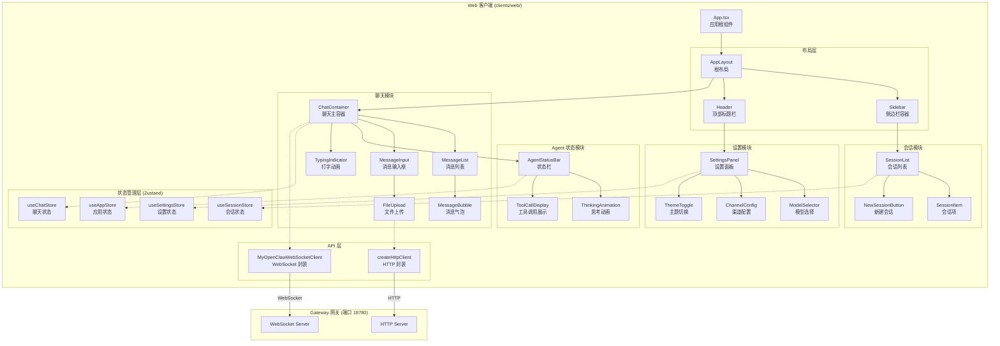
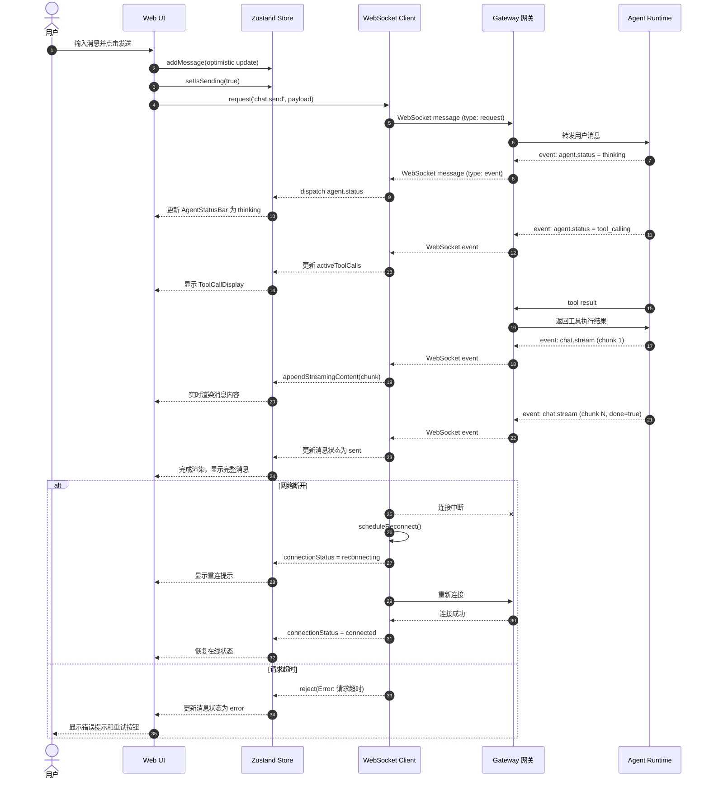

> **版本**：v1.1.0  
> **修订日期**：2026-07-21  
> **修订人**：MyOpenClaw Core Team  
> **文档状态**：正式发布

# 17. Web 客户端模块

## 目录

- [1. 模块概述](#1-模块概述)
- [2. 技术栈](#2-技术栈)
- [3. 项目目录结构](#3-项目目录结构)
- [4. 核心组件详解](#4-核心组件详解)
  - [4.1 连接管理组件](#41-连接管理组件)
  - [4.2 会话列表组件](#42-会话列表组件)
  - [4.3 聊天界面组件](#43-聊天界面组件)
  - [4.4 Agent 状态组件](#44-agent-状态组件)
  - [4.5 设置面板组件](#45-设置面板组件)
- [5. 状态管理](#5-状态管理)
- [6. Gateway API 封装](#6-gateway-api-封装)
- [7. 实时消息推送处理](#7-实时消息推送处理)
- [8. 主题与样式系统](#8-主题与样式系统)
- [9. 构建与部署](#9-构建与部署)
- [10. 完整 TypeScript 组件代码示例](#10-完整-typescript-组件代码示例)
- [11. Mermaid 架构图](#11-mermaid-架构图)

---

## 1. 模块概述

Web 客户端是 MyOpenClaw 框架的**官方前端应用**，为用户提供基于浏览器的图形化交互界面。作为 Hub-Spoke 架构中 **Clients 客户端层**的核心实现，Web 客户端通过 WebSocket 长连接与 Gateway 网关控制平面进行实时双向通信，是用户与 AI Agent 交互的主要入口。

### 1.1 设计定位

| 维度 | 说明 |
|------|------|
| 目标用户 | 需要图形化界面、偏好浏览器访问的普通用户和开发者 |
| 部署方式 | 静态资源部署，可与 Gateway 同域或独立部署 |
| 通信协议 | WebSocket（实时消息）+ HTTP（文件上传、配置拉取） |
| 架构角色 | Clients 层 → Channels 层 → Gateway 层 |

### 1.2 设计目标

1. **本地优先体验**：所有对话数据默认存储在本地浏览器（`localStorage` / `IndexedDB`），确保隐私可控
2. **实时响应**：基于 WebSocket 的全双工通信，支持消息即时推送和流式输出（SSE over WebSocket）
3. **多模态交互**：支持文本、图片、文件附件、代码块等多种消息类型的渲染与输入
4. **可扩展性**：插件化的组件设计，便于后续接入新的渠道类型和模型提供商
5. **开发者友好**：提供完整的类型定义、热重载开发环境和 Storybook 组件文档

### 1.3 与 Gateway 的通信方式

```
┌─────────────────┐      WebSocket (ws://localhost:18780)      ┌─────────────────┐
│                 │ ◄────────────────────────────────────────► │                 │
│   Web 客户端    │         消息类型: request / response        │   Gateway 网关   │
│  (React SPA)    │ ◄────────────────────────────────────────► │  (端口 18780)   │
│                 │         消息类型: event (服务端推送)        │                 │
└─────────────────┘                                            └─────────────────┘
         │                                                             │
         │ HTTP POST /api/upload                                       │
         └─────────────────────────────────────────────────────────────┘
```

Web 客户端与 Gateway 之间采用**双协议通信模型**：

- **WebSocket 主通道**：承担所有实时消息传输职责，包括用户消息发送、Agent 回复流式输出、系统事件推送
- **HTTP 辅助通道**：负责文件上传、大文件分片传输、初始化配置拉取等不适合通过 WebSocket 传输的操作

---

## 2. 技术栈

| 技术层 | 选型 | 版本 | 职责说明 |
|--------|------|------|----------|
| 框架 | React | 18.3.x | UI 组件化与响应式渲染 |
| 语言 | TypeScript | 5.4.x | 静态类型检查与代码提示 |
| 构建工具 | Vite | 5.x | 极速开发服务器与生产打包 |
| 状态管理 | Zustand | 4.5.x | 轻量级全局状态管理，支持持久化中间件 |
| UI 组件 | shadcn/ui + Radix UI | latest | 无障碍基础组件库 |
| 样式方案 | Tailwind CSS | 3.4.x | 原子化 CSS，支持深色模式 |
| 实时通信 | 原生 WebSocket API | - | 与 Gateway 建立长连接 |
| Markdown 渲染 | react-markdown + remark-gfm | 9.x | GitHub 风格 Markdown 渲染 |
| 代码高亮 | Prism.js / react-syntax-highlighter | - | 代码块语法高亮 |
| 图表渲染 | Mermaid (客户端) | 10.x | 消息中的 Mermaid 图表渲染 |
| 文件上传 | axios + HTML5 File API | - | 文件上传与进度监控 |
| 测试框架 | Vitest + React Testing Library | - | 单元测试与组件测试 |
| 类型检查 | Zod | 3.22.x | 运行时数据校验与类型安全 |

---

## 3. 项目目录结构

```
clients/web/
├── public/                          # 静态资源目录（不参与构建）
│   ├── favicon.ico                  # 站点图标
│   └── manifest.json                # PWA 配置清单
├── src/
│   ├── api/                         # API 封装层
│   │   ├── websocket.ts             # WebSocket 连接管理
│   │   ├── http.ts                  # HTTP API 封装（axios 实例）
│   │   ├── gateway.ts               # Gateway 消息协议封装
│   │   └── types.ts                 # API 类型定义
│   ├── components/                  # 业务组件目录
│   │   ├── ui/                      # shadcn/ui 基础组件
│   │   ├── layout/                  # 布局组件
│   │   │   ├── AppLayout.tsx        # 应用根布局（侧边栏 + 主内容区）
│   │   │   ├── Sidebar.tsx          # 左侧边栏容器
│   │   │   └── Header.tsx           # 顶部标题栏
│   │   ├── chat/                    # 聊天相关组件
│   │   │   ├── ChatContainer.tsx    # 聊天界面主容器
│   │   │   ├── MessageList.tsx      # 消息列表组件
│   │   │   ├── MessageBubble.tsx    # 消息气泡组件
│   │   │   ├── MessageInput.tsx     # 消息输入框组件
│   │   │   ├── TypingIndicator.tsx  # 打字中动画指示器
│   │   │   └── FileUpload.tsx       # 文件上传组件
│   │   ├── session/                 # 会话管理组件
│   │   │   ├── SessionList.tsx      # 会话列表组件
│   │   │   ├── SessionItem.tsx      # 单个会话项组件
│   │   │   └── NewSessionButton.tsx # 新建会话按钮
│   │   ├── agent/                   # Agent 状态组件
│   │   │   ├── AgentStatusBar.tsx   # Agent 状态栏
│   │   │   ├── ThinkingAnimation.tsx# Thinking 动画组件
│   │   │   └── ToolCallDisplay.tsx  # 工具调用展示组件
│   │   └── settings/                # 设置面板组件
│   │       ├── SettingsPanel.tsx    # 设置面板主组件
│   │       ├── ModelSelector.tsx    # LLM 模型选择器
│   │       ├── ChannelConfig.tsx    # 渠道配置表单
│   │       └── ThemeToggle.tsx      # 主题切换开关
│   ├── hooks/                       # 自定义 React Hooks
│   │   ├── useWebSocket.ts          # WebSocket 连接 Hook
│   │   ├── useChat.ts               # 聊天业务逻辑 Hook
│   │   ├── useSession.ts            # 会话管理 Hook
│   │   ├── useTheme.ts              # 主题管理 Hook
│   │   └── useAutoScroll.ts         # 自动滚动 Hook
│   ├── stores/                      # Zustand 状态存储
│   │   ├── useAppStore.ts           # 全局应用状态
│   │   ├── useChatStore.ts          # 聊天消息状态
│   │   ├── useSessionStore.ts       # 会话列表状态
│   │   └── useSettingsStore.ts      # 用户设置状态
│   ├── types/                       # TypeScript 类型定义
│   │   ├── message.ts               # 消息相关类型
│   │   ├── session.ts               # 会话相关类型
│   │   ├── agent.ts                 # Agent 相关类型
│   │   └── gateway.ts               # Gateway 协议类型
│   ├── utils/                       # 工具函数
│   │   ├── markdown.ts              # Markdown 处理工具
│   │   ├── format.ts                # 格式化工具（时间、大小等）
│   │   ├── storage.ts               # 本地存储封装
│   │   └── validators.ts            # 数据校验工具
│   ├── styles/                      # 样式文件
│   │   ├── globals.css              # 全局样式与 Tailwind 导入
│   │   └── themes.css               # 主题变量定义
│   ├── App.tsx                      # 应用根组件
│   ├── main.tsx                     # 应用入口文件
│   └── vite-env.d.ts                # Vite 环境类型声明
├── index.html                       # HTML 入口模板
├── vite.config.ts                   # Vite 配置文件
├── tailwind.config.ts               # Tailwind CSS 配置
├── tsconfig.json                    # TypeScript 配置
├── tsconfig.node.json               # Node 环境 TS 配置
├── package.json                     # 项目依赖与脚本
└── README.md                        # 项目说明文档
```

---

## 4. 核心组件详解

### 4.1 连接管理组件

连接管理是 Web 客户端的核心基础设施，负责维护与 Gateway 之间的 WebSocket 长连接，处理连接生命周期中的所有状态变化。

#### 4.1.1 功能职责

| 功能 | 说明 |
|------|------|
| 连接建立 | 根据配置自动连接 Gateway WebSocket 端点 |
| 自动重连 | 连接断开时按指数退避策略自动重连 |
| 心跳保活 | 定时发送 `ping` 帧，检测连接活性 |
| 状态暴露 | 向 UI 层暴露连接状态（连接中/已连接/已断开/重连中） |
| 消息路由 | 接收服务端消息并按类型分发到对应处理器 |

#### 4.1.2 重连机制设计

```typescript
// src/api/websocket.ts
// 指数退避重连策略配置
interface ReconnectConfig {
  // 初始重连间隔（毫秒）
  initialDelay: number;
  // 最大重连间隔（毫秒）
  maxDelay: number;
  // 退避乘数
  multiplier: number;
  // 最大重连次数，超过则放弃
  maxAttempts: number;
}

const DEFAULT_RECONNECT_CONFIG: ReconnectConfig = {
  initialDelay: 1000,   // 首次重连等待 1 秒
  maxDelay: 30000,      // 最大等待 30 秒
  multiplier: 2,        // 每次间隔翻倍
  maxAttempts: 10       // 最多尝试 10 次
};
```

#### 4.1.3 心跳保活机制

```typescript
// 心跳保活配置
interface HeartbeatConfig {
  // 心跳发送间隔（毫秒）
  interval: number;
  // 心跳超时时间（毫秒），超过此时间未收到 pong 则判定断开
  timeout: number;
}

const DEFAULT_HEARTBEAT: HeartbeatConfig = {
  interval: 30000,  // 每 30 秒发送一次 ping
  timeout: 10000    // 10 秒内未收到 pong 视为超时
};
```

#### 4.1.4 连接状态机

```
┌──────────┐    connect()     ┌──────────┐
│  idle    │ ───────────────► │connecting│
└──────────┘                  └────┬─────┘
     ▲                             │ open
     │                             ▼
     │                        ┌──────────┐
     │         close/         │ connected│
     └─────────────────────── │          │
       max attempts exceeded   └────┬─────┘
                                    │ message
                                    ▼
                              ┌──────────┐
                              │reconnect-│ ◄── 指数退避等待
                              │   ing    │
                              └──────────┘
```

### 4.2 会话列表组件

会话列表组件负责展示用户的历史会话，支持新建、切换、删除等操作。

#### 4.2.1 数据结构

```typescript
// src/types/session.ts

/**
 * 会话对象类型定义
 * 每个会话代表与 Agent 的一次独立对话上下文
 */
interface Session {
  // 全局唯一标识符（UUID v4）
  id: string;
  // 会话标题（默认取首条用户消息前 20 字，可手动编辑）
  title: string;
  // 创建时间戳（ISO 8601 格式）
  createdAt: string;
  // 最后更新时间戳
  updatedAt: string;
  // 会话状态：active | archived | deleted
  status: 'active' | 'archived' | 'deleted';
  // 当前会话绑定的渠道 ID
  channelId?: string;
  // 当前会话使用的模型 ID
  modelId?: string;
  // 会话元数据（扩展字段）
  metadata?: Record<string, unknown>;
}
```

#### 4.2.2 组件交互流程

```
用户点击"新建会话"
        │
        ▼
┌───────────────┐     ┌─────────────────┐     ┌─────────────────┐
│ 生成新 Session │ ──► │ 添加到会话列表    │ ──► │ 自动切换到新会话  │
│   (UUIDv4)    │     │  (Zustand Store) │     │ (更新当前会话 ID) │
└───────────────┘     └─────────────────┘     └─────────────────┘
                                                         │
                              ┌──────────────────────────┘
                              ▼
                    ┌─────────────────┐
                    │  Gateway 发送    │
                    │ session.create   │
                    │ 请求同步到服务端  │
                    └─────────────────┘
```

### 4.3 聊天界面组件

聊天界面是 Web 客户端的核心交互区域，包含消息列表、输入框、文件上传等子组件。

#### 4.3.1 消息类型体系

```typescript
// src/types/message.ts

/**
 * 消息内容块类型枚举
 * 支持多模态消息，一条消息可由多个内容块组成
 */
type ContentBlock =
  | { type: 'text'; text: string }
  | { type: 'image'; url: string; mimeType: string }
  | { type: 'file'; name: string; url: string; size: number; mimeType: string }
  | { type: 'code'; code: string; language?: string }
  | { type: 'tool_call'; toolName: string; arguments: Record<string, unknown> }
  | { type: 'tool_result'; toolName: string; result: unknown; success: boolean };

/**
 * 消息角色枚举
 */
type MessageRole = 'user' | 'assistant' | 'system' | 'tool';

/**
 * 消息对象完整类型定义
 */
interface ChatMessage {
  // 消息唯一标识
  id: string;
  // 所属会话 ID
  sessionId: string;
  // 消息角色
  role: MessageRole;
  // 消息内容块数组（支持多模态混合）
  content: ContentBlock[];
  // 消息发送时间戳
  timestamp: string;
  // 消息状态：sending | sent | error | streaming
  status: 'sending' | 'sent' | 'error' | 'streaming';
  // 错误信息（当 status 为 error 时）
  error?: string;
  // 消息元数据（Token 使用量、模型名称等）
  metadata?: {
    model?: string;
    tokensUsed?: number;
    latencyMs?: number;
  };
}
```

#### 4.3.2 Markdown 渲染策略

Web 客户端使用 `react-markdown` 配合自定义组件实现安全的 Markdown 渲染：

| Markdown 元素 | 渲染组件 | 说明 |
|--------------|---------|------|
| 段落 `p` | 自定义段落组件 | 支持行间公式识别 |
| 代码块 `code` | `SyntaxHighlighter` | 支持语法高亮和复制按钮 |
| 行内代码 | `code` 标签 | 特殊背景色样式 |
| 表格 `table` | 带滚动容器的表格 | 响应式横向滚动 |
| 引用 `blockquote` | 左侧色条引用块 | 区分不同来源引用 |
| Mermaid 代码块 | `MermaidRenderer` | 动态渲染流程图 |
| 链接 `a` | 新标签页打开的安全链接 | 防止钓鱼攻击 |

### 4.4 Agent 状态组件

Agent 状态组件用于向用户展示 AI Agent 的实时运行状态，增强系统的透明度和可解释性。

#### 4.4.1 状态定义

```typescript
// src/types/agent.ts

/**
 * Agent 运行状态枚举
 */
type AgentStatus =
  | 'idle'           // 空闲状态，等待用户输入
  | 'thinking'       // 正在思考/推理
  | 'tool_calling'   // 正在调用外部工具
  | 'streaming'      // 正在流式输出回复
  | 'error';         // 运行出错

/**
 * 工具调用记录
 */
interface ToolCall {
  // 工具调用唯一标识
  id: string;
  // 工具名称
  toolName: string;
  // 调用参数
  arguments: Record<string, unknown>;
  // 调用开始时间
  startTime: string;
  // 调用结束时间
  endTime?: string;
  // 调用结果
  result?: unknown;
  // 调用状态
  status: 'pending' | 'running' | 'success' | 'error';
}

/**
 * Agent 状态快照
 */
interface AgentState {
  // 当前状态
  status: AgentStatus;
  // 当前正在执行的工具调用列表
  activeToolCalls: ToolCall[];
  // 当前使用的模型
  currentModel: string;
  // 状态开始时间
  statusSince: string;
}
```

#### 4.4.2 Thinking 动画设计

Thinking 动画采用**三段式脉冲点**设计，传达 Agent 正在"思考"的认知隐喻：

```
[● ○ ○]  →  [● ● ○]  →  [● ● ●]  →  [○ ○ ○]  →  循环
  阶段1      阶段2       阶段3       重置
```

动画参数：
- 单周期时长：1200ms
- 缓动函数：`ease-in-out`
- 颜色：主题色 `primary-500`

### 4.5 设置面板组件

设置面板提供用户对客户端行为的个性化配置能力，以抽屉（Drawer）形式从右侧滑出。

#### 4.5.1 配置项清单

| 配置分类 | 配置项 | 数据类型 | 默认值 | 持久化 |
|---------|--------|---------|--------|--------|
| LLM 模型 | 默认模型 | `string` | `gpt-4o` | 是 |
| LLM 模型 | 温度参数 | `number` | `0.7` | 是 |
| LLM 模型 | 最大 Token | `number` | `4096` | 是 |
| 渠道配置 | 默认渠道 | `string` | `default` | 是 |
| 渠道配置 | 渠道参数覆盖 | `object` | `{}` | 是 |
| 界面设置 | 主题模式 | `'light' \| 'dark' \| 'system'` | `system` | 是 |
| 界面设置 | 消息字体大小 | `'sm' \| 'md' \| 'lg'` | `md` | 是 |
| 界面设置 | 代码主题 | `string` | `github-dark` | 是 |
| 界面设置 | 显示 Token 用量 | `boolean` | `false` | 是 |
| 高级设置 | 自动重连 | `boolean` | `true` | 是 |
| 高级设置 | 消息同步到服务端 | `boolean` | `false` | 是 |

---

## 5. 状态管理

Web 客户端采用 **Zustand** 作为全局状态管理方案。相比 Redux 和 Context API，Zustand 具有更轻量的体积、更简洁的 API 和更好的 TypeScript 支持。

### 5.1 存储架构设计

```
┌─────────────────────────────────────────────────────────────┐
│                      Zustand Store 分层                      │
├─────────────────────────────────────────────────────────────┤
│  useAppStore       │  应用级全局状态（连接状态、主题、侧边栏）  │
├─────────────────────────────────────────────────────────────┤
│  useChatStore      │  聊天消息状态（当前会话消息列表、输入草稿） │
├─────────────────────────────────────────────────────────────┤
│  useSessionStore   │  会话列表状态（所有会话、当前选中会话）     │
├─────────────────────────────────────────────────────────────┤
│  useSettingsStore  │  用户设置状态（LLM 配置、界面偏好）        │
└─────────────────────────────────────────────────────────────┘
                              │
                              ▼
                    ┌─────────────────┐
                    │ 持久化中间件     │
                    │ (localStorage   │
                    │  / IndexedDB)   │
                    └─────────────────┘
```

### 5.2 核心 Store 实现

```typescript
// src/stores/useChatStore.ts

import { create } from 'zustand';
import { persist, createJSONStorage } from 'zustand/middleware';
import type { ChatMessage, ContentBlock } from '@/types/message';

/**
 * 聊天状态存储接口定义
 * 包含消息列表、流式消息缓冲、输入草稿等状态
 */
interface ChatState {
  // ─── 状态字段 ───
  /** 当前会话的所有消息列表 */
  messages: ChatMessage[];
  /** 正在流式接收中的消息片段（用于实时渲染打字机效果） */
  streamingContent: string;
  /** 输入框当前草稿内容 */
  inputDraft: string;
  /** 当前是否有消息正在发送中 */
  isSending: boolean;

  // ─── Actions ───
  /** 添加一条新消息到列表 */
  addMessage: (message: ChatMessage) => void;
  /** 更新指定消息（用于流式更新或状态变更） */
  updateMessage: (id: string, updater: (msg: ChatMessage) => ChatMessage) => void;
  /** 追加流式内容到当前流式消息 */
  appendStreamingContent: (chunk: string) => void;
  /** 清空流式内容缓冲 */
  clearStreamingContent: () => void;
  /** 设置输入框草稿 */
  setInputDraft: (draft: string) => void;
  /** 设置发送状态 */
  setIsSending: (sending: boolean) => void;
  /** 清空当前会话消息 */
  clearMessages: () => void;
}

/**
 * 创建聊天状态 Store
 * 使用 persist 中间件实现 localStorage 持久化
 */
export const useChatStore = create<ChatState>()(
  persist(
    (set, get) => ({
      // 初始状态
      messages: [],
      streamingContent: '',
      inputDraft: '',
      isSending: false,

      /**
       * 添加消息到列表末尾
       * @param message - 要添加的完整消息对象
       */
      addMessage: (message) =>
        set((state) => ({
          messages: [...state.messages, message],
        })),

      /**
       * 通过 updater 函数更新指定消息
       * 使用不可变更新模式确保 React 正确触发重渲染
       * @param id - 目标消息 ID
       * @param updater - 接收旧消息返回新消息的纯函数
       */
      updateMessage: (id, updater) =>
        set((state) => ({
          messages: state.messages.map((msg) =>
            msg.id === id ? updater(msg) : msg
          ),
        })),

      /**
       * 追加流式内容到缓冲
       * 用于逐步渲染 Agent 的回复内容
       * @param chunk - 接收到的文本片段
       */
      appendStreamingContent: (chunk) =>
        set((state) => ({
          streamingContent: state.streamingContent + chunk,
        })),

      /** 清空流式内容缓冲 */
      clearStreamingContent: () => set({ streamingContent: '' }),

      /** 更新输入框草稿 */
      setInputDraft: (draft) => set({ inputDraft: draft }),

      /** 更新发送中状态 */
      setIsSending: (sending) => set({ isSending: sending }),

      /** 清空消息列表 */
      clearMessages: () => set({ messages: [] }),
    }),
    {
      // persist 中间件配置：只持久化 messages 和 inputDraft
      name: 'myopenclaw-chat-storage',
      storage: createJSONStorage(() => localStorage),
      partialize: (state) => ({
        messages: state.messages,
        inputDraft: state.inputDraft,
      }),
    }
  )
);
```

### 5.3 Store 间依赖处理

当多个 Store 之间需要协作时，采用**事件总线**模式解耦：

```typescript
// src/stores/useAppStore.ts

import { create } from 'zustand';

/**
 * 全局事件类型定义
 */
type AppEvent =
  | { type: 'SESSION_SWITCHED'; payload: { sessionId: string } }
  | { type: 'CONNECTION_STATUS_CHANGED'; payload: { status: string } }
  | { type: 'SETTINGS_CHANGED'; payload: { key: string; value: unknown } };

interface AppState {
  // 连接状态
  connectionStatus: 'idle' | 'connecting' | 'connected' | 'disconnected' | 'reconnecting';
  // 侧边栏展开状态
  sidebarOpen: boolean;
  // 全局错误提示
  globalError: string | null;
  // 事件分发方法
  dispatch: (event: AppEvent) => void;
  // Actions
  setConnectionStatus: (status: AppState['connectionStatus']) => void;
  toggleSidebar: () => void;
  setGlobalError: (error: string | null) => void;
}

export const useAppStore = create<AppState>((set, get) => ({
  connectionStatus: 'idle',
  sidebarOpen: true,
  globalError: null,

  /**
   * 事件分发中心
   * 其他 Store 或组件可通过订阅此事件进行跨模块通信
   */
  dispatch: (event) => {
    // 根据事件类型执行对应处理
    switch (event.type) {
      case 'SESSION_SWITCHED':
        // 切换会话时清空当前聊天状态
        // 通过导入 useChatStore 的 getState 方法直接操作
        break;
      case 'CONNECTION_STATUS_CHANGED':
        set({ connectionStatus: event.payload.status as AppState['connectionStatus'] });
        break;
    }
  },

  setConnectionStatus: (status) => set({ connectionStatus: status }),
  toggleSidebar: () => set((state) => ({ sidebarOpen: !state.sidebarOpen })),
  setGlobalError: (error) => set({ globalError: error }),
}));
```

---

## 6. Gateway API 封装

### 6.1 WebSocket 消息协议

Gateway 定义了三类消息协议，Web 客户端需要完整实现发送和接收逻辑：

| 消息类型 | 方向 | 说明 |
|---------|------|------|
| `request` | 客户端 → 服务端 | 用户发起的请求（发送消息、创建会话等） |
| `response` | 服务端 → 客户端 | 请求的响应结果 |
| `event` | 服务端 → 客户端 | 服务端主动推送的事件（流式消息、状态变更） |

#### 6.1.1 消息 envelope 格式

```typescript
// src/types/gateway.ts

/**
 * Gateway 消息通用信封结构
 * 所有 WebSocket 消息均采用此格式封装
 */
interface GatewayMessage<T = unknown> {
  // 消息唯一标识（UUID v4，用于请求-响应关联）
  id: string;
  // 消息类型：request | response | event
  type: 'request' | 'response' | 'event';
  // 消息动作/事件名称
  action: string;
  // 消息负载数据
  payload: T;
  // 时间戳（ISO 8601）
  timestamp: string;
  // 关联的请求 ID（仅 response 类型需要）
  requestId?: string;
}

/**
 * 请求消息专用类型
 */
interface RequestMessage<T = unknown> extends GatewayMessage<T> {
  type: 'request';
}

/**
 * 响应消息专用类型
 */
interface ResponseMessage<T = unknown> extends GatewayMessage<T> {
  type: 'response';
  requestId: string;
  // 响应状态：success | error
  status: 'success' | 'error';
  // 错误信息（当 status 为 error 时）
  error?: {
    code: string;
    message: string;
  };
}

/**
 * 事件消息专用类型
 */
interface EventMessage<T = unknown> extends GatewayMessage<T> {
  type: 'event';
  // 事件名称
  event: string;
}
```

### 6.2 WebSocket 客户端封装类

```typescript
// src/api/websocket.ts

import { z } from 'zod';
import type { GatewayMessage, RequestMessage, EventMessage } from '@/types/gateway';

/**
 * WebSocket 连接配置接口
 */
interface WebSocketConfig {
  // Gateway WebSocket 端点地址
  url: string;
  // 连接超时时间（毫秒）
  connectTimeout?: number;
  // 心跳配置
  heartbeat?: {
    interval: number;
    timeout: number;
  };
  // 重连配置
  reconnect?: {
    initialDelay: number;
    maxDelay: number;
    multiplier: number;
    maxAttempts: number;
  };
}

/**
 * 消息处理器类型定义
 * 用于注册各类消息的回调处理函数
 */
type MessageHandler<T = unknown> = (message: GatewayMessage<T>) => void;

/**
 * MyOpenClaw WebSocket 客户端封装类
 * 提供类型安全的消息收发、自动重连、心跳保活等功能
 */
export class MyOpenClawWebSocketClient {
  // WebSocket 原生实例
  private ws: WebSocket | null = null;
  // 当前连接配置
  private config: Required<WebSocketConfig>;
  // 消息处理器注册表：事件名 → 处理器数组
  private handlers: Map<string, Set<MessageHandler>> = new Map();
  // 响应等待映射：请求 ID → { resolve, reject, timer }
  private pendingRequests: Map<
    string,
    { resolve: (value: unknown) => void; reject: (reason: Error) => void; timer: ReturnType<typeof setTimeout> }
  > = new Map();
  // 连接状态
  private connectionState: 'idle' | 'connecting' | 'connected' | 'disconnected' | 'reconnecting' = 'idle';
  // 重连相关状态
  private reconnectAttempt = 0;
  private reconnectTimer: ReturnType<typeof setTimeout> | null = null;
  // 心跳相关状态
  private heartbeatTimer: ReturnType<typeof setInterval> | null = null;
  private heartbeatTimeoutTimer: ReturnType<typeof setTimeout> | null = null;

  /**
   * 构造函数
   * @param config - WebSocket 连接配置对象
   */
  constructor(config: WebSocketConfig) {
    // 合并默认配置
    this.config = {
      connectTimeout: 10000,
      heartbeat: { interval: 30000, timeout: 10000 },
      reconnect: { initialDelay: 1000, maxDelay: 30000, multiplier: 2, maxAttempts: 10 },
      ...config,
    };
  }

  /**
   * 获取当前连接状态
   * @returns 当前状态字符串
   */
  get state() {
    return this.connectionState;
  }

  /**
   * 建立 WebSocket 连接
   * 包含连接超时检测和状态迁移逻辑
   * @returns Promise，连接成功时 resolve，失败时 reject
   */
  connect(): Promise<void> {
    return new Promise((resolve, reject) => {
      if (this.ws?.readyState === WebSocket.OPEN) {
        resolve();
        return;
      }

      this.connectionState = 'connecting';
      this.emitStateChange();

      // 创建原生 WebSocket 实例
      this.ws = new WebSocket(this.config.url);

      // 设置连接超时定时器
      const timeoutTimer = setTimeout(() => {
        this.ws?.close();
        this.connectionState = 'disconnected';
        this.emitStateChange();
        reject(new Error(`WebSocket 连接超时（${this.config.connectTimeout}ms）`));
      }, this.config.connectTimeout);

      // 连接建立成功回调
      this.ws.onopen = () => {
        clearTimeout(timeoutTimer);
        this.connectionState = 'connected';
        this.reconnectAttempt = 0; // 重置重连计数
        this.emitStateChange();
        this.startHeartbeat(); // 启动心跳保活
        resolve();
      };

      // 消息接收回调
      this.ws.onmessage = (event) => {
        this.handleMessage(event.data);
      };

      // 连接关闭回调
      this.ws.onclose = (event) => {
        clearTimeout(timeoutTimer);
        this.stopHeartbeat();
        this.connectionState = 'disconnected';
        this.emitStateChange();
        // 非主动关闭时触发自动重连
        if (!event.wasClean) {
          this.scheduleReconnect();
        }
      };

      // 连接错误回调
      this.ws.onerror = (error) => {
        clearTimeout(timeoutTimer);
        this.connectionState = 'disconnected';
        this.emitStateChange();
        reject(new Error('WebSocket 连接发生错误'));
      };
    });
  }

  /**
   * 发送请求消息并等待响应
   * 实现请求-响应模式，通过 requestId 关联响应
   * @param action - 请求动作名称
   * @param payload - 请求负载数据
   * @param timeout - 超时时间（毫秒），默认 30000
   * @returns Promise，解析响应 payload
   */
  async request<T = unknown>(action: string, payload: unknown, timeout = 30000): Promise<T> {
    if (this.ws?.readyState !== WebSocket.OPEN) {
      throw new Error('WebSocket 未连接，无法发送请求');
    }

    // 生成请求唯一标识
    const requestId = crypto.randomUUID();
    const message: RequestMessage<unknown> = {
      id: crypto.randomUUID(),
      type: 'request',
      action,
      payload,
      timestamp: new Date().toISOString(),
      requestId,
    };

    return new Promise<T>((resolve, reject) => {
      // 设置响应超时定时器
      const timer = setTimeout(() => {
        this.pendingRequests.delete(requestId);
        reject(new Error(`请求超时（${timeout}ms）：${action}`));
      }, timeout);

      // 注册到等待映射表
      this.pendingRequests.set(requestId, {
        resolve: resolve as (value: unknown) => void,
        reject,
        timer,
      });

      // 发送消息
      this.ws!.send(JSON.stringify(message));
    });
  }

  /**
   * 发送单向事件消息（不需要响应）
   * @param action - 事件动作名称
   * @param payload - 事件负载数据
   */
  send(action: string, payload: unknown): void {
    if (this.ws?.readyState !== WebSocket.OPEN) {
      throw new Error('WebSocket 未连接，无法发送消息');
    }

    const message: GatewayMessage<unknown> = {
      id: crypto.randomUUID(),
      type: 'request',
      action,
      payload,
      timestamp: new Date().toISOString(),
    };

    this.ws.send(JSON.stringify(message));
  }

  /**
   * 注册事件消息处理器
   * 支持同一事件注册多个处理器
   * @param event - 事件名称
   * @param handler - 处理函数
   */
  on<T = unknown>(event: string, handler: MessageHandler<T>): void {
    if (!this.handlers.has(event)) {
      this.handlers.set(event, new Set());
    }
    this.handlers.get(event)!.add(handler as MessageHandler);
  }

  /**
   * 注销事件消息处理器
   * @param event - 事件名称
   * @param handler - 要注销的处理函数
   */
  off<T = unknown>(event: string, handler: MessageHandler<T>): void {
    this.handlers.get(event)?.delete(handler as MessageHandler);
  }

  /**
   * 主动关闭连接
   */
  disconnect(): void {
    this.stopHeartbeat();
    if (this.reconnectTimer) {
      clearTimeout(this.reconnectTimer);
      this.reconnectTimer = null;
    }
    // 标记为正常关闭，避免触发重连
    this.ws?.close(1000, '客户端主动断开');
    this.ws = null;
    this.connectionState = 'idle';
    this.emitStateChange();
  }

  // ─── 私有方法 ───

  /**
   * 处理接收到的消息
   * 解析 JSON 并根据消息类型分发到对应处理器
   * @param data - 接收到的原始消息数据
   */
  private handleMessage(data: string): void {
    try {
      const message = JSON.parse(data) as GatewayMessage<unknown>;

      // 消息格式校验（使用 Zod 运行时校验）
      if (!message.id || !message.type || !message.action) {
        console.warn('[WebSocket] 收到格式无效的消息:', data);
        return;
      }

      // 类型分发处理
      if (message.type === 'response' && 'requestId' in message) {
        // 响应消息：查找 pendingRequests 并 resolve/reject
        const pending = this.pendingRequests.get(message.requestId!);
        if (pending) {
          clearTimeout(pending.timer);
          this.pendingRequests.delete(message.requestId!);
          if (message.status === 'error') {
            pending.reject(new Error(message.error?.message || '请求失败'));
          } else {
            pending.resolve(message.payload);
          }
        }
      } else if (message.type === 'event') {
        // 事件消息：分发给已注册的处理器
        const eventHandlers = this.handlers.get(message.action);
        if (eventHandlers) {
          eventHandlers.forEach((handler) => {
            try {
              handler(message);
            } catch (err) {
              console.error(`[WebSocket] 事件处理器执行错误 (${message.action}):`, err);
            }
          });
        }
      }
    } catch (err) {
      console.error('[WebSocket] 消息解析失败:', err);
    }
  }

  /**
   * 启动心跳保活机制
   * 定时发送 ping 消息，检测连接活性
   */
  private startHeartbeat(): void {
    this.heartbeatTimer = setInterval(() => {
      if (this.ws?.readyState === WebSocket.OPEN) {
        // 发送 ping 帧（使用原生 WebSocket ping/pong 或自定义消息）
        this.ws.send(JSON.stringify({ type: 'ping', timestamp: Date.now() }));

        // 设置 pong 超时检测
        this.heartbeatTimeoutTimer = setTimeout(() => {
          console.warn('[WebSocket] 心跳超时，连接可能已失效');
          this.ws?.close();
        }, this.config.heartbeat.timeout);
      }
    }, this.config.heartbeat.interval);
  }

  /**
   * 停止心跳保活机制
   */
  private stopHeartbeat(): void {
    if (this.heartbeatTimer) {
      clearInterval(this.heartbeatTimer);
      this.heartbeatTimer = null;
    }
    if (this.heartbeatTimeoutTimer) {
      clearTimeout(this.heartbeatTimeoutTimer);
      this.heartbeatTimeoutTimer = null;
    }
  }

  /**
   * 调度自动重连
   * 使用指数退避算法计算下次重连延迟
   */
  private scheduleReconnect(): void {
    if (this.reconnectAttempt >= this.config.reconnect.maxAttempts) {
      console.error('[WebSocket] 达到最大重连次数，放弃重连');
      this.connectionState = 'disconnected';
      this.emitStateChange();
      return;
    }

    this.connectionState = 'reconnecting';
    this.emitStateChange();

    // 指数退避计算延迟
    const delay = Math.min(
      this.config.reconnect.initialDelay * Math.pow(this.config.reconnect.multiplier, this.reconnectAttempt),
      this.config.reconnect.maxDelay
    );

    console.log(`[WebSocket] ${delay}ms 后尝试第 ${this.reconnectAttempt + 1} 次重连...`);

    this.reconnectTimer = setTimeout(() => {
      this.reconnectAttempt++;
      this.connect().catch(() => {
        // 连接失败时继续调度下一次重连
        this.scheduleReconnect();
      });
    }, delay);
  }

  /**
   * 触发状态变更通知
   * 通过 window 事件机制通知 UI 层
   */
  private emitStateChange(): void {
    window.dispatchEvent(
      new CustomEvent('myopenclaw:ws:statechange', {
        detail: { state: this.connectionState },
      })
    );
  }
}
```

### 6.3 HTTP API 封装

```typescript
// src/api/http.ts

import axios, { AxiosInstance, AxiosRequestConfig } from 'axios';

/**
 * HTTP API 客户端配置
 */
interface HttpClientConfig {
  // Gateway HTTP API 基础地址
  baseURL: string;
  // 默认请求超时
  timeout?: number;
}

/**
 * 创建带统一拦截器的 Axios 实例
 * 用于文件上传、配置拉取等 HTTP 操作
 */
export function createHttpClient(config: HttpClientConfig): AxiosInstance {
  const client = axios.create({
    baseURL: config.baseURL,
    timeout: config.timeout || 30000,
    headers: {
      'Content-Type': 'application/json',
    },
  });

  // 请求拦截器：添加通用请求头
  client.interceptors.request.use(
    (config) => {
      // 可在此处添加认证 Token 等
      return config;
    },
    (error) => Promise.reject(error)
  );

  // 响应拦截器：统一错误处理
  client.interceptors.response.use(
    (response) => response.data,
    (error) => {
      const message = error.response?.data?.message || error.message || '网络请求失败';
      return Promise.reject(new Error(message));
    }
  );

  return client;
}

/**
 * 文件上传专用 API
 * 支持上传进度监控和大文件分片
 */
export async function uploadFile(
  client: AxiosInstance,
  file: File,
  onProgress?: (progress: number) => void
): Promise<{ url: string; name: string; size: number }> {
  const formData = new FormData();
  formData.append('file', file);

  const response = await client.post('/api/upload', formData, {
    headers: { 'Content-Type': 'multipart/form-data' },
    onUploadProgress: (progressEvent) => {
      if (progressEvent.total && onProgress) {
        const percent = Math.round((progressEvent.loaded * 100) / progressEvent.total);
        onProgress(percent);
      }
    },
  });

  return response as { url: string; name: string; size: number };
}
```

---

## 7. 实时消息推送处理

### 7.1 事件订阅机制

Web 客户端通过事件订阅模式处理 Gateway 推送的各类实时事件：

```typescript
// src/hooks/useChat.ts

import { useEffect, useCallback } from 'react';
import { useChatStore } from '@/stores/useChatStore';
import { useAppStore } from '@/stores/useAppStore';
import { wsClient } from '@/api/gateway'; // WebSocket 单例实例

/**
 * 聊天业务逻辑自定义 Hook
 * 封装消息发送、接收、流式渲染等核心逻辑
 */
export function useChat(sessionId: string) {
  const { messages, addMessage, updateMessage, appendStreamingContent, clearStreamingContent, setIsSending } =
    useChatStore();

  /**
   * 发送用户消息
   * 将消息添加到本地状态并通过 WebSocket 发送到 Gateway
   */
  const sendMessage = useCallback(
    async (content: string, attachments?: File[]) => {
      setIsSending(true);

      // 1. 创建用户消息对象
      const userMessage: ChatMessage = {
        id: crypto.randomUUID(),
        sessionId,
        role: 'user',
        content: [{ type: 'text', text: content }],
        timestamp: new Date().toISOString(),
        status: 'sending',
      };

      // 2. 先乐观更新到 UI
      addMessage(userMessage);

      try {
        // 3. 如果有附件，先上传文件
        let uploadedAttachments: Array<{ type: 'file'; name: string; url: string; size: number; mimeType: string }> = [];
        if (attachments && attachments.length > 0) {
          uploadedAttachments = await Promise.all(
            attachments.map(async (file) => {
              const result = await uploadFile(file);
              return {
                type: 'file' as const,
                name: file.name,
                url: result.url,
                size: file.size,
                mimeType: file.type,
              };
            })
          );
          // 更新消息添加附件
          updateMessage(userMessage.id, (msg) => ({
            ...msg,
            content: [...msg.content, ...uploadedAttachments],
          }));
        }

        // 4. 通过 WebSocket 发送消息请求
        await wsClient.request('chat.send', {
          sessionId,
          messageId: userMessage.id,
          content,
          attachments: uploadedAttachments,
        });

        // 5. 更新消息状态为已发送
        updateMessage(userMessage.id, (msg) => ({ ...msg, status: 'sent' }));
      } catch (error) {
        // 6. 发送失败时更新错误状态
        updateMessage(userMessage.id, (msg) => ({
          ...msg,
          status: 'error',
          error: error instanceof Error ? error.message : '发送失败',
        }));
      } finally {
        setIsSending(false);
      }
    },
    [sessionId, addMessage, updateMessage, setIsSending]
  );

  /**
   * 订阅流式消息事件
   * 使用 useEffect 在组件挂载时注册事件处理器
   */
  useEffect(() => {
    /**
     * 处理流式内容块事件
     * Gateway 会将 Agent 回复拆分为多个 chunk 逐个推送
     */
    const handleStreamChunk = (event: GatewayMessage<{ messageId: string; chunk: string; done: boolean }>) => {
      const { messageId, chunk, done } = event.payload;

      // 查找或创建对应的 Assistant 消息
      const existingMessage = useChatStore.getState().messages.find((m) => m.id === messageId);

      if (!existingMessage) {
        // 首次接收到该消息的 chunk，创建新消息
        addMessage({
          id: messageId,
          sessionId,
          role: 'assistant',
          content: [{ type: 'text', text: chunk }],
          timestamp: new Date().toISOString(),
          status: 'streaming',
        });
      } else {
        // 追加内容到现有消息
        updateMessage(messageId, (msg) => ({
          ...msg,
          content: msg.content.map((block, idx) =>
            idx === 0 && block.type === 'text' ? { ...block, text: block.text + chunk } : block
          ),
        }));
      }

      // 流式传输完成
      if (done) {
        updateMessage(messageId, (msg) => ({ ...msg, status: 'sent' }));
      }
    };

    /**
     * 处理 Agent 状态变更事件
     */
    const handleAgentStatus = (event: GatewayMessage<{ status: string; toolCalls?: unknown[] }>) => {
      useAppStore.getState().setAgentState({
        status: event.payload.status,
        activeToolCalls: (event.payload.toolCalls as ToolCall[]) || [],
      });
    };

    // 注册事件监听器
    wsClient.on('chat.stream', handleStreamChunk);
    wsClient.on('agent.status', handleAgentStatus);

    // 组件卸载时注销监听器，防止内存泄漏
    return () => {
      wsClient.off('chat.stream', handleStreamChunk);
      wsClient.off('agent.status', handleAgentStatus);
    };
  }, [sessionId, addMessage, updateMessage]);

  // 过滤当前会话的消息并按时间排序
  const sessionMessages = messages
    .filter((msg) => msg.sessionId === sessionId)
    .sort((a, b) => new Date(a.timestamp).getTime() - new Date(b.timestamp).getTime());

  return {
    messages: sessionMessages,
    sendMessage,
  };
}
```

### 7.2 打字机效果实现

打字机效果通过流式消息接收配合 CSS 动画实现：

```typescript
// src/components/chat/TypingIndicator.tsx

import React from 'react';

/**
 * 打字中动画指示器组件
 * 当 Agent 正在生成回复时显示三个脉冲点
 */
export const TypingIndicator: React.FC = () => {
  return (
    <div className="flex items-center gap-1 px-4 py-3">
      <span className="text-sm text-muted-foreground mr-2">Agent 正在思考</span>
      <div className="flex gap-1">
        {/* 三个脉冲点，使用 CSS animation 实现错开动画 */}
        <span
          className="w-2 h-2 rounded-full bg-primary animate-bounce"
          style={{ animationDelay: '0ms' }}
        />
        <span
          className="w-2 h-2 rounded-full bg-primary animate-bounce"
          style={{ animationDelay: '150ms' }}
        />
        <span
          className="w-2 h-2 rounded-full bg-primary animate-bounce"
          style={{ animationDelay: '300ms' }}
        />
      </div>
    </div>
  );
};
```

### 7.3 消息排序与去重

```typescript
// src/utils/message.ts

import type { ChatMessage } from '@/types/message';

/**
 * 消息排序与去重工具函数
 * 确保消息列表按时间正序排列且无重复消息
 *
 * @param messages - 原始消息数组
 * @returns 排序且去重后的消息数组
 */
export function sortAndDeduplicateMessages(messages: ChatMessage[]): ChatMessage[] {
  // 使用 Map 按消息 ID 去重，保留最后出现的版本（状态最新）
  const messageMap = new Map<string, ChatMessage>();

  for (const msg of messages) {
    const existing = messageMap.get(msg.id);
    // 如果已存在，比较时间戳保留更新的版本
    if (!existing || new Date(msg.timestamp) > new Date(existing.timestamp)) {
      messageMap.set(msg.id, msg);
    }
  }

  // 转换为数组并按时间戳正序排列（旧的在前，新的在后）
  return Array.from(messageMap.values()).sort(
    (a, b) => new Date(a.timestamp).getTime() - new Date(b.timestamp).getTime()
  );
}
```

---

## 8. 主题与样式系统

### 8.1 主题变量设计

Web 客户端采用 **CSS 变量 + Tailwind CSS** 的双层主题方案，支持 Light / Dark / System 三种模式。

```css
/* src/styles/themes.css */

/**
 * 浅色主题变量定义
 * 使用 :root 选择器作为默认主题
 */
:root {
  /* 背景色层级 */
  --background: 0 0% 100%;           /* 主背景：纯白 */
  --foreground: 222.2 84% 4.9%;      /* 主文字：近黑 */
  --card: 0 0% 100%;                 /* 卡片背景 */
  --card-foreground: 222.2 84% 4.9%; /* 卡片文字 */
  --popover: 0 0% 100%;              /* 浮层背景 */
  --popover-foreground: 222.2 84% 4.9%;

  /* 主题色板（HSL 格式，便于 Tailwind 解析） */
  --primary: 221.2 83.2% 53.3%;      /* 主色调：科技蓝 */
  --primary-foreground: 210 40% 98%; /* 主色上的文字 */
  --secondary: 210 40% 96.1%;        /* 次要色 */
  --secondary-foreground: 222.2 47.4% 11.2%;
  --muted: 210 40% 96.1%;            /* 静音/辅助背景 */
  --muted-foreground: 215.4 16.3% 46.9%; /* 辅助文字 */
  --accent: 210 40% 96.1%;           /* 强调色 */
  --accent-foreground: 222.2 47.4% 11.2%;

  /* 功能色 */
  --destructive: 0 84.2% 60.2%;      /* 危险/错误色 */
  --destructive-foreground: 210 40% 98%;
  --success: 142.1 76.2% 36.3%;      /* 成功色 */
  --warning: 38 92% 50%;             /* 警告色 */

  /* 边框与输入 */
  --border: 214.3 31.8% 91.4%;
  --input: 214.3 31.8% 91.4%;
  --ring: 221.2 83.2% 53.3%;         /* 焦点环 */

  /* 圆角 */
  --radius: 0.5rem;
}

/**
 * 深色主题变量定义
 * 通过 .dark 类名切换
 */
.dark {
  --background: 222.2 84% 4.9%;
  --foreground: 210 40% 98%;
  --card: 222.2 84% 4.9%;
  --card-foreground: 210 40% 98%;
  --popover: 222.2 84% 4.9%;
  --popover-foreground: 210 40% 98%;

  --primary: 217.2 91.2% 59.8%;      /* 深色模式下主色调稍亮 */
  --primary-foreground: 222.2 47.4% 11.2%;
  --secondary: 217.2 32.6% 17.5%;
  --secondary-foreground: 210 40% 98%;
  --muted: 217.2 32.6% 17.5%;
  --muted-foreground: 215 20.2% 65.1%;
  --accent: 217.2 32.6% 17.5%;
  --accent-foreground: 210 40% 98%;

  --destructive: 0 62.8% 30.6%;
  --destructive-foreground: 210 40% 98%;
  --border: 217.2 32.6% 17.5%;
  --input: 217.2 32.6% 17.5%;
  --ring: 224.3 76.3% 48%;
}
```

### 8.2 主题切换实现

```typescript
// src/hooks/useTheme.ts

import { useEffect, useState } from 'react';

/**
 * 支持的主题模式类型
 */
type ThemeMode = 'light' | 'dark' | 'system';

/**
 * 主题管理自定义 Hook
 * 支持手动切换和跟随系统偏好自动切换
 * @returns 当前主题状态和切换方法
 */
export function useTheme() {
  // 从 localStorage 读取保存的主题偏好，默认跟随系统
  const [theme, setTheme] = useState<ThemeMode>(() => {
    return (localStorage.getItem('myopenclaw-theme') as ThemeMode) || 'system';
  });

  useEffect(() => {
    const root = window.document.documentElement;
    const systemPrefersDark = window.matchMedia('(prefers-color-scheme: dark)');

    /**
     * 应用主题到 DOM
     * 根据当前主题设置移除/添加 .dark 类名
     */
    const applyTheme = () => {
      // 先移除 dark 类名，再根据条件添加
      root.classList.remove('light', 'dark');

      let resolvedTheme: 'light' | 'dark';
      if (theme === 'system') {
        // 跟随系统偏好
        resolvedTheme = systemPrefersDark.matches ? 'dark' : 'light';
      } else {
        resolvedTheme = theme;
      }

      root.classList.add(resolvedTheme);
      // 同时设置 data-theme 属性供 CSS 选择器使用
      root.setAttribute('data-theme', resolvedTheme);
    };

    applyTheme();

    // 监听系统主题变化（仅在 system 模式下需要）
    const handleSystemChange = (e: MediaQueryListEvent) => {
      if (theme === 'system') {
        applyTheme();
      }
    };

    systemPrefersDark.addEventListener('change', handleSystemChange);

    // 保存主题偏好到 localStorage
    localStorage.setItem('myopenclaw-theme', theme);

    // 清理函数：组件卸载时移除监听器
    return () => {
      systemPrefersDark.removeEventListener('change', handleSystemChange);
    };
  }, [theme]);

  return {
    theme,
    setTheme,
    // 当前实际生效的主题（system 模式下解析后的值）
    resolvedTheme: (() => {
      if (theme === 'system') {
        return window.matchMedia('(prefers-color-scheme: dark)').matches ? 'dark' : 'light';
      }
      return theme;
    })(),
  };
}
```

### 8.3 响应式布局

Web 客户端采用 **移动端优先** 的响应式设计策略：

| 断点 | 宽度范围 | 布局行为 |
|------|---------|---------|
| `sm` | >= 640px | 小屏手机，侧边栏全屏覆盖 |
| `md` | >= 768px | 平板，侧边栏可滑出 |
| `lg` | >= 1024px | 小桌面，固定侧边栏（240px） |
| `xl` | >= 1280px | 大桌面，加宽主内容区 |

---

## 9. 构建与部署

### 9.1 开发模式

```bash
# 进入 Web 客户端目录
cd clients/web

# 安装依赖
npm install

# 启动开发服务器（默认端口 5173，支持 HMR 热重载）
npm run dev

# 启动 Storybook 组件文档服务器
npm run storybook

# 运行单元测试（监视模式）
npm run test

# 运行 TypeScript 类型检查
npm run typecheck
```

### 9.2 生产构建

```bash
# 生产环境打包
# 输出目录: dist/
# 包含：优化后的 JS/CSS、静态资源、source map
npm run build

# 预览生产构建（在本地启动静态服务器预览）
npm run preview

# 构建并分析包体积
npm run build:analyze
```

### 9.3 静态资源部署

Web 客户端为纯前端 SPA 应用，可部署到任意静态托管服务：

| 部署目标 | 方式 | 说明 |
|---------|------|------|
| Gateway 同域 | 复制 `dist/` 到 Gateway 静态资源目录 | 最简单的部署方式，无需处理跨域 |
| Nginx | 配置 `location /` 指向 `dist/` | 生产环境推荐，可配置缓存和 gzip |
| Vercel / Netlify | 连接 Git 仓库自动部署 | 适合公开项目 |
| Docker | 使用 `nginx:alpine` 镜像 | 可选的容器化发布方式 |

#### Nginx 配置示例

```nginx
server {
    listen 80;
    server_name myopenclaw.local;
    root /var/www/myopenclaw/web;
    index index.html;

    # 启用 gzip 压缩
    gzip on;
    gzip_types text/plain text/css application/json application/javascript text/xml;

    # 静态资源缓存
    location ~* \.(js|css|png|jpg|jpeg|gif|ico|svg|woff|woff2)$ {
        expires 1y;
        add_header Cache-Control "public, immutable";
    }

    # SPA 路由回退
    location / {
        try_files $uri $uri/ /index.html;
    }

    # WebSocket 代理到 Gateway
    location /ws {
        proxy_pass http://localhost:18780;
        proxy_http_version 1.1;
        proxy_set_header Upgrade $http_upgrade;
        proxy_set_header Connection "upgrade";
        proxy_set_header Host $host;
    }
}
```

---

## 10. 完整 TypeScript 组件代码示例

### 10.1 聊天界面主容器组件

```typescript
// src/components/chat/ChatContainer.tsx

import React, { useRef, useEffect } from 'react';
import { useChat } from '@/hooks/useChat';
import { useChatStore } from '@/stores/useChatStore';
import { useAppStore } from '@/stores/useAppStore';
import { MessageList } from './MessageList';
import { MessageInput } from './MessageInput';
import { TypingIndicator } from './TypingIndicator';
import { AgentStatusBar } from '../agent/AgentStatusBar';
import { ScrollArea } from '@/components/ui/scroll-area';

/**
 * ChatContainer 属性接口
 */
interface ChatContainerProps {
  /** 当前激活的会话 ID */
  sessionId: string;
}

/**
 * 聊天界面主容器组件
 * 整合消息列表、输入框、Agent 状态栏等子组件
 * 负责整体布局管理和自动滚动行为
 */
export const ChatContainer: React.FC<ChatContainerProps> = ({ sessionId }) => {
  // 使用聊天业务逻辑 Hook 获取消息数据和发送方法
  const { messages, sendMessage } = useChat(sessionId);
  // 获取全局状态：流式内容和发送中状态
  const { streamingContent, isSending } = useChatStore();
  // 获取 Agent 当前运行状态
  const { agentState } = useAppStore();

  // 滚动区域引用，用于自动滚动到底部
  const scrollRef = useRef<HTMLDivElement>(null);
  // 标记用户是否手动滚动（停止自动滚动）
  const userScrolledRef = useRef(false);

  /**
   * 自动滚动到底部
   * 当新消息到达或流式内容更新时触发
   */
  useEffect(() => {
    if (!userScrolledRef.current && scrollRef.current) {
      const scrollArea = scrollRef.current;
      // 使用 requestAnimationFrame 确保 DOM 更新后再滚动
      requestAnimationFrame(() => {
        scrollArea.scrollTop = scrollArea.scrollHeight;
      });
    }
  }, [messages, streamingContent]);

  /**
   * 处理滚动事件
   * 检测用户是否手动向上滚动，若是则暂停自动滚动
   */
  const handleScroll = () => {
    if (scrollRef.current) {
      const { scrollTop, scrollHeight, clientHeight } = scrollRef.current;
      // 如果距离底部超过 100px，认为用户正在阅读历史消息
      const isNearBottom = scrollHeight - scrollTop - clientHeight < 100;
      userScrolledRef.current = !isNearBottom;
    }
  };

  /**
   * 处理发送消息
   * @param content - 用户输入的文本内容
   * @param files - 用户附加的文件列表
   */
  const handleSend = async (content: string, files?: File[]) => {
    if (!content.trim() && (!files || files.length === 0)) return;
    // 重置自动滚动标记
    userScrolledRef.current = false;
    await sendMessage(content, files);
  };

  return (
    <div className="flex flex-col h-full bg-background">
      {/* 顶部 Agent 状态栏 */}
      <AgentStatusBar
        status={agentState?.status || 'idle'}
        toolCalls={agentState?.activeToolCalls || []}
        model={agentState?.currentModel}
      />

      {/* 消息列表滚动区域 */}
      <ScrollArea
        ref={scrollRef}
        className="flex-1 px-4 py-2"
        onScroll={handleScroll}
      >
        {/* 消息列表组件：渲染所有历史消息 */}
        <MessageList messages={messages} />

        {/* 流式消息临时渲染区 */}
        {streamingContent && (
          <div className="py-2">
            <MessageBubble
              role="assistant"
              content={[{ type: 'text', text: streamingContent }]}
              status="streaming"
            />
          </div>
        )}

        {/* Agent 思考中动画 */}
        {isSending && !streamingContent && <TypingIndicator />}
      </ScrollArea>

      {/* 底部消息输入框 */}
      <div className="border-t bg-background p-4">
        <MessageInput
          onSend={handleSend}
          disabled={isSending}
          placeholder="输入消息，按 Enter 发送，Shift+Enter 换行..."
        />
      </div>
    </div>
  );
};
```

### 10.2 消息气泡组件

```typescript
// src/components/chat/MessageBubble.tsx

import React from 'react';
import ReactMarkdown from 'react-markdown';
import remarkGfm from 'remark-gfm';
import { Prism as SyntaxHighlighter } from 'react-syntax-highlighter';
import { oneDark, oneLight } from 'react-syntax-highlighter/dist/esm/styles/prism';
import { Copy, Check, User, Bot, Wrench } from 'lucide-react';
import { cn } from '@/lib/utils';
import { useTheme } from '@/hooks/useTheme';
import type { ChatMessage, ContentBlock } from '@/types/message';

/**
 * MessageBubble 属性接口
 */
interface MessageBubbleProps {
  /** 消息角色 */
  role: ChatMessage['role'];
  /** 消息内容块数组 */
  content: ContentBlock[];
  /** 消息状态 */
  status?: ChatMessage['status'];
  /** 时间戳 */
  timestamp?: string;
  /** 附加样式类名 */
  className?: string;
}

/**
 * 消息气泡组件
 * 根据角色（user/assistant/system/tool）渲染不同样式的消息卡片
 * 支持 Markdown 渲染、代码高亮、文件展示等多模态内容
 */
export const MessageBubble: React.FC<MessageBubbleProps> = ({
  role,
  content,
  status = 'sent',
  timestamp,
  className,
}) => {
  // 获取当前主题以适配代码高亮样式
  const { resolvedTheme } = useTheme();
  // 复制状态管理
  const [copied, setCopied] = React.useState(false);

  /**
   * 判断消息是否来自用户
   */
  const isUser = role === 'user';

  /**
   * 复制文本到剪贴板
   * @param text - 要复制的文本
   */
  const handleCopy = async (text: string) => {
    await navigator.clipboard.writeText(text);
    setCopied(true);
    // 2 秒后重置复制状态
    setTimeout(() => setCopied(false), 2000);
  };

  /**
   * 根据角色返回对应图标
   */
  const RoleIcon = () => {
    switch (role) {
      case 'user':
        return <User className="w-4 h-4" />;
      case 'assistant':
        return <Bot className="w-4 h-4" />;
      case 'tool':
        return <Wrench className="w-4 h-4" />;
      default:
        return <Bot className="w-4 h-4" />;
    }
  };

  return (
    <div
      className={cn(
        'flex gap-3 py-4',
        // 用户消息靠右布局，其他靠左
        isUser ? 'flex-row-reverse' : 'flex-row',
        className
      )}
    >
      {/* 头像区域 */}
      <div
        className={cn(
          'flex-shrink-0 w-8 h-8 rounded-full flex items-center justify-center',
          isUser ? 'bg-primary text-primary-foreground' : 'bg-muted text-muted-foreground'
        )}
      >
        <RoleIcon />
      </div>

      {/* 消息内容区域 */}
      <div className={cn('flex flex-col max-w-[80%]', isUser ? 'items-end' : 'items-start')}>
        {/* 消息卡片 */}
        <div
          className={cn(
            'rounded-2xl px-4 py-3',
            isUser
              ? 'bg-primary text-primary-foreground rounded-br-sm'
              : 'bg-muted text-foreground rounded-bl-sm',
            // 流式状态添加脉冲边框效果
            status === 'streaming' && 'ring-2 ring-primary/30 animate-pulse'
          )}
        >
          {/* 遍历渲染每个内容块 */}
          {content.map((block, index) => {
            switch (block.type) {
              case 'text':
                return (
                  <div key={index} className="prose prose-sm dark:prose-invert max-w-none">
                    <ReactMarkdown
                      remarkPlugins={[remarkGfm]}
                      components={{
                        // 自定义代码块渲染：语法高亮 + 复制按钮
                        code({ node, inline, className, children, ...props }) {
                          const match = /language-(\w+)/.exec(className || '');
                          const codeString = String(children).replace(/\n$/, '');

                          return !inline && match ? (
                            <div className="relative group my-2">
                              {/* 复制按钮 */}
                              <button
                                onClick={() => handleCopy(codeString)}
                                className="absolute right-2 top-2 p-1 rounded bg-background/80 opacity-0 group-hover:opacity-100 transition-opacity"
                                title="复制代码"
                              >
                                {copied ? (
                                  <Check className="w-4 h-4 text-green-500" />
                                ) : (
                                  <Copy className="w-4 h-4" />
                                )}
                              </button>
                              {/* 语法高亮 */}
                              <SyntaxHighlighter
                                style={resolvedTheme === 'dark' ? oneDark : oneLight}
                                language={match[1]}
                                PreTag="div"
                                {...props}
                              >
                                {codeString}
                              </SyntaxHighlighter>
                            </div>
                          ) : (
                            <code className={className} {...props}>
                              {children}
                            </code>
                          );
                        },
                      }}
                    >
                      {block.text}
                    </ReactMarkdown>
                  </div>
                );

              case 'image':
                return (
                  
                );

              case 'file':
                return (
                  <a
                    key={index}
                    href={block.url}
                    target="_blank"
                    rel="noopener noreferrer"
                    className="flex items-center gap-2 mt-2 p-2 rounded bg-background/50 hover:bg-background/80 transition-colors"
                  >
                    <span className="text-sm font-medium">{block.name}</span>
                    <span className="text-xs text-muted-foreground">
                      {formatFileSize(block.size)}
                    </span>
                  </a>
                );

              case 'code':
                return (
                  <div key={index} className="relative group my-2">
                    <button
                      onClick={() => handleCopy(block.code)}
                      className="absolute right-2 top-2 p-1 rounded bg-background/80 opacity-0 group-hover:opacity-100 transition-opacity"
                    >
                      <Copy className="w-4 h-4" />
                    </button>
                    <SyntaxHighlighter
                      style={resolvedTheme === 'dark' ? oneDark : oneLight}
                      language={block.language || 'text'}
                    >
                      {block.code}
                    </SyntaxHighlighter>
                  </div>
                );

              case 'tool_call':
                return (
                  <div
                    key={index}
                    className="mt-2 p-2 rounded border border-dashed border-muted-foreground/30 bg-yellow-500/5"
                  >
                    <div className="text-xs font-semibold text-yellow-600 dark:text-yellow-400">
                      调用工具: {block.toolName}
                    </div>
                    <pre className="text-xs mt-1 overflow-x-auto">
                      {JSON.stringify(block.arguments, null, 2)}
                    </pre>
                  </div>
                );

              case 'tool_result':
                return (
                  <div
                    key={index}
                    className={cn(
                      'mt-2 p-2 rounded border border-dashed',
                      block.success
                        ? 'border-green-500/30 bg-green-500/5'
                        : 'border-red-500/30 bg-red-500/5'
                    )}
                  >
                    <div
                      className={cn(
                        'text-xs font-semibold',
                        block.success ? 'text-green-600' : 'text-red-600'
                      )}
                    >
                      工具结果: {block.toolName}
                    </div>
                    <pre className="text-xs mt-1 overflow-x-auto">
                      {typeof block.result === 'string'
                        ? block.result
                        : JSON.stringify(block.result, null, 2)}
                    </pre>
                  </div>
                );

              default:
                return null;
            }
          })}
        </div>

        {/* 时间戳和状态 */}
        <div className="flex items-center gap-2 mt-1 px-1">
          {timestamp && (
            <span className="text-xs text-muted-foreground">
              {new Date(timestamp).toLocaleTimeString('zh-CN', {
                hour: '2-digit',
                minute: '2-digit',
              })}
            </span>
          )}
          {status === 'error' && (
            <span className="text-xs text-destructive">发送失败</span>
          )}
          {status === 'streaming' && (
            <span className="text-xs text-primary animate-pulse">生成中...</span>
          )}
        </div>
      </div>
    </div>
  );
};

/**
 * 格式化文件大小为可读字符串
 * @param bytes - 字节数
 * @returns 格式化后的字符串（如 "1.5 MB"）
 */
function formatFileSize(bytes: number): string {
  if (bytes === 0) return '0 B';
  const k = 1024;
  const sizes = ['B', 'KB', 'MB', 'GB'];
  const i = Math.floor(Math.log(bytes) / Math.log(k));
  return parseFloat((bytes / Math.pow(k, i)).toFixed(1)) + ' ' + sizes[i];
}
```

### 10.3 设置面板组件

```typescript
// src/components/settings/SettingsPanel.tsx

import React from 'react';
import { X } from 'lucide-react';
import { Sheet, SheetContent, SheetHeader, SheetTitle } from '@/components/ui/sheet';
import { Tabs, TabsContent, TabsList, TabsTrigger } from '@/components/ui/tabs';
import { useSettingsStore } from '@/stores/useSettingsStore';
import { ModelSelector } from './ModelSelector';
import { ChannelConfig } from './ChannelConfig';
import { ThemeToggle } from './ThemeToggle';

/**
 * SettingsPanel 属性接口
 */
interface SettingsPanelProps {
  /** 面板是否打开 */
  open: boolean;
  /** 关闭面板回调 */
  onClose: () => void;
}

/**
 * 设置面板主组件
 * 以右侧抽屉形式展示，包含模型、渠道、界面等多个配置标签页
 */
export const SettingsPanel: React.FC<SettingsPanelProps> = ({ open, onClose }) => {
  // 从全局状态读取设置
  const { settings, updateSetting, resetSettings } = useSettingsStore();

  return (
    <Sheet open={open} onOpenChange={(isOpen) => !isOpen && onClose()}>
      <SheetContent className="w-[400px] sm:w-[540px] overflow-y-auto">
        <SheetHeader>
          <SheetTitle className="flex items-center justify-between">
            <span>设置</span>
          </SheetTitle>
        </SheetHeader>

        <Tabs defaultValue="model" className="mt-6">
          {/* 标签页导航 */}
          <TabsList className="grid w-full grid-cols-3">
            <TabsTrigger value="model">模型</TabsTrigger>
            <TabsTrigger value="channel">渠道</TabsTrigger>
            <TabsTrigger value="interface">界面</TabsTrigger>
          </TabsList>

          {/* 模型配置标签页 */}
          <TabsContent value="model" className="space-y-4 mt-4">
            <ModelSelector
              value={settings.defaultModel}
              onChange={(model) => updateSetting('defaultModel', model)}
            />

            <div className="space-y-2">
              <label className="text-sm font-medium">温度参数 (Temperature)</label>
              <input
                type="range"
                min={0}
                max={2}
                step={0.1}
                value={settings.temperature}
                onChange={(e) => updateSetting('temperature', parseFloat(e.target.value))}
                className="w-full"
              />
              <div className="flex justify-between text-xs text-muted-foreground">
                <span>精确 (0)</span>
                <span className="font-medium">{settings.temperature}</span>
                <span>创意 (2)</span>
              </div>
            </div>

            <div className="space-y-2">
              <label className="text-sm font-medium">最大 Token 数</label>
              <input
                type="number"
                min={256}
                max={8192}
                step={256}
                value={settings.maxTokens}
                onChange={(e) => updateSetting('maxTokens', parseInt(e.target.value))}
                className="w-full px-3 py-2 rounded border bg-background"
              />
            </div>
          </TabsContent>

          {/* 渠道配置标签页 */}
          <TabsContent value="channel" className="mt-4">
            <ChannelConfig
              channelId={settings.defaultChannel}
              config={settings.channelOverrides}
              onChannelChange={(id) => updateSetting('defaultChannel', id)}
              onConfigChange={(config) => updateSetting('channelOverrides', config)}
            />
          </TabsContent>

          {/* 界面配置标签页 */}
          <TabsContent value="interface" className="space-y-4 mt-4">
            <div className="flex items-center justify-between">
              <span className="text-sm font-medium">主题模式</span>
              <ThemeToggle
                value={settings.themeMode}
                onChange={(mode) => updateSetting('themeMode', mode)}
              />
            </div>

            <div className="flex items-center justify-between">
              <span className="text-sm font-medium">显示 Token 用量</span>
              <input
                type="checkbox"
                checked={settings.showTokenUsage}
                onChange={(e) => updateSetting('showTokenUsage', e.target.checked)}
                className="w-4 h-4"
              />
            </div>

            <div className="space-y-2">
              <label className="text-sm font-medium">消息字体大小</label>
              <select
                value={settings.messageFontSize}
                onChange={(e) => updateSetting('messageFontSize', e.target.value)}
                className="w-full px-3 py-2 rounded border bg-background"
              >
                <option value="sm">小</option>
                <option value="md">中</option>
                <option value="lg">大</option>
              </select>
            </div>
          </TabsContent>
        </Tabs>

        {/* 底部操作区 */}
        <div className="mt-8 pt-4 border-t">
          <button
            onClick={resetSettings}
            className="text-sm text-destructive hover:underline"
          >
            恢复默认设置
          </button>
        </div>
      </SheetContent>
    </Sheet>
  );
};
```

---

## 11. Mermaid 架构图

### 11.1 组件关系图



### 11.2 消息流图



---

*本文档由 MyOpenClaw Core Team 维护，如有疑问请提交 Issue 或联系维护团队。*
