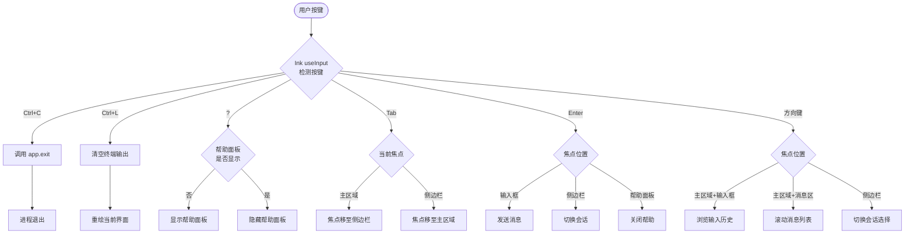
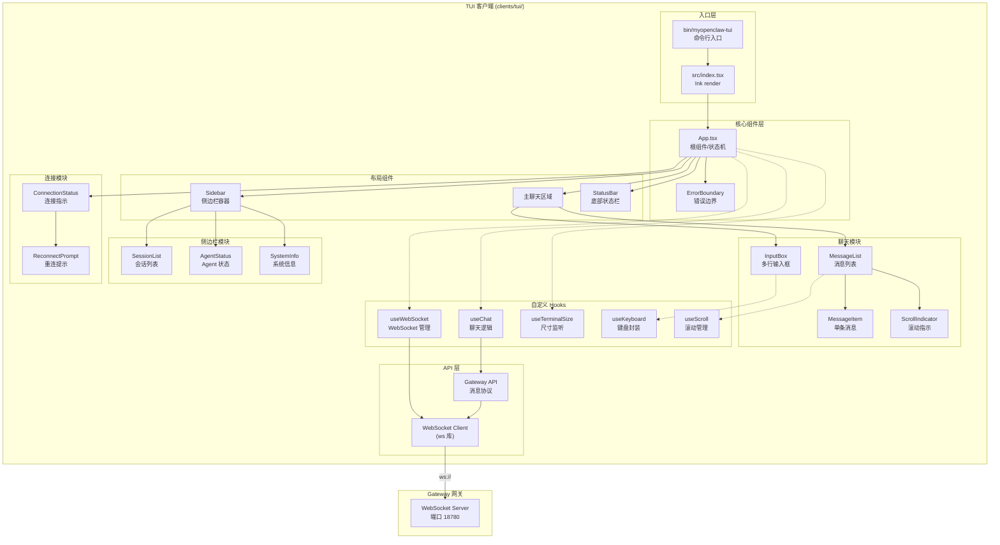

> **版本**：v1.1.0  
> **修订日期**：2026-07-21  
> **修订人**：MyOpenClaw Core Team  
> **文档状态**：正式发布

# 18. TUI 客户端模块

## 目录

- [1. 模块概述](#1-模块概述)
- [2. 技术栈](#2-技术栈)
- [3. Ink 框架简介](#3-ink-框架简介)
- [4. 项目目录结构](#4-项目目录结构)
- [5. 核心组件详解](#5-核心组件详解)
  - [5.1 App 根组件](#51-app-根组件)
  - [5.2 连接管理组件](#52-连接管理组件)
  - [5.3 消息列表组件](#53-消息列表组件)
  - [5.4 输入框组件](#54-输入框组件)
  - [5.5 侧边栏组件](#55-侧边栏组件)
  - [5.6 状态栏组件](#56-状态栏组件)
- [6. 键盘交互设计](#6-键盘交互设计)
- [7. Gateway API 封装](#7-gateway-api-封装)
- [8. 终端渲染优化](#8-终端渲染优化)
- [9. 构建与运行](#9-构建与运行)
- [10. 完整 TypeScript 组件代码示例](#10-完整-typescript-组件代码示例)
- [11. Mermaid 架构图](#11-mermaid-架构图)

---

## 1. 模块概述

TUI（Terminal User Interface）客户端是 MyOpenClaw 框架的**终端图形化交互客户端**，为用户提供在命令行终端中的沉浸式 AI Agent 交互体验。作为 Clients 客户端层的终端形态实现，TUI 客户端在保持命令行的高效性和可脚本化能力的同时，通过 Ink 框架提供了接近 GUI 的视觉体验。

### 1.1 为什么需要 TUI

| 对比维度 | TUI 客户端 | Web 客户端 | CLI 客户端 |
|---------|-----------|-----------|-----------|
| 启动速度 | 毫秒级 | 秒级（需打开浏览器） | 毫秒级 |
| 资源占用 | 极低（终端进程） | 高（浏览器 + JS 运行时） | 极低 |
| 交互体验 | 全屏可视化，支持实时动画 |  richest，多媒体支持 | 纯文本，逐行输出 |
| 远程环境 | 完美支持 SSH 远程使用 | 需端口转发或公网部署 | 完美支持 |
| 开发者友好度 | 高（键盘驱动，无需鼠标） | 中（鼠标 + 键盘） | 高（管道友好） |
| 适用场景 | 服务器环境、日常开发、快速调试 | 演示、复杂配置、文件预览 | 脚本集成、CI/CD |

### 1.2 设计目标

1. **零配置启动**：安装后一条命令即可连接本地 Gateway，无需任何配置
2. **键盘驱动交互**：所有操作均可通过键盘完成，鼠标仅作辅助
3. **实时视觉反馈**：连接状态、Agent 思考过程、工具调用结果实时展示
4. **终端原生体验**：支持终端快捷键（Ctrl+C、Ctrl+L 等），不破坏用户肌肉记忆
5. **轻量可嵌入**：可作为子进程嵌入其他工具链，支持管道和重定向

### 1.3 适用场景

- **服务器运维**：通过 SSH 连接到远程服务器，直接在终端中与 AI Agent 交互查询日志、排查故障
- **开发辅助**：在 IDE 集成终端中并排编码，随时向 Agent 询问技术问题
- **快速调试**：快速验证 Gateway 和 Agent 的运行状态，无需打开浏览器
- **演示展示**：在技术分享和直播中展示 MyOpenClaw 的终端交互能力

---

## 2. 技术栈

| 技术层 | 选型 | 版本 | 职责说明 |
|--------|------|------|----------|
| TUI 框架 | Ink | 4.x | React for Terminal，提供组件化终端 UI 能力 |
| 框架 | React | 18.x | Ink 底层依赖，组件生命周期管理 |
| 语言 | TypeScript | 5.4.x | 静态类型安全 |
| 构建工具 | tsup / esbuild | - | 快速编译 TypeScript 到可执行 Node.js 脚本 |
| 参数解析 | Commander | 12.x | 启动参数和子命令解析 |
| 颜色样式 | chalk | 5.x | 终端 ANSI 颜色输出 |
| 加载动画 | ora | 8.x | 终端 Spinner 加载指示器 |
| 输入提示 | inquirer | 9.x | 交互式提示和选择（配置向导） |
| 实时通信 | ws | 8.x | Node.js WebSocket 客户端 |
| 代码高亮 | highlight.js / ansi-highlight | - | 终端内代码块语法高亮 |
| 配置管理 | cosmiconfig | 9.x | 配置文件自动发现和加载 |
| 日志记录 | pino | 8.x | 结构化日志输出 |

---

## 3. Ink 框架简介

Ink 是一个基于 React 的终端 UI 渲染框架，它将 React 的声明式组件模型带入命令行环境。开发者可以使用熟悉的 JSX 语法和 React Hooks 构建复杂的终端界面。

### 3.1 核心概念

#### Box 组件

`Box` 是 Ink 的布局基础组件，相当于 Web 开发中的 `div`。它支持 Flexbox 布局：

```tsx
import { Box, Text } from 'ink';

// 创建水平排列的容器
<Box flexDirection="row" gap={1}>
  <Text>左侧</Text>
  <Text>右侧</Text>
</Box>

// 创建垂直排列、居中对齐的容器
<Box flexDirection="column" alignItems="center" justifyContent="center">
  <Text>垂直居中内容</Text>
</Box>
```

| Box 属性 | 类型 | 说明 |
|---------|------|------|
| `flexDirection` | `'row' \| 'column'` | 主轴方向 |
| `alignItems` | `'flex-start' \| 'center' \| 'flex-end'` | 交叉轴对齐 |
| `justifyContent` | `'flex-start' \| 'center' \| 'flex-end' \| 'space-between'` | 主轴对齐 |
| `gap` | `number` | 子元素间距（字符数） |
| `padding` / `margin` | `number \| {x,y,top,bottom,left,right}` | 内边距/外边距 |
| `width` / `height` | `number \| string` | 尺寸（百分比或绝对值） |
| `borderStyle` | `'single' \| 'double' \| 'round' \| 'bold'` | 边框样式 |
| `borderColor` | `string` | 边框颜色（chalk 颜色名） |

#### Text 组件

`Text` 组件用于渲染带样式的文本：

```tsx
import { Text } from 'ink';

// 基础样式
<Text color="green" bold>成功消息</Text>
<Text color="red" dimColor>次要错误信息</Text>
<Text backgroundColor="blue" color="white">高亮文本</Text>

// 嵌套样式继承
<Text color="yellow">
  警告：<Text bold>必须注意</Text> 这个操作
</Text>
```

| Text 属性 | 类型 | 说明 |
|----------|------|------|
| `color` | `string` | 前景色（chalk 支持的颜色名或 hex） |
| `backgroundColor` | `string` | 背景色 |
| `bold` | `boolean` | 粗体 |
| `italic` | `boolean` | 斜体 |
| `underline` | `boolean` | 下划线 |
| `strikethrough` | `boolean` | 删除线 |
| `dimColor` | `boolean` | 暗淡色 |
| `inverse` | `boolean` | 反色 |
| `wrap` | `'wrap' \| 'end' \| 'middle' \| 'truncate-start' \| 'truncate-middle' \| 'truncate-end'` | 文本截断策略 |

#### useInput Hook

`useInput` 是 Ink 处理键盘输入的核心 Hook：

```tsx
import { useInput } from 'ink';

function MyComponent() {
  useInput((input, key) => {
    // input: 按下的字符（如 'a'、'1'、'?'）
    // key: 修饰键状态对象

    if (input === 'q') {
      // 按下 q 键
    }

    if (key.return) {
      // 按下回车键
    }

    if (key.escape) {
      // 按下 Esc 键
    }

    if (key.ctrl && input === 'c') {
      // 按下 Ctrl+C（通常由 Ink 框架处理）
    }

    if (key.tab) {
      // 按下 Tab 键
    }

    if (key.upArrow || key.downArrow) {
      // 方向键
    }
  });

  return <Text>等待键盘输入...</Text>;
}
```

| key 属性 | 类型 | 说明 |
|---------|------|------|
| `upArrow` / `downArrow` / `leftArrow` / `rightArrow` | `boolean` | 方向键 |
| `return` | `boolean` | 回车键 |
| `escape` | `boolean` | Esc 键 |
| `ctrl` / `shift` / `meta` | `boolean` | 修饰键 |
| `tab` | `boolean` | Tab 键 |
| `backspace` / `delete` | `boolean` | 退格/删除键 |
| `pageUp` / `pageDown` | `boolean` | 翻页键 |

#### useApp Hook

`useApp` 提供对 Ink 应用实例的访问，用于控制应用生命周期：

```tsx
import { useApp } from 'ink';

function App() {
  const { exit, stdin, stdout } = useApp();

  // 手动退出应用
  const handleQuit = () => {
    exit(); // 触发应用卸载和进程退出
  };

  // 访问标准输入输出流
  // stdin: NodeJS.ReadStream
  // stdout: NodeJS.WriteStream

  return <Text>按 q 退出</Text>;
}
```

### 3.2 Ink 与 Web React 的差异

| 特性 | Ink (Terminal) | Web React |
|------|---------------|-----------|
| 渲染目标 | 终端字符缓冲区 | 浏览器 DOM |
| 布局系统 | Flexbox（简化版） | CSS Flexbox + Grid |
| 事件处理 | 键盘输入（stdin） | 鼠标、键盘、触摸 |
| 样式系统 | 有限的颜色和文本属性 | 完整的 CSS |
| 图片/媒体 | 不支持（可用 ASCII art 替代） | 完整多媒体支持 |
| 尺寸单位 | 字符（列/行） | px、rem、% 等 |
| 动画 | 基于帧的文本重绘 | CSS 动画、Web Animations API |

---

## 4. 项目目录结构

```
clients/tui/
├── src/
│   ├── components/                  # Ink 业务组件
│   │   ├── App.tsx                  # 应用根组件（Ink 应用入口）
│   │   ├── ErrorBoundary.tsx        # 错误边界组件
│   │   ├── connection/              # 连接管理组件
│   │   │   ├── ConnectionStatus.tsx # 连接状态指示器
│   │   │   └── ReconnectPrompt.tsx  # 重连提示弹窗
│   │   ├── chat/                    # 聊天界面组件
│   │   │   ├── MessageList.tsx      # 消息列表（滚动区域）
│   │   │   ├── MessageItem.tsx      # 单条消息渲染
│   │   │   ├── InputBox.tsx         # 多行输入框
│   │   │   └── ScrollIndicator.tsx  # 滚动位置指示器
│   │   ├── sidebar/                 # 侧边栏组件
│   │   │   ├── Sidebar.tsx          # 侧边栏容器
│   │   │   ├── SessionList.tsx      # 会话列表
│   │   │   ├── AgentStatus.tsx      # Agent 状态面板
│   │   │   └── SystemInfo.tsx       # 系统信息面板
│   │   └── statusbar/               # 状态栏组件
│   │       ├── StatusBar.tsx        # 底部状态栏
│   │       ├── ConnectionBadge.tsx  # 连接状态徽标
│   │       └── ModelIndicator.tsx   # 当前模型指示器
│   ├── hooks/                       # 自定义 Hooks
│   │   ├── useTerminalSize.ts       # 终端尺寸监听
│   │   ├── useKeyboard.ts           # 键盘输入封装
│   │   ├── useWebSocket.ts          # WebSocket 连接管理
│   │   ├── useChat.ts               # 聊天业务逻辑
│   │   └── useScroll.ts             # 滚动位置管理
│   ├── api/                         # Gateway API 封装
│   │   ├── websocket.ts             # WebSocket 客户端
│   │   ├── gateway.ts               # 消息协议处理
│   │   └── types.ts                 # API 类型定义
│   ├── utils/                       # 工具函数
│   │   ├── format.ts                # 格式化工具
│   │   ├── markdown.ts              # Markdown 终端渲染
│   │   ├── colors.ts                # 颜色配置
│   │   └── keyboard.ts              # 快捷键映射
│   ├── types/                       # TypeScript 类型
│   │   ├── message.ts               # 消息类型
│   │   ├── session.ts               # 会话类型
│   │   └── ui.ts                    # UI 状态类型
│   ├── config/                      # 配置管理
│   │   ├── defaults.ts              # 默认配置
│   │   └── loader.ts                # 配置文件加载
│   └── index.tsx                    # CLI 入口文件
├── bin/
│   └── myopenclaw-tui                 # 可执行脚本入口
├── package.json                     # 项目配置
├── tsconfig.json                    # TypeScript 配置
└── README.md                        # 项目说明
```

---

## 5. 核心组件详解

### 5.1 App 根组件

App 根组件是 Ink 应用的入口，负责全局状态初始化、错误边界捕获和子组件编排。

```tsx
// src/components/App.tsx 核心结构说明

/**
 * App 组件职责：
 * 1. 初始化 WebSocket 连接
 * 2. 管理全局应用状态（当前视图、错误信息）
 * 3. 提供错误边界保护
 * 4. 编排布局：侧边栏 + 主聊天区 + 状态栏
 */
```

#### App 组件状态机

```
┌──────────┐    启动成功     ┌──────────┐
│  loading │ ─────────────► │  chat    │
│  (连接中) │                │ (主界面)  │
└────┬─────┘                └────┬─────┘
     │ 连接失败                   │
     ▼                          ▼  按 ?
┌──────────┐              ┌──────────┐
│  error   │              │  help    │
│ (错误页)  │              │ (帮助页)  │
└──────────┘              └──────────┘
     ▲                          │
     └──────────────────────────┘  按 Esc/q
```

### 5.2 连接管理组件

连接管理组件负责在终端界面中展示 WebSocket 连接状态，并在断开时提供重连交互。

#### 连接状态可视化

| 状态 | 终端显示 | 颜色 |
|------|---------|------|
| 已连接 | `[已连接]` | 绿色 (green) |
| 连接中 | `[连接中...]` | 黄色 (yellow) |
| 重连中 | `[重连 3/10]` | 橙色 (yellowBright) |
| 已断开 | `[已断开]` | 红色 (red) |

### 5.3 消息列表组件

消息列表组件是 TUI 最核心的展示组件，负责在有限的终端空间内高效渲染聊天记录。

#### 终端消息渲染策略

```
┌─────────────────────────────────────────┐
│  🤖 Assistant                           │  ← 角色标识行
│  ┌─────────────────────────────────────┐│
│  │ 这里是消息内容，支持自动换行到       ││  ← 文本内容
│  │ 终端宽度边界。Markdown 粗体显示为    ││     (wrap 策略)
│  │ **加亮文本**。                       ││
│  │                                     ││
│  │ ```typescript                        ││  ← 代码块
│  │ const x = 1;                         ││     (带边框和
│  │ ```                                  ││      语法高亮)
│  └─────────────────────────────────────┘│
│  ── 14:32 ─────────────────────────────  │  ← 时间戳分隔线
│                                         │
│  👤 You                                 │  ← 用户消息
│  用户输入的消息内容                      │
│  ── 14:33 ─────────────────────────────  │
│                                         │
│  🤖 Assistant [thinking...]             │  ← Thinking 状态
│  ● ○ ○                                  │
└─────────────────────────────────────────┘
```

#### 代码块高亮实现

TUI 使用 `chalk` + `highlight.js` 在终端内实现代码语法高亮：

| Token 类型 | 终端样式 |
|-----------|---------|
| Keyword | `chalk.magenta.bold` |
| String | `chalk.green` |
| Number | `chalk.yellow` |
| Comment | `chalk.gray.italic` |
| Function | `chalk.cyan` |
| Type | `chalk.blueBright` |

### 5.4 输入框组件

输入框组件是 TUI 中交互最复杂的组件，需要处理多行输入、快捷键和命令补全。

#### 输入框布局

```
┌─────────────────────────────────────────┐
│                                         │
│  [聊天消息区域]                          │
│                                         │
│                                         │
├─────────────────────────────────────────┤
│  > 用户当前输入的内容，支持多行显示       │  ← 输入提示符 (prompt)
│    第二行继续输入...                     │
│                                         │
├─────────────────────────────────────────┤
│  [发送: Enter] [换行: Shift+Enter] [退出: Ctrl+C] │  ← 快捷键提示
└─────────────────────────────────────────┘
```

#### 多行输入处理

TUI 输入框通过维护一个字符串数组实现多行输入：

```typescript
// 输入框状态类型
interface InputState {
  // 当前输入的所有行
  lines: string[];
  // 当前光标所在的行索引
  cursorLine: number;
  // 当前光标所在的列索引
  cursorColumn: number;
  // 输入历史记录（用于上下键切换）
  history: string[];
  // 历史记录当前索引
  historyIndex: number;
}
```

### 5.5 侧边栏组件

侧边栏在终端中以固定宽度区域展示，可通过快捷键 `Tab` 切换焦点。

```
┌──────────┬──────────────────────────────┐
│ Sessions │                              │
│ ─────────┤   [主聊天区域]                │
│ ▶ 会话 1 │                              │
│   会话 2 │                              │
│   会话 3 │                              │
│ ─────────┤                              │
│ Agent    │                              │
│ ● idle   │                              │
│ ─────────┤                              │
│ System   │                              │
│ v1.1.0   │                              │
└──────────┴──────────────────────────────┘
  ↑ 20col      ↑ 剩余宽度
```

### 5.6 状态栏组件

状态栏固定在终端底部，用一行展示关键状态信息：

```
┌─────────────────────────────────────────────────────────────┐
│  [已连接]  gpt-4o  │  会话: 默认会话  │  消息: 42  │  ? 帮助   │
└─────────────────────────────────────────────────────────────┘
  ↑ 连接状态           ↑ 当前模型         ↑ 消息计数      ↑ 快捷键提示
```

---

## 6. 键盘交互设计

### 6.1 快捷键映射表

TUI 客户端采用 Vim 风格的键盘交互设计，所有操作均可通过键盘完成。

#### 全局快捷键

| 快捷键 | 功能 | 说明 |
|--------|------|------|
| `Ctrl+C` | 退出应用 | 发送 SIGINT，Ink 框架自动处理 |
| `Ctrl+L` | 清屏 | 清空当前终端显示，保留消息历史 |
| `?` | 显示/隐藏帮助面板 | 展示完整快捷键列表 |
| `Esc` | 关闭当前面板/取消操作 | 从帮助/设置面板返回 |
| `Tab` | 切换焦点区域 | 在主区域和侧边栏之间切换 |

#### 聊天区域快捷键

| 快捷键 | 功能 | 说明 |
|--------|------|------|
| `Enter` | 发送消息 | 提交当前输入框内容 |
| `Shift+Enter` | 换行 | 在输入框中插入换行符 |
| `↑` / `↓` | 浏览输入历史 | 在已发送消息间切换 |
| `PageUp` / `PageDown` | 滚动消息列表 | 向上/向下翻页浏览历史 |
| `Home` / `End` | 快速滚动 | 跳到消息列表顶部/底部 |
| `Ctrl+P` | 新建会话 | 创建新的聊天会话 |
| `Ctrl+D` | 删除当前会话 | 删除选中的会话 |

#### 侧边栏快捷键（当焦点在侧边栏时）

| 快捷键 | 功能 | 说明 |
|--------|------|------|
| `↑` / `↓` | 切换会话 | 在会话列表中上下移动 |
| `Enter` | 选中会话 | 切换到选中的会话 |
| `r` | 重命名会话 | 修改当前选中会话的标题 |
| `d` | 删除会话 | 删除当前选中会话 |

### 6.2 键盘交互流程图



---

## 7. Gateway API 封装

### 7.1 WebSocket 事件处理

TUI 客户端使用 `ws` 库实现 Node.js 环境下的 WebSocket 通信。

```typescript
// src/api/websocket.ts 核心逻辑说明

/**
 * TUI WebSocket 客户端封装
 * 职责：
 * 1. 建立与 Gateway 的 WebSocket 连接
 * 2. 处理自动重连和心跳保活
 * 3. 将接收到的消息转换为 Ink 组件状态更新
 * 4. 提供类型安全的消息发送接口
 */

interface TUIWebSocketConfig {
  /** Gateway WebSocket 地址 */
  url: string;
  /** 连接超时（毫秒） */
  connectTimeout?: number;
  /** 重连配置 */
  reconnect?: {
    maxAttempts: number;
    initialDelay: number;
    maxDelay: number;
  };
  /** 心跳间隔（毫秒） */
  heartbeatInterval?: number;
}
```

### 7.2 消息格式化输出

TUI 客户端接收到的消息需要经过格式化才能在终端中美观展示：

```typescript
// src/utils/markdown.ts 核心逻辑说明

/**
 * Markdown 到终端文本的转换器
 * 将 Markdown 语法转换为 Ink 的 Text 组件属性
 *
 * 转换规则：
 * - # 标题 → chalk.bold.underline + 增大字号模拟
 * - **粗体** → chalk.bold
 * - *斜体* → chalk.italic
 * - `代码` → chalk.gray.bgHex('#333')（反色背景）
 * - ```代码块``` → 带边框区域 + highlight.js 语法高亮
 * - - 列表 → 缩进 + "•" 前缀
 * - > 引用 → 左侧竖线 + 缩进
 * - [链接](url) → chalk.underline.cyan + 显示 URL
 * - --- 分隔线 → 终端宽度横线
 */
```

### 7.3 事件订阅与分发

```typescript
// src/api/gateway.ts 核心逻辑说明

/**
 * Gateway 消息事件分发器
 * 基于 EventEmitter 实现消息类型到处理函数的映射
 *
 * 事件类型映射：
 * - chat.message      → 新消息到达
 * - chat.stream       → 流式消息块
 * - agent.status      → Agent 状态变更
 * - agent.tool_call   → 工具调用开始
 * - agent.tool_result → 工具调用完成
 * - session.created   → 会话创建
 * - session.updated   → 会话更新
 * - session.deleted   → 会话删除
 * - system.error      → 系统错误
 * - system.notice     → 系统通知
 */
```

---

## 8. 终端渲染优化

### 8.1 全屏模式

TUI 客户端使用 Ink 的 `fullscreen` 模式接管整个终端：

```tsx
// src/index.tsx

import React from 'react';
import { render } from 'ink';
import { App } from './components/App';

/**
 * 启动 TUI 应用
 * 使用 fullscreen 模式占据整个终端窗口
 */
render(<App />, {
  // 启用全屏模式：清屏并接管整个终端输出
  fullscreen: true,
  // 退出时恢复终端状态（清除备用屏幕缓冲区）
  exitOnCtrlC: true,
});
```

全屏模式工作原理：
1. 启动时保存当前终端内容到备用屏幕缓冲区
2. 切换到备用屏幕并清屏
3. Ink 在备用屏幕上渲染 TUI 界面
4. 退出时切换回主屏幕，恢复之前的终端内容

### 8.2 窗口 Resize 处理

```typescript
// src/hooks/useTerminalSize.ts

import { useState, useEffect } from 'react';

/**
 * 终端尺寸 Hook
 * 监听终端窗口大小变化，返回当前可用的行列数
 * @returns 当前终端尺寸 { columns, rows }
 */
export function useTerminalSize() {
  // 初始化时读取当前终端尺寸
  const [size, setSize] = useState({
    columns: process.stdout.columns || 80,
    rows: process.stdout.rows || 24,
  });

  useEffect(() => {
    /**
     * 处理终端 resize 事件
     * Node.js process.stdout 在终端尺寸变化时触发 'resize' 事件
     */
    const handleResize = () => {
      setSize({
        columns: process.stdout.columns || 80,
        rows: process.stdout.rows || 24,
      });
    };

    // 注册 resize 监听器
    process.stdout.on('resize', handleResize);

    // 组件卸载时清理监听器，防止内存泄漏
    return () => {
      process.stdout.off('resize', handleResize);
    };
  }, []);

  return size;
}
```

### 8.3 颜色主题

TUI 支持两套终端颜色主题，通过环境变量或配置切换：

```typescript
// src/utils/colors.ts

/**
 * 颜色主题配置
 * 定义终端中各元素使用的 chalk 颜色
 */
export const themes = {
  /** 暗色主题（默认，适合大多数终端） */
  dark: {
    primary: 'cyan',
    primaryBright: 'cyanBright',
    secondary: 'gray',
    success: 'green',
    successBright: 'greenBright',
    warning: 'yellow',
    warningBright: 'yellowBright',
    error: 'red',
    errorBright: 'redBright',
    info: 'blue',
    text: 'white',
    textMuted: 'gray',
    border: 'gray',
    background: 'black',
    agent: 'magenta',
    user: 'blue',
    system: 'yellow',
  },
  /** 亮色主题（适合白底终端） */
  light: {
    primary: 'blue',
    primaryBright: 'blueBright',
    secondary: 'gray',
    success: 'green',
    successBright: 'greenBright',
    warning: 'yellow',
    warningBright: 'yellowBright',
    error: 'red',
    errorBright: 'redBright',
    info: 'cyan',
    text: 'black',
    textMuted: 'gray',
    border: 'gray',
    background: 'white',
    agent: 'magenta',
    user: 'blue',
    system: 'yellow',
  },
};

/**
 * 获取当前生效的主题
 * 优先级：环境变量 OPENCLAW_THEME > 配置文件 > 终端检测 > 默认暗色
 */
export function getCurrentTheme() {
  const envTheme = process.env.OPENCLAW_THEME;
  if (envTheme === 'light') return themes.light;
  if (envTheme === 'dark') return themes.dark;

  // 检测终端背景色（简化实现）
  // 部分终端支持 OSC 查询，可检测背景色亮度
  // 此处默认返回暗色主题
  return themes.dark;
}
```

---

## 9. 构建与运行

### 9.1 开发模式

```bash
# 进入 TUI 客户端目录
cd clients/tui

# 安装依赖
npm install

# 开发模式（使用 tsx 直接运行 TypeScript，无需预编译）
npm run dev

# 或使用 ts-node 运行
npx tsx src/index.tsx

# 带参数连接指定 Gateway
npx tsx src/index.tsx --gateway ws://192.168.1.100:18780
```

### 9.2 生产构建

```bash
# 使用 tsup 构建为单个可执行文件
npm run build

# 输出目录：dist/
# 产物：
#   - index.js     (CommonJS 主入口)
#   - index.mjs    (ESM 入口)
#   - index.d.ts   (类型声明)

# 本地测试构建产物
node dist/index.js

# 使用 pkg 打包为独立可执行文件（可选）
npm run build:binary
# 输出：dist/myopenclaw-tui-linux, myopenclaw-tui-macos, myopenclaw-tui-win.exe
```

### 9.3 全局安装

```bash
# 从源码全局安装
npm link
# 或
npm install -g .

# 全局安装后可直接使用
myopenclaw-tui
myopenclaw-tui --gateway ws://localhost:18780
myopenclaw-tui --theme light

# 查看帮助
myopenclaw-tui --help
```

### 9.4 启动参数

| 参数 | 简写 | 默认值 | 说明 |
|------|------|--------|------|
| `--gateway` | `-g` | `ws://localhost:18780` | Gateway WebSocket 地址 |
| `--theme` | `-t` | `dark` | 颜色主题：`dark` / `light` |
| `--session` | `-s` | - | 启动时自动进入指定会话 |
| `--config` | `-c` | - | 指定配置文件路径 |
| `--verbose` | `-v` | `false` | 启用详细日志输出 |
| `--version` | `-V` | - | 显示版本号 |
| `--help` | `-h` | - | 显示帮助信息 |

---

## 10. 完整 TypeScript 组件代码示例

### 10.1 App 根组件

```tsx
// src/components/App.tsx

import React, { useState, useCallback } from 'react';
import { Box, useApp, useInput } from 'ink';
import { ErrorBoundary } from './ErrorBoundary';
import { Sidebar } from './sidebar/Sidebar';
import { MessageList } from './chat/MessageList';
import { InputBox } from './chat/InputBox';
import { StatusBar } from './statusbar/StatusBar';
import { ConnectionStatus } from './connection/ConnectionStatus';
import { HelpPanel } from './HelpPanel';
import { useTerminalSize } from '@/hooks/useTerminalSize';
import { useWebSocket } from '@/hooks/useWebSocket';
import { useChat } from '@/hooks/useChat';

/**
 * 应用视图状态枚举
 * 定义 TUI 应用可以处于的不同视图状态
 */
type AppView = 'chat' | 'help' | 'settings';

/**
 * 焦点区域枚举
 * 管理键盘焦点的当前位置
 */
type FocusArea = 'main' | 'sidebar';

/**
 * App 根组件
 * TUI 应用的入口组件，负责整体布局编排和全局状态管理
 */
export const App: React.FC = () => {
  // Ink 应用实例，用于控制应用生命周期
  const { exit } = useApp();
  // 终端尺寸，用于响应式布局计算
  const { columns, rows } = useTerminalSize();
  // 当前视图状态
  const [view, setView] = useState<AppView>('chat');
  // 当前焦点区域
  const [focus, setFocus] = useState<FocusArea>('main');
  // 帮助面板显示状态
  const [showHelp, setShowHelp] = useState(false);

  // 初始化 WebSocket 连接
  const { connectionState, reconnect } = useWebSocket({
    url: process.env.OPENCLAW_GATEWAY || 'ws://localhost:18780',
  });

  // 聊天业务逻辑
  const { messages, sendMessage, isStreaming } = useChat();

  /**
   * 切换帮助面板显示状态
   */
  const toggleHelp = useCallback(() => {
    setShowHelp((prev) => !prev);
  }, []);

  /**
   * 全局键盘输入处理
   * 使用 Ink 的 useInput Hook 捕获所有键盘输入
   */
  useInput((input, key) => {
    // ? 键：切换帮助面板
    if (input === '?' && !key.ctrl && !key.meta) {
      toggleHelp();
      return;
    }

    // Esc 键：关闭帮助面板或返回上一视图
    if (key.escape) {
      if (showHelp) {
        setShowHelp(false);
      }
      return;
    }

    // Tab 键：在主区域和侧边栏之间切换焦点
    if (key.tab) {
      setFocus((prev) => (prev === 'main' ? 'sidebar' : 'main'));
      return;
    }

    // Ctrl+C 由 Ink 框架默认处理（exitOnCtrlC: true）
    // 此处不需要额外处理
  });

  // 如果正在显示帮助面板，覆盖主界面
  if (showHelp) {
    return (
      <Box flexDirection="column" height={rows}>
        <HelpPanel onClose={() => setShowHelp(false)} />
        <StatusBar
          connectionState={connectionState}
          focus={focus}
          messageCount={messages.length}
        />
      </Box>
    );
  }

  return (
    <ErrorBoundary onError={(error) => console.error('TUI 错误:', error)}>
      <Box flexDirection="column" height={rows}>
        {/* 连接状态提示（仅在非连接状态时显示） */}
        {connectionState !== 'connected' && (
          <ConnectionStatus
            state={connectionState}
            onReconnect={reconnect}
          />
        )}

        {/* 主内容区域：侧边栏 + 聊天区 */}
        <Box flexDirection="row" flexGrow={1}>
          {/* 侧边栏：固定 28 列宽度 */}
          <Box width={28} flexDirection="column" borderStyle="single" borderRight>
            <Sidebar
              focus={focus === 'sidebar'}
              onSelectSession={(id) => console.log('切换会话:', id)}
            />
          </Box>

          {/* 主聊天区域 */}
          <Box flexDirection="column" flexGrow={1}>
            {/* 消息列表：占据大部分空间 */}
            <Box flexGrow={1} flexDirection="column" paddingX={1}>
              <MessageList
                messages={messages}
                maxHeight={rows - 5}
              />
            </Box>

            {/* 输入框区域 */}
            <Box borderStyle="single" borderTop paddingX={1}>
              <InputBox
                focus={focus === 'main'}
                onSend={sendMessage}
                disabled={isStreaming || connectionState !== 'connected'}
                placeholder={
                  connectionState !== 'connected'
                    ? '等待连接...'
                    : '输入消息，Enter 发送，Shift+Enter 换行'
                }
              />
            </Box>
          </Box>
        </Box>

        {/* 底部状态栏 */}
        <StatusBar
          connectionState={connectionState}
          focus={focus}
          messageCount={messages.length}
          isStreaming={isStreaming}
        />
      </Box>
    </ErrorBoundary>
  );
};
```

### 10.2 消息列表组件

```tsx
// src/components/chat/MessageList.tsx

import React, { useRef, useEffect, useState } from 'react';
import { Box, Text } from 'ink';
import { MessageItem } from './MessageItem';
import { ScrollIndicator } from './ScrollIndicator';
import type { ChatMessage } from '@/types/message';

/**
 * MessageList 属性接口
 */
interface MessageListProps {
  /** 要渲染的消息数组 */
  messages: ChatMessage[];
  /** 消息列表最大高度（行数） */
  maxHeight: number;
}

/**
 * 消息列表组件
 * 负责渲染聊天记录，支持滚动浏览和自动跟随最新消息
 */
export const MessageList: React.FC<MessageListProps> = ({
  messages,
  maxHeight,
}) => {
  // 当前滚动偏移（从消息数组末尾向前偏移的行数）
  const [scrollOffset, setScrollOffset] = useState(0);
  // 是否自动跟随最新消息
  const [autoFollow, setAutoFollow] = useState(true);
  // 消息数量引用，用于检测新消息到达
  const prevMessageCount = useRef(messages.length);

  /**
   * 当新消息到达时，如果处于自动跟随模式，重置滚动偏移
   */
  useEffect(() => {
    if (messages.length > prevMessageCount.current && autoFollow) {
      setScrollOffset(0);
    }
    prevMessageCount.current = messages.length;
  }, [messages.length, autoFollow]);

  /**
   * 计算可见消息窗口
   * 根据 scrollOffset 和 maxHeight 确定应渲染哪些消息
   */
  const visibleMessages = React.useMemo(() => {
    if (messages.length <= maxHeight) {
      return messages;
    }
    // 从末尾截取可见范围内的消息
    const start = Math.max(0, messages.length - maxHeight - scrollOffset);
    const end = messages.length - scrollOffset;
    return messages.slice(start, end);
  }, [messages, maxHeight, scrollOffset]);

  /**
   * 判断是否可以向上/向下滚动
   */
  const canScrollUp = scrollOffset < messages.length - maxHeight;
  const canScrollDown = scrollOffset > 0;

  return (
    <Box flexDirection="column" flexGrow={1}>
      {/* 向上滚动指示器 */}
      {canScrollUp && (
        <ScrollIndicator direction="up" />
      )}

      {/* 消息渲染区域 */}
      <Box flexDirection="column" flexGrow={1}>
        {visibleMessages.map((message, index) => (
          <MessageItem
            key={message.id}
            message={message}
            isLast={index === visibleMessages.length - 1 && scrollOffset === 0}
          />
        ))}

        {/* 空状态提示 */}
        {messages.length === 0 && (
          <Box flexGrow={1} alignItems="center" justifyContent="center">
            <Text color="gray" dimColor>
              暂无消息，在下方输入框开始对话...
            </Text>
          </Box>
        )}
      </Box>

      {/* 向下滚动指示器 */}
      {canScrollDown && (
        <ScrollIndicator direction="down" />
      )}
    </Box>
  );
};
```

### 10.3 输入框组件

```tsx
// src/components/chat/InputBox.tsx

import React, { useState, useCallback } from 'react';
import { Box, Text, useInput } from 'ink';
import { useTerminalSize } from '@/hooks/useTerminalSize';

/**
 * InputBox 属性接口
 */
interface InputBoxProps {
  /** 是否获得焦点 */
  focus: boolean;
  /** 发送消息回调 */
  onSend: (message: string) => void;
  /** 是否禁用输入 */
  disabled?: boolean;
  /** 占位提示文本 */
  placeholder?: string;
}

/**
 * 输入框组件
 * 支持多行输入、输入历史浏览、光标显示
 */
export const InputBox: React.FC<InputBoxProps> = ({
  focus,
  onSend,
  disabled = false,
  placeholder = '输入消息...',
}) => {
  // 当前输入文本（多行以 \n 分隔）
  const [input, setInput] = useState('');
  // 输入历史记录
  const [history, setHistory] = useState<string[]>([]);
  // 历史浏览索引（-1 表示不在浏览历史）
  const [historyIndex, setHistoryIndex] = useState(-1);
  // 光标在文本中的位置
  const [cursorPosition, setCursorPosition] = useState(0);
  // 终端宽度
  const { columns } = useTerminalSize();

  /**
   * 发送当前输入内容
   */
  const handleSend = useCallback(() => {
    const trimmed = input.trim();
    if (trimmed && !disabled) {
      onSend(trimmed);
      // 保存到历史记录
      setHistory((prev) => [...prev, trimmed]);
      // 清空输入框
      setInput('');
      setCursorPosition(0);
      setHistoryIndex(-1);
    }
  }, [input, disabled, onSend]);

  /**
   * 键盘输入处理
   * 处理字符输入、特殊键（回车、退格、方向键等）
   */
  useInput(
    (value, key) => {
      if (disabled) return;

      // Enter 键：发送消息（不带 Shift）
      if (key.return && !key.shift) {
        handleSend();
        return;
      }

      // Shift+Enter：插入换行符
      if (key.return && key.shift) {
        const before = input.slice(0, cursorPosition);
        const after = input.slice(cursorPosition);
        setInput(before + '\n' + after);
        setCursorPosition(cursorPosition + 1);
        return;
      }

      // 退格键：删除光标前一个字符
      if (key.backspace || key.delete) {
        if (cursorPosition > 0) {
          const before = input.slice(0, cursorPosition - 1);
          const after = input.slice(cursorPosition);
          setInput(before + after);
          setCursorPosition(cursorPosition - 1);
        }
        return;
      }

      // 上方向键：浏览历史记录（较新的）
      if (key.upArrow) {
        if (historyIndex < history.length - 1) {
          const newIndex = historyIndex + 1;
          setHistoryIndex(newIndex);
          setInput(history[history.length - 1 - newIndex]);
          setCursorPosition(history[history.length - 1 - newIndex].length);
        }
        return;
      }

      // 下方向键：浏览历史记录（较旧的）
      if (key.downArrow) {
        if (historyIndex > 0) {
          const newIndex = historyIndex - 1;
          setHistoryIndex(newIndex);
          setInput(history[history.length - 1 - newIndex]);
          setCursorPosition(history[history.length - 1 - newIndex].length);
        } else if (historyIndex === 0) {
          setHistoryIndex(-1);
          setInput('');
          setCursorPosition(0);
        }
        return;
      }

      // 左方向键：光标左移
      if (key.leftArrow) {
        setCursorPosition((prev) => Math.max(0, prev - 1));
        return;
      }

      // 右方向键：光标右移
      if (key.rightArrow) {
        setCursorPosition((prev) => Math.min(input.length, prev + 1));
        return;
      }

      // 普通字符输入
      if (value && !key.ctrl && !key.meta && !key.tab) {
        const before = input.slice(0, cursorPosition);
        const after = input.slice(cursorPosition);
        setInput(before + value + after);
        setCursorPosition(cursorPosition + value.length);
      }
    },
    { isActive: focus }
  );

  /**
   * 渲染输入框内容，包含光标指示
   */
  const renderInput = () => {
    if (!input && !focus) {
      return <Text color="gray">{placeholder}</Text>;
    }

    if (!input && focus) {
      return (
        <Text>
          <Text color="gray">{placeholder}</Text>
          <Text backgroundColor="white" color="black"> </Text>
        </Text>
      );
    }

    // 在光标位置插入闪烁的光标指示器
    const before = input.slice(0, cursorPosition);
    const at = input[cursorPosition] || ' ';
    const after = input.slice(cursorPosition + 1);

    return (
      <Text>
        {before}
        <Text backgroundColor="white" color="black">{at}</Text>
        {after}
      </Text>
    );
  };

  return (
    <Box flexDirection="column">
      {/* 输入提示符 + 输入内容 */}
      <Box flexDirection="row">
        <Text color={focus ? 'cyan' : 'gray'} bold>
          {'> '}
        </Text>
        <Box flexDirection="column">
          {input.split('\n').map((line, index) => (
            <Text key={index} wrap="wrap">
              {index === 0 ? '' : '  '}
              {line}
            </Text>
          ))}
          {/* 光标指示 */}
          {focus && (
            <Text>
              <Text backgroundColor="cyan" color="black">
                {' '}
              </Text>
            </Text>
          )}
        </Box>
      </Box>

      {/* 底部快捷键提示 */}
      {focus && (
        <Box marginTop={1}>
          <Text color="gray" dimColor>
            Enter 发送 | Shift+Enter 换行 | ↑↓ 历史 | Tab 切换焦点
          </Text>
        </Box>
      )}
    </Box>
  );
};
```

### 10.4 状态栏组件

```tsx
// src/components/statusbar/StatusBar.tsx

import React from 'react';
import { Box, Text } from 'ink';
import type { ConnectionState } from '@/hooks/useWebSocket';

/**
 * StatusBar 属性接口
 */
interface StatusBarProps {
  /** 当前连接状态 */
  connectionState: ConnectionState;
  /** 当前焦点区域 */
  focus: string;
  /** 消息数量 */
  messageCount: number;
  /** 是否正在流式输出 */
  isStreaming?: boolean;
}

/**
 * 状态栏组件
 * 固定在终端底部，展示连接状态、当前模型、消息数量等关键信息
 */
export const StatusBar: React.FC<StatusBarProps> = ({
  connectionState,
  focus,
  messageCount,
  isStreaming = false,
}) => {
  /**
   * 根据连接状态返回对应的显示文本和颜色
   */
  const getConnectionDisplay = () => {
    switch (connectionState) {
      case 'connected':
        return { text: '已连接', color: 'green' as const };
      case 'connecting':
        return { text: '连接中...', color: 'yellow' as const };
      case 'reconnecting':
        return { text: '重连中', color: 'yellowBright' as const };
      case 'disconnected':
        return { text: '已断开', color: 'red' as const };
      default:
        return { text: '未知', color: 'gray' as const };
    }
  };

  const conn = getConnectionDisplay();

  return (
    <Box
      flexDirection="row"
      height={1}
      backgroundColor="gray"
      paddingX={1}
    >
      {/* 左侧：连接状态 */}
      <Box width="20%">
        <Text color={conn.color} backgroundColor="gray">
          [{conn.text}]
        </Text>
      </Box>

      {/* 中间：运行状态信息 */}
      <Box width="60%" justifyContent="center">
        <Text backgroundColor="gray">
          {isStreaming ? (
            <Text color="cyan">Agent 正在生成回复...</Text>
          ) : (
            <Text color="white">就绪</Text>
          )}
        </Text>
      </Box>

      {/* 右侧：统计信息 */}
      <Box width="20%" justifyContent="flex-end">
        <Text color="white" backgroundColor="gray">
          消息: {messageCount} | 焦点: {focus === 'main' ? '主区域' : '侧边栏'}
        </Text>
      </Box>
    </Box>
  );
};
```

### 10.5 WebSocket Hook

```tsx
// src/hooks/useWebSocket.ts

import { useState, useEffect, useRef, useCallback } from 'react';
import WebSocket from 'ws';
import EventEmitter from 'events';

/**
 * 连接状态类型
 */
export type ConnectionState = 'idle' | 'connecting' | 'connected' | 'disconnected' | 'reconnecting';

/**
 * WebSocket Hook 配置
 */
interface UseWebSocketOptions {
  /** Gateway WebSocket URL */
  url: string;
  /** 重连最大尝试次数 */
  maxReconnectAttempts?: number;
  /** 初始重连延迟（毫秒） */
  reconnectDelay?: number;
}

/**
 * WebSocket Hook 返回值
 */
interface UseWebSocketReturn {
  /** 当前连接状态 */
  connectionState: ConnectionState;
  /** 发送消息方法 */
  send: (data: unknown) => void;
  /** 手动触发重连 */
  reconnect: () => void;
  /** 消息事件发射器 */
  events: EventEmitter;
}

/**
 * WebSocket 连接管理 Hook
 * 封装连接建立、自动重连、心跳保活、消息事件分发
 */
export function useWebSocket(options: UseWebSocketOptions): UseWebSocketReturn {
  const { url, maxReconnectAttempts = 10, reconnectDelay = 1000 } = options;

  // 连接状态
  const [connectionState, setConnectionState] = useState<ConnectionState>('idle');
  // WebSocket 实例引用
  const wsRef = useRef<WebSocket | null>(null);
  // 重连计数
  const reconnectCount = useRef(0);
  // 重连定时器
  const reconnectTimer = useRef<ReturnType<typeof setTimeout> | null>(null);
  // 心跳定时器
  const heartbeatTimer = useRef<ReturnType<typeof setInterval> | null>(null);
  // 消息事件发射器
  const events = useRef(new EventEmitter());

  /**
   * 建立 WebSocket 连接
   */
  const connect = useCallback(() => {
    // 如果已有连接且处于打开状态，不重复连接
    if (wsRef.current?.readyState === WebSocket.OPEN) {
      return;
    }

    setConnectionState('connecting');

    // 创建新的 WebSocket 实例
    const ws = new WebSocket(url);
    wsRef.current = ws;

    // 连接建立成功
    ws.on('open', () => {
      setConnectionState('connected');
      reconnectCount.current = 0;
      // 启动心跳保活
      startHeartbeat(ws);
    });

    // 接收消息
    ws.on('message', (data) => {
      try {
        const message = JSON.parse(data.toString());
        // 忽略心跳响应
        if (message.type === 'pong') return;
        // 分发消息到事件总线
        events.current.emit('message', message);
        events.current.emit(message.type, message);
      } catch (err) {
        console.error('[WebSocket] 消息解析失败:', err);
      }
    });

    // 连接关闭
    ws.on('close', (code, reason) => {
      stopHeartbeat();
      setConnectionState('disconnected');
      // 非正常关闭时触发自动重连
      if (code !== 1000 && code !== 1001) {
        scheduleReconnect();
      }
    });

    // 连接错误
    ws.on('error', (error) => {
      console.error('[WebSocket] 连接错误:', error.message);
      setConnectionState('disconnected');
    });
  }, [url]);

  /**
   * 调度自动重连
   */
  const scheduleReconnect = useCallback(() => {
    if (reconnectCount.current >= maxReconnectAttempts) {
      console.error('[WebSocket] 达到最大重连次数');
      return;
    }

    setConnectionState('reconnecting');

    // 指数退避计算延迟
    const delay = Math.min(
      reconnectDelay * Math.pow(2, reconnectCount.current),
      30000
    );

    reconnectTimer.current = setTimeout(() => {
      reconnectCount.current++;
      connect();
    }, delay);
  }, [connect, maxReconnectAttempts, reconnectDelay]);

  /**
   * 启动心跳保活
   * @param ws - WebSocket 实例
   */
  const startHeartbeat = (ws: WebSocket) => {
    heartbeatTimer.current = setInterval(() => {
      if (ws.readyState === WebSocket.OPEN) {
        ws.send(JSON.stringify({ type: 'ping', timestamp: Date.now() }));
      }
    }, 30000);
  };

  /**
   * 停止心跳保活
   */
  const stopHeartbeat = () => {
    if (heartbeatTimer.current) {
      clearInterval(heartbeatTimer.current);
      heartbeatTimer.current = null;
    }
  };

  /**
   * 发送消息
   */
  const send = useCallback((data: unknown) => {
    if (wsRef.current?.readyState === WebSocket.OPEN) {
      wsRef.current.send(JSON.stringify(data));
    } else {
      console.warn('[WebSocket] 未连接，无法发送消息');
    }
  }, []);

  /**
   * 手动触发重连
   */
  const reconnect = useCallback(() => {
    // 清理现有连接
    if (wsRef.current) {
      wsRef.current.close(1000, '手动重连');
      wsRef.current = null;
    }
    if (reconnectTimer.current) {
      clearTimeout(reconnectTimer.current);
      reconnectTimer.current = null;
    }
    reconnectCount.current = 0;
    connect();
  }, [connect]);

  /**
   * 组件挂载时建立连接
   * 组件卸载时清理资源
   */
  useEffect(() => {
    connect();

    return () => {
      // 清理所有定时器和连接
      if (reconnectTimer.current) clearTimeout(reconnectTimer.current);
      stopHeartbeat();
      if (wsRef.current) {
        wsRef.current.removeAllListeners();
        wsRef.current.close(1000, '组件卸载');
        wsRef.current = null;
      }
    };
  }, [connect]);

  return {
    connectionState,
    send,
    reconnect,
    events: events.current,
  };
}
```

---

## 11. Mermaid 架构图

### 11.1 组件架构图



### 11.2 键盘交互流程图

```mermaid
flowchart TD
    subgraph Legend["图例说明"]
        direction LR
        K([按键输入]):::key
        P[处理节点]:::process
        S[状态变更]:::state
    end

    subgraph Startup["启动流程"]
        Start([myopenclaw-tui]) --> ParseArgs{解析命令行参数}
        ParseArgs --> ConnectWS[建立 WebSocket 连接]
        ConnectWS -->|成功| RenderUI[渲染全屏 TUI]
        ConnectWS -->|失败| ShowError[显示连接错误]
        ShowError --> PromptReconnect{用户按键}
        PromptReconnect -->|r| ConnectWS
        PromptReconnect -->|q| Exit([退出进程])
    end

    subgraph NormalMode["正常模式 - 主区域焦点"]
        MainFocus[焦点: 主区域] --> WaitInput1{等待键盘输入}

        WaitInput1 -->|字符| TypeChar[追加字符到输入框]
        TypeChar --> WaitInput1

        WaitInput1 -->|Enter| SendMsg[发送消息]
        SendMsg --> ClearInput[清空输入框]
        ClearInput --> WaitInput1

        WaitInput1 -->|Shift+Enter| InsertNewline[输入框插入换行]
        InsertNewline --> WaitInput1

        WaitInput1 -->|Backspace| DeleteChar[删除光标前字符]
        DeleteChar --> WaitInput1

        WaitInput1 -->|↑| PrevHistory[浏览上一条历史]
        WaitInput1 -->|↓| NextHistory[浏览下一条历史]
        PrevHistory --> WaitInput1
        NextHistory --> WaitInput1

        WaitInput1 -->|PageUp| ScrollUp[消息列表向上翻页]
        WaitInput1 -->|PageDown| ScrollDown[消息列表向下翻页]
        ScrollUp --> WaitInput1
        ScrollDown --> WaitInput1

        WaitInput1 -->|Tab| SwitchFocus1[焦点移至侧边栏]
        SwitchFocus1 --> SidebarFocus

        WaitInput1 -->|?| ToggleHelp1[显示帮助面板]
        ToggleHelp1 --> HelpMode

        WaitInput1 -->|Ctrl+C| Exit1([退出应用])
        WaitInput1 -->|Ctrl+L| ClearScreen1[清屏并重绘]
        ClearScreen1 --> WaitInput1
    end

    subgraph SidebarMode["侧边栏模式 - 侧边栏焦点"]
        SidebarFocus[焦点: 侧边栏] --> WaitInput2{等待键盘输入}

        WaitInput2 -->|↑| PrevSession[选择上一个会话]
        WaitInput2 -->|↓| NextSession[选择下一个会话]
        PrevSession --> WaitInput2
        NextSession --> WaitInput2

        WaitInput2 -->|Enter| SelectSession[切换到选中会话]
        SelectSession --> WaitInput2

        WaitInput2 -->|r| RenameSession[重命名当前会话]
        WaitInput2 -->|d| DeleteSession[删除当前会话]
        RenameSession --> WaitInput2
        DeleteSession --> WaitInput2

        WaitInput2 -->|Tab| SwitchFocus2[焦点移至主区域]
        SwitchFocus2 --> MainFocus

        WaitInput2 -->|?| ToggleHelp2[显示帮助面板]
        ToggleHelp2 --> HelpMode
    end

    subgraph HelpMode["帮助模式"]
        HelpVisible[帮助面板显示] --> WaitInput3{等待键盘输入}
        WaitInput3 -->|Esc / q| CloseHelp[关闭帮助面板]
        WaitInput3 -->|?| CloseHelp2[关闭帮助面板]
        CloseHelp --> MainFocus
        CloseHelp2 --> MainFocus
    end

    classDef key fill:#e1f5fe,stroke:#01579b,stroke-width:2px
    classDef process fill:#f3e5f5,stroke:#4a148c,stroke-width:2px
    classDef state fill:#fff3e0,stroke:#e65100,stroke-width:2px
    classDef startend fill:#e8f5e9,stroke:#1b5e20,stroke-width:2px

    class Start,Exit,Exit1 startend
    class WaitInput1,WaitInput2,WaitInput3,PromptReconnect key
    class MainFocus,SidebarFocus,HelpVisible state
```



---

*本文档由 MyOpenClaw Core Team 维护，如有疑问请提交 Issue 或联系维护团队。*
