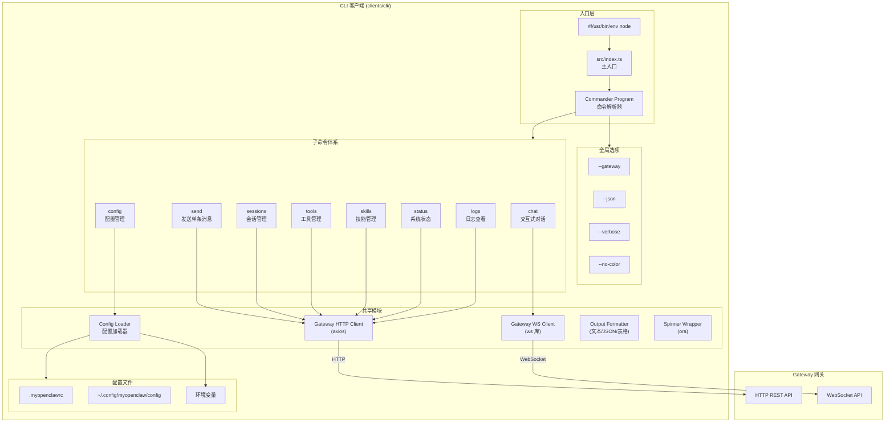
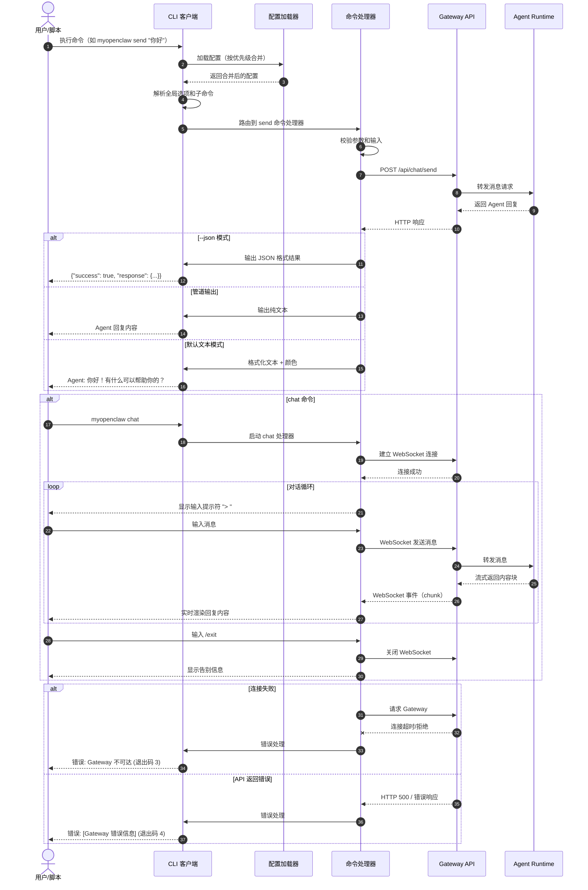

> **版本**：v1.1.2  
> **修订日期**：2026-08-04  
> **修订人**：MyOpenClaw Core Team  
> **文档状态**：正式发布

# 19. CLI 客户端模块

> **开发状态**：已完整实现。CLI 客户端位于 `clients/cli/`，基于 Commander 12.x，提供 9 个子命令（chat/send/sessions/tools/skills/config/status/logs/ppt），支持 Shell 补全（Bash/Zsh/Fish）、交互式对话、管道输入和 JSON 输出模式。

## 目录

- [1. 模块概述](#1-模块概述)
- [2. 技术栈](#2-技术栈)
- [3. Commander 框架简介](#3-commander-框架简介)
- [4. 项目目录结构](#4-项目目录结构)
- [5. 子命令体系详解](#5-子命令体系详解)
  - [5.1 `myopenclaw chat`](#51-myopenclaw-chat)
  - [5.2 `myopenclaw send`](#52-myopenclaw-send)
  - [5.3 `myopenclaw sessions`](#53-myopenclaw-sessions)
  - [5.4 `myopenclaw tools`](#54-myopenclaw-tools)
  - [5.5 `myopenclaw skills`](#55-myopenclaw-skills)
  - [5.6 `myopenclaw config`](#56-myopenclaw-config)
  - [5.7 `myopenclaw status`](#57-myopenclaw-status)
  - [5.8 `myopenclaw logs`](#58-myopenclaw-logs)
  - [5.9 `myopenclaw ppt`](#59-myopenclaw-ppt)
- [6. 交互式对话模式详解](#6-交互式对话模式详解)
- [7. Gateway API 封装](#7-gateway-api-封装)
- [8. 配置文件管理](#8-配置文件管理)
- [9. 脚本化调用](#9-脚本化调用)
- [10. 构建与发布](#10-构建与发布)
- [11. 完整 TypeScript 命令实现代码示例](#11-完整-typescript-命令实现代码示例)
- [12. Mermaid 架构图](#12-mermaid-架构图)

---

## 1. 模块概述

CLI（Command Line Interface）客户端是 MyOpenClaw 框架的**命令行交互客户端**，面向开发者、运维人员和自动化脚本场景设计。与 Web 客户端和 TUI 客户端不同，CLI 客户端不维护常驻界面，而是以**一次性命令执行**的方式与 Gateway 交互，强调管道友好、可脚本化和与现有工具链的集成能力。

### 1.1 设计定位

| 维度 | 说明 |
|------|------|
| 目标用户 | 开发者、DevOps 工程师、自动化脚本编写者 |
| 交互模式 | 命令驱动，单条命令即时执行 |
| 输出格式 | 默认人类可读文本，支持 `--json` 机器解析输出 |
| 通信协议 | HTTP REST API（主）+ WebSocket（交互式对话） |
| 架构角色 | Clients 层 → Channels 层 → Gateway 层 |

### 1.2 设计目标

1. **管道友好**：支持 Unix 管道（stdin/stdout），可与其他 CLI 工具链式组合
2. **脚本化能力**：所有命令支持非交互式执行，返回结构化退出码
3. **一键操作**：常见操作（发送消息、查看状态、管理会话）一条命令完成
4. **可发现性**：完善的帮助文档、命令补全、使用示例
5. **配置分层**：支持全局配置、项目配置、环境变量、命令行参数多层覆盖

### 1.3 与 Gateway 的交互方式

CLI 客户端采用 **HTTP REST API 为主、WebSocket 为辅** 的通信策略：

```
┌─────────────────────────────────────────────────────────────┐
│                      CLI 客户端                              │
│  ┌─────────────┐    ┌─────────────┐    ┌─────────────┐     │
│  │ 命令解析     │───▶│ 业务逻辑     │───▶│ API 封装层   │     │
│  │ (Commander) │    │ (子命令实现) │    │ (axios/ws)  │     │
│  └─────────────┘    └─────────────┘    └──────┬──────┘     │
└────────────────────────────────────────────────┼────────────┘
                                                 │
              ┌──────────────────────────────────┘
              │
       ┌──────▼──────┐        ┌─────────────────────────┐
       │  HTTP API   │        │    WebSocket (可选)      │
       │  POST /api/ │        │  ws://localhost:18780   │
       │  GET  /api/ │        │  (仅 chat 交互模式使用)  │
       └──────┬──────┘        └───────────┬─────────────┘
              │                             │
       ┌──────▼──────┐                      │
       │  Gateway    │◄─────────────────────┘
       │  端口 18780 │
       └─────────────┘
```

### 1.4 与 TUI/Web 客户端的对比

| 特性 | CLI 客户端 | TUI 客户端 | Web 客户端 |
|------|-----------|-----------|-----------|
| 启动方式 | 单条命令 | 持续运行应用 | 浏览器访问 |
| 交互深度 | 浅（一次性） | 深（持续会话） | 深（持续会话） |
| 管道支持 | 原生支持 | 有限支持 | 不支持 |
| JSON 输出 | `--json` 全局支持 | 不支持 | 不支持 |
| 适用场景 | 脚本、CI/CD、快速查询 | 日常交互、远程运维 | 演示、复杂配置 |
| 资源占用 | 最低 | 低 | 高 |

---

## 2. 技术栈

| 技术层 | 选型 | 版本 | 职责说明 |
|--------|------|------|----------|
| 命令框架 | Commander.js | 12.x | 子命令体系、选项解析、帮助生成 |
| 语言 | TypeScript | 5.4.x | 静态类型安全 |
| 构建工具 | tsup / esbuild | - | 快速编译为可执行脚本 |
| HTTP 客户端 | axios | 1.6.x | Gateway REST API 调用 |
| 交互提示 | Inquirer.js | 9.x | 交互式对话和选择提示 |
| 加载动画 | ora | 8.x | 异步操作加载指示器 |
| 终端样式 | chalk | 5.x | ANSI 颜色和文本样式 |
| 表格输出 | cli-table3 | 0.6.x | 格式化表格输出 |
| 实时通信 | ws | 8.x | 交互式对话 WebSocket 连接 |
| 配置管理 | cosmiconfig | 9.x | 多源配置文件自动发现 |
| 参数校验 | Zod | 3.22.x | 运行时输入数据校验 |
| 日志输出 | pino / consola | - | 结构化日志和美化输出 |

---

## 3. Commander 框架简介

Commander.js 是 Node.js 生态中最流行的命令行界面解决方案，提供声明式的命令定义、选项解析和自动生成帮助文档的能力。

### 3.1 核心概念

#### 子命令体系

Commander 支持嵌套子命令，形成命令树结构：

```typescript
import { Command } from 'commander';

// 创建顶层命令
const program = new Command('myopenclaw');

// 定义全局选项
program
  .version('1.1.0')
  .option('-g, --gateway <url>', 'Gateway 地址', 'http://localhost:18780')
  .option('-j, --json', '以 JSON 格式输出结果')
  .option('-v, --verbose', '显示详细日志');

// 注册子命令
program.addCommand(createChatCommand());
program.addCommand(createSendCommand());
program.addCommand(createSessionsCommand());
// ... 更多子命令

// 解析命令行参数并执行
program.parse(process.argv);
```

#### 选项解析

Commander 支持丰富的选项类型：

| 选项类型 | 声明方式 | 示例值 |
|---------|---------|--------|
| 布尔选项 | `--flag` | `true` / `false` |
| 带值选项 | `--option <value>` | 字符串 |
| 可选值选项 | `--option [value]` | 字符串或 `true` |
| 多项选项 | `--option <value...>` | 字符串数组 |
| 短选项 | `-o <value>` | 与长选项等价 |
| 否定选项 | `--no-flag` | 显式设为 `false` |

#### 钩子机制

Commander 提供生命周期钩子，用于执行前置/后置逻辑：

```typescript
// 全局前置钩子：所有命令执行前运行
program.hook('preAction', (thisCommand, actionCommand) => {
  // 加载配置文件
  // 初始化日志
  // 校验 Gateway 可访问性
});

// 命令级钩子
command.hook('preAction', () => {
  // 特定命令的前置处理
});
```

### 3.2 帮助文档生成

Commander 自动根据命令定义生成标准化的帮助文档：

```bash
$ myopenclaw --help

Usage: myopenclaw [options] [command]

MyOpenClaw CLI - 本地优先的 AI Agent 命令行客户端

Options:
  -V, --version           显示版本号
  -g, --gateway <url>     Gateway 地址 (默认: "http://localhost:18780")
  -j, --json              以 JSON 格式输出结果
  -v, --verbose           显示详细日志
  -h, --help              显示帮助信息

Commands:
  chat                    进入交互式对话模式
  send <message>          发送单条消息
  sessions                会话管理
  tools                   工具管理
  skills                  技能管理
  config                  配置管理
  status                  系统状态查询
  logs                    日志查看
  help [command]          显示指定命令的帮助信息
```

---

## 4. 项目目录结构

```
clients/cli/
├── src/
│   ├── commands/                    # 子命令实现目录
│   │   ├── chat.ts                  # myopenclaw chat 命令
│   │   ├── send.ts                  # myopenclaw send 命令
│   │   ├── sessions.ts              # myopenclaw sessions 命令
│   │   ├── tools.ts                 # myopenclaw tools 命令
│   │   ├── skills.ts                # myopenclaw skills 命令
│   │   ├── config.ts                # myopenclaw config 命令
│   │   ├── status.ts                # myopenclaw status 命令
│   │   └── logs.ts                  # myopenclaw logs 命令
│   ├── api/                         # Gateway API 封装
│   │   ├── client.ts                # HTTP 客户端实例
│   │   ├── websocket.ts             # WebSocket 客户端（chat 模式使用）
│   │   ├── gateway.ts               # Gateway 协议封装
│   │   └── types.ts                 # API 类型定义
│   ├── config/                      # 配置管理
│   │   ├── loader.ts                # 配置文件加载器
│   │   ├── defaults.ts              # 默认配置
│   │   └── schema.ts                # 配置校验 Schema (Zod)
│   ├── utils/                       # 工具函数
│   │   ├── output.ts                # 输出格式化（文本/JSON/表格）
│   │   ├── errors.ts                # 错误处理
│   │   ├── spinner.ts               # 加载动画封装
│   │   └── validate.ts              # 输入校验工具
│   ├── types/                       # TypeScript 类型
│   │   ├── command.ts               # 命令相关类型
│   │   ├── config.ts                # 配置类型
│   │   └── gateway.ts               # Gateway 协议类型
│   └── index.ts                     # CLI 入口文件
├── bin/
│   └── myopenclaw                     # 可执行脚本入口（Shebang）
├── completions/                     # Shell 补全脚本
│   ├── myopenclaw.bash                # Bash 补全
│   ├── myopenclaw.zsh                 # Zsh 补全
│   └── myopenclaw.fish                # Fish 补全
├── package.json                     # 项目配置
├── tsconfig.json                    # TypeScript 配置
└── README.md                        # 项目说明
```

---

## 5. 子命令体系详解

### 5.1 `myopenclaw chat`

进入交互式对话模式，建立持续的多轮对话会话。

| 属性 | 说明 |
|------|------|
| **命令名称** | `chat` |
| **描述** | 进入交互式对话模式 |
| **别名** | `c` |
| **参数** | 无 |
| **选项** | 见下表 |

#### 选项

| 选项 | 简写 | 类型 | 默认值 | 说明 |
|------|------|------|--------|------|
| `--session` | `-s` | `string` | 自动生成 | 指定会话 ID |
| `--model` | `-m` | `string` | 配置默认值 | 指定 LLM 模型 |
| `--channel` | `-c` | `string` | 配置默认值 | 指定渠道 |
| `--no-stream` | 无 | `boolean` | `false` | 禁用流式输出，等待完整回复 |

#### 使用示例

```bash
# 进入交互式对话（默认行为）
myopenclaw chat

# 使用指定模型和会话
myopenclaw chat --model gpt-4o --session my-session-001

# 非流式输出（适合脚本场景）
myopenclaw chat --no-stream

# 使用特定渠道配置
myopenclaw chat --channel production
```

#### 交互式对话界面

```
$ myopenclaw chat

🤖 MyOpenClaw 交互式对话 (模型: gpt-4o, 会话: sess-abc123)
━━━━━━━━━━━━━━━━━━━━━━━━━━━━━━━━━━━━━━━━━━━━━━━━━━━━━━━━━━━━

> 你好，请帮我解释什么是 WebSocket

Agent: WebSocket 是一种在单个 TCP 连接上进行全双工通信的协议...

[Token 使用: 142 / 延迟: 1.2s]

> 它和 HTTP 有什么区别？

Agent: 主要区别包括：
1. HTTP 是请求-响应模式，WebSocket 是全双工
2. HTTP 是无状态的，WebSocket 连接是有状态的
3. WebSocket 连接建立后开销更低...

[Token 使用: 89 / 延迟: 0.8s]

> /exit
👋 再见！会话已保存。
```

---

### 5.2 `myopenclaw send`

发送单条消息并等待回复，一次性完成请求-响应周期。

| 属性 | 说明 |
|------|------|
| **命令名称** | `send` |
| **描述** | 发送单条消息并等待回复 |
| **别名** | `s` |
| **参数** | `<message>` - 要发送的消息内容（必填） |
| **选项** | 见下表 |

#### 选项

| 选项 | 简写 | 类型 | 默认值 | 说明 |
|------|------|------|--------|------|
| `--session` | `-s` | `string` | 自动生成 | 指定会话 ID |
| `--model` | `-m` | `string` | 配置默认值 | 指定 LLM 模型 |
| `--file` | `-f` | `string[]` | - | 附加文件路径（可多次使用） |
| `--no-stream` | 无 | `boolean` | `false` | 禁用流式输出 |
| `--wait` | `-w` | `number` | `60` | 等待响应超时时间（秒） |

#### 使用示例

```bash
# 发送简单消息
myopenclaw send "解释量子计算"

# 发送消息并指定模型
myopenclaw send "用 Python 写快速排序" --model claude-3-opus

# 发送消息并附加文件
myopenclaw send "分析这个日志文件" --file ./app.log

# 管道输入（从 stdin 读取消息）
echo "总结这段文本" | myopenclaw send --file ./article.txt

# JSON 输出模式（适合脚本解析）
myopenclaw send "你好" --json
```

---

### 5.3 `myopenclaw sessions`

会话管理命令，支持会话的增删改查操作。

| 属性 | 说明 |
|------|------|
| **命令名称** | `sessions` |
| **描述** | 会话管理 |
| **别名** | `sess` |
| **参数** | `<action>` - 操作类型（可选，默认 `list`） |
| **选项** | 见下表 |

#### 子操作

| 子操作 | 说明 | 示例 |
|--------|------|------|
| `list` | 列出活跃会话 | `myopenclaw sessions list` |
| `list-all` | 列出所有会话（含归档） | `myopenclaw sessions list-all` |
| `create` | 创建新会话 | `myopenclaw sessions create --title "新项目"` |
| `delete <id>` | 删除指定会话 | `myopenclaw sessions delete sess-abc123` |
| `switch <id>` | 切换当前默认会话 | `myopenclaw sessions switch sess-abc123` |
| `rename <id>` | 重命名会话 | `myopenclaw sessions rename sess-abc123 --title "新名称"` |
| `clear <id>` | 清空会话消息 | `myopenclaw sessions clear sess-abc123` |

#### 选项

| 选项 | 简写 | 类型 | 默认值 | 说明 |
|------|------|------|--------|------|
| `--title` | `-t` | `string` | - | 会话标题（create/rename 时使用） |
| `--limit` | `-l` | `number` | `20` | 列表返回数量限制 |

#### 使用示例

```bash
# 列出活跃会话
myopenclaw sessions list

# 创建新会话
myopenclaw sessions create --title "后端架构讨论"

# 删除会话
myopenclaw sessions delete sess-abc123

# 以表格形式列出所有会话
myopenclaw sessions list-all --json | jq '.sessions[] | {id, title, messageCount}'
```

---

### 5.4 `myopenclaw tools`

工具管理命令，查看和调用 Agent 可用的外部工具。

| 属性 | 说明 |
|------|------|
| **命令名称** | `tools` |
| **描述** | 工具管理 |
| **别名** | `tool` |
| **参数** | `<action>` - 操作类型（可选，默认 `list`） |

#### 子操作

| 子操作 | 说明 | 示例 |
|--------|------|------|
| `list` | 列出所有可用工具 | `myopenclaw tools list` |
| `info <name>` | 查看工具详情 | `myopenclaw tools info file_reader` |
| `execute <name>` | 直接执行工具 | `myopenclaw tools execute file_reader --args '{"path":"/tmp/test"}'` |

#### 使用示例

```bash
# 列出所有可用工具
myopenclaw tools list

# 查看工具详细信息
myopenclaw tools info web_search

# 直接执行工具（开发调试用途）
myopenclaw tools execute calculator --args '{"expression": "1 + 2"}'
```

---

### 5.5 `myopenclaw skills`

技能管理命令，查看和使用预定义的技能（Skill）模板。

| 属性 | 说明 |
|------|------|
| **命令名称** | `skills` |
| **描述** | 技能管理 |
| **别名** | `skill` |
| **参数** | `<action>` - 操作类型（可选，默认 `list`） |

#### 子操作

| 子操作 | 说明 | 示例 |
|--------|------|------|
| `list` | 列出所有可用技能 | `myopenclaw skills list` |
| `info <name>` | 查看技能详情 | `myopenclaw skills info code_review` |
| `use <name>` | 使用技能进入对话 | `myopenclaw skills use code_review --file ./src/app.ts` |

---

### 5.6 `myopenclaw config`

配置管理命令，管理 CLI 客户端的本地配置。

| 属性 | 说明 |
|------|------|
| **命令名称** | `config` |
| **描述** | 配置管理 |
| **别名** | `cfg` |
| **参数** | `<action>` - 操作类型（可选，默认 `list`） |

#### 子操作

| 子操作 | 说明 | 示例 |
|--------|------|------|
| `get <key>` | 获取配置项 | `myopenclaw config get gateway.url` |
| `set <key> <value>` | 设置配置项 | `myopenclaw config set model.default gpt-4o` |
| `list` | 列出所有配置 | `myopenclaw config list` |
| `init` | 交互式初始化配置 | `myopenclaw config init` |
| `reset` | 重置为默认配置 | `myopenclaw config reset` |

#### 使用示例

```bash
# 列出当前配置
myopenclaw config list

# 设置默认 Gateway 地址
myopenclaw config set gateway.url http://192.168.1.100:18780

# 获取默认模型配置
myopenclaw config get model.default

# 交互式配置向导
myopenclaw config init

# 重置配置
myopenclaw config reset
```

---

### 5.7 `myopenclaw status`

系统状态查询命令，获取 Gateway 和 Agent 的运行状态。

| 属性 | 说明 |
|------|------|
| **命令名称** | `status` |
| **描述** | 系统状态查询 |
| **别名** | `st` |
| **参数** | 无 |
| **选项** | `--watch, -w` - 持续监视模式（每 5 秒刷新） |

#### 输出示例

```
$ myopenclaw status

MyOpenClaw 系统状态
━━━━━━━━━━━━━━━━━━━━━━━━━━━━━━━━━━━━━━━━

Gateway
  状态:      🟢 运行中
  版本:      v1.1.0
  运行时间:  3d 12h 45m
  连接数:    5

Agent Runtime
  状态:      🟢 就绪
  默认模型:  gpt-4o
  活跃会话:  3
  队列深度:  0

Memory 存储
  类型:      SQLite
  状态:      🟢 正常
  会话数:    42
  消息数:    1,247

Channels
  default:   🟢 正常
  slack:     🟢 正常
  qqbot:     ⚪ 未配置
  wechat:    ⚪ 未配置
```

---

### 5.8 `myopenclaw logs`

日志查看命令，支持实时追踪 Gateway 日志。

| 属性 | 说明 |
|------|------|
| **命令名称** | `logs` |
| **描述** | 日志查看 |
| **别名** | `log` |
| **参数** | 无 |
| **选项** | 见下表 |

#### 选项

| 选项 | 简写 | 类型 | 默认值 | 说明 |
|------|------|------|--------|------|
| `--follow` | `-f` | `boolean` | `false` | 持续跟踪新日志 |
| `--lines` | `-n` | `number` | `50` | 显示最后 N 行 |
| `--level` | `-l` | `string` | `info` | 日志级别过滤：`debug`/`info`/`warn`/`error` |
| `--since` | 无 | `string` | - | 起始时间（如 `1h`/`2024-01-01`） |

#### 使用示例

```bash
# 查看最后 50 行日志
myopenclaw logs

# 持续跟踪日志（类似 tail -f）
myopenclaw logs --follow

# 查看最近 100 条错误日志
myopenclaw logs --lines 100 --level error

# 查看最近 1 小时的日志
myopenclaw logs --since 1h
```

---

### 5.9 `myopenclaw ppt`

PPTX 演示文稿生成命令，基于 LLM 大纲 + 模板引擎生成 .pptx 文件。

| 属性 | 说明 |
|------|------|
| **命令名称** | `ppt` |
| **描述** | 生成 PPTX 演示文稿（基于 LLM 大纲） |
| **别名** | `slides` |

#### 用法示例

```bash
# 根据自然语言主题生成 PPT
myopenclaw ppt "2026 Q3 季度复盘" --slides 8

# 从 Markdown 大纲生成
myopenclaw ppt --outline ./deck.md --theme tech --output deck.pptx

# 指定模板
myopenclaw ppt "产品介绍" --template business --output intro.pptx
```

#### 选项

| 选项 | 别名 | 类型 | 默认值 | 说明 |
|------|------|------|--------|------|
| `--outline` | `-o` | `string` | - | 从 Markdown 文件读取大纲 |
| `--slides` | `-n` | `number` | `6` | 幻灯片数量 |
| `--theme` | `-t` | `string` | `default` | 主题（`default` / `tech` / `business` / `minimal`） |
| `--template` | 无 | `string` | - | 模板文件路径 |
| `--output` | 无 | `string` | `output.pptx` | 输出文件路径 |

> PPT 模块通过 Gateway HTTP API (`/api/ppt/{themes,templates,make}`) 接入，
> 后端 `server/src/modules/ppt/` 实现。

### 5.10 `myopenclaw doctor`

本地诊断命令，验证 Gateway 可达性、配置文件、工作区路径、运行时环境变量等。
在升级、迁移或排查连接问题时，先跑一次 doctor 可以快速定位环境侧的故障。

| 属性 | 说明 |
|------|------|
| **命令名称** | `doctor` |
| **描述** | 跑本地诊断 (Gateway / workspace / env) |
| **别名** | 无 |

#### 用法示例

```bash
# 跑全套诊断 (text 模式)
myopenclaw doctor

# JSON 输出 (适合脚本/CI 解析)
myopenclaw doctor --json

# verbose 模式 (打印请求/响应细节)
myopenclaw doctor --verbose

# 自定义 Gateway 地址
myopenclaw doctor --gateway http://192.168.1.10:18780
```

#### 诊断项 (10 项)

| ID | 类别 | 说明 | critical |
|----|------|------|----------|
| `config-path` | 配置 | 报告当前生效的配置文件路径 | - |
| `gateway-url` | 网络 | 验证 Gateway HTTP URL 协议 (http/https) | ✅ |
| `websocket-url` | 网络 | 验证 Gateway WebSocket URL 协议 (ws/wss) | - |
| `gateway-health` | 网络 | 调 `GET /api/health`, 期望 `status=healthy` | ✅ |
| `gateway-status` | 运行时 | 调 `GET /api/status`, 报告 version/uptime/connections/agents | ✅ |
| `workspace` | 工作区 | 从 cwd 或 CLI 模块路径向上找 `server/ + clients/ + config/` | - |
| `skills-dir` | 工作区 | 检查 `server/skills/` 或 `MYOC_PROJECT_SKILLS_DIR` | - |
| `memory-dir` | 工作区 | 检查 `server/data/memory/` 或 `MYOC_MEMORY_DIR` | - |
| `channel-configs` | 渠道 | 扫 `config/channels/*.yaml` 报告 enabled 数量 | - |
| `runtime-env` | 环境 | 检查 `DEEPSEEK_API_KEY` / `OPENAI_API_KEY` / `ANTHROPIC_API_KEY` 至少有一个 | - |

#### 退出码

- `0` — 全部通过或仅 warn, 无 critical fail
- `64` (`GATEWAY_UNREACHABLE`) — `gateway-health` 或 `gateway-status` 失败
- `65` (`CONFIG_ERROR`) — 其他 critical fail

#### 输出示例 (text 模式)

```
MyOpenClaw doctor: ready
Gateway: http://127.0.0.1:18780
WebSocket: ws://127.0.0.1:18780
Workspace: D:\模板\My open claw
Config: C:\Users\25044\.myopenclaw\config.json

[PASS] Config file
  C:\Users\25044\.myopenclaw\config.json
[PASS] Gateway URL
  http://127.0.0.1:18780
[PASS] WebSocket URL
  ws://127.0.0.1:18780
[PASS] Gateway health
  health=healthy
[PASS] Gateway status
  version=1.1.3, sessions=2, channels=3
[PASS] Workspace root
  D:\模板\My open claw
[PASS] Skills directory
  D:\模板\My open claw\server\skills
[WARN] Memory directory
  not found yet: D:\模板\My open claw\server\data\memory
[PASS] Channel configs
  4 config files found, 3 enabled
[PASS] Runtime environment
  1 common LLM credential variables detected

10 passed, 1 warnings, 0 failed
```

#### 输出示例 (JSON 模式, v1.1.5+)

`--json` 模式输出带 schema header, 方便 CI / 监控脚本解析:

```json
{
  "schema": "myopenclaw/doctor/v1",
  "timestamp": "2026-08-13T03:00:00.000Z",
  "ok": true,
  "exitCode": 0,
  "summary": {
    "ok": true,
    "totalChecks": 12,
    "passed": 11,
    "warnings": 1,
    "failed": 0,
    "failedCritical": 0,
    "checks": [
      { "id": "config-path", "status": "pass", "message": "...", "critical": false },
      { "id": "gateway-health", "status": "pass", "message": "health=healthy", "critical": true }
    ]
  }
}
```

顶层 `schema` / `timestamp` / `exitCode` 是稳定的, 内部 `summary.checks` 可能随检查项增减而变。
历史兼容性: 旧消费者只读 `summary` 字段仍然能工作, 新消费者可以靠 `schema` 字段做版本判断。

> Doctor 实现位于 `clients/cli/src/commands/doctor.ts`，
> 复用 `clients/cli/src/api/client.ts` 的 `checkHealth` / `getSystemStatus` HTTP 客户端。

---

### 5.11 `openclaw memory` (v1.1.8+)

Memory 管理命令, 接 v1.1.6 暴露的 5 个 `/api/memory/*` 端点, 是 v1.1.7 Web Memory UI 的 CLI 镜像 + 自动化入口。

| 属性 | 说明 |
|------|------|
| **命令名称** | `memory` (`mem` 别名) |
| **描述** | 列出 / 搜索 / 查看 / 删除 memory sessions + vectors |
| **数据源** | HTTP API `/api/memory/*` |

#### 用法

```bash
# 列出 memory sessions (顶部概览: 活跃数 / vector 数 / embedding 配置)
myopenclaw memory list
myopenclaw memory list --limit 10

# 语义检索 long-term vectors
myopenclaw memory search "项目 deadline"
myopenclaw memory search "preferences" --topK 3 --threshold 0.5
myopenclaw memory search "preferences" --session chat-7a2f

# 显示 session 详情 (含所有 messages)
myopenclaw memory show chat-7a2f

# 删除 (危险, 默认走 confirm, --force 跳过)
myopenclaw memory clear chat-7a2f              # 删 session
myopenclaw memory clear vec-abc-123 --vector   # 删 vector
myopenclaw memory clear chat-7a2f --force      # 不问直接删

# 所有 subcommand 都支持 --json (CI 友好, 跟 doctor 一致)
myopenclaw --json memory list
myopenclaw --json memory search "deadline" > results.json
```

#### 输出

- **text 模式** (默认): 概览 + 表格 (id / user / channel-agent / messages / last active), search 模式按 score 排序
- **JSON 模式** (`--json`): 完整 JSON, 给 `jq` / Python 脚本解析

> Memory 实现位于 `clients/cli/src/commands/memory.ts`，复用 doctor 的 `--json` + text/table 双输出模式 + 错误条提示。

---

## 6. 交互式对话模式详解

`myopenclaw chat` 命令是 CLI 客户端最复杂的交互场景，它需要在命令行环境中实现持续的多轮对话。

### 6.1 对话循环设计

```
┌──────────────┐
│   启动 chat   │
└──────┬───────┘
       │
       ▼
┌──────────────┐    否    ┌──────────────┐
│ 检查会话 ID   │────────▶│ 创建新会话    │
│ 是否指定？    │          │ (生成 UUID)   │
└──────┬───────┘          └──────────────┘
       │ 是
       ▼
┌──────────────┐
│ 建立 WebSocket│
│  连接 Gateway │
└──────┬───────┘
       │
       ▼
┌─────────────────────────────┐
│        对话主循环            │
│  ┌───────────────────────┐  │
│  │ 显示输入提示符 "> "    │  │
│  │ 读取用户输入          │  │
│  │                       │  │
│  │ 输入以 "/" 开头？     │  │
│  │   ├── 是 → 执行命令   │  │
│  │   │      (/exit, /help)│  │
│  │   └── 否 → 发送消息   │  │
│  │                       │  │
│  │ 等待 Agent 回复       │  │
│  │ 流式渲染回复内容      │  │
│  │ 显示 Token 用量统计   │  │
│  │                       │  │
│  │ 用户输入 /exit ?      │  │
│  │   ├── 是 → 退出循环   │  │
│  │   └── 否 → 继续循环   │  │
│  └───────────────────────┘  │
└──────────────┬──────────────┘
               │
               ▼
        ┌──────────────┐
        │ 关闭 WebSocket│
        │ 保存会话状态  │
        │ 退出进程      │
        └──────────────┘
```

### 6.2 消息格式化输出

CLI 客户端使用 chalk 对不同类型的消息进行颜色区分：

| 消息来源 | 前缀 | 颜色 |
|---------|------|------|
| 用户 | `>` | `chalk.blue.bold` |
| Agent | `Agent:` | `chalk.green` |
| 系统通知 | `[系统]` | `chalk.yellow` |
| 工具调用 | `[工具]` | `chalk.magenta` |
| 错误 | `Error:` | `chalk.red.bold` |

### 6.3 文件附件发送

在 `chat` 和 `send` 命令中，可以通过 `--file` 选项附加文件：

```bash
# 单文件附件
myopenclaw send "分析这个日志" --file ./error.log

# 多文件附件
myopenclaw send "对比这两个配置文件" --file ./configA.yml --file ./configB.yml

# 管道 + 文件组合
cat ./data.csv | myopenclaw send "分析数据趋势" --file ./schema.json
```

文件发送流程：
1. CLI 读取文件内容到内存（或流式读取大文件）
2. 通过 HTTP POST `/api/upload` 上传文件到 Gateway
3. 获取文件 URL 和元数据
4. 将文件引用附加到消息 payload 中发送到 Gateway

### 6.4 多轮上下文保持

交互式对话模式通过**会话 ID** 保持多轮对话上下文：

```typescript
// 伪代码：对话模式上下文管理

/**
 * 进入交互式对话模式
 * @param options - 对话选项（会话 ID、模型、渠道等）
 */
async function interactiveChat(options: ChatOptions) {
  // 1. 确定会话 ID（用户指定或自动生成）
  const sessionId = options.sessionId || generateUUID();

  // 2. 建立 WebSocket 连接（用于接收流式回复）
  const ws = await connectWebSocket(sessionId);

  // 3. 打印欢迎信息和当前配置
  printWelcome(options);

  // 4. 主对话循环
  while (true) {
    const userInput = await readLine('> ');

    // 处理内置命令
    if (userInput.startsWith('/')) {
      const command = userInput.slice(1);
      if (command === 'exit' || command === 'quit') break;
      if (command === 'help') printChatHelp();
      if (command === 'clear') console.clear();
      continue;
    }

    // 发送消息并等待回复
    await sendChatMessage(ws, sessionId, userInput);

    // 流式接收并渲染回复
    await streamResponse(ws);
  }

  // 5. 清理并退出
  ws.close();
  printExitMessage();
}
```

---

## 7. Gateway API 封装

### 7.1 HTTP REST API 封装

CLI 客户端通过 axios 封装 Gateway 的 HTTP API：

```typescript
// src/api/client.ts

import axios, { AxiosInstance, AxiosRequestConfig } from 'axios';

/**
 * Gateway HTTP API 客户端配置
 */
interface GatewayClientConfig {
  /** Gateway HTTP 基础地址 */
  baseURL: string;
  /** 请求超时时间（毫秒） */
  timeout?: number;
  /** 是否启用详细日志 */
  verbose?: boolean;
}

/**
 * 创建 Gateway HTTP 客户端实例
 * 所有 CLI 命令的 HTTP 调用均通过此实例完成
 */
export function createGatewayClient(config: GatewayClientConfig): AxiosInstance {
  const client = axios.create({
    baseURL: config.baseURL,
    timeout: config.timeout || 30000,
    headers: {
      'Content-Type': 'application/json',
      'User-Agent': `myopenclaw-cli/1.1.0`,
    },
  });

  // 请求拦截器：添加请求日志
  client.interceptors.request.use(
    (config) => {
      if (config.verbose) {
        console.error(`[HTTP] ${config.method?.toUpperCase()} ${config.url}`);
      }
      return config;
    },
    (error) => Promise.reject(error)
  );

  // 响应拦截器：统一错误处理和日志
  client.interceptors.response.use(
    (response) => response.data,
    (error) => {
      const status = error.response?.status;
      const message = error.response?.data?.message || error.message;

      if (status === 404) {
        return Promise.reject(new Error(`Gateway 端点不存在: ${error.config?.url}`));
      }
      if (status === 503) {
        return Promise.reject(new Error('Gateway 服务不可用，请检查服务是否启动'));
      }

      return Promise.reject(new Error(message));
    }
  );

  return client;
}
```

### 7.2 WebSocket 连接管理（chat 模式）

```typescript
// src/api/websocket.ts

import WebSocket from 'ws';
import { EventEmitter } from 'events';

/**
 * CLI WebSocket 客户端
 * 仅用于 chat 交互式对话模式
 */
export class CLIWebSocketClient extends EventEmitter {
  private ws: WebSocket | null = null;
  private url: string;

  constructor(url: string) {
    super();
    this.url = url;
  }

  /**
   * 建立 WebSocket 连接
   */
  async connect(): Promise<void> {
    return new Promise((resolve, reject) => {
      this.ws = new WebSocket(this.url);

      this.ws.on('open', () => {
        this.emit('connected');
        resolve();
      });

      this.ws.on('message', (data) => {
        try {
          const message = JSON.parse(data.toString());
          this.emit('message', message);
        } catch {
          this.emit('raw', data.toString());
        }
      });

      this.ws.on('error', (err) => {
        this.emit('error', err);
        reject(err);
      });

      this.ws.on('close', () => {
        this.emit('disconnected');
      });
    });
  }

  /**
   * 发送消息
   */
  send(message: unknown): void {
    if (this.ws?.readyState === WebSocket.OPEN) {
      this.ws.send(JSON.stringify(message));
    }
  }

  /**
   * 关闭连接
   */
  close(): void {
    this.ws?.close(1000, 'CLI 对话结束');
    this.ws = null;
  }
}
```

### 7.3 消息格式化输出

```typescript
// src/utils/output.ts

import chalk from 'chalk';
import Table from 'cli-table3';

/**
 * 输出格式类型
 */
type OutputFormat = 'text' | 'json' | 'table';

/**
 * 输出格式化工具
 * 根据用户指定的格式将数据输出到 stdout
 */
export class OutputFormatter {
  private format: OutputFormat;

  constructor(format: OutputFormat = 'text') {
    this.format = format;
  }

  /**
   * 输出数据
   * @param data - 要输出的数据
   */
  print(data: unknown): void {
    switch (this.format) {
      case 'json':
        console.log(JSON.stringify(data, null, 2));
        break;
      case 'table':
        this.printTable(data as Record<string, unknown>[]);
        break;
      case 'text':
      default:
        this.printText(data);
        break;
    }
  }

  /**
   * 以表格格式输出数组数据
   */
  private printTable(data: Record<string, unknown>[]): void {
    if (!Array.isArray(data) || data.length === 0) {
      console.log('无数据');
      return;
    }

    // 提取表头
    const headers = Object.keys(data[0]);
    const table = new Table({
      head: headers.map((h) => chalk.cyan(h)),
    });

    // 填充数据行
    data.forEach((row) => {
      table.push(headers.map((h) => String(row[h] ?? '')));
    });

    console.log(table.toString());
  }

  /**
   * 以文本格式输出
   */
  private printText(data: unknown): void {
    if (typeof data === 'string') {
      console.log(data);
    } else if (typeof data === 'object' && data !== null) {
      // 对对象进行缩进格式化输出
      console.log(JSON.stringify(data, null, 2));
    } else {
      console.log(String(data));
    }
  }

  /**
   * 输出成功消息
   */
  success(message: string): void {
    console.log(chalk.green('✓'), message);
  }

  /**
   * 输出错误消息
   */
  error(message: string): void {
    console.error(chalk.red('✗'), message);
  }

  /**
   * 输出警告消息
   */
  warning(message: string): void {
    console.log(chalk.yellow('⚠'), message);
  }

  /**
   * 输出信息消息
   */
  info(message: string): void {
    console.log(chalk.blue('ℹ'), message);
  }
}
```

---

## 8. 配置文件管理

### 8.1 配置文件格式

CLI 客户端支持多种配置文件格式，按优先级加载：

| 优先级 | 配置文件路径 | 格式 |
|--------|-------------|------|
| 1 | `--config <path>` 命令行指定 | JSON/YAML |
| 2 | `OPENCLAW_CONFIG` 环境变量 | 文件路径 |
| 3 | 当前目录 `.myopenclawrc` | JSON/YAML |
| 4 | 当前目录 `.myopenclaw/config` | JSON/YAML |
| 5 | 用户主目录 `~/.myopenclawrc` | JSON/YAML |
| 6 | 用户主目录 `~/.config/myopenclaw/config` | JSON/YAML |
| 7 | 内置默认值 | - |

### 8.2 默认配置

```json
{
  "gateway": {
    "url": "http://localhost:18780",
    "websocketUrl": "ws://localhost:18780"
  },
  "model": {
    "default": "gpt-4o",
    "temperature": 0.7,
    "maxTokens": 4096
  },
  "channel": {
    "default": "default"
  },
  "cli": {
    "outputFormat": "text",
    "timeout": 60,
    "historySize": 100,
    "enableColors": true
  }
}
```

### 8.3 配置优先级规则

```
┌─────────────────────────────────────────┐
│           配置优先级（高 → 低）           │
├─────────────────────────────────────────┤
│ 1. 命令行参数 (--gateway, --model 等)    │
├─────────────────────────────────────────┤
│ 2. 环境变量 (OPENCLAW_GATEWAY 等)        │
├─────────────────────────────────────────┤
│ 3. 配置文件（按查找规则）                 │
├─────────────────────────────────────────┤
│ 4. 内置默认值                            │
└─────────────────────────────────────────┘
```

### 8.4 配置校验（Zod Schema）

```typescript
// src/config/schema.ts

import { z } from 'zod';

/**
 * Gateway 配置 Schema
 */
const GatewaySchema = z.object({
  url: z.string().url().default('http://localhost:18780'),
  websocketUrl: z.string().url().default('ws://localhost:18780'),
});

/**
 * 模型配置 Schema
 */
const ModelSchema = z.object({
  default: z.string().default('gpt-4o'),
  temperature: z.number().min(0).max(2).default(0.7),
  maxTokens: z.number().min(1).max(128000).default(4096),
});

/**
 * 渠道配置 Schema
 */
const ChannelSchema = z.object({
  default: z.string().default('default'),
});

/**
 * CLI 行为配置 Schema
 */
const CliSchema = z.object({
  outputFormat: z.enum(['text', 'json', 'table']).default('text'),
  timeout: z.number().min(1).default(60),
  historySize: z.number().min(0).default(100),
  enableColors: z.boolean().default(true),
});

/**
 * 完整配置 Schema
 * 使用 Zod 进行运行时校验和默认值填充
 */
export const ConfigSchema = z.object({
  gateway: GatewaySchema.default({}),
  model: ModelSchema.default({}),
  channel: ChannelSchema.default({}),
  cli: CliSchema.default({}),
});

/**
 * 配置类型推导
 */
export type MyOpenClawConfig = z.infer<typeof ConfigSchema>;
```

---

## 9. 脚本化调用

### 9.1 管道输入

CLI 客户端支持通过 Unix 管道从 stdin 读取输入：

```bash
# 从文件管道输入
 cat article.txt | myopenclaw send "总结这篇文章"

# 从其他命令管道输入
 git diff | myopenclaw send "解释这些代码变更"

# 多行输入
 cat <<EOF | myopenclaw send "分析需求"
 用户需要一个在线购物系统，包含以下功能：
 1. 用户注册登录
 2. 商品浏览搜索
 3. 购物车管理
 4. 订单支付
 EOF
```

管道输入检测逻辑：

```typescript
// src/utils/stdin.ts

import { ReadStream } from 'tty';

/**
 * 检测是否有管道输入（stdin 是否来自管道而非终端）
 * @returns true 表示有管道输入
 */
export function hasPipeInput(): boolean {
  // 当 stdin 不是 TTY 时，说明有管道输入
  return !process.stdin.isTTY;
}

/**
 * 从 stdin 读取完整内容
 * @returns Promise 解析为字符串
 */
export async function readStdin(): Promise<string> {
  return new Promise((resolve, reject) => {
    let data = '';
    process.stdin.setEncoding('utf8');
    process.stdin.on('data', (chunk) => {
      data += chunk;
    });
    process.stdin.on('end', () => {
      resolve(data.trim());
    });
    process.stdin.on('error', reject);
  });
}
```

### 9.2 JSON 输出模式

`--json` 全局选项使所有命令输出机器可解析的 JSON：

```bash
# 获取结构化会话列表
myopenclaw sessions list --json

# 输出示例：
# {
#   "sessions": [
#     { "id": "sess-001", "title": "架构讨论", "messageCount": 42, "updatedAt": "2026-07-21T10:30:00Z" },
#     { "id": "sess-002", "title": "代码审查", "messageCount": 15, "updatedAt": "2026-07-21T09:00:00Z" }
#   ],
#   "total": 2
# }

# 结合 jq 进行过滤和处理
myopenclaw sessions list --json | jq '.sessions[] | select(.messageCount > 10) | .id'

# 发送消息并解析回复
myopenclaw send "返回 JSON 格式" --json | jq '.response.content'
```

### 9.3 非交互式批处理

CLI 客户端设计为可在 CI/CD 和自动化脚本中稳定运行：

```bash
#!/bin/bash
# batch_review.sh - 批量代码审查脚本

FILES=$(git diff --name-only HEAD~1)

for file in $FILES; do
  echo "审查文件: $file"
  myopenclaw send "审查以下代码文件，指出潜在问题" \
    --file "$file" \
    --no-stream \
    --json > "reviews/$(basename $file).json"
done

# 汇总审查结果
jq -s '.[].response.content' reviews/*.json > review_report.txt
```

### 9.4 退出码约定

CLI 客户端遵循标准的 Unix 退出码约定：

| 退出码 | 含义 | 场景 |
|--------|------|------|
| `0` | 成功 | 命令正常执行完成 |
| `1` | 通用错误 | 未知的执行错误 |
| `2` | 误用命令 | 参数错误、非法选项 |
| `3` | Gateway 不可达 | 无法连接到 Gateway |
| `4` | Gateway 返回错误 | API 调用返回错误响应 |
| `5` | 超时 | 请求超过超时时间 |
| `130` | 用户中断 | 收到 SIGINT (Ctrl+C) |

---

## 10. 构建与发布

### 10.1 本地安装

```bash
# 进入 CLI 客户端目录
cd clients/cli

# 安装依赖
npm install

# 开发模式（使用 tsx 直接运行）
npx tsx src/index.ts --help

# 构建生产版本
npm run build

# 本地链接安装（全局可用）
npm link

# 测试全局命令
myopenclaw --version
myopenclaw status
```

### 10.2 生产构建

```bash
# 使用 tsup 构建为单个可执行文件
npm run build

# 输出目录: dist/
# 产物：
#   - index.js      (CommonJS 主入口，含 shebang)
#   - index.mjs     (ESM 入口)
#   - index.d.ts    (类型声明文件)

# 验证构建产物
node dist/index.js --help

# 打包为平台独立可执行文件（使用 pkg）
npm run build:standalone
# 输出：
#   dist/myopenclaw-cli-linux-x64
#   dist/myopenclaw-cli-macos-x64
#   dist/myopenclaw-cli-win-x64.exe
```

### 10.3 全局 npm 发布

```bash
# 登录 npm（首次发布）
npm login

# 版本升级（遵循 semver）
npm version patch   # 1.1.0 -> 1.1.1
npm version minor   # 1.1.0 -> 1.2.0
npm version major   # 1.1.0 -> 2.0.0

# 发布到 npm registry
npm publish

# 用户全局安装
npm install -g @myopenclaw/cli

# 使用
myopenclaw --help
```

### 10.4 Shell 补全安装

CLI 客户端提供 Shell 命令补全脚本，提升使用体验：

```bash
# Bash 补全
myopenclaw completions bash > /etc/bash_completion.d/myopenclaw

# Zsh 补全
myopenclaw completions zsh > /usr/local/share/zsh/site-functions/_myopenclaw

# Fish 补全
myopenclaw completions fish > ~/.config/fish/completions/myopenclaw.fish
```

---

## 11. 完整 TypeScript 命令实现代码示例

### 11.1 CLI 入口文件

```typescript
// src/index.ts

#!/usr/bin/env node

import { Command } from 'commander';
import chalk from 'chalk';
import { loadConfig } from './config/loader';
import { createChatCommand } from './commands/chat';
import { createSendCommand } from './commands/send';
import { createSessionsCommand } from './commands/sessions';
import { createToolsCommand } from './commands/tools';
import { createSkillsCommand } from './commands/skills';
import { createConfigCommand } from './commands/config';
import { createStatusCommand } from './commands/status';
import { createLogsCommand } from './commands/logs';
import { OutputFormatter } from './utils/output';

/**
 * 创建并配置 Commander 程序实例
 * 这是 CLI 客户端的入口点，负责注册所有子命令和全局选项
 */
async function main() {
  // 加载配置文件（在命令解析前完成，使配置可作为默认值）
  const config = await loadConfig();

  // 创建顶层命令
  const program = new Command('myopenclaw')
    .description('MyOpenClaw CLI - 本地优先的 AI Agent 命令行客户端')
    .version('1.1.0', '-V, --version', '显示版本号')
    // 全局选项：所有子命令均可使用
    .option(
      '-g, --gateway <url>',
      'Gateway HTTP 地址',
      config.gateway.url
    )
    .option(
      '-w, --websocket <url>',
      'Gateway WebSocket 地址',
      config.gateway.websocketUrl
    )
    .option(
      '-j, --json',
      '以 JSON 格式输出结果（适合脚本解析）',
      false
    )
    .option(
      '-v, --verbose',
      '显示详细日志和调试信息',
      false
    )
    .option(
      '--no-color',
      '禁用终端颜色输出'
    )
    // 配置全局帮助信息格式
    .configureHelp({
      sortSubcommands: true,
      showGlobalOptions: true,
    });

  // 全局前置钩子：每个命令执行前的初始化逻辑
  program.hook('preAction', (thisCommand, actionCommand) => {
    const options = thisCommand.opts();

    // 根据 --no-color 选项禁用 chalk 颜色
    if (options.color === false) {
      process.env.FORCE_COLOR = '0';
    }

    // 在 verbose 模式下打印配置信息
    if (options.verbose) {
      console.error(chalk.gray('配置:'), JSON.stringify(config, null, 2));
      console.error(chalk.gray('选项:'), JSON.stringify(options, null, 2));
    }
  });

  // 注册所有子命令
  program.addCommand(createChatCommand(config));
  program.addCommand(createSendCommand(config));
  program.addCommand(createSessionsCommand(config));
  program.addCommand(createToolsCommand(config));
  program.addCommand(createSkillsCommand(config));
  program.addCommand(createConfigCommand(config));
  program.addCommand(createStatusCommand(config));
  program.addCommand(createLogsCommand(config));

  // 解析命令行参数并执行对应命令
  await program.parseAsync(process.argv);
}

// 执行主函数并处理未捕获的错误
main().catch((error) => {
  const formatter = new OutputFormatter();
  formatter.error(error instanceof Error ? error.message : String(error));
  process.exit(1);
});
```

### 11.2 `chat` 命令实现

```typescript
// src/commands/chat.ts

import { Command } from 'commander';
import chalk from 'chalk';
import inquirer from 'inquirer';
import ora from 'ora';
import { CLIWebSocketClient } from '../api/websocket';
import { createGatewayClient } from '../api/client';
import { OutputFormatter } from '../utils/output';
import { readStdin, hasPipeInput } from '../utils/stdin';
import type { MyOpenClawConfig } from '../config/schema';

/**
 * 创建 chat 子命令
 * @param config - 加载的配置对象
 * @returns Commander Command 实例
 */
export function createChatCommand(config: MyOpenClawConfig): Command {
  const command = new Command('chat')
    .description('进入交互式对话模式')
    .alias('c')
    .option(
      '-s, --session <id>',
      '指定会话 ID（不指定则创建新会话）'
    )
    .option(
      '-m, --model <model>',
      '指定 LLM 模型',
      config.model.default
    )
    .option(
      '-c, --channel <channel>',
      '指定渠道',
      config.channel.default
    )
    .option(
      '--no-stream',
      '禁用流式输出，等待完整回复后再显示'
    )
    .action(async (options, command) => {
      // 获取全局选项（gateway、json、verbose 等）
      const globalOpts = command.parent?.opts() || {};
      const formatter = new OutputFormatter(globalOpts.json ? 'json' : 'text');

      try {
        await runInteractiveChat(options, globalOpts, config, formatter);
      } catch (error) {
        formatter.error(
          error instanceof Error ? error.message : '对话发生未知错误'
        );
        process.exit(1);
      }
    });

  return command;
}

/**
 * 运行交互式对话
 * @param options - chat 命令选项
 * @param globalOpts - 全局选项
 * @param config - 配置对象
 * @param formatter - 输出格式化器
 */
async function runInteractiveChat(
  options: Record<string, unknown>,
  globalOpts: Record<string, unknown>,
  config: MyOpenClawConfig,
  formatter: OutputFormatter
): Promise<void> {
  // 生成或获取会话 ID
  const sessionId = (options.session as string) || generateSessionId();
  const model = options.model as string;
  const channel = options.channel as string;
  const useStream = options.stream !== false;

  // 检查是否有管道输入（非交互式场景）
  let initialMessage = '';
  if (hasPipeInput()) {
    initialMessage = await readStdin();
  }

  // 建立 WebSocket 连接
  const spinner = ora('正在连接 Gateway...').start();
  const wsClient = new CLIWebSocketClient(globalOpts.websocket as string);

  try {
    await wsClient.connect();
    spinner.succeed('已连接到 Gateway');
  } catch (error) {
    spinner.fail('连接 Gateway 失败');
    throw error;
  }

  // 打印对话头部信息
  console.log();
  console.log(
    chalk.bold('🤖 MyOpenClaw 交互式对话'),
    chalk.gray(`(模型: ${model}, 会话: ${sessionId.slice(0, 8)}...)`)
  );
  console.log(chalk.gray('━━━━━━━━━━━━━━━━━━━━━━━━━━━━━━━━━━━━━━━━'));
  console.log();
  console.log(chalk.gray('提示: 输入 /help 查看可用命令，/exit 退出对话'));
  console.log();

  // 如果有管道输入的初始消息，先发送
  if (initialMessage) {
    await sendAndReceive(wsClient, sessionId, initialMessage, useStream, model, channel);
  }

  // 主对话循环
  while (true) {
    // 使用 inquirer 读取用户输入（支持行编辑和历史）
    const { userInput } = await inquirer.prompt([
      {
        type: 'input',
        name: 'userInput',
        message: chalk.blue.bold('>'),
        // 不显示默认消息提示，使用自定义前缀
        prefix: '',
      },
    ]);

    const input = (userInput as string).trim();
    if (!input) continue;

    // 处理内置斜杠命令
    if (input.startsWith('/')) {
      const cmd = input.slice(1);
      if (cmd === 'exit' || cmd === 'quit') {
        console.log(chalk.gray('👋 再见！会话已保存。'));
        break;
      }
      if (cmd === 'help') {
        printChatHelp();
        continue;
      }
      if (cmd === 'clear') {
        console.clear();
        continue;
      }
      console.log(chalk.yellow(`未知命令: /${cmd}，输入 /help 查看帮助`));
      continue;
    }

    // 发送消息并接收回复
    await sendAndReceive(wsClient, sessionId, input, useStream, model, channel);
  }

  // 清理：关闭 WebSocket 连接
  wsClient.close();
}

/**
 * 发送消息并接收 Agent 回复
 * @param ws - WebSocket 客户端
 * @param sessionId - 会话 ID
 * @param message - 用户消息内容
 * @param useStream - 是否使用流式输出
 * @param model - 使用的模型
 * @param channel - 使用的渠道
 */
async function sendAndReceive(
  ws: CLIWebSocketClient,
  sessionId: string,
  message: string,
  useStream: boolean,
  model: string,
  channel: string
): Promise<void> {
  // 发送消息请求
  ws.send({
    type: 'request',
    action: 'chat.send',
    payload: {
      sessionId,
      content: message,
      model,
      channel,
      stream: useStream,
    },
  });

  if (useStream) {
    // 流式接收：实时显示回复内容
    let fullResponse = '';
    const startTime = Date.now();

    return new Promise((resolve) => {
      const onMessage = (msg: { type: string; payload?: { chunk?: string; done?: boolean; tokensUsed?: number } }) => {
        if (msg.type === 'event' && msg.payload) {
          if (msg.payload.chunk) {
            // 收到内容块，追加显示
            process.stdout.write(msg.payload.chunk);
            fullResponse += msg.payload.chunk;
          }
          if (msg.payload.done) {
            // 流式传输完成
            const latency = Date.now() - startTime;
            console.log(); // 换行
            console.log(
              chalk.gray(
                `[Token 使用: ${msg.payload.tokensUsed || '?'} / 延迟: ${(latency / 1000).toFixed(1)}s]`
              )
            );
            console.log();
            ws.off('message', onMessage);
            resolve();
          }
        }
      };

      ws.on('message', onMessage);
    });
  } else {
    // 非流式：等待完整回复后一次性显示
    const spinner = ora('Agent 思考中...').start();

    return new Promise((resolve, reject) => {
      const onMessage = (msg: { type: string; payload?: { content?: string; error?: string } }) => {
        if (msg.type === 'response') {
          spinner.stop();
          if (msg.payload?.error) {
            console.log(chalk.red('Agent 错误:'), msg.payload.error);
          } else {
            console.log(chalk.green('Agent:'), msg.payload?.content || '(无内容)');
          }
          console.log();
          ws.off('message', onMessage);
          resolve();
        }
      };

      ws.on('message', onMessage);

      // 设置超时
      setTimeout(() => {
        spinner.fail('等待回复超时');
        ws.off('message', onMessage);
        reject(new Error('等待 Agent 回复超时'));
      }, 60000);
    });
  }
}

/**
 * 打印对话内置命令帮助
 */
function printChatHelp(): void {
  console.log();
  console.log(chalk.bold('对话内置命令:'));
  console.log('  /help   显示此帮助信息');
  console.log('  /exit   退出对话模式');
  console.log('  /clear  清屏');
  console.log();
}

/**
 * 生成短会话 ID
 * @returns 8 字符的会话 ID 前缀
 */
function generateSessionId(): string {
  return 'sess-' + Math.random().toString(36).substring(2, 10);
}
```

### 11.3 `send` 命令实现

```typescript
// src/commands/send.ts

import { Command } from 'commander';
import fs from 'fs/promises';
import path from 'path';
import ora from 'ora';
import { createGatewayClient } from '../api/client';
import { OutputFormatter } from '../utils/output';
import { readStdin, hasPipeInput } from '../utils/stdin';
import type { MyOpenClawConfig } from '../config/schema';

/**
 * 创建 send 子命令
 * @param config - 加载的配置对象
 * @returns Commander Command 实例
 */
export function createSendCommand(config: MyOpenClawConfig): Command {
  const command = new Command('send')
    .description('发送单条消息并等待回复')
    .alias('s')
    .argument(
      '[message]',
      '要发送的消息内容（可省略，从 stdin 读取）'
    )
    .option(
      '-s, --session <id>',
      '指定会话 ID（不指定则创建临时会话）'
    )
    .option(
      '-m, --model <model>',
      '指定 LLM 模型',
      config.model.default
    )
    .option(
      '-f, --file <path>',
      '附加文件路径（可多次使用）',
      collectFiles,
      [] as string[]
    )
    .option(
      '--no-stream',
      '禁用流式输出，等待完整回复'
    )
    .option(
      '-w, --wait <seconds>',
      '等待响应超时时间（秒）',
      '60'
    )
    .action(async (messageArg, options, command) => {
      const globalOpts = command.parent?.opts() || {};
      const formatter = new OutputFormatter(globalOpts.json ? 'json' : 'text');

      try {
        await runSend(messageArg, options, globalOpts, config, formatter);
      } catch (error) {
        formatter.error(
          error instanceof Error ? error.message : '发送消息失败'
        );
        process.exit(4);
      }
    });

  return command;
}

/**
 * 收集多个文件选项的辅助函数
 */
function collectFiles(value: string, previous: string[]): string[] {
  return previous.concat([value]);
}

/**
 * 执行 send 命令逻辑
 */
async function runSend(
  messageArg: string | undefined,
  options: Record<string, unknown>,
  globalOpts: Record<string, unknown>,
  config: MyOpenClawConfig,
  formatter: OutputFormatter
): Promise<void> {
  // 确定消息内容：参数 > stdin > 错误
  let message = messageArg || '';
  if (!message && hasPipeInput()) {
    message = await readStdin();
  }
  if (!message.trim()) {
    throw new Error('消息内容不能为空。请提供消息参数或通过管道输入。');
  }

  const sessionId = (options.session as string) || generateTempSessionId();
  const model = options.model as string;
  const files = options.file as string[];
  const useStream = options.stream !== false;
  const timeout = parseInt(options.wait as string, 10) * 1000;

  // 创建 HTTP 客户端
  const client = createGatewayClient({
    baseURL: globalOpts.gateway as string,
    verbose: globalOpts.verbose as boolean,
  });

  // 上传附件文件
  let attachments: Array<{ name: string; url: string; size: number }> = [];
  if (files.length > 0) {
    const uploadSpinner = ora('正在上传附件...').start();
    try {
      attachments = await Promise.all(
        files.map(async (filePath) => {
          const content = await fs.readFile(filePath);
          const filename = path.basename(filePath);
          // 实际实现中应调用 Gateway 上传接口
          // 此处简化处理
          return {
            name: filename,
            url: `file://${path.resolve(filePath)}`,
            size: content.length,
          };
        })
      );
      uploadSpinner.succeed(`已上传 ${attachments.length} 个附件`);
    } catch (error) {
      uploadSpinner.fail('附件上传失败');
      throw error;
    }
  }

  // 发送消息请求
  const sendSpinner = ora('正在发送消息...').start();
  const startTime = Date.now();

  try {
    const response = await client.post(
      '/api/chat/send',
      {
        sessionId,
        content: message,
        model,
        attachments,
        stream: useStream,
      },
      { timeout }
    );

    sendSpinner.stop();
    const latency = Date.now() - startTime;

    // 格式化输出
    if (globalOpts.json) {
      formatter.print({
        success: true,
        sessionId,
        response: response,
        latencyMs: latency,
      });
    } else {
      console.log(response.content || '(Agent 无回复)');
      if (globalOpts.verbose) {
        console.error(chalk.gray(`[延迟: ${latency}ms, 会话: ${sessionId}]`));
      }
    }
  } catch (error) {
    sendSpinner.fail('发送失败');
    throw error;
  }
}

/**
 * 生成临时会话 ID
 */
function generateTempSessionId(): string {
  return 'temp-' + Math.random().toString(36).substring(2, 10);
}
```

### 11.4 `sessions` 命令实现

```typescript
// src/commands/sessions.ts

import { Command } from 'commander';
import chalk from 'chalk';
import Table from 'cli-table3';
import { createGatewayClient } from '../api/client';
import { OutputFormatter } from '../utils/output';
import type { MyOpenClawConfig } from '../config/schema';

/**
 * 会话对象类型
 */
interface Session {
  id: string;
  title: string;
  messageCount: number;
  createdAt: string;
  updatedAt: string;
  status: string;
}

/**
 * 创建 sessions 子命令
 */
export function createSessionsCommand(config: MyOpenClawConfig): Command {
  const command = new Command('sessions')
    .description('会话管理')
    .alias('sess')
    .argument(
      '[action]',
      '操作类型: list, list-all, create, delete, switch, rename, clear',
      'list'
    )
    .option('-t, --title <title>', '会话标题（create/rename 时使用）')
    .option('-l, --limit <number>', '列表返回数量限制', '20')
    .action(async (action, options, command) => {
      const globalOpts = command.parent?.opts() || {};
      const formatter = new OutputFormatter(globalOpts.json ? 'json' : 'text');

      const client = createGatewayClient({
        baseURL: globalOpts.gateway as string,
        verbose: globalOpts.verbose as boolean,
      });

      try {
        switch (action) {
          case 'list':
            await listSessions(client, options, formatter, false);
            break;
          case 'list-all':
            await listSessions(client, options, formatter, true);
            break;
          case 'create':
            await createSession(client, options, formatter);
            break;
          case 'delete':
            await deleteSession(client, command.args[1], formatter);
            break;
          case 'switch':
            await switchSession(client, command.args[1], formatter);
            break;
          case 'rename':
            await renameSession(client, command.args[1], options, formatter);
            break;
          case 'clear':
            await clearSession(client, command.args[1], formatter);
            break;
          default:
            console.log(chalk.red(`未知操作: ${action}`));
            console.log('可用操作: list, list-all, create, delete, switch, rename, clear');
            process.exit(2);
        }
      } catch (error) {
        formatter.error(
          error instanceof Error ? error.message : '会话操作失败'
        );
        process.exit(4);
      }
    });

  return command;
}

/**
 * 列出会话
 */
async function listSessions(
  client: ReturnType<typeof createGatewayClient>,
  options: Record<string, unknown>,
  formatter: OutputFormatter,
  includeAll: boolean
): Promise<void> {
  const limit = parseInt(options.limit as string, 10);

  const response = (await client.get('/api/sessions', {
    params: { limit, includeAll },
  })) as { sessions: Session[]; total: number };

  if (formatter.format === 'json') {
    formatter.print(response);
    return;
  }

  if (response.sessions.length === 0) {
    console.log('暂无会话');
    return;
  }

  // 文本模式：表格输出
  const table = new Table({
    head: ['ID', '标题', '消息数', '更新时间', '状态'].map((h) =>
      chalk.cyan(h)
    ),
    colWidths: [14, 30, 10, 22, 10],
    wordWrap: true,
  });

  response.sessions.forEach((session) => {
    table.push([
      session.id.slice(0, 12) + '...',
      session.title,
      session.messageCount,
      new Date(session.updatedAt).toLocaleString('zh-CN'),
      session.status,
    ]);
  });

  console.log(table.toString());
  console.log(chalk.gray(`共 ${response.total} 条会话（显示 ${response.sessions.length} 条）`));
}

/**
 * 创建新会话
 */
async function createSession(
  client: ReturnType<typeof createGatewayClient>,
  options: Record<string, unknown>,
  formatter: OutputFormatter
): Promise<void> {
  const title = options.title as string;
  if (!title) {
    throw new Error('创建会话需要提供 --title 参数');
  }

  const response = (await client.post('/api/sessions', {
    title,
  })) as Session;

  formatter.success(`会话创建成功: ${response.id}`);
  formatter.info(`标题: ${response.title}`);
}

/**
 * 删除会话
 */
async function deleteSession(
  client: ReturnType<typeof createGatewayClient>,
  sessionId: string | undefined,
  formatter: OutputFormatter
): Promise<void> {
  if (!sessionId) {
    throw new Error('请提供要删除的会话 ID');
  }

  await client.delete(`/api/sessions/${sessionId}`);
  formatter.success(`会话已删除: ${sessionId}`);
}

/**
 * 切换当前会话
 */
async function switchSession(
  client: ReturnType<typeof createGatewayClient>,
  sessionId: string | undefined,
  formatter: OutputFormatter
): Promise<void> {
  if (!sessionId) {
    throw new Error('请提供要切换到的会话 ID');
  }

  await client.post(`/api/sessions/${sessionId}/switch`);
  formatter.success(`已切换到会话: ${sessionId}`);
}

/**
 * 重命名会话
 */
async function renameSession(
  client: ReturnType<typeof createGatewayClient>,
  sessionId: string | undefined,
  options: Record<string, unknown>,
  formatter: OutputFormatter
): Promise<void> {
  if (!sessionId) {
    throw new Error('请提供要重命名的会话 ID');
  }

  const title = options.title as string;
  if (!title) {
    throw new Error('重命名会话需要提供 --title 参数');
  }

  await client.patch(`/api/sessions/${sessionId}`, { title });
  formatter.success(`会话已重命名: ${sessionId} -> "${title}"`);
}

/**
 * 清空会话消息
 */
async function clearSession(
  client: ReturnType<typeof createGatewayClient>,
  sessionId: string | undefined,
  formatter: OutputFormatter
): Promise<void> {
  if (!sessionId) {
    throw new Error('请提供要清空的会话 ID');
  }

  await client.post(`/api/sessions/${sessionId}/clear`);
  formatter.success(`会话消息已清空: ${sessionId}`);
}
```

### 11.5 `config` 命令实现

```typescript
// src/commands/config.ts

import { Command } from 'commander';
import chalk from 'chalk';
import inquirer from 'inquirer';
import { loadConfig, saveConfig, getConfigPath } from '../config/loader';
import { ConfigSchema } from '../config/schema';
import { OutputFormatter } from '../utils/output';
import type { MyOpenClawConfig } from '../config/schema';

/**
 * 创建 config 子命令
 */
export function createConfigCommand(config: MyOpenClawConfig): Command {
  const command = new Command('config')
    .description('配置管理')
    .alias('cfg')
    .argument(
      '[action]',
      '操作类型: get, set, list, init, reset',
      'list'
    )
    .argument('[key]', '配置键（get/set 时使用，如 gateway.url）')
    .argument('[value]', '配置值（set 时使用）')
    .action(async (action, key, value, options, command) => {
      const globalOpts = command.parent?.opts() || {};
      const formatter = new OutputFormatter(globalOpts.json ? 'json' : 'text');

      try {
        switch (action) {
          case 'list':
            await listConfig(config, formatter);
            break;
          case 'get':
            await getConfigValue(config, key, formatter);
            break;
          case 'set':
            await setConfigValue(key, value, formatter);
            break;
          case 'init':
            await initConfig(formatter);
            break;
          case 'reset':
            await resetConfig(formatter);
            break;
          default:
            console.log(chalk.red(`未知操作: ${action}`));
            process.exit(2);
        }
      } catch (error) {
        formatter.error(
          error instanceof Error ? error.message : '配置操作失败'
        );
        process.exit(4);
      }
    });

  return command;
}

/**
 * 列出所有配置
 */
async function listConfig(
  config: MyOpenClawConfig,
  formatter: OutputFormatter
): Promise<void> {
  if (formatter.format === 'json') {
    formatter.print(config);
    return;
  }

  console.log(chalk.bold('当前配置:'));
  console.log(chalk.gray(`配置文件路径: ${getConfigPath()}`));
  console.log();

  console.log(chalk.cyan('[gateway]'));
  console.log(`  url:          ${config.gateway.url}`);
  console.log(`  websocketUrl: ${config.gateway.websocketUrl}`);
  console.log();

  console.log(chalk.cyan('[model]'));
  console.log(`  default:      ${config.model.default}`);
  console.log(`  temperature:  ${config.model.temperature}`);
  console.log(`  maxTokens:    ${config.model.maxTokens}`);
  console.log();

  console.log(chalk.cyan('[channel]'));
  console.log(`  default:      ${config.channel.default}`);
  console.log();

  console.log(chalk.cyan('[cli]'));
  console.log(`  outputFormat: ${config.cli.outputFormat}`);
  console.log(`  timeout:      ${config.cli.timeout}`);
  console.log(`  enableColors: ${config.cli.enableColors}`);
}

/**
 * 获取单个配置值
 */
async function getConfigValue(
  config: MyOpenClawConfig,
  key: string | undefined,
  formatter: OutputFormatter
): Promise<void> {
  if (!key) {
    throw new Error('请提供配置键，如: config get gateway.url');
  }

  const keys = key.split('.');
  let value: unknown = config;

  for (const k of keys) {
    if (value && typeof value === 'object' && k in value) {
      value = (value as Record<string, unknown>)[k];
    } else {
      throw new Error(`配置键不存在: ${key}`);
    }
  }

  formatter.print(value);
}

/**
 * 设置配置值
 */
async function setConfigValue(
  key: string | undefined,
  value: string | undefined,
  formatter: OutputFormatter
): Promise<void> {
  if (!key || value === undefined) {
    throw new Error('用法: config set <key> <value>');
  }

  // 加载当前配置
  const config = await loadConfig();

  // 解析值类型（尝试解析为数字或布尔值）
  let parsedValue: unknown = value;
  if (value === 'true') parsedValue = true;
  else if (value === 'false') parsedValue = false;
  else if (!isNaN(Number(value))) parsedValue = Number(value);

  // 递归设置嵌套值
  const keys = key.split('.');
  let target: Record<string, unknown> = config as unknown as Record<string, unknown>;

  for (let i = 0; i < keys.length - 1; i++) {
    if (!target[keys[i]] || typeof target[keys[i]] !== 'object') {
      target[keys[i]] = {};
    }
    target = target[keys[i]] as Record<string, unknown>;
  }

  target[keys[keys.length - 1]] = parsedValue;

  // 校验新配置
  const result = ConfigSchema.safeParse(config);
  if (!result.success) {
    throw new Error(`配置值无效: ${result.error.errors[0].message}`);
  }

  // 保存配置
  await saveConfig(config);
  formatter.success(`配置已更新: ${key} = ${parsedValue}`);
}

/**
 * 交互式初始化配置
 */
async function initConfig(formatter: OutputFormatter): Promise<void> {
  console.log(chalk.bold('MyOpenClaw CLI 配置向导'));
  console.log();

  const answers = await inquirer.prompt([
    {
      type: 'input',
      name: 'gatewayUrl',
      message: 'Gateway HTTP 地址:',
      default: 'http://localhost:18780',
    },
    {
      type: 'input',
      name: 'websocketUrl',
      message: 'Gateway WebSocket 地址:',
      default: 'ws://localhost:18780',
    },
    {
      type: 'input',
      name: 'defaultModel',
      message: '默认 LLM 模型:',
      default: 'gpt-4o',
    },
    {
      type: 'number',
      name: 'temperature',
      message: '默认温度参数 (0-2):',
      default: 0.7,
    },
    {
      type: 'confirm',
      name: 'enableColors',
      message: '启用终端颜色输出?',
      default: true,
    },
  ]);

  const config = {
    gateway: {
      url: answers.gatewayUrl,
      websocketUrl: answers.websocketUrl,
    },
    model: {
      default: answers.defaultModel,
      temperature: answers.temperature,
    },
    cli: {
      enableColors: answers.enableColors,
    },
  };

  await saveConfig(config);
  formatter.success('配置已保存！');
}

/**
 * 重置配置为默认值
 */
async function resetConfig(formatter: OutputFormatter): Promise<void> {
  const { confirm } = await inquirer.prompt([
    {
      type: 'confirm',
      name: 'confirm',
      message: '确定要重置所有配置为默认值吗?',
      default: false,
    },
  ]);

  if (confirm) {
    await saveConfig(ConfigSchema.parse({}));
    formatter.success('配置已重置为默认值');
  } else {
    console.log('操作已取消');
  }
}
```

---

## 12. Mermaid 架构图

### 12.1 命令体系图



### 12.2 交互流程图



---

*本文档由 MyOpenClaw Core Team 维护，如有疑问请提交 Issue 或联系维护团队。*
